# ADR 0029: Canonical pipeline identity and source reference

## Status

Accepted.

## Context

The self-service scaffolder, authoring compiler, hermetic test discovery, and
safe-sample path historically normalized or discovered pipeline identities in
different ways. Invalid input could be silently rewritten, a basename fallback
could select an unrelated source, and safe-sample preparation could reread a
source after policy decisions. Project Airflow defaults were also written by
`init project` but ignored by `init pipeline`.

These differences can produce collisions, path/metadata disagreement, or
artifacts and evidence derived from different source bytes.

## Decision

`PipelineId` is the single logical pipeline identity contract and exactly
matches the existing manifest schema grammar:

```text
^[a-z0-9][a-z0-9_-]{1,127}$
```

Invalid values are rejected. A deterministic suggestion may be shown but is
never applied automatically. Logical identity is not changed by Airflow,
Kubernetes, database, or safe-sample physical naming requirements.

One lexical pipeline reference algebra is used by beginner commands:

- a bare canonical ID resolves to `pipelines/<id>/pipeline.yaml`;
- an explicit YAML path is used exactly;
- an explicit directory appends `pipeline.yaml`;
- traversal, backslash ambiguity, symlink escape, and basename fallback are
  rejected.

The canonical authoring compiler validates and propagates `metadata.id` when it
is present. A bare requested ID must equal the compiled identity. Safe-sample
execution additionally requires `metadata.id`; it never derives execution
identity from a source path or directory name.

Safe-sample uses one bounded no-follow source snapshot. Its canonical relative
path, SHA-256 digest, and compilation are reused through policy, planning,
deployment preparation, runtime handoff, and evidence. The digest is
revalidated immediately before the first external side effect.

```mermaid
flowchart LR
    R["ID or confined path"] --> RES["Canonical resolver"]
    RES --> SNAP["Immutable source snapshot<br/>ID + path + SHA-256"]
    SNAP --> COMP["Authoring compiler"]
    COMP --> POLICY["Sample policy and target plan"]
    POLICY --> REL["Content-addressed release/deployment"]
    REL --> VERIFY["Pre-handoff integrity check"]
    VERIFY --> HANDOFF["Pinned runtime handoff"]
    HANDOFF --> LIVE["Pre-I/O live integrity check"]
    LIVE --> EVIDENCE["Runtime evidence"]
```



Existing `dpone.safe-sample-execution-plan.v1` documents without
`source_snapshot` remain readable for backward-compatible diagnostics. They are
not eligible for runtime handoff or live copy: both boundaries fail with
`DPONE_SAFE_SAMPLE_PIPELINE_SOURCE_PIN_MISSING` before artifact fetch,
credential resolution, target DDL, or source/sink I/O. Regenerating the plan is
the migration. Retry and replay use only the snapshot and release/deployment
identities persisted by the regenerated plan.

Policy, target-identity, and source-reference failures occur before local
release/deployment materialization. A source mutation after immutable release
construction is detected before handoff; that release remains a
content-addressed artifact of the original checked bytes but cannot be
executed by the stale invocation.

`dpone.yaml` is read through one bounded manifest-layer reader. Pipeline Airflow
selection follows:

1. explicit `--airflow`;
2. explicit `--no-airflow`;
3. valid `dpone.yaml.airflow.enabled`;
4. legacy default `false`.

An explicit override bypasses only the Airflow default lookup. ADR 0031
supersedes the broader interpretation: the independent project layout is still
validated and malformed project configuration fails closed. The logical ID
`current` remains schema-valid; deployment aliases and physical-name
projections must handle their own ambiguity without changing `PipelineId`.

## Consequences

- Existing canonical projects continue to work.
- Previously silently rewritten scaffold names now fail before writes.
- Ambiguous hermetic test basename fallback is removed.
- Noncanonical projects require an explicit migration of authoring metadata,
  domain keys, tests, references, and cached artifacts.
- Safe-sample services accept a digest-bound source context instead of
  independently reading a mutable path.
- Metadata-less classic manifests remain valid for existing non-self-service
  uses, but must add canonical `metadata.id` before safe-sample execution.
- Legacy v1 safe-sample plans without a source snapshot remain inspectable but
  must be regenerated before live execution.
- Ordinary `dpone run <manifest>` behavior is unchanged.
- No generic identifier registry or plugin hierarchy is introduced.

## References

- [Feature design: Airflow self-service UX closure v0.73.17](../feature-design-airflow-self-service-ux-closure-v07317.md)
- [ADR 0015: One compiler for classic, flow, and folder authoring](0015-single-authoring-compiler.md)
- [ADR 0023: Confined authoring transaction semantics](0023-confined-authoring-transaction-semantics.md)
