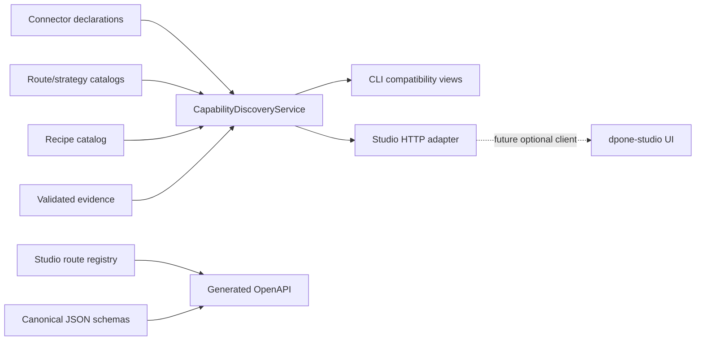

# ADR 0030: Self-service capability projection and Studio boundary

## Status

Accepted.

## Context

Connector identity, release phase, route support, route certification, and
evidence status are currently projected independently by connector CLI,
marketplace, readiness certification, documentation, and the Studio API. The
projections disagree and can claim success or certification without current
evidence.

The existing Studio bridge also constructs domain services internally and owns
transport, authentication, CORS, error mapping, audit state, connector lists,
quality translation, and GitOps command generation. This duplicates policy and
makes the external API unsafe to treat as a stable product boundary.

## Decision

`CapabilityDiscoveryService` is the single read-model composer for self-service
capability discovery. It reads explicit immutable snapshots from:

1. import-safe connector declarations;
2. route and strategy catalogs;
3. declarative recipe catalogs;
4. optional, strictly validated certification evidence.

It does not replace those authorities. It projects them into
`dpone.capability-discovery.v1` and computes a deterministic semantic digest.
Evidence freshness is evaluated against an injected trusted UTC clock at the
composition boundary, never against a timestamp supplied by the evidence
being evaluated. Long-lived Studio processes inject a snapshot provider, not a
process-lifetime snapshot: each use case captures one immutable snapshot after
rechecking local evidence freshness, then uses that same snapshot throughout
the request.

The following axes remain distinct:

- connector maturity;
- connector release phase;
- route support;
- route certification level;
- evidence status.

Missing, stale, malformed, mocked, skipped, foreign-commit, or unavailable
evidence is `UNVERIFIED` and cannot certify a route.

Readiness application services own capability projection, recipe discovery,
canonical compilation, planning, Airflow explanation, evidence validation, and
redaction. The HTTP adapter owns bounded transport validation,
authentication/CORS, typed error mapping, serialization, and process-local
audit. The UI owns presentation and browser state only.

CLI and HTTP call the same injected application services. They do not call each
other or use subprocesses. Marketplace, readiness certification, and legacy
Studio catalog helpers become delegating compatibility views.

Malformed recipe authority is visible for discovery but blocks scaffold,
draft, plan, and static-check operations before filesystem writes. Legacy
connector-certification shapes are serialized from canonical connector
declarations and never instantiate a second certification matrix.

The bundled stdlib HTTP server is a local development adapter. It binds to
loopback by default. Non-loopback startup requires explicit remote opt-in, a
shared token, and exact allowed origins. This decision does not claim
production hosting or RBAC.

OpenAPI is generated from the same route registry used for dispatch. The
loopback default profile documents local-operator access; a token-configured
server serves an OpenAPI profile that requires bearer authentication on every
non-public operation.

The request timeout is a response deadline. A timed-out application thread
retains its bounded-concurrency slot until it actually returns because stdlib
threads cannot be killed safely. All Studio operations therefore use bounded
local I/O and no vendor/network waits. This adapter is not a remote execution
sandbox.

Existing `/api/*` endpoints remain deprecated compatibility surfaces for at
least two minor releases and 12 months. Some are aliases or migration views of
`/api/v1`; others are retirement-only operations with no v1 replacement. The
canonical API is `/api/v1/*`. Safety fixes may replace false success with
fail-closed errors without a compatibility escape hatch.

Studio 0.1 is read-only. Mutating authoring requires a separate plan/apply
contract using existing confined scaffolding transactions, plan digests,
expected source fingerprints, idempotency keys, and CAS. Studio never owns a
configuration database or credential values.

## Consequences

- All public capability surfaces can be tested for semantic parity.
- Long-lived Studio cannot retain a certification `PASS` beyond its configured
  freshness window.
- Connector maturity no longer implies route certification.
- Missing live evidence is visible instead of silently promoted.
- Studio remains connector-neutral and can be replaced without changing core
  policy.
- The first API release stays dependency-light but needs explicit transport
  modules for security, audit, routing, and OpenAPI.
- Some legacy consumers will receive `UNVERIFIED` or nonzero certification exit
  codes where they previously received false success.
- A separate UI release can be generated from OpenAPI without parsing CLI
  output or duplicating YAML semantics.
- Machine-readable JSON is authoritative connector certification evidence.
  Markdown is a regenerable projection and is not represented as a crash-atomic
  pair with JSON.

## References

- [Feature design: Self-service capability discovery and Studio v1](../feature-design-studio-capability-self-service-v1.md)
- [ADR 0001: Layered architecture](0001-layered-architecture.md)
- [ADR 0014: Route attestation production trust](0014-route-attestation-production-trust.md)
- [ADR 0015: Single authoring compiler](0015-single-authoring-compiler.md)
- [ADR 0023: Confined authoring transactions](0023-confined-authoring-transaction-semantics.md)
- [ADR 0025: Process-local quality-gate authority](0025-process-local-quality-gate-authority.md)
