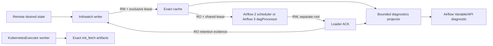

# ADR 0032: Airflow convergence is bound to an exact activation occurrence

## Status

Accepted.

## Context

Release and deployment digests identify immutable content. They do not identify
one switch of `current`, and the same deployment can be activated again after
rollback. Airflow can also retain serialized metadata for unchanged DAG IDs,
so visibility alone cannot prove that the newest local cache was parsed.

Kubernetes projects desired ConfigMap data eventually and each parse component
uses a pod-local `emptyDir`. A local filesystem lock can linearize one cache,
but it cannot make all pod caches globally atomic.

## Decision

- Generate one opaque lowercase UUIDv4 occurrence in the trusted promotion
  plane. Every pod-local `current` switch for that desired-state occurrence
  persists the same value as `activation_id` in its pointer and promotion
  audit. Standalone local promotion generates its own UUID when no trusted
  desired-state occurrence exists.
- Keep desired-state v1 parsing backward-compatible with its published
  canonical-UUID contract, but require UUIDv4 before an occurrence is eligible
  for activation. A historical non-v4 envelope remains inspectable and must be
  republished by the trusted promotion plane; it is rejected before cache
  snapshots, permission changes, or the `current` switch.
- Treat historical loader ACK v1 as diagnostic-only. New providers write ACK
  v2 requiring the UUID and exact index identity.
- Hold a shared cache lock for the complete indexed parse. Write ACK v2 to a
  separate parser-writable root while that lease still pins the parsed cache
  identity. The parser cache itself remains read-only.
- The cache writer reads the separate ACK root read-only when planning
  retention. Cache activation/history/retention remain serialized by the
  exclusive cache lock; ACK publication never mutates cache authority.
- Key exact verified history by `activation_id`, commit it durably before any
  deletion, and disable destructive retention while a blocker exists.
- Store the deterministic activation-guard digest as pointer attestation so an
  idempotent replay differs from a new promotion event selecting the same
  deployment.
- Treat source `CI_JOB_ID` as uniqueness/correlation only, never as an ordering
  clock. Infrastructure verifies canonical source project, exact job SHA and
  current branch head; ConfigMap replacement uses Kubernetes
  `resourceVersion` compare-and-swap.
- Use scheduler as status authority for Airflow 2.10 and dagProcessor for
  Airflow 3.x. Prove cluster convergence through Airflow REST and the full
  expected DAG set.
- Model cross-pod rollout as eventual. The local ConfigMap guard proves stable
  bytes within one transaction; it is not described as a global fence.

## Consequences

- Same-content reactivation is auditable without abusing timestamps or inode
  identity.
- Legacy caches remain readable but must be reactivated before exact
  convergence and retention are enabled.
- Missing or stale parse evidence consumes cache capacity rather than deleting
  rollback data.
- Partial retention failure is visible as possible mutation, not an opaque
  exception.
- A temporary stale pod-local projection can exist, but all components that
  observe the same desired-state occurrence use one activation identity. The promotion pipeline
  cannot report success until the authoritative status and Airflow REST
  converge to the requested evidence.
- A delayed source job cannot promote after `master` moves, and concurrent
  desired-state writers cannot silently overwrite one another.
- A parser compromise or configuration error cannot use ACK publication to
  replace `current`, its pointer, reconcile evidence, or immutable artifacts.

## Rejected alternatives

- Generating a different activation UUID in every pod-local cache: it prevents
  runtime evidence from matching the authoritative parse occurrence during one
  eventual multi-pod rollout.
- Deriving activation identity from inode, mtime, path, or deployment digest:
  these values are unstable or cannot distinguish occurrences.
- Reusing ACK v1 with changed fields: published schema versions are immutable.
- Kubernetes Lease for pod-local cache atomicity: a lease does not prove that
  the holder sees the newest ConfigMap projection and does not merge separate
  `emptyDir` caches.
- Remote I/O during DAG parse: it couples scheduler availability to object
  storage and creates unbounded parse latency.
- Ordering promotions by `CI_JOB_ID`: GitLab documents job IDs as unique but
  does not define them as a deployment ordering guarantee.

## References

- [Feature specification](../feature-design-airflow-exact-activation-occurrence-v07321.md)
- [ADR 0008: Airflow parse-safe provider](0008-airflow-parse-safe-provider.md)
- [ADR 0009: Artifact delivery and cache materializer](0009-artifact-delivery-and-cache-materializer.md)
- [ADR 0040: Legacy Airflow pack cache authority](0040-airflow-legacy-pack-cache-authority.md)
- [ADR 0041: Crash-safe Airflow cache retention](0041-airflow-cache-retention-transaction.md)
- [Airflow cache sync](../airflow-cache-sync.md)
