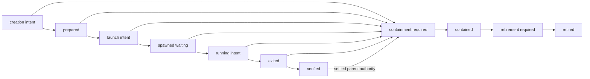

# ADR 0072: Bounded TDS workers retain separate recovery authority

Status: Accepted design; component integration implemented; route certification incomplete.

Audience: runtime maintainers, connector authors and platform engineers.

## Context

An optional TDS bulk writer can remove the external BCP process from the data
conversion path. That alone does not establish faster confirmed delivery or
whole-window atomicity. A driver can commit earlier batches before a later
failure, and an iterator error can be swallowed by a successful SDK return.
An ambiguous process or SQL outcome must not create a second active attempt.

The existing [publication contract](0057-bounded-window-atomic-publication.md)
and [raw source contract](0071-native-raw-single-query.md) continue to govern
source scope, verified staging, target publication, evidence and checkpoints.

## Decision

Select TDS explicitly through `native_chunks.transport`; omission retains BCP.
Bind the resolved transport and resource policy into native chunk journal v3.
Preserve the exact v1/v2 record shapes and lookup keys. Changed policies or
implementation identities cannot resume an unresolved invocation.

Initially admit exact `bigint`, `float(53)`, `nvarchar(max)` and `datetime2(6)`
layouts with declared nullability. Both rows and Arrow inputs use the existing
sealed native files. Arrow temporal conversion uses integer microseconds.
Unsupported layouts fail admission; no coercion or fallback is implicit.

The input adapter bounds each encoded row before payload allocation, bounds Arrow
batch rows, and independently establishes natural EOF, decoded count and the hash
of consumed bytes. It also checks the pinned regular file before and after
consumption. Nonblocking, no-follow opening rejects substituted FIFOs and symlinks.
These checks establish input completeness, not SQL success or an RSS limit.

Each import attempt has a separate immutable identity and a bounded, versioned
CAS record. Its key uses target, invocation, ordinal and attempt; policy, build
and file changes therefore find and reject the existing record. The parent chunk
journal remains owned by the parent. The parent observes attempt snapshots but
does not obtain a supervisor writer by reading them.

Creation intent precedes CREATE. Confirm the committed object ownership before
recording `prepared`, and confirm grants before launch intent. Register the
validated child identity before sending credentials. Persist `running` before
credential release: that state means SQL effects are possible, rather than
proving the child has acknowledged execution.

Only the creating process and supervisor thread hold writer authority and the
last acknowledged CAS revision. An inherited handle fails after fork, before
acquiring an inherited lock. A second create fails even with the same supervisor
token. Recovery requires a newer lease fence, a new supervisor token and CAS of
the exact observed snapshot. Recovered writers can reconcile and retire; they
cannot resume CREATE, spawn or import from an old intent.

Any failed or ambiguous save permanently invalidates that writer handle. It
cannot reload and retry or authorize a new effect. Local containment through
already held process handles may still proceed. A journal fence does not itself
exclude SQL writers or resolve a check-to-effect race; exclusive target authority
and bounded coordinator connections remain separately injected capabilities.

An uncertain storage reply is `WindowOutcomeUnknown` from the first failure,
including creation and takeover acknowledgements. Known validation and CAS
rejections remain contract errors; neither permits automatic same-fence writer
reacquisition.

Process identity includes host identity, boot UUID, PID and process-start ticks.
Identity alone never authorizes signalling. The Linux worker must install parent
death protection, withhold credentials until durable registration, enforce its
address-space limit and finite deadlines, and be reaped or positively contained
before SQL retirement. Unknown containment retains resources and blocks replay.

Linux admission validates a nonzero machine identity, boot identity and a procfs
mount in the caller's PID namespace before source acquisition. Missing identity
is an admission failure; generating a replacement identity during recovery is
not permitted. An acquired pidfd is bound by identity checks before and after
opening it. Only its creating process and supervisor thread may signal or close
it. Bounded polling supports high descriptor numbers; direct-child reaping and
observed nonchild termination remain distinct outcomes.

Before optional imports or credential reads, the newly spawned child installs
and verifies `PDEATHSIG(SIGKILL)`, rechecks its parent, and lowers both address-space
limits without raising inherited finite limits. A matching parent PID alone does
not prove the creating supervisor thread is still alive. Durable registration,
the credential-release gate and a startup deadline remain mandatory.

The worker result channel carries one four-byte big-endian length followed by
at most 16 KiB of strict UTF-8 JSON. The closed versioned message binds the
canonical full attempt identity and either a complete input receipt or an error
enum. It contains no free-text driver diagnostics. The incremental reader checks
the length before buffering payload and rejects extra, truncated or ambiguous
messages. The supervisor calls its final validator only after observing actual
channel EOF; parsing cannot establish EOF or process termination by itself.
The attempt digest binds target names and ownership, while the separate lifecycle
object identity and coordinator verification establish the SQL object incarnation.

Private channel operations admit only nonblocking pipes, with exclusive descriptor
ownership retained by the supervisor. Partial reads and writes share the existing
absolute deadline. Even a complete frame must await actual channel EOF, and result
validation must finish before that deadline. A failed partial credential write is
an uncertain delivery requiring containment, not permission to resend credentials.

The fixed child bootstrap separates its result pipe from SDK stdout/stderr,
announces process identity, and waits for a complete private request. The closed
request binds policy, native file identity and the original row-size ceiling.
Only then does it compose the native decoder and pinned SDK adapter. Empty files
still require dependency admission and full input completion, without opening a
SQL connection. The parent supervisor must durably acknowledge identity and
credential-release intent before sending that request; child parsing alone does
not establish this authority or verify the actual implementation fingerprint.

Verified staging can be retired only under settled parent publication or rollback
authority. An unknown final commit cannot authorize cleanup. Retirement preserves
the verification identity and a tombstone; later attempts use new object names.
Confirmed absence settles logical retirement, while physical capacity must still
be observed before admitting additional work.

The direct-permission inventory preserves every writer and `public` permission.
For every positive class-1 object candidate it also records one exhaustive,
disjoint classification: either a fully authenticated owned-stage member or the
object ID in `excluded_object_ids`. Missing, duplicate and overlapping
classifications fail closed. The canonical inventory profile is
`sqlclient_direct_permissions_sql16_17_sysadmin_v2`; v1 was an unreleased
component contract and is intentionally superseded before route activation.
Catalog classification uses fixed `OPENJSON` batch projections with canonical,
bounded object-ID arrays. The opening and closing observations therefore use a
bounded number of catalog operations instead of one operation per unrelated
permission while retaining exhaustive omission and duplicate checks.

Fresh execution is composed by a nominal application executor that owns P7
through P10f ordering. The deployer provides immutable inputs and infrastructure
capabilities but cannot reorder authorization, credential release, GRANT,
process exit, remote verification or terminal projection.

## Consequences and alternatives

The worker requires Linux process primitives, a restricted writer principal,
separate coordinator authority and explicitly admitted SDK builds. Its memory
limit covers address space, not reserved RSS; parent and coordinator memory are
separate. An operation deadline includes CREATE, grants, startup and verification.
Timeout alone does not prove SQL rollback or cancellation.

Caller rollback, SDK row counts, zero process exit, table absence alone, or a
previous source query ID are insufficient whole-attempt recovery authority.
Replacing these capabilities with a generic workflow engine would obscure the
specific external-effect boundaries, so this design uses concrete typed events
and narrow observation/writer ports.

The current implementation has focused input, identity, lifecycle, SDK adapter,
result-framing, guarded child bootstrap, bounded journal actor and durable process
supervisor contracts. Synthetic SQL component integration covers rows and Arrow
with narrow and 100-column fixtures. Complete SQL coordinator integration,
bounded coordinator interruption,
permissions, complete fault matrix and whole-route live certification remain
required before rollout. Performance recommendations require paired measurements
of confirmed delivery, including verification and publication; no speed claim is
made by this decision. See [MSSQL guidance](../mssql.md) for the existing transport.

## Bounded journal ownership

A per-attempt journal actor creates and exclusively uses the writer and its
thread-affine backend client. The process-owning supervisor uses a separate
`TdsJournalGateway` port; it never performs backend journal I/O. Its snapshot
contains only acknowledged immutable state. Existing writer semantics remain
unchanged inside the actor.

Lifecycle creation, takeover and advancement accept a storage acknowledgement
only when its exact payload matches the submitted bytes and its strict integer
revision is positive, bounded and greater than the previous revision. Revision
numbers may skip values. A malformed reply is an unknown commit outcome, not a
successful transition or a known rollback. No factory returns a writer after
that reply; an existing writer retains its last acknowledged snapshot and is
permanently poisoned. Fresh observation under recovery may discover the commit,
but cannot revive the old handle or permit same-fence reacquisition.

The gateway permits one in-flight command from a closed journal-only command
set. Every reply wait has an absolute monotonic deadline. Commands that expire
before backend I/O starts are discarded. A timeout permanently poisons the
gateway: it does not cancel an already started write, whose commit may become
visible later. Late replies cannot authorize credential delivery or retry.
Reconciliation requires a newer fence and retains unresolved SQL resources.
The supervisor attempts process containment before another journal wait.

An injected run-scoped actor pool bounds all live actors, including actors stuck
in initialization, backend I/O or teardown. Capacity is reusable only after the
thread actually terminates. A newer fence does not bypass this local bound.
Shutdown never performs an unbounded join. Actor commands cannot execute worker,
credential-release or SQL-target callbacks.

Validation must include a genuinely blocked store before and after credential
release, late RUNNING and EXITED commits, expired queued commands, blocked
teardown, retained capacity and absence of credential resend or retry after late
acknowledgement. This design refinement does not itself certify the implementation.

## Launch failures and executable origin

A failed launch may retain process and pipe ownership without a fully validated
worker identity. `TdsLaunchUnknown` carries a separate `TdsUnresolvedLaunch`
capability; supervisors must preserve it explicitly. It cannot masquerade as a
registered worker. Missing authenticated pidfd authority forbids numeric PID
signalling. Descriptor cleanup detaches each descriptor before its single close
attempt and attempts other owned resources even if one close fails.

The source fingerprint must describe the code actually executed. An inherited
working directory, user site configuration or stale bytecode must not select an
alternative framework implementation. The admitted Linux launcher uses a
fixed source-loaded shim with isolated Python startup, disabled automatic site
initialization, explicit dependency paths and a private empty bytecode prefix.
The shim installs process guards before optional imports. The guarded child
checks the immutable installation and announces its digest and origin through
the bounded startup pipe. The active process owner compares bounded messages;
it does not synchronously walk or hash installation files while a child is live.

This launch refinement requires actual pinned SDK smoke tests in the admitted
interpreter environment. Source identity does not establish SDK binary identity,
and file-size limits do not establish filesystem I/O time bounds. This refinement has component review and synthetic Linux SQL smoke evidence;
complete interpreter/SDK build admission and route certification remain required
before rollout.

## Composition and decoded-input boundaries

The fixed Python worker entrypoint and its private job codec belong to
`dpone.app`: they compose concrete infrastructure and serve the application IPC
boundary. The separate SqlClient backend keeps its pure, shared job DTO and wire
codec in `dpone.contracts`; those records perform no I/O or composition. Native
layout admission and exact scalar conversion remain runtime policy. A narrow
`TdsRowDecoder` port exposes admitted immutable column metadata, input mode and
bounded decoded rows with byte observation.

The `NativeTdsInput` infrastructure adapter receives this decoder through
composition. It owns file descriptors, sealed-file checks, hashes, one-shot
completion receipts and optional Arrow allocation. It does not import runtime
policy. These new, unreleased internal TDS module paths migrate together; no
runtime facade imports application or adapter implementations. Existing published
native framing and policy imports retain their compatibility contracts.

## Coordinator process isolation

Coordinator admission must not rely on closing a native driver connection from
another thread. A failed isolated development probe rejected that mechanism.
Each coordinator operation instead requires a dedicated guarded subprocess,
with connection creation, use and close confined to its child thread. Reuse the
existing process guard, pidfd, isolated source loading and bounded IPC primitives.
The privileged coordinator role has a separate closed protocol for owned CREATE,
observation, grants, verification, retirement and capacity observation; it accepts
neither arbitrary SQL nor a caller-selected executable module.

Persist coordinator operation intent separately from the bulk worker lifecycle.
Register the authenticated local process before releasing privileged credentials.
Establish and durably bind the remote connection/session incarnation before
allowing mutation. A stored SPID alone never authorizes signalling or SQL KILL.
SQL-side exclusive DDL authority covers ownership checks and effects continuously.
A delayed old command must settle before recovery obtains that authority, or fail
a fence check inside the same SQL authority boundary.

The selected implementation direction serializes settlement before recovery with
one session-owned Exclusive application lock, acquired before session registration
and held through grant, CREATE, commit observation and connection teardown. The
lock resource excludes mutable ownership fences and operation UUIDs. All target
lifecycle operations must use the same database incarnation, canonical target
identity and fixed principal namespace; accept only documented acquisition return
codes 0 and 1, and verify that the lock remains Exclusive.

WindowStore takeover is not SQL revocation. A grant sent after the last authority
check races with takeover and may let the already locked old CREATE complete.
A replacement must acquire the same lock, then revalidate its current journal
lease before receiving its own grant. An old result cannot advance the parent
under a lost lease. Certification must exercise this precise delayed-grant race.
An application lock does not fence arbitrary external privileged DDL; unexpected
ownership or object changes must remain failures requiring reconciliation.

Expiry permits bounded process containment and reaping; it does not prove remote
SQL cancellation or rollback. Unknown operations require fresh reconciliation
under current SQL authority, without replaying the original command. CREATE and
its ownership property remain atomic. Retirement applies only to the exact owned
incarnation, and DROP plus authoritative absence share one deadline. Unproved
local termination, remote settlement, ownership or capacity retains reservations
and forbids replacement.

This replaces the earlier requirement for bounded cross-thread driver interruption
with bounded process interruption plus separately proven remote settlement. The
coordinator implementation remains incomplete. Admission requires blocked SQL,
login stalls, cleanup failure, lost acknowledgements, parent death and delayed
old-command/recovery races; driver timeouts and process exit alone cannot pass it.

## Capability cohesion

Journal observation, writer authority and bounded gateway access form one journal
port family. Process launch and unresolved local ownership form a separate worker
port family. SDK input completion shares the decoded-input boundary. Concrete
clients depend only on the capability they use; these unreleased prototypes do
not retain broad convenience re-exports.

The shared child-resource owner now retains the process, authenticated pidfd,
descriptors and cleanup resources. Protocol adapters own message validation and
policy binding. Resource detachment precedes each descriptor close, and cleanup
attempts every owned resource while preserving the first error. Unknown launch
or reaping retains its capability; this local owner never certifies SQL settlement.

The pipe adapter transports bounded framed bytes through actual EOF. The managed
worker interprets the result against attempt/input identity and checks the deadline
again after interpretation. Scalar admission, exact conversion and stream decoding
share one runtime representation-policy module, without filesystem or SDK duties.
These boundaries preserve the separate failure semantics of transport, process,
input and durable state; metrics remain independently measured acceptance gates.

## Remote session continuity primitive

The coordinator child receives an exclusive cursor and creates a
`TdsCoordinatorSession` on its owning process and thread. Initialization is
one-shot: it requires one visible own-session row with empty context, no explicit
transaction, and implicit transactions disabled before setting a 32-byte nonce.
A lost initialization or observation acknowledgement permanently poisons the
handle. Only the connection owner performs cleanup; this primitive never retries,
reconnects, resets context, closes the driver or authorizes business effects.

Each observation binds the physical connection UUID, session ID, connection and
login timestamps, exact nonce, and a versioned digest of server/replica, database
name/ID/GUID, effective/original login names and SIDs, and database principal
name/ID/SID. SQL timestamps retain their server representation without assuming a
timezone. Request/connection identity, cardinality and MARS diagnostics are checked
before accepting the observation. Missing metadata or permissions fail closed.

A repeated check only reads the session. Pooling may reuse a connection UUID, so
UUID equality alone is insufficient. The DMV context must equal all 32 nonce bytes,
including trailing zeros; it is not trimmed or reconstructed. Mutable context is
continuity evidence, not authentication. Transaction diagnostics are checked
separately: no explicit transaction admits `@@TRANCOUNT=0` with committable
`XACT_STATE` 0 or 1, as observed for SDK autocommit requests. An explicit coordinator
transaction requires exactly one transaction and `XACT_STATE=1`. Doomed, nested
and implicit transactions are rejected.

Retain the exact 32-byte coordinator contract. A bounded local pyodbc experiment
exercised the unmodified adapter and observed `s.context_info` preserving those
bytes, including trailing zeros, across explicit transactions. `CONTEXT_INFO()`
returns a different padded representation; that function is not this adapter's
observation source. Do not trim or accept either length interchangeably. Normal
session and lock continuity observations do not certify fault recovery or the
complete executable coordinator.

The privileged Python coordinator will use pyodbc with Microsoft ODBC Driver 18,
subject to exact-build live admission. Its isolated child disables pooling before
the first connection and enables native UUID results for the strict observation
contract. Connection recovery, MARS and execution retry rules are disabled. One
connection and cursor own handshake, explicit CREATE transaction and teardown;
driver timeouts supplement the outer process deadline. This driver decision does
not select or certify the separate bulk data writer.

This implements session observation only. Durable process/session registration,
one-shot mutation authorization, continuous SQL fencing and fresh remote-outcome
reconciliation remain mandatory before coordinator activation. Session disappearance
or local process exit never independently authorizes cleanup or retry.

Primary references, accessed 2026-09-15:
[connection DMV and MARS/permission semantics](https://learn.microsoft.com/en-us/sql/relational-databases/system-dynamic-management-objects/sys-dm-exec-connections-transact-sql),
[session identity metadata](https://learn.microsoft.com/en-us/sql/relational-databases/system-dynamic-management-objects/sys-dm-exec-sessions-transact-sql),
[session context](https://learn.microsoft.com/en-us/sql/t-sql/statements/set-context-info-transact-sql),
and [transaction state](https://learn.microsoft.com/en-us/sql/t-sql/functions/xact-state-transact-sql).

Remote session registration uses the closed `dpone.tds.remote-session.v1` wire
record. Decode is bounded to 1 KiB and rejects duplicate, missing and extra fields,
coerced numbers, noncanonical UUID/hex spellings and timezone-bearing timestamps.
Nonce and authority digest use lowercase fixed-length hex; timestamps retain six
fractional digits. JSON whitespace does not affect identity. This codec is shared
by durable registration and phase IPC; it does not itself persist or authorize an
operation.

Coordinator recovery must locate unresolved records without enumeration support
from `WindowStore`. Use a stable coordinator slot, reserved durably by the parent
before launch, in the lookup key. A new UUID, command digest or SQL owner epoch
must find and reject a conflicting existing slot rather than create an unrelated
record. The coordinator directory and journal below implement these separate
reservation and lookup responsibilities.

## Coordinator directory discovery and admission

A separate coordinator directory can use the stable parent locator (target, run,
chunk ordinal and retry number), preserving existing parent record formats.
`NativeChunkJournal.attempt_coordinates()` exposes these coordinates directly,
including abandoned retries after stage completion. It does not parse opaque run
IDs, perform storage I/O, reconcile children or establish an admission barrier.
The directory may be created only after its parent attempt is durably recorded.

Recovery must probe every attempt's directory on partial and completed paths,
before publication and before cleanup. The current completed-stage early return
has not yet been integrated with this requirement. Reservations, directory scans
and publication/cleanup admission must share exclusive fenced authority; a scan
followed by an unfenced new reservation is insufficient.

A new normal slot cannot bypass an unresolved earlier operation. Reconciliation
must reference that operation, require proven local containment and current fenced
SQL authority, and never resend the original command. Reserve each immutable slot
through fenced CAS before creating its operation record through fenced CAS.
Missing child state proves no launch only after excluding a late old-fence write.
Lost acknowledgements poison the writer and require observation under a newer
fence. Reject changed identities, gaps and corrupt records; do not reconstruct
history from current configuration.

The directory's entry and encoded-byte bounds must be derived from the admitted
normal/reconciliation command matrix and preserve capacity for required retirement.
Exhaustion stops new effects and retains unresolved resources. History compaction,
slot reuse and replacement parent identities are not escape paths. The directory,
its admission barrier and its integration remain implementation work.

### Work sealing, retirement and final closure

Work sealing and final directory closure are separate irreversible transitions.
Sealing requires settlement of every earlier coordinator operation and blocks new
normal work. It protects staging for publication; it must not require deleting
that staging first. A separate retirement authorization binds the exact parent
attempt and staging incarnation before cleanup operations can be reserved.

Retirement distinguishes two cases. A failed, unverified attempt may be retired
after worker containment and authoritative proof that it never became eligible
for publication, allowing a retry within the same active window. Verified staging
requires a confirmed applicable parent publication receipt or authoritative parent
abort/rollback. Never fabricate an aborted parent merely to clean up a failed
chunk. The existing attempt lifecycle's contained/retirement state carries this
distinction; composition must verify its durable current binding.

Settled coordinator operations do not prove successful object deletion. A DROP
that fails with a known permission error is settled while the table still exists.
Final resource release additionally requires exact owned-object absence, or proof
that creation never started, plus the bound retirement closure receipt. Bulk-worker
containment must precede retirement independently of coordinator settlement.

Reconciliation preserves both the original operation and preceding reconciliation
links. Settling a reconciliation child does not automatically settle the original
CREATE or DROP. Reject branches, cycles and attempts to skip an unresolved root;
resolved ancestor updates must be atomic in the directory state. Preserve linked
unknown outcomes after lost reconciliation acknowledgements.

Reserve capacity for the entire remaining closure sequence, including retirement
reconciliation and worst-case terminal proof encoding. Other work cannot consume
that reserve. Repeated sealing, authorization or closure is idempotent only for an
identical binding; conflicting observations fail closed. Typed proof records are
not database evidence by themselves: the composition verifies their exact parent,
operation, object and receipt bindings before advancing durable state.

### Reading a saved coordinator directory

The directory decoder receives the original parent identity and the previously
admitted limits from trusted composition. It bounds the input before JSON parsing
and the slot count before constructing nested records; limits stated inside the
record cannot expand those bounds. Duplicate, missing and extra fields, changed
parent or resource policy, noncanonical operation UUIDs, gaps and mismatched proof
bindings are rejected. Existing lifecycle decoding validates the contained attempt
observation used for retirement authorization.

An invalid record stops recovery. Do not delete it, silently recreate an empty
index, choose a fresh UUID or infer missing history from current configuration.
Preserve the record for diagnosis and restore only from an authoritative matching
backup or a separately approved recovery procedure. The decoder itself performs
no persistence, SQL work, resource release or reservation. Its implementation is
integrated as a component with the directory model; route composition is pending.

The storage envelope binds the directory to its owner, fencing epoch and
supervisor UUID. Its revision comes from the state store, never from a duplicate
JSON field. A snapshot cannot claim an owner whose epoch precedes a reserved
operation. The envelope has a fixed additional byte allowance for ownership; it
cannot consume the directory's reserved retirement capacity. Reading a snapshot
does not acquire writer authority. History must keep retirement and its linked
recovery operations in a suffix: ordinary work after retirement is invalid even
when every recorded operation claims settlement. The directory storage adapter enforces exact-payload acknowledgements and
strictly advancing store revisions. Lost replies or uncertain authority reads
permanently disable the writer; recovery uses a new fencing epoch and a distinct
supervisor UUID. Reads return immutable snapshots without writer authority.

Initial creation requires the exact durable parent in `CREATION_INTENT` with
matching ownership. Retirement authorization must match the durable parent
observation. The composition root must serialize these parent transitions with
directory operations: the store provides single-key CAS, not a cross-record
transaction. The adapter and bounded directory gateway are integrated as components. SQL
authority and the end-to-end publication/recovery path remain pending.

### Directory actors and shared capacity

The unpublished coordinator and directory request families live alongside their
gateway protocols in `dpone.ports`. These are in-process interface messages;
durable identities, state transitions and evidence remain in `dpone.contracts`.
Coordinator persistence composition opens journal and evidence owners through
separate functions on the injected pool. Their authorities and transactions
remain independent. This relocation changes implementation identity, so previous
live receipts remain bound to their original source revision.

`TdsActorPool.open(build, deadline=...)` admits lifecycle, directory and observer
actors through one run-scoped capacity budget. Composition supplies a trusted,
bounded allocation-only constructor for the concrete actor; backend context entry
and I/O happen only on the admitted actor thread. The pool rejects closed,
exhausted or expired admission before calling the constructor. It verifies the
constructed actor's process/thread owner, exact clock and initial deadline, and
that it has never been admitted or started. Reservation precedes thread start;
an uncertain start retains its shutdown capability and reservation.

The scheduling core imports no concrete journal kind or command contract. A timed-out initializer, read, write or context exit
continues occupying its reservation until actor-owned completion and actual
thread termination are both established. Pool shutdown signals every actor
before waiting against one absolute deadline. Neither a different journal kind
nor a newer fencing epoch bypasses this resource bound.

Initialization explicitly selects `ReadDirectory`, `CreateDirectory` or
`TakeOverDirectory`. The injected store context is entered and exited on the
actor thread; creation and takeover acquire the thread-confined writer there.
A read-only initialization returns `DirectoryObservation`, whose snapshot may be
absent. It cannot accept writer commands or implicitly create a directory.

Writer gateways accept only the closed `DirectoryRequest` family through
`execute(request, deadline=...)`. Callback submission, arbitrary method names,
SQL text and replacement state objects are not supported. The caller supplies
an absolute monotonic deadline. An expired queued request never enters the
backend. A timeout permanently disables further commands without pretending to
cancel a backend write; a late commit cannot replace the last acknowledged
observation. Use a newer-fence recovery observation to reconcile durable state.

`CloseDirectoryAdmission` is a durable state transition. Gateway `close()` only
bounds waiting for actor teardown; it does not close durable admission, establish
remote SQL quiescence or release a staging-table reservation. Parent/directory
serialization still belongs to composition: two bounded actors alone do not
provide a cross-record transaction or SQL writer exclusion.

### Serialized attempt composition

SqlClient uses explicit attempt schema 2 in the existing journal and CAS key.
Schema 1 records retain their exact wire fields and encoding. The new backend
records immutable technical evidence references for credential intent, independent
writer observation and one-shot grant intent, in that order. Empty inputs cannot
acquire writer or grant references; a nonempty successful exit requires the grant
intent. The supervisor must validate the full original bindings in referenced
evidence before sending a grant: these hashes do not independently prove SQL
authority or delivery. A lost acknowledgement poisons the existing writer;
takeover retains all original references and permits only reconciliation and
retirement. It cannot resend a grant. Reading an older record never upgrades its
backend or changes its implementation identity.

`create_tds_attempt()` acknowledges the lifecycle's creation intent before
creating the directory. Each actor enters its own injected store context; the
composition checks both exact identities, admitted limits and ownership before
returning a `TdsAttempt`. The attempt owns the gateways exclusively on its
creating process and thread and rejects reentrant access. Callers receive
immutable observations and closed reservation operations, never raw gateways or
an arbitrary lifecycle-transition method. A failed or ambiguous command poisons
this owner. Teardown signals both gateways against one shared deadline; retained
actor capacity and durable records are not released by an uncertain outcome.

`recover_tds_attempt()` accepts exact previously observed lifecycle and directory
snapshots under a fence newer than both. A partial takeover may leave the parent
at a newer fence than the directory; this is recoverable under another newer
fence. Equal-fence mismatched owners or a directory ahead of its parent are
rejected. Recovery never creates a missing directory. Both takeovers must be
acknowledged before any usable composed owner is returned.

Retirement requires durable containment and the existing applicable parent
publication or abort authority. Initial authorization captures the exact
acknowledged retirement-required state under serialized ownership. Historical
retirement authorization remains immutable across takeover: composition may
reuse it only when every proof field is unchanged and ownership, sequence and
phase differences describe legal takeover/retirement progression. Nonadjacent
supervisor-token reuse is valid after at least two legal takeovers; one-step
reuse remains invalid. Fresh RETIRE reservations use the current fence and
cannot bypass an unresolved prior command. Sealing or closing admission proves
neither remote SQL settlement nor permission to release staging capacity.

This component integrates creation and exact-observation recovery of the journal
pair. The privileged SQL coordinator and its trusted preparation/grant proofs,
worker execution through this owner, whole-route attempt enumeration,
publication and full route recovery remain unfinished. No caller-supplied digest
can stand in for the missing physical proof producer. Component actor/storage
tests do not certify live SQL behavior or the complete delivery route.

### Read-only attempt discovery

`observe_tds_attempt()` reads the lifecycle and coordinator directory through
separate read-only actors with the same absolute deadline. It closes the first
actor before opening the second, so discovery can operate with one pool slot.
Directory lookup still occurs after acknowledged lifecycle absence; an orphan
record must remain visible for diagnosis. `TdsAttemptObservations` binds both
snapshots, including absence, to the requested identity and admitted directory
limits. It grants no writer authority and does not represent an atomic read of
two records; recovery still compares both exact saved observations through CAS.

The distinct `TdsAttemptObserverActor` exposes no writer commands. A failed read,
wrong identity, ambiguous initialization or failed teardown returns no usable
pair and retains shutdown capabilities. The composition checks the pool's clock
again after the final teardown; completion after the common deadline is rejected
even when both reads finished earlier. Already-settled actor-close behavior is
unchanged. Late reads cannot refresh authority or free a still-live actor slot.

This API observes one known attempt. The route must still enumerate and inspect
all recorded attempts and coordinator operations before reuse, publication or
cleanup, including completed and partially recovered invocations. Observing a
missing record never authorizes creation, source replay or resource release.

### Coordinator operation barriers

The coordinator operation contract has its own bounded version-one record. Its
stable lookup combines the parent directory locator and slot index. Changing an
operation UUID, command, original fence or admitted implementation cannot create
an independent record for the same reserved slot. Decoding also requires the
complete expected identity; a matching lookup alone does not establish identity.

Normal execution advances exactly once through intent, authenticated process
registration, credential-release intent, remote session registration, grant
intent and result receipt. The trusted session observer must establish continuous
SQL authority before registration; a session value or observation digest cannot
establish that physical fact by itself. The grant binds the original execution
owner, authenticated process, remote session and operation. Its durable intent
acknowledges possible delivery, not successful execution or permission to resend.

Failure, local containment and remote settlement remain independent observations.
An explicit no-process or no-session observation requires external evidence and
cannot be inferred from an early phase or an absent field. In particular, no
session observed does not mean no future mutation is possible. Coordinator
observations never establish settlement of a separate bulk-writer connection.

Newer-fence takeover preserves the original execution owner and any acknowledged
grant or result. The new owner can record failure and reconciliation observations
but cannot continue credential delivery or grant the old command again. A new
reconciliation command requires a separate directory reservation. Closed strict
JSON rejects unknown and duplicate fields, impossible phase/evidence combinations,
identity drift and payloads exceeding 16 KiB.

The coordinator journal persists this contract through the existing WindowStore
single-key compare-and-swap operation. Creation verifies the acknowledged original
directory reservation and current ownership; a newer owner cannot manufacture a
fresh executable record for a missing old operation. Read-only directory access is
injected, keeping concrete journal construction at the composition root.

Every storage acknowledgement must return the exact submitted payload and a strict
positive increasing revision. An uncertain write, malformed acknowledgement or
interruption poisons the writer and preserves its last acknowledged snapshot;
there is no implicit reload-and-retry. Writers are confined to their creating PID
and Thread object and reject reentrant calls before backend I/O. Takeover compares
the exact stored observation and retains the contract's non-replaying recovery
semantics. These two journals do not provide a cross-record transaction.

Durable operation storage is implemented as a synchronous actor-owned primitive.
The coordinator actor now runs those operations through the same bounded actor
core and pool. Its closed read/create/takeover initialization checks the full
expected operation state and revision. Read-only mode cannot acquire write
authority. Advance requires the exact pure next state and an increasing revision;
assertion and idempotent observations must preserve the identical snapshot. Late
acknowledgements cannot refresh the trusted observation after timeout.

The coordinator composition root constructs the lifecycle observer, directory
observer and coordinator journal inside one actor-owned store context. Creation
and exact takeover return a gateway only after authority acknowledgement.
Read-only observation binds identity and limits even when absent and returns only
after successful teardown plus a final deadline check. Failure preserves its
original exception and any retained actor shutdown capability; it does not create
missing parent/directory records or retry a lost acknowledgement.

The guarded process transport, concrete SQL authority producer and CREATE
supervisor are implemented components. Route orchestration and the trusted
settlement producer still require integration.
The journal is not a complete executable or certified TDS route.

## Executable CREATE contract boundary

The initial CREATE component has a separate bounded profile of 1 through 100
columns. Its request preserves the existing parent identity, a fresh object nonce,
ordered names, the four admitted scalar types and exact nullability. This profile
does not narrow general native or TDS admission; the executable composition must
reject unsupported width before reserving a directory slot or launching a child.
The command digest covers the complete request without embedding its own digest.

Typed authority observations retain actual database incarnation and schema facts,
full remote session identity and a fixed database-wide session Exclusive applock.
All participating lifecycle coordinators use resource
`dpone.tds.coordinator.ddl.v1` with principal `public`. This serializes their DDL
within a database and avoids splitting authority through identifier spelling
aliases. Bulk data writing requires its separate containment protocol.

CREATE evidence has bounded catalog metadata, exact ownership and a fresh object
nonce, grant/command/authority bindings, and explicit commit/emptiness observations.
A well-formed encoded receipt alone does not prove SQL effects. The concrete SQL
producer, guarded child protocol and durable CREATE supervisor are implemented;
route reconciliation still requires integration and live failure validation.
Any received validated evidence
must survive later teardown or journal uncertainty together with the retained
process and actor capabilities; uncertainty never authorizes replay.

### Guarded CREATE child

The fixed coordinator entry point uses five anonymous pipes for startup,
credentials, SQL authority, execution grant and result. Each phase accepts one
bounded frame through EOF; partial delivery is not retried. Source identity and
the explicit interpreter, extension, driver and driver-manager admission inputs
are checked before startup acknowledgement and before credential material is read.
The production connection profile verifies TLS. The synthetic local profile is
an explicit test profile, not a fallback after failed production admission.

The private credential envelope binds the original operation and execution owner,
authenticated process, launch nonce, session nonce, request and admitted profile.
It accepts structured connection fields; caller-supplied connection strings or
obsolete timeout fields are rejected. Credential bytes belong only in memory and
the credential pipe, never in persisted receipts or diagnostics.

The child acquires its continuous session lock before reporting authority. It
accepts one grant matching the complete operation, original owner, process,
session and authority receipt, then invokes CREATE once. A rejected pre-grant
message produces no fabricated grant-bound result. An observed committed result
is emitted once and retained through subsequent cleanup. A later close failure
causes a nonzero child exit without replacing that result with another frame.

These are internal component contracts. The CREATE supervisor persists registration
and release intents before sending credentials or a grant, retains complete result
evidence, and requires the relevant acknowledgements and zero child exit before
returning its CREATE outcome. Process reaping alone does not prove remote SQL
settlement. This component does not expose a completed bulk-load route or certify
seven-day transport, recovery, publication or release readiness.

### Structural decoding dependency

CREATE, authority and child-envelope codecs share exact dataclass field,
string-enum and canonical-UUID checks through `dpone.contracts.strict_record`.
They do not depend on the coordinator state codec for these checks. This keeps
structural admission independent of operation-state policy and avoids a reverse
dependency between otherwise separate wire contracts.

Domain codecs continue to own nested reconstruction, size limits, value rules and
public error translation. The extraction preserves serialized bytes and existing
state-codec helper aliases; it does not change authority, replay or recovery
semantics. Source manifests must nevertheless be regenerated for the changed
implementation. Earlier live receipts remain evidence for their recorded source
identity, not certification of a later refactor.

The CREATE models, request/evidence encoders, decoders and digest functions share
`dpone.contracts.mssql_tds_create`. Their representation and validation form one
bounded contract. The separate, unpublished `mssql_tds_create_codec` module is
removed before release and in-branch consumers use the canonical contract module.
Model identities and serialized formats remain unchanged. This consolidation
does not merge SQL authority, execution, persistence or process lifecycle owners.

### Durable CREATE supervision

The app entry point accepts an original acknowledged coordinator intent and two
already admitted gateways on the same run-scoped actor pool: the coordinator
journal and immutable evidence writer. Concrete filesystem construction and all
write/fsync operations run on the evidence actor. A blocked actor retains its
capacity until its thread actually terminates; closing one operation never closes
the shared pool. The evidence root must be an existing absolute local path.

The supervisor saves the complete request, admitted build descriptor, authenticated
registration, SQL authority, result and local-exit proof as separate bounded
records. Structural evidence admission does not replace the app's full semantic
checks. Credentials are excluded. Before granting execution, the app compares the
complete original owner and generated session nonce with the received authority.
Every downstream release depends on the corresponding durable acknowledgement.

A received result is retained before later persistence, process reaping or
teardown. Normal success acknowledges the result journal event before its local
exit fact. Failure handling may acknowledge a failed response before local/failure
facts; a successful response followed by a nonzero exit or failed close remains
retained evidence without promotion to the result journal event. A failed
acknowledgement or cleanup returns an unknown outcome with the original
process and actor capabilities and any received raw and typed result. It does not
authorize replay. Even an acknowledged failed CREATE does not prove rollback or
object absence.

Failure handling captures its containment deadline before result decoding. A
capture-attempt latch prevents a failed clock read or later retry from earning a
new budget. Observations remain retained if decoding exhausts that budget. Any
stop attempt precedes subsequent backend waits; an unavailable or expired budget
preserves uncertainty instead of claiming containment. Local reaping never marks
the remote session settled or releases the durable directory reservation.

The supervisor result covers one CREATE operation. Bulk insertion, authoritative
remote reconciliation, protected verification and publication are separate route
requirements; these component interfaces do not establish production readiness.

### SqlClient recovery capacity

Attempt schema 2 uses coordinator-directory payload v2. Creation selects this
version from the acknowledged parent intent and reserves the maximum SqlClient
retirement evidence before admitting work. The existing directory key and storage
ownership envelope remain unchanged. Payload v1 retains its original bytes and
capacity calculation; neither recovery nor retirement upgrades it implicitly.
Retirement and recovery reject mismatched parent/directory versions. Embedded
attempts use the same version-aware serializer as standalone journal records.

### SqlClient session-control bodies

The additive v1 announcement is an untrusted session locator and nonce. A trusted
observer resolves the full remote incarnation before issuing the distinct bulk
load grant. The grant binds the original launch, attempt ownership, process,
object, input, build, observed session, evidence reference and operation deadline.
Closed codecs reject ambiguous nested fields and scalar aliases; structural
validation neither proves observation nor permits replay. Immutable evidence
references use artifact byte SHA256; the separately named semantic grant digest
uses the `dpone.sqlclient.bulk-grant.v1` NUL-terminated domain. Both Python and
managed implementations must match the frozen Unicode and integer wire vectors.

### Native descriptor ownership and completion

`contracts.native_wire_layout.NativeWireColumnLayout` is the shared immutable
physical-column DTO. Its historical runtime import and pickle locators remain
available. The generic DTO retains its existing vocabulary; SqlClient admission
separately restricts supported physical layouts and preserves ordered columns.

The SqlClient result wraps the existing worker result body with original launch
and accepted-grant bindings. Nonempty success requires the original grant and
exact input receipt; empty success requires the canonical empty input and no
grant. An error may have no accepted grant even after the parent recorded intent.
That absence proves neither rollback nor remote-session settlement. Legacy worker
framing remains unchanged through a shared result-body producer.

The parent retains the bounded result body only after valid framing and actual
channel EOF. Retention precedes the following deadline check and descriptor
close, so either failure leaves the same bytes available for containment. This
observation callback only assigns immutable bytes; it neither parses nor accepts
the result. A complete frame with its channel still open is not retained, and
malformed framing cannot invoke the callback. Failed phase calls remain poisoned
and cannot be repeated. Default readers without this callback preserve their
existing deadline and framing-error ordering.

The parent must validate the retained body against its original launch, input
and grant before computing an artifact hash or persisting it. Invalid bodies may
contain sensitive unexpected fields and remain bounded, volatile observations.
Local teardown uses one captured containment deadline and tries process stopping
before journal/evidence shutdown. Later close calls may shorten that budget but
cannot renew it. Unknown ownership keeps process and actor capabilities reachable;
successful local teardown does not establish remote SQL settlement or permit a
new bulk load.

`SqlClientStageIdentity` defines the stable catalog fingerprint used for the
existing object-identity DTO. It preserves database GUID/ID/name, schema ID/name,
table name, object ID/create date, owner binding, object nonce and every ordered
physical-column field, including collation. SQL create timestamps retain their
naive microsecond representation. Names and collations are not case-normalized.
The semantic hash uses canonical `dpone.sqlclient.stage-identity.v1` JSON with the
same NUL-terminated domain, distinct from an artifact's byte hash. Session,
operation, fence, observation time and artifact references do not participate.

The CREATE projection revalidates the existing complete evidence before selecting
these stable fields. Later observers construct the same identity from actual
catalog facts; they must not manufacture a CREATE response to produce it. A
matching fingerprint does not establish emptiness, permissions, writer exclusion
or current ownership. Those observations and their acknowledged preparation
sequence remain required before worker admission.

The pure `coordinator_authority_digest` producer preserves the original fourteen
CREATE authority fields and ASCII JSON list encoding in
`dpone.tds.session-authority.v1`. The SQL adapter retains its row projection.
This digest is different from SqlClient writer authority: observers must compare
a separately admitted creator tuple to the original CREATE digest, not substitute
the bulk writer or their own connection identity. Extracting this producer changes
no existing wire bytes and does not itself prove session departure or settlement.

`SqlClientCreateExclusionObserver.observe_departure` reuses the dedicated observer
lifecycle for a sequential connection/session/request/transaction/connection/session
absence sweep. It checks admitted creator metadata and principal before and after,
rejects any live incarnation at the old SPID, and preserves the original CREATE
authority digest. The shared SQL reader rejects exposed extra result sets after
row EOF for visibility, catalog, principal and count queries alike.

The returned `SqlClientCreateDeparture` contains SQL observations only. It is not
an atomic DMV snapshot or a durable settlement receipt. The parent must retain
acknowledged CREATE success, actual containment of its one-shot nonreconnecting
owner, independent helper completion and evidence ACKs before using it to admit a
worker. The composed CREATE/departure return binds these facts; preparation and
worker admission remain unfinished. No KILL, rollback, reconnect or permission
mutation is performed by this observer.

The departure codec uses the closed canonical
`dpone.sqlclient.create-departure.v1` representation, capped at 16 KiB before
parsing and after encoding. It revalidates nested creator/session records before
representation changes and rejects noncanonical, duplicate or extra fields.
Serialized departure observations carry neither helper-reap evidence nor parent
ACK authority; the separate helper envelope must bind them to retained originals.

The dedicated departure transport has three one-shot pipes: startup, private
request and result. It accepts startup only after actual EOF and comparison with
the launcher's retained process, source and nonce. Wrong or reentrant protocol
steps permanently fault the transport. Complete result bytes remain in memory
if a subsequent deadline or descriptor-close check fails; retention does not
constitute accepted evidence. Constructor failure leaves resources with the
launcher, and local teardown does not prove SQL settlement.

Deadline conversion uses the exact binary64 integer ratio and rounds down to
positive int64 nanoseconds. Multiplying a float by a billion can round upward;
the exact conversion prevents extending the original budget. Callers retain the
original seconds and independently authenticate the clock domain. The composed
parent acknowledgment sequence uses that same finite operation budget.

The nonsecret departure plan and request each have a 64 KiB canonical wire cap;
the result has a 32 KiB cap. Nested departure observations keep their 16 KiB cap.
The plan binds the original CREATE process, authority and receipt hashes while
keeping the helper source digest distinct from historical CREATE source. Request
validation compares startup, admission, limits and deadlines with independently
retained launch facts. Result validation requires the original request digest and
the exact planned creator and database identities. These additive wire records
neither carry credentials nor authenticate durable acknowledgments themselves.

The private envelope carries the nonsecret request and connection material under
a separate 192 KiB cap. It requires canonical bytes and independently supplied
startup, admission digest, deadlines and memory limit. The observer login may
differ from the creator login; the target database must match. The material is
excluded from representations and must stay in memory and dedicated pipes.
Credential-intent evidence contains the nonsecret request and registration link,
never connection material.

The fixed departure bootstrap admits the driver before acknowledging startup,
reads the private request through EOF, connects once and performs the departure
observation. It closes the cursor and SQL connection before encoding or sending a
success result. A failed or late close prevents success; an ambiguous close is
never retried. The source shim installs the process guard before importing dpone
or optional dependencies. Synthetic pipe and isolated source-loading tests cover
these components; actual admitted helper launch and SQL lifecycle remain
unverified. Parent containment, zero exit, result binding and acknowledgment
ordering are required before any preparation or worker admission.

`PythonSqlClientDepartureLauncher` supplies the fixed three-pipe entrypoint with
canonical admission and original deadlines. It checks source installation before
launch and binds the returned transport to the acquired process identity and fresh
nonce. Every post-spawn failure retains the actual process, parent descriptors,
available pidfd and cache through the existing unresolved-launch capability.
Pre-spawn cleanup attempts all allocated resources. The launcher accepts no SQL
or connection material; source immutability and bounded local OS operations remain
deployment premises. Actual launch checks and the parent acknowledgment sequence
must be validated separately from synthetic launcher tests.

### Original CREATE and departure composition

Version 1 retains literal raw-zero departure semantics, including rejection of
the observer's own reused SPID. The separately approved v2 pure-record slice
preserves raw counts and independently bound observer contributions; see the
[departure evidence explanation](../delivery-acceleration/sqlclient-departure-evidence.md).
The v2 SQL producer and explicit parent protocol integration are implemented.
Scoped local adapter evidence does not establish combined CREATE/helper
qualification or bulk-route readiness. No v1 record, reader or default changes meaning through this
supplement.

The attempt-owned preparation sequence must invoke the fixed CREATE supervisor
directly and retain its exact successful return and original inputs. A consistency
check on a caller-constructed outcome cannot authenticate execution. Additive
nonsecret CREATE provenance is implemented and preserves the original positional
outcome contract with an optional field defaulting to `None`. Successful supervision
retains the original request, canonical admission, startup, authority, grant,
actual local-exit proof and final acknowledged snapshot. It validates the six
existing CREATE evidence bindings after resource closure and checks the original
deadline after constructing the final outcome. Successful gateway closure is cached
so a late validation failure does not close that gateway twice. Departure
integration must reject missing provenance. Nested exit and evidence
receipt types are revalidated before accepting a CREATE outcome, so equal-valued
boolean, float or enum aliases cannot stand in for the required scalar types.

The implemented helper evidence types are separate from worker and CREATE records:
launch intent, registration, credential intent, result, local exit and exclusion.
Receipts and observations validate the original helper UUID and attempt digest,
exact scalar types, payload bounds and content-addressed filenames. These pure
types do not persist records or prove acknowledgments. The six canonical codecs
and closed record dispatcher are implemented: they reject malformed original
scalars before normalization, enforce each wrapper's byte cap and bind RESULT to
an independently retained request. Receipt hashes describe the exact validated
bytes; they do not prove those bytes were written. The persistence actor is
implemented on the shared pool with a fixed helper/attempt identity. It validates
records before enqueueing and again on the backend thread, accepts each kind
once, and retains the previous acknowledged observation after a failed or late
write. Closing this actor does not close the shared pool. Parent sequencing
binds these acknowledgments to actual process observations. Launch intent must
be acknowledged before spawn, and credential intent before obtaining connection
material. Result acknowledgment records an observation; only matching zero reap,
successful cleanup, complete original bindings and current authority permit
acknowledged exclusion. Exclusion alone does not permit `Prepared`.

Private attempt access must assert both original journals within the owning
sequence and consume the CREATE/departure chain once before the first effect.
The private sequence is implemented for attempts returned by successful fresh
directory creation. Legacy direct construction and recovery do not set its
in-memory origin marker. It binds the full owner, CREATE slot and both journal
revisions, consumes the helper UUID before its first authority call, and exposes
only immutable observations plus a shutdown capability. Repeated assertions
reject changed observations and deadline extension. This origin marker is not
authentication for caller-supplied outcomes. The direct CREATE/helper composition
invokes the fixed CREATE supervisor itself; it accepts no outcome callback.
It validates original nested request and identity scalars before hashing,
normalization or allocating CREATE actors. CREATE supervision accepts a private
parent assertion from that composition before journal/evidence effects, process launch and protocol
actions, and credential acquisition. A failed or reentrant assertion permanently
blocks forward work; failure cleanup still retains and closes actual resources.
Unresolved CREATE-launch cleanup records close-attempt and close-success facts
separately. An ambiguous close is retained as unknown and is not invoked again;
later containment cannot renew the captured cleanup budget. These facts allow
the outer composition to retain the original failure capabilities without
rerunning CREATE failure handling or inventing successful teardown.
The optional assertion defaults to absent for existing component callers and
does not authenticate arbitrary caller-provided outcomes.
The existing attempt owner now permanently invalidates forward work after
same-owner reentry, even if an injected callback catches the rejection. It checks
this state after authority callbacks, intermediate retirement operations and
before returning success. Wrong-process or wrong-thread rejection occurs before
changing the owner's state. Bounded teardown remains available after invalidation.
Repeated execution and recovered instances without this process's original CREATE
are rejected until a separate recovery reader is implemented. Failure retains
process, gateway and shared-pool references with one captured cleanup deadline;
ambiguous close is never retried. The composed return is constructed before the
final owner, shared-pool and sequence checks, so late validation cannot bypass the
original deadline. Successful return leaves the attempt and directory journals
unchanged. It proves neither `Prepared` nor permission to launch the bulk writer:
current stage identity, emptiness, restricted-writer capabilities and acknowledged
preparation remain separate integration requirements. Component tests and source
review do not certify the complete SQL route or a new deployment.

### SqlClient v2 departure messages

The v2 plan and request require a configured observer admission in addition to
the original creator facts. The exact request bytes bind that expectation to
the result. Result validation compares actual observed server, database, login
and transport authority to the request-bound expectation. Creator and observer
logins may differ; neither an announcement nor the actual observation supplies
the parent's trusted expectation.

Launch-fact validation and configured-observer validation are separate explicit
operations. The helper must not present a comparison of a received field with
itself as independent authentication. Parent execution must retain the validated
configured expectation before effects and preserve existing source, process,
request and acknowledgement ordering. Pure message consistency does not supply
those execution capabilities. The explicit parent integration supplies those
execution bindings; combined live qualification remains separately required.

V1 messages and codecs remain v1-only. V2 uses distinct plan, request and result
schemas, strict original-type validation, canonical closed encoding and the
existing size limits. A validated creator subtree may be hashed inside common
validation; no malformed original value may reach normalization or hashing.
Full original validation precedes request/evidence hashing and encoded output.
No actual v2 observation is converted into a v1 six-zero result. Mixed-version
messages, missing expectations and mismatched actual authority reject.

### SqlClient v2 observer transaction sampling

The v2 observer measures `XACT_STATE()` at acquisition entry, using an initialized
batch-local `smallint` variable before its fixed metadata SELECT. Each of the
thirteen acquisitions creates a fresh variable. The returned value must remain
exactly zero; neither SQL nor Python may substitute zero for an observed value.
The metadata SELECT independently checks `@@TRANCOUNT`, implicit transaction
mode, session open-transaction count and raw session-transaction associations.
Their existing zero requirements remain unchanged.

This explicitly defines sequential observation at entry and during metadata
reading. It does not claim an atomic snapshot or absence of statement-internal
autocommit work. The connection remains exclusively owned, nonpooled and without
reconnect; the fixed batch performs no transaction reset or persistent mutation.
Each batch contains one DECLARE and one SELECT, returning one bounded row and no
additional result set. Existing EOF and extra-result rejection remain mandatory.
The complete observation performs 27 execute calls and 40 SQL statements:
13 declarations and 27 SELECTs. These counts are not a measured speed guarantee.

All twelve guards independently repeat this acquisition. Pure v2 record shapes,
exact-zero validation and canonical encoding remain unchanged. Historical failed
observations must not be reinterpreted using the revised sampling boundary.
Entry-state observation alone does not establish later remote settlement;
original process containment, authenticated provenance and final connection
closure remain separate requirements. This amendment authorizes the bounded
producer correction; full route activation remains unverified.

### SqlClient resolved principal in the unreleased grant

The independent observer must target the writer connection. Evaluating its own
`@@TRANCOUNT`, `USER_NAME()` or `ORIGINAL_LOGIN()` would describe the observer.
An idle writer has no request row exposing its effective database user, so the
observer records database-principal catalog resolution separately from the
worker's own execution context. The unreleased grant carries the required closed
`resolved_database_principal` tuple: principal ID, name and canonical SID. The
worker must compare that tuple with its initial and immediately rechecked context
on the same connection before copying. The full tuple participates in grant
binding; missing or mismatched data rejects the grant.

Catalog identity does not authorize privileges. SQL-login resolution can identify
`dbo` for a sysadmin or database owner, but the approved stage-only writer policy
still prohibits sending privileged coordinator credentials into the bulk child.
The dedicated observer adapter now defines parameterized queries and closed
authority records for the admitted SQL-login profile. It checks the target
session's transport, nonce, request and transaction state, resolves its catalog
principal, and binds the immutable authority payload to a domain-separated
digest. Its own database identity is only a catalog-location check. A snapshot
does not prove continuous ownership or remote writer settlement.

The adapter rejects cross-process, cross-thread and reentrant use. A permanent
fault latch invalidates both the current observation and later reuse after an
overlapping ownership violation. State locks do not span SQL driver calls;
deadline checks cannot interrupt a blocked driver, so isolated execution remains
required. Synthetic contract tests establish these adapter rules. Actual SQL
visibility, restricted-writer capability admission, child execution-token
comparison and full route composition remain unverified integration work.

The admitted SQL-login profile freezes an exact expected authentication database
ID of either 0 or 1 before writer observation. Microsoft documents 0 for logins;
the tested local SQL Server deployment reports 1 for an explicitly provisioned
instance SQL login. This is a deployment-profile discrepancy, not permission to
infer containment from this field alone. The raw value remains in the authority
digest and must equal the trusted expectation. No normalization, automatic
fallback or re-admission of a rejected session is allowed. Catalog preflight
checks catalog-visible login fields; only the session observation checks this
authentication-database expectation. SQL-login and INSTANCE principal mapping,
SID, nonce, transport and transaction checks remain required.

### Explicit v2 CREATE/helper integration

The internal `run_sqlclient_create_departure_v2` entry requires a separate
observer admission and strictly snapshots it before effects. The existing v1
entry keeps its signature and protocol bytes. Both entries use the same original
CREATE invocation, acknowledged provenance, six helper acknowledgments and
retained cleanup path. Credentials use an explicitly selected private schema;
failed decoding never falls back to another version. RESULT decoding follows the
original retained request type, with the configured observer expectation checked
independently of the helper response. The helper closes its one SQL connection
before delivering its result. No step here grants Prepared, writer launch or
checkpoint authority. Combined live qualification remains a separate gate.

The v2 composition projects its independently admitted creator database into an
immutable expected name, database ID and database GUID before side effects. The
coordinator compares its actual authority observation with this expectation and
the original requested schema name before saving authority evidence, acknowledging its session or sending CREATE
permission. Mismatch retains the normal failed coordinator for bounded cleanup.
This database comparison does not independently attest the SQL Server identity;
the server binding still depends on admitted connection configuration and custody.

### Fixed managed production entry

The optional companion now has a production entry that accepts only the four
fixed launcher argument pairs, invokes existing `StartupBootstrap` once and
then calls existing `WorkerRun` with disposable test connections disabled. It
reuses the existing descriptor ownership, session, bulk grant and result
retention behavior. Ordinary failures exit nonzero without exception output.
The framework-dependent candidate targets Linux Arm64 and .NET 8.0.31; its
project and dedicated generated dependency lock do not enable a public route.
Guarded installation/startup, reproducible distribution, restricted-writer
qualification and full writer integration remain separate required work. BCP
remains the default.

### Offline companion build and admission

Two offline tools produce the fixed companion deployment and its admission
inventory. Build admission uses independently supplied source, SDK and feed
hashes, locked restore and a shared deadline. Compiler servers and MSBuild node
reuse are disabled. The 40-file runtime inventory excludes PDB/XML diagnostics;
installation, profile and dependency validation reuse the canonical validators.
Admission checks externally approved runtime and build-receipt pins. Candidate
measurements do not approve their own inputs. A derived build image requires
separate controller provenance and validation of its SDK inventory.

Two isolated builds with identical deployment bytes establish component
reproducibility. They do not establish guarded startup, loaded-origin checks,
SQL writer permissions or route delivery. Installation and distribution remain
separate qualification work. See the companion `BUILD.md` for the developer
workflow and failure boundaries.

### Current stage observation

The internal stage reader compares actual catalog identity before and after a
locking emptiness query with the original stage identity. It shares strict
object and physical-column parsing with CREATE; unresolved type metadata remains
visible as an invalid row rather than disappearing through a join. The candidate
query profile covers SQL Server 16–17 and at most 100 columns using `BIGINT`,
`FLOAT(53)`, `NVARCHAR(MAX)` and `DATETIME2(6)`. Broader type and platform
qualification remains required.

Management admission requires actual database `VIEW DEFINITION`, database
`ALTER ANY SECURITY POLICY` and object `VIEW DEFINITION` permission results,
each exactly one. This profile does not require sysadmin. Security predicates,
unsupported table features, extra result sets, incomplete observations, excess
columns and identity drift reject the observation. The reader uses actual
`EXISTS` with `READCOMMITTEDLOCK`, not catalog row estimates.

These sequential observations do not guarantee future emptiness or an atomic
catalog snapshot. The injected cursor must run inside externally bounded process
ownership for blocking driver calls. A returned observation cannot advance
Prepared, grant SQL permissions, launch a writer, settle an old writer or produce
a native receipt. The outer preparation composition must authenticate the
original state, current capability and acknowledged evidence first.

### State domain and immutable stage lookup

The internal SqlClient preparation components admit one immutable state-domain
marker through the original WindowStore factory and target lease, before attempt
initialization. The marker is created by one compare-and-swap with exact ACK and
readback, or strictly read on restart. Competing initializers do not adopt the
winner within the failed call. The admitted factory checks the exact marker and
revision in every actor-owned store context, then yields that same context.
Unknown writes, late ACKs and failed teardown retain the actual actor capability;
marker presence alone cannot authorize execution.

A create-only stage locator binds this domain, independently admitted server and
database, original object nonce, CREATE operation, execution owner and directory
limits. Its key permits lookup from SQL ownership metadata. Before saving it,
the service checks original attempt, directory reservation and coordinator intent
through existing observer ports sharing one store. App composition owns concrete
journal construction and bounded actor lifecycle. The locator is a discovery
index; it cannot prepare a stage, grant SQL permissions or produce a receipt.

All UUID values are validated before encoding and copied into independent
snapshots. The domain payload is bounded to 256 bytes and locator payload to
16,384 bytes. Read lookup does not create or repair missing records. A locator
already present cannot authorize replay of CREATE. Legacy stages without locators
are not adopted automatically. The domain marker must be retained with its
journals during recovery; cloned stores, split-brain and rollback outside the
durable-store contract are unsupported.

These components require the trusted single-store, dedicated-account deployment
premise. They do not prove exclusion against arbitrary credential holders or a
hostile administrator. The v2 CREATE composition requires the exact admitted
factory retained when its attempt and directory actors were constructed. A raw
factory, late admission or a different wrapper for the same marker is rejected.
After the original coordinator intent is acknowledged, the composition saves
the locator and completes its actor teardown before allocating CREATE evidence
or launching CREATE. Unknown locator effects retain the actual actor for
bounded cleanup, including when another cleanup operation fails.

The caller must admit the domain before creating a fresh attempt and allow one
transient locator actor in its existing pool. Historical attempts cannot acquire
this origin retrospectively. The outer writer still needs integration of the current SQL grant
inventory, durable preparation and original remote settlement. Full writer and
route qualification remain required; the BCP default is unchanged.

### Direct-permission inventory component

The internal one-use collector reads every direct writer/public database
permission row under the same retained OBSERVE coordinator session and lock.
The initial management profile requires independently observed sysadmin authority
on SQL Server 16 or 17; the writer is separately bound to its mapped SQL user.
This profile is not deployment acceptance or proof of effective least privilege.
DENY, REVOKE, grant-option, column permissions, negative object IDs and padded
permission codes remain lossless. Positive user objects resolve through actual
immutable locator actors to original journals, using the existing supported
table-shape profile. Other stages may contain rows; this reader does not require
their emptiness.

Authority brackets acquisition and local actor work. Complete closing observation
must match the opening membership. Limits are 4096 permission rows, 1024 members
and 8 MiB of component observation; existing IPC limits remain unchanged.
Reentry, drift, overflow and uncertain actor teardown reject success and retain
the actual SQL handle, shared pool and failed gateway. Blocking driver calls
still require external process containment; local deadlines are not a hard SQL
cancellation guarantee. The observation does not authorize Prepared or launch.
Production OBSERVE containment, preparation using authenticated original CREATE
evidence, effective permission acceptance, remote settlement and writer
integration remain required.

### Source-free historical CREATE authentication

Explicit v2 CREATE/departure now saves one immutable operation-local evidence
seal after the genuine CREATE outcome and before departure. It retains the
original sequence-6 coordinator snapshot and store revision plus all six
acknowledged receipts. The original lease, admitted state domain, immutable
locator and exact current original snapshot must agree. Save acknowledgement
and actual actor teardown must complete under the original deadline. An unknown
seal effect retains its actual gateway and CREATE outcome; departure cannot
start. A fresh recovery caller may observe a committed seal whose acknowledgement
was lost, but cannot resume the old producer or replay CREATE.

The explicit `collect_authenticated` method preserves raw `collect` behavior and
shares its one-use guard. It point-loads the original seal, reads six exact
existing files through a descriptor-pinned reader, reuses original provenance
validation and checks current journal lineage. It then rechecks the journals
and closing SQL inventory. Current error facts reject authentication; additive
takeover and remote facts remain visible. Historical CREATE authentication
does not prove current emptiness, effective permissions or remote settlement.

The evidence directory is an independently admitted absolute deployment path.
Its ancestor custody is required. Reads reject symlinks, special files, observed
replacement, length/hash mismatches and metadata drift; required OS flags must
be available. Pre-entry replacement by an actor controlling that deployment
root is outside this custody premise. Missing files or seals never trigger
repair, directory scans, source acquisition or reconstructed original snapshots.
Historical unsealed attempts remain readable as journals/raw inventory but
cannot qualify through this authenticated path.

Seals are limited to 64 KiB. Existing per-kind file caps total 475136 bytes per
member; only one member's raw evidence is held at a time. Raw inventory and
compact authenticated observations share the existing 8 MiB serialized ceiling.
Sequential actors use the original pool and deadline; uncertain reads or closes
retain the actual gateway. `close_gateway` exposes neutral cleanup while
`close_locator` remains compatible. This seam supplies no Prepared token or
launch authority. Production OBSERVE containment, preparation, effective
permission acceptance, full writer integration and live route qualification
remain required. BCP and existing coordinator/locator v1 bytes are unchanged.

### Original CREATE settlement and durable preparation

The explicit internal `settle_sqlclient_create_departure` operation consumes the
original successful CREATE/helper outcome registered by its trusted composition.
The existing CREATE/departure entry points remain evidence-only. A returned DTO
or a matching journal read cannot replace the registered original owner. The
settlement operation runs after the legacy CREATE context exits: that context
still requires an unsettled directory slot.

The original directory actor acknowledges local containment first and independent
remote settlement second. Local proof binds the actual reaped CREATE process to
the acknowledged CREATE LOCAL_EXIT bytes. Remote proof binds the independent v2
verifier authority and acknowledged EXCLUSION bytes. The process digest is
`SHA256(b"dpone.tds.process-identity.v1\0" + canonical_json_bytes(asdict(process)))`
after deep original-record validation. Remote authority uses
`session_authority_digest(verifier_authority).hex()`. Artifact hashes always refer
to the exact acknowledged bytes. Each directory transition must match its
predicted acknowledgement; the parent remains CREATION_INTENT. Lost or late
acknowledgements retain UNKNOWN and do not authorize retry. Only successful
settlement allows the unchanged ordinary reservation guard to admit OBSERVE.

Preparation uses that original retained OBSERVE owner, factory and actor pool.
It authenticates the selected original CREATE even when the direct-permission
inventory is empty. Fixed commands collect the environment, ownership, direct
permissions, resolved principal/securable identities and effective writer
permissions. A system endpoint is matched by its name, type, protocol, state,
admin flag and system flag against an independently qualified baseline; its
numeric identifier or system flag alone is insufficient. The principal resolver
has a finite 8194-row ceiling; existing callers retain their smaller explicit
limits. Complete result sets and the combined profile byte limits remain required.

The effective-permission operation restores the original management context and
attempts REVERT at most once. The preparation owner also checks the actual
borrowed input descriptor, frozen transport policy and admitted managed build.
Parsing a baseline or matching its hash does not qualify a deployment: real
baseline admission requires a separately approved exact qualification receipt.
The admitted value is rechecked against deployment-owned receipt authority both
before preparation effects and immediately before PREPARED evidence. Two
distinct fresh SQL Server controls must bind the frozen producer, storage, TLS,
image/build, database profile and equal reviewed semantic projection. The first
qualified tuple is the pinned local SQL Server 2022 control under the explicit
arm64-emulation limitation; it does not authorize other builds or environments.

The create-only preparation evidence actor must acknowledge the complete bounded
artifact before the original lifecycle actor can acknowledge PREPARED. The
terminal predicate validates the exact nested coordinator and registration
records before equality comparisons; float/bool aliases of integer fields are
invalid. It checks PREPARED directly rather than reusing a CREATION_INTENT exit
predicate. Any uncertainty after the durable transition still blocks forward work.

Successful cleanup retains the same private preparation-origin record: original
request, startup, management admission and resolved management principal,
coordinator and evidence acknowledgements, authenticated inventories, preparation
receipt, directory snapshot and actual reaped child exit. The writer principal
cannot substitute for the management principal. Closed actors are not reread to
reconstruct authority. Incomplete cleanup retains its original resources and
blocking association; successful cleanup clears that association but preserves
consumed origin for the separate OBSERVE-departure operation. It does not settle
the OBSERVE directory slot, grant writer rights or authorize publication.

These are internal component contracts. Full OBSERVE settlement, GRANT/writer
integration, live route qualification and public activation remain separate
requirements. BCP remains the default. Hermetic state/evidence tests do not
qualify SQL permission semantics or transfer performance.

### Original PREPARED association with one GRANT reservation

After the original OBSERVE settlement is complete, the retained PREPARED attempt
may create one private association with one GRANT directory reservation. The
association captures the exact preparation origin, settlement, actor gateways,
factory and pool. Known invalid PREPARED state is rejected before registration.
After registration, every uncertainty is sticky: the same owner and actual
gateways remain retained, and a later matching observation cannot heal, retry or
replay the reservation.

The association predicts the exact next directory state before the single GRANT
effect. `RESERVATION_ATTEMPTED` begins immediately before that effect;
`ACK_RETURNED` retains its actual return before validation. `READY` means only
that the returned reservation matches the prediction, ownership, revision,
gateway observation and original PREPARED binding. It does not assert SQL
permission, child custody, HELD state, writer readiness or safe data movement.

Generic `reserve_operation(..., GRANT, ...)` is rejected before lifecycle or
directory I/O. While the association exists it also blocks competing forward
reservation, sealing, retirement, admission-close and OBSERVE paths. Bounded
attempt teardown remains available. A later internal patch must consume this
retained association when it owns the permission process and durable HELD
evidence; P5b itself performs no SQL, credential, process, writer, evidence or
settlement effect.

### Permission child launch and custody ordering

The fixed permission launcher starts one isolated child for the GRANT transcript.
Trusted composition fixes the bootstrap path; callers cannot select a module or
executable role. The parent retains the socket and child resources immediately,
then waits within the original startup deadline for the containment executor to
acquire exactly one pidfd matching the declared process identity. No protocol
frame may be read or written, and the launcher may not expose the process, before
that custody acknowledgement. Timeout, acquisition uncertainty or identity
drift is sticky UNKNOWN and requests containment once.

The child first emits STARTUP and acknowledges the exact public REQUEST. Private
connection material crosses the retained socket only after REQUEST_ACCEPTED. It
never appears in argv, environment, public frames, retained byte attempts,
evidence or exception representations. Partial credential delivery is ambiguous
and cannot be retried. EXECUTE and RELEASE are also one-shot operations.

The SQL owner remains held while the parent checks each declared HELD boundary.
Every CHECK_HELD requires a fresh held-state assertion. RELEASED is emitted only
after the child has successfully closed that SQL owner; an uncertain close emits
no acknowledgement and cannot be repeated. EOF and local process settlement
close the transcript but still create no durable permission claim. P7 must bind
the retained process and HELD observations to evidence and consume the original
P5b association before writer launch.

### HELD_READY retains live permission authority

P7 binds the exact P5b association and P6 process to one coordinator journal and
the eight existing parent evidence acknowledgements. Coordinator INTENT is the
durable pre-spawn boundary. Because the evidence subject includes the actual
STARTUP-bound wire binding, REQUEST, ADMISSION and REGISTRATION acknowledgements
follow confirmed pidfd custody and STARTUP but still precede REQUEST transmission,
credential delivery and every SQL effect.

The parent then records ProcessRegistered; REQUEST_ACCEPTED evidence;
CredentialIntent before private credentials; AUTHORITY evidence before
SessionRegistered; EXECUTION_INTENT evidence before GrantIntent and EXECUTE; and
RESULT evidence before existing ResultReceived. The ResultReceived proof digest
is the exact RESULT evidence receipt digest. A real READY CHECK_HELD/HELD exchange
precedes HELD_READY evidence. Each effect and acknowledgement is revalidated
against the original association, binding, live process, coordinator observation
and prior receipt chain.

ResultReceived means only that the parent durably retained the child result.
HELD_READY additionally means the same live SQL owner answered the READY held
check. Neither state proves RELEASE, child exit, remote settlement, writer
completion or route activation. P7 returns the same non-reconstructible live
owner with association, process, session, coordinator and evidence capabilities
still retained; it performs no RELEASE, EOF or settlement operation.

The application composition depends on a bounded actor-pool capability with the
same `_ActorCore` generic constraint enforced by the concrete pool. This keeps
pool construction at the outer boundary without weakening the accepted actor
type or importing the concrete pool into the permission composition. The
retained-owner service reaches the 400-SLOC hard limit after closing callback,
property-reentry and identity-substitution failures. Reducing it below the
preferred 350-SLOC target is follow-up work and may not remove those checks or
split transcript policy back into the composition root.

Any ambiguity is sticky UNKNOWN and cannot be healed from matching DTOs or later
journal reads. Bounded local containment on failure is cleanup only and does not
settle the GRANT directory slot. P8 owns RELEASE/RELEASED, local exit,
independent remote settlement, directory settlement and VERIFY before writer
authority can progress.

### Local release is separate from remote GRANT settlement

P8a consumes the exact P7 owner once and closes only the retained child
transcript and local process custody. It closes the completed P7 evidence actor
before allocating a distinct create-only settlement evidence actor. A durable
RELEASE_INTENT acknowledgement precedes the one permitted RELEASE ordinal 5.
The parent then requires the exact RELEASED acknowledgement, a clean EOF and the
same zero-exit reaped process before acknowledging LOCAL_EXIT.

The terminal `RELEASED` frame may be immediately followed by the peer half-close;
that EOF is observed separately and does not count as a queued frame. Any queued
byte still makes the transcript ambiguous. Partial RELEASE delivery, a lost ACK,
process substitution, callback reentry or evidence uncertainty is sticky UNKNOWN
and cannot be retried. The exact P7 owner, all eight P7 receipt identities, the
settlement subject and local exit remain identity-bound through the final ACK.

LOCAL_EXIT does not prove the SQL session absent and does not settle the GRANT
directory slot. P8b must use an independently admitted management verifier,
record remote settlement, advance coordinator local then remote observations and
settle the original GRANT slot in that order. P9 owns a complete VERIFY operation
under the restricted writer identity; P10 owns bulk data movement.

The parent departure runner is operation-neutral only through one exact frozen
strategy value admitted before its first callback or external effect. The
strategy owns request creation and validation, result decoding and construction
of all six typed evidence records: LAUNCH_INTENT, REGISTRATION,
CREDENTIAL_INTENT, RESULT, LOCAL_EXIT and EXCLUSION. The runner revalidates the
strategy and its callable identities after callbacks, then requires the exact
record type, subject, chain and kind order. Legacy CREATE/V2/OBSERVE composition
supplies its closed codec strategy and preserves its existing bytes and effect
order. GRANT remote settlement supplies distinct closed plan, request, result
and private-credential schemas; it cannot masquerade as OBSERVE. This is an
internal composition seam, with no registry, dynamic loading or public plugin
contract.

P8b uses closed GRANT departure plan, request, private credential, result and
evidence schemas. Its isolated verifier opens one management connection and on
that same session proves the original session absent, validates the complete
writer catalog admission, reobserves exact writer and public principal records,
compares every field of every expected direct grant row, and reobserves the
exact stage identity. Cardinality, principal ID or permission name alone is not
sufficient. The six departure acknowledgements retain their common kind order,
but their payloads are validated by the nominal GRANT context and cannot be
decoded as CREATE or OBSERVE evidence.

After verifier EOF and the same zero, reaped process exit, the parent persists
REMOTE_SETTLEMENT. It then advances the exact coordinator snapshot through local
containment and remote settlement, followed by the original GRANT directory slot
through the same local-then-remote order. Every acknowledged snapshot and receipt
is retained by identity and value. Callback reentry, an equal replacement DTO,
a lost or mismatched acknowledgement, or a changed coordinator snapshot makes
the outcome sticky UNKNOWN and never authorizes replay. The returned terminal
capability validates the four settlement receipts, the six verifier receipts,
their subjects and order, the final directory snapshot and the verifier authority
digest. It contains no credential, connection material or writer authority.

Forward execution and cleanup have distinct immutable deadlines. Cleanup always
attempts the exact captured verifier, coordinator and settlement-evidence
capabilities once, in that order, even after verifier failure, forward deadline
expiry, mutation or an earlier cleanup failure. Cleanup cannot restore forward
success. Public-field substitution poisons the result but never changes the
cleanup target.

The independently reviewed P8b2 dependency delta is five cohesive modules and
65 internal edges: modules `3908 -> 3913`, raw edges `10839 -> 10904`, layer
edges `10700 -> 10765`, cross-layer edges `3466 -> 3484`, average clustering
`0.18920339653655247 -> 0.1894309277767893`, with fan-out 27 and maximum
cross-layer flow unchanged at 240. This scoped evidence does not modify the
global architecture baseline or the `0.182` hard threshold. The global gate
remains failed and must be resolved before release readiness can be claimed.

### Restricted-writer VERIFY precedes bulk execution

`VERIFY` is one directory operation delivered as two sequential patches. P9a
executes a fixed, non-mutating probe through one isolated Python helper and one
nonpooled connection authenticated as the restricted writer. P9b independently
settles that exact session through a management verifier. A successful P9a result,
connection close, EOF and zero reaped exit establish only local containment; they
do not establish remote SQL-session settlement and do not authorize bulk work.

P9a consumes the exact original P8b settlement capability through a
non-reconstructible association. An equal `PermissionGrantSettled` value, a
directory reread, or the generic `reserve_operation(VERIFY)` entry point cannot
replace that owner. The operation remains bound to the current `PREPARED` parent,
the fully settled GRANT predecessor, original ownership and fence, stage identity,
operation deadline and exact evidence acknowledgements. After reservation or any
later effect, uncertainty is sticky and cannot be healed, retried or replayed.

Before restricted credentials are requested or sent, P9a durably acknowledges
launch, process registration and credential intent. The helper then binds its
full session incarnation, nonce, login and mapped database user. Fixed bounded
queries compare login and user tokens, effective server and database permissions,
the exact three effective stage permissions (`INSERT`, `SELECT`, and
`VIEW DEFINITION`), stage incarnation and ordered columns, and require
`COUNT_BIG(*) = 0`. It repeats the execution-context and stage checks immediately
before closing. It performs no DML, rollback probe or bulk operation. Dedicated
P9 evidence schemas remain separate from the six bulk-writer evidence kinds.

The exact VERIFY coordinator is created after the directory reservation and
before the restricted helper is launched. P9a durably advances process
registration and credential intent. After login and nonce installation, the
child emits a bounded typed opening-session authority frame and blocks. The
parent validates that exact restricted-writer session, acknowledges
`SESSION_REGISTERED`, and only then authorizes the fixed read-only probe. The
coordinator needs no fabricated mutation grant or generic result barrier. Its
exact gateway remains in the non-reconstructible P9a owner until P9b assumes
cleanup custody.

P9b uses the operation-neutral departure runner only for its separately admitted
management verifier. On one management session it proves absence of the complete
P9a restricted-session incarnation, then rechecks the exact writer/public
principals, direct grant rows, stage identity and emptiness. After its six
canonical departure acknowledgements, P9b persists remote-settlement evidence,
advances the coordinator local then remote, and advances the same VERIFY directory
slot local then remote. Cleanup targets captured original capabilities under a
separate immutable ceiling. The terminal `RestrictedWriterVerified` capability is
credential-free and non-reconstructible; it is the only P9 output P10 may accept.

P9b consumes the exact coordinator gateway retained by P9a and does not create a
replacement at settlement time. The remote observation names the P9a
restricted-writer session proven absent. The earlier GRANT management session is
not VERIFY settlement authority.

P9 does not set the attempt lifecycle to `VERIFIED`, launch the .NET bulk worker,
send a bulk grant, move data or publish a receipt. P10 independently admits and
observes its actual .NET writer connection. P9's Docker acceptance uses the
restricted-login helper and independent management settlement; the combined .NET
worker profile remains a P10 gate. Corporate systems, identifiers and measurements
remain outside repository and task artifacts.

### Exact writer admission is a zero-effect boundary

P10a consumes the exact `RestrictedWriterVerified` instance once on the process
and thread that created it. The terminal retains its exact settled P9 owner and
lock but discards its construction token. A replay, copied terminal, foreign thread, replaced owner
or changed claim fails without allocating a process, opening a file, accessing a
credential or issuing SQL. Any ambiguity after the atomic claim is sticky UNKNOWN;
the claim is never restored for retry.

The preparation producer pins the original policy, sealed input descriptor and
admitted installation references before its first build or input observation. It
also retains their canonical policy and input bytes, the build digest and the
original operation deadline ceiling in one immutable private capability. P10a
requires that same capability and revalidates the complete PREPARED attempt,
settled VERIFY directory tail, stage/object identity, raw file digest, distinct
descriptor digest, policy digest, backend, build identity and deadline bounds.
Equal serialized values are accepted only at their declared durable or codec
boundaries; live owners and capabilities remain identity-bound.

Successful P10a admission returns an opaque, one-shot in-process capability for
P10b. Its empty-slotted instance is bound to exact plan, claim, creator and lock
state held only by a per-capability closure; copied or newly allocated instances
cannot claim it. It performs no file-descriptor inspection, installation recheck, child
launch, journal/evidence mutation, route selection or data movement. Process
death loses forward authority; durable PREPARED and VERIFY observations support
reconciliation or retirement only and cannot reconstruct writer authority. The
public runtime continues to reject `mssql_sqlclient`, and BCP remains the default
until the later writer and observation phases are complete and certified.

### Managed writer launch stops at durable registration

P10b consumes the exact P10a capability once and creates one retained launch
owner before allocation. It revalidates the live P7/P9 permission chain and uses
the exact durable permission-grant RESULT receipt digest for
`LaunchIntent.grants_sha256`; the later P9 session-authority digest remains a
separate settlement fact. The PREPARED-to-LAUNCH_INTENT acknowledgement precedes
the only permitted managed-worker spawn.

Before the first allocation or durable effect, the owner samples its injected
monotonic clock once and captures one finite containment deadline from the
admitted termination timeout. Forward work remains bounded by the original
operation and startup ceilings. Cleanup never renews the containment budget. If
clock observation fails, no process-stop budget is invented; an already returned
actor gateway is still signalled with zero budget.

The fixed launcher checks the admitted installation at `spawn` entry and
reobserves the sealed input immediately before `Popen`. It retains either the
exact pidfd-backed child or the unresolved-launch authority. The managed process
validates READY before retaining its receipt. P10b then compares the retained
launch, child-numbered input descriptor, process incarnation, build, deadlines
and READY receipt with the admitted originals.

One create-only evidence actor persists canonical REGISTRATION evidence. An
ambiguous actor open transfers its exact orphan gateway, when present, into the
launch owner and never opens a replacement. The REGISTRATION acknowledgement and
actor observation precede the LAUNCH_INTENT-to-SPAWNED_WAITING transition. A
lost registration or lifecycle acknowledgement remains sticky UNKNOWN even if a
later read appears to match.

Successful P10b returns an opaque, non-reconstructible one-shot capability that
retains the live child, lifecycle and evidence custody for P10c. The empty-slotted
instance exposes none of that custody; its exact owner, claim, creator and lock
remain only in a per-capability closure. The child is
still blocked before credential delivery. P10b accepts no credential supplier,
opens no SQL session, sends no Job or bulk grant, reads no result and performs no
publication. Registration v1 contains technical process-local descriptor
numbers; they are not paths and confer no reopen authority. Public runtime
activation and the BCP default remain unchanged.

### Credential release stops before bulk authority

P10c consumes the exact P10b registration once. The trusted composition root
preloads a callback-free memory-only credential holder and separately admits a
nonsecret endpoint profile bound by object identity to the P9 writer admission.
For nonempty input, the profile fixes host, port, database, writer login, TLS
mode and disposable-test permission. Empty input carries neither credentials,
session nonce nor TLS selection and never releases the holder.

Before reading a password or constructing a Job, P10c revalidates the live
P7-to-P10 ownership graph and the exact P9b remote-settlement receipt. It writes
canonical `CREDENTIAL_INTENT` evidence and requires both its create-only receipt
and actor observation. It then advances the exact lifecycle snapshot from
`SPAWNED_WAITING` to `RUNNING`; the attempt stores the semantic launch digest,
the acknowledged credential-intent payload digest and the sealed-input empty
flag. Writer-observation and grant references remain absent.

Only after both acknowledgements does P10c release the preloaded value once,
construct and validate one Job, send it once over the inherited private channel,
and discard its credential, Job and encoded-byte references. It reads exactly
one worker response. A session announcement is retained only as an untrusted
locator for later independent observation. An EOF-confirmed early result must
be either a pre-grant failure for nonempty input or exact successful completion
for empty input. P10c persists no RESULT and sends no grant.

Every ambiguity after claim, including lost acknowledgement, release failure,
partial Job delivery, malformed response, timeout or cancellation, is sticky
UNKNOWN. Cleanup uses the containment deadline already captured by P10b and
never claims remote SQL settlement. The successful output is another
empty-slotted, closure-bound, one-shot capability for P10d. Public SqlClient
activation remains disabled and BCP remains the default.

### Independent writer observation prepares but does not deliver the grant

P10d consumes the exact P10c successor once. Before claim, a sealed
class-dispatched discriminator reveals only whether P10c retained a terminal
result or a session announcement. Empty success and nonempty pre-grant failure
therefore move to separate opaque result-ready custody without opening an
observer connection, accessing observer credentials, writing observation or
grant evidence, or changing the lifecycle.

For the session route, composition first prepares a separately credentialed and
process-contained observer, its fixed cleanup deadline and one grant UUID. The
observer proves its own independently admitted SQL connection incarnation, then
observes the announced writer SPID and nonce against the exact P9 writer
admission. The observer login and writer login are separate custody and name the
same admitted server and database incarnation. Direct synchronous driver calls
in the parent are not accepted because a blocked call cannot be bounded by the
original deadline.

The observer helper uses a closed, size-bounded canonical protocol: request,
exact request acknowledgement, credentials, READY with the helper's own
incarnation, one SPID-and-nonce command, one observation, terminal
acknowledgement and EOF. Observer credentials are released only after the exact
request acknowledgement. The child owns the SQL connection and a fixed address
space limit; the parent retains the exact process identity and cleanup custody.
That custody also retains the authenticated attempt and launch digests and P10d
compares them with the claimed pre-grant owner before observation. Integer
operation deadlines are projected to binary64 seconds only by rounding down;
the child, parent transport and SQL connection use the same projection.
Malformed, replayed, substituted or trailing frames fail closed and cannot be
interpreted as grant authority.

The parent persists canonical `WRITER_OBSERVATION` evidence and requires its
exact create-only receipt and actor observation before advancing
`SqlClientWriterObserved`. Only after that lifecycle acknowledgement may it
construct the immutable bulk grant. The grant binds the original launch,
attempt, ownership, process, object, input, build and deadline to the observed
remote incarnation, resolved database principal and writer-observation receipt.
The parent persists its exact bytes as `GRANT_INTENT` and requires the evidence
acknowledgement before advancing `SqlClientGrantIntent`. Both lifecycle events
remain in `RUNNING`; their stored references are evidence payload hashes, not
semantic grant digests.

Success returns sealed grant-ready custody for P10e. P10d never calls
`send_grant`, reads a post-grant result, starts `SqlBulkCopy`, persists `RESULT`
or reports SQL settlement. Any ambiguity after claim is sticky UNKNOWN and
attempts bounded containment of the exact observer and writer resources without
replay. Public SqlClient activation remains disabled and BCP remains the
default.

### One-shot grant delivery ends at acknowledged local exit

P10e consumes the exact grant-ready custody once and reasserts the complete
P7-to-P10d graph immediately before the irreversible effect. It marks the grant
attempt consumed before invoking the concrete process descriptor and sends the
already acknowledged canonical grant bytes exactly once. No exception, timeout,
matching recovered intent or apparent zero-byte write permits resend.

The parent accepts one EOF-confirmed raw result only when the returned bytes are
the exact object retained by the process transport. It persists those original
bytes as `RESULT`, then waits for the exact reaped child. The closed admitted
worker matrix is success plus exit `0`, or handled failure plus exit `1`;
signals, infrastructure exit `70` and every other pairing are UNKNOWN. The
parent next persists `LOCAL_EXIT` bound to the result receipt and advances the
original lifecycle to `Exited`.

Only after the `Exited` acknowledgement does P10e close the reaped process,
deduplicated evidence/lifecycle gateways and independently contained observer.
Every required close is attempted, and any unconfirmed close suppresses the
successor even though already durable facts remain truthful for reconciliation.
Observer success settlement reports exact reap and close; its older best-effort
cleanup remains limited to UNKNOWN paths.

Success returns credential-free, resource-free `SqlClientWriterLocallyExited`
custody for P10f. It retains immutable provenance, result and local-exit facts,
but exposes no grant, receive, wait, close or retry operation. Local exit is not
remote SQL-session settlement, stage verification, publication or checkpoint.
Public SqlClient activation remains disabled and BCP remains the default.

### Exact PREPARED authorization composition

The internal SQLClient application root now connects the original PREPARED
attempt to the existing GRANT and restricted-writer phases without accepting a
caller-created transition, permission request or terminal capability. Before
the attempt registers its one GRANT owner, composition validates every
value-only dependency and acquires the GRANT connection material once into
opaque local custody. It projects the permission request from the original
selected stage, opening inventory, writer and management admissions, and the
acknowledged preparation receipt. Reservation is followed immediately by the
existing hold service; a failure before held custody exists poisons the original
association, while `PermissionGrantHeldUnknown` preserves its exact phase owner.

The same root then delegates local release, remote GRANT settlement, VERIFY and
restricted-writer settlement to their existing owners. VERIFY request
construction and validation share one canonical projection. Its coordinator is
created only after the exact VERIFY directory reservation is acknowledged.
Composition does not retry a phase, repeat phase cleanup or replace retained
custody. The returned `RestrictedWriterVerified` can therefore originate only
from the existing settlement service and remains a one-shot input to writer
admission.

GRANT settlement filenames use a digest of the complete validated evidence
subject plus the evidence kind and payload digest. This keeps both final and
staging names within ordinary filesystem component limits while preserving
collision-resistant binding. The retained-evidence runner may bind the request
before `REGISTRATION` to reject re-entry substitution, but canonical
`REGISTRATION` evidence contains only startup identity; request authority first
appears in `CREDENTIAL_INTENT`.

The association retains the exact GRANT request and the complete GRANT evidence
as separate identities. VERIFY projection and validation consume the request;
restricted-writer departure, settlement and writer admission consume the full
evidence. Neither phase reconstructs or reinterprets the other's reference.
The P9b departure plan also owns its helper deployment identity and wire shape;
it does not coerce that identity into the earlier P8 GRANT-verifier plan. A
deployment may therefore use different admitted helper builds for those phases
while each startup remains bound to the implementation it actually launches.

This composition closes the internal `PREPARED → P10e` wiring gap. It does not
itself authorize arbitrary preparation evidence. The approved qualification
producer now admits only one exact baseline/receipt tuple through the
deployment-owned receipt digest; the legacy raw-baseline entry remains closed.

### Remote writer settlement and typed stage verification

P10f consumes the resource-free P10e local-exit capability once. A separately
contained management helper receives one private connection material object and
one public request. The request binds the actual writer registration input,
writer observation, stage identity, content expectation, admitted helper build,
startup receipt, deadlines and address-space limit. The preparation descriptor
and the writer's inherited descriptor may use different local descriptor
numbers; P10f therefore uses the exact descriptor recorded in writer
registration and requires its digest to equal the writer-observation binding.

The helper observes the original writer session as departed, captures its own
management-session incarnation before and after the queries, catalogs the exact
stage before and after readback, and recomputes the versioned typed multiset
digest. It closes SQL before returning the result. The parent authenticates the
startup, canonical request and result, exact reaped zero exit, implementation
and admission digests. It persists their hashes with the settlement record,
acknowledges `VERIFICATION`, and only then advances `Exited → Verified`.
Malformed frames, substituted descriptors, changed stage identity, digest or
row-count mismatch, nonzero exit and uncertain cleanup remain sticky UNKNOWN;
no operation is resent.

### Stage-local PREPARED construction and irreversible input release

Production native composition binds the fresh-chunk executor to a nominal
`SqlClientPreparedAttemptFactory`. The factory accepts only the exact native
plan, encoded-file identity, fenced lease and canonical durable-input receipt.
Its deployment context pins the retained regular file read-only, supplies the
stage wire contract and row limit, and owns CREATE, departure and OBSERVE
cleanup. Preparation returns authority only when the original attempt reaches
`PREPARED` with the same parent identity and typed digest. Ambiguous effects
retain their existing capability and never cause a replacement attempt inside
the factory.

Parent input release uses a local durable SQLite intent/receipt journal. It
commits request-bound `intent` before calling the irreversible release outside
the database lock, then commits the canonical receipt before acknowledging the
effect. A receipt is replayed byte-identically after restart. An intent without
a receipt is an unknown outcome and automatic replay is forbidden. An operator
may configure a deployment-owned source-of-truth observer and call
`reconcile_unknown`; the journal accepts only the observer's request-bound
receipt over the existing intent and cannot call, reset or repeat the release
effect. Callers cannot submit a receipt directly. Without
that proof, a newly qualified run is required. This is an at-most-once failure
closure, not an exactly-once claim.

Controlled Docker evidence covers the exact qualified PREPARED path through
P10f for narrow and 100-column synthetic profiles with the unmodified production
helper shim. This evidence is scoped to the admitted SQL Server control and
source bundle. Whole-route environment qualification remains separate. Public
SqlClient activation stays disabled and BCP remains the default.
