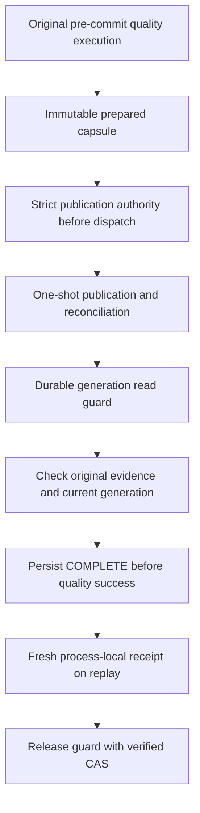

# ADR 0073: Durable evidence reissues process-local quality authority

- Status: Accepted for the bounded Python opt-in
- Date: 2026-09-28

This decision is for runtime maintainers extending
[ADR 0025](0025-process-local-quality-gate-authority.md) and
[ADR 0067](0067-clickhouse-cluster-publication-authority.md).

## Context

A proven target commit cannot satisfy a non-inert quality policy on replay.
Process-local receipts deliberately expire with their execution. Public reports,
checksums and current row counts cannot replace the original producer's authority.
Repeated `EXCHANGE` would reverse publication, and source reads would violate the
committed recovery path.

## Decision

Inject a sink-neutral `QualityReplayStore` into governance. Produce an immutable
canonical capsule only from a validated original receipt and captured acceptance
observations. Seal it into publication authority before dispatch. Bind policy,
admission/effective configuration, schemas, operation/fence, inventory and desired
generation. Completion appends a versioned digest chain without changing the core
used by the publication receipt.

The initial adapter uses externally prepared KeeperMap facades. Strict CAS requires
acknowledgement, caller-specific write identity and exact version readback. Admission
never creates or migrates storage. A durable reader guard fences managed successor
operations through validation and receipt acceptance. Pending governance also fences
slot reuse. A crashed reader has no automatic expiry; explicit quiescent recovery
is required.

Every capsule read retains the observed authority version and rejects completion
records from a future version. This is a continuity check, not authentication of
privileged restore/recreation. Platform-owned same-Keeper-service/path-prefix,
permissions, retention and quiescent migration remain trust prerequisites.

A fresh execution re-evaluates the exact original probes with the existing runner,
checks the report projection, and consumes a fresh receipt through the unchanged
process-local state machine. It never deserializes authority from an old receipt.
Selected store failures are blocking even after target commit; committed-warning
fallback cannot bypass quality.

## Consequences

The bounded internal replicated full-refresh Python opt-in supports row/hash gates
and original source/staged acceptance. Unsupported policies, unknown identity
semantics and absent durable evidence fail closed. Target acceptance remains
unsupported until a generation reader can enforce a real deadline and immutable
read boundary. External replication, MSSQL and manifest/CLI store selection require
separate integration. Existing unselected routes retain their behavior.

Quality capsules and authority records are bounded canonical values. They do not
authenticate caller-provided evidence, unmanaged target changes or malicious code
inside the trusted runtime. A managed successor ends the retired operation's fixed
slot replay window. Historical records cannot be backfilled from report files.
No live deployment certification is claimed by synthetic regression tests.

## Related

- [User guide](../committed-replay-quality.md)
- [Reference](../committed-replay-quality-reference.md)
- [Recovery runbook](../committed-replay-quality-runbook.md)
- [Approved feature design](../feature-design-committed-replay-quality-evidence.md)
