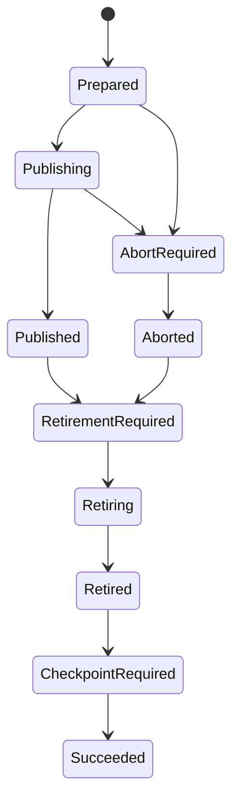

# ADR 0073: SqlClient route activation requires parent retirement authority

Status: Accepted; production composition implemented; route qualification pending.

Audience: runtime maintainers, connector authors, release engineers and platform
operators.

## Context

ADR 0072 defines the bounded TDS worker and its attempt lifecycle. The P7 through
P10f components can produce an exact, typed, independently verified SQL Server
stage. The ordinary ClickHouse to MSSQL native runtime still uses BCP and has a
different cleanup contract: it checkpoints a successful publication before
best-effort stage cleanup and may discard sealed native input after chunk
verification.

That ordering is unsafe for the SqlClient lifecycle. A verified TDS attempt must
retain exact evidence and capacity until its stage is contained and retired under
a settled parent publication or abort authority. A restart after publication,
retirement or a lost checkpoint acknowledgement must not require the source,
sealed input or the deleted stage.

## Decision

### Closed parent state machine

New SqlClient executions use parent journal schema v4. Existing schemas retain
their exact meaning and encoding.



An ambiguous publish or abort acknowledgement remains in its prior uncertain
state and authorizes neither retirement nor checkpoint. `Aborted` is terminal
publication authority and never returns to `Prepared`. The authority digest binds
the parent plan, frozen half-open window, target identity, ordered chunk
identities, outcome kind and publication or rollback receipt.

The retirement receipt contains the parent-authority digest and an ordered tuple
of per-chunk receipts. Each chunk receipt binds its attempt identity, exact object
incarnation, P10f verification receipt, implementation identity, DROP operation,
post-DROP absence proof, terminal lifecycle snapshot, closed directory and
capacity observation. Ordering follows immutable chunk ordinal, not completion
time.

`Succeeded` requires a durable retirement receipt and an acknowledged checkpoint.
Recovery from `Retired` or `CheckpointRequired` repeats only checkpoint CAS and
result materialization. It never restores or reads source data, native files or
retired stages.

### Terminal projection

P10f creates an immutable credential-free native-chunk projection together with
the opaque terminal. A projector in the same service boundary may consume the
exact terminal once; callers cannot access or reconstruct private terminal fields.
The projection binds:

- canonical `TdsAttemptIdentity` and digest;
- exact stage object identity and target coordinates;
- row count, encoded byte count, input file digest and typed multiset digest;
- the bounded additive typed multiset accumulator `typed_sum` in the range
  `0..2^256-1`, computed from the same typed row hashes as the digest;
- P10f evidence receipt and terminal lifecycle revision;
- admitted worker and companion implementation identity;
- directory coordinate required for source-free recovery.

Changing any nested binding rejects the projection. It carries no password,
connection material, descriptor, process handle or mutable writer authority.

### Canonical v4 chunk receipt

Importer, parent journal, source-free inspector, stage preparation and retirement
use one closed `dpone.sqlclient.native-chunk-receipt.v1` representation. Its
ordinary `NativeChunkReceipt` fields bind the parent ordinal, exact attempt,
canonical stage identity, row and byte counts, input digest and typed digest.
Its closed evidence body binds the P10f projection and verification payload,
the registration and verification evidence receipts, durable input-custody
receipt, and `typed_sum`. The stage identifier is derived from the canonical
stage-object identity; it is never reconstructed from a table-name convention.

`typed_sum` is an unsigned 256-bit modular sum of the per-row canonical typed
hashes already used by verification. It is evidence, not a replacement for the
ordered digest. P10f proves both values over the same observed rows. Parent
preparation composes chunk accumulators modulo `2^256` and compares the result
with its independently observed prepared-stage accumulator. A digest alone is
never converted into, or treated as, an accumulator.

Old BCP receipts and parent journal schemas retain their exact encoding. Only
explicit SqlClient schema-v4 executions emit the canonical receipt.

### Inspection and retirement are separate capabilities

`NativeChunkImporter` remains the fresh-execution port. SqlClient composition adds
two explicit ports:

- `NativeChunkInspector` reconstructs the same projection from the parent index,
  lifecycle, directory, registration and P10f evidence without source or effect;
- `NativeChunkRetirer` consumes a verified projection plus exact parent authority
  and performs containment, DROP, absence, terminal retirement and capacity
  observation.

The existing `settle()` behavior remains a BCP compatibility facade and may be
used for a failed attempt only when it was never publication-eligible. A verified
SqlClient stage cannot discover parent authority through hidden ambient state.

### Exact retirement algorithm

For each verified attempt, under the active target/window fence:

1. Rehydrate and validate the exact attempt and directory; enumerate coordinates
   from the parent journal rather than parsing object names.
2. Validate the matching `published` or `aborted` parent authority.
3. Seal directory work and advance `VERIFIED -> CONTAINMENT_REQUIRED`.
4. Prove no bulk process or credential channel remains and persist local
   containment; advance to `CONTAINED`.
5. Authorize retirement with the exact lifecycle snapshot and reserve one RETIRE
   coordinator operation from the retirement budget.
6. Under the same SQL exclusion, observe the exact object incarnation, issue the
   closed DROP command, persist local and remote operation settlement, and observe
   exact absence. A known failed DROP is settled but is not absence.
7. Advance through `RETIREMENT_REQUIRED -> RETIRED`, close directory admission and
   execute the reserved CAPACITY observation.
8. Persist the per-chunk retirement receipt. Only after every ordinal is retired
   may the parent retirement receipt be committed.

An unknown outcome retains custody. A retry is transiently eligible only after
the predecessor is `RETIRED`, exact absence and capacity release are durable.

### Input custody and concurrency budget

SqlClient sealed input remains owned until the matching attempt is verified and
parent retirement is durable. Recovery before P10f may need the input for
observation but never for resending effects. After P10f it may validate the bound
digest; deletion occurs only through parent settlement. Existing BCP deletion
timing is unchanged.

Let `p` be authored import parallelism. A deployment must admit an actor capacity
of at least `p * fresh_peak + p * retirement_peak + parent_reserve`, where the
closed capability producer publishes the three finite constants for its exact
companion version. Retirement slots and encoded bytes are reserved when the
attempt directory is created and cannot be consumed by fresh work. The route
fails admission before source I/O when this inequality or any directory bound is
not satisfied.

### Runtime selection

Omitted transport selects the existing BCP composition. An explicit backend is
resolved through a closed, injected capability selector at the composition root.
Missing or mismatched capabilities fail before ClickHouse access; there is no
fallback. Runtime packages depend only on ports and never import the application
SqlClient implementation or vendor SDK.

The application composition root constructs the closed runtime binding from
admitted deployment capabilities. A nominal fresh-chunk executor owns the full
`authorize -> admit -> launch -> pregrant -> observe -> grant/execute -> settle`
order and consumes the P10f terminal once. Deployments inject connections,
credentials, durable stores, clocks and process launchers; they cannot replace
the lifecycle order with a callback. Parent bridges bind schema-v4 identity,
abort authority, ordered retirement, input release and checkpoint CAS before
the runtime receives a terminal result.

### Failed-attempt settlement before retry

Successful parent retirement uses a distinct lifecycle event. After P10f has
persisted `VERIFIED`, the settled parent authority advances the attempt
through `ParentRetirementRequired -> CONTAINED -> RETIREMENT_REQUIRED` with
`error = null`. A normal published chunk must never be represented as
`TdsAttemptError.CLEANUP`. The live attempt authority is transferred once through
invocation-scoped custody so the current fence can reserve retirement. Recovery
after process loss still requires a strictly newer fence.

An acknowledged writer error advances the existing lifecycle to
`CONTAINMENT_REQUIRED`; it introduces no generic `FAILED` phase and grants no
successor authority. The route replaces arbitrary failed-settlement callbacks
with one nominal capability that rehydrates the exact predecessor from the
fenced parent journal, continues containment, and reuses the P10g retirement
algorithm through a distinct exact failed-attempt subject. It never fabricates a
verified P10f projection or parent publication receipt.

```text
acknowledged error -> CONTAINMENT_REQUIRED -> CONTAINED
  -> failed-retirement reservation -> durable DROP intent
  -> exact DROP or reconciliation -> remote settlement + exact absence
  -> RETIREMENT_REQUIRED -> RETIRED -> closed directory + released capacity
  -> failed-attempt settlement receipt -> successor admission
```

The request binds full attempt identity, exact recovered stage incarnation,
input custody, error observation, lease fence, lifecycle revision/state digest
and directory revision/state digest. Unknown outcomes retain custody and block
retry. Only acknowledged connection, driver, startup-timeout and
operation-timeout errors are retry candidates; cancellation and deterministic
input, policy, authority or verification failures are terminal.

The earlier `dpone.sqlclient.failed-eligibility.v1` shape lacks sufficient
authority and remains read-only `legacy_unqualified` evidence. It is never
promoted to exact settlement authority. This state/evidence change is part of
the required minor release.

### Companion distribution

The companion is a separate immutable Linux artifact, not embedded in a Python
wheel. Its release contains the locked application files, dependency inventory,
checksums, SBOM, license bundle, build provenance and signature. The dpone release
declares the accepted companion manifest schema and implementation digest. Install
roots are read-only and upgrades install beside the previous version; rollback
selects a previously admitted complete root. Route admission rejects unsupported
OS/architecture, missing trust material, inventory drift or an incompatible
dpone/companion pair before source I/O.

Initial production qualification targets Linux arm64, .NET 8.0.31 and the pinned
SDK inventory already defined by the companion project. Other platforms remain
unsupported until separately built and certified.

## Recovery matrix

| Durable observation | Permitted recovery |
|---|---|
| Before effect, no launch acknowledgement | Observe exact attempt; create a new attempt only after authoritative no-effect retirement |
| Acknowledged retryable writer error, predecessor not retired | Report `RETRY_PENDING_SETTLEMENT`; resume its exact containment and retirement suffix |
| Failed-attempt settlement receipt durable | Report `RETRY_READY`; admit attempt `n + 1` with the same sealed input |
| Deterministic non-retryable writer error | Report `TERMINAL_INPUT_OR_POLICY`; retain auditable state and do not auto-retry |
| Process or SQL outcome unknown | Contain and reconcile; never resend CREATE, grant or bulk input |
| P10f verified, parent unsettled | Retain stage and input; resume parent publication or abort decision |
| Parent published/aborted, retirement partial | Resume only the missing exact retirement suffix under a newer fence |
| DROP settled, absence missing | Observe exact object; do not infer deletion |
| All chunks retired, parent retirement ACK unknown | Re-read and CAS the identical ordered receipt; do not repeat DROP |
| Parent retired, checkpoint ACK unknown | Repeat checkpoint CAS and materialize the same result without source/stage access |
| Checkpoint succeeded | Return the same terminal result; perform no route effects |

## Consequences

Activation changes public state, evidence, recovery and packaging contracts and
therefore requires a minor release. It adds durable records and retirement work
to the confirmed-delivery path. The extra work is intentional: throughput claims
must measure through verification, publication, retirement and checkpoint.

BCP manifests and journal readers remain compatible. Schema v4 is emitted only
for explicitly selected SqlClient executions. Old journals are never inferred to
contain abort or retirement authority.

## Acceptance

Activation is complete only when contract, recovery, retirement, selection,
packaging and fault-matrix tests pass; exact-source narrow and 100-column Docker
runs pass; and an approved private seven-day actual SqlClient run completes
publication, retirement and checkpoint. A fresh-context reviewer must inspect the
immutable candidate. Corporate identifiers, credentials and raw measurements
remain outside the repository.
