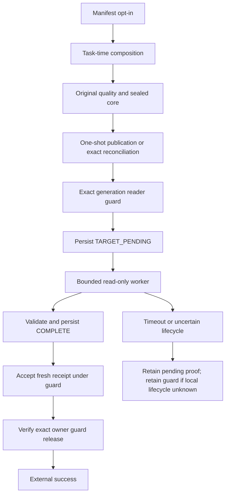

# ADR 0074: Declarative replay uses guarded target completion

- Status: Accepted for implementation under the approved feature specification
- Date: 2026-09-28

This proposal is for runtime maintainers and platform engineers. It extends the
bounded decision in [ADR 0073](0073-durable-committed-replay-quality.md); it does not
change the behavior shipped in 0.85.0. The
[researched specification](../feature-design-declarative-replay-quality.md) defines
exact public fields, algorithms, failure cases and validation obligations.

## Context

CLI and Airflow consumers cannot select the Python-only durable replay capability.
The ordinary target metric probe has no absolute observation deadline and cannot
produce required durable target evidence safely. Historical publication success
alone cannot prove original quality checks.

## Proposed decision

Use one strict default-off `sink.options.durable_quality_replay` selector through
manifest normalization and both runtime factory paths. Validate before hydration;
never open connections or spawn readers during Airflow parsing. The selector is
composition metadata, excluded individually from semantic identity after strict
validation. All actual policy, configuration and generation semantics remain bound.

Keep source/staged-only v1 capsule bytes unchanged. New target obligations use an
explicit v2 capsule: immutable original core, then TARGET_PENDING and terminal
completion records. Reserve the worst-case complete envelope and response-frame
capacity before publication. Target observations cannot change the sealed core.

A narrow reader port in `dpone.ports`, depending only on DTOs in `dpone.contracts`,
is implemented by a supervised fixed ClickHouse worker. Construct its fresh client from the same admitted endpoint descriptor through
private pipes. Allow generated SELECTs only, no authority capability or arbitrary SQL.
One monotonic 60-second observation budget covers worker startup and read/result I/O;
a parent watchdog rejects late data and bounds local worker shutdown separately.
Do not claim this bounds authority mutations or guarantees remote query termination.

Only verified local termination and irreversible output revocation permit reader
release after a failed observation; pending governance continues to block successors.
Unknown authority writes or owner death never grant success or automatic expiry.
A completed retry validates historical target evidence and the current generation
without source access, target rescan, INSERT or publication redispatch.

Keep required metrics exact and complete. A permitted warn-only unavailable result
has its explicit empty-metric representation; it cannot stand in for missing or
malformed evidence, identity failure, cancellation or required acceptance.

## Alternatives and consequences

Socket timeouts, server limits alone and thread future timeouts do not establish an
absolute observation boundary. A supervised process does, at the cost of initially
supporting only POSIX workers with proven spawn/termination/reaping capability.
Unsupported execution environments fail before extraction. No broad KILL privilege,
generic worker plugin system or new credential selector is introduced.

The trusted runtime enforces behaviorally read-only execution; reusing sink credentials
does not imply separate database RBAC. Unmanaged writes, data-changing TTL/merges and
privileged restore remain outside the admitted immutable-generation boundary.

A pre-0.85 committed non-inert operation without original durable proof remains
REQUIRED/UNVERIFIED. Current scans, report files and serialized local receipts cannot
backfill that proof. Any new assessment requires distinct provenance and cannot certify
the historical operation retroactively. Preserve unresolved authority.

Consumer promotion and live certification are separate authorized activities.
Before implementation approval, review this ADR with its specification. Before release,
require synthetic lifecycle/identity/CLI/Airflow proof, ordinary CI gates and an
independent implementation review. Do not downgrade active v2 operations to an older
reader or weaken quality to bypass unresolved completion.
