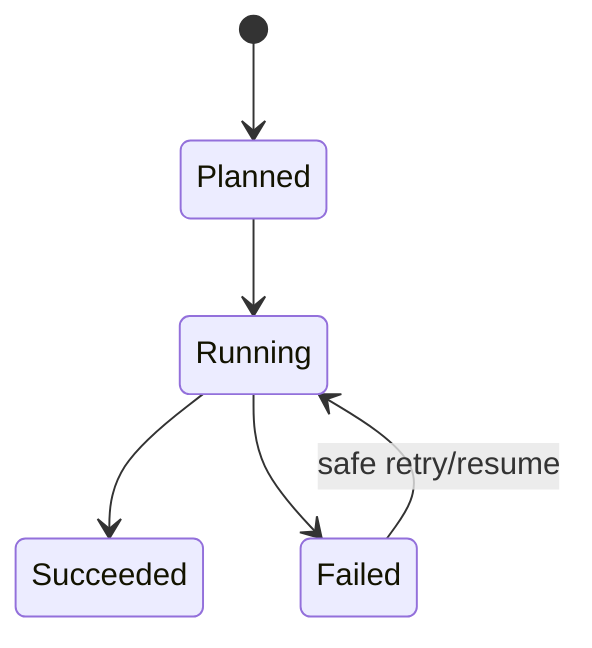
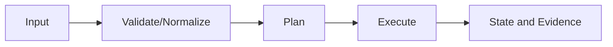

# Feature design: <name>

- Status: DRAFT | RESEARCHED | APPROVED | IMPLEMENTED | SUPERSEDED
- Owner: <name>
- Issue: <link or number>
- Target release: <version or TBD>
Last verified: <YYYY-MM-DD>

## Executive summary

Describe the user problem, proposed capability, and measurable outcome in plain
language. State why this belongs in dpone rather than a one-off adapter.

## Personas and customer journey

| Persona | Goal | Current pain | Success signal |
|---|---|---|---|
| | | | |

Walk through discovery, prerequisites, configuration, execution, observation,
diagnosis, recovery, production operation, and upgrade.

## Scope

### In scope

- TBD

### Non-goals

- TBD

### Assumptions and constraints

- TBD

## Public contract

### CLI

Commands, options, defaults, exit codes, stdout/stderr, JSON/file output,
overwrite/atomicity, and examples.

### Python API

Imports, signatures, models, exceptions, and parity with CLI.

### Manifest/schema

Shape, defaults, validation, versioning, and old-manifest behavior.

### Artifacts and evidence

Names, schemas, status vocabulary, digests, and retention.

### Compatibility and migration

Old behavior, new behavior, deprecation window, migration, and rollback.

## Detailed algorithm

Describe, step by step:

1. input acquisition and validation;
2. normalization and capability negotiation;
3. planning and deterministic identity;
4. execution and transaction boundaries;
5. state/checkpoint and evidence ordering;
6. retries, resume, replay, cancellation, and rollback;
7. concurrency, ordering, partitioning, and resource limits;
8. failure classification and user recovery;
9. output and artifacts.

### Pseudocode

```text
<precise pseudocode>
```

### State machine



### Edge cases

Cover empty input, null/missing values, duplicates, timeouts, process crash,
partial write, schema drift, unsupported capability, and deep/nested data where
applicable.

## Architecture

### Components and responsibilities

| Component | Existing/new | Responsibility | Dependencies |
|---|---|---|---|
| | | | |

### Ports, adapters, and composition root

Explain interface granularity, dependency direction, and concrete construction.

### Data and control flow



### Alternatives and tradeoffs

| Alternative | Advantages | Disadvantages | Decision |
|---|---|---|---|
| | | | |

### ADR requirement

Required? Why or why not?

### Quality-budget impact

Expected modules/SLOC, import-graph edges, coupling risks, and decomposition.
Reference `docs/benchmarks/quality_budgets.yml`.

## Market comparison

Use current official primary sources. Mark irrelevant systems `N/A` with reason.

| System/version | Relevant capability | Observed design | Strength | Limitation | Adopt/reject | Source/date |
|---|---|---|---|---|---|---|
| dlt | | | | | | |
| Informatica | | | | | | |
| Airbyte | | | | | | |
| Fivetran | | | | | | |
| Pentaho | | | | | | |
| Microsoft SSIS | | | | | | |
| gusty | | | | | | |
| Astronomer Cosmos | | | | | | |
| Apache Beam | | | | | | |

## Measurable differentiation

```yaml
axis:
scenario:
baseline:
metric:
target:
procedure:
artifact:
limitations:
```

## Security, privacy, and operations

Secrets, permissions, tenancy, auditability, resource limits, logs/metrics,
alerts, SLOs, runbook, and recovery.

## Test and certification plan

| Layer | Scenario | Environment | Expected artifact |
|---|---|---|---|
| Unit | | | |
| Contract | | | |
| Integration | | | |
| Live certification | | | |
| Performance | | | |
| Compatibility | | | |

Include negative, boundary, retry/replay, idempotency, and migration cases.

## Documentation plan

Tutorial, how-to, reference, architecture, runbook, CJM, examples, diagrams,
cross-links, and generated-reference changes.

## Rollout and rollback

Feature flag/compatibility mode, observability, migration order, rollback trigger,
and post-release verification.

## Agent execution plan

| Agent/role | Owned paths | Read-only paths | Forbidden paths | Dependency |
|---|---|---|---|---|
| | | | | |

Name the integrator and shared-file owner.

## Approval checklist

- [ ] User problem and CJM are clear.
- [ ] Algorithm and failure semantics are implementable without guessing.
- [ ] Public contracts and compatibility are explicit.
- [ ] Architecture and alternatives are justified.
- [ ] Relevant market research uses current official sources.
- [ ] Claimed differentiation is measurable.
- [ ] Tests, evidence, docs, rollout, and rollback are complete.
- [ ] Path ownership and integration plan are conflict-safe.
- [ ] Maintainer changed status to `APPROVED`.
