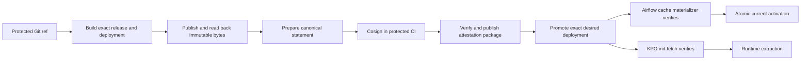

# Airflow artifact trust and attestation

> **Fail-closed preview.** The implementation is contract-tested, but signed
> dev restart and staged production cutover/rollback remain `UNVERIFIED`.
> Do not activate it as production-certified until exact-environment evidence
> exists.

This guide explains how platform, security, and on-call engineers publish and
consume a production Airflow deployment without trusting mutable tags, object
storage write access, or scheduler-local state. DAG authors do not manage keys
or add attestation fields to workloads.

Use this page for deployment provenance. For proof that a data route is safe,
use [Airflow route attestation](airflow-route-attestation.md). These are separate
controls:

| Control | Question answered | Protected object |
| --- | --- | --- |
| Artifact attestation | Did an approved CI authority produce these exact executable bytes? | Airflow release, deployment, index, and runtime image |
| Route attestation | Is this source-to-target route certified for the requested operation? | Connector capabilities and data-delivery route |

This deployment-scoped Cosign policy is also separate from the existing
`dpone.runtime-artifact-trust-policy.v2` GitHub/SLSA policy. A deployment
selects exactly one production authority. Supplying both is a configuration
blocker before registry I/O; supplying neither cannot authorize production.

## Production-target contract

Production uses one exact, signed chain:



The cache materializer and runtime init-fetch independently verify the same
statement. DAG parsing remains local and performs no S3, GitLab, Vault, or
signature network I/O.

Production fails closed before cache installation or runtime extraction when
any of these values differ:

- release or deployment ID;
- SHA-256 of `release-set.json`, `deployment.json`, or `airflow-index.json`;
- environment, runtime image digest, logical registry reference, or
  endpoint-bound registry scope;
- source project, protected ref, or Git SHA;
- mounted policy, public key digest, revocation list, or Cosign decision.

The previously active cache stays intact when verification fails.

## First setup without Vault

The first implemented and contract-tested backend is
`cosign_public_key_v1`. Live Kubernetes, object-storage, signing, rollback,
and revocation certification remains `UNVERIFIED` until the rollout evidence
listed in the
[feature specification](feature-design-airflow-production-artifact-attestation-v07327.md#test-and-certification-plan)
exists. Until Vault or KMS is available, keep the private key only in protected
GitLab CI variables:

| Material | Location | Required protection |
| --- | --- | --- |
| Cosign private key | GitLab **file** variable | protected, production environment scope |
| Cosign key password | GitLab variable | masked/hidden, protected, production environment scope |
| Cosign public key | reviewed platform configuration | read-only ConfigMap mount |
| Trust policy | reviewed platform configuration | read-only ConfigMap mount |

The private key and password must never enter repository files, command-line
arguments, JSON evidence, S3 objects, Airflow variables, or runtime pods.
GitLab jobs should read the private key from the file-variable path and pass
that path directly to `cosign`. GitLab cannot mask or hide a multiline PEM
file variable, so protection is enforced by the protected branch/environment
scope; the separate password remains masked and hidden.

For an S3 writer named `s3_dpone_artifacts_writer`, the `env` credential
provider reads this canonical contract:

```bash
export DPONE_CONN_S3_DPONE_ARTIFACTS_WRITER_USERNAME='<access-key-id>'
export DPONE_CONN_S3_DPONE_ARTIFACTS_WRITER_PASSWORD='<secret-access-key>'
export DPONE_CONN_S3_DPONE_ARTIFACTS_WRITER_ENDPOINT='https://storage.example'
export DPONE_CONN_S3_DPONE_ARTIFACTS_WRITER_TOKEN='<optional-session-token>'
export DPONE_CONN_S3_DPONE_ARTIFACTS_WRITER_ADDITIONAL_REGION='region-1'
```

Store those values as protected, hidden GitLab variables with the narrow
environment scope; never commit the example values. `USERNAME` and `PASSWORD`
map to the S3 access/secret key, `TOKEN` to the optional session token, and
`ADDITIONAL_REGION` to the SDK region.

Install a pinned Cosign version in the signing and runtime verification images:

```text
>=3.0.4,<4.0.0
```

## Trust policy

Author a readable policy as `policy.pretty.json` and public keys beside it.
The following block describes the model; its whitespace is not the mounted
byte contract:

```json
{
  "schema": "dpone.airflow-deployment-trust-policy.v1",
  "trust_tier": "production",
  "attestations": "required_for_prod",
  "backend": "cosign_public_key_v1",
  "trusted_public_keys": {
    "airflow-artifacts-2026-07": {
      "file": "cosign-2026-07.pub",
      "sha256": "sha256:<public-key-digest>"
    }
  },
  "cosign": {
    "minimum_version": "3.0.4",
    "maximum_version_exclusive": "4.0.0",
    "timeout_seconds": 10
  },
  "allowed_environments": ["prod"],
  "allowed_artifact_registry_refs": ["dpone_prod"],
  "allowed_registry_scope_ids": ["sha256:<endpoint-bound-registry-scope>"],
  "allowed_source_projects": ["platform/example-workloads"],
  "allowed_source_refs": ["refs/heads/master"],
  "revoked_attestation_ids": [],
  "revoked_public_key_ids": []
}
```

Render and validate the exact canonical bytes that will be mounted:

```bash
dpone airflow artifact-attestation policy-render \
  --input .ci/trust/policy.pretty.json \
  --output .ci/trust/policy.json \
  --format json \
  > .ci/out/airflow-deployment-trust-policy-render.json
```

`policy.json` is sorted, minified UTF-8 JSON with no trailing newline. Do not
copy the formatted example directly into a ConfigMap and hash it. The render
receipt contains both the semantic `policy_fingerprint` and exact-byte
`policy_sha256`; desired state pins the latter.

The registry scope is not a secret. It fingerprints the provider, endpoint,
account, bucket, and immutable root so credentials for another endpoint cannot
replay an otherwise valid deployment.

Mount the directory read-only at `/etc/dpone/artifact-trust`. The deployment
must pin the exact SHA-256 of `policy.json`; a policy change therefore creates
a new deployment occurrence rather than silently changing an active decision.

## CI publication

This section is the deployment-scoped Cosign path. The alternative
[GitHub/SLSA release-set procedure](airflow-cache-sync.md#materialize-the-prerequisite)
verifies and publishes its detached release bundle. Never run both paths for
one deployment authority.

1. Build the exact release/deployment with the Cosign deployment-policy pin.
2. Publish the authority-neutral core projection without
   `--artifact-attestation-bundle`. This is safe because publication does not
   activate production; cache/runtime consumers still fail closed until the
   Cosign overlay exists.
3. Render the canonical trust policy as shown above.
4. Prepare, sign, and publish the immutable attestation package.
5. Promote the same exact IDs through
   [desired state](airflow-desired-state.md), then materialize/reconcile the
   cache.
6. Confirm `runtime-fetch-ready.v2` from a KPO before enabling the production
   schedule.

The authority-neutral core publication command is:

```bash
dpone airflow publish \
  --cache-root .dpone/cache \
  --release-id "${DPONE_RELEASE_ID}" \
  --deployment-id "${DPONE_DEPLOYMENT_ID}" \
  --environment prod \
  --artifact-registry-ref dpone_prod \
  --registry-uri s3://<bucket>/<immutable-root> \
  --connection-type env \
  --connection-id s3_dpone_artifacts_writer \
  --expected-registry-scope-id "${DPONE_ARTIFACT_REGISTRY_SCOPE_ID}" \
  --publication-mode exact \
  --format json \
  > .ci/out/airflow-artifact-publish.json
```

Success is `dpone.airflow-artifact-publish.v2`; it supplies the exact release,
deployment, registry scope, and remote read-back commitments used by
`prepare`. Omitting a release bundle here does not authorize an unsigned
runtime. The selected deployment policy and later Cosign package remain the
only authority.

Prepare deterministic statement bytes. `--issued-at` is an explicit pipeline
identity input; use GitLab's stable pipeline creation time, not the current
clock:

```bash
dpone airflow artifact-attestation prepare \
  --cache-root .dpone/cache \
  --release-id "${DPONE_RELEASE_ID}" \
  --deployment-id "${DPONE_DEPLOYMENT_ID}" \
  --environment prod \
  --artifact-registry-ref dpone_prod \
  --registry-scope-id "${DPONE_ARTIFACT_REGISTRY_SCOPE_ID}" \
  --publication-evidence .ci/out/airflow-artifact-publish.json \
  --source-project platform/example-workloads \
  --source-ref refs/heads/master \
  --source-git-sha "${CI_COMMIT_SHA}" \
  --issued-at "${CI_PIPELINE_CREATED_AT}" \
  --output .ci/out/attestation/artifact-attestation.json \
  --format json
```

The command is create-once and equality-idempotent. A retry with identical
inputs keeps identical bytes. A different statement at the same output path is
rejected.

Sign outside dpone:

```bash
cosign signing-config create \
  --no-default-fulcio \
  --no-default-oidc \
  --no-default-rekor \
  --no-default-tsa \
  --out /tmp/dpone-cosign-signing-config.json

cosign sign-blob \
  --yes \
  --key "${DPONE_AIRFLOW_ATTESTATION_PRIVATE_KEY_FILE}" \
  --signing-config /tmp/dpone-cosign-signing-config.json \
  --bundle .ci/out/attestation/artifact-attestation.sigstore.json \
  .ci/out/attestation/artifact-attestation.json
```

Verify local bytes, mounted policy, public key, actual registry authority, and
signature before publishing:

```bash
dpone airflow artifact-attestation publish \
  --cache-root .dpone/cache \
  --publication-evidence .ci/out/airflow-artifact-publish.json \
  --statement .ci/out/attestation/artifact-attestation.json \
  --sigstore-bundle .ci/out/attestation/artifact-attestation.sigstore.json \
  --trust-policy-path .ci/trust/policy.json \
  --trust-key-root .ci/trust \
  --registry-uri s3://<bucket>/<immutable-root> \
  --connection-type env \
  --connection-id s3_dpone_artifacts_writer \
  --format json
```

The publisher writes:

```text
attestations/deployments/prod/sha256-<deployment>/
  artifact-attestation.json
  artifact-attestation.sigstore.json
  _SUCCESS
```

`_SUCCESS` is written last. Existing equal bytes are a successful no-op;
different bytes are an immutability conflict. Desired-state promotion must run
only after the publication receipt is green.

The registry `--connection-type` is mandatory with `--connection-id`. For the
current no-Vault rollout use `--connection-type env`; this resolves only
object-storage credentials. dpone never reads or writes the Cosign private key.
Cosign receives its password through its protected environment variable, not
an argv value. The shared GitLab delivery kit `v0.2.61` generates the same
explicit no-service signing configuration shown above. Verification uses
`--private-infrastructure` with the policy-pinned public key. This keeps the
consumer offline and does not pretend that an internal signature has Rekor
transparency-log inclusion.

## Airflow 2 and Airflow 3

The trust contract is version-neutral:

| Airflow | Cache consumer | Runtime consumer |
| --- | --- | --- |
| 2.10 | scheduler/DAG processor, with serialized DAGs for webserver | KPO init container |
| 3.x | `dagProcessor`, with serialized metadata served by `apiServer` | KubernetesExecutor KPO init container |

Scheduler and `dagProcessor` use the local bounded cache. KubernetesExecutor
workers do not need that cache mount; `runtime-init-fetch` downloads and
verifies its own exact artifacts before the base container starts.

## Observe success

Successful runtime evidence uses `dpone.runtime-fetch-ready.v2` and includes:

- `artifact_attestation.subject_kind=airflow_deployment`;
- `artifact_attestation.backend=cosign_public_key`;
- `artifact_attestation.attestation_id`;
- deterministic `verification_sha256`;
- `observed_claims`;
- `unobserved_claims`.

The cache materializer observes all signed subject claims. A KubernetesExecutor
worker observes the staged release and deployment plus its trusted plan, but
does not mount the scheduler cache and does not fetch `airflow-index.json`.
Runtime evidence therefore records `airflow_index_sha256` under
`unobserved_claims`; it never claims to have inspected bytes that were absent
from the pod.

The timestamped verification receipt is
`dpone.airflow-artifact-attestation-verification.v1`. Its deterministic
`decision_sha256` deliberately excludes observation time, so cache and runtime
can correlate the same trust decision.

Successful cache materialization still reports exact release/deployment IDs and
`projection_verified=true`; activation evidence binds those IDs to the desired
state occurrence. The attestation itself remains immutable in the registry.

## Retry, rollback, rotation, and revocation

- **Retry:** rerun prepare/sign/publish with the same pipeline identity. Equal
  bytes converge safely.
- **Rollback:** select an older exact desired deployment. It remains usable only
  while its signer is trusted and attestation is not revoked.
- **Key rotation:** add the new public key to a bounded policy, publish a new
  policy-pinned deployment, then remove or revoke the old key after rollback
  requirements expire.
- **Attestation revocation:** add its ID to `revoked_attestation_ids` and publish
  a new policy-pinned desired deployment. Immutable evidence is retained.
- **Registry outage:** no candidate becomes active; last-known-good `current`
  remains available. Runtime pods that cannot verify fail before source I/O.

Do not delete old immutable packages merely to revoke them. Deletion destroys
audit and rollback evidence; policy is the authorization boundary.

## Diagnose

Start with the safe error code, not raw Cosign or storage payloads:

| Code | Meaning | Action |
| --- | --- | --- |
| `DPONE_ARTIFACT_ATTESTATION_REQUIRED` | production needs a verifier, policy, key, or package | follow the [required-attestation runbook](errors/DPONE_ARTIFACT_ATTESTATION_REQUIRED.md) |
| `DPONE_ARTIFACT_ATTESTATION_SIGNATURE_INVALID` | no trusted key verified the exact statement | rebuild/sign the exact prepared bytes |
| `DPONE_ARTIFACT_ATTESTATION_SUBJECT_MISMATCH` | signed claims differ from local artifacts | stop promotion and rebuild from exact publication evidence |
| `DPONE_ARTIFACT_ATTESTATION_POLICY_DENIED` | environment or registry is outside policy | review policy and endpoint-bound scope |
| `DPONE_ARTIFACT_ATTESTATION_REVOKED` | statement or key is revoked | select a non-revoked deployment |
| `DPONE_ARTIFACT_ATTESTATION_REGISTRY_UNAVAILABLE` | bounded registry operation failed | restore access and retry; do not bypass verification |

Never switch production to `optional`, remove the trust-policy pin, or restore a
mutable `latest` path as an incident workaround.

## Related material

- [Attestation operations and incident runbook](airflow-artifact-attestation-operations.md)
- [Airflow cache sync and recovery](airflow-cache-sync.md)
- [Exact Airflow desired-state delivery](airflow-desired-state.md)
- [Runtime Docker image](runtime-image.md)
- [ADR 0035](adr/0035-airflow-production-artifact-attestation.md)
- [Stable schema catalog](reference/gitops-schema-catalog.md)
