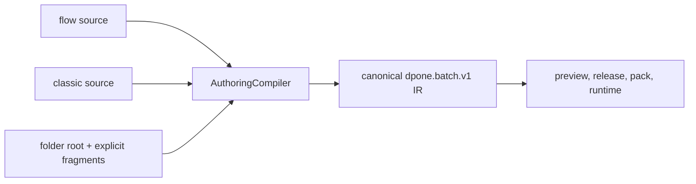

# Airflow pipeline authoring

Purpose: choose the shortest editable dpone source while keeping one canonical
runtime contract and a parse-safe Airflow deployment.

## Choose one mode

Every pipeline has exactly one primary source. The modes are alternatives, not
files that must be kept in sync.

| Mode | Use it when | Public kind |
| --- | --- | --- |
| `flow` | You want the shortest source for a new pipeline | `dpone.flow.v1` |
| `classic` | You need the full existing batch grammar | `dpone.batch.v1` |
| `folder` | Advanced/optional: a larger flow needs explicit bounded multi-file composition | `dpone.flow.v1` root plus `dpone.flow-fragment.v1` files |

New self-service pipelines use `flow` by default:

```bash
dpone init pipeline orders_daily \
  --recipe mssql-to-clickhouse-incremental \
  --airflow
```

Folder mode is an optional advanced authoring choice, not an extra golden-path
step. The five beginner commands remain unchanged.

Choose classic explicitly when you need its layered `defaults`, `schemas`, and
table overrides:

```bash
dpone init pipeline orders_daily \
  --recipe mssql-to-clickhouse-incremental \
  --authoring classic \
  --airflow
```

Choose folder mode when a multi-process flow is easier to review as small
files:

```bash
dpone init pipeline orders_daily \
  --recipe mssql-to-clickhouse-incremental \
  --authoring folder \
  --airflow
```

The command creates the primary `pipeline.yaml` and one explicitly listed
`steps/load.yaml` fragment (greenfield scaffold name). Migration into folder mode
from an existing classic/flow source instead creates a sibling `processes.yaml`;
see [authoring-mode migration](airflow-authoring-migration.md). The root remains
the only pipeline authority:

```yaml
kind: dpone.flow.v1
authoring:
  mode: folder
  source: pipelines/orders_daily/pipeline.yaml
metadata:
  id: orders_daily
  domain: sales
fragments:
  - steps/load.yaml
```

Each fragment has exactly two top-level fields:

```yaml
kind: dpone.flow-fragment.v1
processes:
  - name: orders_daily
    source:
      type: mssql
      connection_ref: mssql_dev
      table: {schema: dbo, name: orders}
    sink:
      type: clickhouse
      connection_ref: clickhouse_dev
      table: {schema: analytics, name: orders}
      strategy: {mode: incremental_merge, unique_key: id}
```

Only paths in `fragments` are read. There is no recursive scan. Paths must stay
inside the project and cannot use traversal, backslashes, or symlinks. The
loader allows at most 100 fragments, 1 MiB per file and 8 MiB total; YAML
anchors and aliases are rejected. Every accepted fragment is included in the
workload pack and verified by byte digest before live sample execution. Path
components are opened relative to one stable project-root descriptor, so a
concurrent symlink swap cannot redirect the validated fragment read. Referenced
SQL files participate in the same compiler-to-pack parity check, so a source
change during preview fails closed.

## Short flow source

```yaml
kind: dpone.flow.v1
authoring:
  mode: flow
  source: pipelines/orders_daily/pipeline.yaml
metadata:
  id: orders_daily
  domain: sales
  tags: [dpone, airflow]
processes:
  - name: orders_daily
    source:
      type: mssql
      connection_ref: mssql_dev
      table: {schema: dbo, name: orders}
    sink:
      type: clickhouse
      connection_ref: clickhouse_dev
      table: {schema: analytics, name: orders}
      strategy: {mode: incremental_merge, unique_key: id}
```

The file contains logical connection aliases only. Vault paths, Airflow
Connection payloads, Kubernetes Secret data, and passwords remain platform
configuration and are resolved after deployment pinning.

## What dpone compiles



The canonical manifest is generated in memory. Do not create or edit a second
manifest beside the primary source. Equivalent flow, folder, and classic inputs produce
the same `semantic_fingerprint`; their `source_fingerprint` values differ
because the source syntax differs.

A one-process self-service `classic`, `flow`, or `folder` pipeline remains one
Airflow workload node:
its task identity is the GitOps workload ID, while its DAG-spec node, compact
process plan, hooks, and runtime command retain the explicit process selector.
This preserves task history when a legacy one-file manifest is migrated to
self-service authoring without weakening process isolation. A multi-process
pipeline is expanded into selector-scoped node IDs because each process is
independently addressable. An explicit batch without self-service `authoring`
metadata remains process-scoped even when it contains one process. See the
[single-process identity contract](feature-design-airflow-single-process-identity-v1.md).

Inspect the compilation without credentials or network access:

```bash
dpone check pipelines/orders_daily --format json
```

The result includes `authoring_mode`, `source_kind`, `canonical_kind`, source
and semantic fingerprints, and compatibility aliases. `dpone airflow preview`
reuses the same compiler path. The Airflow provider never reads or compiles
authoring YAML; it reads the bounded deployment index and immutable artifacts.

## Compatibility

The previously scaffolded `kind: dpone.batch.v1` plus `processes:` shape remains
readable during its deprecation window. Static output reports
`DPONE_LEGACY_SELF_SERVICE_BATCH_PROCESSES`. New or edited sources should use
the correct `dpone.flow.v1` kind instead.

The earlier safe-sample `schema: dpone.pipeline.v1` plus `processes:` source is
also a read-only compatibility alias and reports
`DPONE_LEGACY_SELF_SERVICE_PIPELINE_V1`.

Do not change modes by renaming `kind`. Use the plan-first migration command;
it compiles both representations and blocks apply unless their canonical
semantic fingerprints are equal:

```bash
dpone migrate authoring orders_daily --from classic --to flow --plan
dpone migrate authoring orders_daily --from classic --to flow --apply
```

The command changes authoring sources only. It never builds packs, publishes a
deployment, resolves credentials, or deletes old folder fragments. See
[Authoring-mode migration](airflow-authoring-migration.md) for every direction,
failure behavior, JSON output, and rollback guidance.

## Related references

- [First Airflow DAG](getting-started/first-airflow-dag.md)
- [Manifest schemas](reference/manifest-schemas.md)
- [Industrial Airflow self-service architecture](airflow-self-service-architecture.md)
