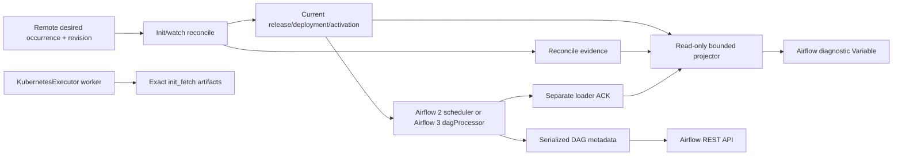

# Diagnose the Airflow pack cache without Kubernetes access

Use this runbook when an operator can access Airflow REST/UI but cannot use
`kubectl` or read the `dagProcessor` filesystem. It distinguishes parser cache
state, remote desired state, and runtime worker state without pretending that
one is evidence for another.

## Authority model



- Exact-cache receipt/current bytes on the parse component are activation
  authority.
- Exact `last-reconcile-status.json` and legacy `last-sync-status.json` are
  diagnostics; an optional Airflow Variable projection may lag after a crash.
- Serialized DAG metadata proves what Airflow currently exposes.
- A KubernetesExecutor worker does not need the scheduler cache. A worker-side
  `cached://` miss is not proof that DAG parsing is broken.

## Read the diagnostic Variable

Prerequisites:

- `curl` and `jq` are installed;
- `AIRFLOW_BASE_URL` is the reviewed Airflow origin without a trailing slash;
- the API identity may read the single diagnostic Variable and list DAGs;
- Airflow 3 supplies masked `AIRFLOW_API_TOKEN`; Airflow 2 supplies masked
  `AIRFLOW_API_USER` and `AIRFLOW_API_PASSWORD` only when its API auth backend
  supports Basic auth.

The compatibility `dpone-airflow-pack-sync` watcher can publish a non-secret
Variable such as `dpone_airflow_pack_cache_status`. The exact desired-state
cache does not publish a Variable by itself: an infrastructure-owned projector
must run `dpone-airflow-pack-cache-status --json` beside the parse authority and
publish that bounded result. Absence of this projector makes local exact-cache
state `UNVERIFIED`; it does not prove failure.

Read the Variable through the API version supported by the installation:

For Airflow 3 API v2, pass the bearer header through curl's header input on
stdin. The token is neither parsed as curl configuration nor placed in the
process argument list:

```bash
set -euo pipefail
set +x
: "${AIRFLOW_BASE_URL:?set the Airflow origin}"
: "${AIRFLOW_API_TOKEN:?set a masked Airflow 3 bearer token}"
case "${AIRFLOW_BASE_URL}" in https://*) ;; *) printf 'AIRFLOW_BASE_URL must use https://\n' >&2; exit 2 ;; esac

airflow_api_get() {
  local auth_header
  case "${AIRFLOW_API_TOKEN}" in
    *$'\r'*|*$'\n'*) printf 'bearer token contains CR/LF\n' >&2; return 2 ;;
  esac
  printf -v auth_header 'Authorization: Bearer %s' "${AIRFLOW_API_TOKEN}"
  curl --disable --proto '=https' --tlsv1.2 --fail --silent --show-error --header @- -- "$1" \
    <<<"${auth_header}"
}

tmp="$(mktemp cache-status-from-variable.XXXXXX)"
trap 'rm -f "${tmp}"' EXIT
airflow_api_get \
  "${AIRFLOW_BASE_URL}/api/v2/variables/dpone_airflow_pack_cache_status" \
  | jq '(.value // .) | if type == "string" then fromjson else . end' \
  >"${tmp}"
jq -e 'type == "object" and .kind == "dpone.airflow_pack_cache_status" and .schema_version == "1"' \
  "${tmp}" >/dev/null
mv -f "${tmp}" cache-status-from-variable.json
```

For Airflow 2 stable API v1, base64-encode Basic credentials before passing the
header through the same protected stdin channel:

```bash
set -euo pipefail
set +x
: "${AIRFLOW_BASE_URL:?set the Airflow origin}"
: "${AIRFLOW_API_USER:?set the masked Airflow 2 API user}"
: "${AIRFLOW_API_PASSWORD:?set the masked Airflow 2 API password}"
case "${AIRFLOW_BASE_URL}" in https://*) ;; *) printf 'AIRFLOW_BASE_URL must use https://\n' >&2; exit 2 ;; esac

airflow_api_get() {
  local basic_auth
  local auth_header
  basic_auth="$(printf '%s' "${AIRFLOW_API_USER}:${AIRFLOW_API_PASSWORD}" \
    | base64 | tr -d '\r\n')"
  printf -v auth_header 'Authorization: Basic %s' "${basic_auth}"
  curl --disable --proto '=https' --tlsv1.2 --fail --silent --show-error --header @- -- "$1" \
    <<<"${auth_header}"
}

tmp="$(mktemp cache-status-from-variable.XXXXXX)"
trap 'rm -f "${tmp}"' EXIT
airflow_api_get \
  "${AIRFLOW_BASE_URL}/api/v1/variables/dpone_airflow_pack_cache_status" \
  | jq '(.value // .) | if type == "string" then fromjson else . end' \
  >"${tmp}"
jq -e 'type == "object" and .kind == "dpone.airflow_pack_cache_status" and .schema_version == "1"' \
  "${tmp}" >/dev/null
mv -f "${tmp}" cache-status-from-variable.json
```

Airflow 3 bearer tokens come from the configured auth manager; Basic auth is
not universally available. Airflow 2 Basic auth works only when its API auth
backend enables it. First prove authentication with the installation's
documented token flow and keep the token in a masked environment variable.
HTTP `401` is an authentication problem; `403` is an authorization problem;
neither is cache evidence.

Do not print tokens in CI logs. For `layout=exact_deployment_index`, inspect
`status`, `release_id`, `deployment_id`, `activation_id`, `index_sha256`,
`last_reconcile_status`, `operational_status`, `warnings`, and `blockers`.
`operational_status` includes bounded last retention plan/apply evidence,
publication reports, and publication-failure markers when present. A successful reconcile
contains the protected source SHA, exact expected DAG IDs and runtime image
digest. For `layout=legacy_pack_index`, inspect `last_sync_status`,
`current_generation`, `commit_id` and `commit_sequence`. Fields such as
`component`, `finished_at` and `last_success_at` belong to the projector or
legacy watcher envelope; they are not part of exact reconcile evidence.

Compare exact identity explicitly:

```bash
set -euo pipefail

jq -e '
  .last_reconcile_status.passed == true and
  .release_id == .last_reconcile_status.release_id and
  .deployment_id == .last_reconcile_status.deployment_id and
  .activation_id == .last_reconcile_status.activation_id and
  .release_id == .loader_ack.release_id and
  .deployment_id == .loader_ack.deployment_id and
  .activation_id == .loader_ack.activation_id and
  ("sha256:" + .index_sha256) == .loader_ack.airflow_index_sha256
' cache-status-from-variable.json
```

The deployment-owned projector runs beside the parse authority. Give it
read-only cache and ACK mounts plus a least-privilege metadata/API identity
allowed to update only the diagnostic Variable. It performs only these steps:

1. run the bounded cache and ACK check shown below;
2. publish the redacted merged result through the provider's Airflow Variable
   adapter;
3. sleep for the configured interval; publication failure remains a warning
   and cannot stop the parse-authority pod.

```bash
set -euo pipefail

dpone-airflow-pack-cache-status \
  --cache-dir /opt/airflow/.dpone-cache \
  --ack-path /opt/airflow/.dpone-ack/loader-ack.json \
  --ack-root /opt/airflow/.dpone-ack \
  --airflow-variable-key dpone_airflow_pack_cache_status \
  --json
```

The merged payload includes `release_id`, `deployment_id`, `activation_id`,
`index_sha256`, `last_reconcile_status`, `operational_status`, `loader_ack` and
`airflow_variable_published_at`. Treat the local status and ACK files as the
source of truth; the Variable is a timestamped projection. Alert on
`airflow_variable_published=false`, a missing publication timestamp, a
publication age greater than two configured projector cycles, any blocker, or
identity divergence. Also alert when an `operational_status` key ends in
`_publication_failure`, or when a publication report is `commit_unknown` or
`rejected`. These warnings do not block DAG parse, but they do block a claim
that retention evidence is healthy. A previously green Variable whose timestamp stops moving
is stale evidence, not a successful current reconcile.

The projector is operational plumbing, not deployment authority. It must not
rewrite `current`, ACK, reconcile status or immutable cache bytes. Until an
installation supplies this projector, API-only cache freshness remains
`UNVERIFIED`. The complete pod placement and read-only mounts are in
[the Kubernetes deployment runbook](airflow-cache-kubernetes-deployment.md#optional-api-diagnostics-projector).

## Compare Airflow-visible DAGs

List expected generated DAG IDs through REST and compare sets, not counts
alone. Continue pagination until the API reports no more rows. Use the complete
example for the installed Airflow major version; do not mix its authentication
or endpoint prefix with the other example.

Build `DPONE_EXPECTED_DAG_IDS_FILE` from the exact desired-deployment evidence
that was activated, never from a hand-written list or the mutable repository:

```bash
jq -er '.promotion.expected_dag_ids
  | if length > 0 then .[] else error("activated deployment has no expected DAG IDs") end' \
  airflow-desired-deployment.json >expected-dag-ids.txt
export DPONE_EXPECTED_DAG_IDS_FILE="$PWD/expected-dag-ids.txt"
```

The REST projection below includes only DAGs carrying the exact `dpone` tag, so
unrelated team DAGs do not create false drift in a shared Airflow installation.

Airflow 3 API v2:

```bash
set -euo pipefail
set +x
: "${AIRFLOW_BASE_URL:?set the Airflow origin}"
: "${AIRFLOW_API_TOKEN:?set a masked Airflow 3 bearer token}"
: "${DPONE_EXPECTED_DAG_IDS_FILE:?set the reviewed newline-delimited expected DAG IDs}"
case "${AIRFLOW_BASE_URL}" in https://*) ;; *) printf 'AIRFLOW_BASE_URL must use https://\n' >&2; exit 2 ;; esac

airflow_api_get() {
  local url="$1"
  local auth_header
  case "${AIRFLOW_API_TOKEN}" in
    *$'\r'*|*$'\n'*) printf 'bearer token contains CR/LF\n' >&2; return 2 ;;
  esac
  printf -v auth_header 'Authorization: Bearer %s' "${AIRFLOW_API_TOKEN}"
  curl --disable --proto '=https' --tlsv1.2 --fail --silent --show-error --header @- -- "${url}" \
    <<<"${auth_header}"
}

limit=100
observed_first="$(mktemp airflow-3-dag-ids-first.XXXXXX)"
observed_second="$(mktemp airflow-3-dag-ids-second.XXXXXX)"
total_first="$(mktemp airflow-3-dag-total-first.XXXXXX)"
total_second="$(mktemp airflow-3-dag-total-second.XXXXXX)"
trap 'rm -f "${observed_first}" "${observed_second}" "${total_first}" "${total_second}"' EXIT
jq -Rse 'split("\n") | map(select(length > 0))
  | length > 0 and all(test("^[A-Za-z0-9](?:[A-Za-z0-9_.-]{0,248}[A-Za-z0-9])?$"))' \
  "${DPONE_EXPECTED_DAG_IDS_FILE}" >/dev/null

scan_dag_ids() {
  local output="$1"
  local total_output="$2"
  local offset=0
  local expected_total=""
  {
  while :; do
    page="$(airflow_api_get \
      "${AIRFLOW_BASE_URL}/api/v2/dags?limit=${limit}&offset=${offset}")"
    total="$(jq -er '.total_entries as $total
      | if (($total | type) == "number" and $total >= 0 and $total == ($total | floor))
        then $total else error("invalid total_entries") end' <<<"${page}")"
    page_count="$(jq -er 'if (.dags | type) == "array"
      then (.dags | length) else error("dags must be an array") end' <<<"${page}")"
    if [ -z "${expected_total}" ]; then expected_total="${total}"; fi
    [ "${total}" -eq "${expected_total}" ] || { printf 'total_entries changed during pagination\n' >&2; exit 1; }
    jq -r '.dags[]
      | select(any(.tags[]?; (if type == "object" then .name else . end) == "dpone"))
      | .dag_id' <<<"${page}"
    [ "${page_count}" -gt 0 ] || [ "${offset}" -eq "${total}" ] || {
      printf 'Airflow returned an empty page before total_entries\n' >&2; exit 1;
    }
    offset=$((offset + page_count))
    [ "${offset}" -le "${total}" ] || { printf 'Airflow pagination exceeded total_entries\n' >&2; exit 1; }
    [ "${offset}" -eq "${total}" ] && break
  done
  } | sort -u >"${output}"
  printf '%s\n' "${expected_total}" >"${total_output}"
}

scan_dag_ids "${observed_first}" "${total_first}"
scan_dag_ids "${observed_second}" "${total_second}"
cmp -s "${observed_first}" "${observed_second}" \
  && cmp -s "${total_first}" "${total_second}" || {
  printf 'Airflow 3 DAG inventory changed between complete scans\n' >&2
  exit 1
}
sort -u "${DPONE_EXPECTED_DAG_IDS_FILE}" >expected-dag-ids.sorted
comm -3 expected-dag-ids.sorted "${observed_second}" >dag-set.diff
mv -f "${observed_second}" observed-dag-ids.sorted
rm -f "${observed_first}" "${total_first}" "${total_second}"
trap - EXIT
if [ -s dag-set.diff ]; then
  printf 'Airflow 3 DAG set differs; inspect dag-set.diff\n' >&2
  exit 1
fi
```

Airflow 2 stable API v1:

```bash
set -euo pipefail
set +x
: "${AIRFLOW_BASE_URL:?set the Airflow origin}"
: "${AIRFLOW_API_USER:?set the masked Airflow 2 API user}"
: "${AIRFLOW_API_PASSWORD:?set the masked Airflow 2 API password}"
: "${DPONE_EXPECTED_DAG_IDS_FILE:?set the reviewed newline-delimited expected DAG IDs}"
case "${AIRFLOW_BASE_URL}" in https://*) ;; *) printf 'AIRFLOW_BASE_URL must use https://\n' >&2; exit 2 ;; esac

airflow_api_get() {
  local url="$1"
  local basic_auth
  local auth_header
  basic_auth="$(printf '%s' "${AIRFLOW_API_USER}:${AIRFLOW_API_PASSWORD}" \
    | base64 | tr -d '\r\n')"
  printf -v auth_header 'Authorization: Basic %s' "${basic_auth}"
  curl --disable --proto '=https' --tlsv1.2 --fail --silent --show-error --header @- -- "${url}" \
    <<<"${auth_header}"
}

limit=100
observed_first="$(mktemp airflow-2-dag-ids-first.XXXXXX)"
observed_second="$(mktemp airflow-2-dag-ids-second.XXXXXX)"
total_first="$(mktemp airflow-2-dag-total-first.XXXXXX)"
total_second="$(mktemp airflow-2-dag-total-second.XXXXXX)"
trap 'rm -f "${observed_first}" "${observed_second}" "${total_first}" "${total_second}"' EXIT
jq -Rse 'split("\n") | map(select(length > 0))
  | length > 0 and all(test("^[A-Za-z0-9](?:[A-Za-z0-9_.-]{0,248}[A-Za-z0-9])?$"))' \
  "${DPONE_EXPECTED_DAG_IDS_FILE}" >/dev/null

scan_dag_ids() {
  local output="$1"
  local total_output="$2"
  local offset=0
  local expected_total=""
  {
  while :; do
    page="$(airflow_api_get \
      "${AIRFLOW_BASE_URL}/api/v1/dags?limit=${limit}&offset=${offset}")"
    total="$(jq -er '.total_entries as $total
      | if (($total | type) == "number" and $total >= 0 and $total == ($total | floor))
        then $total else error("invalid total_entries") end' <<<"${page}")"
    page_count="$(jq -er 'if (.dags | type) == "array"
      then (.dags | length) else error("dags must be an array") end' <<<"${page}")"
    if [ -z "${expected_total}" ]; then expected_total="${total}"; fi
    [ "${total}" -eq "${expected_total}" ] || { printf 'total_entries changed during pagination\n' >&2; exit 1; }
    jq -r '.dags[]
      | select(any(.tags[]?; (if type == "object" then .name else . end) == "dpone"))
      | .dag_id' <<<"${page}"
    [ "${page_count}" -gt 0 ] || [ "${offset}" -eq "${total}" ] || {
      printf 'Airflow returned an empty page before total_entries\n' >&2; exit 1;
    }
    offset=$((offset + page_count))
    [ "${offset}" -le "${total}" ] || { printf 'Airflow pagination exceeded total_entries\n' >&2; exit 1; }
    [ "${offset}" -eq "${total}" ] && break
  done
  } | sort -u >"${output}"
  printf '%s\n' "${expected_total}" >"${total_output}"
}

scan_dag_ids "${observed_first}" "${total_first}"
scan_dag_ids "${observed_second}" "${total_second}"
cmp -s "${observed_first}" "${observed_second}" \
  && cmp -s "${total_first}" "${total_second}" || {
  printf 'Airflow 2 DAG inventory changed between complete scans\n' >&2
  exit 1
}
sort -u "${DPONE_EXPECTED_DAG_IDS_FILE}" >expected-dag-ids.sorted
comm -3 expected-dag-ids.sorted "${observed_second}" >dag-set.diff
mv -f "${observed_second}" observed-dag-ids.sorted
rm -f "${observed_first}" "${total_first}" "${total_second}"
trap - EXIT
if [ -s dag-set.diff ]; then
  printf 'Airflow 2 DAG set differs; inspect dag-set.diff\n' >&2
  exit 1
fi
```

A zero-length `dag-set.diff` is the pass condition. A non-empty diff identifies
missing expected IDs on lines prefixed only from the first input and unexpected
observed IDs from the second; counts alone are never accepted. A DAG present in serialized metadata proves that at least one successful parse
observed its spec. It does not prove that remote `latest` has converged or that
a runtime pod used the same deployment.

Also read `/api/v2/importErrors?limit=100&offset=0` (Airflow 3) or
`/api/v1/importErrors?limit=100&offset=0` (Airflow 2), following the same
pagination rule. Match the generated loader file and `LoadReport` error code.
The DAG detail/source endpoint and loader acknowledgement identify which
serialized source Airflow accepted; worker logs do not replace this evidence.

## Classify the result

| Observation | Classification | Action |
| --- | --- | --- |
| Variable current equals desired and every expected DAG is visible | Converged diagnostic | Run lightweight acceptance and compare runtime deployment identity. |
| Variable is stale but expected DAGs are visible | Diagnostic publication lag | Do not restart Airflow only for the Variable. Inspect the next sync cycle and alert on age. |
| Variable is current but DAG set is missing | Parser/load failure | Inspect Airflow import errors and provider `LoadReport`; do not blame S3 without evidence. |
| Desired and current differ for more than two sync cycles | Sync convergence blocker | Check connection access, hash/size blockers, cache budget, and component identity. |
| Worker reports cache missing, DAG remains visible | Expected topology | Verify exact `init_fetch` delivery; do not mount parser cache into workers. |

## Limits of API-only evidence

REST and Variables cannot independently rehash local cache bytes. For release
or production certification, an infrastructure-owned diagnostic must execute
`dpone-airflow-pack-cache-status --cache-dir <root> --json` beside the parse
authority and publish its bounded result. Treat an unavailable local receipt as
`UNVERIFIED`, never as `PASS`.

Attach only redacted evidence: Airflow/API versions, expected and observed DAG
sets, status component/timestamps/generation/commit, blocker codes, provider
version, runtime deployment identity, request ID and HTTP status. Never attach
connection payloads, presigned URLs, tokens, or object-store keys.

For a deployable parse-side init/watch configuration, use
[Deploy the exact cache on Kubernetes](airflow-cache-kubernetes-deployment.md).

Official references: [Airflow 2.10 stable REST API](https://airflow.apache.org/docs/apache-airflow/2.10.5/stable-rest-api-ref.html),
[Airflow 3 stable REST API](https://airflow.apache.org/docs/apache-airflow/stable/stable-rest-api-ref.html),
and [Airflow 3 public API authentication](https://airflow.apache.org/docs/apache-airflow/stable/security/api.html).
