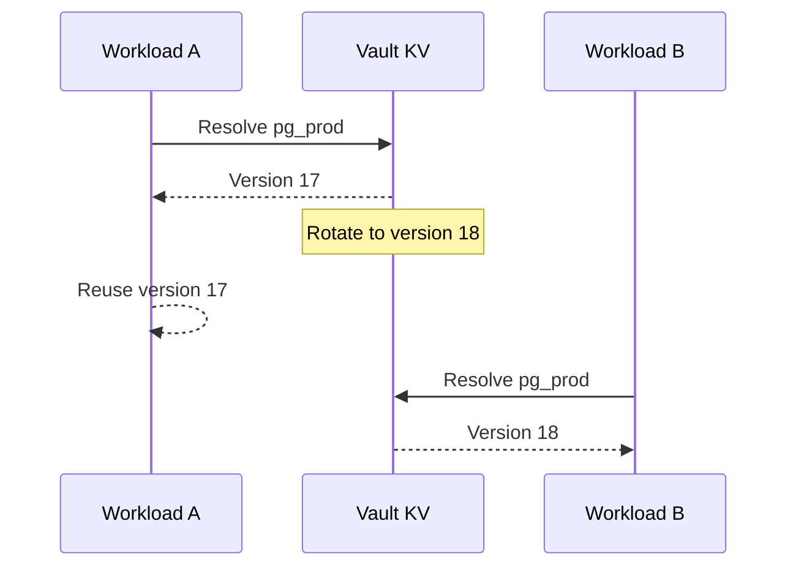

# Airflow credential resolver lifecycle

This runbook explains how dpone resolves, rotates, and recovers credentials for
Airflow workloads. Pipeline authors normally need only a logical
`connection_ref`; platform engineers own the backend registry and runtime
identity.

## Contract at a glance

The supported local Vault runtime policy is:

```yaml
credentials:
  resolver: vault_kv
  mount: kv
  kv_version: 2
  path: dpone/prod/credentials/pg_source
  fields:
    username: username
    password: password
  version_policy: latest
  resolution_scope: workload_start
```

The path belongs only in the restricted platform connection registry. It does
not enter pipeline authoring, DAG code, operator arguments, XCom, normal logs,
or Airflow parse reports.

```mermaid
flowchart LR
    REF["Pipeline connection_ref"] --> BIND["Environment binding-set"]
    BIND --> REG["Restricted connection registry"]
    REG --> POD["dpone runtime pod"]
    POD --> SA["Kubernetes ServiceAccount"]
    SA --> AUTH["Vault Kubernetes Auth"]
    AUTH --> KV["Vault KV v2"]
    KV --> MEM["In-memory connection"]
    MEM --> WORK["One workload"]
    WORK --> EV["Safe version evidence"]
```



Airflow DAG parsing reads none of these secrets and performs no Vault,
Kubernetes, Connection, Variable, database, or network I/O.

## Rotation semantics

`workload_start` is a snapshot boundary, not a refresh timer:

1. The first use of one `connection_ref` resolves the backend once.
2. Every later use inside that workload receives the same in-memory object.
3. A secret rotation does not change an already running workload.
4. A new workload creates a fresh scope and reads the new version.
5. A failed lookup is not cached; retry after recovery resolves again.



Parallel workloads may therefore use different versions if rotation happens
between their start times. This is intentional and is recorded per workload.

## Evidence

A successful Vault KV v2 resolution records only bounded metadata:

```yaml
connection_ref: pg_prod
resolver: vault_kv
version_policy: latest
resolution_scope: workload_start
resolved_version: 18
resolved_at: 2026-07-17T12:03:11Z
```

Evidence never records secret values, secret hashes, Vault paths, tokens, full
responses, signed URLs, or sensitive lease identifiers. An absent or non-positive
KV v2 version fails closed; dpone does not invent one from secret content.

## Resolver certification matrix

| Resolver | Execution location | Intended status | Local lifecycle evidence | Live evidence |
| --- | --- | --- | --- | --- |
| `vault_kv` | Runtime pod through `vault-kv-client` | Primary production | PASS for injected versioned port, rotation, outage, recovery, concurrency, redaction | UNVERIFIED for Vault Kubernetes Auth and current `vault-kv-client` metadata support |
| `kubernetes_secret_volume` | Platform projects files; runtime reads them | Production | PASS for confinement, missing fields and workload snapshot behavior | UNVERIFIED for CSI/External Secrets rotation |
| `kubernetes_secret_api` | Runtime calls Kubernetes API | Restricted escape hatch | PASS for injected-reader contract | UNVERIFIED; broad Secret RBAC is not certified |
| `airflow_connection` | Operator-side bridge at task execution | Compatibility | PASS for bounded bridge projection and cleanup | UNVERIFIED for an external Airflow Secrets Backend rotation |
| `env_var` | Runtime environment | Development/legacy only | PASS for policy rejection in production | Not production-certifiable |

`PASS` above means deterministic local contract coverage at the exact dpone
commit. It does not assert network, authentication, RBAC, rotation propagation,
or backend availability in a real cluster.

### Current Vault client limitation

dpone 0.73 development currently installs `vault-kv-client 0.1.0`. Its public
`get_secret()` API returns KV data but removes the KV v2 response metadata.
Therefore the default adapter cannot yet produce the mandatory
`resolved_version` proof for an explicit `kv_version: 2` registry entry. Runtime
fails with `DPONE_CREDENTIAL_VERSION_METADATA_MISSING`; this is safer than
claiming an unknown version.

Production certification requires a public client API that returns an atomic
secret snapshot containing both data and version metadata. dpone's resolver
port models that value as `VaultSecretSnapshot`; legacy mappings recognize only
the reserved `_metadata.version` envelope. Ordinary secret fields named
`version` or `metadata` never count as evidence. Do not work around this by
hashing secret values or calling private `hvac`/client internals. Until that API
is integrated and live-certified, the Vault production profile remains
`UNVERIFIED`.

Vault KV v1 remains readable for compatibility and reports
`resolved_version: null`; it is not rotation-version certified.

## Unsupported policies

The v1 schema still parses two planned values so migrations remain explainable,
but runtime refuses to execute semantics it cannot guarantee:

| Configuration | Error | Action |
| --- | --- | --- |
| `version_policy: pinned` | `DPONE_CREDENTIAL_PINNED_VERSION_UNSUPPORTED` | Use `latest`, or keep the workload blocked until a historical-version contract exists |
| `resolution_scope: dag_run_start` | `DPONE_CREDENTIAL_DAG_RUN_SCOPE_UNSUPPORTED` | Use `workload_start`; DAG-wide credential snapshots are not implemented |

Both are rejected by `dpone check --connections` and again by runtime before
credential backend I/O.

## Recovery runbook

### 1. Check configuration safely

```bash
dpone check pipelines/orders_daily --connections --environment prod
```

This check validates aliases, resolver policy, logical references, field
mappings, bridge policy, and environment identity. It does not read Vault.

### 2. Classify the failure

| Code | Meaning | Safe recovery |
| --- | --- | --- |
| `DPONE_CREDENTIAL_BACKEND_UNAVAILABLE` | Vault read failed before a connection was built | Restore Vault/auth/network, then retry the workload |
| `DPONE_CREDENTIAL_VERSION_METADATA_MISSING` | KV v2 response did not expose an auditable positive version | Upgrade/fix the client adapter; do not bypass evidence |
| `DPONE_CREDENTIAL_FIELD_MISSING` | A declared mapping resolved to missing or empty data | Platform owner repairs the secret/field mapping; do not print values |
| `DPONE_CREDENTIAL_PINNED_VERSION_UNSUPPORTED` | Requested semantics are not implemented | Migrate to `latest` or leave blocked |
| `DPONE_CREDENTIAL_DAG_RUN_SCOPE_UNSUPPORTED` | Requested cache boundary is not implemented | Migrate to `workload_start` |

### 3. Recover the dependency

- verify the runtime ServiceAccount, Vault role and policy out of band;
- verify the logical mount/path with a platform identity, never in Airflow logs;
- restore Vault availability or repair the platform-owned registry;
- rotate the credential again if its exposure is suspected;
- retry the failed workload, not an arbitrary inner step that would reuse
  partially initialized connector state.

### 4. Verify the retry

The retried workload must contain a new successful credential-resolution record
with the actual version and timestamp. Already completed/active workload
evidence remains immutable. A skipped live test is `UNVERIFIED`, never `PASS`.

## Kubernetes volume note

Kubernetes Secret volumes are projected read-only. A `subPath` mount does not
receive updates, so do not use it when the platform expects rotation
propagation. dpone still reads projected fields once per workload: a file update
during execution does not replace the in-memory connection. New pods/workloads
observe the projected state available at their own start.

## Local contract verification

```bash
uv run pytest \
  tests/test_airflow_credential_resolver_lifecycle.py \
  tests/test_runtime_workload_scoped_credential_resolver.py -q
```

The release evidence report is
`test_artifacts/airflow-credential-resolver-lifecycle-v1/validation-report.md`.
It must label real Vault/Kubernetes/Airflow profiles `UNVERIFIED` unless they
were executed in an approved environment for the exact commit.

## References

- [Vault KV v2](https://developer.hashicorp.com/vault/docs/secrets/kv/kv-v2)
- [Vault Kubernetes Auth](https://developer.hashicorp.com/vault/docs/auth/kubernetes)
- [Kubernetes volumes](https://kubernetes.io/docs/concepts/storage/volumes/)
- [Airflow Connections](https://airflow.apache.org/docs/apache-airflow/stable/howto/connection.html)
- [ADR 0012: Vault runtime authentication](adr/0012-vault-runtime-authentication.md)
