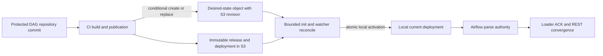
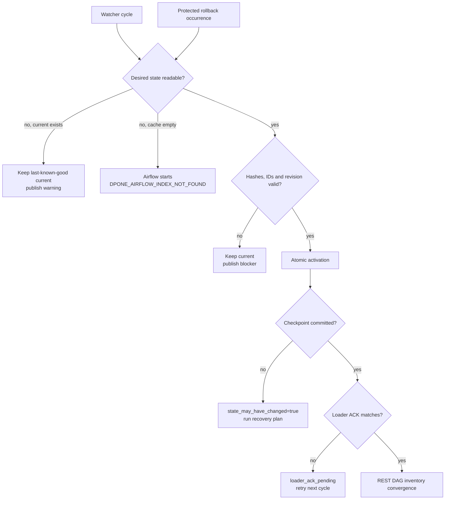

# Exact Airflow desired-state delivery

This page is the platform-engineer guide to publishing, synchronizing, and
rolling back immutable dpone Airflow deployments. DAG authors do not run these
commands: their protected CI pipeline publishes the selected deployment.

## What this solves

The Airflow parser needs a small, local, deterministic input. It must not depend
on S3 availability during every parse, and a cluster restart must not make all
generated DAGs disappear. The desired-state control plane separates mutable
selection from immutable content:



The desired-state object contains exact `release_id`, `deployment_id`, index
hash, runtime image digest, expected DAG IDs, source commit, and promotion
occurrence. It contains no credentials or physical connection payloads.

## Supported Airflow topology

Install one reconciler beside the component that executes DAG parsing:

| Airflow | Parse authority | Reconciler placement |
| --- | --- | --- |
| 2.10 with scheduler-managed parsing | Scheduler | Init and watcher beside the scheduler |
| 2.10 with standalone DAG processor | DAG processor | Init and watcher beside that processor |
| 3.2 | `dagProcessor` | Init and watcher beside `dagProcessor` |
| 3.3.x | DAG Bundle capable processor | Keep the reconciler until a versioned custom bundle passes the same certification |

Do not mount this cache into `apiServer`, webserver, triggerer, or
KubernetesExecutor workers. Workers receive exact runtime artifacts through
the separate `runtime-init-fetch` contract.

## First successful reconcile

Prerequisites:

- immutable release/deployment publication has completed;
- the read-only Airflow connection can read the desired object and artifact
  registry;
- the cache directory is bounded by a volume quota;
- logical connection IDs are configured outside command arguments;
- the watcher process is the only writer to this cache root.

Infrastructure mounts one protected, read-only authority file and sets only its
path:

```bash
export DPONE_AIRFLOW_DESIRED_STATE_AUTHORITY_FILE=/etc/dpone/airflow-authority.json
```

```json
{
  "schema": "dpone.airflow-desired-state-authority.v2",
  "environment": "dev",
  "desired_state_uri": "s3://example-bucket/dpone-control/dev/desired-state.json",
  "certified_s3_endpoint_url": "https://storage.yandexcloud.net",
  "artifact_registry_uri": "s3://example-bucket/dpone-artifacts/dev/example-workloads/immutable",
  "artifact_registry_ref": "dpone-artifacts-dev",
  "watcher_identity": "airflow-example-dev/dpone-pack-watcher",
  "source_project": "platform/example-workloads",
  "source_ref": "master",
  "workspace_authority_connection_ref": "dpone_control"
}
```

Store those reviewed bytes as
`airflow-desired-state-authority.json` in the platform environment source, not
in the DAG repository. The first installation and every intentional authority
change use the same validate, render, apply and byte-compare sequence:

```bash
set -euo pipefail

: "${KUBE_CONTEXT:?set the reviewed kubeconfig context}"
: "${AIRFLOW_NAMESPACE:?set the namespace used by the reviewed Airflow Helm release}"
: "${DPONE_AIRFLOW_AUTHORITY_JSON:?set the reviewed authority JSON path}"
: "${DPONE_AIRFLOW_AUTHORITY_APPLY_ACK:?set to review-and-apply-authority}"
[ "${DPONE_AIRFLOW_AUTHORITY_APPLY_ACK}" = review-and-apply-authority ] || exit 2
[ -f "${DPONE_AIRFLOW_AUTHORITY_JSON}" ]
kubectl --context "${KUBE_CONTEXT}" get namespace "${AIRFLOW_NAMESPACE}" >/dev/null

dpone gitops schema validate \
  --kind dpone.airflow-desired-state-authority.v2 \
  --payload "${DPONE_AIRFLOW_AUTHORITY_JSON}" \
  --format json >/dev/null

rendered="$(mktemp airflow-desired-state-authority.XXXXXX.yaml)"
observed="$(mktemp airflow-desired-state-authority.XXXXXX.json)"
evidence_dir="$(mktemp -d airflow-desired-state-authority.XXXXXX)"
trap 'rm -f "${rendered}" "${observed}"' EXIT
existing="$(kubectl --context "${KUBE_CONTEXT}" --namespace "${AIRFLOW_NAMESPACE}" \
  get configmap dpone-airflow-desired-state-authority \
  --ignore-not-found --output name)"
if [ "${existing}" = configmap/dpone-airflow-desired-state-authority ]; then
  kubectl --context "${KUBE_CONTEXT}" --namespace "${AIRFLOW_NAMESPACE}" \
    get configmap dpone-airflow-desired-state-authority \
    --output go-template='{{ index .data "airflow-desired-state-authority.json" }}' \
    >"${evidence_dir}/previous.json"
  sha256sum "${evidence_dir}/previous.json" >"${evidence_dir}/previous.sha256"
elif [ -z "${existing}" ]; then
  rm -f "${evidence_dir}/previous.json"
  printf 'first_install=true\n' >"${evidence_dir}/previous.absent"
else
  printf 'unexpected ConfigMap identity: %s\n' "${existing}" >&2
  exit 1
fi
kubectl --context "${KUBE_CONTEXT}" --namespace "${AIRFLOW_NAMESPACE}" \
  create configmap dpone-airflow-desired-state-authority \
  --from-file="airflow-desired-state-authority.json=${DPONE_AIRFLOW_AUTHORITY_JSON}" \
  --dry-run=client -o yaml >"${rendered}"
diff_rc=0
kubectl --context "${KUBE_CONTEXT}" --namespace "${AIRFLOW_NAMESPACE}" \
  diff -f "${rendered}" >"${evidence_dir}/kubectl.diff" || diff_rc=$?
[ "${diff_rc}" -le 1 ] || exit "${diff_rc}"
cat "${evidence_dir}/kubectl.diff"
kubectl --context "${KUBE_CONTEXT}" --namespace "${AIRFLOW_NAMESPACE}" \
  apply --server-side --field-manager=dpone-airflow-authority -f "${rendered}"
kubectl --context "${KUBE_CONTEXT}" --namespace "${AIRFLOW_NAMESPACE}" \
  get configmap dpone-airflow-desired-state-authority \
  --output go-template='{{ index .data "airflow-desired-state-authority.json" }}' \
  >"${observed}"
cmp -- "${DPONE_AIRFLOW_AUTHORITY_JSON}" "${observed}"
sha256sum -- "${DPONE_AIRFLOW_AUTHORITY_JSON}" "${observed}" \
  >"${evidence_dir}/applied.sha256"
chmod 0400 "${evidence_dir}"/*
printf 'authority change evidence: %s\n' "${evidence_dir}"
```

Run this through the reviewed infrastructure pipeline for a shared
environment. The direct commands are also the reproducible first-install and
incident procedure. Never generate this ConfigMap from untrusted DAG-branch
code, never put credentials in it, and do not continue to reconcile when the
byte comparison fails. The matching Helm values mount exactly this ConfigMap
read-only into the parse authority. Mount the ConfigMap as a directory, not
with `subPath`; Kubernetes does not project later ConfigMap updates through a
`subPath` mount.
After an update, wait for the ConfigMap projection and one complete watcher
cycle, then compare the cache status authority identity and desired/current
IDs. Treat field-manager conflict, stale projected bytes, or non-convergence as
a blocker; never use `--force-conflicts` for this authority.

This is stable environment configuration, not per-release state. The CLI does
not accept overrides for environment, desired key, registry root/ref, watcher
identity, source project, or protected ref. Promotion evidence must contain the
same derived `registry_scope_id`. Publish also queries GitLab and proves that
the selected SHA is the current head of the configured protected ref.

The non-mutating preparation job stores only a SHA-256 identity of this
complete write authority, never credentials. A later publish job re-computes
that identity before it builds an object-storage client. Changing the desired
key, certified endpoint, registry, watcher, repository, or protected ref
therefore invalidates the old preparation instead of redirecting it.

Run one cycle:

```bash
dpone airflow desired-state reconcile \
  --connection-type airflow \
  --connection-id s3_dpone_artifacts_reader \
  --artifact-connection-type airflow \
  --artifact-connection-id s3_dpone_artifacts_reader \
  --cache-root /opt/airflow/.dpone-cache
```

One command owns the complete serialized cycle:

1. acquire the local cache promotion lock;
2. conditionally fetch the desired state using the checkpoint revision;
3. validate canonical JSON, environment, endpoint-bound registry authority,
   protected source ref/SHA, IDs, bounds, and evidence hashes;
4. durably stage the exact desired bytes and observed revision in the bounded
   pre-activation recovery record;
5. download the exact immutable release/deployment into a temporary location;
6. verify every object and compare the materialized index, DAG IDs, and runtime
   image digest with the desired-state evidence;
7. re-read the remote desired revision at the local activation linearization
   point;
8. atomically switch `current` with local compare-and-swap;
9. durably commit an immutable activation receipt, checkpoint, and latest
   credential-free reconcile status while the promotion lock is still held.

`status=unchanged` is returned only when the remote revision is unchanged, the
canonical local desired snapshot matches its checkpoint digest, the local
`current-pointer` still matches the checkpoint, and the immutable activation
receipt matches the same activation identity. The check includes
`activation_id`, desired-state attestation, and the complete active projection
including every indexed artifact checksum. If the snapshot is missing,
malformed, or stale, the same revision is fetched in full and recovered before
success is reported. A missing receipt is rebuilt locally only when the
snapshot and checkpoint are already proven consistent; otherwise the same
bounded recovery path is used.

`predecessor_status` explains how the selected authority relates to local
state:

- `continuous`: the watcher observed the direct predecessor;
- `skipped`: one or more intermediate desired-state occurrences were missed,
  so the latest CAS-protected authority was fully revalidated and activated;
- `bootstrap`: no local active deployment or checkpoint existed. This includes
  a restarted pod with an empty disposable cache: the watcher may select the
  latest protected desired occurrence even when its remote `previous` field
  names an older deployment that is no longer local;
- `recovered`: a verified `current` already matched the remote desired state
  and its missing immutable receipt/checkpoint were rebuilt in that order;
- `unchanged`: remote revision, checkpoint, and complete active projection all
  still match.

The watcher does not get permanently stuck after missing an intermediate poll.
It converges to the latest protected desired state and makes the skipped
transition explicit in durable evidence.

The cycle result also uses `status=recovered` when the active projection and
its desired-state attestation are already valid but durable local control
evidence is incomplete. An activation receipt is an immutable activation fact,
not the result of a recovery cycle. Recovery validates and reuses an existing
receipt; only when the receipt is absent does it reconstruct that activation
fact before committing the checkpoint. The separate latest-cycle evidence
reports `status=recovered`, `materialized=false`, `activated=false`, so it never
claims a second cache activation and can never overwrite the original receipt
with different bytes.

The recovery record closes the only dangerous crash window: `current` may
already point to deployment D2 while the durable checkpoint still names D1.
On the next cycle, the watcher repairs D2 from the record before it reads a
potentially newer remote D3. It validates environment, registry authority,
source identity, release, deployment, and desired-state attestation, then
commits receipt and checkpoint in that order. A missing or mismatching recovery
record blocks with `state_may_have_changed=true`; it never guesses from
mutable remote state. The remote desired-state envelope remains bounded to
`72 KiB`; every local control copy derived from it uses one consistent
`96 KiB` bound for recovery record, checkpoint, and receipt overhead.

Before a cycle can mutate cache state, the watcher replaces the previous latest
status with a bounded `in progress` status. If final status persistence fails,
operators see an incomplete/uncertain cycle rather than a stale green result.

## Watcher behavior

Infrastructure installs a small process loop around the command:

- init performs one hard-timeout cycle and always exits `0`;
- the sidecar repeats at a configured interval with jitter;
- a failed cycle keeps the last-known-good `current`;
- the process records typed status and never treats an invalid desired object
  as an ordinary network outage;
- the Airflow main container is never blocked by S3 availability;
- an empty cache plus unavailable S3 creates a visible loader import
  diagnostic, not silent zero-DAG success.

The loop is similar to `git-sync`, but it synchronizes an exact compiled dpone
deployment instead of mutable Git working-tree contents.



## Rollback

Rollback never edits an old artifact and never rewrites `current` by hand:

1. select a retained, previously verified `release_id` and `deployment_id`;
2. run the protected CI rollback job, which re-verifies the retained immutable
   bytes and produces fresh `dwh.airflow_ci.dpone_deployment_promotion.v2`
   evidence for those exact IDs;
3. fetch the authoritative desired state and capture its opaque revision;
4. conditionally publish a new desired-state occurrence against that revision;
5. wait for reconcile evidence, loader ACK, and Airflow REST convergence;
6. retain both the failed and restored occurrence for audit.

The rollback therefore has a new occurrence ID and activation ID while
selecting old immutable content.

The operator-facing sequence is:

```bash
: "${ROLLBACK_PROMOTION_EVIDENCE:?set the fresh passed CI evidence path}"

dpone airflow desired-state fetch \
  --connection-type airflow \
  --connection-id s3_dpone_artifacts_writer \
  --output .ci/out/current-desired-state.json \
  --status-output .ci/out/current-desired-state-fetch.json

OBSERVED_REVISION="$(
  jq -er '.observed_revision' .ci/out/current-desired-state-fetch.json
)"

dpone airflow desired-state prepare \
  --promotion-evidence "${ROLLBACK_PROMOTION_EVIDENCE}" \
  --expected-revision "${OBSERVED_REVISION}" \
  --output .ci/out/rollback-desired-state-preparation.json \
  --status-output .ci/out/rollback-desired-state-prepare-error.json

dpone airflow desired-state publish \
  --connection-type airflow \
  --connection-id s3_dpone_artifacts_writer \
  --promotion-evidence "${ROLLBACK_PROMOTION_EVIDENCE}" \
  --preparation .ci/out/rollback-desired-state-preparation.json \
  --output .ci/out/rollback-desired-state-publish.json \
  --status-output .ci/out/rollback-desired-state-publish-error.json
```

Successful publish evidence has `passed=true`, `status=published`,
`outcome=replaced`, the retained `release_id` and `deployment_id`, and a new
`occurrence_id` plus `committed_revision`. Evidence schema v2 also contains
`preparation_job_id` and `publisher_job_id`. The desired deployment keeps the
stable occurrence-origin job so its bytes survive a GitLab job retry; the
evidence names the actual job that performed or reconciled the write. Exit `4`
means the revision raced or the remote result is uncertain: fetch again,
inspect the new authority, and restart the protected rollback job. Never retry
with `absent` or an unconditional object write.

The preparation file is written by a non-mutating job and retained as an
upstream CI artifact. It includes the intent, complete publish candidate, and
credential-free authority fingerprint.
Retrying only the mutating job therefore reuses the exact occurrence ID,
timestamp, predecessor revision, and candidate bytes even though its container
is new. Repeating preparation at the same output path with the same candidate
returns the existing bytes; a different candidate is rejected. A new pipeline
uses a new preparation artifact and therefore a new promotion attempt. The
legacy `--intent + --expected-revision` form remains
available for a local single-job workflow, but is not the canonical GitLab
retry boundary.

In the canonical `--preparation` flow, `--output` is success-only and
`--status-output` is mandatory. On failure dpone never writes over that success
path or any promotion/authority/control input. CI receives redacted
`dpone.error.v1` evidence in the separate status artifact. All paths are checked
pairwise, including symlink and existing hardlink aliases, before an
object-store client is built or CAS can execute.

The retained single-job `--intent` form preserves the v0.73.24 operator
contract. When no separate status path is supplied, a failure replaces
`--output` with valid redacted error evidence; this prevents a stale success
artifact from surviving a failed retry. Supplying `--status-output` opts that
legacy form into success-only output separation. Legacy `--intent` success
evidence remains `dpone.airflow-desired-state-publish.v1`; canonical
`--preparation` emits v2. If CAS succeeds but the local success-evidence commit
fails, the separate canonical status reports `state_may_have_changed=true`;
operators must reconcile the remote desired object before retrying instead of
assuming the write failed.

The watcher then emits
`dpone.airflow-desired-state-reconcile.v1` with the same exact IDs and
`status=activated` or `unchanged`. Completion requires a matching loader ACK
and Airflow REST inventory for every `expected_dag_id`; a successful S3 publish
alone is not rollback acceptance.

## Diagnose and recover

The watcher status file is the source of truth for the last cycle. It is
credential-free and bounded. Exit `3` means the remote dependency was
unavailable; exit `4` means integrity, concurrency, or uncertain-local-state
protection blocked activation; exit `5` is a redacted unexpected internal
failure.

| Code | Meaning | Safe response |
| --- | --- | --- |
| `DPONE_AIRFLOW_DESIRED_STATE_NOT_FOUND` | No desired object exists at the configured exact URI. | Verify environment and URI; do not create a placeholder from the watcher. |
| `DPONE_AIRFLOW_DESIRED_STATE_UNAVAILABLE` | Initial S3 read could not be completed. | Keep last-known-good `current`; verify connection and S3 health. |
| `DPONE_AIRFLOW_DESIRED_STATE_PRECOMMIT_UNAVAILABLE` | S3 became unavailable during the final revision recheck. | Do not activate; retry the complete cycle later. |
| `DPONE_AIRFLOW_DESIRED_STATE_INTEGRITY` | Desired bytes are non-canonical, oversized, or violate the schema. | Quarantine the object and republish through protected CI. |
| `DPONE_AIRFLOW_DESIRED_STATE_ENVIRONMENT_MISMATCH` | Desired object or checkpoint belongs to another environment. | Correct the URI/path mapping; never relabel the file manually. |
| `DPONE_AIRFLOW_DESIRED_STATE_SOURCE_UNAUTHORIZED` | Selected SHA is not the current protected-ref head. | Rebuild from the protected branch; never override source identity in CLI. |
| `DPONE_AIRFLOW_DESIRED_STATE_PREDECESSOR_MISMATCH` | The trusted checkpoint and active cache diverge after normal recovery checks. | Preserve both artifacts, inspect the last activation receipt, and follow the recovery runbook; do not force a new pointer. |
| `DPONE_ARTIFACT_REGISTRY_SCOPE_MISMATCH` | Promotion or desired state selects another registry authority. | Correct protected authority configuration or rebuild promotion evidence. |
| `DPONE_AIRFLOW_DESIRED_STATE_DEPLOYMENT_MISMATCH` | Materialized index, DAG IDs, runtime digest, or protected source SHA differs from promotion evidence. | Stop activation and rebuild/publish the immutable deployment. |
| `DPONE_AIRFLOW_DESIRED_STATE_SUPERSEDED` | CI selected a newer desired occurrence before local activation. | Rerun the complete reconcile cycle; it will fetch the newer occurrence. |
| `DPONE_AIRFLOW_DESIRED_STATE_CHECKPOINT_INVALID` | Local checkpoint is unreadable or non-canonical. | Follow the checkpoint recovery procedure below; do not delete it before proving `current`. |
| `DPONE_AIRFLOW_DESIRED_STATE_CHECKPOINT_FAILED` | Activation succeeded but the checkpoint write failed. | Treat `state_may_have_changed=true` as an incident; inspect `current-pointer`, then rerun reconciliation. |
| `DPONE_AIRFLOW_DESIRED_STATE_RECOVERY_RECORD_MISSING` | `current` and checkpoint diverge, but no durable pre-activation record proves the active deployment. | Preserve `current`, checkpoint, and status files; do not fetch-and-guess from a newer desired state. Restore the exact verified control record or use the cache recovery plan. |
| `DPONE_AIRFLOW_DESIRED_STATE_RECOVERY_RECORD_INVALID` | The bounded recovery record is unsafe, non-canonical, or unreadable. | Quarantine the control directory, preserve the active cache, and recover from immutable deployment evidence. |
| `DPONE_AIRFLOW_DESIRED_STATE_RECOVERY_MISMATCH` | The recovery record does not prove the active environment/source/deployment/attestation. | Stop reconciliation and compare exact desired, pointer, and publication evidence; never rewrite the record manually. |
| `DPONE_AIRFLOW_DESIRED_STATE_RECOVERY_RECORD_FAILED` | The exact desired state could not be durably staged before activation. | No activation was attempted; repair the bounded status volume and retry the complete cycle. |
| `DPONE_AIRFLOW_DESIRED_STATE_RECEIPT_FAILED` | Activation succeeded but its immutable receipt could not be persisted. | Preserve cache state, repair the bounded status volume, and rerun reconciliation. |
| `DPONE_AIRFLOW_DESIRED_STATE_RECEIPT_MISMATCH` | The immutable receipt does not prove the active checkpoint identity. | Quarantine the local control directory and recover from a verified immutable deployment; never rewrite the receipt. |
| `DPONE_AIRFLOW_DESIRED_STATE_STATUS_FAILED` | The latest serialized cycle status could not be persisted under the lock. | Treat the cycle as operationally incomplete; inspect the immutable receipt/checkpoint before retrying. |
| `DPONE_DEPLOYMENT_CACHE_RECOVERY_REQUIRED` | Local pointer, symlink, or projection is inconsistent. | Use the cache recovery planner before any new activation. |

Never solve these errors by writing `current-pointer.json`, the checkpoint, or
the desired object by hand. Preserve exact evidence and use conditional
publication, reconcile, or the documented cache recovery command.

### Checkpoint and empty-cache recovery

For an invalid checkpoint, first copy the checkpoint and watcher status to the
incident evidence directory. Run `dpone airflow cache-recovery-plan
--environment <env> --cache-root <root> --format json` and require a valid
active deployment whose IDs and index checksum match the last successful
reconcile evidence. Only then move the invalid checkpoint out of the active
status path and run one complete `desired-state reconcile` cycle. The remote
desired object and validated `current` are the authorities used to rebuild the
checkpoint; operators never edit checkpoint JSON.

If both cache and checkpoint are absent while S3 is unavailable, startup
remains fail-open for Airflow but the loader reports
`DPONE_AIRFLOW_INDEX_NOT_FOUND` as a DAG import diagnostic. Restore S3 access
and run a complete reconcile cycle. A successful cycle must produce a verified
deployment, atomic `current`, reconcile evidence, loader ACK, and REST
convergence before the incident is closed.

If both cache and checkpoint are absent while S3 is available, the watcher
treats the cycle as a local bootstrap. It does not require the remote
`previous.deployment_id` to be present locally. The currently selected desired
occurrence still passes protected source and registry authority validation,
immutable deployment verification, the final remote revision recheck, and
atomic activation with expected local current `None`. Any surviving local
`current` without a matching checkpoint or valid durable recovery record fails
with a recovery error before remote fetch; cold-start recovery never overwrites
ambiguous local state.

## Airflow 3.3 DAG Bundles

Airflow 3.3 provides native DAG Bundles and allows custom bundle
implementations. However, the official `S3DagBundle` and `GCSDagBundle` do not
support bundle versioning: tasks always use the latest bucket contents. That
does not satisfy dpone's exact historical deployment contract.

A future dpone custom versioned DAG Bundle is the preferred Airflow 3.3.x
direction. It may replace the external watcher only when it implements:

- version-specific `get_current_version`, initialization, and retrieval;
- refresh without parse-time unbounded network I/O;
- concurrency locking for processor and worker bundle instances;
- exact release/deployment/index checksum validation;
- last-known-good activation and exact rollback;
- the same loader acknowledgement and REST convergence evidence;
- restart, outage, corruption, concurrency, rollback, and rerun certification.

Until those gates pass, the current reconciler remains the supported
Airflow 2.10/3.2/3.3 compatibility path. See the
[Airflow 3.3 DAG Bundles documentation](https://airflow.apache.org/docs/apache-airflow/stable/administration-and-deployment/dag-bundles.html).

## Cosmos comparison

Cosmos demonstrates the value of compiled manifests, hash-based invalidation,
cache reuse, and stale-cache cleanup. Its documented remote cache can perform a
network fetch during every DAG parse and trades portability for roughly
2-4 seconds of observed parse latency. dpone adopts the compiled-artifact and
cache-governance ideas, but synchronizes outside the parse path and adds exact
deployment CAS, rollback identity, and convergence evidence.

Sources were reviewed on 2026-07-28:

- [Cosmos parsing modes](https://astronomer.github.io/astronomer-cosmos/configuration/parsing-methods.html);
- [Cosmos caching](https://astronomer.github.io/astronomer-cosmos/optimize_performance/caching.html);
- [Airflow DAG Bundles](https://airflow.apache.org/docs/apache-airflow/stable/administration-and-deployment/dag-bundles.html).

## Evidence and schemas

Successful cycles write:

- desired snapshot: canonical `dpone.airflow-desired-deployment.v1`;
- pre-activation recovery record:
  [schema](schemas/gitops/airflow-desired-state-recovery.schema.json);
- checkpoint: [schema](schemas/gitops/airflow-desired-state-checkpoint.schema.json);
- reconcile evidence: [schema](schemas/gitops/airflow-desired-state-reconcile.schema.json);
- active pointer: `current-pointer.json` with desired-state hash in
  `attestation_ref`;
- provider loader ACK and platform REST convergence evidence.

See [Airflow cache sync and recovery](airflow-cache-sync.md) for recovery error
codes and [Lightweight Airflow pack provider](airflow-pack-provider.md) for the
parse-time contract.
