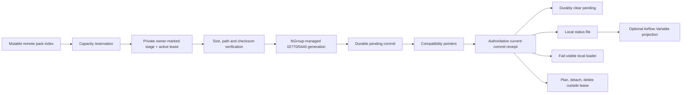

# Legacy Airflow pack cache operations

This runbook is for the compatibility command
`dpone-airflow-pack-sync`, which consumes a mutable
`latest/pack-index.json`. New installations should use the exact immutable
release/deployment flow described in
[Airflow cache sync and recovery](airflow-cache-sync.md).

## What this cache is

The two cache formats are intentionally separate:

| Purpose | Canonical root | Layout marker | Active identity |
| --- | --- | --- | --- |
| Exact release/deployment | `/opt/airflow/.dpone-cache` | `exact_deployment_v1` | `current` symlink plus `current-pointer.json` |
| Legacy mutable pack index | `/opt/airflow/.dpone-legacy-pack-cache` | `legacy_pack_index_v1` | text `current` plus `status/current-commit.json` |

The historical default
`/opt/airflow/dags/.dpone-cache/airflow` remains readable for compatibility.
It is a legacy root, not an alias for the exact cache. Shared deployments
should pass `--cache-dir` explicitly and migrate to the paths above. Do not put
one layout inside the other and do not copy `current`, the layout marker, or a
commit receipt between roots.

## Runtime model



Remote download, full-tree hashing, and recursive deletion do not hold the
scheduler-blocking writer lease. The lease protects only stage ownership
updates, final compare-and-swap activation, and path detachment. A delayed
watcher cannot replace a newer commit.

The durable commit receipt is authoritative. Both compatibility pointers must
match it. The status file is derived from that validated state. An Airflow
Variable is only a diagnostic projection; publication is sequence-aware, but
the Variable can lag after process termination or an Airflow metadata outage.

## Pre-upgrade checklist

Before enabling the hardened watcher:

1. inventory the current cache root, volume limit, generation count, largest
   index, largest pack/spec, container UID/GID, and Kubernetes `fsGroup`;
2. confirm the exact and legacy commands use different roots;
3. size the volume above `max_total_bytes` plus filesystem/container overhead;
4. verify publishers include artifact `size_bytes`; historical entries without
   it reserve the full `max_pack_bytes` and may require a larger cache;
5. confirm all cache writers share ownership through one UID or `fsGroup`;
6. run `--once` in a disposable root and inspect the receipt/status before
   switching the watch sidecar;
7. retain the previous root read-only until DAG inventory and loader evidence
   converge.

Changing from an unbounded historical cache to the defaults can intentionally
block a generation larger than 512 MiB or an index larger than 25 MiB. Increase
the bounded volume and explicit limits together; do not disable checks by
editing cache files.

## Filesystem and Kubernetes contract

- shared cache/control directories are explicitly `02775` and files `0664`,
  independent of process umask, when the writer owns the inode;
- foreign-owned shared roots (typical PVC mount owned by uid 0) must already
  provide at least those shared bits and are never chmod'd by the Airflow UID;
  provision `02775` when the volume plugin allows it. Supersets such as
  `02777` remain accepted for CSI compatibility, but the volume must stay
  confined to the Airflow `fsGroup`/node identity — world-writable shared
  roots on multi-tenant NFS/hostPath are unsupported;
- stage and generation work directories are `02770`; staged controls are
  `0660`, and published files are `0440` (exact contract — world-writable
  foreign mounts are rejected);
- reservations and attempt locks are shared controls, while payload paths stay
  inaccessible outside the configured group;
- all writers must use the same UID or a writable Kubernetes `fsGroup`;
- scheduler/DAG processor readers need traverse/read access only;
- the filesystem must support atomic same-filesystem rename, directory fsync,
  and POSIX `flock`; NFS/PVC behavior must be certified before use;
- pack/index/DAG-spec bytes must not contain secrets because generation bytes
  are intentionally readable by Airflow parser identities.

For `emptyDir`, set the pod security context `fsGroup` consistently and set
`emptyDir.sizeLimit` at or above the configured cache budget plus operating
overhead. A PVC also needs an enforced quota; a cache option is not a storage
class quota.

## Configure and run

```bash
dpone-airflow-pack-sync \
  --once \
  --index-uri s3://bucket/dpone-artifacts/prod/repo/latest/pack-index.json \
  --reader-connection-id s3_dpone_artifacts_reader \
  --cache-dir /opt/airflow/.dpone-legacy-pack-cache \
  --max-total-bytes 512MiB \
  --max-pack-bytes 10MiB \
  --max-index-bytes 25MiB \
  --keep-generations 3 \
  --high-watermark-pct 80 \
  --low-watermark-pct 60 \
  --partial-download-ttl-minutes 30 \
  --status-path /opt/airflow/.dpone-legacy-pack-cache/status/last-sync-status.json
```

Defaults match the values above. Policy validation happens before cache
creation or remote I/O. Required relationships are:

- positive byte limits, or `null` through the Python API;
- `keep_generations >= 1`;
- `0 < low_watermark_pct < high_watermark_pct <= 100`;
- `partial_download_ttl_minutes >= 1`.

### Output and exit codes

`--once` writes one JSON status object to stdout.

| Outcome | Exit | Streams |
| --- | --- | --- |
| `status=success` | `0` | JSON on stdout |
| `status=warning` | `0` | JSON on stdout; inspect `warnings[]` |
| `status=blocked` | `1` | JSON on stdout; inspect `blockers[]` |
| Command/transport/policy exception | `1` | redacted message on stderr; fail-open warning evidence when possible |
| Invalid CLI syntax or invalid option relationship | `2` | argparse diagnostic on stderr; cache and remote storage are not touched |

The watcher mode catches a failed cycle, records warning evidence, sleeps, and
retries. Use the following bounded init command; its outer shell is the only
fail-open boundary:

```sh
set +e
timeout "${DPONE_PACK_SYNC_TIMEOUT_SECONDS:-20}" \
  dpone-airflow-pack-sync --once \
  --index-uri "${DPONE_AIRFLOW_PACK_INDEX_URI}" \
  --reader-connection-id "${DPONE_AIRFLOW_PACK_READER_CONNECTION_ID}" \
  --cache-dir "${DPONE_AIRFLOW_PACK_CACHE_DIR}" \
  --status-path "${DPONE_AIRFLOW_PACK_CACHE_DIR}/status/last-sync-status.json"
sync_rc=$?
printf 'dpone pack init sync exit=%s; Airflow startup remains fail-open\n' "${sync_rc}"
exit 0
```

Set `DPONE_AIRFLOW_PACK_CACHE_DIR` explicitly to
`/opt/airflow/.dpone-legacy-pack-cache`; never point this command at the exact
cache. The 20-second timeout is configurable. A timeout, S3 denial, hash
mismatch, or missing connection cannot fail the Airflow pod, but it also does
not turn cache readiness green: without a trusted current generation the
provider loader remains fail-visible and reports an import diagnostic instead
of silently loading zero dpone DAGs. Run the continuous `--watch` process as a
restartable sidecar, not from DAG parsing.

The status object uses `kind=dpone.airflow_pack_cache_status` and
`schema_version=1`. Its stable operational fields are:

| Field | Meaning |
| --- | --- |
| `status`, `reason` | Outcome and stable lifecycle classification. |
| `component` | Writer role supplied by `DPONE_AIRFLOW_PACK_SYNC_COMPONENT`, for example `dag-processor`. |
| `attempted_at`, `finished_at` | Start and end of this exact sync cycle. |
| `last_success_at` | Last completed commit-backed cycle without blockers. A completed cycle with advisory warnings advances it; a command/transport warning that did not complete sync preserves the previous value. |
| `attempt_generation` | Remote generation this cycle tried to materialize. |
| `current_generation` | Receipt-authorized local generation after the cycle. |
| `commit_id`, `commit_sequence` | Local activation identity and monotonic ordering. |
| `index_sha256` | Digest bound by the authoritative receipt. |
| `generation_committed` | Whether this attempt created the current commit. |
| `cache_bytes` | Measured bytes after retention, or `-1` when measurement failed and a blocker is present. |
| `downloaded_pack_count`, `downloaded_dag_spec_count` | Bounded artifact counts for this attempt. |
| `warnings[]`, `blockers[]` | Machine-readable evidence; blockers make `--once` non-zero. |
| `diagnostic_authority` | `local_commit_receipt`; remote/Variable state is not activation authority. |

## Inspect authority

```bash
dpone-airflow-pack-cache-status \
  --cache-dir /opt/airflow/.dpone-legacy-pack-cache \
  --json
```

Check these fields in order:

1. `layout == legacy_pack_index`;
2. `status` and stable `blockers[].code`;
3. `current_generation`;
4. `commit_id`, `commit_sequence`, and `index_sha256`;
5. requested workload `exists`, expected digest, actual digest, and size;
6. `last_sync_status` only as supporting diagnostic evidence.

Never choose an Airflow Variable over a contradictory local receipt. The
Variable can be stale; the local cache controls the bytes parsed by Airflow.
The status file is atomically replaced once per completed success or failed
watch cycle. It is diagnostic and may be stale after abrupt pod termination;
compare `finished_at`, `last_success_at`, pod identity, local receipt, and
current pointer before drawing a conclusion.

Do not hand-assemble Kubernetes mounts from this compatibility section. Use
the writer/read-only parser boundary and official-chart examples in
[Deploy the exact cache on Kubernetes](airflow-cache-kubernetes-deployment.md),
substituting the dedicated legacy root only while migration is active.

## Recovery matrix

| Signal | Meaning | Safe action |
| --- | --- | --- |
| `airflow_pack_cache_layout_invalid` / `DPONE_CACHE_LAYOUT_AMBIGUOUS` | The root is malformed or contains both layouts. | Stop that writer, preserve the root, create a clean root of the intended layout, run one sync, verify it, then switch the mount/env. Do not delete individual control files. |
| `DPONE_CACHE_LAYOUT_MISMATCH` | The command targets the other cache type. | Correct `--cache-dir`; never force or rewrite the marker. |
| `airflow_pack_commit_receipt_missing` | A versioned legacy root has no durable commit authority. | Stop concurrent writers, rerun one verified sync against the same remote index. If it does not recover, move to a new clean legacy root and preserve the old root for diagnosis. |
| `airflow_pack_commit_receipt_invalid` with pending/uncertain reason | A prepared commit did not finish durably. | Run one single-writer sync. It verifies the immutable generation and completes the prepared commit before fetching new bytes. Do not delete pending state. |
| `airflow_pack_commit_receipt_mismatch` or `airflow_pack_cache_authority_mismatch` | Receipt, text pointer, or compatibility symlink disagree. | Stop concurrent writers and run one verified sync. Generation pruning remains blocked until authority converges. Do not edit pointers by hand. |
| `airflow_pack_commit_index_mismatch` | The receipt digest does not identify the active index bytes. | Preserve the root and remote index, stop promotion, and run recovery. If validation remains red, materialize a clean root from a republished immutable generation. |
| `airflow_pack_cache_budget_exceeded` | Safe retention could not get below the hard byte budget without deleting protected current bytes. | Inspect current generation size. Publish smaller packs or approve a larger bounded volume/budget. Do not delete the active generation. |
| `airflow_pack_cache_capacity_unavailable` | The requested generation cannot fit beside protected bytes before download. | Publish declared sizes, reduce pack count/size, or increase both volume and explicit budget. The current generation remains active. |
| `airflow_pack_cache_retention_unavailable` | The hard budget cannot be safely enforced because planning, detach, or measurement failed. | Treat as blocker. Repair filesystem permissions/capacity and rerun; do not downgrade to warning. |
| `cache_retention_skipped_current_changed` | Another writer committed after retention planning. | Normal concurrency warning; run the next cycle. The old plan was not applied. |
| `cache_generation_prune_failed` | Detach/delete or status cleanup failed. | Verify filesystem permissions and free space. Retry. Treat persistent growth as an operations alert. |
| `cache_active_stage_preserved` | Heartbeat is old, but an active process lease still owns the stage. | Do not delete it. Investigate a slow object read; the hard budget will block new downloads if necessary. |
| abandoned `.staging` bytes | A prior process stopped during download. | Wait past the configured TTL. A later cycle deletes only an expired, unlocked owner-marked stage after revalidation. Do not recursively delete an unknown live stage. |
| `airflow_pack_hash_mismatch` / generation conflict | Remote index, downloaded bytes, or an existing immutable generation disagree. | Stop promotion, preserve evidence, and republish a new immutable generation. Never accept by renaming or editing bytes. |
| Airflow Variable shows an older generation | The previous process ended or metadata publication failed after local commit. | Compare local `commit_sequence` and receipt, rerun one projection cycle, and alert only if divergence persists. |

## Verify recovery

After any repair:

1. run one `--once` cycle and require exit `0` with no blockers;
2. run `dpone-airflow-pack-cache-status --json` and record the local commit
   identity;
3. verify the expected workload packs and DAG specs are present and
   checksum-valid;
4. parse with the same scheduler/dagProcessor image and UID contract;
5. compare expected DAG IDs through Airflow REST API;
6. restart the parse-authority pod in an approved environment and confirm the
   cache rematerializes or the last-known-good generation remains readable.

If live Airflow or Kubernetes access is unavailable, record the live step as
`UNVERIFIED`; local status and unit tests are not a substitute.

## Rollback and removal

The legacy cache is not the production rollback authority. Roll back an exact
deployment by selecting a retained exact release/deployment. During migration,
keep the legacy root read-only until exact loader acknowledgement and REST DAG
convergence are green. Then remove the legacy watcher and delete its root only
through the owning infrastructure change. See the
[provider/cache migration guide](airflow-provider-cache-migration.md).
