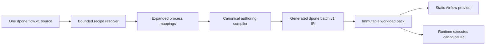

# Recipes, profiles, and components

This guide explains how a data engineer creates a pipeline from a platform-owned
recipe and how a platform engineer publishes that recipe safely. The beginner
path stays declarative: no Airflow Python, Vault path, pack, or Kubernetes object
is required.

Built-in recipes remain the shortest First DAG path. Use an external recipe when
the platform team needs reusable defaults, locked policy, or a reusable process
subgraph.

Start from your route (source → sink). Built-in recipes map to common routes:

| Recipe ref | Route (source → sink) | Strategy |
| --- | --- | --- |
| `mssql-to-clickhouse-incremental` | MSSQL → ClickHouse | incremental merge (`incremental_merge`) |
| `mssql-to-clickhouse-full-refresh` | MSSQL → ClickHouse | full refresh (`full_refresh`) |
| `postgres-to-clickhouse-incremental` | PostgreSQL → ClickHouse | incremental merge (`incremental_merge`) |
| `postgres-to-clickhouse-full-refresh` | PostgreSQL → ClickHouse | full refresh (`full_refresh`) |

See [First Airflow DAG](getting-started/first-airflow-dag.md) and the
[source → sink matrix](source-sink-matrix.md).

## Data engineer: create a pipeline

### 1. Discover recipes

```bash
dpone recipe list \
  --source mssql \
  --sink clickhouse \
  --strategy incremental_merge
dpone recipe show mssql-to-clickhouse-incremental
```

These commands work with the built-in catalog in a fresh project. `list` is
optional when the First DAG guide already gives you the exact built-in name.
External recipes require a platform-configured catalog and always use
`id@MAJOR.MINOR.PATCH`; `latest`, ranges, and unpinned Git references are
rejected.

The `show` command returns safe metadata, available parameters, and allowed
profiles. Discovery also returns route support, certification evidence,
required install extras, limitations, and a structured next-command `argv`.
It does not print Vault paths, secret values, or environment bindings.

Abridged `list --format json` output:

```json
{
  "recipes": [
    {
      "ref": "mssql-to-clickhouse-incremental",
      "route_id": "mssql:clickhouse:incremental_merge",
      "support_status": "supported",
      "evidence_status": "UNVERIFIED",
      "scaffoldable": true
    }
  ]
}
```

Abridged `show --format json` output includes the exact next command:

```json
{
  "ref": "mssql-to-clickhouse-incremental",
  "source": "mssql",
  "sink": "clickhouse",
  "strategy": "incremental_merge",
  "scaffold_argv": [
    "dpone", "init", "pipeline", "<pipeline_id>",
    "--recipe", "mssql-to-clickhouse-incremental"
  ]
}
```

Install extras describe drivers needed for live checks or runtime execution.
They are not required for offline recipe discovery, scaffolding, static
`check`, or Airflow preview.

### 2. Create the authoring source

For the built-in beginner route:

```bash
dpone init pipeline orders_daily \
  --recipe mssql-to-clickhouse-incremental
```

The equivalent route-first form resolves the one declared default recipe before
writing any files:

```bash
dpone init pipeline orders_daily \
  --route mssql:clickhouse:incremental_merge
```

`--route` and `--recipe` are mutually exclusive. Both forms resolve through the
same capability snapshot before any file is written. A runtime-supported route
without a beginner recipe reports `DPONE_ROUTE_NOT_SCAFFOLDABLE`; an explicit
external recipe whose declared route is absent or unsupported reports
`DPONE_ROUTE_NOT_SUPPORTED`. Both failures leave the project unchanged.

For a configured platform catalog:

```bash
dpone init pipeline orders_daily \
  --recipe governed-mssql-clickhouse@1.2.0 \
  --profile incremental-defaults@1.0.0
```

The command writes one editable `dpone.flow.v1` primary source, its domain
catalog entry, and a test skeleton. Repeating the same command is a deterministic
no-op. Recipe, profile, and component files remain platform-owned inputs; dpone
does not copy or expand them into another editable manifest.

For allowed per-pipeline values, use a project-confined answers file:

```yaml
source_connection_ref: mssql_sales_prod
sink_connection_ref: clickhouse_analytics_prod
source_table: orders
```

```bash
dpone init pipeline orders_daily \
  --recipe governed-mssql-clickhouse@1.2.0 \
  --profile incremental-defaults@1.0.0 \
  --answers answers/orders_daily.yaml
```

Answers are bounded scalar values. Credential-like keys and values are rejected.
Use logical `connection_ref` values; credentials continue to resolve through the
environment binding and credential resolver at workload start.

### 3. Check and preview

```bash
dpone check orders_daily
dpone airflow preview orders_daily
dpone test orders_daily
```

All three commands resolve only the exact artifact paths and SHA-256 digests pinned in
the primary source. They perform no network, Vault, Airflow Connection, Variable,
or metadata database calls. The JSON output includes `recipe_resolution` with
the catalog id, recipe/profile/component refs, ordered closure digests, owner,
status, and domain.

### Optional: Run the platform-gated safe sample

```bash
dpone run orders_daily --sample 1000 --target temporary
```

The sample path independently verifies the primary source and complete recipe
closure against the pinned workload pack before credentials or data access. A
changed artifact blocks the run and asks for a new build/deployment.

## What dpone generates

The primary source contains an exact, replayable recipe lock:

```yaml
kind: dpone.flow.v1
authoring:
  mode: flow
  source: pipelines/orders_daily/pipeline.yaml
metadata:
  id: orders_daily
  domain: sales
  tags:
    - dpone
    - airflow
recipe:
  catalog_id: data-platform
  ref: governed-mssql-clickhouse@1.2.0
  artifact_ref: platform/recipes/recipes/governed-mssql-clickhouse-1.2.0.yaml
  sha256: sha256:aaaaaaaaaaaaaaaaaaaaaaaaaaaaaaaaaaaaaaaaaaaaaaaaaaaaaaaaaaaaaaaa
  profile_ref: incremental-defaults@1.0.0
  parameters:
    source_connection_ref: mssql_sales_prod
    sink_connection_ref: clickhouse_analytics_prod
    source_table: orders
```

The compiler resolves the pinned data-only closure and then delegates to the
existing canonical batch compiler:



Recipe parsing and expansion happen only on the build plane. Airflow DAG parsing
reads the static deployment index/spec/pack. Runtime may verify source digests,
but it executes the materialized canonical IR and never imports or executes a
recipe plugin.

## Platform engineer: publish a catalog

### Project trust configuration

Configure one local materialized catalog and an explicit allowlist:

```yaml
schema: dpone.project.v1
authoring:
  primary_source_policy: one_per_pipeline
  recipe_catalog:
    path: platform/recipes/catalog.yaml
    trusted_catalog_ids:
      - data-platform
```

The catalog itself contains exact pins:

```yaml
schema: dpone.recipe-catalog.v1
catalog_id: data-platform
artifacts:
  - kind: recipe
    ref: governed-mssql-clickhouse@1.2.0
    artifact_ref: platform/recipes/recipes/governed-mssql-clickhouse-1.2.0.yaml
    sha256: sha256:aaaaaaaaaaaaaaaaaaaaaaaaaaaaaaaaaaaaaaaaaaaaaaaaaaaaaaaaaaaaaaaa
```

The recipe owns its allowed profile pins and ordered component pins. A profile
provides defaults and locked parameter names. A component contains declarative
process mappings with whole-value `$param` or `$context` placeholders.

### Pin and validate

```bash
dpone recipe pin platform/recipes/components/mssql-clickhouse-load-1.0.0.yaml
dpone recipe validate
```

`pin` prints the logical kind/ref/path/SHA-256 entry to review before adding it to
the parent artifact or catalog. `validate` reads the complete catalog closure,
checks identities, schemas, bounds, digest pins, parameter references, and
declarative-only constraints. Neither command modifies source files.

Artifact versions are immutable. Never replace bytes behind an existing
kind/ref/digest. Publish a new version, update the parent pin, validate, and let
ordinary source review select that exact version.

For environment promotion, package the validated closure as an externally
signed, content-addressed directory. The data engineer command does not change;
this is a platform CI control. See [signed catalog bundles](signed-catalog-bundles.md).

### Lifecycle

Supported publication-time states are `experimental`, `stable`, and
`deprecated`. A pinned deprecated artifact still compiles deterministically and
emits `DPONE_RECIPE_ARTIFACT_DEPRECATED:<kind>:<ref>`. The old immutable file is
not edited to add a replacement. Migration guidance belongs in platform docs and
catalog discovery.

## Parameter rules

Precedence is deterministic:

```text
recipe defaults < selected profile values < allowlisted source parameters
```

- At most 64 scalar parameters are accepted.
- A profile can lock parameters; locked names cannot appear in the override
  allowlist.
- Identifier and `connection_ref` formats are validated before expansion.
- Placeholders replace a complete YAML value only. String interpolation is not
  supported.
- Python, module, callable, shell, command, Jinja/template syntax, credential
  fields, and dynamic secret lookups are rejected.

## Bounds and trust

| Contract | Limit |
| --- | ---: |
| Catalog entries | 1,000 |
| Catalog or artifact | 1 MiB |
| Complete recipe closure | 8 MiB |
| Components per recipe | 32 |
| Expanded processes | 100 |
| Expansion nodes | 10,000 |

All paths are project-relative POSIX paths. Traversal, backslashes, symlinks,
non-regular files, YAML aliases/anchors, duplicate keys, and digest mismatches
fail closed.

## Diagnose and recover

Machine-readable failures use `dpone.error.v1`. Stable exit codes are:

| Exit | Meaning |
| ---: | --- |
| `1` | validation or catalog contract failed |
| `2` | bad CLI/ref/authoring-mode usage |
| `4` | security or safety policy violation |

Common recovery commands:

```bash
dpone recipe list
dpone recipe show governed-mssql-clickhouse@1.2.0
dpone recipe validate
dpone airflow explain orders_daily
```

Filtered `recipe list` output contains both `routes[]` and `recipes[]`. A
runtime-supported route therefore remains visible with
`beginner.recipe_available: false` when no scaffold recipe exists. Invalid
capability evidence configuration returns `passed: false`, includes
`issues[]`, exits `1`, and writes JSON to stderr; successful discovery writes
to stdout.

On a digest mismatch, restore the exact immutable bytes or publish a new version;
do not rewrite the digest to bless unreviewed content. On
`DPONE_RECIPE_SOURCE_CHANGED_DURING_BUILD`, rerun check/preview only after the
source tree is stable. A failed scaffold writes no partial pipeline bundle, and a
failed preview does not publish a current release/deployment.

See the exact [CLI reference](cli-reference.md), [compatibility policy](compatibility.md),
and per-code pages under the [error catalog](errors/DPONE_RECIPE_CATALOG_INVALID.md).
