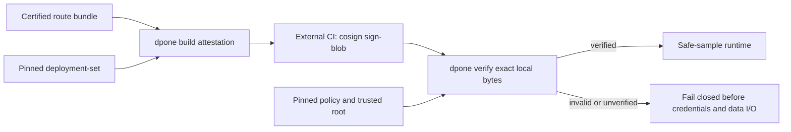

# Production route attestation

This runbook is for platform and security engineers who enable the production
safe-sample runtime and its automatic beginner facade. Pipeline authors do not
edit these files and the five-command beginner journey does not gain another
step.

The production contract is simple: a route name is metadata, not authority.
Runtime starts only after dpone verifies an externally signed authorization
whose route, certification, release, deployment, environment, runtime image,
signer, and validity all match the workload that is about to run.



## Files and ownership

| File | Owner | Rule |
| --- | --- | --- |
| `route_certification_bundle.json` | route certification CI | Must be `vendor_live`, passed, and `certified` for production |
| `deployment.json` | deployment CI | Must be a runnable immutable deployment |
| `route-attestation.json` | deployment CI | Deterministic, create-only unsigned blob |
| `route-attestation.sigstore.json` | external signer | Sigstore bundle over the exact attestation bytes |
| `route-attestation-policy.json` | platform/security | Exact signer, trust-root digest, profiles, bounds, and revocations |
| `trusted_root.json` | platform/security | Local pinned Sigstore trust material |
| `route-attestation-verification.json` | verifier | Create-only safe receipt; never contains secrets or verifier output |

Do not put private keys, OIDC tokens, Vault tokens, passwords, signed download
URLs, registry bodies, or secret values in any of these files.

## Prerequisites

- Use `cosign >=3.0.4,<4.0.0`. Older or unknown versions fail closed.
- Materialize all verification inputs before the workload starts.
- Give the runtime read-only access to the exact files it needs.
- Keep verification directories platform-owned. dpone additionally rejects
  parent/final symlinks, `..` traversal, and parent/file inode swaps while
  reading or publishing trust evidence.
- Deny verifier network egress in production. Trust-root refresh is a separate
  reviewed deployment action.
- Keep the attestation lifetime bounded and synchronize runtime clocks.
- Retain the referenced route-certification and deployment artifacts for audit.

## 1. Write the policy

The certificate identity and issuer are exact strings, not regular
expressions. The trusted-root path may be relative to the policy file.

```json
{
  "schema": "dpone.route-attestation-policy.v1",
  "backend": "cosign_keyless_v1",
  "certificate_identity": "https://github.com/PaulKov/dpone/.github/workflows/route-attestation.yml@refs/heads/master",
  "certificate_oidc_issuer": "https://token.actions.githubusercontent.com",
  "trusted_root": {
    "path": "trusted_root.json",
    "sha256": "sha256:REPLACE_WITH_EXACT_ROOT_DIGEST"
  },
  "cosign": {
    "minimum_version": "3.0.4",
    "maximum_version_exclusive": "4.0.0",
    "timeout_seconds": 30
  },
  "allowed_environments": ["production"],
  "allowed_authorization_profiles": ["safe_sample_production"],
  "allowed_certification_profiles": ["vendor_live"],
  "minimum_certification_level": "certified",
  "max_validity_seconds": 86400,
  "clock_skew_seconds": 300,
  "revoked_attestation_ids": [],
  "revoked_certificate_identities": []
}
```

Changing this policy changes its fingerprint. Revocation is local and
fail-closed: publish a new immutable policy snapshot and restart/retry the
workload so it verifies the new snapshot.

## 2. Build the unsigned blob

Use explicit timestamps so CI inputs are reviewable and reproducible. Generate
them immediately before the build; do not copy a historical validity window.
The example uses a one-hour window within the default 24-hour policy bound and
writes every proof into one explicit evidence directory.

```bash
export DPONE_ROUTE_EVIDENCE_DIR="test_artifacts/routes/mssql-clickhouse-prod-a"
mkdir -p "${DPONE_ROUTE_EVIDENCE_DIR}"
export DPONE_ATTESTATION_ISSUED_AT="$(uv run python -c 'from datetime import UTC, datetime; print(datetime.now(UTC).replace(microsecond=0).isoformat().replace("+00:00", "Z"))')"
export DPONE_ATTESTATION_EXPIRES_AT="$(uv run python -c 'from datetime import UTC, datetime, timedelta; print((datetime.now(UTC) + timedelta(hours=1)).replace(microsecond=0).isoformat().replace("+00:00", "Z"))')"

dpone ops route-attestation-build \
  --route-id mssql_clickhouse_incremental_merge_airflow_kpo \
  --route-certification-bundle "${DPONE_ROUTE_EVIDENCE_DIR}/route_certification_bundle.json" \
  --deployment-set "${DPONE_ROUTE_EVIDENCE_DIR}/deployment.json" \
  --authorization-profile safe_sample_production \
  --issued-at "${DPONE_ATTESTATION_ISSUED_AT}" \
  --not-before "${DPONE_ATTESTATION_ISSUED_AT}" \
  --expires-at "${DPONE_ATTESTATION_EXPIRES_AT}" \
  --output "${DPONE_ROUTE_EVIDENCE_DIR}/route-attestation.json" \
  --format json
```

The command refuses to replace an existing output. The `attestation_id` is the
canonical fingerprint of claims only; volatile build metadata is not part of
identity. The external signature covers the complete emitted file bytes.

## 3. Sign outside dpone

Run signing in the approved identity-bearing CI workflow. dpone does not sign
and does not receive private key material.

```bash
cosign sign-blob --yes \
  --bundle "${DPONE_ROUTE_EVIDENCE_DIR}/route-attestation.sigstore.json" \
  "${DPONE_ROUTE_EVIDENCE_DIR}/route-attestation.json"
```

Publish the attestation and Sigstore bundle together by digest. Never edit the
attestation after signing.

## 4. Run credential-free preflight

```bash
dpone ops route-attestation-verify \
  --attestation "${DPONE_ROUTE_EVIDENCE_DIR}/route-attestation.json" \
  --sigstore-bundle "${DPONE_ROUTE_EVIDENCE_DIR}/route-attestation.sigstore.json" \
  --route-certification-bundle "${DPONE_ROUTE_EVIDENCE_DIR}/route_certification_bundle.json" \
  --policy "${DPONE_ROUTE_EVIDENCE_DIR}/route-attestation-policy.json" \
  --deployment-set "${DPONE_ROUTE_EVIDENCE_DIR}/deployment.json" \
  --output-dir "${DPONE_ROUTE_EVIDENCE_DIR}" \
  --format json
```

Exit `0` means `verified`. Malformed platform input uses exit `2`.
Cryptographically invalid, expired, revoked, mismatched, unsupported, or
unavailable trust uses exit `4`. No state falls back to a route ID string.

## 5. Materialize the beginner authorization overlay

For the five-command facade, platform cache synchronization publishes all four
route inputs beneath the exact deployment and pipeline identity:

```text
.dpone-cache/route-authorizations/
  sha256-<deployment digest>/<pipeline_id>/
    route-attestation.json
    route-attestation.sigstore.json
    route-certification-bundle.json
    route-attestation-policy.json
```

Build this directory in a sibling staging path, verify the exact files there,
then rename the complete directory into place. Never populate the final
directory one file at a time. The reader treats absence as network-free local
handoff, but treats an existing incomplete directory as
`DPONE_SAFE_SAMPLE_LIVE_INPUTS_INCOMPLETE` and performs no credential or
database I/O.

The final path is derived by dpone from the verified deployment context and
canonical pipeline ID. It cannot contain `current`, come from a manifest, or be
overridden by the beginner command. Parent/final symlinks, path escape, stale
deployment subjects, invalid signatures, and policy mismatch all fail closed.

The environment files remain platform-owned at their existing locations:

```text
environments/<environment>/binding-set.yaml
environments/<environment>/credential-runtime.yaml
platform/connection-registries/<environment>.yaml
```

Their canonical fingerprints must match the deployment. The authorization
directory contains no credentials, registry body copy, Vault token, or signed
download URL. With this layout complete, the normal user command automatically
selects `execution_mode=live_copy`; no second command is needed.

The beginner report calls this layout
`authorization_overlay_profile: deployment_scoped_v1`. That field identifies
cache discovery only. It does not replace the signed attestation's
`authorization_profile: safe_sample_production` and grants no authority by
itself.

| Field | Owner | Meaning | Grants runtime authority |
| --- | --- | --- | --- |
| `authorization_overlay_profile` | dpone cache discovery | Version of the deployment-scoped local layout | No |
| `authorization_profile` | signed route attestation + security policy | Permitted production use of the signed subject | Only after full verification |

### Recover an incomplete overlay

1. Stop publishing into the final directory.
2. Verify all four files in a sibling staging directory with
   `dpone ops route-attestation-verify`.
3. Replace the complete deployment/pipeline directory with one atomic rename;
   never copy a missing file into the active directory.
4. Confirm ownership and read-only permissions, then ask the user to rerun the
   same fifth beginner command.
5. If verification still fails, retain the failed inputs for audit and follow
   the error-specific action below. Do not remove a policy guard to make the
   sample pass.

## 6. Pass pinned files to an explicit runtime

This section is a platform/operator escape hatch. Do not send this command to a
pipeline author as a sixth beginner step. These flags belong to the platform
handoff, not to pipeline authoring:

```bash
dpone ops safe-sample-runtime-run \
  --plan-json /run/dpone/safe-sample-plan.json \
  --pipeline-source /run/dpone/pipeline.yaml \
  --enable-live-copy \
  --binding-set /run/dpone/binding-set.json \
  --connection-registry /run/dpone/connection-registry.json \
  --credential-runtime /run/dpone/credential-runtime.json \
  --route-attestation /run/dpone/route-attestation.json \
  --route-attestation-bundle /run/dpone/route-attestation.sigstore.json \
  --route-certification-bundle /run/dpone/route-certification-bundle.json \
  --route-attestation-policy /run/dpone/route-attestation-policy.json \
  --cache-root /run/dpone/cache \
  --output-dir /run/dpone/evidence \
  --format json
```

Runtime derives the expected route from the pinned pipeline and derives the
release, deployment, environment, and image from the execution plan. It never
uses those values from command context or author-written proof text. Only a
`verified` receipt is converted to the existing internal capability signal.

## Failure guide

| Code family | Meaning | Action |
| --- | --- | --- |
| `DPONE_SAFE_SAMPLE_LIVE_INPUTS_INCOMPLETE` | Deployment overlay exists but is only partially materialized | Re-sync the complete directory atomically |
| `DPONE_SAFE_SAMPLE_LIVE_INPUT_PATH_INVALID` | Derived/local input path is unsafe or symlinked | Remove it and restore from trusted platform CI |
| `DPONE_INTERNAL_SAFE_SAMPLE_LIVE_ASSEMBLY_FAILED` | Unexpected internal assembly failure; exception text is redacted | Preserve run context and inspect platform logs; do not bypass trust checks |
| `DPONE_ROUTE_ATTESTATION_INPUT_*` | Missing, malformed, oversized, or unsafe local input | Correct materialization; do not bypass |
| `DPONE_ROUTE_ATTESTATION_POLICY_INVALID` | Policy is incomplete or outside supported bounds | Publish a corrected immutable policy |
| `DPONE_ROUTE_ATTESTATION_*_DIGEST_MISMATCH` | Exact bytes differ from signed/pinned identity | Investigate drift and rebuild/re-sign |
| `DPONE_ROUTE_ATTESTATION_SIGNATURE_INVALID` | Signature or exact signer identity failed | Investigate signer or tampering |
| `DPONE_ROUTE_ATTESTATION_SUBJECT_MISMATCH` | Proof belongs to another release/deployment/runtime | Build a new attestation for this deployment |
| `DPONE_ROUTE_ATTESTATION_EXPIRED` | Authorization lifetime ended | Re-certify as needed and sign a fresh bounded attestation |
| `DPONE_ROUTE_ATTESTATION_REVOKED` | Attestation or signer is denied by current policy | Stop and follow the security incident process |
| `DPONE_ROUTE_ATTESTATION_VERIFIER_*` | cosign is missing, timed out, or unsupported | Repair the runtime image; result remains `unverified` |
| `DPONE_ROUTE_ATTESTATION_TRUST_ROOT_UNAVAILABLE` | Local root bytes do not match the policy digest | Restore approved trust material |

Do not fix a digest mismatch by editing an immutable artifact. Build a new
artifact, sign it through the approved workflow, and retain the old evidence.

## Evidence and current certification status

Successful runtime evidence adds only safe verification metadata: decision,
codes, attestation/certification/policy digests, route ID, release/deployment,
exact signer identity, bounded validity, verifier version, and verification
time. It excludes certificates, bundles, trust-root bytes, Vault paths,
credentials, subprocess output, and sampled records.

Local contract tests cover the complete decision and injection boundaries.
End-to-end Sigstore + Kubernetes + Vault + MSSQL + ClickHouse execution remains
`UNVERIFIED` until an explicitly approved live environment runs this exact
commit and stores its certification receipt. A skipped or mocked run is not a
production pass.

## Related contracts

- [ADR 0014](adr/0014-route-attestation-production-trust.md)
- [Industrial Airflow self-service architecture](airflow-self-service-architecture.md)
- [Airflow cache sync and recovery](airflow-cache-sync.md)
- [Compatibility](compatibility.md)
- [GitOps schema catalog](reference/gitops-schema-catalog.md)
