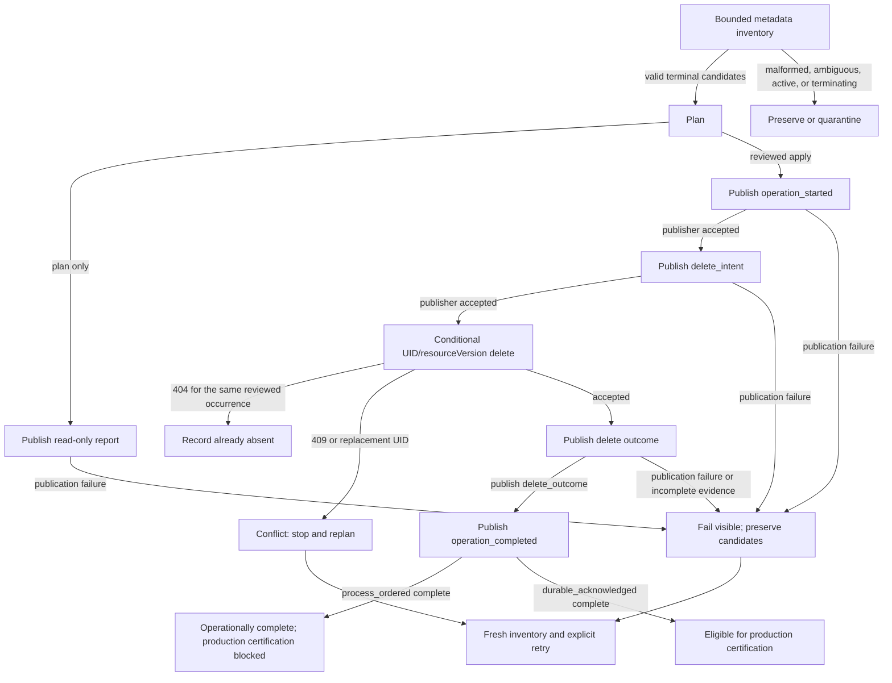

# Runtime Pod retention architecture

**Purpose.** Explain the ownership, control flow, and safety boundaries of runtime Pod retention independently from operator commands.

**Audience.** Airflow architects, Kubernetes platform engineers, security reviewers, and maintainers of the dpone provider.

[Back to runtime Pod retention overview](airflow-runtime-pod-retention.md) · **Next likely task:** [deploy the reviewed control](airflow-runtime-pod-retention-kubernetes.md).

## Control flow

```text
Airflow task policy
  -> KubernetesExecutor/KPO runtime Pod
  -> provider best-effort successful-Pod cleanup
  -> terminal retained Pod inventory
  -> dpone plan classifier
  -> reviewed plan-mode CronJob
  -> explicitly approved apply mode
  -> conditional UID/resourceVersion delete
  -> event and apply evidence
```

The sweeper is a maintenance control, not execution authority. Airflow task
state, XCom summary, dpone runtime evidence, and load-step audit determine data
success. Cleanup failure never causes dpone to rerun an already committed data
load.

## Failure and retry branches



An HTTP 404 is acceptable only when it belongs to the same reviewed object
occurrence. A 409, UID replacement, stale inventory, incomplete event stream,
or publisher failure is not success: mutation stops, evidence remains
incomplete, and a retry requires fresh inventory. Quarantined Pods are never
silently converted into deletion candidates.

## Dependency boundaries

- Core classification and evidence contracts are Kubernetes-neutral.
- The Kubernetes adapter owns metadata inventory and conditional deletion.
- CLI and rendered CronJob are thin composition surfaces.
- Infrastructure owns namespace, immutable image, schedule, ServiceAccount,
  alert routing, log retention, activation, and rollback.
- Workload manifests cannot override the platform retention selector or delete
  policy.

## Safety properties

- One reviewed namespace only; no all-namespace inventory.
- Exact provider-owned labels and terminal phases only.
- Metadata-only list calls; no broad negative phase selector.
- Pending, Running, Unknown, terminating, malformed, ambiguous, or uncorrelated
  Pods are preserved.
- Every mutation uses observed UID and resourceVersion preconditions.
- Plan and apply evidence are bounded, schema-valid, and redact topology at the
  public CLI boundary.
- Plan mode cannot delete; apply requires an explicit actor, deletion
  capability, evidence capability, and confirmation.

## Airflow compatibility

Airflow 2.10 and Airflow 3.x use the same Pod labels and retention evidence.
The parser component differs, but runtime KubernetesExecutor/KPO Pods are
independent of scheduler cache storage. The control therefore targets provider
owned runtime Pods, never scheduler, DAG processor, API server, triggerer, or
Celery worker Pods.

## Rollback boundary

Rollback first suspends the exact CronJob occurrence. Full withdrawal preserves
forensics before deleting exact owned Jobs and access resources. The executable
procedure is in [runtime Pod retention withdrawal](airflow-runtime-pod-retention-withdrawal.md).

For classification details and stable errors, use the
[operations guide](airflow-runtime-pod-retention-operations.md).
