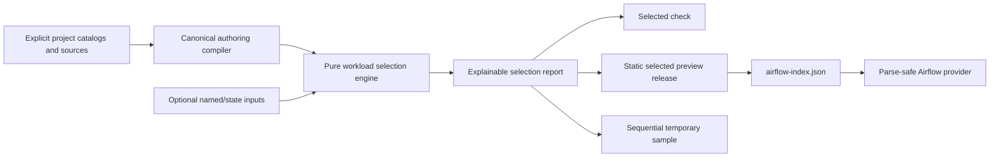

# Workload selectors

> **Advanced path (not the beginner journey).** If you are creating your first
> Airflow pipeline, start at [First Airflow DAG](getting-started/first-airflow-dag.md)
> instead.

Workload selectors let a data engineer validate, preview, or safely sample a
part of a dpone project without writing Airflow Python. Selection happens only
on the build/CLI plane. Airflow receives ordinary static DAG specs and packs.
Follow the
[advanced Data Engineer CJM](airflow-self-service-advanced-cjm.md) before using
selectors on day-to-day work. CLI `--help` for `check`, `airflow preview`, and
`run` lists these flags under **Advanced selection**.

## First use

From the project root, select all sales workloads and their downstream
dependants:

```bash
dpone check . --select 'domain:sales+'
dpone airflow preview . --select 'domain:sales+'
```

Exclude deprecated workloads after graph expansion:

```bash
dpone check . \
  --select 'tag:finance+' \
  --exclude 'tag:deprecated'
```

Every JSON result contains `selection.selected[].reasons`, so the user can see
whether a workload matched directly or was included as an ancestor/descendant.

## Grammar

```text
[+]method:value[+]
```

| Method | Exact metadata matched |
| --- | --- |
| `id:` | workload id |
| `tag:` | authoring/catalog tag |
| `domain:` | domain |
| `owner:` | owner |
| `source:` | compiled source connector type |
| `sink:` | compiled sink connector type |
| `group:` | domain workflow group |
| `state:` | `new`, `modified`, or `unmodified` against a baseline |
| `selector:` | named selector from `selectors.yaml` |

Prefix `+` includes all upstream ancestors. Suffix `+` includes all downstream
descendants. `+domain:sales+` includes both directions. Values are exact and
case-sensitive; globs, regular expressions, Jinja, URLs, and shell expressions
are rejected.

Repeated `--select` expressions are unioned. Repeated `--exclude` expressions
are unioned and subtracted after expansion. An empty final set fails with
`DPONE_SELECTION_EMPTY`.

## Named selectors

Create `selectors.yaml` at the project root:

```yaml
# yaml-language-server: $schema=https://raw.githubusercontent.com/PaulKov/dpone/master/src/dpone/schema/selectors.schema.json
schema: dpone.selectors.v1

selectors:
  sales_changed:
    description: Changed sales workloads and downstream dependants.
    select:
      - domain:sales
      - state:modified+
    exclude:
      - tag:deprecated
```

Use it with the same three facades:

```bash
dpone check . --select 'selector:sales_changed' --state previous-state.json
dpone airflow preview . --select 'selector:sales_changed' --state previous-state.json
```

Named selectors are declarative data. They cannot execute Python, templates, or
network calls. Recursive references are limited to depth 8 and cycles fail
closed.

## Changed-only preview

Each selected preview writes a canonical state snapshot beside the Airflow
index:

```text
.dpone-cache/current/airflow-index.json
.dpone-cache/current/selection-state.json
```

Use a trusted earlier snapshot explicitly:

```bash
dpone airflow preview . \
  --select 'state:modified+' \
  --state previous-selection-state.json
```

Formatting-only source changes do not match `state:modified`. Canonical
pipeline semantics or direct dependency changes do. Removed workloads are
reported but cannot be selected for current execution.

## Safe selected sample

Selected execution is intentionally bounded to temporary samples:

```bash
dpone run . \
  --select 'domain:sales' \
  --sample 1000 \
  --target temporary
```

Selector v1 runs at most 10 workloads, sequentially in id order. Every workload
gets a unique run id and temporary target. After the first failure, later
workloads are listed under `unscheduled` and are not started. Production
multi-workload execution remains an Airflow responsibility.

`--select` chooses workloads from a project. The older `run --selector` option
chooses one process inside one batch manifest. They are intentionally different
and neither is an alias for the other.

## Architecture



The provider does not parse expressions, scan the repository, read state, or
refresh cache. Preview keeps only edges whose two endpoints are selected and
records pruned boundary edges in release provenance.

## Limits and failures

| Surface | Default selected limit |
| --- | ---: |
| `dpone check` | 1000 |
| `dpone airflow preview` | 500 |
| selected safe sample | 10 |

Project loading is bounded to 1000 workloads, 5000 edges, 16 MiB total input,
100 named selectors, 100 expressions per named selector, and recursion depth 8.
Use the [selector error catalog](errors/DPONE_SELECTION_EXPRESSION_INVALID.md)
for stable codes and remediation.

## Public contracts

- Named selectors: `src/dpone/schema/selectors.schema.json`
- State: `dpone.selection-state.v1`
- Report: `dpone.selection-report.v1`
- Aggregate safe-sample report: `dpone.selected-safe-sample-report.v1`
- Design: [Explainable project selectors v1](feature-design-airflow-selectors-v1.md)
- Decision: [ADR-0017](adr/0017-canonical-workload-selection.md)
