# Architecture

This document describes the **target OOP / clean architecture** structure for dpone and the current migration status.

## Current architecture snapshot

dpone is now organized as a production batch ELT runtime with explicit contracts for connectors, sources, sinks, artifacts, state, schema evolution, reconciliation, quality gates and operational UX.

The main runtime path is:

1. Parse and normalize manifests in `dpone.manifest.*` and `dpone.dag.*`.
2. Hydrate runtime objects through `dpone.runtime.bootstrap.DefaultRuntimeHydrator`.
3. Extract source data into explicit artifacts.
4. Enforce runtime data contracts and quarantine bad rows before staging.
5. Plan schema evolution, target type compatibility and physical DDL before target writes.
6. Load through sink strategies that use staging or shadow tables for database targets.
7. Write data-contract evidence and commit load audit before source/Kafka/XMin state.
8. Emit run reports, quality results and diagnostic artifacts.

First-class production connector families now include Postgres, MSSQL, ClickHouse, BigQuery, REST APIs and Kafka. See [ADR 0005](adr/0005-production-runtime-connectors.md) for the connector architecture decision.

The operational maturity layer is split into focused packages rather than one
large "production" module:

- `dpone.orchestration.*`: run locks, retry handoff, scheduler snippets and orchestration artifacts.
- `dpone.ops.run_registry`: auditable run registry entries.
- `dpone.ops.openlineage_export`: dpone run lineage event export.
- `dpone.ops.dbt_artifacts`, `dpone.ops.dbt_openlineage`, `dpone.ops.dbt_lineage`: dbt artifact parsing and transformation lineage.
- `dpone.ops.benchmark_baseline`: performance regression gate.
- `dpone.ops.certification_artifacts`, `dpone.ops.certification_suite`: full certification evidence gate.
- `dpone.observability.*`: runtime metric extraction plus Prometheus and OpenTelemetry-compatible artifact export.
- `dpone.storage.*` and `dpone.staging.object_storage`: provider-neutral S3/GCS/Azure staging manifests and adapters.
- `dpone.supply_chain.*`: SBOM, provenance, signing envelope and release attestation evidence.
- `dpone.connector_sdk.*`: community connector package scaffolding and generated certification templates.
- `dpone.strategy_intelligence.*`: plan-only load strategy selection, repair planning, certification matrix, and native fast-path recommendations.
- `dpone.ops.routes.*`: Route readiness taxonomy, route conformance evidence, route run execution contracts, route refresh planning/execution receipts, release-candidate execution receipts, route certification bundles, route transport certification artifacts, route-certify-release aggregation, route-release-finalize evidence finalization, and source -> sink -> strategy certification evidence, kept separate from runtime connectors.
- `dpone.ops.cdc.*`: CDC apply certification, snapshot handoff, observability evidence, recovery evidence, schema evolution evidence, schema apply, retention gap auto-resync, and promotion taxonomy for source -> sink -> cdc evidence, kept separate from live CDC readers and sink apply execution.
- `dpone.runtime.etl.lifecycle`: runtime data contract enforcement, target compatibility, optional physical DDL apply and evidence handoff around `ETLProcessor`.
- `dpone.runtime.source_export_optimizer` and `dpone.runtime.source_export_providers`: connector-neutral source export provider selection, bounded probe evidence, and route/schema decision cache keys. Connector adapters such as MSSQL expose provider descriptors; sinks consume only the resulting artifacts or batches.

## Self-service capability boundary

CLI discovery and the local Studio API project one application-owned
capability snapshot. They do not call or scrape each other:

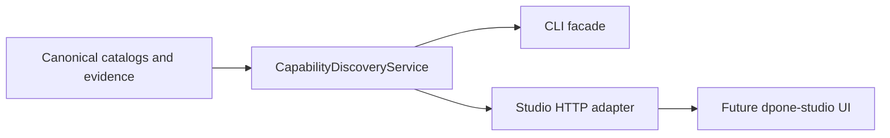

The HTTP adapter remains a bounded local-development boundary; it performs no
capability policy and does not make the future UI a source of truth. See
[ADR 0030](adr/0030-self-service-capability-studio-boundary.md) and the
[Studio API developer guide](developer-studio-api.md).

## Visual map

### Layer flow

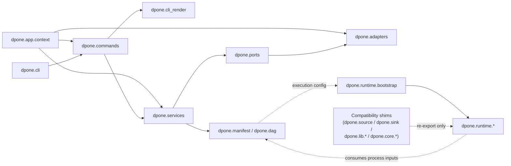

### Runtime extension points

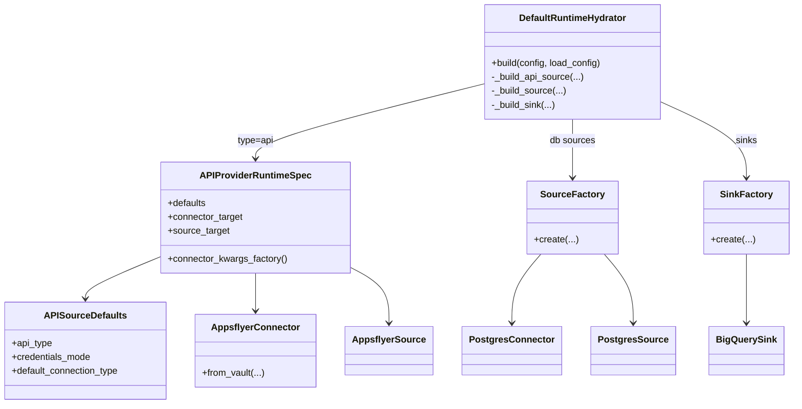

### Execution sequence

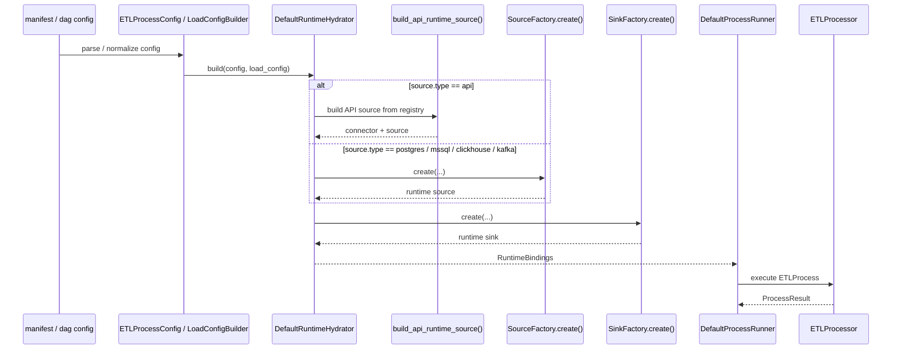

### Runtime execution responsibilities

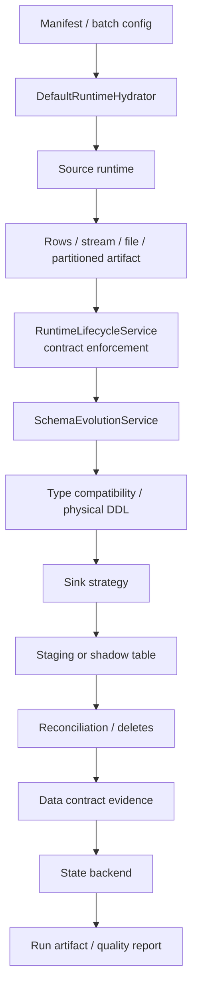

For Kafka sinks, the `Staging` node is replaced by bounded producer buffering and delivery acknowledgements. Kafka is treated as an append/event-log target, not as a mutable table.

### Operational evidence lane

```mermaid
flowchart LR
    Orchestrate["dpone orchestrate run"]
    Run["dpone run"]
    JobState["LocalJobStateStore"]
    Registry["dpone ops run-registry"]
    Observability["dpone observability metrics-export"]
    Lineage["dpone ops lineage-export"]
    Dbt["dpone ops dbt-lineage"]
    Benchmark["dpone ops benchmark-baseline"]
    RoutePack["dpone ops route-certification-pack"]
    Route["dpone ops route-readiness"]
    RouteRefresh["dpone ops route-refresh-plan"]
    RouteRefreshExec["dpone ops route-refresh-execute"]
    RouteRefreshCapture["dpone ops route-refresh-capture-snapshots"]
    RouteRefreshVerify["dpone ops route-refresh-verify"]
    RouteCertify["dpone ops route-certify"]
    RouteCertRelease["dpone ops route-certify-release"]
    RouteFinalize["dpone ops route-release-finalize"]
    RouteRcExec["dpone ops route-rc-execute"]
    ReleaseRcCollect["dpone ops release-rc-collect"]
    ReleaseRcFinal["dpone ops release-rc-finalize"]
    CdcApply["dpone ops cdc-apply-certification"]
    CdcHandoff["dpone ops cdc-handoff"]
    CdcObs["dpone ops cdc-observability-evidence"]
    CdcRecovery["dpone ops cdc-recovery-evidence"]
    CdcSchema["dpone ops cdc-schema-evolution-evidence"]
    CdcSchemaApply["dpone ops cdc-schema-apply"]
    CdcPromotion["dpone ops cdc-promotion-gate"]
    CdcRuntime["dpone ops cdc-runtime-run"]
    CdcPoison["dpone ops cdc-quarantine-inspect / cdc-replay-execute"]
    CdcCompare["dpone ops cdc-compare-repair / cdc-repair-execute"]
    CdcServing["dpone ops cdc-materialize-clickhouse"]
    CdcTypedServing["dpone ops cdc-materialize-clickhouse-typed"]
    Matrix["dpone ops certification-run"]
    Suite["dpone ops certification-suite"]
    Release["release / go-live evidence"]

    Orchestrate --> JobState
    JobState --> Run
    Run --> Registry
    Run --> Observability
    Registry --> Lineage
    Observability --> Suite
    Matrix --> Suite
    Benchmark --> Suite
    Matrix --> Route
    Benchmark --> Route
    Matrix --> RoutePack
    Benchmark --> RoutePack
    RoutePack --> Route
    Route --> CdcApply
    CdcApply --> CdcHandoff
    CdcHandoff --> CdcObs
    CdcObs --> CdcRecovery
    CdcRecovery --> CdcSchema
    CdcSchema --> CdcSchemaApply
    CdcSchemaApply --> CdcPromotion
    CdcPromotion --> CdcRuntime
    CdcRuntime --> CdcPoison
    CdcPoison --> CdcCompare
    CdcCompare --> CdcServing
    CdcServing --> CdcTypedServing
    CdcPromotion --> Suite
    CdcRuntime --> Suite
    CdcServing --> Suite
    CdcTypedServing --> Suite
    CdcSchemaApply --> Suite
    Route --> Suite
    Route --> RouteRefresh
    RouteRefresh --> RouteRefreshExec
    RouteRefreshExec --> RouteRefreshCapture
    RouteRefreshCapture --> RouteRefreshVerify
    RouteRefreshVerify --> Suite
    RoutePack --> RouteCertify
    RouteRefreshVerify --> RouteCertify
    RouteCertify --> RouteCertRelease
    RouteCertRelease --> RouteFinalize
    RouteFinalize --> Release
    RouteFinalize --> ReleaseRcCollect
    ReleaseRcCollect --> ReleaseRcFinal
    ReleaseRcFinal --> Release
    Route --> RouteRcExec
    RouteRcExec --> Suite
    Lineage --> Suite
    Dbt --> Suite
    Registry --> Suite
    Suite --> Release
```

The evidence lane has the same architectural rule as runtime code: commands are
thin adapters, services own business rules, and reusable parsing/checksum logic
is isolated in focused helper classes.

Route readiness is the route-level evidence seam inside that lane. It combines
the integration matrix, strategy certification metadata, normalized evidence
items and a generic policy into a stable JSON/Markdown report for one
`source -> sink -> strategy` pair. Route certification pack is the companion
factory that writes readiness-compatible `evidence/*.json` files from safe
metadata probes and already-produced heavy artifacts before invoking route
readiness. These services live in `dpone.ops.routes.*` and
`dpone.ops.route_readiness`; CLI handlers only parse arguments and invoke the
services.

Route bootstrap and doctor ([route-bootstrap-doctor](route-bootstrap-doctor.md))
is the self-service onboarding layer before route readiness. It composes
`dpone.ops.routes.bootstrap_models`,
`dpone.ops.routes.bootstrap_policy`,
`dpone.ops.connection_doctor.ConnectionDoctorService`,
`dpone.ops.source_discovery.SourceDiscoveryService`,
`dpone.ops.route_bootstrap.RouteBootstrapService`, and
`dpone.ops.route_doctor.RouteDoctorService`. The layer checks explicit local
tools, environment variables, Python imports, exported schema JSON, manifest
drafts, and upstream onboarding artifacts. It does not open source/sink
connections, execute manifests, run heavy route tests, or encode route-specific
branches in CLI handlers.

Route Conformance Lab ([route-conformance-lab](route-conformance-lab.md)) is
the deterministic acceptance suite after onboarding and before release gates. It
composes `dpone.ops.routes.conformance_models`,
`dpone.ops.routes.conformance_dataset`,
`dpone.ops.routes.conformance_verifier`,
`dpone.ops.routes.conformance_policy`, and
`dpone.ops.route_conformance.RouteConformanceService`, and
`dpone.ops.route_conformance_live.RouteConformanceLiveService`. The offline
layer generates source/sink snapshots, verifies row counts, chunk typed hashes,
physical contracts, nested `id`/`parent_id` objects, and schema-evolution
coverage, then writes immutable JSON/Markdown evidence. The live runner adds
`dpone.ops.routes.conformance_live_ports` for source seeding, schema evolution,
route execution, and snapshot reading so Docker-live or vendor-live adapters
can reuse the exact same verifier. `dpone.ops.routes.conformance_vendor_live`
owns `VendorRouteConformanceLiveAdapter`, `VendorLiveRouteBinding`, and the
`RouteConformanceLiveStore` port. `dpone.ops.routes.conformance_vendor_sql`
owns the thin env-driven factory for the built-in `vendor_live` and `docker`
adapters, while `dpone.ops.routes.conformance_vendor_sql_store` owns the lazy
SQL store and vendor dialects. The first route bindings are
`postgres -> mssql` and `mssql -> clickhouse` for `incremental_merge`; future
routes extend the binding matrix and store/dialect layer. The facade does not
import runtime connectors in CLI handlers, mutate source state directly, or add
route-specific command logic.

Route execution ledger ([route-execution-ledger](route-execution-ledger.md)) is
the idempotent execution and commit protocol evidence layer for the same route
taxonomy. `dpone.ops.routes.execution_models` owns ordered stages, status,
step, lease, and report contracts;
`dpone.ops.routes.execution_policy` owns the pure append-only and state-commit
policy; `dpone.ops.routes.execution_store` owns the store protocol and local
JSON implementation; `dpone.ops.routes.execution_store_sqlite` owns the durable
SQLite implementation with atomic compare-and-swap appends and lease fencing;
and `dpone.ops.route_execution.RouteExecutionService` composes those
dependencies. The feature records boundaries, artifact hashes, idempotency
keys, and lease fencing for any route. It does not import connectors, execute
runtime work, or mutate source state.

Route run supervisor ([route-run-supervisor](route-run-supervisor.md)) is the
route run execution contract layer over already-produced evidence. It composes
`dpone.ops.routes.run_supervisor_models`,
`dpone.ops.routes.run_supervisor_contract`,
`dpone.ops.routes.run_supervisor_policy`, and
`dpone.ops.routes.run_supervisor` so every `source -> sink -> strategy` route
gets the same JSON/Markdown receipt shape. `--run-mode route_refresh` adds an
ordered `execution_contract` for route readiness, refresh execution, snapshot
capture, verification, execution ledger, and state promotion. The supervisor is
control-plane only: it does not execute manifests, import runtime connectors,
or mutate source/sink state.

Route state promotion ([route-state-promotion](route-state-promotion.md)) is
the source-state commit receipt layer after route execution evidence.
`dpone.ops.routes.state_promotion_models` owns `RouteCommitReceipt`, promoted
state records, and report contracts; `dpone.ops.routes.state_promotion_policy`
owns the fail-closed policy; `dpone.ops.routes.state_store` and
`dpone.ops.routes.state_store_sqlite` own local JSON and SQLite
compare-and-swap state stores; and
`dpone.ops.route_state_promotion.RouteStatePromotionService` composes those
dependencies. The feature writes control-plane state evidence only. It does not
call source or sink connectors and does not advance vendor offsets directly.

Route refresh plan ([route-refresh-plan](route-refresh-plan.md)) is the
control-plane planning layer for bounded backfill, replay, refresh, and resync
work across the same taxonomy. `dpone.ops.routes.refresh_plan_models` owns
windows, chunks, approval, state rewind, evidence, and report contracts;
`dpone.ops.routes.refresh_plan_evidence` owns artifact normalization;
`dpone.ops.routes.refresh_plan_policy` owns pure go/no-go policy; and
`dpone.ops.route_refresh_plan.RouteRefreshPlanService` composes catalog lookup,
chunk planning, evidence loading, approval checks, and report writing. The
planner writes `route_refresh_plan.json` and `route_refresh_plan.md`; it does
not execute chunks, mutate route state, or import source/sink connectors.

Route refresh execute ([route-refresh-execute](route-refresh-execute.md)) is the
control-plane receipt layer for applying or dry-running a reviewed refresh plan.
`dpone.ops.routes.refresh_execution_models` owns chunk request/result, artifact,
and report contracts; `dpone.ops.routes.refresh_execution_executor` owns the
`RouteRefreshExecutor` port and safe dry-run executor;
`dpone.ops.routes.refresh_execution_policy` owns pure go/no-go policy; and
`dpone.ops.route_refresh_execute.RouteRefreshExecutionService` composes plan
loading, route validation, chunk sequencing, executor delegation, and report
writing. `dpone.ops.routes.refresh_executors.registry` selects optional
backends without adding route logic to the service. Native backends share the
small `dpone.ops.routes.refresh_executors.native_pipeline` prepare/export/load
contracts, while concrete modules own route SQL, connection config, and
artifact schemas. `MssqlClickHouseRouteRefreshExecutor` composes MSSQL
`bcp queryout`, bounded ClickHouse target-window cleanup, and ClickHouse bulk
load. `PostgresMssqlRouteRefreshExecutor` composes Postgres COPY export,
bounded MSSQL target-window cleanup, and MSSQL `bcp in`. Their Docker-live
certification gates write replay-safe `route_refresh_execution.json` evidence
under `test_artifacts/live_certification/refresh-executor/*/` without moving
live database logic into the generic service. The generic service does not
import source/sink connectors and does not promote source state.

Native MSSQL -> ClickHouse bulk wire is split into three small runtime layers:
`dpone.runtime.bulk_wire` decides the route contract,
`dpone.runtime.native_wire_*` carries source-native BCP contracts and decodes
SQL Server `bcp -n` artifacts, `dpone.runtime.clickhouse_rowbinary` encodes
typed rows into ClickHouse `RowBinary`, and the MSSQL/ClickHouse adapters only
bind their existing BCP/export and HTTP insert ports. This keeps the generic
route planner free of connector IO while preventing source-side ClickHouse TSV
escaping from becoming the default production path for text-heavy SQL Server
views.

Route refresh verify ([route-refresh-execute](route-refresh-execute.md)) is the
post-load reconciliation layer for executed refresh plans.
`RouteRefreshSnapshotCaptureService` is the read-only snapshot evidence layer
between execution and verification. It consumes `route_refresh_execution.json`,
calls injected `RouteRefreshRowsReader` adapters for source and sink rows,
normalizes those rows into `source_route_refresh_snapshot.json` and
`sink_route_refresh_snapshot.json`, and writes
`route_refresh_snapshot_capture.json` with artifact checksums, blockers,
warnings, and next actions. The service lives in
`dpone.ops.route_refresh_snapshot_capture`; its models, readers, policy, SQL
adapters, and registry live under `dpone.ops.routes.refresh_snapshot_capture_*`.
It does not import runtime connectors, executor backends, MSSQL, Postgres, or
ClickHouse directly.

`RouteRefreshVerificationService` consumes a succeeded
`route_refresh_execution.json`, delegates source and sink reads through the
`RouteRefreshSnapshotReader` port, evaluates row counts, boundaries, duplicate
keys, null keys, and typed hashes through `RouteRefreshVerificationPolicy`, and
writes `route_refresh_verification.json` plus Markdown. It is separate from
execution so source/sink adapters stay read-only and small, while release gates
can require verification evidence before state promotion.

Route release gate ([route-release-gate](route-release-gate.md)) is the final
route-scoped release receipt for the same taxonomy.
`dpone.ops.route_release_gate.RouteReleaseGateService` reads already-produced
route readiness, certification pack, execution ledger, state promotion, CDC,
benchmark, docs, and schema evidence; `dpone.ops.routes.release_gate_models`
owns the public JSON/Markdown contract; and
`dpone.ops.routes.release_gate_policy` owns the pure go/no-go policy. The gate
does not execute heavy checks or import connectors. New routes extend it through
`RouteProfile` metadata and evidence artifacts, not through CLI branching.

Route certify ([route-certify](route-certify.md)) is the final route release
certification bundle and promotion gate. `dpone.ops.route_certify`
orchestrates the existing route certification pack, route promotion gate, and
release evidence pack into `route_certification_bundle.json`.
`dpone.ops.routes.certify_models` owns the stable JSON/Markdown contract, while
`dpone.ops.routes.certify_policy` owns the pure `certified`, `warning`, or
`blocked` decision. The service is dependency-injected, has no route-specific
branches, and does not run Docker, pytest, or live database connections.

Route live certification ([route-live-certification](route-live-certification.md))
is the opt-in Docker-live and vendor-live bridge before the final route release
gate. `dpone.ops.route_live_certification.RouteLiveCertificationService`
renders route-aware harness commands, normalizes already-produced live evidence,
checks route identity, and writes `route_live_evidence_bundle` as
`route_live_certification.json`. `dpone.ops.routes.live_certification_models`
owns the stable contract, while
`dpone.ops.routes.live_certification_policy` owns pure scoring and blockers.
The service does not open live database connections, start Docker, run pytest,
or import connector clients.

The six-dimensional [route certification matrix](route-certification-matrix.md)
is a read-only publication layer above those existing gates.
`dpone.ops.route_certification_matrix_evidence` owns bounded local proof
normalization, `dpone.ops.route_certification_matrix_policy` owns the pure
`experimental` through `enterprise-certified` decision, and
`dpone.ops.route_certification_matrix.RouteCertificationMatrixService` composes
the explicit route catalog and writes the schema-backed projection. It never
executes a route, discovers evidence recursively, or imports Airflow, Vault, or
connector clients. Connector certification, route execution, live evidence,
and deployment-bound attestations remain the authoritative upstream producers.

Route release candidate orchestrator
([route-rc-orchestrator](route-rc-orchestrator.md)) composes the ordered route
release train: route certification pack, route live certification, route release
gate, and release evidence pack. `dpone.ops.route_rc_orchestrator` owns only
orchestration and report writing; `dpone.ops.routes.rc_orchestrator_models`
owns the public contract; and
`dpone.ops.routes.rc_orchestrator_policy` owns pure scoring and blocker
decisions. The orchestrator is fail-closed and dependency-injected, but it does
not start Docker, run pytest, or open live database connections.

Route release candidate executor ([route-rc-executor](route-rc-executor.md)) is
the opt-in execution layer for `route_rc_orchestration.json`.
`dpone.ops.route_rc_executor` owns receipt loading, dry-run planning, command
execution orchestration, artifact collection, and report writing.
`dpone.ops.routes.rc_executor_models` owns `route_rc_execution.json`;
`dpone.ops.routes.rc_executor_runner` owns the `CommandProcessRunner` protocol
and subprocess-backed implementation; `dpone.ops.routes.rc_executor_redaction`
owns command/output redaction; and `dpone.ops.routes.rc_executor_policy` owns
fail-closed scoring. The executor has no route-specific branches and does not
own release-level merge-train policy.

Release RC collector ([release-rc-collect](release-rc-collector.md)) prepares
the full stacked release candidate before finalization.
`dpone.ops.release_rc_collector` owns PR JSON loading, evidence reference
normalization, collection blockers, and generated finalizer command rendering;
`dpone.ops.release_rc_payloads` owns the shared GitHub CLI and merge-train
payload normalization used by collector and finalizer. The collector does not
call GitHub APIs, execute `gh`, or make final release readiness policy
decisions.

Release RC finalizer ([release-rc-finalize](release-rc-finalizer.md)) validates
the full stacked release candidate before tagging. `dpone.ops.release_rc_finalizer`
owns merge-train JSON loading, evidence reading, and report writing;
`dpone.ops.release_rc_models` owns the stable `release_rc_finalizer.json`
contract; and `dpone.ops.release_rc_policy` owns pure version, PR chain, check
rollup, and artifact blocker decisions. The finalizer is credential-free and
does not add GitHub API calls or command execution to the ops service.

The provider-bound [release evidence](release-evidence.md) gate is the separate
publication trust boundary above those behavioral services. A manual workflow
on exact `master` executes the fixed `native_transfer` campaign and writes one
commit/run/attempt-bound receipt, closed manifest, and pack. The read-only
provider verifier first authenticates the paired tag runs and their earliest
provider `created_at` cutoff. It selects the unique maximum evidence
`created_at` among exact-SHA dispatches created no later than that cutoff, then
reads that run's current attempt/status and performs bounded artifact transport
and identity/digest validation. An older-dispatch rerun cannot change dispatch
order, and post-cutoff dispatches are ignored. Tagger metadata is not
authority. A bounded 31-observation discovery wait with at most 30 ten-second
sleeps ignores other-tag runs, retries only zero exact-tag matches, and
re-authenticates the current run plus both lists on every sweep; invalid or
duplicate exact matches fail immediately. Preflight and every
mutation-capable job reverify, with a fresh gate immediately before that
block's first external write. Evidence stays bound to frozen commit C after
`master` advances and cannot authorize another commit. See
[ADR 0049](adr/0049-provider-bound-release-candidate-evidence.md).

CDC apply certification is the CDC-specific evidence producer inside the same
lane. `dpone.ops.cdc.apply_models` defines `CdcApplyEvent`,
`CdcApplyFixture`, `CdcApplyResult`, and `CdcApplyCertificationReport`;
`dpone.ops.cdc.apply` defines `CdcApplyStrategy`,
`InMemoryCdcApplyStrategy`, and `CdcApplyCertificationService`. The service
turns credential-free fixtures into `cdc_apply_correctness`,
`delete_semantics`, `typed_cdc_hash`, boundary, retention, and schema drift
evidence.

CDC snapshot handoff consumes those artifacts. It uses
`dpone.ops.cdc.models.CdcStreamKey` to combine a route id with source and target
dataset identity, `dpone.ops.cdc.catalog.CdcHandoffCatalog` for matrix-backed
profile metadata, `dpone.ops.cdc.evidence.CdcEvidenceReader` for shared artifact
normalization, `dpone.ops.cdc.policy.CdcHandoffPolicy` for pure scoring, and
`dpone.ops.cdc.handoff.SnapshotCdcHandoffService` for orchestration. These
services do not execute live CDC reads or ClickHouse apply work. Runtime CDC
readers remain under `dpone.runtime.cdc`, while replay planning remains under
`dpone.readiness.cdc_replay`.

CDC observability evidence is the next CDC control-plane gate. It consumes
`cdc_handoff.json`, `cdc_apply_certification.json`, a normalized telemetry
snapshot, and an optional SLO profile. `dpone.ops.cdc.observability_models`
defines `CdcTelemetrySnapshot`, `CdcSloProfile`,
`CdcObservabilityEvidenceItem`, `CdcObservabilityDecision`, and
`CdcObservabilityReport`; `dpone.ops.cdc.observability` defines
`CdcObservabilityEvidenceService` and small evidence factories for
`cdc_lag_slo`, `cdc_freshness_slo`, `cdc_retention_risk`,
`cdc_offset_commit_health`, `cdc_duplicate_replay_rate`, and
`cdc_throughput_slo`. The service parses local artifacts and writes JSON/Markdown
evidence only; it does not run source readers, sink writers, or heavy tests.

CDC recovery evidence is the fault-injection gate after observability evidence.
It consumes apply, handoff, observability, and scenario artifacts, then evaluates
restart/resume, offset commit ordering, idempotent replay, partial sink commit
repair, poison event quarantine, and retention recovery margin. `dpone.ops.cdc`
keeps this split across `recovery_models` and `recovery` so recovery policies
and injected evidence factories can evolve without adding route-specific
branches or live IO to the service.

CDC schema evolution evidence is the DDL-governance gate after recovery
evidence. It consumes apply, handoff, observability, recovery, and schema-change
planning artifacts, then evaluates schema-change capture, compatibility, type
widening safety, target DDL dry-run, backfill planning, breaking-change
approval, and offset/schema ordering. `dpone.ops.cdc.schema_evolution_models`
keeps `CdcSchemaChangeEvent`, `CdcSchemaEvolutionPlan`, policy, decision and
report contracts separate from `dpone.ops.cdc.schema_evolution`, which only
orchestrates artifact parsing, evidence factories and report writing. The
service does not execute live DDL.

CDC schema apply is the target-side DDL execution gate for approved additive CDC
schema changes. `dpone.ops.cdc.schema_apply_models` keeps
`CdcSchemaApplyPolicy`, `CdcSchemaApplyPlan`, result and report contracts
separate from sink-specific planners such as
`dpone.ops.cdc.schema_apply_clickhouse.ClickHouseCdcSchemaDdlPlanner`.
`dpone.ops.cdc.schema_apply.CdcSchemaEvolutionApplyService` composes the
planner, a connector, and optional typed materialization refresh. It can mutate
the target schema, but it never reads source CDC or mutates CDC offsets.

CDC promotion gate is the final replication-readiness bundle after schema
evolution evidence. It consumes apply, handoff, observability, recovery, and
schema evolution reports, validates that they describe the same stream and
route, and emits `production_ready` plus `promote_offsets` decisions.
`dpone.ops.cdc.promotion_models` keeps `CdcPromotionEvidenceItem`,
`CdcPromotionDecision`, and `CdcPromotionReport` separate from
`dpone.ops.cdc.promotion.CdcPromotionGateService`, which only orchestrates
local artifact parsing and report writing. The service does not promote
offsets, execute live CDC reads, write sinks, or run heavy tests.

CDC runtime orchestrator is the runtime-plane loop that promotion gates protect.
It uses `dpone.runtime.cdc.runtime_models.CdcRuntimeStream`,
`CdcRuntimePolicy`, `CdcApplyReceipt`, and `CdcRuntimeRunReport`;
`dpone.runtime.cdc.runtime_ports.CdcOffsetStore` and `CdcSinkApplier`; and
`dpone.runtime.cdc.runtime_orchestrator.CdcRuntimeOrchestrator`. The
orchestrator loads a checkpoint, reads one bounded `CDCBatch`, checks event
idempotency, applies the batch through an injected sink adapter, and commits
the next offset only after durable sink success. Local JSON adapters live in
`dpone.runtime.cdc.local_runtime`; live MSSQL and ClickHouse adapters are
composition concerns, not branches in the orchestrator.

CDC poison quarantine is the runtime safety layer for events that cannot be
applied under the current stream contract. `dpone.runtime.cdc.poison_models`
keeps `CdcPoisonRecord` and quarantine report contracts separate from
`dpone.runtime.cdc.poison.CdcPoisonClassifier` and
`FileCdcPoisonQuarantine`; `dpone.runtime.cdc.replay_execution` owns
`CdcReplayExecutionService` and replay reports. The ops layer adds
`CdcQuarantineInspectionService` and `CdcReplayExecutionOpsService` as thin
composition facades. Replay execution never mutates CDC offsets; offset
advancement remains owned by `CdcRuntimeOrchestrator`.

CDC compare and repair is the post-runtime consistency layer. `dpone.runtime.cdc.compare_models`
keeps row, diff, repair action, repair plan and report contracts separate from
`dpone.runtime.cdc.compare.CdcCompareRepairService`; live reader concerns stay
in `dpone.runtime.cdc.compare_readers` with `MssqlCdcCompareReader` and
`ClickHouseCdcLogCompareReader`. `dpone.runtime.cdc.repair.CdcRepairExecutionService`
executes bounded repair actions through an injected sink applier and never
mutates CDC offsets. The ops layer only composes local JSON readers or live
MSSQL/ClickHouse connectors through `CdcCompareRepairOpsService` and
`CdcRepairExecutionOpsService`.

CDC retention gap auto-resync is the fail-closed recovery layer for retained
source windows. `dpone.runtime.cdc.retention_models` keeps
`CdcRetentionBounds`, `CdcRetentionDecision`, `CdcRetentionReport`,
`CdcResyncPlan`, and execution report contracts separate from
`dpone.runtime.cdc.retention.CdcRetentionGapService`,
`CdcResyncPlanner`, and `CdcRetentionPolicy`. Source-specific SQL stays in
small `CdcRetentionProbe` adapters such as `MssqlChangeTrackingRetentionProbe`;
`dpone.runtime.cdc.resync.CdcResyncExecutionService` applies bounded resync
actions through an injected `CdcSinkApplier` and never mutates CDC offsets.
The ops layer composes local fixtures or live `mssql -> clickhouse`
connectors through thin services only.

CDC live runtime adapters are the first production connector pack for this
runtime loop. `dpone.runtime.cdc.live_factory.CdcRuntimeLiveAdapterFactory`
composes `MSSQLCDCReader` or `MSSQLChangeTrackingReader`,
`SqlCdcOffsetStoreAdapter`, and `ClickHouseCdcSinkApplier` for
`mssql -> clickhouse`. The adapter pack writes an append-only ClickHouse CDC log
and keeps the same offset safety contract as local runtime evidence.

CDC serving materialization is the post-runtime current-state layer for
ClickHouse CDC logs. `dpone.runtime.cdc.materialization` owns
`ClickHouseCdcMaterializationPlan`, policy, report and shadow-table replace SQL;
`dpone.ops.cdc.materialization.CdcMaterializationService` owns credential
composition. The materializer consumes the normalized `dpone_cdc_*` log and does
not add route-specific branches to `CdcRuntimeOrchestrator` or the live adapter
factory.

CDC typed serving materialization is the typed projection layer on top of the
same append-only log. `dpone.runtime.cdc.typed_materialization` owns
`ClickHouseCdcTypedColumn`, `ClickHouseCdcPayloadProjector`, typed plans,
policies, quality evidence, reports and shadow-table replace SQL; `dpone.ops.
cdc.typed_materialization.CdcTypedMaterializationService` owns credential
composition. The layer converts canonical JSON payloads into declared
ClickHouse columns, evaluates schema drift and parse quarantine before target
swap, and writes `cdc_typed_materialization.*` plus
`cdc_typed_parse_quarantine.*` evidence without changing CDC readers, sink
appliers, or offset stores. Quality helpers stay in focused
`typed_materialization_quality` and `typed_materialization_quarantine_sql`
modules so the service remains a thin orchestrator instead of a god module.

## Phase 2 taxonomy cleanup status

The current cleanup direction is **protocol-first, adapter-specific
implementation second**. Public modules may remain as compatibility facades, but
new business logic should live in focused implementation modules.

Phase 2 cleanup status:

- `dpone.manifest.validation`, `dpone.manifest.migrate` and
  `dpone.manifest.batch_compiler` are thin compatibility facades over focused
  validation, migration and batch-compilation modules.
- `dpone.runtime.artifacts` is a vendor-neutral facade over artifact models,
  row/file/cloud artifacts and staging helpers.
- `dpone.commands.registry` is split into focused registry sections for core,
  ops, schema/CDC, manifest, DAG and docs commands.
- API providers, BigQuery, Postgres CDC, ClickHouse sink, MSSQL strategies and
  Postgres base strategies keep public class names but now delegate through
  implementation modules that can be split further without breaking imports.
- Module-size hard debt is closed: `docs/module_size_baseline.json` has zero
  allowlisted entries above the hard 600 LOC gate. Warning-level modules above
  450 LOC remain visible in quality metrics and should be split before gaining
  substantial new behavior.

New code rules:

- Manifest facades should re-export only; do not add validation or migration
  logic back into the facade modules.
- Artifact core must not import vendor connectors, sources or sinks.
- Generic reconciliation and API runtime core must depend on protocols/facades,
  not concrete BigQuery/Postgres/MSSQL/ClickHouse/Kafka/provider adapters.
- Sink strategy packages must not import unrelated concrete sink packages.
- Command registries should stay grouped by UX area; new command families get a
  focused registry module instead of expanding `dpone.commands.registry`.

## Stable APIs and extension seams

- **Canonical imports** for new code live under `dpone.manifest.*`, `dpone.dag.*`, `dpone.runtime.*`, `dpone.contracts.*`, `dpone.ports.*`, `dpone.adapters.*`.
- **Compatibility shims** such as `dpone.source`, `dpone.sink`, `dpone.lib.*`, `dpone.core.*`, `dpone.yaml_config_handler` stay as backward-compatible re-export layers only.
- **New Pull API providers** plug in through `dpone.contracts.api_sources`, `dpone.runtime.api_registry`, a runtime connector, a runtime source and provider-specific strategies/resources.
- **New database-backed integrations** plug in through `dpone.runtime.credentials.*`, connector creation in factory/bootstrap, source/sink runtime classes, state backends and schema-evolution adapters.
- **Kafka integrations** plug in as bounded batch sources/sinks through `dpone.runtime.kafka.*`, `KafkaSource`, `KafkaSink`, `KafkaOffsetState` and optional Schema Registry codecs.
- **CDC replay and idempotency** plug in through `dpone.runtime.cdc.identity` and `dpone.readiness.cdc_replay`; readers stay focused on bounded extraction, while replay planning and offset commit safety stay credential-free and testable.
- **Object storage staging** plugs in through `dpone.storage.*` and `dpone.staging.object_storage`; source exports, sink loaders, and certification jobs share one manifest and checksum contract instead of provider-specific dictionaries.
- **Community connector packages** are generated through `dpone.connector_sdk.*`; the SDK is control-plane only and must not be imported by runtime source/sink execution paths.
- **Strategy intelligence** plugs in through `dpone.strategy_intelligence.*`; it is credential-free and side-effect free, so CLI, docs, Studio, and future runtime optimizers can share one explainable decision contract.
- **Route readiness and route run supervision** plug in through `dpone.ops.routes.*`; new routes and run modes should be added through matrix/profile metadata, stage/evidence metadata, source-sink docs, evidence artifacts and optional policy injection, not through CLI branching.
- **Native transfer route planning** plugs in through `dpone.runtime.native_transfer_route_*`; connector adapters declare capabilities, the route registry builds a source/sink/codec/staging matrix, and `NativeTransferRoutePlanner` returns a side-effect-free decision used by `plan`, `perf advise`, `run`, and ops certification.
- **Native transfer snapshot optimization** plugs in through `dpone.runtime.native_snapshot_optimization`; the optimizer consumes the resolved route, typed wire settings, ingest backend capabilities, source governor, target governor, and telemetry to produce `dpone.native_transfer.snapshot_optimization.v1` evidence before source I/O.
- **Native transfer acceleration** plugs in through `dpone.runtime.native_acceleration`; the optional `dpone-native-accel` provider declares certified backends, while the core package keeps a pure-Python reference path and fail-closed `required` mode.
- **Direct native ingest** plugs in through `dpone.runtime.direct_ingest`; core code resolves `direct|client` protocol backends and evidence, while optional providers own certified protocol implementations. Source adapters still produce typed artifacts and do not import ClickHouse protocol code.
- **Statistics-aware snapshot partitioning** plugs in through `dpone.runtime.snapshot_partition_planner`; source adapters normalize histograms into generic `SourceStatistic` objects, and the planner emits `dpone.native_transfer.snapshot_partition_plan.v1` without running expensive boundary scans.
- **Runtime artifacts** are the boundary between extraction and loading. Sources should produce `InMemoryRowsArtifact`, `StreamingRowsArtifact`, `FileExportArtifact`, `PartitionedFileExportArtifact` or `InternalQueryArtifact` rather than calling sinks directly.

For an implementation-oriented checklist, see [Developer integrations runbook](developer-integrations-runbook.md).

## Layers

- **dpone/cli/** – thin CLI entrypoint + argparse wiring
- **dpone/commands/** – CLI commands as OOP objects (no business logic)
- **dpone/cli_render/** – presentation layer (text/Markdown rendering for CLI outputs)
- **dpone/commands/output_json.py** and **output_text.py** – command-local
  presentation facades over `dpone.cli_render`; historical top-level output
  modules remain compatibility re-exports
- **dpone/services/** – use-cases / application services (orchestrate domain + adapters)
- **dpone/services/dag/views/** – typed DAG CLI view-models / JSON payload DTOs between commands and renderers
- **dpone/app/** – composition root (DI) + settings/logging
- **dpone/ports/** – Protocols / abstract interfaces (filesystem, yaml codec, etc.)
- **dpone/adapters/** – concrete implementations (local fs, pyyaml, etc.)

Feature slices:

- **dpone/manifest/** – Variant C manifests (compile/validate/explain)
- **dpone/dag/** – DAG dependency model (graph builder, edge semantics, explain, report)
- **dpone/runtime/** – execution runtime (ETL/sources/sinks/connectors/state)

## Current migration status

- ✅ CLI refactoring started: commands + thin entrypoint.
- ✅ DAG explain/report commands now use typed view-models (`dpone.services.dag.views`) instead of building JSON payloads ad-hoc in commands.
- ✅ DAG subsystem renamed to `dpone.dag`.
  - `dpone.yaml_config_handler` is a **deprecated shim** kept for backward compatibility.
- ✅ Dependency graph loading/building split into smaller DAG modules:
  - `dpone.dag.node_registry` – node indexing and uniqueness
  - `dpone.dag.graph_relationships` – dependency edge construction
  - `dpone.dag.graph_algorithms` – topo sort / cycle detection
  - `dpone.dag.task_group_index` – lazy task-group to manifest index
  - `dpone.dag.manifest_chain_loader` – recursive manifest loading
- ✅ Unified dependency semantics extracted into `dpone.dag.edge_resolver`:
  - one source of truth for `depends_on` / `group` / `selector` / `file-all` / stem fallback
  - reused by Airflow DAG building, dependency graph building and explain/report tools
- ✅ Manifest explain/provenance split into focused modules:
  - `dpone.manifest.explain_models` – result/why dataclasses
  - `dpone.manifest.explain_trace` – batch trace + provenance construction
  - `dpone.manifest.explain_merge` – diff/patch/origin-aware merge helpers
  - `dpone.manifest.explain_why` – `--why` reasoning + patch suggestions
  - `dpone.manifest.explain` remains a thin public facade
- ✅ Manifest CLI commands no longer go through `dpone.cli.legacy`:
  - shared manifest loading helpers live in `dpone.services.manifest.load_context`
  - typed manifest view-models live in `dpone.services.manifest.views`
  - text rendering moved to `dpone.cli_render.manifest.*`
- ✅ Manifest sparse paths add a GitOps control-plane slice:
  - `dpone.manifest.sparse_paths_policy` owns workload-root path safety and repo-relative rendering
  - `dpone.manifest.sparse_paths_discovery` owns raw-YAML manifest dependency discovery
  - `dpone.manifest.sparse_paths_planner` composes discovery, optional includes, and blocker/warning aggregation
  - `dpone.services.manifest.sparse_paths_service` composes DI without importing runtime or scheduler code
- ✅ GitOps control-plane planning adds a scheduler-neutral runner contract:
  - `dpone.gitops.affected` maps changed repo-relative paths to impacted manifest entrypoints and optional emitted plans
  - `dpone.gitops.bundle_attestation` computes repo-relative SHA-256 artifact digests and bundle attestations
  - `dpone.gitops.bundle_policy` keeps policy gates such as empty impact, warnings, and required lock verification outside CLI handlers
  - `dpone.gitops.bundle_profiles` owns named advisory, PR, and release policy defaults
  - `dpone.gitops.bundle_verify` verifies emitted bundle attestations and artifact digests offline
  - `dpone.gitops.changed_files` resolves direct, file-backed, and `git diff --name-only` changed-file sources before impact analysis
  - `dpone.gitops.lock` adds provenance-friendly SHA-256 file digests to plan artifacts
  - `dpone.gitops.models` defines `gitops.plan`, `gitops.verify`, `gitops.affected`, and `gitops.bundle` JSON contracts
  - `dpone.gitops.lock_verify` verifies plan locks against sparse worktrees as an opt-in release gate
  - `dpone.gitops.plan` consumes sparse-path reports and writes `gitops.plan`
  - `dpone.gitops.schema_contracts` publishes JSON Schema contracts for GitOps plan, verify, affected, bundle, attestation, and Airflow runtime artifacts
  - `dpone.gitops.schema_validation` performs lightweight structural validation without adding mandatory runtime schema dependencies
  - `dpone.gitops.rendering` renders Markdown summaries for plan, verify, affected, and bundle reports
  - `dpone.gitops.verify` checks sparse worktrees against plan artifacts and writes `gitops.verify`
  - `dpone.services.gitops.*` composes filesystem/YAML ports and writes deterministic handoff artifacts without importing Airflow, Kubernetes, Git clients, runtime connectors, or database SDKs
- ✅ GitOps Airflow runner pack adds a scheduler-specific artifact slice without
  scheduler dependencies:
  - `dpone.gitops.airflow_models` owns `gitops.airflow_render`,
    `gitops.airflow_doctor`, and `gitops.airflow_image_contract` DTOs
  - `dpone.gitops.airflow_artifacts` renders `pod_template.yaml`,
    `executor_config.json`, `airflow_task.py`, `entrypoint.sh`, and
    delegates `airflow_dag_factory.py` plus `outcome_gate.py` helpers for a
    custom dpone image
  - `dpone.gitops.airflow_dag_factory_renderer` renders the generated
    artifact-loading DAG factory. Its default helper consumes
    `kpo-kwargs.json` and `pod-spec.yaml`; direct KPO mode is explicit legacy
    convenience and is not the sparse git-sync runtime contract
  - `dpone.airflow.runtime_adapter` is the optional DAG-side importable adapter
    for scheduler images that install dpone. It validates and loads generated
    Airflow artifacts (`pod-contract.json`, `pod-spec.yaml`, and
    `kpo-kwargs.json`) without discovering manifests, computing sparse paths,
    choosing git-sync auth, or rebuilding PodSpecs
  - `dpone.gitops.airflow_run_spec` builds `gitops.airflow_run_spec` contracts
    from an already-built `gitops.bundle`
  - `dpone.gitops.airflow_runtime_models` owns `run-spec.json` and
    `runtime-evidence.json` DTOs
  - `dpone.gitops.airflow_runtime_profile_models` owns runtime placement,
    ArtifactSink, resource, and `xcom-summary.json` DTOs
  - `dpone.gitops.airflow_runtime_profile` builds
    `gitops.airflow_runtime_profile` without importing scheduler or Kubernetes
    clients
  - `dpone.gitops.airflow_runtime_profile_policy` applies release/advisory
    placement policy without importing scheduler or Kubernetes clients
  - `dpone.gitops.airflow_git_sync_models` and
    `dpone.gitops.airflow_git_sync` add the optional sparse git-sync runtime
    contract and pure PodSpec patch builder for `dpone-sparse-checkout` and
    `dpone-git-sync` initContainers; auth contracts serialize only Kubernetes
    Secret names and keys, never secret values, and clone options keep
    `depth` plus optional partial clone `filter` explicit
  - `dpone.gitops.airflow_connection_bridge_models` and
    `dpone.gitops.airflow_connection_bridge` add the runtime-only Airflow
    Connection bridge. They discover manifest `connection_type: airflow`
    refs from generated bundle/plan artifacts, emit `AIRFLOW_CONN_*`
    Secret/env refs, and keep Airflow URI values out of all artifacts
  - `dpone.gitops.airflow_connection_bridge_plan` and
    `dpone.services.gitops.airflow_connection_bridge_plan_service` turn the
    existing `connection_bridge` contract into deploy-time
    `connection-bridge-plan.json`, Kubernetes Secret, ExternalSecret, and
    env-example skeleton artifacts. The slice consumes runtime artifacts only;
    it does not parse manifests, import Airflow, call Kubernetes, or serialize
    secret values
  - `dpone.gitops.airflow_git_sync_capabilities` owns git-sync image capability
    policy for partial clone hardening: `v4.4.0` remains sparse-checkout only,
    while `v4.7.0+` can render `--filter=blob:none` or `--filter=tree:0`
  - `dpone.gitops.airflow_pod_contract` builds `pod-contract.json`,
    `pod-spec.yaml`, and `kpo-kwargs.json` as static handoff artifacts for
    KubernetesPodOperator and KubernetesPodExecutor-style runners
  - `dpone.gitops.airflow_pod_doctor` validates pod/XCom drift offline through
    `GitOpsAirflowPodDoctor`
  - `dpone.gitops.airflow_artifact_index` and
    `dpone.services.gitops.airflow_artifact_index_service` build
    `artifact-index.json` as a deterministic inventory of Airflow runtime
    artifacts, including expected kind, schema version, producer, byte size,
    and SHA-256
  - `dpone.gitops.airflow_pack_models`, `dpone.gitops.airflow_pack`, and
    `dpone.services.gitops.airflow_pack_service` build
    `airflow-runtime-pack.json` as the golden-path Airflow artifact pack
    report. The planner consumes the shared artifact catalog, emits
    deterministic next commands, and separates plan warnings from verify-mode
    blockers without executing Airflow, Kubernetes, manifests, or database work
  - `dpone.services.gitops.airflow_preflight_service` composes artifact index
    freshness, registered GitOps schema validation, pod-doctor output, and
    Airflow connection bridge plan checks into the offline
    `gitops.airflow_preflight` release gate without importing Airflow or
    Kubernetes clients
  - `dpone.gitops.airflow_cluster_doctor_models`,
    `dpone.gitops.airflow_cluster_doctor_commands`,
    `dpone.gitops.airflow_cluster_doctor_runner`,
    `dpone.gitops.airflow_cluster_doctor`, and
    `dpone.services.gitops.airflow_cluster_doctor_service` split opt-in live
    cluster readiness into DTOs, safe kubectl command construction, runner
    port, planner policy, and artifact-loading service. They validate
    namespace, service account, RBAC, imagePullSecrets, git-sync Secret keys,
    Airflow Connection Secret keys, optional ExternalSecret readiness, and
    quota/LimitRange visibility without importing Airflow/Kubernetes SDKs or
    serializing secret values
  - `dpone.gitops.airflow_k8s_manifests_models`,
    `dpone.gitops.airflow_k8s_controller_metadata`,
    `dpone.gitops.airflow_k8s_manifests`, and
    `dpone.services.gitops.airflow_k8s_manifests_service` split deployable
    Kubernetes pack rendering into DTOs, controller metadata policy, pure
    object taxonomy, and artifact-loading service. They generate
    ServiceAccount, Role, RoleBinding, Secret skeleton, optional
    ExternalSecret, and optional NetworkPolicy objects from generated Airflow
    artifacts without embedding Secret values. Argo CD sync-wave annotations
    and Flux ownership labels are additive controller metadata, not Airflow DAG
    logic
  - `dpone.gitops.airflow_admission_check_models`,
    `dpone.gitops.airflow_admission_check_runner`,
    `dpone.gitops.airflow_admission_check`, and
    `dpone.services.gitops.airflow_admission_check_service` split Kubernetes
    server-side dry-run admission evidence into DTOs, runner port, planner
    policy, and artifact-loading service. Live execution stays opt-in through
    `AirflowAdmissionCheckRunner`
  - `dpone.gitops.airflow_pod_doctor_connection_bridge` validates runtime-only
    Airflow connection bridge drift offline, so release gates block pods that
    would fail with missing `AIRFLOW_CONN_*` values
  - `dpone.gitops.airflow_xcom_outcome` builds the final XCom outcome from
    `runtime-evidence.json` so Airflow consumers can read status, failed step,
    evidence digest, step counts, and artifact paths without parsing runtime
    evidence internals
  - `dpone.gitops.airflow_outcome_gate` owns `strict_fail` and
    `xcom_then_gate` mode taxonomy plus final XCom gate evaluation for
    downstream Airflow tasks and release collectors
  - `dpone.gitops.airflow_runtime_evidence` verifies runtime evidence without
    executing commands
  - `dpone.gitops.airflow_runtime_executor` keeps runtime command execution
    behind a `CommandRunner` protocol for the custom dpone image
  - `dpone.gitops.airflow_k8s_smoke_models`,
    `dpone.gitops.airflow_k8s_smoke_runner`, and
    `dpone.gitops.airflow_k8s_smoke` split the opt-in live Airflow Kubernetes
    smoke taxonomy into DTOs, runner port, and planner policy without adding
    Airflow or Kubernetes SDK dependencies
  - `dpone.gitops.airflow_pod_launch_evidence_models`,
    `dpone.gitops.airflow_pod_launch_evidence_checks`,
    `dpone.gitops.airflow_pod_launch_evidence_parser`,
    `dpone.gitops.airflow_pod_launch_evidence_policy`,
    `dpone.gitops.airflow_pod_launch_evidence_runner`, and
    `dpone.gitops.airflow_pod_launch_evidence` split pod-watch evidence into
    report DTOs, check DTOs, Kubernetes JSON normalization, release policy,
    runner port, and planner orchestration without adding Airflow or
    Kubernetes SDK dependencies
  - `dpone.gitops.airflow_evidence_bundle_models` and
    `dpone.gitops.airflow_evidence_bundle` split final Airflow attempt
    evidence into public DTOs and pure collector policy: artifact digests,
    child evidence blockers, and `dag_id` / `task_id` / `run_id` /
    `try_number` / `map_index` to Kubernetes pod correlation
  - `dpone.gitops.airflow_doctor` validates bundle attestation,
    `pod_template_file`, Airflow `base` container, image, and image contract
    checks offline
  - `dpone.gitops.airflow_policy` owns `runner_policy` profiles for advisory,
    PR, and release gates, including `--runner-policy release` blockers for
    image digest, resources, service account, and non-root posture
  - `dpone.services.gitops.airflow_runtime_profile_service` writes
    `runtime-profile.json`, `xcom-summary.json`, `airflow_dag_factory.py`, and
    `outcome_gate.py` as repo-relative GitOps handoff artifacts for
    KubernetesPodOperator and KubernetesPodExecutor-style runners. Airflow
    helpers consume these artifacts instead of recomputing manifests, sparse
    paths, git-sync auth, initContainers, or PodSpec patches
  - `dpone.gitops.airflow_runtime_profile_options`,
    `dpone.gitops.airflow_runtime_profile_paths`,
    `dpone.gitops.airflow_runtime_profile_git_sync`, and
    `dpone.gitops.airflow_git_sync_artifacts` split runtime-profile
    option parsing, git-sync auth validation, and bundle/plan sparse path
    aggregation into focused modules so Airflow helpers consume generated
    artifacts instead of rediscovering manifests
  - `dpone.services.gitops.airflow_pod_contract_service` and
    `dpone.services.gitops.airflow_pod_doctor_service` keep pod contract
    orchestration in services while the reusable PodSpec/KPO/XCom rules stay in
    `dpone.gitops.airflow_pod_contract`, `dpone.gitops.airflow_pod_doctor`,
    and the git-sync-specific `dpone.gitops.airflow_pod_doctor_git_sync`.
    `pod-doctor --artifact-dir` is the default UX for validating a generated
    Airflow artifact directory, with explicit artifact paths reserved for
    drift debugging
  - `dpone.gitops.airflow_pod_contract_options`,
    `dpone.gitops.airflow_pod_contract_paths`, and
    `dpone.gitops.airflow_json_artifacts` own pod-contract CLI option parsing,
    repo-relative path validation, shared JSON artifact loading, and reserved
    git-sync volume/mount blockers before a PodSpec is written
  - `dpone.services.gitops.airflow_k8s_smoke_service` loads repo-relative
    artifacts, composes the smoke planner, and executes live checks only through
    the injected runner protocol
  - `dpone.services.gitops.airflow_admission_check_service` loads
    repo-relative manifest pack and pod-spec YAML files, composes admission
    commands, and executes live dry-runs only through the injected runner
    protocol
  - `dpone.services.gitops.airflow_pod_launch_evidence_service` loads
    repo-relative Airflow pod artifacts, composes the pod-watch planner, and
    executes live pod, event, and log collection only through the injected
    runner protocol
  - `dpone.services.gitops.airflow_evidence_bundle_service` loads
    repo-relative Airflow evidence artifacts, owns the small artifact catalog,
    and composes `GitOpsAirflowEvidenceBundleCollector` without executing
    Airflow, Kubernetes, manifests, or database work
  - `GitOpsAirflowRenderService`, `GitOpsAirflowRunSpecService`,
    `GitOpsAirflowOutcomeGateService`, `GitOpsAirflowEvidenceVerifyService`,
    `GitOpsAirflowDoctorService`, and `GitOpsAirflowImageContractService` keep
    DI and filesystem orchestration in services while CLI handlers remain
    argparse-only
- ✅ `dpone.cli.legacy` is now only a deprecated compatibility shim:
  - canonical entrypoint: `dpone.cli.main` / `dpone`
  - canonical parser wiring: `dpone.cli.parser` + `dpone.commands.*`
  - CLI help/parsing happens before `AppContext` construction, so `--help` stays lightweight
- ✅ Runtime packages moved under `dpone.runtime.*`.
  - Legacy import paths are kept as **deprecated shims**:
    - `dpone.source` → `dpone.runtime.sources`
    - `dpone.sink` → `dpone.runtime.sinks`
    - `dpone.lib.connectors` → `dpone.runtime.connectors`
    - `dpone.state` → `dpone.runtime.state`
    - `dpone.credentials` → `dpone.runtime.credentials`
    - etc.
- ✅ Runtime ETL orchestration split into focused collaborators:
  - `dpone.runtime.etl.processor` now keeps orchestration only
  - `dpone.runtime.etl.load_config_runtime` isolates runtime `LoadConfig` mutation/enrichment
  - `dpone.runtime.etl.run_state_tracker` owns run-state persistence lifecycle
  - `dpone.runtime.etl.reconciliation_service` owns reconciliation + tech-connector lookup
  - `dpone.runtime.state.models` exposes `RunState`/`RunStateStatus` without BigQuery imports
- ✅ BigQuery sink runtime split into focused collaborators:
  - `dpone.runtime.sinks.strategies.bigquery.bigquery_base` is now an orchestration-only facade
  - `target_table_manager` owns target table creation, labels/description and technical columns
  - `dml_helper` owns JSON-aware SELECT generation, DML execution and lookback cleanup SQL
  - `exchange_logger` owns progress/evidence logging for exchange/full-refresh flows
  - `partition_validation_service` owns ClickHouse partition validation after BigQuery loads
- ✅ PostgreSQL sink runtime split into focused collaborators:
  - `dpone.runtime.sinks.strategies.postgres.postgres_base` is now an orchestration-only facade
  - `target_table_manager` owns target table creation + technical columns
  - `PostgresSink.load` owns the full-refresh transaction: artifact materialization →
    selected strategy → owned staging cleanup → commit acknowledgement
  - `InternalQueryArtifact.materialize` uses server-side INSERT into staging;
    transport never selects exchange or bypasses a strategy
  - `file_export_loader` and `internal_query_loader` retain direct-call compatibility
    through the sink entry point; see [PostgreSQL strategy behavior](postgres.md#load-strategy-behavior)
  - `staging_sql_helper` owns staging->target SQL helpers, typed select and column-type cache
- ✅ Staging managers split into focused collaborators:
  - `dpone.runtime.sinks.staging` is now a thin facade
  - `dpone.runtime.sinks.staging_managers.postgres` owns PostgreSQL staging table lifecycle and COPY helpers
  - `dpone.runtime.sinks.staging_managers.bigquery` owns BigQuery staging lifecycle and row/query insertion
  - legacy `postgres_staging_manager` / `bigquery_staging_manager` modules are compatibility shims only
  - `bigquery_staging_file_loader` owns local-file → BigQuery staging routing (direct load vs GCS)
  - `bigquery_staging_gcs_loader` owns native GCS → BigQuery staging flows and partition row tracking
- ✅ ClickHouse connector split into focused collaborators:
  - `dpone.runtime.connectors.clickhouse` is now a thin facade
  - `clickhouse_query_ops` owns low-level query execution, streaming and CSV import
  - `clickhouse_gcs_export` owns native GCS export SQL and HMAC-based export flow
  - `clickhouse_partitioning` owns date parsing, partition generation/discovery and row counting
  - `clickhouse_incremental_export` owns cleanup, partition query shaping and incremental GCS export orchestration
- ✅ MSSQL is a first-class source, sink and state backend:
  - `dpone.runtime.connectors.mssql` owns SQL Server connectivity and metadata helpers
  - `dpone.runtime.connectors.mssql_bulk` owns `bcp` command generation and bulk file flows
  - `dpone.runtime.sources.mssql` and `dpone.runtime.sinks.mssql` expose runtime source/sink contracts
  - `dpone.runtime.state.mssql` supports run, XMin, Kafka and CDC state persistence
- ✅ Kafka is a first-class bounded batch source/sink:
  - `dpone.runtime.connectors.kafka` owns producers, consumers, admin clients and Schema Registry clients
  - `dpone.runtime.kafka.*` owns codecs, envelopes, keys, offset planning and delivery aggregation
  - `dpone.runtime.sources.kafka` and `dpone.runtime.sinks.kafka` expose source/sink runtime contracts
- ✅ Generic REST APIs are first-class Pull API sources:
  - `dpone.runtime.connectors.api.rest` owns HTTP/auth/pagination mechanics
  - `dpone.runtime.sources.api.rest` emits streaming row artifacts for database and Kafka sinks
- ✅ Schema evolution is centralized:
  - `dpone.runtime.schema_evolution` compares source/target schemas, renders dialect DDL and maps generated `__dpone__nc__*` columns
  - database sinks apply safe evolution before staging/final load
- ✅ Reconciliation and physical deletes are staging-first:
  - MSSQL/Postgres/ClickHouse soft-delete handlers use staging/shadow flows and avoid row-by-row target mutations
  - ClickHouse delete semantics avoid direct mutation-heavy update paths where table-engine alternatives are safer
- ✅ CDC and offset state are explicit:
  - Postgres logical decoding, MSSQL CDC/Change Tracking contracts and Kafka offsets share typed state models
  - state backends are selected explicitly through runtime configuration
- ✅ Managed-like UX commands are layered over services:
  - `doctor`, `init`, `plan`, `run-report`, `state`, `connectors`, `perf` and `studio` commands call reusable services rather than duplicating runtime logic
- ✅ Documentation is now published as a strict GitHub Pages site:
  - `mkdocs.yml` defines curated navigation
  - `.github/workflows/pages.yml` builds with `mkdocs build --strict`
  - source -> sink guides, type mappings, load strategies and Postgres XMin runbooks are first-class docs

## Principles

- **KISS**: prefer small modules with explicit dependencies.
- **DI**: construct dependencies only in `dpone.app.context.AppContext`.
- **SOLID**:
  - SRP: each module does one thing
  - OCP: add new sources/sinks/commands without modifying core
  - ISP: minimal ports (Protocol) with small surface area
  - DIP: services depend on ports, not adapters

## Import rules (to keep coupling under control)

These are the rules we follow during refactoring, and they are now checked automatically via `dpone docs check-import-rules` and pytest.
Vendor-specific implementations are allowed, but they must live behind adapter packages and protocols/facades; generic core modules must not import BigQuery, ClickHouse, MSSQL, Postgres, Kafka, or API-provider adapters directly.
We also track coarse layer/slice trends via `dpone docs check-layer-metrics` against `docs/layer_metrics_baseline.json`. Architecture-fitness drift is checked via `dpone docs check-architecture-fitness`, which flags high fan-out modules, broad facade dependencies and high-responsibility classes before they become god modules.
Module LOC/SLOC debt is tracked via `dpone docs check-module-size` against the
exact-cap version-2 ratchet in `docs/module_size_baseline.json`; authoritative
evaluation supplies full base/head SHAs and never waives the global hard
limits. See [ADR 0047](adr/0047-module-size-debt-ratchet.md).
Docs/readme links are checked via `dpone docs check-docs`, compatibility/deprecation policy is validated via `dpone docs check-compatibility` against `docs/compatibility_registry.yaml`, and auto-generated docs are kept in sync via `dpone docs update-cli-reference --check` and `dpone docs update-deprecation-roadmap --check`.

- CLI/manifest/DAG analysis utilities must remain usable without optional runtime deps.
  - Heavy symbols must be imported **lazily**.
- `dpone.commands.*` must not contain business logic.
- `dpone.runtime.*` may depend on `dpone.manifest.*` and `dpone.dag.*` as *inputs*.
- Deprecated shim imports (`dpone.source`, `dpone.sink`, `dpone.etl`, `dpone.yaml_config_handler`, etc.) are forbidden outside shim packages themselves.

See also: [Import rules](import-rules.md).

### Notes about `dpone.dag.config`

`dpone.dag.config` is now a **thin public facade**. The former monolithic module was split into focused parts:

- `dpone.dag.config_models` – public `ETLProcessConfig` dataclass
- `dpone.dag.process_config_parser` – compiled dict -> process model
- `dpone.dag.load_config_builder` – `source`/`sink` -> `LoadConfig`
- `dpone.dag.dependency_parser` – `depends_on` normalization
- `dpone.dag.config_refs` – `<file>#<selector>` helpers + manifest-loader bridge

`dpone.dag.config.ETLProcessConfig` remains the canonical import path for backward compatibility and re-exports these smaller building blocks.

`ETLProcessConfig` is now a **pure parsed config model** for the DAG/manifest layers:

- It parses YAML / compiled manifests into normalized configs.
- In **metadata-only mode** it stays fully pure (no runtime objects).
- In **execution mode** it requests runtime bindings through the `dpone.ports.runtime_hydrator` port.

Runtime creation moved to `dpone.runtime.bootstrap`:

- `DefaultRuntimeHydrator` creates sources/sinks/logger/state storages.
- `DefaultProcessRunner` executes `ETLProcess` through `ETLProcessor`.

This means `dpone.dag/*` and `dpone.manifest/*` contain **no direct imports from `dpone.runtime.*`**, while runtime execution remains available through lazy port registration.

### Notes about `dpone.manifest.explain`

`dpone.manifest.explain` is now a thin facade over smaller modules. This keeps the public API stable (`explain_manifest`, `explain_why`, `compute_deep_patch`) while making it easier to evolve provenance, patches and why-debugging independently.

A small but important compiler safety fix was made alongside this split: each compiled table config is now isolated via `deepcopy`, preventing cross-table mutation when source/sink shells and naming templates are injected during batch compilation.

## Architecture metrics

Developer metrics now include a coarse-grained **layer / slice architecture view** in addition to module-level LOC and import coupling. This helps track whether refactoring is actually reducing cross-layer traffic (`commands -> services -> manifest/dag`, `manifest/dag -> ports`, etc.) rather than merely moving lines around.

See also: [Quality metrics](quality-metrics.md).

## Runtime coupling cleanup

The canonical runtime code now depends on `dpone.contracts.*`, `dpone.runtime.artifacts` and `dpone.runtime.support.*` instead of importing legacy `dpone.core.*` / `dpone.lib.*` helpers directly. Legacy `core/*` and `lib/*` modules remain as deprecated shims for backward compatibility.

## API runtime registry

`dpone.runtime.api_registry` is the canonical registration point for runtime API source `api_type` values.
It stores metadata, defaults, and lazy wiring for providers such as `omnidesk`, `appsflyer`, `mindbox`, and `cbr`.
The DAG and manifest layer uses `dpone.contracts.api_sources` for compatible default derivation without importing runtime modules.

## Rollout bundles

Concrete provider-specific rollout bundles live under `deploy/argo/<provider>/` and are documented in matching `docs/*_ROLLOUT.md` pages.

## Type contracts and physical design layer

`dpone` keeps type detection and physical DDL planning split into small, testable layers:

- `dpone.type_system` profiles source metadata and sampled rows, then produces portable logical type decisions with confidence and provenance.
- `dpone.readiness.schema_contracts` owns user-declared logical column contracts and enforcement modes.
- `dpone.readiness.target_type_resolvers` maps logical columns to concrete MSSQL, PostgreSQL, ClickHouse, BigQuery, or Kafka types.
- `dpone.readiness.physical_design` renders target-specific DDL for new tables and governed physical changes.
- `dpone.readiness.physical_reconciliation` compares desired physical design with actual target state and produces blockers, warnings, and safe DDL actions.
- `dpone.runtime.sinks.clickhouse_physical_types` applies the same physical target-type precedence during ClickHouse runtime table creation.
- `dpone.commands.schema_plan_cmd` exposes the layer through `dpone schema infer`, `dpone schema physical-plan`, and `dpone schema physical-diff`.

The runtime rule is the same as online schema evolution: new target table design may be fully planned from configuration, while existing-table DDL must go through governance, risk classification, and approval for blocking changes.

## Migration control plane

`dpone schema migration <command>` is the durable migration evidence layer above
schema evolution and physical reconciliation. It does not duplicate
`physical-plan` or `physical-diff`; it packages their decisions into
`MigrationPack` artifacts and `MigrationLedgerRecord` history.

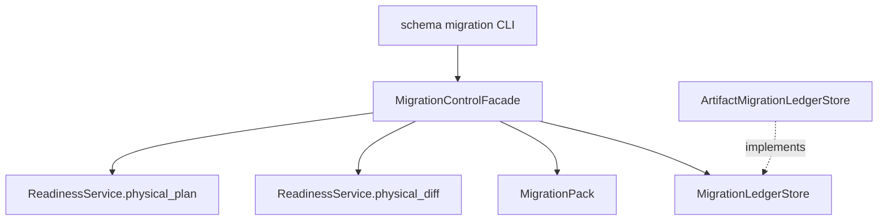

The first implementation is artifact-ledger based and fail-closed: stale actual
fingerprints, physical blockers, and non-reversible rollback requests do not
write ledger records. Target-backed ledgers and DDL executors should implement
the same ports instead of adding database logic to command handlers.

Shadow migration and cutover is the phased path for physical drift that cannot
be safely altered in place. The generic planner owns strategy and phase
semantics; target dialects own SQL rendering.

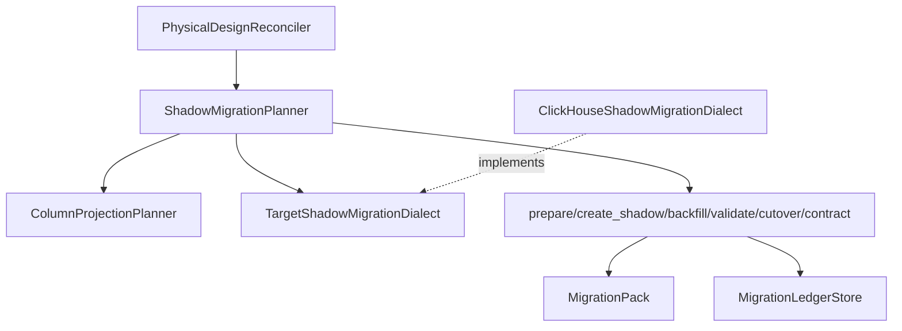

Schema impact and dependency planning is the pre-apply blast-radius layer for
the same migration packs. It reads structured dependency evidence from the
current manifest, dbt manifests, OpenLineage artifacts, and manual consumer
declarations. The layer stays target-agnostic: providers build a
`SchemaImpactGraph`, `MigrationPackChangeExtractor` converts pack changes into
subjects, and `SchemaImpactGate` blocks apply when pack-bound approvals are
missing for `compatibility_breaking`, `data_destructive`, `direct_rename`, or
`shadow_cutover` risks.

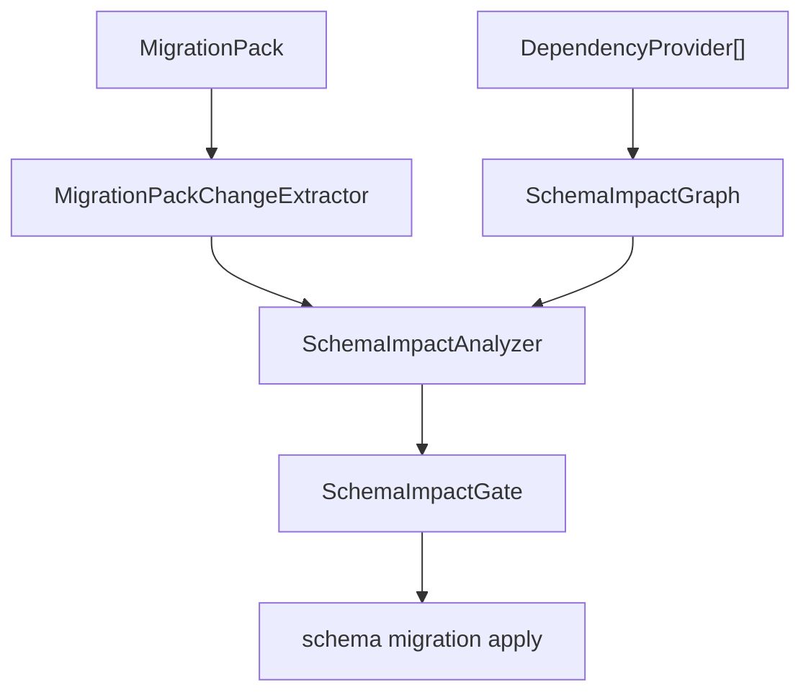

Migration promotion is the environment-control layer above the same pack and
impact evidence. It is provider-neutral by design: GitHub, GitLab, Bitbucket,
Argo CD, and other systems own branch protection, PR/MR approvals, and deploy
jobs; dpone owns deterministic pack, certification, promotion, and apply-gate
artifacts.

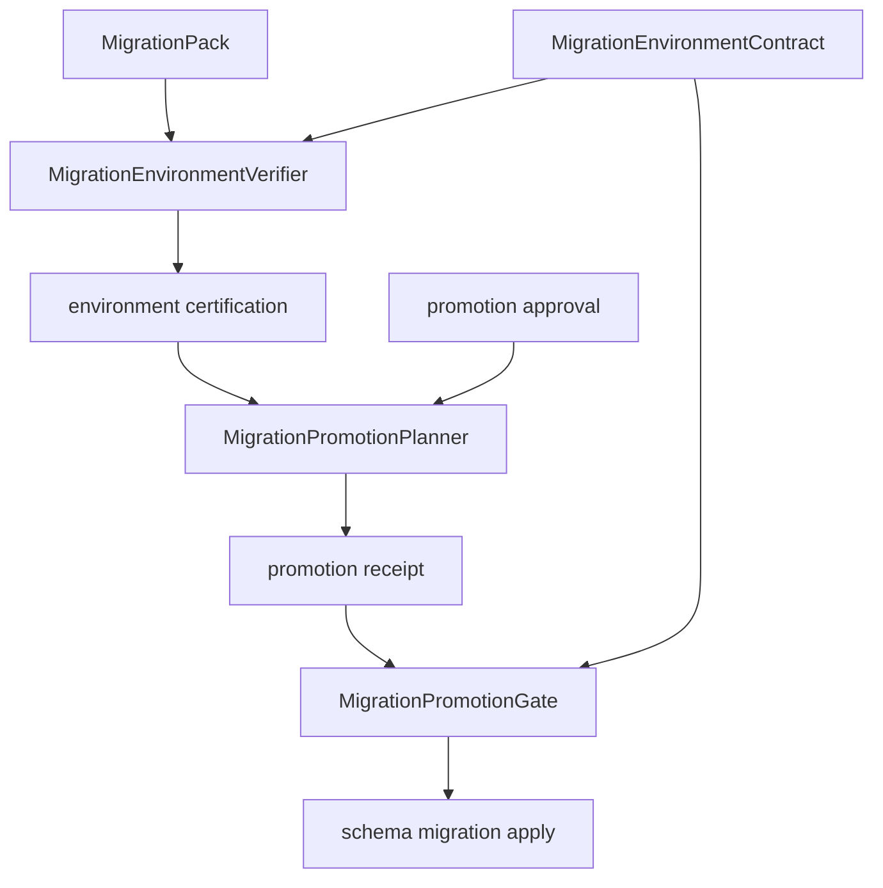

Environment contracts use `dpone.schema_migration_environments.v1`.
Certification receipts use
`dpone.schema_migration_environment_certification.v1`; promotion receipts use
`dpone.schema_migration_promotion.v1`. Environment-bound ledger records add
`environment` and `promotion_id` fields without changing old ledger semantics.

Schema migration evidence bundles are the SCM review layer above pack, impact,
certification, promotion, and approval artifacts. `MigrationBundleBuilder`
produces `dpone.schema_migration_bundle.v1` with `bundle_id`, artifact SHA-256
digests, `pack_id` relationships, and optional `bundle_digest` attestation.
`MigrationBundleVerifier` produces
`dpone.schema_migration_bundle_verification.v1` offline without database or SCM
credentials. `MigrationReviewRenderer` produces
`dpone.schema_migration_review.v1` Markdown/JSON suitable for PR/MR review.
`MigrationEvidenceRecorder` writes durable
`dpone.schema_migration_evidence_registry_record.v1` catalog entries after
bundle, gate, trust, and diff evidence has been produced.

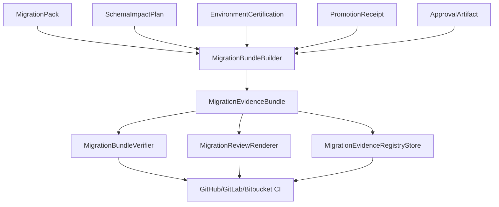

SCM owns branch protection and deployment authorization; dpone owns pack
consistency, artifact integrity, evidence rendering, durable evidence registry
records, and fail-closed gates. The migration ledger remains the target apply
history; the evidence registry is the review/release audit catalog.

Migration rehearsal and certification is the executable pre-prod proof layer
between review evidence and production apply. The planner binds a migration pack
to a non-production target connection and produces
`dpone.schema_migration_rehearsal_plan.v1`. The runner executes DDL/DML through
the same `MigrationOperationExecutor` port used by real apply and emits
`dpone.schema_migration_rehearsal_run.v1`. The certifier converts run evidence
into `dpone.schema_migration_rehearsal_certificate.v1`, which bundle gate
profiles may require before production deployment.

The rehearsal data-fixture layer proves the pack ran on representative data, not
only on empty DDL. `MigrationFixturePlanner` emits
`dpone.schema_migration_fixture_plan.v1`; fixture providers build synthetic,
artifact-sample, or masked-sample rows; `TargetFixtureSeeder` writes rows only
through target adapters; and `MigrationDataProfileAnalyzer` emits
`dpone.schema_migration_data_profile.v1` with row count, typed hash, null
distribution, distinct count, min/max, duplicate/null key, and nested
parent/child checks. These artifacts are optional by default but can be required
by `bundle gate` policies as `fixture_build` and `quality_profile`.

Production post-apply verification is the read-only closeout layer after
`migration apply --execute`. `PostApplyVerificationPlanner` binds a
`MigrationPack`, bundle, migration ledger, environment, target connection,
enabled checks, canary queries, and rollback metadata into
`dpone.schema_migration_post_apply_plan.v1`. `PostApplyVerificationRunner`
uses `PostApplyTargetInspector` and `TargetCanaryExecutor` ports to verify
actual physical design, ledger state, SELECT-only canary queries, and rollback
window evidence. `PostApplyCertifier` emits
`dpone.schema_migration_post_apply_certificate.v1` with `verified`, `warning`,
or `blocked` status. ClickHouse V1 is implemented by
`ClickHousePostApplyVerifier`; other targets stay behind the same ports until
certified.

Migration release watch is the read-only stability window after post-apply.
`MigrationWatchPlanner` binds a `MigrationPack`, verified post-apply
certificate, watch window, target connection, canary queries, telemetry budgets,
rollback metadata, and recommend-only remediation policy into
`dpone.schema_migration_watch_plan.v1`. `MigrationWatchRunner` executes bounded
`MigrationWatchSample` checks through the `TargetWatchProbe` port and emits
`dpone.schema_migration_watch_run.v1`. `MigrationWatchCertifier` emits
`dpone.schema_migration_watch_certificate.v1` with `stable`, `warning`, or
`blocked` status and a remediation decision. V1 remediation is recommend-only:
`MigrationWatchRemediationAdvisor` may emit rollback commands, but watch never
executes rollback or DDL/DML. ClickHouse V1 uses `ClickHouseWatchProbe`, which
reuses post-apply checks and reads `system.query_log` for query health.

Controlled remediation is the mutating rollback layer after watch. Watch may
emit `rollback_recommended` or `rollback_required`; `MigrationRemediationPlanner`
then binds the same `MigrationPack`, watch certificate, ledger state, manifest
policy, and target connection into
`dpone.schema_migration_remediation_plan.v1`. The planner classifies rollback
capability as `online_safe`, `shadow_exchange`, `drop_shadow`, `manual_only`,
`unsupported`, or `blocked_after_contract` without opening a connection.
`MigrationRemediationRunner` executes only approved planned operations through
an injected executor and only when `--execute` is present, emitting
`dpone.schema_migration_remediation_run.v1`. `MigrationRemediationCertifier`
emits `dpone.schema_migration_remediation_certificate.v1`, which bundle policy
and evidence registry can require for `remediated` or `rollback_certified`
release stages. ClickHouse V1 owns target SQL in `ClickHouseRemediationDialect`;
generic remediation modules remain provider-neutral.

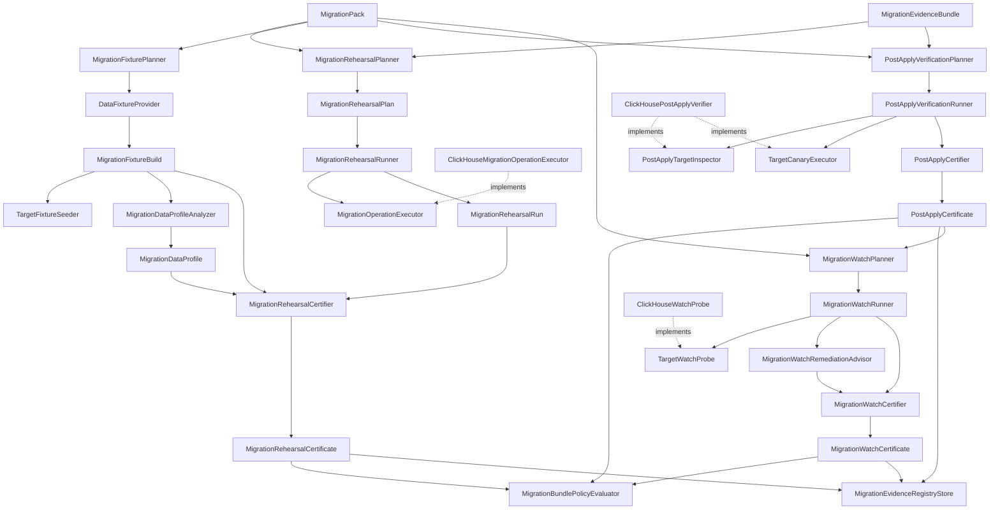

Rehearsal commands never mutate production by default. Target-specific execution
is dependency-injected through executor ports; ClickHouse is the first certified
V1 executor, while future targets can reuse the same plan/run/certify taxonomy
without changing bundle, registry, or apply command handlers.

The ClickHouse V1 dialect renders `CREATE TABLE` for the shadow table, explicit
`INSERT INTO shadow (...) SELECT ... FROM actual` backfill SQL, validation
queries, atomic `EXCHANGE TABLES` cutover, and rollback exchange before
`contract`. Other targets reuse the same `TargetShadowMigrationDialect` port.

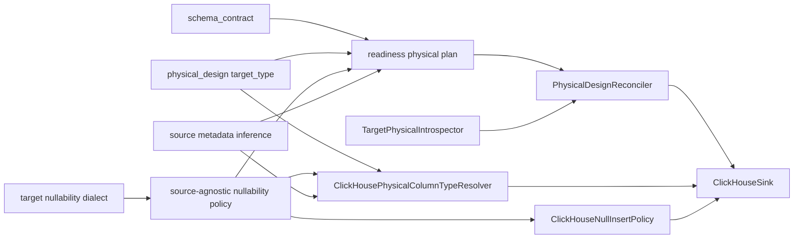

Runtime taxonomy:

| Runtime component | Boundary | Dependency rule |
| --- | --- | --- |
| `NullabilityPolicy` | Source-agnostic DDL decision over an already mapped target type. | Depends on `TargetNullabilityDialect`, not on source connectors or sink clients. |
| `TargetNullabilityDialect` | Target-specific nullable type syntax, such as ClickHouse `Nullable(T)`. | Only detect or strip nullable wrappers; never own insert behavior. |
| `ClickHouseSink` | Orchestrates ClickHouse load strategy and table lifecycle. | Depends on resolver protocols; does not parse physical design internals directly. |
| `ClickHousePhysicalColumnTypeResolver` | Resolves one column type from `LoadConfig` plus source type mapper. | Pure service, dependency-injected, no connector dependency. |
| `ClickHouseNullabilityPolicy` | Adapts the generic nullability policy to ClickHouse type syntax. | DDL-only; explicit target type overrides must bypass it. |
| `ClickHouseNullInsertPolicy` | Maps `null_handling` to ClickHouse-native insert settings and fail-fast guards. | DML-only; no Python default-value resolver. |
| `MssqlClickHouseTypeMapper` | Maps MSSQL metadata to ClickHouse type when no physical override exists. | Does not know about manifests or sink lifecycle. |

ClickHouse nullability has two separate contracts:

- DDL contract: `NullabilityPolicy` receives a mapped target type from any
  source mapper and uses the target dialect to change inferred type text, for
  example ClickHouse `Nullable(Int32)` to `Int32`.
- DML contract: `ClickHouseNullInsertPolicy` enables ClickHouse settings such
  as `input_format_null_as_default` or `insert_null_as_default`. ClickHouse
  remains the source of truth for actual default values, including SQL
  `DEFAULT` support in inline `VALUES`.

Future sources reuse the same ClickHouse DDL resolver by returning a mapped
ClickHouse target type through the `ClickHouseSourceTypeMapper` protocol. Future
targets reuse the generic nullability taxonomy by adding their own
`TargetNullabilityDialect` and target-specific insert policy.

## GitOps Workload Catalog And Compact Airflow Pack

`dpone.gitops.workload_catalog` is the connector-neutral resolver for large
GitOps workload sets. It reads the root workload-set file, included typed
catalogs, inferred manifests, environment/source/domain/workload overrides, and
returns repo-relative `gitops.workloads` evidence with per-field provenance.

`dpone.gitops.workload_impact` maps changed repo files to affected workloads.
It is intentionally above the older sparse-path manifest impact analyzer: sparse
paths remain useful for one manifest, while workload impact understands domain,
source, environment, and root catalog changes.

`dpone.gitops.airflow_compact_pack` builds one scheduler-static
`gitops.airflow_pack` per workload. It does not import Airflow. The v3 pack
carries workload identity, effective config, runtime command, pod spec,
optional connection projection policy, XCom sidecar pinning, runtime/evidence
artifact paths, outcome-gate metadata, and fingerprint. Airflow code should
consume the pack through a thin facade and must not run GitOps rendering at DAG
parse time.

`dpone.services.gitops.airflow_compact_pack_service` and
`dpone.services.gitops.gitlab_child_pipeline_service` are orchestration
facades. CLI handlers remain thin: they parse flags, call services, and render
JSON/YAML. Existing low-level commands (`run-spec`, `runtime-profile`,
`pod-contract`, `artifact-index`, `preflight`) remain available for debugging
and compatibility, but new repositories should call `airflow reconcile` or
`gitlab render-child-pipeline`.

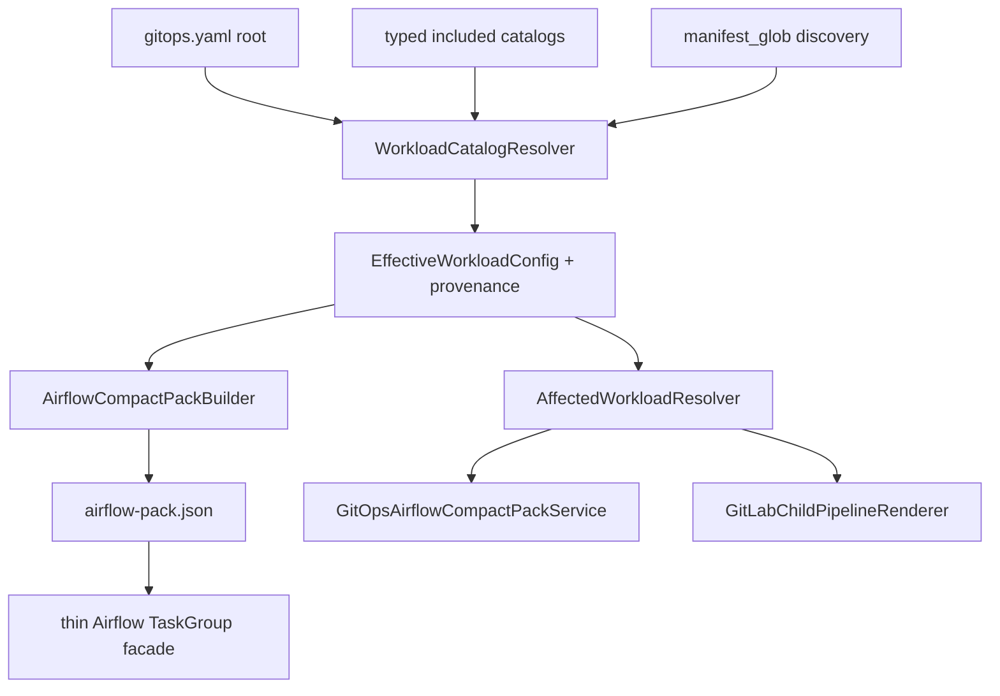

Dependency rule: catalog, impact, and compact-pack modules must not import
Airflow, GitLab, MSSQL, ClickHouse, or Kubernetes clients. Adapters can render
runner-specific files only after the connector-neutral decision objects exist.

## Airflow Deployment Cache Integrity

`dpone.runtime.deployment_cache` is the local, parse-independent materializer
for already-built release and deployment artifacts. Promotion, recovery apply,
and retention apply share one cache-root transaction lock. They validate
canonical content identities, pinned release contents, checksums, confinement,
and current-pointer authorization before control-state mutation. Retention also
fully validates active `current` before it classifies any other deployment for
deletion. Airflow parse code only reads the activated local projection, enforces
canonical lowercase release/deployment identities, and never performs cache
sync, network access, secret resolution, or database access.

Destructive exact-cache retention has two durable journals with separate
responsibilities. The filesystem transaction WAL makes candidate detach/delete
recoverable; the operation receipt makes the externally reported outcome
replayable after process death. v1 and v2 output remain compatibility
projections, while v3 binds the reviewed plan, activation-history revision,
stable operation identity and committed receipt revision. Status producers do
not replace their last-known-good files directly: a bounded publication service
validates the registered schema and exact source bytes, then atomically commits
the target or emits a separate failure marker. A post-replace durability
failure is `commit_unknown`, never success.

The mutable legacy pack watcher is a separate compatibility subsystem with a
different root and pointer format. A versioned layout marker prevents either
writer from entering the other root. Its remote work and full-tree validation
run outside the parse-blocking lease; the short commit publishes an immutable
generation through recoverable pending state and a durable authoritative local
receipt. Capacity is reserved before payload writes. DAG parsing validates the
receipt and index digest under a shared lease; retention protects every
receipt/pointer generation, detaches eligible candidates under compare-and-swap,
and deletes bytes outside the lease.

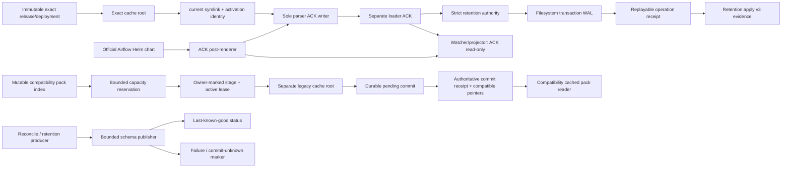

Kubernetes runtime Pod cleanup is a separate infrastructure-owned control.
It selects only provider-owned terminal Pods in one namespace, reads bounded
`PartialObjectMetadata`, quarantines uncertain identity/correlation, and uses
UID/resourceVersion delete preconditions. A successful API response is recorded
as `delete_accepted`, never as observed absence. The declared `actor` is review
evidence; the selected Kubernetes API credentials and RBAC are the authorization
authority. The CronJob starts in plan mode, remains independent from Airflow
DAG parsing, and writes schema-versioned evidence to its infrastructure-owned
Job logs. Runtime-Pod reports are not projected into the scheduler pack cache;
operators retrieve them through the Kubernetes logging/retention control plane.

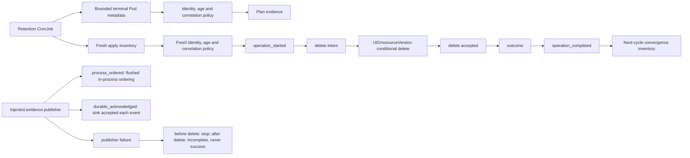

The service publishes `operation_started`, then the exact intent before each
mutation, followed by the accepted/preserved/failure outcome and aggregate
completion. `process_ordered` proves ordering and flush attempts only while the
publisher process is alive; it does not close the crash gap. Only an injected,
certified publisher that acknowledges its durable sink may report
`durable_acknowledged`. A publisher failure before intent prevents mutation; a
failure after the API call leaves an explicit incomplete operation and can
never be promoted to success.

Operational recovery and exit/output contracts are in
[Airflow runtime Pod retention](airflow-runtime-pod-retention.md).

Remote delivery is a separate clean-architecture path. Application services in
`dpone.runtime.airflow_artifact_publication` and
`dpone.runtime.airflow_artifact_materialization` depend on the
`dpone.ports.artifact_registry.ArtifactRegistry` protocol. The object-storage
adapter translates safe relative POSIX keys to one configured S3, GCS, Azure,
or local root. Roots require a non-empty canonical path; the local adapter pins
one filesystem root identity across its lifetime and rejects symlinks in every
root component. Optional SDK selection and credential resolution happen only
in the CLI composition root. Azure workload
identity uses an account-scoped URI and `WorkloadIdentityCredential` from the
optional `azure-identity` package. Publication is conditional
create-or-compare with completion markers last. Materialization is exact-ID,
bounded, checksum-verified, staged, and local create-or-compare; it never
activates `current`.

Production attestation is selected before registry I/O. The existing
GitHub/SLSA release-set authority and the deployment-scoped Cosign authority
are alternatives, never a fallback chain:

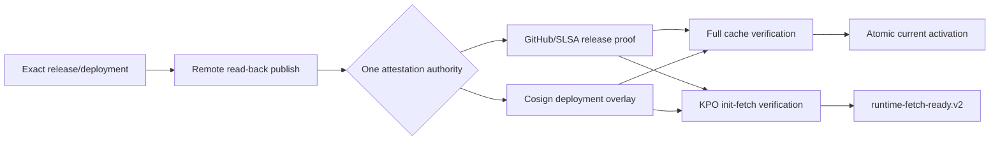

The cache observes release, deployment, and index bytes. The isolated KPO
observes release/deployment roots and reports the absent sibling index as an
unobserved claim; it does not fetch scheduler-only bytes to improve evidence.

Recovery and retention keep diagnostic artifacts schema-valid when damaged
cache names have no trustworthy deployment identity. Such entries use a null
identity only in non-destructive quarantine/skipped records. Human retention
output reports `NEEDS_ATTENTION` and an `unidentified cache entry`; exact local
paths remain available only in structured JSON diagnostics.

The executable indexed KPO boundary is frozen in
[ADR 0024](adr/0024-airflow-executable-init-fetch-wire-boundary.md). It keeps
image, command, identity, security, and reserved volume ownership in the
provider while the runtime fetches only pinned release/deployment artifacts.
Durable retry after target mutation is deliberately separate and remains
proposed in [ADR 0022](adr/0022-target-commit-terminal-failures.md); strict
indexed tasks use zero Airflow retries until a connector-certified target fence
exists.

## Verified release composition

Use [release composition](release-composition.md) to deliver one complete native
workspace and independently authored ordinary transfer packs in an explicit
`dpone.release-set.v3` parent. Native v2 authority and bytes remain intact. Upgrade
all readers before using v3. Composition activation is unavailable until physical
admission covers every constituent; see the
[contracts](release-composition-reference.md) and
[migration and recovery guide](release-composition-operations.md).
