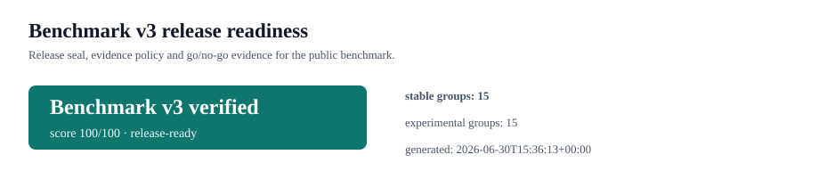

# Benchmark v3 Release Readiness

The benchmark is treated as a `benchmark-v3` evidence product: stable metric groups keep contract compatibility, while certification, claims, budget and export layers provide release guardrails.

| Release seal | Value |
|---|---|
| Status | `release-ready` |
| Seal | `Benchmark v3 verified` |
| Score | 100/100 |
| Generated at | `2026-06-30T15:36:13+00:00` |
| Source revision | `codex/release-v0.62.1@3f562b42ebc8db96a14361ce93353486faa23af4` |

### Evidence policy

- stable metric groups: `loc_sloc, top_modules, coupling_cohesion, solid_clean_oop, coverage_confidence, industrial_maintainability, quality_gates, evidence_trust, public_evidence_integrity, source_verification, trust_center, runtime_certification, claims_ledger, quality_budgets, evidence_exports`.
- experimental metric groups: `feature_parity, governance_compliance, security_supply_chain, operational_reliability, operability_tco, architecture_taxonomy, complexity_boundary, semantic_maintainability, scoring_calibration, scale_readiness, refactor_roi, independent_validation, external_analyzer_results, candidate_quality_delta, trend_summary`.
- Policy: Benchmark v3 keeps stable code-quality, release-certification and evidence-integrity metrics contract-compatible. Experimental posture, projection and roadmap metrics can evolve with explicit version notes.

### Release checks

| Check | Status | Evidence |
|---|---|---|
| Quality gates | `passed` | passed |
| Public evidence integrity | `passed` | verified, redactions 0 |
| Source citation verification | `passed` | verified, source health 100/100 |
| Evidence trust | `passed` | 92/100 audit-ready |
| Customer trust center | `passed` | verified |
| Generated artifact manifest | `passed` | projects and run context present |
| Claims ledger | `passed` | verified 4, unverified 0 |
| Runtime certification | `passed` | passed 4, failed 0 |
| Quality budgets | `passed` | warning |
| Evidence warehouse exports | `passed` | 10 CSV exports |

Recommended action: **Release the benchmark as v3 and use this evidence pack as the PR/release review summary.**
