# OSS code quality benchmark 2026-06-12

This benchmark compares dpone with open-source data-integration codebases using static maintainability proxies: LOC/SLOC, module hotspots, import coupling, cohesion, SOLID correspondence and Clean OOP correspondence. It also includes an evidence-bounded feature parity matrix from public product documentation; it does not claim runtime performance.

| Refresh metadata | Value |
|---|---|
| Schema version | `2` |
| Last refresh | `2026-06-30T15:36:13+00:00` |
| Last manual CI runner | `codex-local` |
| Workflow | `local` |
| GitHub Actions run | local |
| Source revision | `codex/release-v0.62.1@3f562b42ebc8db96a14361ce93353486faa23af4` |
| dpone release under test | `0.62.1` / `v0.62.1` / `3f562b42ebc8db96a14361ce93353486faa23af4` |
| Release resolution | `cli`; dirty `True` |
| Freshness | fresh `6`, stale `0`, unavailable `0` |
| Freshness max age policy | `30` days; warnings `0` |
| Quality gates | `passed` (13 passed, 0 failed) |

## Table of contents

### General comparisons

- [Tool overview and total corpus](#tool-overview-and-total-corpus)
- [Customer Trust Center Snapshot](#customer-trust-center-snapshot)
- [Benchmark v3 Release Readiness](#benchmark-v3-release-readiness)
- [Claims Ledger](#claims-ledger)
- [Runtime Certification Matrix](#runtime-certification-matrix)
- [Executable Certification](#executable-certification)
- [Golden Dataset Evidence](#golden-dataset-evidence)
- [Run Ledger](#run-ledger)
- [Certification Gates](#certification-gates)
- [Quality Budget As Code](#quality-budget-as-code)
- [Evidence Warehouse Export](#evidence-warehouse-export)
- [Evidence Trust & Auditability](#evidence-trust-auditability)
- [Public Evidence Integrity](#public-evidence-integrity)
- [Source Citation Verification](#source-citation-verification)
- [Independent Analyzer Cross-Validation & Audit Pack](#independent-analyzer-cross-validation-audit-pack)
- [Feature Parity Matrix](#feature-parity-matrix)
- [Governance & Compliance](#governance-compliance)
- [Security & Supply Chain](#security-supply-chain)
- [Operational Reliability](#operational-reliability)
- [TCO & Operability](#tco-operability)
- [Industrial Maintainability Index](#industrial-maintainability-index)
- [Release Delta](#release-delta)
- [Quality Gates](#quality-gates)
- [Explainable scoring](#explainable-scoring)
- [Regression summary](#regression-summary)
- [Candidate quality delta](#candidate-quality-delta)
- [Remediation backlog](#remediation-backlog)
- [Trend history](#trend-history)
- [Architecture delta](#architecture-delta)
- [Complexity & Boundary Discipline](#complexity-boundary-discipline)
- [Semantic Maintainability Deep Scan](#semantic-maintainability-deep-scan)
- [Scoring Validity & Calibration](#scoring-validity-calibration)
- [Scale Readiness & Growth Simulation](#scale-readiness-growth-simulation)
- [Refactor ROI Roadmap](#refactor-roi-roadmap)
- [Coverage Confidence Matrix](#coverage-confidence-matrix)
- [Architecture Risk Heatmap](#architecture-risk-heatmap)
- [Architecture Taxonomy & Contract Discipline](#architecture-taxonomy-contract-discipline)
- [Executive scorecard](#executive-scorecard)
- [Comparable OSS corpus](#comparable-oss-corpus)
- [Methodology](#methodology)
- [Data freshness policy](#data-freshness-policy)
- [Quality reading](#quality-reading)
- [dpone position](#dpone-position)

### Detailed project drill-downs

- [dpone: quality reading](#dpone)
- [dpone: top modules with tests and without tests](#dpone-top-modules)
- [Airbyte: quality reading](#airbyte)
- [Airbyte: top modules with tests and without tests](#airbyte-top-modules)
- [dlt: quality reading](#dlt)
- [dlt: top modules with tests and without tests](#dlt-top-modules)
- [Pentaho Kettle: quality reading](#pentaho-kettle)
- [Pentaho Kettle: top modules with tests and without tests](#pentaho-kettle-top-modules)
- [Apache Hop: quality reading](#apache-hop)
- [Apache Hop: top modules with tests and without tests](#apache-hop-top-modules)
- [Sling: quality reading](#sling)
- [Sling: top modules with tests and without tests](#sling-top-modules)

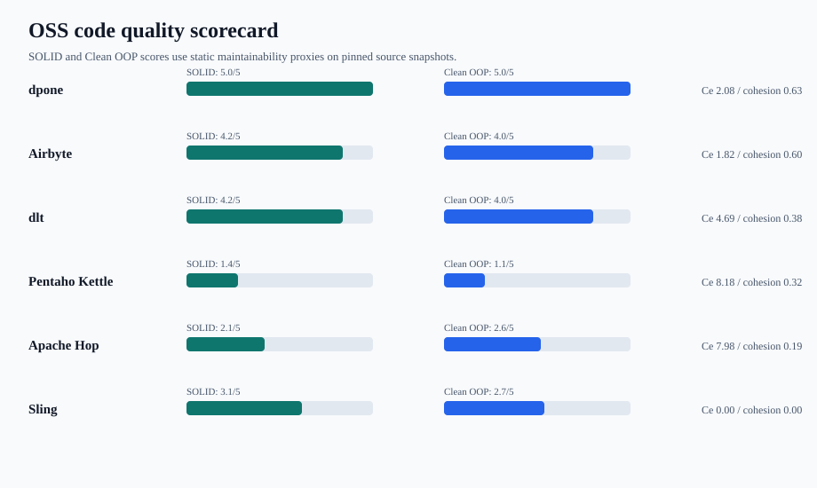

## Tool overview and total corpus

Test coverage here is a static **Test footprint** proxy: test SLOC divided by production SLOC. It shows how much test code is present in the published source tree, not runtime branch/line coverage from each project's own test runner.

| Project | Description | Total LOC | Total SLOC | LOC without tests | SLOC without tests | Test LOC | Test SLOC | Test footprint | Freshness |
|---|---|---:|---:|---:|---:|---:|---:|---:|---|
| dpone | Local dpone framework snapshot, measured as the reference implementation for industrial ETL quality posture. | 351,571 | 295,514 | 233,810 | 195,728 | 117,761 | 99,786 | 51.0% | fresh; updated 2026-06-30T15:36:13+00:00 |
| Airbyte | Open-source data movement platform with a broad connector and platform codebase. | 675,837 | 527,195 | 295,493 | 222,731 | 380,344 | 304,464 | 136.7% | fresh; updated 2026-06-30T15:36:13+00:00 |
| dlt | Open-source Python data loading library focused on developer-first ELT pipelines. | 305,209 | 235,504 | 140,090 | 108,848 | 165,119 | 126,656 | 116.4% | fresh; updated 2026-06-30T15:36:13+00:00 |
| Pentaho Kettle | Mature open-source ETL/data-integration baseline from the Pentaho Kettle lineage. | 1,282,446 | 887,667 | 1,001,584 | 686,539 | 280,862 | 201,128 | 29.3% | fresh; updated 2026-06-30T15:36:13+00:00 |
| Apache Hop | Modern open-source orchestration and data-integration platform from the Kettle/Hop lineage. | 1,086,054 | 775,990 | 902,641 | 642,167 | 183,413 | 133,823 | 20.8% | fresh; updated 2026-06-30T15:36:13+00:00 |
| Sling | Open-source CLI-first data movement tool for database and file replication workflows. | 103,135 | 81,285 | 102,799 | 81,045 | 336 | 240 | 0.3% | fresh; updated 2026-06-30T15:36:13+00:00 |

## Customer Trust Center Snapshot

A customer-ready trust center export is generated with every benchmark refresh for sales, security review and procurement evidence packets.


| Export | Value |
|---|---|
| Status | `verified` |
| Badge | `dpone verified` / `100` |
| Markdown snapshot | `docs/benchmarks/dpone-trust-center-snapshot-2026-06-12.md` ([open snapshot](dpone-trust-center-snapshot-2026-06-12.md)) |
| JSON snapshot | `docs/benchmarks/data/dpone-trust-center-snapshot-2026-06-12.json` ([open JSON](data/dpone-trust-center-snapshot-2026-06-12.json)) |
| Badge asset | `docs/benchmarks/assets/dpone-trust-center-badge.svg` |

## Benchmark v3 Release Readiness

The benchmark is treated as a `benchmark-v3` evidence product: stable metric groups keep contract compatibility, while certification, claims, budget and export layers provide release guardrails.


| Release seal | Value |
|---|---|
| Status | `release-ready` |
| Seal | `Benchmark v3 verified` |
| Score | 100/100 |
| Generated at | `2026-06-30T15:36:13+00:00` |
| Source revision | `codex/release-v0.62.1@3f562b42ebc8db96a14361ce93353486faa23af4` |

### Evidence policy

- stable metric groups: `loc_sloc, top_modules, coupling_cohesion, solid_clean_oop, coverage_confidence, industrial_maintainability, quality_gates, evidence_trust, public_evidence_integrity, source_verification, trust_center, runtime_certification, claims_ledger, quality_budgets, evidence_exports`.
- experimental metric groups: `feature_parity, governance_compliance, security_supply_chain, operational_reliability, operability_tco, architecture_taxonomy, complexity_boundary, semantic_maintainability, scoring_calibration, scale_readiness, refactor_roi, independent_validation, external_analyzer_results, candidate_quality_delta, trend_summary`.
- Policy: Benchmark v3 keeps stable code-quality, release-certification and evidence-integrity metrics contract-compatible. Experimental posture, projection and roadmap metrics can evolve with explicit version notes.

### Release checks

| Check | Status | Evidence |
|---|---|---|
| Quality gates | `passed` | passed |
| Public evidence integrity | `passed` | verified, redactions 0 |
| Source citation verification | `passed` | verified, source health 100/100 |
| Evidence trust | `passed` | 92/100 audit-ready |
| Customer trust center | `passed` | verified |
| Generated artifact manifest | `passed` | projects and run context present |
| Claims ledger | `passed` | verified 4, unverified 0 |
| Runtime certification | `passed` | passed 4, failed 0 |
| Quality budgets | `passed` | warning |
| Evidence warehouse exports | `passed` | 10 CSV exports |

Recommended action: **Release the benchmark as v3 and use this evidence pack as the PR/release review summary.**
## Claims Ledger

Every public benchmark claim below is resolved against raw JSON evidence, generated artifacts, or public sources. Claims without evidence are not rendered as verified sales statements.

Verified `4`, stale `0`, unverified `0`.

| Claim | Type | Status | Confidence | Freshness | Gate impact | Evidence |
|---|---:|---:|---:|---:|---:|---|
| dpone release benchmark gates are passing | `release-readiness` | `verified` | 95 | `fresh` | `blocker` | `json:release_context.release_tag`<br>`json:quality_gates.status` |
| dpone production modules stay within the 400 SLOC release gate | `architecture-quality` | `verified` | 95 | `fresh` | `blocker` | `json:projects[dpone].loc_without_tests.max_sloc`<br>`json:quality_budgets.status` |
| dpone nested lineage keeps root and parent identity evidence visible | `runtime-certification` | `verified` | 95 | `fresh` | `blocker` | `json:runtime_certification_v2.scenarios[nested-lineage].status`<br>`artifact:docs/nested-normalization.md`<br>`artifact:tests/test_nested_normalization_contracts.py` |
| dpone benchmark claims are backed by raw evidence and provenance artifacts | `auditability` | `verified` | 95 | `fresh` | `warning` | `json:evidence_trust.overall_confidence_score`<br>`json:source_verification.status`<br>`artifact:docs/benchmarks/data/oss-code-quality-benchmark-2026-06-12.json` |
<a id="runtime-certification-matrix"></a>

## Runtime Certification Matrix

Runtime certification connects release claims to concrete checks and generated artifacts. Failed scenarios remain visible instead of being converted into optimistic narrative.

Passed `4`, failed `0`.

| Scenario | Source | Strategy | Sink | Status | Checks | Artifacts |
|---|---:|---:|---:|---:|---|---|
| release_gate_certification | dpone | `release_gate` | benchmark evidence | `passed` | release tag resolved: `passed`<br>quality gates passed: `passed` | n/a |
| python_api_payload_contract | dpone | `python_api` | raw evidence JSON | `passed` | schema v2: `passed`<br>project identity: `passed` | n/a |
| nested_lineage_contract | nested objects | `nested_normalization` | lineage tables | `passed` | nested docs mention parent/root identity: `passed`<br>nested contract tests exist: `passed` | `docs/nested-normalization.md`<br>`tests/test_nested_normalization_contracts.py` |
| benchmark_artifact_contract | benchmark | `artifact_generation` | docs/benchmarks | `passed` | raw benchmark JSON: `passed`<br>benchmark markdown: `passed`<br>provenance JSON: `passed` | `docs/benchmarks/data/oss-code-quality-benchmark-2026-06-12.json`<br>`docs/benchmarks/oss-code-quality-benchmark-2026-06-12.md`<br>`docs/benchmarks/data/oss-benchmark-provenance.json` |
<a id="executable-certification"></a>

## Executable Certification

Executable certification runs deterministic, credential-free dpone release scenarios and publishes the ledger behind every runtime claim.

Passed `5`, failed `0`, stale `0`, unavailable `0`.

| Scenario | Category | Runner | Status | Freshness | Duration | Row counts |
|---|---:|---:|---:|---:|---:|---|
| artifact-contract | `artifact_contract` | `cli` | `passed` | `fresh` | 696 ms | `records` 1 |
| cdc-replay | `cdc_replay` | `python_api` | `passed` | `fresh` | 0 ms | `records` 2 |
| incremental | `incremental_sync` | `python_api` | `passed` | `fresh` | 0 ms | `records` 2 |
| nested-lineage | `nested_lineage` | `python_api` | `passed` | `fresh` | 1 ms | `orders` 2<br>`orders__customer` 2<br>`orders__items` 3 |
| schema-evolution | `schema_evolution` | `python_api` | `passed` | `fresh` | 0 ms | `records` 3 |

<a id="golden-dataset-evidence"></a>

## Golden Dataset Evidence

Deterministic local fixtures validate nested lineage, incremental sync, CDC replay, schema evolution and artifact contracts.

Hash policy: `SHA-256 over normalized JSON with volatile runtime timestamps removed.`.

<a id="run-ledger"></a>

## Run Ledger

Machine-readable run artifacts: `docs/benchmarks/data/runtime-certification/latest/run-ledger.json` and `docs/benchmarks/data/runtime-certification/latest/contract-checks.json`.

| Scenario | Status | Input hash | Output hash | Artifacts |
|---|---:|---|---|---|
| artifact-contract | `passed` | `147b6d07ff85` | `4979c567d6fe` | `docs/benchmarks/data/runtime-certification/latest/artifact-contract/artifact-contract.json`<br>`docs/benchmarks/data/runtime-certification/latest/artifact-contract/artifact-contract.md` |
| cdc-replay | `passed` | `8371105c3cb6` | `496b00829f70` | `docs/benchmarks/data/runtime-certification/latest/cdc-replay/cdc-replay.json` |
| incremental | `passed` | `8f6d0c2760ba` | `f513dd4a4ee2` | `docs/benchmarks/data/runtime-certification/latest/incremental/incremental.json` |
| nested-lineage | `passed` | `4e16d90a56e7` | `6e4bd2041524` | `docs/benchmarks/data/runtime-certification/latest/nested-lineage/nested-lineage.json` |
| schema-evolution | `passed` | `f7a04a823194` | `f7a04a823194` | `docs/benchmarks/data/runtime-certification/latest/schema-evolution/schema-evolution.json` |

<a id="certification-gates"></a>

## Certification Gates

Status: **passed**.

| Gate | Status | Actual | Expected |
|---|---:|---:|---:|
| Executable scenario artifact-contract | `passed` | `passed/fresh` | `passed/fresh` |
| Executable scenario cdc-replay | `passed` | `passed/fresh` | `passed/fresh` |
| Executable scenario incremental | `passed` | `passed/fresh` | `passed/fresh` |
| Executable scenario nested-lineage | `passed` | `passed/fresh` | `passed/fresh` |
| Executable scenario schema-evolution | `passed` | `passed/fresh` | `passed/fresh` |
<a id="quality-budget-as-code"></a>

## Quality Budget As Code

Budget policy: `docs/benchmarks/quality_budgets.yml`. Status: **`warning`**.

Passed `34`, warning `14`, failed `0`.

| Project | Metric | Value | Warning | Failure | Status |
|---|---:|---:|---:|---:|---:|
| dpone | `max_sloc` | 397 | 350 | 400 | `warning` |
| Airbyte | `max_sloc` | 28633 | 350 | 400 | `warning` |
| Airbyte | `max_loc` | 41035 | 450 | 600 | `warning` |
| dlt | `max_sloc` | 1631 | 350 | 400 | `warning` |
| dlt | `max_loc` | 2013 | 450 | 600 | `warning` |
| dlt | `avg_clustering` | 0.226 | n/a | 0.18 | `warning` |
| Pentaho Kettle | `max_sloc` | 7948 | 350 | 400 | `warning` |
| Pentaho Kettle | `max_loc` | 10532 | 450 | 600 | `warning` |
| Pentaho Kettle | `avg_clustering` | 0.276 | n/a | 0.18 | `warning` |
| Apache Hop | `max_sloc` | 4584 | 350 | 400 | `warning` |
| Apache Hop | `max_loc` | 5998 | 450 | 600 | `warning` |
| Apache Hop | `avg_clustering` | 0.235 | n/a | 0.18 | `warning` |
| Sling | `max_sloc` | 3379 | 350 | 400 | `warning` |
| Sling | `max_loc` | 4198 | 450 | 600 | `warning` |

### Debt Ledger

| Project | Debt | Status | Release handling |
|---|---|---:|---|
| dpone | `max_sloc` = 397 | `warning` | visible managed warning |
| Airbyte | `max_sloc` = 28633 | `warning` | visible managed warning |
| Airbyte | `max_loc` = 41035 | `warning` | visible managed warning |
| dlt | `max_sloc` = 1631 | `warning` | visible managed warning |
| dlt | `max_loc` = 2013 | `warning` | visible managed warning |
| dlt | `avg_clustering` = 0.226 | `warning` | visible managed warning |
| Pentaho Kettle | `max_sloc` = 7948 | `warning` | visible managed warning |
| Pentaho Kettle | `max_loc` = 10532 | `warning` | visible managed warning |
| Pentaho Kettle | `avg_clustering` = 0.276 | `warning` | visible managed warning |
| Apache Hop | `max_sloc` = 4584 | `warning` | visible managed warning |
| Apache Hop | `max_loc` = 5998 | `warning` | visible managed warning |
| Apache Hop | `avg_clustering` = 0.235 | `warning` | visible managed warning |
| Sling | `max_sloc` = 3379 | `warning` | visible managed warning |
| Sling | `max_loc` = 4198 | `warning` | visible managed warning |
<a id="evidence-warehouse-export"></a>

## Evidence Warehouse Export

The benchmark also emits BI-ready CSV facts so quality, freshness, gates and claims can be trended outside Markdown.

Output directory: `docs/benchmarks/data/warehouse`.

| Export | Purpose |
|---|---|
| `projects.csv` | project-level size, freshness and release identity facts |
| `metric_groups.csv` | per-project freshness and stale-age facts |
| `quality_gates.csv` | normalized release gate results |
| `claims.csv` | public claim status and confidence facts |
| `runtime_certification.csv` | runtime certification scenario facts |
| `certification_scenarios.csv` | executable certification scenario facts |
| `contract_checks.csv` | per-scenario executable contract check facts |
| `run_ledger.csv` | operational run ledger facts with hashes and durations |
| `release_deltas.csv` | baseline comparison facts |
| `debt_ledger.csv` | quality-budget debt facts |

## Evidence Trust & Auditability

Evidence confidence separates raw measurements from derived scores and inferred market posture. The benchmark is built for self-service review: every refresh publishes a provenance ledger, artifact checksums and an optional LOC/SLOC cross-check result.

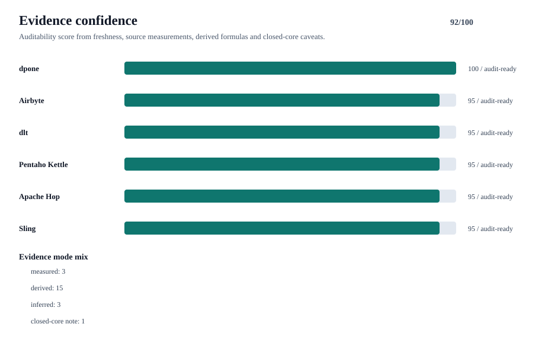

Overall evidence confidence: **92/100** (`audit-ready`).

| Project | Confidence | Band | Fresh groups | Stale groups | Unavailable groups |
|---|---:|---|---:|---:|---:|
| dpone | 100 | audit-ready | 5 | 0 | 0 |
| Airbyte | 95 | audit-ready | 5 | 0 | 0 |
| dlt | 95 | audit-ready | 5 | 0 | 0 |
| Pentaho Kettle | 95 | audit-ready | 5 | 0 | 0 |
| Apache Hop | 95 | audit-ready | 5 | 0 | 0 |
| Sling | 95 | audit-ready | 5 | 0 | 0 |

### Measured vs derived vs inferred

| Evidence mode | Metric groups | Meaning |
|---|---:|---|
| `measured` | 3 | direct source-tree collection or static dependency analysis |
| `derived` | 15 | deterministic score calculated from measured evidence |
| `inferred` | 3 | public documentation or repository signal interpreted through a fixed rubric |
| `closed-core note` | 1 | closed-core comparator posture where source code is unavailable |

### Metric provenance ledger

Raw provenance is published at `docs/benchmarks/data/oss-benchmark-provenance.json` ([open ledger](data/oss-benchmark-provenance.json)).

| Metric group | Mode | Collector | Formula |
|---|---|---|---|
| `loc_sloc` | `measured` | `collect_project_metrics` | `loc-sloc-v1` |
| `top_modules` | `measured` | `top_files` | `top-modules-v1` |
| `coupling_cohesion` | `measured` | `compute_coupling_metrics` | `dependency-proxy-v1` |
| `solid_clean_oop` | `derived` | `score_quality` | `solid-clean-oop-rubric-v1` |
| `industrial_maintainability` | `derived` | `compute_industrial_maintainability_index` | `industrial-maintainability-v1` |
| `quality_gates` | `derived` | `evaluate_quality_gates` | `quality-gates-v1` |
| `feature_parity` | `inferred` | `build_feature_parity_matrix` | `feature-parity-v1` |
| `governance_compliance` | `inferred` | `build_governance_compliance_matrix` | `governance-compliance-v1` |
| `security_supply_chain` | `inferred` | `build_security_supply_chain_matrix` | `security-supply-chain-v1` |
| `refactor_roi` | `derived` | `build_refactor_roi_roadmap` | `refactor-roi-v1` |
| `semantic_maintainability` | `derived` | `analyze_semantic_maintainability` | `semantic-maintainability-v1` |
| `scoring_calibration` | `derived` | `build_scoring_calibration` | `scoring-calibration-v1` |

### Reproducibility manifest

The provenance ledger records Python/platform metadata, analyzer schema versions and SHA-256 checksums for generated benchmark artifacts. This makes the public markdown, SVG assets and JSON evidence independently traceable to the same refresh run.

| Control | Value |
|---|---|
| Checksum manifest | `docs/benchmarks/data/oss-benchmark-provenance.json` |
| Optional LOC/SLOC cross-check | `fresh` via `tokei` |
| Cross-check detail | external SLOC `395290`, benchmark SLOC `295514`, delta `99776` |

## Public Evidence Integrity

This section verifies that public benchmark artifacts avoid machine-specific paths and that customer-facing claims have source-backed evidence.

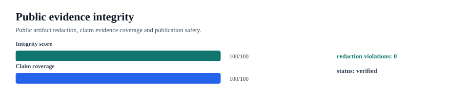

| Integrity check | Value |
|---|---:|
| Status | `verified` |
| Score | 100 |
| Claim coverage | 100% |
| redaction violations | 0 |

### claim evidence ledger

| Claim | Section | Confidence | Source | Status |
|---|---|---|---|---|
| `feature_parity_public_sources` | Feature Parity Matrix | `vendor-public` | `feature_parity.entries[].sources` | `covered` |
| `closed_core_comparator_scope` | Comparable OSS corpus | `vendor-public` | `closed_core_notes[].url` | `covered` |
| `customer_trust_center_verified` | Customer Trust Center Snapshot | `derived` | `trust_center.status` | `covered` |
| `quality_gates_passed` | Quality Gates | `derived` | `quality_gates.status` | `covered` |
| `external_analyzer_execution` | Independent Analyzer Cross-Validation | `measured` | `external_analyzer_results[]` | `covered` |
| `dpone_position_static_quality` | dpone position | `derived` | `projects[].quality, projects[].coupling, industrial_maintainability` | `covered` |

Public evidence policy: raw JSON, Markdown, SVG and PR artifacts use stable path tokens such as `$WORKSPACE` and `$BENCHMARK_CACHE` instead of local filesystem paths.

## Source Citation Verification

This section verifies the source registry behind public benchmark claims. URL and local source references are checked before publication; source health and stale source values stay visible instead of being overwritten by a failed refresh.

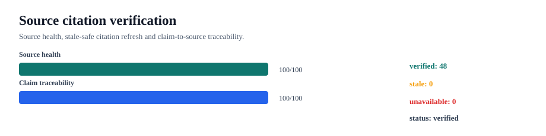

| Source health | Value |
|---|---:|
| Status | `verified` |
| Source health score | 100 |
| Claim traceability | 100% |
| Verified sources | 48 |
| Stale sources | 0 |
| Unavailable sources | 0 |

### claim-to-source matrix

| Claim | Sources | Status |
|---|---:|---|
| `closed_core_comparator_scope` | 2 | `verified` |
| `customer_trust_center_verified` | 3 | `verified` |
| `feature:airbyte:cdc_incremental` | 2 | `verified` |
| `feature:airbyte:certification_evidence` | 1 | `verified` |
| `feature:airbyte:connectors` | 1 | `verified` |
| `feature:airbyte:deployment_modes` | 1 | `verified` |
| `feature:airbyte:governance_security` | 1 | `verified` |
| `feature:airbyte:lineage_catalog` | 1 | `verified` |
| `feature:airbyte:observability` | 1 | `verified` |
| `feature:airbyte:orchestration` | 1 | `verified` |
| `feature:airbyte:retry_resume` | 1 | `verified` |
| `feature:airbyte:schema_evolution` | 1 | `verified` |

### Source registry

| Source | Type | Status | Claims | Last updated | Mode |
|---|---|---|---:|---|---|
| `docs/appsflyer-rollout.md` | `local-doc` | `verified` | 2 | `2026-06-30T15:36:13+00:00` | `local-file` |
| `docs/cdc.md` | `local-doc` | `verified` | 3 | `2026-06-30T15:36:13+00:00` | `local-file` |
| `docs/certification-suite.md` | `local-doc` | `verified` | 2 | `2026-06-30T15:36:13+00:00` | `local-file` |
| `docs/ci-cd.md` | `local-doc` | `verified` | 3 | `2026-06-30T15:36:13+00:00` | `local-file` |
| `docs/connector-certification.md` | `local-doc` | `verified` | 2 | `2026-06-30T15:36:13+00:00` | `local-file` |
| `docs/connector-sdk.md` | `local-doc` | `verified` | 2 | `2026-06-30T15:36:13+00:00` | `local-file` |
| `docs/connectors.md` | `local-doc` | `verified` | 2 | `2026-06-30T15:36:13+00:00` | `local-file` |
| `docs/industrial-readiness.md` | `local-doc` | `verified` | 4 | `2026-06-30T15:36:13+00:00` | `local-file` |
| `docs/lineage.md` | `local-doc` | `verified` | 2 | `2026-06-30T15:36:13+00:00` | `local-file` |
| `docs/load-lineage.md` | `local-doc` | `verified` | 2 | `2026-06-30T15:36:13+00:00` | `local-file` |
| `docs/observability.md` | `local-doc` | `verified` | 2 | `2026-06-30T15:36:13+00:00` | `local-file` |
| `docs/orchestration.md` | `local-doc` | `verified` | 4 | `2026-06-30T15:36:13+00:00` | `local-file` |
| `docs/physical-ddl-apply.md` | `local-doc` | `verified` | 2 | `2026-06-30T15:36:13+00:00` | `local-file` |
| `docs/release-evidence.md` | `local-doc` | `verified` | 4 | `2026-06-30T15:36:13+00:00` | `local-file` |
| `docs/schema-evolution.md` | `local-doc` | `verified` | 2 | `2026-06-30T15:36:13+00:00` | `local-file` |
| `oss-code-quality-benchmark-2026-06-12.md` | `local-doc` | `verified` | 1 | `2026-06-30T15:36:13+00:00` | `local-file` |

Raw source verification evidence is stored under `source_verification` in `docs/benchmarks/data/oss-code-quality-benchmark-2026-06-12.json`.

## Independent Analyzer Cross-Validation & Audit Pack

This audit layer makes the benchmark easier to trust: internal metrics remain the source of record, while external analyzer command metadata and cross-checks show where independent tools agree, warn, or are unavailable.

**External analyzer execution:** manual CI installs and runs `tokei`, `cloc`, `radon`, and `lizard` when available. If a refresh cannot execute a tool but prior evidence exists, stale analyzer values remain visible with their last successful update instead of being overwritten.

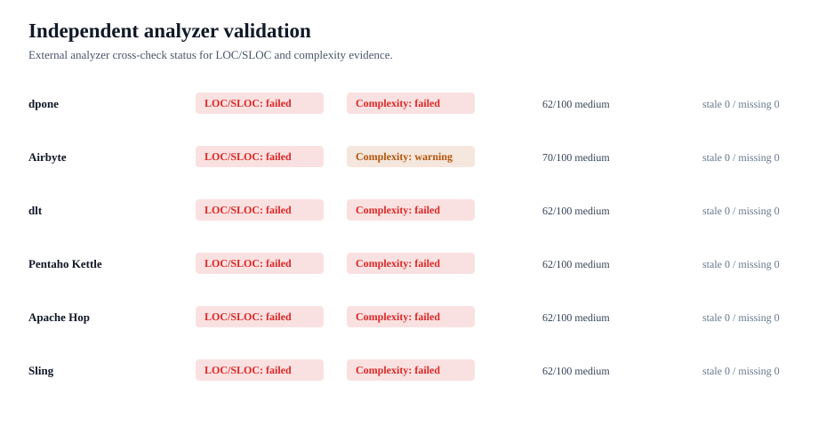

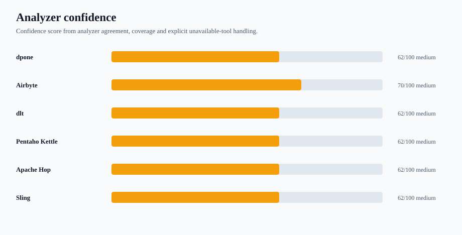

### Validation confidence

| Project | Confidence | Band | LOC/SLOC status | Complexity status | Stale analyzers | Unavailable analyzers |
|---|---:|---|---|---|---:|---:|
| Airbyte | 70 | `medium` | `failed` | `warning` | 0 | 0 |
| Apache Hop | 62 | `medium` | `failed` | `failed` | 0 | 0 |
| dlt | 62 | `medium` | `failed` | `failed` | 0 | 0 |
| dpone | 62 | `medium` | `failed` | `failed` | 0 | 0 |
| Pentaho Kettle | 62 | `medium` | `failed` | `failed` | 0 | 0 |
| Sling | 62 | `medium` | `failed` | `failed` | 0 | 0 |

### Analyzer command ledger

| Tool | Project | Status | Exit | Version | Command |
|---|---|---|---:|---|---|
| `tokei` | dpone | `fresh` | 0 | n/a | `tokei --exclude .cache --exclude .venv --exclude node_modules --exclude target --exclude dist --output json $WORKSPACE` |
| `cloc` | dpone | `fresh` | 0 | n/a | `cloc --json --exclude-dir=.git,.venv,.cache,node_modules,target,build,dist,__pycache__ $WORKSPACE` |
| `radon` | dpone | `fresh` | 0 | n/a | `radon cc -j $WORKSPACE` |
| `lizard` | dpone | `fresh` | 0 | n/a | `lizard --xml $WORKSPACE` |
| `tokei` | airbyte | `fresh` | 0 | n/a | `tokei --exclude .cache --exclude .venv --exclude node_modules --exclude target --exclude dist --output json $BENCHMARK_CACHE/airbyte` |
| `cloc` | airbyte | `fresh` | 0 | n/a | `cloc --json --exclude-dir=.git,.venv,.cache,node_modules,target,build,dist,__pycache__ $BENCHMARK_CACHE/airbyte` |
| `radon` | airbyte | `fresh` | 0 | n/a | `radon cc -j $BENCHMARK_CACHE/airbyte` |
| `lizard` | airbyte | `fresh` | 0 | n/a | `lizard --xml $BENCHMARK_CACHE/airbyte` |
| `tokei` | dlt | `fresh` | 0 | n/a | `tokei --exclude .cache --exclude .venv --exclude node_modules --exclude target --exclude dist --output json $BENCHMARK_CACHE/dlt` |
| `cloc` | dlt | `fresh` | 0 | n/a | `cloc --json --exclude-dir=.git,.venv,.cache,node_modules,target,build,dist,__pycache__ $BENCHMARK_CACHE/dlt` |
| `radon` | dlt | `fresh` | 0 | n/a | `radon cc -j $BENCHMARK_CACHE/dlt` |
| `lizard` | dlt | `fresh` | 0 | n/a | `lizard --xml $BENCHMARK_CACHE/dlt` |
| `tokei` | pentaho-kettle | `fresh` | 0 | n/a | `tokei --exclude .cache --exclude .venv --exclude node_modules --exclude target --exclude dist --output json $BENCHMARK_CACHE/pentaho-kettle` |
| `cloc` | pentaho-kettle | `fresh` | 0 | n/a | `cloc --json --exclude-dir=.git,.venv,.cache,node_modules,target,build,dist,__pycache__ $BENCHMARK_CACHE/pentaho-kettle` |
| `radon` | pentaho-kettle | `fresh` | 0 | n/a | `radon cc -j $BENCHMARK_CACHE/pentaho-kettle` |
| `lizard` | pentaho-kettle | `fresh` | 0 | n/a | `lizard --xml $BENCHMARK_CACHE/pentaho-kettle` |
| `tokei` | apache-hop | `fresh` | 0 | n/a | `tokei --exclude .cache --exclude .venv --exclude node_modules --exclude target --exclude dist --output json $BENCHMARK_CACHE/apache-hop` |
| `cloc` | apache-hop | `fresh` | 0 | n/a | `cloc --json --exclude-dir=.git,.venv,.cache,node_modules,target,build,dist,__pycache__ $BENCHMARK_CACHE/apache-hop` |
| `radon` | apache-hop | `fresh` | 0 | n/a | `radon cc -j $BENCHMARK_CACHE/apache-hop` |
| `lizard` | apache-hop | `fresh` | 0 | n/a | `lizard --xml $BENCHMARK_CACHE/apache-hop` |
| `tokei` | sling | `fresh` | 0 | n/a | `tokei --exclude .cache --exclude .venv --exclude node_modules --exclude target --exclude dist --output json $BENCHMARK_CACHE/sling` |
| `cloc` | sling | `fresh` | 0 | n/a | `cloc --json --exclude-dir=.git,.venv,.cache,node_modules,target,build,dist,__pycache__ $BENCHMARK_CACHE/sling` |
| `radon` | sling | `fresh` | 0 | n/a | `radon cc -j $BENCHMARK_CACHE/sling` |
| `lizard` | sling | `fresh` | 0 | n/a | `lizard --xml $BENCHMARK_CACHE/sling` |

### LOC/SLOC cross-check

| Project | Tool | Status | Benchmark SLOC | External SLOC | Delta |
|---|---|---|---:|---:|---:|
| airbyte | `tokei` | `failed` | 527,195 | 2,550,180 | 383.73% |
| airbyte | `cloc` | `failed` | 527,195 | 3,103,945 | 488.77% |
| apache-hop | `tokei` | `failed` | 775,990 | 961,255 | 23.87% |
| apache-hop | `cloc` | `failed` | 775,990 | 1,466,752 | 89.02% |
| dlt | `tokei` | `failed` | 235,504 | 367,973 | 56.25% |
| dlt | `cloc` | `failed` | 235,504 | 378,758 | 60.83% |
| dpone | `tokei` | `failed` | 295,514 | 395,290 | 33.76% |
| dpone | `cloc` | `failed` | 295,514 | 6,747,123 | 2183.18% |
| pentaho-kettle | `tokei` | `failed` | 887,667 | 1,181,940 | 33.15% |
| pentaho-kettle | `cloc` | `failed` | 887,667 | 1,524,901 | 71.79% |
| sling | `tokei` | `failed` | 81,285 | 154,484 | 90.05% |
| sling | `cloc` | `failed` | 81,285 | 169,454 | 108.47% |

### Complexity cross-check

| Project | Tool | Status | Avg complexity | Max complexity | Files |
|---|---|---|---:|---:|---:|
| airbyte | `radon` | `warning` | 2.44 | 40.00 | 1,798 |
| airbyte | `lizard` | `warning` | 1.81 | 50.00 | 25,409 |
| apache-hop | `radon` | `not_applicable` | n/a | n/a | n/a |
| apache-hop | `lizard` | `failed` | 2.37 | 127.00 | 44,280 |
| dlt | `radon` | `failed` | 3.60 | 92.00 | 1,037 |
| dlt | `lizard` | `failed` | 2.23 | 92.00 | 14,556 |
| dpone | `radon` | `failed` | 3.43 | 151.00 | 2,258 |
| dpone | `lizard` | `failed` | 2.75 | 58.00 | 19,412 |
| pentaho-kettle | `radon` | `not_applicable` | n/a | n/a | n/a |
| pentaho-kettle | `lizard` | `failed` | 2.13 | 423.00 | 64,801 |
| sling | `radon` | `passed` | 3.00 | 5.00 | 1 |
| sling | `lizard` | `failed` | 4.76 | 173.00 | 3,062 |

## Feature Parity Matrix

This matrix compares public product-surface capabilities. It is evidence-bounded: closed-core tools are included as feature comparators, while source-code quality metrics remain limited to code-comparable repositories.

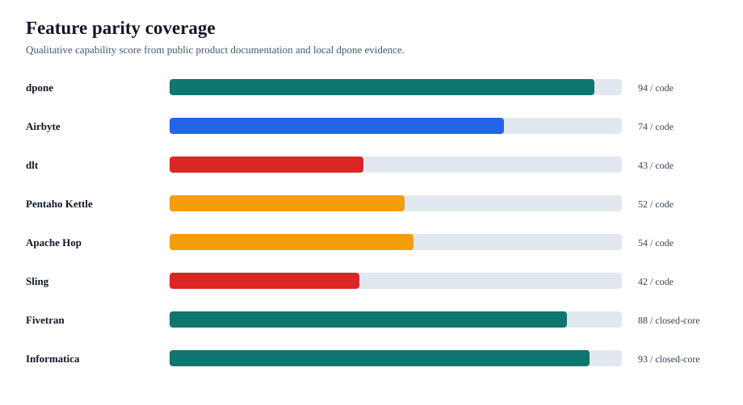

| Tool | Feature score | Band | Code comparable? | Comparator note |
|---|---:|---|---|---|
| dpone | 94 | leader | yes | local framework and feature reference |
| Airbyte | 74 | strong | yes | open-source code and public docs |
| dlt | 43 | limited | yes | open-source library and public docs |
| Pentaho Kettle | 52 | focused | yes | open-source lineage plus current Pentaho docs |
| Apache Hop | 54 | focused | yes | open-source platform and public docs |
| Sling | 42 | limited | yes | open-source CLI and public docs |
| Fivetran | 88 | leader | no | closed-core feature comparator |
| Informatica | 93 | leader | no | closed-core feature comparator |

### Capability coverage

| Capability | dpone | Airbyte | dlt | Pentaho Kettle | Apache Hop | Sling | Fivetran | Informatica |
|---|---|---|---|---|---|---|---|---|
| Connector breadth and SDK | `supported` | `strong` | `supported` | `strong` | `strong` | `strong` | `managed` | `managed` |
| CDC and incremental capture | `native` | `native` | `partial` | `partial` | `partial` | `partial` | `managed` | `managed` |
| Schema evolution and drift | `native` | `native` | `native` | `partial` | `partial` | `partial` | `managed` | `managed` |
| Orchestration and scheduling | `native` | `supported` | `external` | `native` | `native` | `external` | `managed` | `managed` |
| Retry, resume, and recovery | `native` | `supported` | `partial` | `partial` | `partial` | `partial` | `managed` | `managed` |
| Observability and run evidence | `native` | `supported` | `partial` | `supported` | `native` | `partial` | `managed` | `managed` |
| Lineage and catalog | `native` | `external` | `external` | `partial` | `partial` | `external` | `partial` | `managed` |
| Governance, security, and secrets | `native` | `supported` | `external` | `supported` | `partial` | `external` | `managed` | `managed` |
| Deployment modes | `supported` | `strong` | `supported` | `supported` | `strong` | `strong` | `strong` | `strong` |
| Certification evidence | `native` | `partial` | `not detected` | `not detected` | `not detected` | `not detected` | `partial` | `partial` |

### Feature evidence

- **dpone:** cdc_incremental `native` ([1](../cdc.md)); certification_evidence `native` ([2](../certification-suite.md)); governance_security `native` ([3](../ci-cd.md)).
- **Airbyte:** cdc_incremental `native` ([1](https://docs.airbyte.com/platform/understanding-airbyte/cdc)); connectors `strong` ([2](https://docs.airbyte.com/platform/connector-development/connector-breaking-changes)); deployment_modes `strong` ([3](https://docs.airbyte.com/platform/understanding-airbyte/cdc-best-practices)).
- **dlt:** schema_evolution `native` ([1](https://dlthub.com/docs/general-usage/schema-evolution)); connectors `supported` ([2](https://dlthub.com/docs/general-usage/schema-evolution)); deployment_modes `supported` ([3](https://dlthub.com/docs/general-usage/incremental-loading)).
- **Pentaho Kettle:** connectors `strong` ([1](https://docs.pentaho.com/pdia-data-integration/pdi-transformation-steps-reference-overview)); orchestration `native` ([2](https://docs.pentaho.com/pdia-data-integration/10.2-data-integration/schedule-perspective-in-the-pdi-client/schedule-a-transformation-or-job)); deployment_modes `supported` ([3](https://docs.pentaho.com/pdia-data-integration/10.2-data-integration/advanced-topics-pentaho-data-integration-overview/use-carte-clusters/run-transformations-and-jobs-from-the-repository-on-the-carte-server)).
- **Apache Hop:** connectors `strong` ([1](https://hop.apache.org/)); deployment_modes `strong` ([2](https://hop.apache.org/dev-manual/latest/sdk/hop-sdk.html)); observability `native` ([3](https://hop.apache.org/manual/latest/metadata-types/execution-information-location.html)).
- **Sling:** connectors `strong` ([1](https://github.com/slingdata-io/sling-cli)); deployment_modes `strong` ([2](https://github.com/slingdata-io/sling-cli)); cdc_incremental `partial` ([3](https://github.com/slingdata-io/sling-cli)).
- **Fivetran:** cdc_incremental `managed` ([1](https://fivetran.com/docs/connectors/databases/sql-server)); connectors `managed` ([2](https://www.fivetran.com/connectors/drift)); deployment_modes `strong` ([3](https://fivetran.com/docs/connectors/applications/drift)).
- **Informatica:** cdc_incremental `managed` ([1](https://www.informatica.com/download.html)); connectors `managed` ([2](https://www.informatica.com/download.html)); deployment_modes `strong` ([3](https://www.informatica.com/download.html)).

### Feature source index

- [docs/cdc.md](../cdc.md)
- [docs/certification-suite.md](../certification-suite.md)
- [https://docs.airbyte.com/platform/understanding-airbyte/cdc](https://docs.airbyte.com/platform/understanding-airbyte/cdc)
- [https://dlthub.com/docs/general-usage/schema-evolution](https://dlthub.com/docs/general-usage/schema-evolution)
- [https://docs.pentaho.com/pdia-data-integration/pipeline-designer/working-with-transformations](https://docs.pentaho.com/pdia-data-integration/pipeline-designer/working-with-transformations)
- [https://hop.apache.org/](https://hop.apache.org/)
- [https://fivetran.com/docs/core-concepts/features](https://fivetran.com/docs/core-concepts/features)
- [https://www.informatica.com/products/data-governance/cloud-data-governance-and-catalog.html](https://www.informatica.com/products/data-governance/cloud-data-governance-and-catalog.html)
- [docs/connectors.md](../connectors.md)
- [docs/connector-sdk.md](../connector-sdk.md)
- [docs/orchestration.md](../orchestration.md)
- [docs/release-evidence.md](../release-evidence.md)

Feature parity sources are stored in raw evidence under `feature_parity.entries[].sources`.

## Governance & Compliance

This layer scores auditability, lineage catalog coverage, data contracts, schema governance, policy gates, evidence chain, access and secrets posture, release certification, compliance runbooks, and data quality reconciliation. Closed-core vendors are included as managed governance posture comparators.

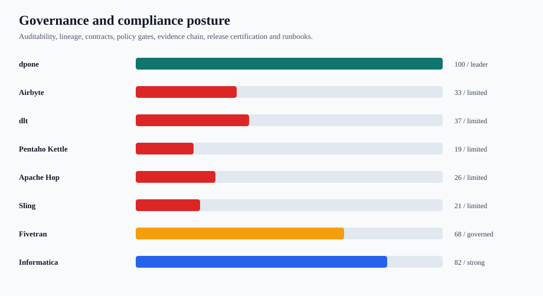

| Tool | Governance score | Band | Evidence mode | Strong controls | Managed controls | Comparator note |
|---|---:|---|---|---:|---:|---|
| dpone | 100 | leader | repo-evidence | 10 | 0 | repo-evidence governance posture |
| Airbyte | 33 | limited | public-doc | 0 | 0 | OSS/public-doc governance posture |
| dlt | 37 | limited | public-doc | 0 | 0 | OSS/public-doc governance posture |
| Pentaho Kettle | 19 | limited | public-doc | 0 | 0 | legacy OSS/public-doc governance posture |
| Apache Hop | 26 | limited | public-doc | 0 | 0 | OSS/public-doc governance posture |
| Sling | 21 | limited | public-doc | 0 | 0 | OSS/public-doc governance posture |
| Fivetran | 68 | governed | public-doc | 0 | 7 | managed governance posture; source controls are closed-core |
| Informatica | 82 | strong | public-doc | 0 | 9 | managed governance posture; source controls are closed-core |

### Governance control matrix

| Control | dpone | Airbyte | dlt | Pentaho Kettle | Apache Hop | Sling | Fivetran | Informatica |
|---|---|---|---|---|---|---|---|---|
| Auditability | `strong` | `documented` | `partial` | `partial` | `partial` | `partial` | `managed` | `managed` |
| Lineage / catalog | `strong` | `partial` | `partial` | `partial` | `documented` | `not detected` | `managed` | `managed` |
| Data contracts | `strong` | `partial` | `documented` | `not detected` | `not detected` | `partial` | `managed` | `managed` |
| Schema governance | `strong` | `documented` | `documented` | `partial` | `partial` | `partial` | `managed` | `managed` |
| Policy gates | `strong` | `partial` | `partial` | `not detected` | `partial` | `not detected` | `managed` | `managed` |
| Evidence chain | `strong` | `not detected` | `not detected` | `not detected` | `not detected` | `not detected` | `opaque` | `managed` |
| Access and secrets | `strong` | `not detected` | `not detected` | `not detected` | `not detected` | `partial` | `managed` | `managed` |
| Release certification | `strong` | `not detected` | `not detected` | `not detected` | `not detected` | `not detected` | `opaque` | `managed` |
| Compliance runbooks | `strong` | `documented` | `documented` | `documented` | `documented` | `documented` | `documented` | `documented` |
| Data quality reconciliation | `strong` | `partial` | `documented` | `partial` | `partial` | `partial` | `managed` | `managed` |

### Governance evidence

- **dpone:** access_secrets `strong` (`docs/supply-chain.md`); auditability `strong` (`docs/unified-run-evidence.md`); compliance_runbooks `strong` (`docs/live-certification.md`); data_contracts `strong` (`docs/schema-contracts.md`).
- **Airbyte:** auditability `documented` ([source](https://docs.airbyte.com/platform/using-airbyte/schema-change-management)); compliance_runbooks `documented` ([source](https://docs.airbyte.com/platform/using-airbyte/schema-change-management)); schema_governance `documented` ([source](https://docs.airbyte.com/platform/using-airbyte/schema-change-management)); data_contracts `partial` ([source](https://docs.airbyte.com/platform/using-airbyte/schema-change-management)).
- **dlt:** compliance_runbooks `documented` ([source](https://dlthub.com/docs/general-usage/schema-contracts)); data_contracts `documented` ([source](https://dlthub.com/docs/general-usage/schema-contracts)); data_quality_reconciliation `documented` ([source](https://dlthub.com/docs/general-usage/schema-contracts)); schema_governance `documented` ([source](https://dlthub.com/docs/general-usage/schema-contracts)).
- **Pentaho Kettle:** compliance_runbooks `documented` ([source](https://docs.pentaho.com/pdia-data-integration/)); auditability `partial` ([source](https://docs.pentaho.com/pdia-data-integration/)); data_quality_reconciliation `partial` ([source](https://docs.pentaho.com/pdia-data-integration/)); lineage_catalog `partial` ([source](https://docs.pentaho.com/pdia-data-integration/)).
- **Apache Hop:** compliance_runbooks `documented` ([source](https://hop.apache.org/manual/latest/metadata-types/index.html)); lineage_catalog `documented` ([source](https://hop.apache.org/manual/latest/metadata-types/index.html)); auditability `partial` ([source](https://hop.apache.org/manual/latest/metadata-types/index.html)); data_quality_reconciliation `partial` ([source](https://hop.apache.org/manual/latest/metadata-types/index.html)).
- **Sling:** compliance_runbooks `documented` ([source](https://github.com/slingdata-io/sling-cli)); access_secrets `partial` ([source](https://github.com/slingdata-io/sling-cli)); auditability `partial` ([source](https://github.com/slingdata-io/sling-cli)); data_contracts `partial` ([source](https://github.com/slingdata-io/sling-cli)).
- **Fivetran:** access_secrets `managed` ([source](https://fivetran.com/docs/core-concepts/features)); auditability `managed` ([source](https://fivetran.com/docs/core-concepts/features)); data_contracts `managed` ([source](https://fivetran.com/docs/core-concepts/features)); data_quality_reconciliation `managed` ([source](https://fivetran.com/docs/core-concepts/features)).
- **Informatica:** access_secrets `managed` ([source](https://www.informatica.com/products/data-governance/cloud-data-governance-and-catalog.html)); auditability `managed` ([source](https://www.informatica.com/products/data-governance/cloud-data-governance-and-catalog.html)); data_contracts `managed` ([source](https://www.informatica.com/products/data-governance/cloud-data-governance-and-catalog.html)); data_quality_reconciliation `managed` ([source](https://www.informatica.com/products/data-governance/cloud-data-governance-and-catalog.html)).

Managed governance posture note: Fivetran and Informatica publish governance controls, audit material and enterprise operating models, but their closed-core implementation details cannot be code-scored with the same static benchmark.

## Security & Supply Chain

This layer checks repository-local security and supply-chain controls that matter for industrial adoption: vulnerability scanning, dependency response, reproducible builds, SBOM inventory, security policy and release provenance. Closed-core vendors are listed as posture notes, not code-scored source benchmarks.

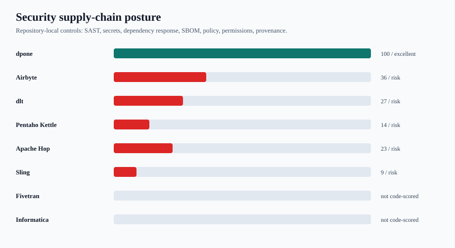

| Tool | Security score | Band | Present controls | Missing controls | Comparator note |
|---|---:|---|---:|---:|---|
| dpone | 100 | excellent | 10 | 0 | local-framework |
| Airbyte | 36 | risk | 4 | 6 | oss-core |
| dlt | 27 | risk | 3 | 7 | oss-core |
| Pentaho Kettle | 14 | risk | 1 | 8 | oss-core |
| Apache Hop | 23 | risk | 2 | 7 | oss-core |
| Sling | 9 | risk | 1 | 9 | oss-core |
| Fivetran | n/a | not code-scored | n/a | n/a | closed-core posture note; source controls cannot be scanned |
| Informatica | n/a | not code-scored | n/a | n/a | closed-core posture note; source controls cannot be scanned |

### Security control matrix

| Control | dpone | Airbyte | dlt | Pentaho Kettle | Apache Hop | Sling | Fivetran | Informatica |
|---|---|---|---|---|---|---|---|---|
| License declared | `present` | `present` | `present` | `present` | `present` | `present` | `n/a` | `n/a` |
| Secret scanning | `present` | `not detected` | `not detected` | `not detected` | `not detected` | `not detected` | `n/a` | `n/a` |
| CodeQL / SAST | `present` | `not detected` | `not detected` | `not detected` | `not detected` | `not detected` | `n/a` | `n/a` |
| OSSF Scorecard | `present` | `not detected` | `not detected` | `not detected` | `not detected` | `not detected` | `n/a` | `n/a` |
| Dependency update automation | `present` | `present` | `not detected` | `not detected` | `not detected` | `not detected` | `n/a` | `n/a` |
| Lockfile reproducibility | `present` | `present` | `present` | `partial` | `partial` | `not detected` | `n/a` | `n/a` |
| SBOM inventory | `present` | `not detected` | `not detected` | `not detected` | `not detected` | `not detected` | `n/a` | `n/a` |
| Security policy | `present` | `not detected` | `not detected` | `not detected` | `not detected` | `not detected` | `n/a` | `n/a` |
| Least-privilege CI permissions | `present` | `present` | `present` | `not detected` | `present` | `not detected` | `n/a` | `n/a` |
| Release provenance | `present` | `not detected` | `not detected` | `not detected` | `not detected` | `not detected` | `n/a` | `n/a` |

### Security evidence

- **dpone:** dependency_updates `present` (`.github/dependabot.yml`); least_privilege_permissions `present` (`.github/workflows/certification-release-summary.yml`); license_declared `present` (`LICENSE`); lockfile_reproducibility `present` (`uv.lock`).
- **Airbyte:** dependency_updates `present` (`.github/dependabot.yml`); least_privilege_permissions `present` (`.github/workflows/agent-sdk-docs-generate.yml`); license_declared `present` (`LICENSE`); lockfile_reproducibility `present` (`poetry.lock`).
- **dlt:** least_privilege_permissions `present` (`.github/workflows/fork_tests_with_secrets.yml`); license_declared `present` (`pyproject.toml`); lockfile_reproducibility `present` (`uv.lock`); dependency_updates `not_detected` (no source).
- **Pentaho Kettle:** license_declared `present` (`pom.xml`); lockfile_reproducibility `partial` (`pom.xml`); dependency_updates `not_detected` (no source); least_privilege_permissions `not_detected` (no source).
- **Apache Hop:** least_privilege_permissions `present` (`.github/workflows/issue_tagger.yml`); license_declared `present` (`LICENSE`); lockfile_reproducibility `partial` (`pom.xml`); dependency_updates `not_detected` (no source).
- **Sling:** license_declared `present` (`LICENSE`); dependency_updates `not_detected` (no source); least_privilege_permissions `not_detected` (no source); lockfile_reproducibility `not_detected` (no source).
- **Fivetran:** dependency_updates `unavailable` ([source](https://fivetran.com/docs/security-and-privacy/security)); least_privilege_permissions `unavailable` ([source](https://fivetran.com/docs/security-and-privacy/security)); license_declared `unavailable` ([source](https://fivetran.com/docs/security-and-privacy/security)); lockfile_reproducibility `unavailable` ([source](https://fivetran.com/docs/security-and-privacy/security)).
- **Informatica:** dependency_updates `unavailable` ([source](https://www.informatica.com/trust-center.html)); least_privilege_permissions `unavailable` ([source](https://www.informatica.com/trust-center.html)); license_declared `unavailable` ([source](https://www.informatica.com/trust-center.html)); lockfile_reproducibility `unavailable` ([source](https://www.informatica.com/trust-center.html)).

Closed-core posture note: Fivetran and Informatica publish security/trust material, but their managed platform source supply-chain controls cannot be measured with the same static repository benchmark.

Security supply-chain evidence is stored in raw JSON under `security_supply_chain.entries[]`.

## Operational Reliability

This layer compares runtime trust signals: retry/resume, checkpoint safety, zero duplicate retry behavior, reconciliation, CDC recovery, observability, SLOs, schema drift and release evidence. dpone uses measured JSON proof where available; external tools use public documentation posture.

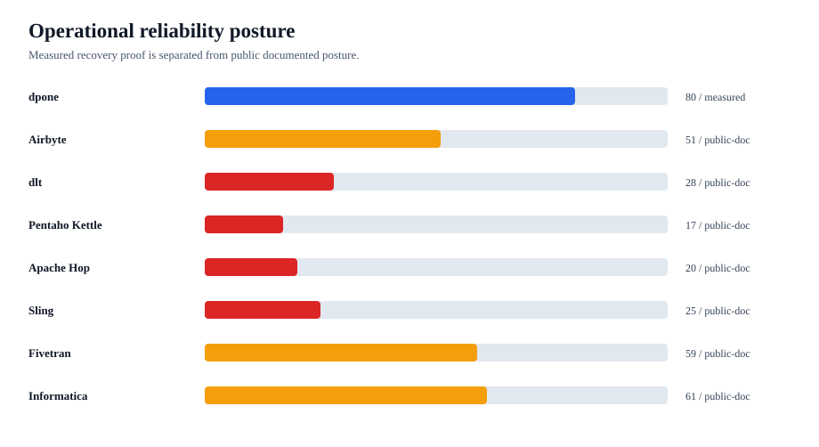

| Tool | Reliability score | Band | Evidence mode | Measured controls | Documented controls | Comparator note |
|---|---:|---|---|---:|---:|---|
| dpone | 80 | strong | measured | 4 | 6 | measured local evidence |
| Airbyte | 51 | watch | public-doc | 0 | 5 | public-doc posture and OSS source |
| dlt | 28 | limited | public-doc | 0 | 3 | public-doc posture and OSS source |
| Pentaho Kettle | 17 | limited | public-doc | 0 | 0 | public-doc posture and OSS source |
| Apache Hop | 20 | limited | public-doc | 0 | 0 | public-doc posture and OSS source |
| Sling | 25 | limited | public-doc | 0 | 0 | public-doc posture and OSS source |
| Fivetran | 59 | watch | public-doc | 0 | 8 | managed closed-core public-doc posture |
| Informatica | 61 | watch | public-doc | 0 | 9 | managed closed-core public-doc posture |

### Reliability control matrix

| Control | dpone | Airbyte | dlt | Pentaho Kettle | Apache Hop | Sling | Fivetran | Informatica |
|---|---|---|---|---|---|---|---|---|
| Retry / resume | `documented` | `documented` | `documented` | `partial` | `partial` | `partial` | `documented` | `documented` |
| Checkpoint safety | `documented` | `documented` | `documented` | `partial` | `partial` | `partial` | `documented` | `documented` |
| Idempotency | `documented` | `partial` | `partial` | `not detected` | `not detected` | `partial` | `documented` | `documented` |
| Fault injection | `documented` | `partial` | `not detected` | `not detected` | `not detected` | `not detected` | `not detected` | `not detected` |
| Data reconciliation | `measured` | `partial` | `not detected` | `partial` | `partial` | `partial` | `documented` | `documented` |
| CDC recovery | `measured` | `documented` | `not detected` | `not detected` | `not detected` | `partial` | `documented` | `documented` |
| Observability evidence | `documented` | `documented` | `partial` | `partial` | `partial` | `partial` | `documented` | `documented` |
| Performance SLO | `measured` | `partial` | `not detected` | `not detected` | `not detected` | `not detected` | `documented` | `documented` |
| Schema drift | `documented` | `documented` | `documented` | `partial` | `partial` | `partial` | `documented` | `documented` |
| Release evidence | `measured` | `partial` | `not detected` | `not detected` | `partial` | `not detected` | `partial` | `documented` |

### Reliability evidence

- **dpone:** cdc_recovery `measured` (`test_artifacts/live_certification_local_run/live-state-reconciliation/live_state_reconciliation.json`); data_reconciliation `measured` (`test_artifacts/live_certification_local_run/live-state-reconciliation/live_state_reconciliation.json`); performance_slo `measured` (`test_artifacts/live_certification_local_run/benchmark-slo/benchmark_slo_gate.json`); release_evidence `measured` (`test_artifacts/live_certification_local_run/release-evidence/release_evidence_pack.json`).
- **Airbyte:** cdc_recovery `documented` ([source](https://docs.airbyte.com/platform/understanding-airbyte/cdc)); checkpoint_safety `documented` ([source](https://docs.airbyte.com/platform/understanding-airbyte/cdc)); observability_evidence `documented` ([source](https://docs.airbyte.com/platform/understanding-airbyte/cdc)); retry_resume `documented` ([source](https://docs.airbyte.com/platform/understanding-airbyte/cdc)).
- **dlt:** checkpoint_safety `documented` ([source](https://dlthub.com/docs/general-usage/schema-evolution)); retry_resume `documented` ([source](https://dlthub.com/docs/general-usage/schema-evolution)); schema_drift `documented` ([source](https://dlthub.com/docs/general-usage/schema-evolution)); idempotency `partial` ([source](https://dlthub.com/docs/general-usage/schema-evolution)).
- **Pentaho Kettle:** checkpoint_safety `partial` ([source](https://docs.pentaho.com/pdia-data-integration/pipeline-designer/working-with-transformations)); data_reconciliation `partial` ([source](https://docs.pentaho.com/pdia-data-integration/pipeline-designer/working-with-transformations)); observability_evidence `partial` ([source](https://docs.pentaho.com/pdia-data-integration/pipeline-designer/working-with-transformations)); retry_resume `partial` ([source](https://docs.pentaho.com/pdia-data-integration/pipeline-designer/working-with-transformations)).
- **Apache Hop:** checkpoint_safety `partial` ([source](https://hop.apache.org/)); data_reconciliation `partial` ([source](https://hop.apache.org/)); observability_evidence `partial` ([source](https://hop.apache.org/)); release_evidence `partial` ([source](https://hop.apache.org/)).
- **Sling:** cdc_recovery `partial` ([source](https://github.com/slingdata-io/sling-cli)); checkpoint_safety `partial` ([source](https://github.com/slingdata-io/sling-cli)); data_reconciliation `partial` ([source](https://github.com/slingdata-io/sling-cli)); idempotency `partial` ([source](https://github.com/slingdata-io/sling-cli)).
- **Fivetran:** cdc_recovery `documented` ([source](https://fivetran.com/docs/core-concepts/features)); checkpoint_safety `documented` ([source](https://fivetran.com/docs/core-concepts/features)); data_reconciliation `documented` ([source](https://fivetran.com/docs/core-concepts/features)); idempotency `documented` ([source](https://fivetran.com/docs/core-concepts/features)).
- **Informatica:** cdc_recovery `documented` ([source](https://www.informatica.com/products/data-governance/cloud-data-governance-and-catalog.html)); checkpoint_safety `documented` ([source](https://www.informatica.com/products/data-governance/cloud-data-governance-and-catalog.html)); data_reconciliation `documented` ([source](https://www.informatica.com/products/data-governance/cloud-data-governance-and-catalog.html)); idempotency `documented` ([source](https://www.informatica.com/products/data-governance/cloud-data-governance-and-catalog.html)).

Reliability scoring is evidence-bounded: `measured` requires local machine-readable proof; `documented` is public or local documentation; `partial` is a weaker posture signal. The strongest dpone differentiator is measured zero duplicate retry and recovery evidence.

## TCO & Operability

This layer scores operational surface area rather than commercial pricing. It highlights deployment footprint, infrastructure prerequisites, configuration and secrets complexity, self-service runbooks, CI/CD, observability, upgrade posture, operator toil and vendor lock-in transparency.

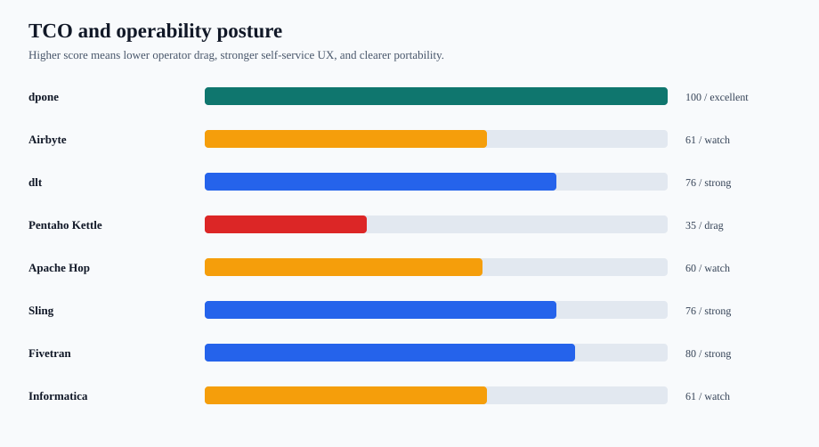

| Tool | Operability score | Band | Evidence mode | Strong controls | Managed controls | Drag controls | Comparator note |
|---|---:|---|---|---:|---:|---:|---|
| dpone | 100 | excellent | repo-evidence | 10 | 0 | 0 | repo-evidence posture |
| Airbyte | 61 | watch | public-doc | 2 | 0 | 3 | OSS/self-managed platform posture |
| dlt | 76 | strong | public-doc | 4 | 0 | 2 | Python library posture |
| Pentaho Kettle | 35 | drag | public-doc | 0 | 0 | 8 | legacy OSS platform posture |
| Apache Hop | 60 | watch | public-doc | 2 | 0 | 3 | OSS platform posture |
| Sling | 76 | strong | public-doc | 4 | 0 | 2 | CLI-first OSS posture |
| Fivetran | 80 | strong | public-doc | 1 | 8 | 1 | managed platform trade-off |
| Informatica | 61 | watch | public-doc | 1 | 1 | 3 | managed enterprise platform trade-off |

### Operability control matrix

| Control | dpone | Airbyte | dlt | Pentaho Kettle | Apache Hop | Sling | Fivetran | Informatica |
|---|---|---|---|---|---|---|---|---|
| Deployment footprint | `strong` | `partial` | `strong` | `partial` | `moderate` | `strong` | `managed` | `moderate` |
| Infrastructure prerequisites | `strong` | `partial` | `strong` | `partial` | `moderate` | `strong` | `managed` | `moderate` |
| Configuration surface | `strong` | `moderate` | `moderate` | `partial` | `moderate` | `moderate` | `managed` | `partial` |
| Secrets operations | `strong` | `moderate` | `partial` | `not detected` | `not detected` | `partial` | `managed` | `moderate` |
| Self-service docs | `strong` | `strong` | `strong` | `moderate` | `strong` | `strong` | `strong` | `strong` |
| CI/CD automation | `strong` | `moderate` | `moderate` | `not detected` | `not detected` | `moderate` | `managed` | `moderate` |
| Observability operations | `strong` | `moderate` | `partial` | `partial` | `moderate` | `partial` | `managed` | `managed` |
| Upgrade / rollback posture | `strong` | `moderate` | `moderate` | `partial` | `partial` | `moderate` | `managed` | `moderate` |
| Operator toil | `strong` | `partial` | `moderate` | `partial` | `moderate` | `moderate` | `managed` | `partial` |
| Vendor lock-in transparency | `strong` | `strong` | `strong` | `moderate` | `strong` | `strong` | `opaque` | `opaque` |

### Operability evidence

- **dpone:** ci_cd_automation `strong` (`.github/workflows/ci.yml`); configuration_surface `strong` (`docs/ops-cli.md`); deployment_footprint `strong` (`src/dpone/ops/deploy_profiles.py`); infra_prerequisites `strong` (`pyproject.toml`).
- **Airbyte:** lock_in_transparency `strong` ([source](https://docs.airbyte.com/platform/deploying-airbyte)); self_service_docs `strong` ([source](https://docs.airbyte.com/platform/deploying-airbyte)); ci_cd_automation `moderate` ([source](https://docs.airbyte.com/platform/deploying-airbyte)); configuration_surface `moderate` ([source](https://docs.airbyte.com/platform/deploying-airbyte)).
- **dlt:** deployment_footprint `strong` ([source](https://dlthub.com/docs/intro)); infra_prerequisites `strong` ([source](https://dlthub.com/docs/intro)); lock_in_transparency `strong` ([source](https://dlthub.com/docs/intro)); self_service_docs `strong` ([source](https://dlthub.com/docs/intro)).
- **Pentaho Kettle:** lock_in_transparency `moderate` ([source](https://docs.pentaho.com/install)); self_service_docs `moderate` ([source](https://docs.pentaho.com/install)); configuration_surface `partial` ([source](https://docs.pentaho.com/install)); deployment_footprint `partial` ([source](https://docs.pentaho.com/install)).
- **Apache Hop:** lock_in_transparency `strong` ([source](https://hop.apache.org/manual/latest/installation-configuration.html)); self_service_docs `strong` ([source](https://hop.apache.org/manual/latest/installation-configuration.html)); configuration_surface `moderate` ([source](https://hop.apache.org/manual/latest/installation-configuration.html)); deployment_footprint `moderate` ([source](https://hop.apache.org/manual/latest/installation-configuration.html)).
- **Sling:** deployment_footprint `strong` ([source](https://github.com/slingdata-io/sling-cli)); infra_prerequisites `strong` ([source](https://github.com/slingdata-io/sling-cli)); lock_in_transparency `strong` ([source](https://github.com/slingdata-io/sling-cli)); self_service_docs `strong` ([source](https://github.com/slingdata-io/sling-cli)).
- **Fivetran:** self_service_docs `strong` ([source](https://fivetran.com/docs/getting-started)); ci_cd_automation `managed` ([source](https://fivetran.com/docs/getting-started)); configuration_surface `managed` ([source](https://fivetran.com/docs/getting-started)); deployment_footprint `managed` ([source](https://fivetran.com/docs/getting-started)).
- **Informatica:** self_service_docs `strong` ([source](https://www.informatica.com/products/cloud-data-integration.html)); observability_ops `managed` ([source](https://www.informatica.com/products/cloud-data-integration.html)); ci_cd_automation `moderate` ([source](https://www.informatica.com/products/cloud-data-integration.html)); deployment_footprint `moderate` ([source](https://www.informatica.com/products/cloud-data-integration.html)).

Managed SaaS can reduce operator toil, but it also moves cost visibility, upgrade control and vendor lock-in into the contract. The benchmark therefore treats Fivetran and Informatica as managed platform trade-off comparators, not source-code peers.

## Industrial Maintainability Index

The Industrial Maintainability Index is a 0-100 executive KPI layered over the raw evidence. It combines SOLID/Clean OOP score, largest production module size, import coupling, cohesion/clustering, static test footprint, and data freshness. Raw metric tables remain below for auditability.

| Project | Index | Band | Delta | Quality | Module size | Coupling | Cohesion | Test footprint | Freshness |
|---|---:|---|---:|---:|---:|---:|---:|---:|---:|
| dpone | 100 | excellent | 0 | 35.0 | 20.0 | 15.0 | 15.0 | 10.0 | 5.0 |
| Airbyte | 73 | strong | 0 | 28.7 | 0.0 | 15.0 | 15.0 | 9.4 | 5.0 |
| dlt | 66 | watch | 0 | 28.7 | 0.0 | 15.0 | 7.6 | 10.0 | 5.0 |
| Pentaho Kettle | 36 | risk | 0 | 8.8 | 0.0 | 9.1 | 4.4 | 8.4 | 5.0 |
| Apache Hop | 42 | risk | 0 | 16.4 | 0.0 | 10.7 | 4.1 | 6.0 | 5.0 |
| Sling | 46 | risk | 0 | 20.3 | 0.0 | 15.0 | 6.0 | 0.1 | 5.0 |

## Release Delta

Release delta compares current merged evidence with the selected baseline. Stale comparisons are excluded from improvement claims and rendered as not comparable.

| Metric | Previous | Current | Delta | Classification |
|---|---:|---:|---:|---|
| industrial maintainability | n/a | 100 | 0 | unchanged |
| solid | n/a | 5 | 0 | unchanged |
| clean oop | n/a | 5 | 0 | unchanged |
| cohesion | n/a | 0.633 | 0 | unchanged |
| evidence confidence | n/a | 0 | 0 | unchanged |
| max module sloc | n/a | 397 | 0 | unchanged |
| max module loc | n/a | 449 | 0 | unchanged |
| max fan out | n/a | 26 | 0 | unchanged |
| avg clustering | n/a | 0.157 | 0 | unchanged |
| architecture risk | n/a | 16 | 0 | unchanged |

Blocking release regressions: `0`.


## Quality Gates

Quality gates turn the benchmark into a governance control for dpone. They are evaluated from the merged evidence payload after stale preservation, so CI blocks regressions without erasing previous comparator data.

Current gate status: **passed**.

| Gate | Actual | Target | Status | Severity |
|---|---:|---:|---|---|
| Project evidence available | available | == available | passed | blocker |
| Industrial Maintainability Index | 100 | >= 85 | passed | blocker |
| Architecture risk score | 16 | <= 24 | passed | blocker |
| Coverage confidence score | 100 | >= 75 | passed | blocker |
| Largest production module LOC | 449 | <= 600 | passed | blocker |
| Largest production module SLOC | 397 | <= 400 | passed | blocker |
| Maximum fan-out | 26 | <= 30 | passed | blocker |
| Cohesion ratio | 0.633 | >= 0.55 | passed | blocker |
| Metric freshness | fresh | == fresh | passed | blocker |
| Average clustering | 0.157 | <= 0.18 | passed | blocker |
| Release context resolved | resolved | == resolved | passed | blocker |
| Quality budget hard failures | passed | == passed | passed | blocker |
| Executable certification | passed | == passed | passed | blocker |

The manual CI workflow also writes a **PR benchmark summary** at `test_artifacts/oss-code-quality-benchmark/pr-comment.md`, so reviewers can see gate status, score movement, freshness, and dpone hotspots without opening the full report.


## Explainable scoring

This section makes the executive score auditable. Each Industrial Maintainability Index is the sum of bounded component scores; the raw component inputs remain in the JSON evidence.

### dpone scoring

Formula: `quality + module_size + coupling + cohesion + test_footprint + freshness` -> **100** (excellent).

| Component | Score | Max | Actual | Reason |
|---|---:|---:|---|---|
| SOLID and Clean OOP | 35.0 | 35 | SOLID 5.0/5, Clean OOP 5.0/5 | largest module stays within the 600 LOC target (449); average fan-out is controlled (2.08) |
| Module size | 20.0 | 20 | 449 LOC max module | Rewards production modules below the 600 LOC governance target. |
| Coupling | 15.0 | 15 | avg Ce 2.08, P90 Ce 5 | Rewards low average and P90 outgoing dependency pressure. |
| Cohesion | 15.0 | 15 | cohesion 0.633, clustering 0.157 | Rewards dependencies that stay inside architectural slices and avoid dense clustering. |
| Test footprint | 10.0 | 10 | 51.0% | Rewards a meaningful static test footprint without treating it as runtime coverage. |
| Metric freshness | 5.0 | 5 | fresh | Rewards metric groups that refreshed successfully in the latest benchmark run. |

Rubric evidence: SOLID `5.0/5`, Clean OOP `5.0/5`.

### Airbyte scoring

Formula: `quality + module_size + coupling + cohesion + test_footprint + freshness` -> **73** (strong).

| Component | Score | Max | Actual | Reason |
|---|---:|---:|---|---|
| SOLID and Clean OOP | 28.7 | 35 | SOLID 4.2/5, Clean OOP 4.0/5 | largest module is very large (41035 LOC); average fan-out is controlled (1.82) |
| Module size | 0.0 | 20 | 41035 LOC max module | Rewards production modules below the 600 LOC governance target. |
| Coupling | 15.0 | 15 | avg Ce 1.82, P90 Ce 6 | Rewards low average and P90 outgoing dependency pressure. |
| Cohesion | 15.0 | 15 | cohesion 0.604, clustering 0.125 | Rewards dependencies that stay inside architectural slices and avoid dense clustering. |
| Test footprint | 9.4 | 10 | 136.7% | Rewards a meaningful static test footprint without treating it as runtime coverage. |
| Metric freshness | 5.0 | 5 | fresh | Rewards metric groups that refreshed successfully in the latest benchmark run. |

Rubric evidence: SOLID `4.2/5`, Clean OOP `4.0/5`.

### dlt scoring

Formula: `quality + module_size + coupling + cohesion + test_footprint + freshness` -> **66** (watch).

| Component | Score | Max | Actual | Reason |
|---|---:|---:|---|---|
| SOLID and Clean OOP | 28.7 | 35 | SOLID 4.2/5, Clean OOP 4.0/5 | largest module is very large (2013 LOC); average fan-out is controlled (4.69) |
| Module size | 0.0 | 20 | 2013 LOC max module | Rewards production modules below the 600 LOC governance target. |
| Coupling | 15.0 | 15 | avg Ce 4.69, P90 Ce 12 | Rewards low average and P90 outgoing dependency pressure. |
| Cohesion | 7.6 | 15 | cohesion 0.377, clustering 0.226 | Rewards dependencies that stay inside architectural slices and avoid dense clustering. |
| Test footprint | 10.0 | 10 | 116.4% | Rewards a meaningful static test footprint without treating it as runtime coverage. |
| Metric freshness | 5.0 | 5 | fresh | Rewards metric groups that refreshed successfully in the latest benchmark run. |

Rubric evidence: SOLID `4.2/5`, Clean OOP `4.0/5`.

### Pentaho Kettle scoring

Formula: `quality + module_size + coupling + cohesion + test_footprint + freshness` -> **36** (risk).

| Component | Score | Max | Actual | Reason |
|---|---:|---:|---|---|
| SOLID and Clean OOP | 8.8 | 35 | SOLID 1.4/5, Clean OOP 1.1/5 | largest module is very large (10532 LOC); P90 module size is high (655 LOC) |
| Module size | 0.0 | 20 | 10532 LOC max module | Rewards production modules below the 600 LOC governance target. |
| Coupling | 9.1 | 15 | avg Ce 8.18, P90 Ce 23 | Rewards low average and P90 outgoing dependency pressure. |
| Cohesion | 4.4 | 15 | cohesion 0.319, clustering 0.276 | Rewards dependencies that stay inside architectural slices and avoid dense clustering. |
| Test footprint | 8.4 | 10 | 29.3% | Rewards a meaningful static test footprint without treating it as runtime coverage. |
| Metric freshness | 5.0 | 5 | fresh | Rewards metric groups that refreshed successfully in the latest benchmark run. |

Rubric evidence: SOLID `1.4/5`, Clean OOP `1.1/5`.

### Apache Hop scoring

Formula: `quality + module_size + coupling + cohesion + test_footprint + freshness` -> **42** (risk).

| Component | Score | Max | Actual | Reason |
|---|---:|---:|---|---|
| SOLID and Clean OOP | 16.4 | 35 | SOLID 2.1/5, Clean OOP 2.6/5 | largest module is very large (5998 LOC); P90 fan-out is high (19) |
| Module size | 0.0 | 20 | 5998 LOC max module | Rewards production modules below the 600 LOC governance target. |
| Coupling | 10.7 | 15 | avg Ce 7.98, P90 Ce 19 | Rewards low average and P90 outgoing dependency pressure. |
| Cohesion | 4.1 | 15 | cohesion 0.188, clustering 0.235 | Rewards dependencies that stay inside architectural slices and avoid dense clustering. |
| Test footprint | 6.0 | 10 | 20.8% | Rewards a meaningful static test footprint without treating it as runtime coverage. |
| Metric freshness | 5.0 | 5 | fresh | Rewards metric groups that refreshed successfully in the latest benchmark run. |

Rubric evidence: SOLID `2.1/5`, Clean OOP `2.6/5`.

### Sling scoring

Formula: `quality + module_size + coupling + cohesion + test_footprint + freshness` -> **46** (risk).

| Component | Score | Max | Actual | Reason |
|---|---:|---:|---|---|
| SOLID and Clean OOP | 20.3 | 35 | SOLID 3.1/5, Clean OOP 2.7/5 | largest module is very large (4198 LOC); P90 module size is high (1554 LOC) |
| Module size | 0.0 | 20 | 4198 LOC max module | Rewards production modules below the 600 LOC governance target. |
| Coupling | 15.0 | 15 | avg Ce 0.00, P90 Ce 0 | Rewards low average and P90 outgoing dependency pressure. |
| Cohesion | 6.0 | 15 | cohesion 0.000, clustering 0.000 | Rewards dependencies that stay inside architectural slices and avoid dense clustering. |
| Test footprint | 0.1 | 10 | 0.3% | Rewards a meaningful static test footprint without treating it as runtime coverage. |
| Metric freshness | 5.0 | 5 | fresh | Rewards metric groups that refreshed successfully in the latest benchmark run. |

Rubric evidence: SOLID `3.1/5`, Clean OOP `2.7/5`.


## Regression summary

The regression summary compares dpone against the previous evidence file used for the refresh. It is optimized for CI review: lower module size, lower fan-out, lower cross-slice ratio, higher test footprint and fresh metrics are treated as better.

Current status: **unchanged**.

| Metric | Previous | Current | Delta | Direction | Status |
|---|---:|---:|---:|---|---|
| Industrial Maintainability Index | 100 | 100 | 0 | higher_is_better | unchanged |
| Largest production module LOC | 449 | 449 | 0 | lower_is_better | unchanged |
| P90 fan-out | 5 | 5 | 0 | lower_is_better | unchanged |
| Cross-slice dependency ratio | 0.367 | 0.367 | 0 | lower_is_better | unchanged |
| Static test footprint | 0.51 | 0.51 | 0 | higher_is_better | unchanged |
| Metric freshness | fresh | fresh | 0 | fresh_is_better | unchanged |


## Candidate quality delta

This PR-oriented view compares the current dpone benchmark evidence with the selected baseline evidence. It keeps SOLID/Clean Code budgets explicit: no hidden god modules, no silent fan-out growth, and no unlabelled test-footprint erosion.

Current status: **passed**.

Baseline evidence: `2026-06-30T15:30:34+00:00@3f562b42ebc8db96a14361ce93353486faa23af4`.

| Budget | Actual | Target | Status |
|---|---:|---:|---|
| Largest production module LOC | 449 | <= 600 | passed |
| P90 fan-out | 5 | <= 12 | passed |
| Maximum fan-out | 26 | <= 30 | passed |
| Cohesion ratio | 0.633 | >= 0.55 | passed |
| Static test footprint | 0.51 | >= 0.49 | passed |

The watchlist includes changed modules plus unchanged production modules that already sit above the watch threshold.

| Module | Change | LOC delta | SLOC delta | Fan-out delta | Risk |
|---|---|---:|---:|---:|---|
| `src/dpone/commands/ops_parsers_artifacts.py` | unchanged | 0 | 0 | 0 | watch |
| `src/dpone/commands/schema_contract_cmd.py` | unchanged | 0 | 0 | 0 | watch |
| `src/dpone/commands/schema_migration_bundle_cmd.py` | unchanged | 0 | 0 | 0 | watch |
| `src/dpone/commands/schema_migration_registry_cmd.py` | unchanged | 0 | 0 | 0 | watch |
| `src/dpone/commands/schema_plan_cmd.py` | unchanged | 0 | 0 | 0 | watch |
| `src/dpone/integration_matrix_models.py` | unchanged | 0 | 0 | 0 | watch |
| `src/dpone/readiness/nested_certification.py` | unchanged | 0 | 0 | 0 | watch |
| `src/dpone/readiness/schema_migration_bundle_policy.py` | unchanged | 0 | 0 | 0 | watch |
| `src/dpone/runtime/cdc/retention_models.py` | unchanged | 0 | 0 | 0 | watch |
| `src/dpone/runtime/connectors/api/connector.py` | unchanged | 0 | 0 | 0 | watch |


## Remediation backlog

The backlog translates benchmark evidence into engineering work. It is generated from quality gates, architecture hotspots, stale metric groups and dpone watch thresholds so the benchmark remains actionable.

| Priority | Project | Category | Evidence | Recommendation |
|---|---|---|---|---|
| P2 | dpone | fan_out | 26 Ce; severity medium | Split responsibilities behind narrow contracts and keep public facades as compatibility shims. |
| P2 | dpone | fan_in | 69 Ca; severity medium | Split responsibilities behind narrow contracts and keep public facades as compatibility shims. |
| P2 | dpone | fan_out_watch | Ce 26 | Introduce narrower ports or policy objects so this module depends on contracts rather than concrete peers. |
| P3 | dpone | module_size_watch | 449 LOC | Move the next new responsibility into a focused collaborator before this module crosses 600 LOC. |


## Trend history

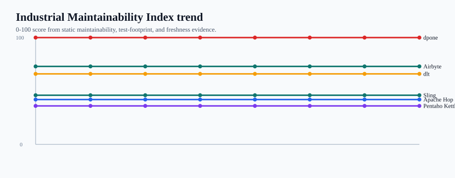

Trend data is stored in `docs/benchmarks/data/oss-code-quality-benchmark-history.json` ([open history JSON](data/oss-code-quality-benchmark-history.json)).

| Project | Index delta | Max Ce delta | P90 Ce delta | Largest LOC delta | Test footprint delta | Band movement |
|---|---:|---:|---:|---:|---:|---|
| Airbyte | 0 | 0 | 0 | 0 | 0 | strong -> strong |
| Apache Hop | 0 | 0 | 0 | 0 | 0 | risk -> risk |
| dlt | 0 | 0 | 0 | 0 | 0 | watch -> watch |
| dpone | 0 | 0 | 0 | 0 | 0 | excellent -> excellent |
| Pentaho Kettle | 0 | 0 | 0 | 0 | 0 | risk -> risk |
| Sling | 0 | 0 | 0 | 0 | 0 | risk -> risk |


## Architecture delta

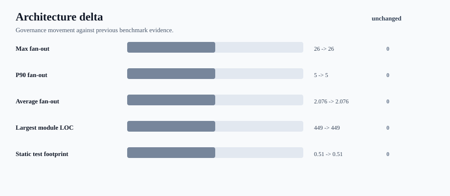

This view compares dpone architecture governance metrics against the previous benchmark evidence. It is optimized for PR review: lower fan-out and smaller hotspots are improvements, while test footprint is expected to move upward or stay stable.

| Metric | Previous | Current | Delta | Status |
|---|---:|---:|---:|---|
| Max fan-out | 26.000<br>`dpone.runtime.sources.strategies.mssql.mssql_queryout_artifacts` | 26.000<br>`dpone.runtime.sources.strategies.mssql.mssql_queryout_artifacts` | 0 | unchanged |
| P90 fan-out | 5.000 | 5.000 | 0 | unchanged |
| Average fan-out | 2.076 | 2.076 | 0 | unchanged |
| Largest module LOC | 449.000 | 449.000 | 0 | unchanged |
| Static test footprint | 0.510 | 0.510 | 0 | unchanged |


## Complexity & Boundary Discipline

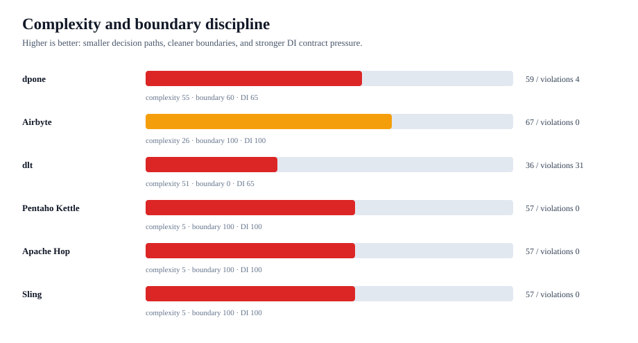

Enterprise change risk falls when decision paths stay small, boundaries stay explicit, and runtime code depends on thin contracts instead of concrete implementations. This section turns those Clean Code, SOLID, DRY, KISS and DI signals into reviewable benchmark evidence.

| Project | Overall | Status | Complexity | Boundary | DI | Max complexity | P90 complexity | Violations | Risks |
|---|---:|---|---:|---:|---:|---:|---:|---:|---:|
| Airbyte | 67 | watch | 26 | 100 | 100 | 154 | 14 | 0 | 8 |
| Apache Hop | 57 | risk | 5 | 100 | 100 | 1,135 | 55 | 0 | 8 |
| dlt | 36 | risk | 51 | 0 | 65 | 143 | 9 | 31 | 8 |
| dpone | 59 | risk | 55 | 60 | 65 | 77 | 8 | 4 | 8 |
| Pentaho Kettle | 57 | risk | 5 | 100 | 100 | 1,508 | 63 | 0 | 8 |
| Sling | 57 | risk | 5 | 100 | 100 | 858 | 270 | 0 | 8 |

### Complexity hotspots

| Project | Module | Unit | Complexity |
|---|---|---|---:|
| Airbyte | `airbyte-integrations/connectors/source-mssql/src/main/kotlin/io/airbyte/integrations/source/mssql/MsSqlServerDebeziumOperations.kt` | `module` | 154 |
| Airbyte | `airbyte-integrations/connectors/source-postgres/src/main/kotlin/io/airbyte/integrations/source/postgres/cdc/PostgresCustomConverter.kt` | `module` | 143 |
| Airbyte | `airbyte-integrations/connectors/source-mysql/src/main/kotlin/io/airbyte/integrations/source/mysql/MySqlSourceJdbcPartitionFactory.kt` | `module` | 136 |
| Airbyte | `airbyte-cdk/bulk/toolkits/legacy-task-loader/src/main/kotlin/io/airbyte/cdk/load/message/DestinationMessage.kt` | `module` | 123 |
| Airbyte | `airbyte-integrations/connectors/source-mssql/src/main/kotlin/io/airbyte/integrations/source/mssql/MsSqlServerJdbcPartition.kt` | `module` | 123 |
| Apache Hop | `core/src/main/java/org/apache/hop/core/row/value/ValueMetaBase.java` | `module` | 1,135 |
| Apache Hop | `ui/src/main/java/org/apache/hop/ui/hopgui/file/pipeline/HopGuiPipelineGraph.java` | `module` | 814 |
| Apache Hop | `core/src/main/java/org/apache/hop/core/database/Database.java` | `module` | 789 |
| Apache Hop | `ui/src/main/java/org/apache/hop/ui/hopgui/file/workflow/HopGuiWorkflowGraph.java` | `module` | 643 |
| Apache Hop | `ui/src/main/java/org/apache/hop/ui/hopgui/perspective/explorer/ExplorerPerspective.java` | `module` | 615 |
| dlt | `docs/website/plugins/llms-txt.js` | `module` | 143 |
| dlt | `docs/website/scripts/verify-llms-txt.js` | `module` | 116 |
| dlt | `dlt/_workspace/cli/_pipeline_command.py` | `pipeline_command` | 80 |
| dlt | `dlt/_workspace/cli/_init_command.py` | `init_pipeline_at_destination` | 57 |
| dlt | `dlt/destinations/impl/databricks/databricks.py` | `_get_table_update_sql` | 47 |
| dpone | `src/dpone/commands/dag/list_edges_cmd.py` | `cmd_dag_list_edges` | 77 |
| dpone | `src/dpone/cli_render/manifest/explain.py` | `render_manifest_explain_text` | 58 |
| dpone | `src/dpone/dag/load_config_builder.py` | `build` | 56 |
| dpone | `src/dpone/manifest/validation_rules.py` | `_validate_process` | 53 |
| dpone | `src/dpone/runtime/etl_logging/clickhouse_validation.py` | `validate_clickhouse_rows` | 46 |
| Pentaho Kettle | `ui/src/main/java/org/pentaho/di/ui/spoon/Spoon.java` | `module` | 1,508 |
| Pentaho Kettle | `core/src/main/java/org/pentaho/di/core/row/value/ValueMetaBase.java` | `module` | 1,132 |
| Pentaho Kettle | `engine/src/main/java/org/pentaho/di/trans/TransMeta.java` | `module` | 1,031 |
| Pentaho Kettle | `core/src/main/java/org/pentaho/di/core/database/Database.java` | `module` | 946 |
| Pentaho Kettle | `engine/src/main/java/org/pentaho/di/trans/Trans.java` | `module` | 876 |
| Sling | `core/dbio/database/database.go` | `module` | 858 |
| Sling | `core/dbio/iop/datatype.go` | `module` | 615 |
| Sling | `core/dbio/iop/datastream.go` | `module` | 593 |
| Sling | `core/sling/config.go` | `module` | 559 |
| Sling | `core/sling/replication.go` | `module` | 518 |

### Boundary violations

| Project | Severity | Kind | Module | Message |
|---|---|---|---|---|
| dlt | warning | `direct_implementation_import` | `dlt/destinations/_adbc_jobs.py` | Concrete implementation import bypasses a thin port or factory contract. |
| dlt | warning | `direct_implementation_import` | `dlt/destinations/impl/athena/athena.py` | Concrete implementation import bypasses a thin port or factory contract. |
| dlt | warning | `direct_implementation_import` | `dlt/destinations/impl/athena/athena.py` | Concrete implementation import bypasses a thin port or factory contract. |
| dlt | warning | `direct_implementation_import` | `dlt/destinations/impl/bigquery/bigquery.py` | Concrete implementation import bypasses a thin port or factory contract. |
| dlt | warning | `direct_implementation_import` | `dlt/destinations/impl/bigquery/bigquery.py` | Concrete implementation import bypasses a thin port or factory contract. |
| dpone | warning | `direct_implementation_import` | `src/dpone/dag/dag_report.py` | Concrete implementation import bypasses a thin port or factory contract. |
| dpone | warning | `direct_implementation_import` | `src/dpone/manifest/batch_loader.py` | Concrete implementation import bypasses a thin port or factory contract. |
| dpone | warning | `direct_implementation_import` | `src/dpone/manifest/explain.py` | Concrete implementation import bypasses a thin port or factory contract. |
| dpone | warning | `direct_implementation_import` | `src/dpone/manifest/explain_trace.py` | Concrete implementation import bypasses a thin port or factory contract. |

### Maintainability risk register

| Priority | Project | Module | Reason | Recommended action |
|---|---|---|---|---|
| P1 | airbyte | `airbyte-integrations/connectors/source-mssql/src/main/kotlin/io/airbyte/integrations/source/mssql/MsSqlServerDebeziumOperations.kt` | module complexity is 154. | Split decision paths behind a smaller service or strategy contract. |
| P1 | airbyte | `airbyte-integrations/connectors/source-postgres/src/main/kotlin/io/airbyte/integrations/source/postgres/cdc/PostgresCustomConverter.kt` | module complexity is 143. | Split decision paths behind a smaller service or strategy contract. |
| P1 | airbyte | `airbyte-integrations/connectors/source-mysql/src/main/kotlin/io/airbyte/integrations/source/mysql/MySqlSourceJdbcPartitionFactory.kt` | module complexity is 136. | Split decision paths behind a smaller service or strategy contract. |
| P1 | airbyte | `airbyte-cdk/bulk/toolkits/legacy-task-loader/src/main/kotlin/io/airbyte/cdk/load/message/DestinationMessage.kt` | module complexity is 123. | Split decision paths behind a smaller service or strategy contract. |
| P1 | airbyte | `airbyte-integrations/connectors/source-mssql/src/main/kotlin/io/airbyte/integrations/source/mssql/MsSqlServerJdbcPartition.kt` | module complexity is 123. | Split decision paths behind a smaller service or strategy contract. |
| P1 | airbyte | `airbyte-cdk/bulk/toolkits/extract-cdc/src/main/kotlin/io/airbyte/cdk/read/cdc/CdcPartitionReader.kt` | module complexity is 116. | Split decision paths behind a smaller service or strategy contract. |
| P1 | airbyte | `airbyte-cdk/java/airbyte-cdk/db-sources/src/main/kotlin/io/airbyte/cdk/integrations/source/jdbc/AbstractJdbcSource.kt` | module complexity is 110. | Split decision paths behind a smaller service or strategy contract. |
| P1 | airbyte | `airbyte-integrations/connectors/source-mssql/src/main/kotlin/io/airbyte/integrations/source/mssql/MsSqlSourceMetadataQuerier.kt` | module complexity is 110. | Split decision paths behind a smaller service or strategy contract. |
| P1 | apache-hop | `core/src/main/java/org/apache/hop/core/row/value/ValueMetaBase.java` | module complexity is 1135. | Split decision paths behind a smaller service or strategy contract. |
| P1 | apache-hop | `ui/src/main/java/org/apache/hop/ui/hopgui/file/pipeline/HopGuiPipelineGraph.java` | module complexity is 814. | Split decision paths behind a smaller service or strategy contract. |

## Semantic Maintainability Deep Scan

This layer looks inside the code shape, not just repository size. It highlights god modules, god classes, god functions, SOLID/DI contract pressure, Clean Code responsibility spread, and DRY/KISS signals that determine whether the framework can scale without turning into a hard-to-change platform.

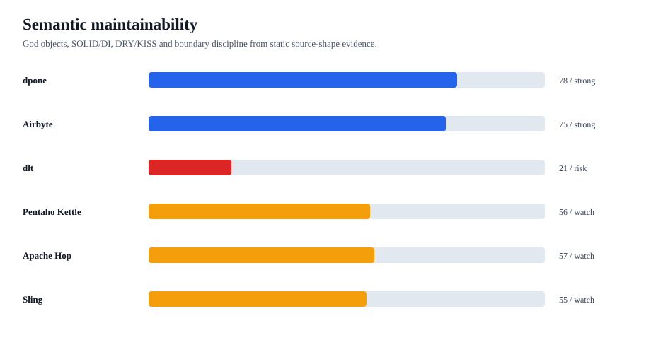

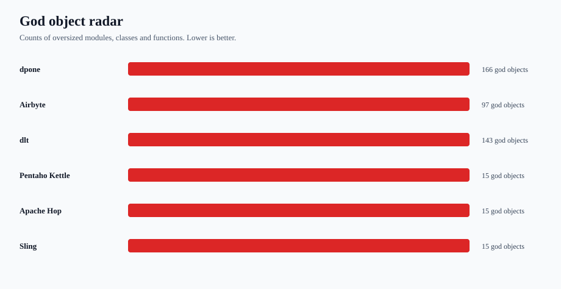

| Project | Overall | Status | God object | SOLID/DI | DRY/KISS | Boundary | God modules | God classes | God functions |
|---|---:|---|---:|---:|---:|---:|---:|---:|---:|
| Airbyte | 75 | strong | 37 | 93 | 83 | 96 | 15 | 60 | 22 |
| Apache Hop | 57 | watch | 40 | 59 | 73 | 63 | 15 | 0 | 0 |
| dlt | 21 | risk | 34 | 0 | 52 | 0 | 12 | 53 | 78 |
| dpone | 78 | strong | 93 | 80 | 50 | 79 | 0 | 58 | 108 |
| Pentaho Kettle | 56 | watch | 40 | 50 | 70 | 74 | 15 | 0 | 0 |
| Sling | 55 | watch | 40 | 63 | 19 | 100 | 15 | 0 | 0 |

### God object radar

| Project | Kind | Module | Object | Value |
|---|---|---|---|---:|
| Airbyte | `module` | `airbyte-integrations/connectors/source-github/source_github/github_schema.py` | `module` | 41,035 LOC |
| Airbyte | `class` | `airbyte-integrations/connectors/source-github/source_github/github_schema.py` | `Mutation` | 3,636 LOC |
| Airbyte | `module` | `airbyte-integrations/connectors/source-shopify/source_shopify/shopify_graphql/bulk/query.py` | `module` | 3,531 LOC |
| Airbyte | `module` | `airbyte-integrations/bases/base-normalization/normalization/transform_catalog/reserved_keywords.py` | `module` | 3,276 LOC |
| Airbyte | `module` | `airbyte-integrations/connectors/source-github/source_github/streams.py` | `module` | 1,955 LOC |
| Apache Hop | `module` | `core/src/main/java/org/apache/hop/core/row/value/ValueMetaBase.java` | `module` | 5,998 LOC |
| Apache Hop | `module` | `ui/src/main/java/org/apache/hop/ui/hopgui/file/pipeline/HopGuiPipelineGraph.java` | `module` | 5,861 LOC |
| Apache Hop | `module` | `ui/src/main/java/org/apache/hop/ui/hopgui/file/workflow/HopGuiWorkflowGraph.java` | `module` | 4,760 LOC |
| Apache Hop | `module` | `core/src/main/java/org/apache/hop/core/database/Database.java` | `module` | 4,719 LOC |
| Apache Hop | `module` | `engine/src/main/java/org/apache/hop/pipeline/transform/BaseTransform.java` | `module` | 4,084 LOC |
| dlt | `module` | `dlt/pipeline/pipeline.py` | `module` | 2,013 LOC |
| dlt | `class` | `dlt/pipeline/pipeline.py` | `Pipeline` | 1,728 LOC |
| dlt | `module` | `dlt/common/libs/pyarrow.py` | `module` | 1,588 LOC |
| dlt | `module` | `dlt/destinations/impl/filesystem/filesystem.py` | `module` | 1,575 LOC |
| dlt | `module` | `dlt/common/schema/utils.py` | `module` | 1,503 LOC |
| dpone | `class` | `src/dpone/runtime/reconciliation/bigquery/store.py` | `BigQueryReconciliationStore` | 420 LOC |
| dpone | `class` | `src/dpone/runtime/connectors/api/omnidesk_connector.py` | `OmnideskConnector` | 413 LOC |
| dpone | `class` | `src/dpone/runtime/connectors/api/connector.py` | `AbstractAPIConnector` | 409 LOC |
| dpone | `class` | `src/dpone/runtime/sinks/strategies/postgres/file_export_loader.py` | `PostgresFileExportLoader` | 405 LOC |
| dpone | `class` | `src/dpone/runtime/state/factory.py` | `StateFactory` | 393 LOC |
| Pentaho Kettle | `module` | `ui/src/main/java/org/pentaho/di/ui/spoon/Spoon.java` | `module` | 10,532 LOC |
| Pentaho Kettle | `module` | `engine/src/main/java/org/pentaho/di/trans/TransMeta.java` | `module` | 6,834 LOC |
| Pentaho Kettle | `module` | `engine/src/main/java/org/pentaho/di/trans/Trans.java` | `module` | 5,891 LOC |
| Pentaho Kettle | `module` | `core/src/main/java/org/pentaho/di/core/row/value/ValueMetaBase.java` | `module` | 5,538 LOC |
| Pentaho Kettle | `module` | `core/src/main/java/org/pentaho/di/core/database/Database.java` | `module` | 5,376 LOC |
| Sling | `module` | `core/dbio/database/database.go` | `module` | 4,198 LOC |
| Sling | `module` | `core/dbio/api/api_test.go` | `module` | 4,075 LOC |
| Sling | `module` | `core/dbio/iop/datastream.go` | `module` | 3,300 LOC |
| Sling | `module` | `core/dbio/api/spec_test.go` | `module` | 2,874 LOC |
| Sling | `module` | `core/dbio/iop/transforms_test.go` | `module` | 2,738 LOC |

### SOLID/DI/Clean Code evidence

| Project | Interface density | Direct impl imports | Finding |
|---|---:|---:|---|
| Airbyte | 0.293 | 0 | Constructor dependency signals detected: 737.; Interface/protocol density is 0.293. |
| Apache Hop | 0.167 | 0 | Constructor dependency signals detected: 0.; Interface/protocol density is 0.167. |
| dlt | 0.211 | 31 | Constructor dependency signals detected: 1357.; Interface/protocol density is 0.211. |
| dpone | 0.381 | 4 | Constructor dependency signals detected: 1461.; Interface/protocol density is 0.381. |
| Pentaho Kettle | 0.247 | 0 | Constructor dependency signals detected: 0.; Interface/protocol density is 0.247. |
| Sling | 2.322 | 0 | Constructor dependency signals detected: 0.; Interface/protocol density is 2.322. |

### DRY/KISS responsibility signals

| Project | Responsibility spread | Branch hotspots | Finding |
|---|---:|---:|---|
| Airbyte | 8 | 215 | Responsibility spread covers 8 architectural tags.; Branch hotspots: 215; god functions: 22. |
| Apache Hop | 6 | 798 | Responsibility spread covers 6 architectural tags.; Branch hotspots: 798; god functions: 0. |
| dlt | 7 | 162 | Responsibility spread covers 7 architectural tags.; Branch hotspots: 162; god functions: 78. |
| dpone | 11 | 446 | Responsibility spread covers 11 architectural tags.; Branch hotspots: 446; god functions: 108. |
| Pentaho Kettle | 6 | 879 | Responsibility spread covers 6 architectural tags.; Branch hotspots: 879; god functions: 0. |
| Sling | 1 | 101 | Responsibility spread covers 1 architectural tags.; Branch hotspots: 101; god functions: 0. |

### Semantic maintainability risk register

| Priority | Project | Module | Reason | Recommendation |
|---|---|---|---|---|
| P1 | airbyte | `airbyte-integrations/bases/base-normalization/normalization/transform_catalog/reserved_keywords.py` | module `module` is 3276 LOC. | Split responsibility behind a smaller service, strategy, renderer, or port. |
| P1 | airbyte | `airbyte-integrations/bases/base-normalization/normalization/transform_catalog/stream_processor.py` | module `module` is 1530 LOC. | Split responsibility behind a smaller service, strategy, renderer, or port. |
| P1 | airbyte | `airbyte-integrations/bases/base-normalization/normalization/transform_catalog/stream_processor.py` | class `StreamProcessor` is 1426 LOC. | Split responsibility behind a smaller service, strategy, renderer, or port. |
| P1 | airbyte | `airbyte-integrations/connectors/source-github/source_github/github_schema.py` | module `module` is 41035 LOC. | Split responsibility behind a smaller service, strategy, renderer, or port. |
| P1 | airbyte | `airbyte-integrations/connectors/source-github/source_github/github_schema.py` | class `Mutation` is 3636 LOC. | Split responsibility behind a smaller service, strategy, renderer, or port. |
| P1 | airbyte | `airbyte-integrations/connectors/source-github/source_github/streams.py` | module `module` is 1955 LOC. | Split responsibility behind a smaller service, strategy, renderer, or port. |
| P1 | airbyte | `airbyte-integrations/connectors/source-google-ads/source_google_ads/components.py` | module `module` is 1322 LOC. | Split responsibility behind a smaller service, strategy, renderer, or port. |
| P1 | airbyte | `airbyte-integrations/connectors/source-shopify/source_shopify/shopify_graphql/bulk/query.py` | module `module` is 3531 LOC. | Split responsibility behind a smaller service, strategy, renderer, or port. |
| P1 | apache-hop | `core/src/main/java/org/apache/hop/core/database/Database.java` | module `module` is 4719 LOC. | Split responsibility behind a smaller service, strategy, renderer, or port. |
| P1 | apache-hop | `core/src/main/java/org/apache/hop/core/row/value/ValueMetaBase.java` | module `module` is 5998 LOC. | Split responsibility behind a smaller service, strategy, renderer, or port. |

## Scoring Validity & Calibration

This section makes the executive scorecard harder to misread and harder to game. It shows raw scores next to language/repo-normalized scores, tests whether small threshold changes would reshuffle rankings, and flags signals that could inflate maintainability without improving the design.

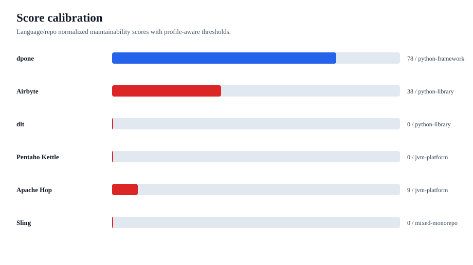

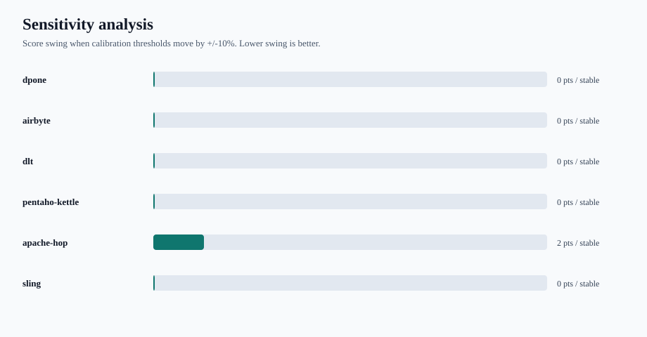

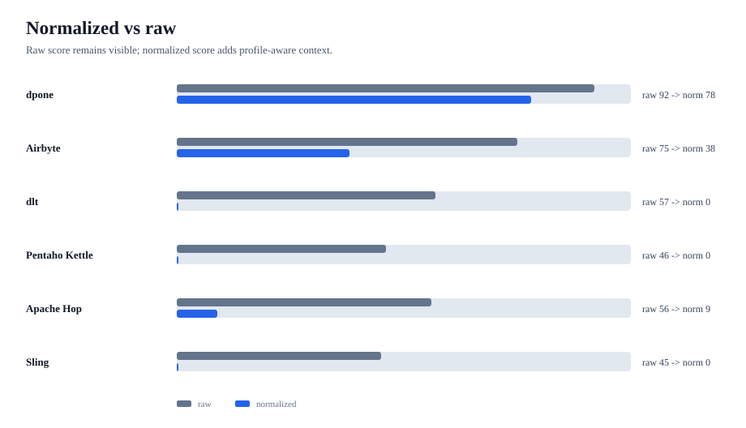

### Language/repo normalization

| Project | Raw | Normalized | Adjustment | Profile | Repo scale | Python | JVM | TS/JS | Other |
|---|---:|---:|---:|---|---|---:|---:|---:|---:|
| Airbyte | 75 | 38 | -37.0 | `python-library` | `product-codebase` | 96.8% | 3.2% | 0.0% | 0.0% |
| Apache Hop | 56 | 9 | -47.0 | `jvm-platform` | `large-monorepo` | 0.0% | 100.0% | 0.0% | 0.0% |
| dlt | 57 | 0 | -57.0 | `python-library` | `product-codebase` | 100.0% | 0.0% | 0.0% | 0.0% |
| dpone | 92 | 78 | -14.0 | `python-framework` | `product-codebase` | 100.0% | 0.0% | 0.0% | 0.0% |
| Pentaho Kettle | 46 | 0 | -46.0 | `jvm-platform` | `large-monorepo` | 0.0% | 100.0% | 0.0% | 0.0% |
| Sling | 45 | 0 | -45.0 | `mixed-monorepo` | `focused-framework` | 0.0% | 0.0% | 0.0% | 100.0% |

### Sensitivity analysis

| Project | +/-10% threshold swing | Stability | Most sensitive metric | Low-threshold score | High-threshold score |
|---|---:|---|---|---:|---:|
| airbyte | 0 | `stable` | `module_size` | 38 | 38 |
| apache-hop | 2 | `stable` | `module_size` | 8 | 10 |
| dlt | 0 | `stable` | `semantic_floor` | 0 | 0 |
| dpone | 0 | `stable` | `god_object` | 78 | 78 |
| pentaho-kettle | 0 | `stable` | `module_size` | 0 | 0 |
| sling | 0 | `stable` | `module_size` | 0 | 0 |

### Anti-gaming guardrails

| Project | Guardrail | Status | Message |
|---|---|---|---|
| airbyte | Micro-module pressure | `passed` | No micro-module gaming pressure detected. |
| airbyte | Hollow-interface pressure | `passed` | Interface density looks proportional to implementation evidence. |
| airbyte | Score-gaming resistance | `warning` | Normalized score differs from raw score by -37 points. |
| apache-hop | Micro-module pressure | `passed` | No micro-module gaming pressure detected. |
| apache-hop | Hollow-interface pressure | `passed` | Interface density looks proportional to implementation evidence. |
| apache-hop | Score-gaming resistance | `warning` | Normalized score differs from raw score by -47 points. |
| dlt | Micro-module pressure | `passed` | No micro-module gaming pressure detected. |
| dlt | Hollow-interface pressure | `passed` | Interface density looks proportional to implementation evidence. |
| dlt | Score-gaming resistance | `warning` | Normalized score differs from raw score by -57 points. |
| dpone | Micro-module pressure | `passed` | No micro-module gaming pressure detected. |
| dpone | Hollow-interface pressure | `passed` | Interface density looks proportional to implementation evidence. |
| dpone | Score-gaming resistance | `warning` | Normalized score differs from raw score by -14 points. |
| pentaho-kettle | Micro-module pressure | `passed` | No micro-module gaming pressure detected. |
| pentaho-kettle | Hollow-interface pressure | `passed` | Interface density looks proportional to implementation evidence. |
| pentaho-kettle | Score-gaming resistance | `warning` | Normalized score differs from raw score by -46 points. |
| sling | Micro-module pressure | `passed` | No micro-module gaming pressure detected. |
| sling | Hollow-interface pressure | `warning` | High interface density with no implementation pressure may indicate score-padding. |
| sling | Score-gaming resistance | `warning` | Normalized score differs from raw score by -45 points. |

### Score explanation cards

| Project | Positive drivers | Negative drivers | Next best action |
|---|---|---|---|
| airbyte | P90 fan-out remains within the language/repo profile budget. | Largest production module exceeds the normalized profile threshold.; 15 production god modules remain above the calibrated threshold.; Normalized score differs from raw score by -37 points. | Split the largest production modules behind the existing runtime contracts. |
| apache-hop | n/a | Largest production module exceeds the normalized profile threshold.; P90 fan-out exceeds the calibrated coupling budget.; 15 production god modules remain above the calibrated threshold. | Split the largest production modules behind the existing runtime contracts. |
| dlt | n/a | Largest production module exceeds the normalized profile threshold.; P90 fan-out exceeds the calibrated coupling budget.; 12 production god modules remain above the calibrated threshold. | Split the largest production modules behind the existing runtime contracts. |
| dpone | Largest production module fits the normalized profile threshold.; P90 fan-out remains within the language/repo profile budget.; No production god modules detected. | DRY/KISS responsibility pressure is still visible in semantic evidence.; Normalized score differs from raw score by -14 points. | Extract repeated branching into strategy contracts with one responsibility per class. |
| pentaho-kettle | n/a | Largest production module exceeds the normalized profile threshold.; P90 fan-out exceeds the calibrated coupling budget.; 15 production god modules remain above the calibrated threshold. | Split the largest production modules behind the existing runtime contracts. |
| sling | P90 fan-out remains within the language/repo profile budget. | Largest production module exceeds the normalized profile threshold.; 15 production god modules remain above the calibrated threshold.; DRY/KISS responsibility pressure is still visible in semantic evidence. | Split the largest production modules behind the existing runtime contracts. |

## Scale Readiness & Growth Simulation

This layer answers the main benchmark objection: dpone is smaller today, so the report models whether its architecture can keep quality when the codebase grows toward comparator scale. It is a planning proxy, not a product roadmap or runtime performance forecast.

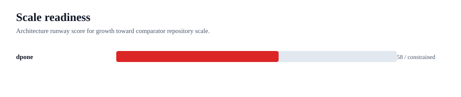

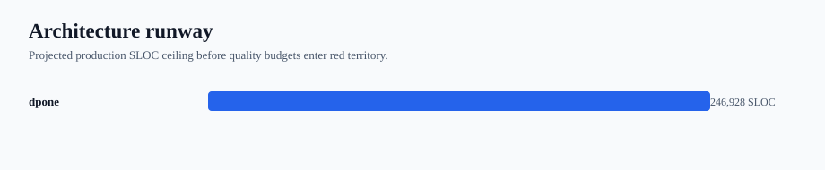


### Quality headroom

| Project | Connector slots before yellow | Connector slots before red | Max module headroom | P90 fan-out headroom | Semantic headroom | Normalized score headroom |
|---|---:|---:|---:|---:|---:|---:|
| dpone | 3 | 16 | 151.0 | 3.00 | 3.0 | 3.0 |

### Architecture runway

| Project | Runway score | Status | Growth ceiling SLOC | Primary constraint |
|---|---:|---|---:|---|
| dpone | 58 | `constrained` | 246,928 | p90 fan-out |

### Scale scenarios

| Project | Scenario | Growth | Projected SLOC | Projected max module | Projected P90 fan-out | Projected maintainability | Risk |
|---|---|---:|---:|---:|---:|---:|---|
| dpone | dlt scale | 1.00x | 195,728 | 449 | 5.00 | 78 | `low` |
| dpone | Airbyte scale | 1.14x | 222,731 | 465 | 5.21 | 78 | `low` |
| dpone | Pentaho Kettle scale | 3.51x | 686,539 | 665 | 7.08 | 74 | `moderate` |
| dpone | Apache Hop scale | 3.28x | 642,167 | 649 | 6.97 | 74 | `moderate` |

### Comparator-scale projection

| Project | Worst scenario | Runway warning | Next target |
|---|---|---|---|
| dpone | `pentaho-scale` | Architecture runway score is below the scale-readiness warning threshold. | Raise architecture runway before adding broad connector surface. |

## Refactor ROI Roadmap

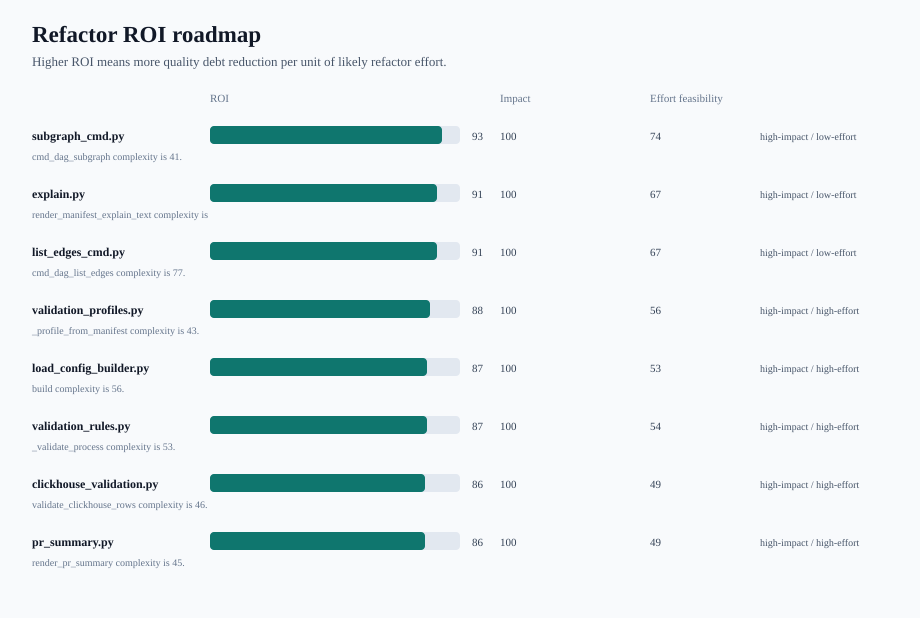

Quality is managed here as an investment portfolio: every generated refactor candidate is ranked by expected debt reduction, actionability, effort feasibility, and target architecture fit.

### Quality debt estimate

| Project | Debt points | Status | Top driver | Quick wins | Strategic refactors |
|---|---:|---|---|---:|---:|
| Airbyte | 999 | active-debt | complexity | 0 | 10 |
| Apache Hop | 999 | active-debt | complexity | 0 | 12 |
| dlt | 570 | active-debt | complexity | 0 | 10 |
| dpone | 389 | active-debt | complexity | 3 | 11 |
| Pentaho Kettle | 999 | active-debt | complexity | 0 | 13 |
| Sling | 496 | active-debt | complexity | 0 | 10 |

### ROI-ranked refactor backlog

| Rank | Project | Module | ROI | Impact | Effort | Debt | Quadrant |
|---:|---|---|---:|---:|---:|---:|---|
| 1 | dpone | `src/dpone/commands/dag/subgraph_cmd.py` | 93 | 100 | 74 | 53 | high-impact / low-effort |
| 2 | dpone | `src/dpone/cli_render/manifest/explain.py` | 91 | 100 | 67 | 59 | high-impact / low-effort |
| 3 | dpone | `src/dpone/commands/dag/list_edges_cmd.py` | 91 | 100 | 67 | 65 | high-impact / low-effort |
| 4 | dpone | `src/dpone/manifest/validation_profiles.py` | 88 | 100 | 56 | 54 | high-impact / high-effort |
| 5 | dpone | `src/dpone/dag/load_config_builder.py` | 87 | 100 | 53 | 58 | high-impact / high-effort |
| 6 | dpone | `src/dpone/manifest/validation_rules.py` | 87 | 100 | 54 | 57 | high-impact / high-effort |
| 7 | dpone | `src/dpone/runtime/etl_logging/clickhouse_validation.py` | 86 | 100 | 49 | 55 | high-impact / high-effort |
| 8 | dpone | `tools/oss_benchmark/pr_summary.py` | 86 | 100 | 49 | 55 | high-impact / high-effort |
| 9 | dpone | `Reduce fan_in pressure in dpone.readiness.migration_control` | 82 | 95 | 45 | 63 | high-impact / high-effort |
| 10 | dpone | `dpone.readiness.migration_control` | 82 | 95 | 45 | 71 | high-impact / high-effort |
| 11 | dpone | `dpone.runtime.sources.strategies.mssql.mssql_queryout_artifacts` | 81 | 89 | 53 | 56 | high-impact / high-effort |
| 12 | dpone | `Lower fan-out in dpone.runtime.sources.strategies.mssql.mssql_queryout_artifacts` | 80 | 89 | 53 | 48 | high-impact / high-effort |

### Target architecture recommendations

| Rank | Module | Target architecture | Recommended action |
|---:|---|---|---|
| 1 | `src/dpone/commands/dag/subgraph_cmd.py` | Command -> Application service -> Renderer | Split decision paths behind a smaller service or strategy contract. |
| 2 | `src/dpone/cli_render/manifest/explain.py` | Renderer -> View model -> Formatter | Split decision paths behind a smaller service or strategy contract. |
| 3 | `src/dpone/commands/dag/list_edges_cmd.py` | Command -> Application service -> Renderer | Split decision paths behind a smaller service or strategy contract. |
| 4 | `src/dpone/manifest/validation_profiles.py` | Manifest service -> Rule object -> Report renderer | Split decision paths behind a smaller service or strategy contract. |
| 5 | `src/dpone/dag/load_config_builder.py` | DAG query service -> DTO -> CLI renderer | Split decision paths behind a smaller service or strategy contract. |
| 6 | `src/dpone/manifest/validation_rules.py` | Manifest service -> Rule object -> Report renderer | Split decision paths behind a smaller service or strategy contract. |
| 7 | `src/dpone/runtime/etl_logging/clickhouse_validation.py` | Facade -> Service -> Port | Split decision paths behind a smaller service or strategy contract. |
| 8 | `tools/oss_benchmark/pr_summary.py` | Facade -> Service -> Port | Split decision paths behind a smaller service or strategy contract. |
| 9 | `Reduce fan_in pressure in dpone.readiness.migration_control` | Facade -> Service -> Port | Split responsibilities behind narrow contracts and keep public facades as compatibility shims. |
| 10 | `dpone.readiness.migration_control` | Facade -> Service -> Port | Reduce architecture pressure behind a narrower boundary. |

## Coverage Confidence Matrix

Coverage confidence separates measured runtime coverage from static test footprint. The benchmark does not claim branch/line coverage for external projects unless a coverage signal is visible in the source or CI configuration.

| Project | Confidence | Score | Runtime coverage | Test footprint | Test file ratio | CI evidence | Coverage config | Evidence |
|---|---|---:|---|---:|---:|---|---|---|
| dpone | high | 100 | configured | 51.0% | 33.8% | yes | yes | test footprint 51.0%; 612 test files over 1,810 production files |
| Airbyte | high | 80 | ci-only | 136.7% | 118.3% | yes | no | test footprint 136.7%; 2,840 test files over 2,400 production files |
| dlt | high | 100 | configured | 116.4% | 91.1% | yes | yes | test footprint 116.4%; 659 test files over 723 production files |
| Pentaho Kettle | medium | 49 | not detected | 29.3% | 47.0% | no | no | test footprint 29.3%; 1,655 test files over 3,520 production files |
| Apache Hop | high | 86 | configured | 20.8% | 33.3% | yes | yes | test footprint 20.8%; 1,187 test files over 3,562 production files |
| Sling | low | 27 | ci-only | 0.3% | 2.0% | yes | no | test footprint 0.3%; 3 test files over 150 production files |

## Architecture Risk Heatmap

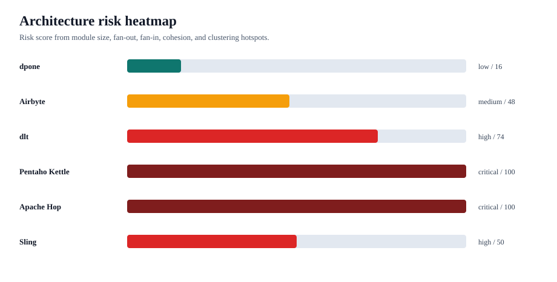

The heatmap turns hotspot evidence into a risk score. It highlights where future changes are likely to be expensive: oversized modules, fan-out/fan-in concentration, low cohesion, and dependency clustering.

| Project | Risk | Score | Top hotspot | Max LOC | Max Ce | Max Ca | Cohesion | Clustering |
|---|---|---:|---|---:|---:|---:|---:|---:|
| dpone | low | 16 | medium fan_out `dpone.runtime.sources.strategies.mssql.mssql_queryout_artifacts` (26 Ce) | 449 | 26 | 88 | 0.633 | 0.157 |
| Airbyte | medium | 48 | critical module_size `airbyte-integrations/connectors/source-github/source_github/github_schema.py` (41035 LOC) | 41,035 | 44 | 159 | 0.604 | 0.125 |
| dlt | high | 74 | critical module_size `dlt/pipeline/pipeline.py` (2013 LOC) | 2,013 | 45 | 224 | 0.377 | 0.226 |
| Pentaho Kettle | critical | 100 | critical module_size `ui/src/main/java/org/pentaho/di/ui/spoon/Spoon.java` (10532 LOC) | 10,532 | 234 | 1,240 | 0.319 | 0.276 |
| Apache Hop | critical | 100 | critical module_size `core/src/main/java/org/apache/hop/core/row/value/ValueMetaBase.java` (5998 LOC) | 5,998 | 143 | 1,138 | 0.188 | 0.235 |
| Sling | high | 50 | critical module_size `core/dbio/database/database.go` (4198 LOC) | 4,198 | 0 | 0 | 0.000 | 0.000 |

### Architecture risk drill-down

- **dpone:** medium fan_out `dpone.runtime.sources.strategies.mssql.mssql_queryout_artifacts` (26 Ce); medium fan_in `dpone.readiness.migration_control` (69 Ca) Approved high fan-in contracts: `dpone.output_json` (output serialization port, Ca 88), `dpone.output_text` (output text rendering port, Ca 87), `dpone.runtime.sources.extract_result` (source extraction DTO, Ca 45), `dpone.runtime.sinks.load_payload` (sink load payload DTO, Ca 38), `dpone.config.load_strategy` (load strategy enum contract, Ca 34)
- **Airbyte:** critical module_size `airbyte-integrations/connectors/source-github/source_github/github_schema.py` (41035 LOC); medium fan_out `io.airbyte.cdk.load.lowcode.DeclarativeDestinationFactory` (44 Ce); high fan_in `io.airbyte.cdk.load.command.DestinationStream` (159 Ca) Approved high fan-in contracts: none in current top fan-in candidates.
- **dlt:** critical module_size `dlt/pipeline/pipeline.py` (2013 LOC); medium fan_out `dlt.pipeline.pipeline` (45 Ce); critical fan_in `dlt.common.typing` (224 Ca); medium cohesion `cross-slice dependency pressure` (0.377 ratio); medium clustering `dependency triangle pressure` (0.226 coefficient) Approved high fan-in contracts: none in current top fan-in candidates.
- **Pentaho Kettle:** critical module_size `ui/src/main/java/org/pentaho/di/ui/spoon/Spoon.java` (10532 LOC); critical fan_out `org.pentaho.di.ui.spoon.Spoon` (234 Ce); critical fan_in `org.pentaho.di.i18n.BaseMessages` (1240 Ca); high cohesion `cross-slice dependency pressure` (0.319 ratio); high clustering `dependency triangle pressure` (0.276 coefficient) Approved high fan-in contracts: none in current top fan-in candidates.
- **Apache Hop:** critical module_size `core/src/main/java/org/apache/hop/core/row/value/ValueMetaBase.java` (5998 LOC); critical fan_out `org.apache.hop.ui.hopgui.file.pipeline.HopGuiPipelineGraph` (143 Ce); critical fan_in `org.apache.hop.i18n.BaseMessages` (1138 Ca); critical cohesion `cross-slice dependency pressure` (0.188 ratio); medium clustering `dependency triangle pressure` (0.235 coefficient) Approved high fan-in contracts: none in current top fan-in candidates.
- **Sling:** critical module_size `core/dbio/database/database.go` (4198 LOC); critical cohesion `cross-slice dependency pressure` (0.000 ratio) Approved high fan-in contracts: none in current top fan-in candidates.

## Architecture Taxonomy & Contract Discipline

This layer turns SOLID/DRY/KISS expectations into a public benchmark signal: thin architectural slices, explicit source/sink/CDC contracts, canonical naming, dependency-inversion boundaries and god-module prevention.

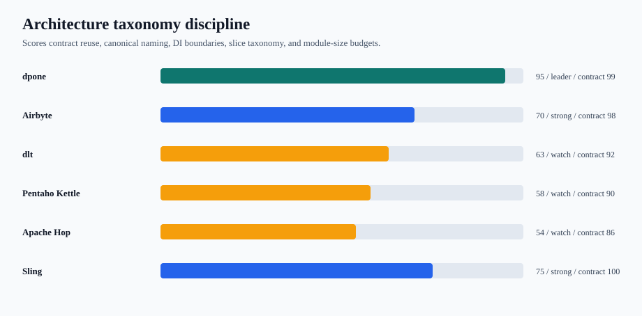

| Project | Taxonomy score | Band | Contract conformance | Naming | DI boundary | Approved facades | Slices | Top violation |
|---|---:|---|---:|---:|---:|---:|---:|---|
| dpone | 95 | leader | 99 | 100 | 98 | 56 | 140 | none |
| Airbyte | 70 | strong | 98 | 100 | 95 | 0 | 2 | none |
| dlt | 63 | watch | 92 | 100 | 73 | 0 | 21 | none |
| Pentaho Kettle | 58 | watch | 90 | 100 | 67 | 0 | 4 | none |
| Apache Hop | 54 | watch | 86 | 100 | 54 | 0 | 3 | none |
| Sling | 75 | strong | 100 | 100 | 100 | 0 | 2 | none |

### Slice heatmap

#### dpone slices

| Slice | Modules | LOC | SLOC | Max LOC | Interface files | Naming violations |
|---|---:|---:|---:|---:|---:|---:|
| other | 582 | 62,788 | 52,722 | 442 | 68 | 0 |
| ops | 241 | 39,585 | 33,580 | 422 | 10 | 0 |
| services | 139 | 19,309 | 16,207 | 441 | 10 | 0 |
| commands | 142 | 17,530 | 14,853 | 437 | 8 | 0 |
| runtime.sources | 119 | 12,577 | 10,507 | 408 | 21 | 2 |
| runtime.sinks | 84 | 12,260 | 10,267 | 424 | 6 | 2 |
| runtime.connectors | 64 | 10,757 | 9,007 | 436 | 5 | 3 |
| manifest | 54 | 6,608 | 5,351 | 418 | 0 | 1 |

#### Airbyte slices

| Slice | Modules | LOC | SLOC | Max LOC | Interface files | Naming violations |
|---|---:|---:|---:|---:|---:|---:|
| other | 2,349 | 290,863 | 219,072 | 41,035 | 70 | 2 |
| config | 51 | 4,630 | 3,659 | 519 | 2 | 0 |

#### dlt slices

| Slice | Modules | LOC | SLOC | Max LOC | Interface files | Naming violations |
|---|---:|---:|---:|---:|---:|---:|
| other | 625 | 130,010 | 101,096 | 2,013 | 7 | 2 |
| commands | 3 | 2,164 | 1,841 | 758 | 0 | 0 |
| manifest | 1 | 692 | 560 | 692 | 0 | 0 |
| runtime.collector | 1 | 476 | 408 | 476 | 0 | 0 |
| runtime.run_context | 1 | 317 | 238 | 317 | 0 | 0 |
| runtime.exec_info | 1 | 310 | 230 | 310 | 0 | 0 |
| runtime.anon_tracker | 1 | 239 | 168 | 239 | 0 | 0 |
| runtime.json_logging | 1 | 210 | 164 | 210 | 0 | 0 |

#### Pentaho Kettle slices

| Slice | Modules | LOC | SLOC | Max LOC | Interface files | Naming violations |
|---|---:|---:|---:|---:|---:|---:|
| other | 3,487 | 997,658 | 684,753 | 10,532 | 438 | 8 |
| services | 20 | 2,127 | 816 | 634 | 4 | 0 |
| metrics | 7 | 987 | 573 | 226 | 1 | 0 |
| config | 6 | 812 | 397 | 523 | 0 | 0 |

#### Apache Hop slices

| Slice | Modules | LOC | SLOC | Max LOC | Interface files | Naming violations |
|---|---:|---:|---:|---:|---:|---:|
| other | 3,504 | 895,277 | 637,288 | 5,998 | 205 | 25 |
| config | 52 | 6,436 | 4,303 | 614 | 1 | 0 |
| metrics | 6 | 928 | 576 | 236 | 0 | 0 |

#### Sling slices

| Slice | Modules | LOC | SLOC | Max LOC | Interface files | Naming violations |
|---|---:|---:|---:|---:|---:|---:|
| other | 148 | 100,605 | 79,254 | 4,198 | 30 | 0 |
| config | 1 | 2,163 | 1,767 | 2,163 | 0 | 0 |

### Contract conformance findings

- **dpone:** no contract-discipline violations crossed the watch threshold; 56 documented compatibility facades were excluded from active-risk scoring.
- **Airbyte:** no contract-discipline violations crossed the watch threshold; 0 documented compatibility facades were excluded from active-risk scoring.
- **dlt:** no contract-discipline violations crossed the watch threshold; 0 documented compatibility facades were excluded from active-risk scoring.
- **Pentaho Kettle:** no contract-discipline violations crossed the watch threshold; 0 documented compatibility facades were excluded from active-risk scoring.
- **Apache Hop:** no contract-discipline violations crossed the watch threshold; 0 documented compatibility facades were excluded from active-risk scoring.
- **Sling:** no contract-discipline violations crossed the watch threshold; 0 documented compatibility facades were excluded from active-risk scoring.

Architecture taxonomy evidence is stored in raw JSON under `architecture_taxonomy.summary`.

## Executive scorecard

| Project | Corpus | Source commit | Files without tests | LOC without tests | SLOC without tests | Max LOC | Max SLOC | Avg Ce | P90 Ce | Cohesion | Clustering | SOLID | Clean OOP | Test footprint | Release delta | Stale age | Freshness |
|---|---|---|---:|---:|---:|---:|---:|---:|---:|---:|---:|---:|---:|---:|---|---:|---|
| dpone dirty | local-framework | `codex/release-v0.62.1@3f562b42ebc8db96a14361ce93353486faa23af4` | 1,810 | 233,810 | 195,728 | 449 | 397 | 2.08 | 5 | 0.633 | 0.157 | 5.0/5 | 5.0/5 | 51.0% | unchanged | 0 | fresh; updated 2026-06-30T15:36:13+00:00 |
| Airbyte | oss-core | `master@84c2d165ef11293b11e2321062e89996908d2f63` | 2,400 | 295,493 | 222,731 | 41,035 | 28,633 | 1.82 | 6 | 0.604 | 0.125 | 4.2/5 | 4.0/5 | 136.7% | unchanged | 0 | fresh; updated 2026-06-30T15:36:13+00:00 |
| dlt | oss-core | `devel@f5999614b613254961a9073310a5db6b13dc279d` | 723 | 140,090 | 108,848 | 2,013 | 1,631 | 4.69 | 12 | 0.377 | 0.226 | 4.2/5 | 4.0/5 | 116.4% | unchanged | 0 | fresh; updated 2026-06-30T15:36:13+00:00 |
| Pentaho Kettle | oss-core | `master@89db5885a1e92e81eb01149cb3e536cc23482c39` | 3,520 | 1,001,584 | 686,539 | 10,532 | 7,948 | 8.18 | 23 | 0.319 | 0.276 | 1.4/5 | 1.1/5 | 29.3% | unchanged | 0 | fresh; updated 2026-06-30T15:36:13+00:00 |
| Apache Hop | oss-core | `main@6aad589666c8458216b8685bb749d2b6dbd1b2f0` | 3,562 | 902,641 | 642,167 | 5,998 | 4,584 | 7.98 | 19 | 0.188 | 0.235 | 2.1/5 | 2.6/5 | 20.8% | unchanged | 0 | fresh; updated 2026-06-30T15:36:13+00:00 |
| Sling | oss-core | `main@6c4ca04c3328eb32da480780c9957bf17f80ffb5` | 150 | 102,799 | 81,045 | 4,198 | 3,379 | 0.00 | 0 | 0.000 | 0.000 | 3.1/5 | 2.7/5 | 0.3% | unchanged | 0 | fresh; updated 2026-06-30T15:36:13+00:00 |

## Comparable OSS corpus

- [Airbyte](https://github.com/airbytehq/airbyte) is included as an open-source data movement platform with a large connector and platform codebase.
- [dlt](https://github.com/dlt-hub/dlt) is included as an open-source Python data loading library.
- [Pentaho Kettle](https://github.com/pentaho/pentaho-kettle) is included as a mature open-source ETL/data-integration baseline.
- [Apache Hop](https://github.com/apache/hop) is included as a modern open-source orchestration and data-integration platform in the Kettle/Hop lineage.
- [Sling](https://github.com/slingdata-io/sling-cli) is included as an open-source CLI-first data movement and replication baseline.
- [Fivetran](https://github.com/fivetran) is **closed-core / not code-comparable** for managed ELT. Its public repositories expose SDK/provider surfaces, not the managed platform core.
- [Informatica PowerCenter/IDMC](https://www.informatica.com/download.html) is **closed-core / not code-comparable**. Public product positioning is useful context, but the core source is unavailable for the same metrics.

## Methodology

- Source scope: Python, Java, Kotlin, TypeScript, JavaScript, Go, Groovy and Scala files.
- Excluded noise: build/cache/vendor directories and root-level tooling folders such as `tools`, `target`, `build`, `dist`, `.cache`, `node_modules` and `test_artifacts`.
- Test exclusion: path segments such as `test`, `tests`, `integration-tests`, `__tests__`, plus filename patterns such as `*Test.java`, `*_test.py`, `*.spec.ts` and `*.test.ts`.
- Coupling: static imports resolved to internal repository modules where possible.
- Cohesion: share of internal dependency edges that stay inside the same top-level architectural slice.
- SOLID and Clean OOP: 0-5 rubric scores based on measurable proxies: module size, fan-out, clustering, cohesion and explicit interface/protocol density.
- Visual assets: `docs/benchmarks/assets/oss-quality-scorecard.svg`, `docs/benchmarks/assets/dpone-trust-center-badge.svg`, `docs/benchmarks/assets/oss-release-readiness-seal.svg`, `docs/benchmarks/assets/oss-evidence-confidence.svg`, `docs/benchmarks/assets/oss-public-evidence-integrity.svg`, `docs/benchmarks/assets/oss-source-verification.svg`, `docs/benchmarks/assets/oss-independent-validation.svg`, `docs/benchmarks/assets/oss-analyzer-confidence.svg`, `docs/benchmarks/assets/oss-feature-parity.svg`, `docs/benchmarks/assets/oss-governance-compliance.svg`, `docs/benchmarks/assets/oss-operability-tco.svg`, `docs/benchmarks/assets/oss-operational-reliability.svg`, `docs/benchmarks/assets/oss-security-supply-chain.svg`, `docs/benchmarks/assets/oss-architecture-taxonomy.svg`, `docs/benchmarks/assets/oss-complexity-boundary.svg`, `docs/benchmarks/assets/oss-semantic-maintainability.svg`, `docs/benchmarks/assets/oss-god-object-radar.svg`, `docs/benchmarks/assets/oss-score-calibration.svg`, `docs/benchmarks/assets/oss-score-sensitivity.svg`, `docs/benchmarks/assets/oss-normalized-vs-raw.svg`, `docs/benchmarks/assets/oss-scale-readiness.svg`, `docs/benchmarks/assets/oss-architecture-runway.svg`, `docs/benchmarks/assets/oss-quality-headroom.svg`, `docs/benchmarks/assets/oss-refactor-roi-roadmap.svg`, `docs/benchmarks/assets/oss-loc-sloc.svg`, `docs/benchmarks/assets/oss-coupling-cohesion-quadrant.svg`, `docs/benchmarks/assets/oss-module-hotspots.svg`, `docs/benchmarks/assets/oss-architecture-risk-heatmap.svg`, `docs/benchmarks/assets/oss-quality-trend.svg`.
- Release readiness pack: `docs/benchmarks/oss-benchmark-release-readiness-2026-06-12.md` ([open pack](oss-benchmark-release-readiness-2026-06-12.md)) and `docs/benchmarks/data/oss-benchmark-release-readiness-2026-06-12.json` ([open JSON](data/oss-benchmark-release-readiness-2026-06-12.json)).
- Raw evidence: `docs/benchmarks/data/oss-code-quality-benchmark-2026-06-12.json` ([open JSON](data/oss-code-quality-benchmark-2026-06-12.json)).
- Provenance ledger: `docs/benchmarks/data/oss-benchmark-provenance.json` ([open ledger](data/oss-benchmark-provenance.json)).
- Trend history: `docs/benchmarks/data/oss-code-quality-benchmark-history.json` ([open history JSON](data/oss-code-quality-benchmark-history.json)).
- PR benchmark summary: `test_artifacts/oss-code-quality-benchmark/pr-comment.md`.

## Data freshness policy

- A fresh metric group was collected successfully in the latest run.
- A stale metric group keeps the last known published value, shows when it was last updated, and records the latest failed refresh attempt.
- An unavailable metric group has no prior evidence and is rendered as `n/a`; values are never fabricated.
- Manual CI refreshes can update all projects or a single project through the workflow inputs.

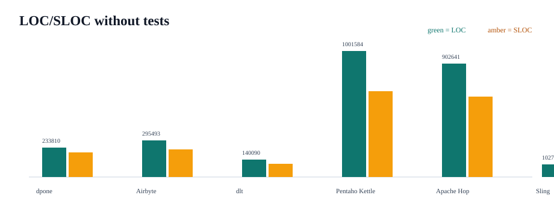

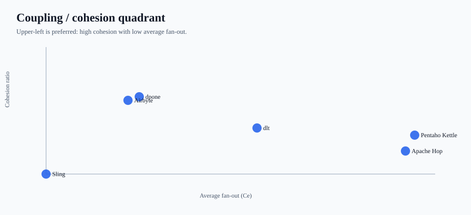

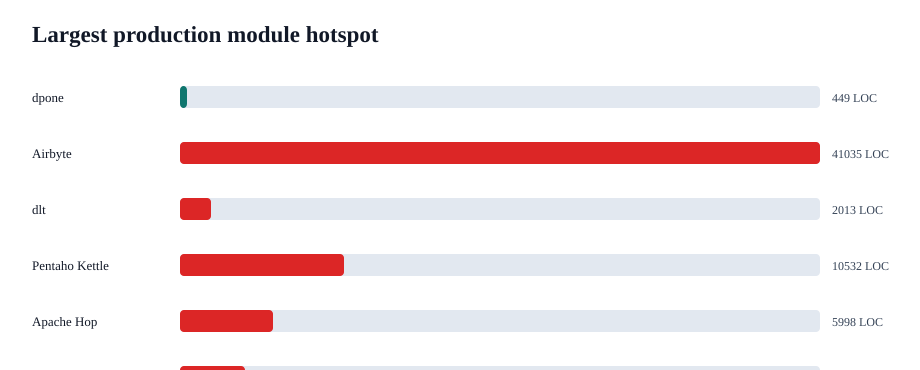

## Quality reading

### dpone

- Freshness: fresh; updated 2026-06-30T15:36:13+00:00.
- Test footprint: `51.0%` based on `99,786` test SLOC over `195,728` production SLOC.
- Coupling: avg Ce `2.08`, P90 Ce `5`, max Ce `26` at `dpone.runtime.sources.strategies.mssql.mssql_queryout_artifacts`.
- Cohesion: `0.633` within slice, cross-slice ratio `0.367`, clustering `0.157`.
- SOLID `5.0/5`, Clean OOP `5.0/5`: largest module stays within the 600 LOC target (449); average fan-out is controlled (2.08); P90 fan-out is controlled (5); average clustering is inside the green target (0.157).

### Airbyte

- Freshness: fresh; updated 2026-06-30T15:36:13+00:00.
- Test footprint: `136.7%` based on `304,464` test SLOC over `222,731` production SLOC.
- Coupling: avg Ce `1.82`, P90 Ce `6`, max Ce `44` at `io.airbyte.cdk.load.lowcode.DeclarativeDestinationFactory`.
- Cohesion: `0.604` within slice, cross-slice ratio `0.396`, clustering `0.125`.
- SOLID `4.2/5`, Clean OOP `4.0/5`: largest module is very large (41035 LOC); average fan-out is controlled (1.82); P90 fan-out is controlled (6); average clustering is inside the green target (0.125).

### dlt

- Freshness: fresh; updated 2026-06-30T15:36:13+00:00.
- Test footprint: `116.4%` based on `126,656` test SLOC over `108,848` production SLOC.
- Coupling: avg Ce `4.69`, P90 Ce `12`, max Ce `45` at `dlt.pipeline.pipeline`.
- Cohesion: `0.377` within slice, cross-slice ratio `0.623`, clustering `0.226`.
- SOLID `4.2/5`, Clean OOP `4.0/5`: largest module is very large (2013 LOC); average fan-out is controlled (4.69); P90 fan-out is controlled (12).

### Pentaho Kettle

- Freshness: fresh; updated 2026-06-30T15:36:13+00:00.
- Test footprint: `29.3%` based on `201,128` test SLOC over `686,539` production SLOC.
- Coupling: avg Ce `8.18`, P90 Ce `23`, max Ce `234` at `org.pentaho.di.ui.spoon.Spoon`.
- Cohesion: `0.319` within slice, cross-slice ratio `0.681`, clustering `0.276`.
- SOLID `1.4/5`, Clean OOP `1.1/5`: largest module is very large (10532 LOC); P90 module size is high (655 LOC); P90 fan-out is high (23); top module fan-out is very high (234).

### Apache Hop

- Freshness: fresh; updated 2026-06-30T15:36:13+00:00.
- Test footprint: `20.8%` based on `133,823` test SLOC over `642,167` production SLOC.
- Coupling: avg Ce `7.98`, P90 Ce `19`, max Ce `143` at `org.apache.hop.ui.hopgui.file.pipeline.HopGuiPipelineGraph`.
- Cohesion: `0.188` within slice, cross-slice ratio `0.812`, clustering `0.235`.
- SOLID `2.1/5`, Clean OOP `2.6/5`: largest module is very large (5998 LOC); P90 fan-out is high (19); top module fan-out is very high (143); cohesion ratio is low (0.188).

### Sling

- Freshness: fresh; updated 2026-06-30T15:36:13+00:00.
- Test footprint: `0.3%` based on `240` test SLOC over `81,045` production SLOC.
- Coupling: avg Ce `0.00`, P90 Ce `0`, max Ce `0` at `api.api`.
- Cohesion: `0.000` within slice, cross-slice ratio `0.000`, clustering `0.000`.
- SOLID `3.1/5`, Clean OOP `2.7/5`: largest module is very large (4198 LOC); P90 module size is high (1554 LOC); average fan-out is controlled (0.00); P90 fan-out is controlled (0).

## dpone position

dpone is much smaller than Airbyte, Pentaho Kettle and Apache Hop, but its current quality posture is competitive because the codebase keeps production modules under the release SLOC gate, maintains low average fan-out (`2.08`), and exposes quality metrics as a first-class documented gate.

The new architecture taxonomy makes the next quality target explicit: dpone is currently `leader` on taxonomy and `99` on contract conformance after documented compatibility facades are separated from active-risk scoring. The remaining target is narrower: source/sink runtime code should depend on connector ports/protocols instead of concrete connector implementations. This is a focused refactor target, not a product-readiness blocker: the benchmark now names the exact seams to clean before connector breadth scales further.

The main comparative advantage is architectural controllability: dpone can keep industrial ETL features, route certification, source-sink matrices and runtime evidence under a tight module-size and dependency budget while larger platforms carry more historical surface area. The next quality target is to keep clustering and contract conformance inside the green zone as new runtime capabilities land, so the product can grow toward Airbyte/Pentaho/Hop feature breadth without inheriting their maintainability drag.

## Appendix: detailed metric tables

### dpone top modules

#### Top 15 modules by LOC (with tests)

| Module | LOC | SLOC | Test? |
|---|---:|---:|---|
| `tests/test_oss_code_quality_benchmark.py` | 3869 | 3561 | yes |
| `tests/test_operations_maturity_services.py` | 1843 | 1591 | yes |
| `tests/test_cli_operations_commands.py` | 1352 | 1194 | yes |
| `tests/test_cli_gitops_airflow_commands.py` | 1163 | 1007 | yes |
| `tests/test_gitops_airflow_runner_pack.py` | 1004 | 860 | yes |
| `tests/test_runtime_mssql_contracts.py` | 918 | 746 | yes |
| `tests/integration/mssql/test_mssql_clickhouse_live_cdc_runtime_integration.py` | 917 | 855 | yes |
| `tests/integration/conftest.py` | 885 | 732 | yes |
| `tests/test_schema_migration_bundle_cli.py` | 752 | 681 | yes |
| `tests/test_architecture_fitness_gate.py` | 723 | 608 | yes |
| `tests/test_gitops_airflow_git_sync_contract.py` | 602 | 512 | yes |
| `tests/test_live_certification_automation.py` | 597 | 531 | yes |
| `tests/test_runtime_credentials_contracts.py` | 559 | 480 | yes |
| `tests/test_mssql_clickhouse_type_fidelity.py` | 550 | 453 | yes |
| `tests/test_columnar_fast_path_contracts.py` | 542 | 457 | yes |

#### Top 15 modules by SLOC (with tests)

| Module | LOC | SLOC | Test? |
|---|---:|---:|---|
| `tests/test_oss_code_quality_benchmark.py` | 3869 | 3561 | yes |
| `tests/test_operations_maturity_services.py` | 1843 | 1591 | yes |
| `tests/test_cli_operations_commands.py` | 1352 | 1194 | yes |
| `tests/test_cli_gitops_airflow_commands.py` | 1163 | 1007 | yes |
| `tests/test_gitops_airflow_runner_pack.py` | 1004 | 860 | yes |
| `tests/integration/mssql/test_mssql_clickhouse_live_cdc_runtime_integration.py` | 917 | 855 | yes |
| `tests/test_runtime_mssql_contracts.py` | 918 | 746 | yes |
| `tests/integration/conftest.py` | 885 | 732 | yes |
| `tests/test_schema_migration_bundle_cli.py` | 752 | 681 | yes |
| `tests/test_architecture_fitness_gate.py` | 723 | 608 | yes |
| `tests/test_live_certification_automation.py` | 597 | 531 | yes |
| `tests/test_gitops_airflow_git_sync_contract.py` | 602 | 512 | yes |
| `tests/test_runtime_credentials_contracts.py` | 559 | 480 | yes |
| `tests/test_columnar_fast_path_contracts.py` | 542 | 457 | yes |
| `tests/test_mssql_clickhouse_type_fidelity.py` | 550 | 453 | yes |

#### Top 15 modules by LOC (without tests)

| Module | LOC | SLOC | Test? |
|---|---:|---:|---|
| `src/dpone/runtime/cdc/retention_models.py` | 449 | 376 | no |
| `src/dpone/runtime/reconciliation/bigquery/store.py` | 443 | 361 | no |
| `src/dpone/readiness/nested_certification.py` | 442 | 395 | no |
| `src/dpone/services/ops/command_handlers_routes.py` | 441 | 397 | no |
| `src/dpone/readiness/schema_migration_bundle_policy.py` | 440 | 377 | no |
| `src/dpone/commands/schema_migration_bundle_cmd.py` | 437 | 375 | no |
| `src/dpone/commands/schema_contract_cmd.py` | 436 | 363 | no |
| `src/dpone/runtime/connectors/api/connector.py` | 436 | 316 | no |
| `src/dpone/integration_matrix_models.py` | 433 | 393 | no |
| `src/dpone/runtime/connectors/api/mindbox.py` | 431 | 381 | no |
| `src/dpone/runtime/connectors/api/omnidesk_connector.py` | 431 | 312 | no |
| `src/dpone/commands/schema_plan_cmd.py` | 430 | 370 | no |
| `src/dpone/runtime/etl_logging/etl_logger.py` | 429 | 348 | no |
| `src/dpone/commands/ops_parsers_artifacts.py` | 427 | 364 | no |
| `src/dpone/commands/schema_migration_registry_cmd.py` | 427 | 384 | no |

#### Top 15 modules by SLOC (without tests)

| Module | LOC | SLOC | Test? |
|---|---:|---:|---|
| `src/dpone/commands/ops_cmd.py` | 400 | 397 | no |
| `src/dpone/services/ops/command_handlers_routes.py` | 441 | 397 | no |
| `src/dpone/readiness/nested_certification.py` | 442 | 395 | no |
| `src/dpone/integration_matrix_models.py` | 433 | 393 | no |
| `src/dpone/commands/schema_migration_registry_cmd.py` | 427 | 384 | no |
| `src/dpone/runtime/sinks/strategies/postgres/file_export_loader.py` | 424 | 383 | no |
| `src/dpone/services/gitops/airflow_render_service.py` | 421 | 383 | no |
| `src/dpone/runtime/connectors/api/mindbox.py` | 431 | 381 | no |
| `src/dpone/services/schema_migration.py` | 414 | 381 | no |
| `src/dpone/readiness/schema_migration_bundle_policy.py` | 440 | 377 | no |
| `src/dpone/runtime/cdc/retention_models.py` | 449 | 376 | no |
| `src/dpone/commands/gitops/airflow_cmd.py` | 426 | 375 | no |
| `src/dpone/commands/schema_migration_bundle_cmd.py` | 437 | 375 | no |
| `src/dpone/readiness/studio_api.py` | 402 | 372 | no |
| `src/dpone/runtime/state/mssql.py` | 408 | 371 | no |

### Airbyte top modules

#### Top 15 modules by LOC (with tests)

| Module | LOC | SLOC | Test? |
|---|---:|---:|---|
| `airbyte-integrations/connectors/source-github/source_github/github_schema.py` | 41035 | 28633 | no |
| `airbyte-cdk/bulk/toolkits/legacy-task-loader/src/testFixtures/kotlin/io/airbyte/cdk/load/write/BasicFunctionalityIntegrationTest.kt` | 5230 | 4638 | yes |
| `airbyte-cdk/bulk/core/load/src/testFixtures/kotlin/io/airbyte/cdk/load/write/BasicFunctionalityIntegrationTest.kt` | 5191 | 4598 | yes |
| `airbyte-integrations/connectors/source-shopify/source_shopify/shopify_graphql/bulk/query.py` | 3531 | 3001 | no |
| `airbyte-integrations/bases/base-normalization/normalization/transform_catalog/reserved_keywords.py` | 3276 | 3244 | no |
| `airbyte-integrations/connectors/source-salesforce/integration_tests/state_migration.py` | 2626 | 2620 | yes |
| `airbyte-cdk/java/airbyte-cdk/db-destinations/src/testFixtures/kotlin/io/airbyte/cdk/integrations/standardtest/destination/DestinationAcceptanceTest.kt` | 2621 | 2051 | yes |
| `airbyte-integrations/connectors/source-github/unit_tests/test_stream.py` | 2432 | 2060 | yes |
| `airbyte-cdk/java/airbyte-cdk/typing-deduping/src/testFixtures/kotlin/io/airbyte/integrations/base/destination/typing_deduping/BaseSqlGeneratorIntegrationTest.kt` | 2008 | 1605 | yes |
| `airbyte-integrations/connectors/source-github/source_github/streams.py` | 1955 | 1545 | no |
| `airbyte-cdk/java/airbyte-cdk/db-sources/src/testFixtures/kotlin/io/airbyte/cdk/integrations/source/jdbc/test/JdbcSourceAcceptanceTest.kt` | 1933 | 1698 | yes |
| `airbyte-integrations/connectors/source-facebook-marketing/unit_tests/test_base_insight_streams.py` | 1841 | 1620 | yes |
| `airbyte-cdk/java/airbyte-cdk/db-sources/src/testFixtures/kotlin/io/airbyte/cdk/integrations/debezium/CdcSourceTest.kt` | 1657 | 1399 | yes |
| `airbyte-cdk/java/airbyte-cdk/typing-deduping/src/testFixtures/kotlin/io/airbyte/integrations/base/destination/typing_deduping/BaseTypingDedupingTest.kt` | 1657 | 1244 | yes |
| `airbyte-integrations/connectors/source-shopify/unit_tests/conftest.py` | 1622 | 1493 | yes |

#### Top 15 modules by SLOC (with tests)

| Module | LOC | SLOC | Test? |
|---|---:|---:|---|
| `airbyte-integrations/connectors/source-github/source_github/github_schema.py` | 41035 | 28633 | no |
| `airbyte-cdk/bulk/toolkits/legacy-task-loader/src/testFixtures/kotlin/io/airbyte/cdk/load/write/BasicFunctionalityIntegrationTest.kt` | 5230 | 4638 | yes |
| `airbyte-cdk/bulk/core/load/src/testFixtures/kotlin/io/airbyte/cdk/load/write/BasicFunctionalityIntegrationTest.kt` | 5191 | 4598 | yes |
| `airbyte-integrations/bases/base-normalization/normalization/transform_catalog/reserved_keywords.py` | 3276 | 3244 | no |
| `airbyte-integrations/connectors/source-shopify/source_shopify/shopify_graphql/bulk/query.py` | 3531 | 3001 | no |
| `airbyte-integrations/connectors/source-salesforce/integration_tests/state_migration.py` | 2626 | 2620 | yes |
| `airbyte-integrations/connectors/source-github/unit_tests/test_stream.py` | 2432 | 2060 | yes |
| `airbyte-cdk/java/airbyte-cdk/db-destinations/src/testFixtures/kotlin/io/airbyte/cdk/integrations/standardtest/destination/DestinationAcceptanceTest.kt` | 2621 | 2051 | yes |
| `airbyte-cdk/java/airbyte-cdk/db-sources/src/testFixtures/kotlin/io/airbyte/cdk/integrations/source/jdbc/test/JdbcSourceAcceptanceTest.kt` | 1933 | 1698 | yes |
| `airbyte-integrations/connectors/source-facebook-marketing/unit_tests/test_base_insight_streams.py` | 1841 | 1620 | yes |
| `airbyte-cdk/java/airbyte-cdk/typing-deduping/src/testFixtures/kotlin/io/airbyte/integrations/base/destination/typing_deduping/BaseSqlGeneratorIntegrationTest.kt` | 2008 | 1605 | yes |
| `airbyte-integrations/connectors/source-github/source_github/streams.py` | 1955 | 1545 | no |
| `airbyte-integrations/connectors/source-shopify/unit_tests/conftest.py` | 1622 | 1493 | yes |
| `airbyte-cdk/java/airbyte-cdk/db-sources/src/testFixtures/kotlin/io/airbyte/cdk/integrations/debezium/CdcSourceTest.kt` | 1657 | 1399 | yes |
| `airbyte-integrations/bases/base-normalization/normalization/transform_catalog/stream_processor.py` | 1530 | 1360 | no |

#### Top 15 modules by LOC (without tests)

| Module | LOC | SLOC | Test? |
|---|---:|---:|---|
| `airbyte-integrations/connectors/source-github/source_github/github_schema.py` | 41035 | 28633 | no |
| `airbyte-integrations/connectors/source-shopify/source_shopify/shopify_graphql/bulk/query.py` | 3531 | 3001 | no |
| `airbyte-integrations/bases/base-normalization/normalization/transform_catalog/reserved_keywords.py` | 3276 | 3244 | no |
| `airbyte-integrations/connectors/source-github/source_github/streams.py` | 1955 | 1545 | no |
| `airbyte-integrations/bases/base-normalization/normalization/transform_catalog/stream_processor.py` | 1530 | 1360 | no |
| `airbyte-integrations/connectors/source-google-ads/source_google_ads/components.py` | 1322 | 1041 | no |
| `airbyte-integrations/connectors/source-outbrain-amplify/source_outbrain_amplify/source.py` | 1234 | 982 | no |
| `airbyte-integrations/connectors/source-salesforce/source_salesforce/streams.py` | 1131 | 969 | no |
| `airbyte-integrations/connectors/source-hubspot/components.py` | 989 | 789 | no |
| `airbyte-integrations/connectors/destination-snowflake-cortex/destination_snowflake_cortex/common/sql/sql_processor.py` | 975 | 783 | no |
| `airbyte-integrations/connectors/source-shopify/source_shopify/streams/base_streams.py` | 963 | 724 | no |
| `airbyte-integrations/connectors/destination-pgvector/destination_pgvector/common/sql/sql_processor.py` | 957 | 765 | no |
| `airbyte-cdk/java/airbyte-cdk/db-sources/src/main/kotlin/io/airbyte/cdk/integrations/source/jdbc/AbstractJdbcSource.kt` | 905 | 796 | no |
| `airbyte-integrations/connectors/source-mssql/src/main/kotlin/io/airbyte/integrations/source/mssql/MsSqlServerDebeziumOperations.kt` | 889 | 642 | no |
| `airbyte-integrations/connectors/source-amazon-seller-partner/components.py` | 873 | 699 | no |

#### Top 15 modules by SLOC (without tests)

| Module | LOC | SLOC | Test? |
|---|---:|---:|---|
| `airbyte-integrations/connectors/source-github/source_github/github_schema.py` | 41035 | 28633 | no |
| `airbyte-integrations/bases/base-normalization/normalization/transform_catalog/reserved_keywords.py` | 3276 | 3244 | no |
| `airbyte-integrations/connectors/source-shopify/source_shopify/shopify_graphql/bulk/query.py` | 3531 | 3001 | no |
| `airbyte-integrations/connectors/source-github/source_github/streams.py` | 1955 | 1545 | no |
| `airbyte-integrations/bases/base-normalization/normalization/transform_catalog/stream_processor.py` | 1530 | 1360 | no |
| `airbyte-integrations/connectors/source-google-ads/source_google_ads/components.py` | 1322 | 1041 | no |
| `airbyte-integrations/connectors/source-outbrain-amplify/source_outbrain_amplify/source.py` | 1234 | 982 | no |
| `airbyte-integrations/connectors/source-salesforce/source_salesforce/streams.py` | 1131 | 969 | no |
| `airbyte-cdk/java/airbyte-cdk/db-sources/src/main/kotlin/io/airbyte/cdk/integrations/source/jdbc/AbstractJdbcSource.kt` | 905 | 796 | no |
| `airbyte-integrations/connectors/source-hubspot/components.py` | 989 | 789 | no |
| `airbyte-integrations/connectors/destination-snowflake-cortex/destination_snowflake_cortex/common/sql/sql_processor.py` | 975 | 783 | no |
| `airbyte-integrations/connectors/destination-pgvector/destination_pgvector/common/sql/sql_processor.py` | 957 | 765 | no |
| `airbyte-integrations/connectors/source-shopify/source_shopify/streams/base_streams.py` | 963 | 724 | no |
| `airbyte-integrations/connectors/source-amazon-seller-partner/components.py` | 873 | 699 | no |
| `airbyte-cdk/bulk/toolkits/legacy-task-loader/src/main/kotlin/io/airbyte/cdk/load/message/DestinationMessage.kt` | 794 | 697 | no |

### dlt top modules

#### Top 15 modules by LOC (with tests)

| Module | LOC | SLOC | Test? |
|---|---:|---:|---|
| `tests/pipeline/test_pipeline.py` | 5926 | 4359 | yes |
| `tests/extract/test_incremental.py` | 4847 | 3800 | yes |
| `tests/extract/test_sources.py` | 2294 | 1619 | yes |
| `tests/load/sources/sql_database/test_sql_database_source.py` | 2140 | 1724 | yes |
| `tests/load/pipeline/test_merge_disposition.py` | 2136 | 1722 | yes |
| `tests/sources/rest_api/integration/test_offline.py` | 2083 | 1849 | yes |
| `tests/libs/test_pydantic.py` | 2047 | 1457 | yes |
| `dlt/pipeline/pipeline.py` | 2013 | 1631 | no |
| `docs/education/dlt-advanced-course/lesson_9_performance_optimisation.py` | 1970 | 1390 | no |
| `tests/common/configuration/test_configuration.py` | 1883 | 1360 | yes |
| `tests/load/test_dummy_client.py` | 1868 | 1389 | yes |
| `tests/extract/test_decorators.py` | 1839 | 1263 | yes |
| `tests/extract/test_extract.py` | 1826 | 1354 | yes |
| `tests/load/test_read_interfaces.py` | 1796 | 1300 | yes |
| `tests/pipeline/test_schema_contracts.py` | 1631 | 1224 | yes |

#### Top 15 modules by SLOC (with tests)

| Module | LOC | SLOC | Test? |
|---|---:|---:|---|
| `tests/pipeline/test_pipeline.py` | 5926 | 4359 | yes |
| `tests/extract/test_incremental.py` | 4847 | 3800 | yes |
| `tests/sources/rest_api/integration/test_offline.py` | 2083 | 1849 | yes |
| `tests/load/sources/sql_database/test_sql_database_source.py` | 2140 | 1724 | yes |
| `tests/load/pipeline/test_merge_disposition.py` | 2136 | 1722 | yes |
| `dlt/pipeline/pipeline.py` | 2013 | 1631 | no |
| `tests/extract/test_sources.py` | 2294 | 1619 | yes |
| `tests/libs/test_pydantic.py` | 2047 | 1457 | yes |
| `docs/education/dlt-advanced-course/lesson_9_performance_optimisation.py` | 1970 | 1390 | no |
| `tests/load/test_dummy_client.py` | 1868 | 1389 | yes |
| `tests/common/configuration/test_configuration.py` | 1883 | 1360 | yes |
| `tests/extract/test_extract.py` | 1826 | 1354 | yes |
| `tests/load/test_read_interfaces.py` | 1796 | 1300 | yes |
| `tests/load/utils.py` | 1580 | 1298 | yes |
| `tests/extract/test_decorators.py` | 1839 | 1263 | yes |

#### Top 15 modules by LOC (without tests)

| Module | LOC | SLOC | Test? |
|---|---:|---:|---|
| `dlt/pipeline/pipeline.py` | 2013 | 1631 | no |
| `docs/education/dlt-advanced-course/lesson_9_performance_optimisation.py` | 1970 | 1390 | no |
| `docs/education/dlt-advanced-course/lesson_1_custom_sources_restapi_source_and_restclient.py` | 1621 | 1244 | no |
| `dlt/common/libs/pyarrow.py` | 1588 | 1243 | no |
| `dlt/destinations/impl/filesystem/filesystem.py` | 1575 | 1246 | no |
| `dlt/common/schema/utils.py` | 1503 | 1142 | no |
| `docs/education/dlt-advanced-course/lesson_6_write_disposition_strategies_and_advanced_tricks.py` | 1379 | 938 | no |
| `dlt/common/schema/schema.py` | 1331 | 1088 | no |
| `dlt/sources/rest_api/config_setup.py` | 1139 | 914 | no |
| `dlt/common/libs/sqlglot.py` | 1122 | 868 | no |
| `dlt/destinations/impl/weaviate/weaviate_client.py` | 1106 | 892 | no |
| `dlt/extract/decorators.py` | 1076 | 862 | no |
| `dlt/destinations/sql_jobs.py` | 1030 | 877 | no |
| `dlt/_workspace/helpers/dashboard/dlt_dashboard.py` | 1029 | 878 | no |
| `dlt/common/data_writers/writers.py` | 1022 | 811 | no |

#### Top 15 modules by SLOC (without tests)

| Module | LOC | SLOC | Test? |
|---|---:|---:|---|
| `dlt/pipeline/pipeline.py` | 2013 | 1631 | no |
| `docs/education/dlt-advanced-course/lesson_9_performance_optimisation.py` | 1970 | 1390 | no |
| `dlt/destinations/impl/filesystem/filesystem.py` | 1575 | 1246 | no |
| `docs/education/dlt-advanced-course/lesson_1_custom_sources_restapi_source_and_restclient.py` | 1621 | 1244 | no |
| `dlt/common/libs/pyarrow.py` | 1588 | 1243 | no |
| `dlt/common/schema/utils.py` | 1503 | 1142 | no |
| `dlt/common/schema/schema.py` | 1331 | 1088 | no |
| `docs/education/dlt-advanced-course/lesson_6_write_disposition_strategies_and_advanced_tricks.py` | 1379 | 938 | no |
| `dlt/sources/rest_api/config_setup.py` | 1139 | 914 | no |
| `dlt/destinations/impl/weaviate/weaviate_client.py` | 1106 | 892 | no |
| `dlt/_workspace/helpers/dashboard/dlt_dashboard.py` | 1029 | 878 | no |
| `dlt/destinations/sql_jobs.py` | 1030 | 877 | no |
| `dlt/common/libs/sqlglot.py` | 1122 | 868 | no |
| `dlt/extract/decorators.py` | 1076 | 862 | no |
| `dlt/sources/helpers/rest_client/paginators.py` | 1001 | 826 | no |

### Pentaho Kettle top modules

#### Top 15 modules by LOC (with tests)

| Module | LOC | SLOC | Test? |
|---|---:|---:|---|
| `ui/src/main/java/org/pentaho/di/ui/spoon/Spoon.java` | 10532 | 7948 | no |
| `engine/src/main/java/org/pentaho/di/trans/TransMeta.java` | 6834 | 3613 | no |
| `engine/src/main/java/org/pentaho/di/trans/Trans.java` | 5891 | 3378 | no |
| `core/src/main/java/org/pentaho/di/core/row/value/ValueMetaBase.java` | 5538 | 3928 | no |
| `core/src/main/java/org/pentaho/di/core/database/Database.java` | 5376 | 3774 | no |
| `ui/src/main/java/org/pentaho/di/ui/spoon/trans/TransGraph.java` | 5098 | 3800 | no |
| `engine/src/main/java/org/pentaho/di/trans/step/BaseStep.java` | 4424 | 2423 | no |
| `core/src/main/java/org/pentaho/di/core/Const.java` | 4390 | 1745 | no |
| `core/src/main/java/org/pentaho/di/compatibility/Value.java` | 3951 | 2578 | no |
| `ui/src/main/java/org/pentaho/di/ui/spoon/job/JobGraph.java` | 3904 | 2944 | no |
| `plugins/pur/core/src/main/java/org/pentaho/di/repository/pur/PurRepository.java` | 3633 | 2885 | no |
| `ui/src/main/java/org/pentaho/di/ui/core/widget/TableView.java` | 3311 | 2514 | no |
| `ui/src/main/java/org/pentaho/di/ui/trans/steps/textfileinput/TextFileInputDialog.java` | 3301 | 2693 | no |
| `core/src/main/java/org/pentaho/di/core/database/DatabaseMeta.java` | 3165 | 1778 | no |
| `engine/src/main/java/org/pentaho/di/repository/kdr/KettleDatabaseRepositoryCreationHelper.java` | 3122 | 2584 | no |

#### Top 15 modules by SLOC (with tests)

| Module | LOC | SLOC | Test? |
|---|---:|---:|---|
| `ui/src/main/java/org/pentaho/di/ui/spoon/Spoon.java` | 10532 | 7948 | no |
| `core/src/main/java/org/pentaho/di/core/row/value/ValueMetaBase.java` | 5538 | 3928 | no |
| `ui/src/main/java/org/pentaho/di/ui/spoon/trans/TransGraph.java` | 5098 | 3800 | no |
| `core/src/main/java/org/pentaho/di/core/database/Database.java` | 5376 | 3774 | no |
| `engine/src/main/java/org/pentaho/di/trans/TransMeta.java` | 6834 | 3613 | no |
| `engine/src/main/java/org/pentaho/di/trans/Trans.java` | 5891 | 3378 | no |
| `ui/src/main/java/org/pentaho/di/ui/spoon/job/JobGraph.java` | 3904 | 2944 | no |
| `plugins/pur/core/src/main/java/org/pentaho/di/repository/pur/PurRepository.java` | 3633 | 2885 | no |
| `ui/src/main/java/org/pentaho/di/ui/trans/steps/textfileinput/TextFileInputDialog.java` | 3301 | 2693 | no |
| `engine/src/main/java/org/pentaho/di/repository/kdr/KettleDatabaseRepositoryCreationHelper.java` | 3122 | 2584 | no |
| `core/src/main/java/org/pentaho/di/compatibility/Value.java` | 3951 | 2578 | no |
| `ui/src/main/java/org/pentaho/di/ui/repository/dialog/RepositoryExplorerDialog.java` | 3045 | 2549 | no |
| `ui/src/main/java/org/pentaho/di/ui/trans/steps/fileinput/text/TextFileInputDialog.java` | 3090 | 2525 | no |
| `ui/src/main/java/org/pentaho/di/ui/core/widget/TableView.java` | 3311 | 2514 | no |
| `engine/src/main/java/org/pentaho/di/trans/steps/scriptvalues_mod/ScriptValuesAddedFunctions.java` | 2882 | 2490 | no |

#### Top 15 modules by LOC (without tests)

| Module | LOC | SLOC | Test? |
|---|---:|---:|---|
| `ui/src/main/java/org/pentaho/di/ui/spoon/Spoon.java` | 10532 | 7948 | no |
| `engine/src/main/java/org/pentaho/di/trans/TransMeta.java` | 6834 | 3613 | no |
| `engine/src/main/java/org/pentaho/di/trans/Trans.java` | 5891 | 3378 | no |
| `core/src/main/java/org/pentaho/di/core/row/value/ValueMetaBase.java` | 5538 | 3928 | no |
| `core/src/main/java/org/pentaho/di/core/database/Database.java` | 5376 | 3774 | no |
| `ui/src/main/java/org/pentaho/di/ui/spoon/trans/TransGraph.java` | 5098 | 3800 | no |
| `engine/src/main/java/org/pentaho/di/trans/step/BaseStep.java` | 4424 | 2423 | no |
| `core/src/main/java/org/pentaho/di/core/Const.java` | 4390 | 1745 | no |
| `core/src/main/java/org/pentaho/di/compatibility/Value.java` | 3951 | 2578 | no |
| `ui/src/main/java/org/pentaho/di/ui/spoon/job/JobGraph.java` | 3904 | 2944 | no |
| `plugins/pur/core/src/main/java/org/pentaho/di/repository/pur/PurRepository.java` | 3633 | 2885 | no |
| `ui/src/main/java/org/pentaho/di/ui/core/widget/TableView.java` | 3311 | 2514 | no |
| `ui/src/main/java/org/pentaho/di/ui/trans/steps/textfileinput/TextFileInputDialog.java` | 3301 | 2693 | no |
| `core/src/main/java/org/pentaho/di/core/database/DatabaseMeta.java` | 3165 | 1778 | no |
| `engine/src/main/java/org/pentaho/di/repository/kdr/KettleDatabaseRepositoryCreationHelper.java` | 3122 | 2584 | no |

#### Top 15 modules by SLOC (without tests)

| Module | LOC | SLOC | Test? |
|---|---:|---:|---|
| `ui/src/main/java/org/pentaho/di/ui/spoon/Spoon.java` | 10532 | 7948 | no |
| `core/src/main/java/org/pentaho/di/core/row/value/ValueMetaBase.java` | 5538 | 3928 | no |
| `ui/src/main/java/org/pentaho/di/ui/spoon/trans/TransGraph.java` | 5098 | 3800 | no |
| `core/src/main/java/org/pentaho/di/core/database/Database.java` | 5376 | 3774 | no |
| `engine/src/main/java/org/pentaho/di/trans/TransMeta.java` | 6834 | 3613 | no |
| `engine/src/main/java/org/pentaho/di/trans/Trans.java` | 5891 | 3378 | no |
| `ui/src/main/java/org/pentaho/di/ui/spoon/job/JobGraph.java` | 3904 | 2944 | no |
| `plugins/pur/core/src/main/java/org/pentaho/di/repository/pur/PurRepository.java` | 3633 | 2885 | no |
| `ui/src/main/java/org/pentaho/di/ui/trans/steps/textfileinput/TextFileInputDialog.java` | 3301 | 2693 | no |
| `engine/src/main/java/org/pentaho/di/repository/kdr/KettleDatabaseRepositoryCreationHelper.java` | 3122 | 2584 | no |
| `core/src/main/java/org/pentaho/di/compatibility/Value.java` | 3951 | 2578 | no |
| `ui/src/main/java/org/pentaho/di/ui/repository/dialog/RepositoryExplorerDialog.java` | 3045 | 2549 | no |
| `ui/src/main/java/org/pentaho/di/ui/trans/steps/fileinput/text/TextFileInputDialog.java` | 3090 | 2525 | no |
| `ui/src/main/java/org/pentaho/di/ui/core/widget/TableView.java` | 3311 | 2514 | no |
| `engine/src/main/java/org/pentaho/di/trans/steps/scriptvalues_mod/ScriptValuesAddedFunctions.java` | 2882 | 2490 | no |

### Apache Hop top modules

#### Top 15 modules by LOC (with tests)

| Module | LOC | SLOC | Test? |
|---|---:|---:|---|
| `core/src/main/java/org/apache/hop/core/row/value/ValueMetaBase.java` | 5998 | 4500 | no |
| `ui/src/main/java/org/apache/hop/ui/hopgui/file/pipeline/HopGuiPipelineGraph.java` | 5861 | 4584 | no |
| `ui/src/main/java/org/apache/hop/ui/hopgui/file/workflow/HopGuiWorkflowGraph.java` | 4760 | 3729 | no |
| `core/src/main/java/org/apache/hop/core/database/Database.java` | 4719 | 3405 | no |
| `core/src/test/java/org/apache/hop/core/ConstTest.java` | 4137 | 3689 | yes |
| `engine/src/main/java/org/apache/hop/pipeline/transform/BaseTransform.java` | 4084 | 2341 | no |
| `ui/src/main/java/org/apache/hop/ui/core/widget/TableView.java` | 3807 | 2906 | no |
| `ui/src/main/java/org/apache/hop/ui/hopgui/perspective/explorer/ExplorerPerspective.java` | 3789 | 3014 | no |
| `engine/src/main/java/org/apache/hop/pipeline/Pipeline.java` | 3604 | 2166 | no |
| `engine/src/main/java/org/apache/hop/pipeline/PipelineMeta.java` | 3492 | 2089 | no |
| `plugins/transforms/textfile/src/main/java/org/apache/hop/pipeline/transforms/fileinput/text/TextFileInputDialog.java` | 3330 | 2755 | no |
| `core/src/main/java/org/apache/hop/core/Const.java` | 3117 | 1648 | no |
| `plugins/transforms/javascript/src/main/java/org/apache/hop/pipeline/transforms/javascript/ScriptValuesAddedFunctions.java` | 2983 | 2641 | no |
| `plugins/misc/mail/src/main/java/org/apache/hop/mail/pipeline/transforms/mail/MailDialog.java` | 2541 | 2091 | no |
| `ui/src/main/java/org/apache/hop/ui/hopgui/HopGui.java` | 2442 | 1900 | no |

#### Top 15 modules by SLOC (with tests)

| Module | LOC | SLOC | Test? |
|---|---:|---:|---|
| `ui/src/main/java/org/apache/hop/ui/hopgui/file/pipeline/HopGuiPipelineGraph.java` | 5861 | 4584 | no |
| `core/src/main/java/org/apache/hop/core/row/value/ValueMetaBase.java` | 5998 | 4500 | no |
| `ui/src/main/java/org/apache/hop/ui/hopgui/file/workflow/HopGuiWorkflowGraph.java` | 4760 | 3729 | no |
| `core/src/test/java/org/apache/hop/core/ConstTest.java` | 4137 | 3689 | yes |
| `core/src/main/java/org/apache/hop/core/database/Database.java` | 4719 | 3405 | no |
| `ui/src/main/java/org/apache/hop/ui/hopgui/perspective/explorer/ExplorerPerspective.java` | 3789 | 3014 | no |
| `ui/src/main/java/org/apache/hop/ui/core/widget/TableView.java` | 3807 | 2906 | no |
| `plugins/transforms/textfile/src/main/java/org/apache/hop/pipeline/transforms/fileinput/text/TextFileInputDialog.java` | 3330 | 2755 | no |
| `plugins/transforms/javascript/src/main/java/org/apache/hop/pipeline/transforms/javascript/ScriptValuesAddedFunctions.java` | 2983 | 2641 | no |
| `engine/src/main/java/org/apache/hop/pipeline/transform/BaseTransform.java` | 4084 | 2341 | no |
| `engine/src/main/java/org/apache/hop/pipeline/Pipeline.java` | 3604 | 2166 | no |
| `plugins/misc/mail/src/main/java/org/apache/hop/mail/pipeline/transforms/mail/MailDialog.java` | 2541 | 2091 | no |
| `engine/src/main/java/org/apache/hop/pipeline/PipelineMeta.java` | 3492 | 2089 | no |
| `ui/src/main/java/org/apache/hop/ui/hopgui/HopGui.java` | 2442 | 1900 | no |
| `plugins/transforms/xml/src/main/java/org/apache/hop/pipeline/transforms/xml/getxmldata/GetXmlDataDialog.java` | 2207 | 1868 | no |

#### Top 15 modules by LOC (without tests)

| Module | LOC | SLOC | Test? |
|---|---:|---:|---|
| `core/src/main/java/org/apache/hop/core/row/value/ValueMetaBase.java` | 5998 | 4500 | no |
| `ui/src/main/java/org/apache/hop/ui/hopgui/file/pipeline/HopGuiPipelineGraph.java` | 5861 | 4584 | no |
| `ui/src/main/java/org/apache/hop/ui/hopgui/file/workflow/HopGuiWorkflowGraph.java` | 4760 | 3729 | no |
| `core/src/main/java/org/apache/hop/core/database/Database.java` | 4719 | 3405 | no |
| `engine/src/main/java/org/apache/hop/pipeline/transform/BaseTransform.java` | 4084 | 2341 | no |
| `ui/src/main/java/org/apache/hop/ui/core/widget/TableView.java` | 3807 | 2906 | no |
| `ui/src/main/java/org/apache/hop/ui/hopgui/perspective/explorer/ExplorerPerspective.java` | 3789 | 3014 | no |
| `engine/src/main/java/org/apache/hop/pipeline/Pipeline.java` | 3604 | 2166 | no |
| `engine/src/main/java/org/apache/hop/pipeline/PipelineMeta.java` | 3492 | 2089 | no |
| `plugins/transforms/textfile/src/main/java/org/apache/hop/pipeline/transforms/fileinput/text/TextFileInputDialog.java` | 3330 | 2755 | no |
| `core/src/main/java/org/apache/hop/core/Const.java` | 3117 | 1648 | no |
| `plugins/transforms/javascript/src/main/java/org/apache/hop/pipeline/transforms/javascript/ScriptValuesAddedFunctions.java` | 2983 | 2641 | no |
| `plugins/misc/mail/src/main/java/org/apache/hop/mail/pipeline/transforms/mail/MailDialog.java` | 2541 | 2091 | no |
| `ui/src/main/java/org/apache/hop/ui/hopgui/HopGui.java` | 2442 | 1900 | no |
| `core/src/main/java/org/apache/hop/core/database/DatabaseMeta.java` | 2386 | 1493 | no |

#### Top 15 modules by SLOC (without tests)

| Module | LOC | SLOC | Test? |
|---|---:|---:|---|
| `ui/src/main/java/org/apache/hop/ui/hopgui/file/pipeline/HopGuiPipelineGraph.java` | 5861 | 4584 | no |
| `core/src/main/java/org/apache/hop/core/row/value/ValueMetaBase.java` | 5998 | 4500 | no |
| `ui/src/main/java/org/apache/hop/ui/hopgui/file/workflow/HopGuiWorkflowGraph.java` | 4760 | 3729 | no |
| `core/src/main/java/org/apache/hop/core/database/Database.java` | 4719 | 3405 | no |
| `ui/src/main/java/org/apache/hop/ui/hopgui/perspective/explorer/ExplorerPerspective.java` | 3789 | 3014 | no |
| `ui/src/main/java/org/apache/hop/ui/core/widget/TableView.java` | 3807 | 2906 | no |
| `plugins/transforms/textfile/src/main/java/org/apache/hop/pipeline/transforms/fileinput/text/TextFileInputDialog.java` | 3330 | 2755 | no |
| `plugins/transforms/javascript/src/main/java/org/apache/hop/pipeline/transforms/javascript/ScriptValuesAddedFunctions.java` | 2983 | 2641 | no |
| `engine/src/main/java/org/apache/hop/pipeline/transform/BaseTransform.java` | 4084 | 2341 | no |
| `engine/src/main/java/org/apache/hop/pipeline/Pipeline.java` | 3604 | 2166 | no |
| `plugins/misc/mail/src/main/java/org/apache/hop/mail/pipeline/transforms/mail/MailDialog.java` | 2541 | 2091 | no |
| `engine/src/main/java/org/apache/hop/pipeline/PipelineMeta.java` | 3492 | 2089 | no |
| `ui/src/main/java/org/apache/hop/ui/hopgui/HopGui.java` | 2442 | 1900 | no |
| `plugins/transforms/xml/src/main/java/org/apache/hop/pipeline/transforms/xml/getxmldata/GetXmlDataDialog.java` | 2207 | 1868 | no |
| `plugins/transforms/excel/src/main/java/org/apache/hop/pipeline/transforms/excelinput/ExcelInputDialog.java` | 2230 | 1777 | no |

### Sling top modules

#### Top 15 modules by LOC (with tests)

| Module | LOC | SLOC | Test? |
|---|---:|---:|---|
| `core/dbio/database/database.go` | 4198 | 3263 | no |
| `core/dbio/api/api_test.go` | 4075 | 3379 | no |
| `core/dbio/iop/datastream.go` | 3300 | 2566 | no |
| `core/dbio/api/spec_test.go` | 2874 | 2384 | no |
| `core/dbio/iop/transforms_test.go` | 2738 | 2544 | no |
| `core/dbio/iop/datatype.go` | 2646 | 2086 | no |
| `core/dbio/filesys/fs.go` | 2237 | 1710 | no |
| `core/sling/replication.go` | 2190 | 1725 | no |
| `core/sling/config.go` | 2163 | 1767 | no |
| `core/dbio/iop/duckdb.go` | 1894 | 1433 | no |
| `cmd/sling/sling_test.go` | 1835 | 1541 | no |
| `core/dbio/database/database_iceberg.go` | 1760 | 1287 | no |
| `core/dbio/filesys/fs_test.go` | 1670 | 1263 | no |
| `core/dbio/iop/stream_processor.go` | 1638 | 1371 | no |
| `core/dbio/database/schemata.go` | 1604 | 1269 | no |

#### Top 15 modules by SLOC (with tests)

| Module | LOC | SLOC | Test? |
|---|---:|---:|---|
| `core/dbio/api/api_test.go` | 4075 | 3379 | no |
| `core/dbio/database/database.go` | 4198 | 3263 | no |
| `core/dbio/iop/datastream.go` | 3300 | 2566 | no |
| `core/dbio/iop/transforms_test.go` | 2738 | 2544 | no |
| `core/dbio/api/spec_test.go` | 2874 | 2384 | no |
| `core/dbio/iop/datatype.go` | 2646 | 2086 | no |
| `core/sling/config.go` | 2163 | 1767 | no |
| `core/sling/replication.go` | 2190 | 1725 | no |
| `core/dbio/filesys/fs.go` | 2237 | 1710 | no |
| `cmd/sling/sling_test.go` | 1835 | 1541 | no |
| `core/dbio/iop/duckdb.go` | 1894 | 1433 | no |
| `core/dbio/iop/stream_processor.go` | 1638 | 1371 | no |
| `core/dbio/database/database_iceberg.go` | 1760 | 1287 | no |
| `core/dbio/database/schemata.go` | 1604 | 1269 | no |
| `core/dbio/filesys/fs_test.go` | 1670 | 1263 | no |

#### Top 15 modules by LOC (without tests)

| Module | LOC | SLOC | Test? |
|---|---:|---:|---|
| `core/dbio/database/database.go` | 4198 | 3263 | no |
| `core/dbio/api/api_test.go` | 4075 | 3379 | no |
| `core/dbio/iop/datastream.go` | 3300 | 2566 | no |
| `core/dbio/api/spec_test.go` | 2874 | 2384 | no |
| `core/dbio/iop/transforms_test.go` | 2738 | 2544 | no |
| `core/dbio/iop/datatype.go` | 2646 | 2086 | no |
| `core/dbio/filesys/fs.go` | 2237 | 1710 | no |
| `core/sling/replication.go` | 2190 | 1725 | no |
| `core/sling/config.go` | 2163 | 1767 | no |
| `core/dbio/iop/duckdb.go` | 1894 | 1433 | no |
| `cmd/sling/sling_test.go` | 1835 | 1541 | no |
| `core/dbio/database/database_iceberg.go` | 1760 | 1287 | no |
| `core/dbio/filesys/fs_test.go` | 1670 | 1263 | no |
| `core/dbio/iop/stream_processor.go` | 1638 | 1371 | no |
| `core/dbio/database/schemata.go` | 1604 | 1269 | no |

#### Top 15 modules by SLOC (without tests)

| Module | LOC | SLOC | Test? |
|---|---:|---:|---|
| `core/dbio/api/api_test.go` | 4075 | 3379 | no |
| `core/dbio/database/database.go` | 4198 | 3263 | no |
| `core/dbio/iop/datastream.go` | 3300 | 2566 | no |
| `core/dbio/iop/transforms_test.go` | 2738 | 2544 | no |
| `core/dbio/api/spec_test.go` | 2874 | 2384 | no |
| `core/dbio/iop/datatype.go` | 2646 | 2086 | no |
| `core/sling/config.go` | 2163 | 1767 | no |
| `core/sling/replication.go` | 2190 | 1725 | no |
| `core/dbio/filesys/fs.go` | 2237 | 1710 | no |
| `cmd/sling/sling_test.go` | 1835 | 1541 | no |
| `core/dbio/iop/duckdb.go` | 1894 | 1433 | no |
| `core/dbio/iop/stream_processor.go` | 1638 | 1371 | no |
| `core/dbio/database/database_iceberg.go` | 1760 | 1287 | no |
| `core/dbio/database/schemata.go` | 1604 | 1269 | no |
| `core/dbio/filesys/fs_test.go` | 1670 | 1263 | no |

## Reproducibility

```bash
uv run python tools/oss_code_quality_benchmark.py --include-external --allow-stale --previous-data docs/benchmarks/data/oss-code-quality-benchmark-2026-06-12.json --baseline-data docs/benchmarks/data/oss-code-quality-benchmark-2026-06-12.json
```

Generated at `2026-06-30T15:36:13+00:00` for dpone `v0.62.1`. Static analysis is approximate by design and should be read as a maintainability benchmark, not as a feature or performance benchmark.
