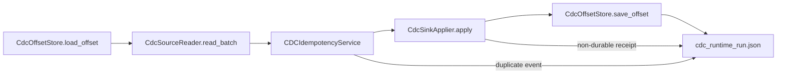

# CDC runtime orchestrator

`dpone ops cdc-runtime-run` runs one bounded CDC runtime tick:

1. load the last durable checkpoint;
2. read a bounded CDC batch;
3. check event idempotency;
4. apply the batch to the sink adapter;
5. commit offset only after durable sink apply;
6. write a stable JSON/Markdown runtime report.

The first documented profile is `mssql -> clickhouse`. The command is generic:
the runtime loop depends on reader, sink applier, and offset-store interfaces,
not on SQL Server or ClickHouse branches inside the orchestrator.

## User workflow

1. Generate or approve the CDC promotion bundle for the stream.
2. Export a bounded CDC events JSON from a live reader or a CI fixture.
3. Choose a durable checkpoint location for the stream.
4. Run `dpone ops cdc-runtime-run`.
5. Review `cdc_runtime_run.json`, `cdc_runtime_run.md`, sink receipt, and
   checkpoint JSON.
6. Feed the run report into run registry, observability, and release evidence
   automation.

## Runtime loop



The offset is committed only when all of these are true:

- idempotency checks pass;
- sink apply returns `passed=true`;
- sink apply returns `durable=true`;
- the batch has a next offset;
- no policy blocker exists.

Default blockers:

| Blocker | Meaning |
| --- | --- |
| `cdc_runtime.duplicate_events` | Event identity check found duplicate CDC events before sink apply. |
| `cdc_runtime.sink_apply_failed` | Sink apply failed without a more specific blocker. |
| `cdc_runtime.sink_not_durable` | Sink apply did not return a durable receipt. |
| `cdc_runtime.next_offset_missing` | A non-empty applied batch did not provide the next durable offset. |

## Events JSON

The local CLI path is credential-free and accepts this shape:

```json
{
  "high_watermark": "0x12",
  "next_offset": {
    "backend": "mssql_cdc",
    "token": "0x12",
    "snapshot_complete": true
  },
  "changes": [
    {
      "operation": "update",
      "position": "0x11",
      "sequence": 1,
      "source_schema": "dbo",
      "source_table": "orders",
      "data": {"order_id": 1, "status": "paid"},
      "metadata": {"backend": "mssql_cdc"}
    }
  ]
}
```

Live readers can produce the same `CDCBatch` contract directly and bypass the
JSON reader.

## CDC live runtime adapters

Use [CDC live runtime adapters](cdc-live-runtime-adapters.md) when a route is
ready to run against real connectors instead of a local JSON fixture. The first
live profile is `mssql -> clickhouse`: SQL Server CDC or Change Tracking reads
produce `CDCBatch`, `ClickHouseCdcSinkApplier` writes an append-only ClickHouse
CDC log, and SQL-backed offset storage advances only after the durable receipt.

## CLI examples

Run one local runtime tick for `mssql -> clickhouse`:

```bash
dpone ops cdc-runtime-run \
  --source mssql \
  --sink clickhouse \
  --backend mssql_cdc \
  --pipeline-name orders-cdc \
  --source-schema dbo \
  --source-table orders \
  --target-dataset analytics.orders \
  --unique-key order_id \
  --events-json test_artifacts/cdc_runtime/mssql_to_clickhouse/orders/events.json \
  --checkpoint-json test_artifacts/cdc_runtime/mssql_to_clickhouse/orders/checkpoint.json \
  --output-dir test_artifacts/cdc_runtime/mssql_to_clickhouse/orders \
  --format json
```

Use repeated `--unique-key` arguments for compound keys.

Run one live runtime tick:

```bash
dpone ops cdc-runtime-run --mode live \
  --source mssql \
  --sink clickhouse \
  --backend mssql_cdc \
  --pipeline-name orders-cdc \
  --source-schema dbo \
  --source-table orders \
  --target-dataset analytics.orders_cdc \
  --unique-key order_id \
  --source-connection-id mssql-prod \
  --sink-connection-id clickhouse-prod \
  --credentials-source env \
  --format json
```

## ClickHouse CDC materialization

Use [ClickHouse CDC materialization](cdc-clickhouse-materialization.md) after a
live or local runtime tick has written a ClickHouse append-only CDC log. The
serving materializer rebuilds the latest row per `dpone_cdc_unique_key_hash`,
supports active-only and tombstone delete modes, and writes
`cdc_materialization.json` plus `cdc_materialization.md`.

```bash
dpone ops cdc-materialize-clickhouse \
  --cdc-dataset analytics.orders_cdc \
  --target-dataset serving.orders_current \
  --unique-key order_id \
  --sink-connection-id clickhouse-prod \
  --delete-mode exclude_deleted \
  --format json
```

## Generated artifacts

| Artifact | Purpose |
| --- | --- |
| `cdc_runtime_run.json` | Stable schema `dpone.cdc_runtime_run.v1`, stream identity, offsets, row counts, blockers, sink receipt, and metrics. |
| `cdc_runtime_run.md` | Human-readable runtime tick review. |
| `sink/cdc_sink_rows.json` | Local sink-loadable CDC rows for CI and examples. |
| `sink/cdc_sink_receipt.json` | Durable local sink receipt. |
| checkpoint JSON | Local durable offset checkpoint written only after successful durable apply. |

## Runbook

If `cdc_runtime_run.json` is red:

1. Fix `cdc_runtime.duplicate_events` by checking source ordering, event
   identity inputs, and replay window boundaries before applying to the sink.
2. Fix `cdc_runtime.sink_apply_failed` in the sink applier. Inspect the sink
   receipt and target-side logs.
3. Fix `cdc_runtime.sink_not_durable` before allowing any offset commit. A sink
   apply that is not durable is not a replication-grade success.
4. Fix `cdc_runtime.next_offset_missing` by correcting the reader so every
   non-empty applied batch returns the next durable offset.
5. Re-run `dpone ops cdc-runtime-run`.
6. Promote the checkpoint only after the report has `passed=true` and
   `committed=true`.
