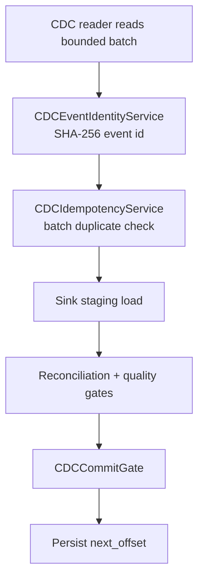

# CDC Runtime

`dpone` now has live CDC readers for PostgreSQL logical decoding and SQL Server CDC / Change Tracking. The readers are intentionally small, explicit runtime components: they read a bounded batch, return a durable offset, and expose rows through the regular `ExtractionArtifact` API so existing sinks can load them.

Install the required extras:

```bash
pip install "dpone[postgres,mssql]"
```

## Offset contract

Every reader returns a `CDCBatch`:

- `changes`: immutable row-level changes.
- `next_offset`: durable `CDCOffset` with backend and token.
- `high_watermark`: source-specific watermark consumed during the read.
- `to_artifact()`: converts the batch into an `InMemoryRowsArtifact` for normal sink loading.

Rows include original data plus metadata columns:

| Column | Meaning |
| --- | --- |
| `_dpone_cdc_operation` | `insert`, `update`, `delete`, or `update_before` |
| `_dpone_cdc_position` | PostgreSQL LSN, SQL Server CDC LSN, or Change Tracking version |
| `_dpone_cdc_schema` | Source schema |
| `_dpone_cdc_table` | Source table |
| `_dpone_cdc_deleted` | Boolean tombstone flag |
| `_dpone_cdc_transaction_id` | PostgreSQL transaction id when available |

## PostgreSQL logical decoding

The default production reader uses PostgreSQL SQL binary logical decoding functions with the built-in `pgoutput` plugin and a publication:

```python
from dpone.runtime.cdc import PostgresLogicalCDCReader, PostgresLogicalCDCReaderConfig
from dpone.runtime.connectors.postgres import PostgresConnector
from dpone.runtime.state.cdc import PostgresCDCOffsetStorage

connector = PostgresConnector(
    host="postgres.example.com",
    port=5432,
    database="app",
    user="replicator",
    password="secret",
)
reader = PostgresLogicalCDCReader(
    connector,
    PostgresLogicalCDCReaderConfig(
        source_schema="public",
        source_table="orders",
        slot_name="dpone_orders",
        publication_name="dpone_orders_pub",
        plugin="pgoutput",
    ),
)
reader.setup()

state = PostgresCDCOffsetStorage(connector)
offset = state.load_offset("orders-to-landing", "public", "orders", reader.read_batch().next_offset.backend)
batch = reader.read_batch(start_offset=offset, max_changes=10000)
if batch.next_offset is not None:
    state.save_offset("orders-to-landing", "public", "orders", batch.next_offset)
```

PostgreSQL requirements:

- `wal_level=logical`.
- `max_replication_slots` high enough for dpone slots.
- User can create/read logical replication slots.
- Source table should have a stable primary key for downstream merge semantics.
- `pgoutput` requires a publication; `reader.setup()` creates one when `create_publication_if_missing=True`.

For diagnostics, set `plugin="test_decoding"`; dpone will use `pg_logical_slot_get_changes` and the text parser instead of the binary `pgoutput` parser. Plugins such as decoderbufs/logical_buffers need a dedicated codec adapter and are intentionally not parsed as fake text.

Operational note: PostgreSQL logical slot read functions advance the slot when called. Persist `batch.next_offset` only after the sink load commits. If the process fails after reading but before loading, replay requires restoring from a retained downstream artifact or using a new slot plus snapshot strategy.

## SQL Server CDC

SQL Server CDC is the full event-log style reader and is the right choice when you need insert/update/delete history.

```python
from dpone.readiness.cdc import CDCBackend
from dpone.runtime.cdc import MSSQLCDCReader, MSSQLTableCDCReaderConfig
from dpone.runtime.connectors.mssql import MSSQLConnector
from dpone.runtime.state.cdc import MSSQLCDCOffsetStorage

connector = MSSQLConnector(
    host="sql.example.com",
    port=1433,
    database="dwh",
    user="etl",
    password="secret",
    trust_server_certificate="no",
)
reader = MSSQLCDCReader(
    connector,
    MSSQLTableCDCReaderConfig(
        source_schema="dbo",
        source_table="orders",
        capture_instance="dbo_orders",
    ),
)
reader.setup()

state = MSSQLCDCOffsetStorage(connector)
offset = state.load_offset("orders-cdc", "dbo", "orders", CDCBackend.MSSQL_CDC)
batch = reader.read_batch(start_offset=offset, max_changes=50000)
# Load batch.to_artifact() into MSSQL/ClickHouse, then persist the offset.
if batch.next_offset is not None:
    state.save_offset("orders-cdc", "dbo", "orders", batch.next_offset)
```

SQL Server CDC requirements:

- SQL Server Agent enabled and running.
- CDC enabled on the database and table. `reader.setup()` can do this for privileged users.
- Retention configured long enough for your maximum recovery time.
- Polling job must alert when stored offset falls behind `sys.fn_cdc_get_min_lsn(capture_instance)`.

## SQL Server Change Tracking

Change Tracking is lighter than CDC and works well for high-throughput net-change synchronization. It does not preserve every intermediate change. If a row is inserted, updated, and deleted between reads, the next read returns the latest net state.

```python
from dpone.readiness.cdc import CDCBackend
from dpone.runtime.cdc import MSSQLChangeTrackingReader, MSSQLChangeTrackingReaderConfig
from dpone.runtime.state.cdc import MSSQLCDCOffsetStorage

reader = MSSQLChangeTrackingReader(
    connector,
    MSSQLChangeTrackingReaderConfig(source_schema="dbo", source_table="orders"),
)
reader.setup()
state = MSSQLCDCOffsetStorage(connector)
offset = state.load_offset("orders-ct", "dbo", "orders", CDCBackend.MSSQL_CHANGE_TRACKING)
batch = reader.read_batch(start_offset=offset)
if batch.next_offset is not None:
    state.save_offset("orders-ct", "dbo", "orders", batch.next_offset)
```

Change Tracking requirements:

- Database Change Tracking enabled.
- Table Change Tracking enabled.
- Primary key on the source table.
- Retention longer than your maximum outage window.

## Setup SQL from CLI

Generate setup SQL without importing runtime dependencies:

```bash
dpone cdc plan --backend postgres_logical --schema public --table orders --slot-name dpone_orders --publication-name dpone_orders_pub

dpone cdc plan --backend mssql_cdc --schema dbo --table orders --capture-instance dbo_orders

dpone cdc plan --backend mssql_change_tracking --schema dbo --table orders
```

## Replay and idempotency hardening

CDC replay must be deliberate: state can move forward only after the sink
commit succeeds, and replayed events must be idempotent by event identity and
target merge keys.



### Replay plan command

Use `dpone cdc replay-plan` before rewinding or replaying a CDC window:

```bash
dpone cdc replay-plan \
  --backend postgres_logical \
  --pipeline-name orders-cdc \
  --schema public \
  --table orders \
  --stored-offset '0/20' \
  --replay-from '0/10' \
  --replay-to '0/20' \
  --retention-min '0/05' \
  --high-watermark '0/30' \
  --artifact-uri 's3://dpone-artifacts/orders/0-10-0-20.jsonl' \
  --allow-rewind \
  --format json
```

The planner returns:

| Field | Meaning |
| --- | --- |
| `safe_to_execute` | `true` only when no replay blockers exist. |
| `steps` | Ordered operator checklist. |
| `blockers` | Conditions that must be fixed before replay. |
| `warnings` | Non-blocking operational risk, such as rewinding stored state. |

Common blockers:

| Blocker | Meaning | Fix |
| --- | --- | --- |
| `replay.requires_allow_rewind` | `replay_from` is behind the stored offset. | Add `--allow-rewind` after verifying the replay window. |
| `replay.artifact_required_for_consumed_postgres_slot` | PostgreSQL logical slot read already advanced and no retained artifact was supplied. | Replay from a retained artifact, create a fresh slot with snapshot/backfill, or do not rewind. |
| `replay.start_before_retention` | Source retention no longer covers the requested start offset. | Restore from artifact/backfill; increase retention before the next incident. |
| `replay.invalid_window` | `replay_from` is after `replay_to`. | Correct the window bounds. |
| `replay.to_after_high_watermark` | Requested replay end is beyond the known source high watermark. | Re-read source metadata or reduce `replay_to`. |

### Event identity

`CDCEventIdentityService` builds a deterministic SHA-256 event id from:

- source schema and table;
- operation;
- source position;
- transaction id and sequence when available;
- configured `unique_key` values, or row payload fallback.

The ID is stable across retries and changes when the source position changes.
This lets sinks and certification tests distinguish safe replay from duplicate
delivery bugs.

### Offset commit gate

`CDCCommitGate` allows state advancement only when all of these are true:

- `next_offset` exists;
- `next_offset.backend` matches the reader backend;
- sink status is successful;
- load status is `committed`;
- idempotency check passed.

This preserves the production rule: **read offsets are not durable until the
target commit is durable**.

## Replay runbook

1. Pause the scheduled CDC job for the pipeline.
2. Inspect stored state with `dpone state inspect` or the state backend query.
3. Run `dpone cdc replay-plan` with stored offset, replay window, retention
   lower bound, and artifact URI when replaying consumed PostgreSQL logical
   slots.
4. Fix every blocker before running replay.
5. Load replay rows through the same staging-first sink strategy as normal CDC.
6. Run reconciliation and data-quality gates.
7. Advance state only after `CDCCommitGate` allows the next offset.
8. Resume the scheduled CDC job and monitor lag/freshness metrics.

## Integration tests

PostgreSQL logical CDC test container:

```bash
docker run -d --name dpone-it-postgres-cdc \
  -e POSTGRES_USER=dpone \
  -e POSTGRES_PASSWORD=dpone_pass \
  -e POSTGRES_DB=dpone \
  -p 15435:5432 \
  postgres:16 \
  postgres -c wal_level=logical -c max_replication_slots=10 -c max_wal_senders=10

DPONE_IT_PG_CDC_HOST=127.0.0.1 \
DPONE_IT_PG_CDC_PORT=15435 \
DPONE_IT_PG_CDC_DATABASE=dpone \
DPONE_IT_PG_CDC_USER=dpone \
DPONE_IT_PG_CDC_PASSWORD=dpone_pass \
uv run pytest -m integration_postgres_cdc -q
```

SQL Server CDC test container:

```bash
docker run -d --name dpone-it-mssql-cdc \
  -e ACCEPT_EULA=Y \
  -e MSSQL_SA_PASSWORD='Dpone_Strong_12345!' \
  -e MSSQL_PID=Developer \
  -e MSSQL_AGENT_ENABLED=True \
  -p 15436:1433 \
  mcr.microsoft.com/mssql/server:2022-latest

DPONE_IT_MSSQL_CDC_HOST=127.0.0.1 \
DPONE_IT_MSSQL_CDC_PORT=15436 \
DPONE_IT_MSSQL_CDC_DATABASE=dpone \
DPONE_IT_MSSQL_CDC_USER=sa \
DPONE_IT_MSSQL_CDC_PASSWORD='Dpone_Strong_12345!' \
DPONE_IT_MSSQL_TRUST_SERVER_CERTIFICATE=yes \
uv run pytest tests/integration/mssql/test_mssql_cdc_integration.py -q
```

## Production checklist

- Persist `batch.next_offset` only after the sink commit succeeds.
- Monitor source retention windows and alert before offsets expire.
- Use CDC for event-history replication and Change Tracking for net-change sync.
- Keep CDC metadata columns in bronze/landing tables.
- Run a backfill snapshot before starting CDC for existing data.
- For exactly-once target semantics, combine CDC offset commit with idempotent sink merge keys.

## Relationship to Postgres XMin

Postgres XMin is documented separately in [Postgres XMin](postgres-xmin.md). It is an incremental extraction strategy for inserted and updated rows, not a full CDC stream: it does not observe physical deletes by itself and should be combined with snapshot reconciliation or the CDC readers when delete semantics are required.
