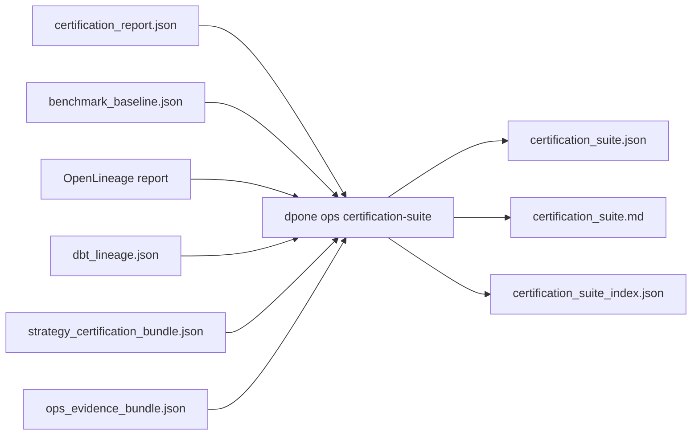

# Certification suite automation

`dpone ops certification-suite` aggregates the evidence required for a
production-grade connector/source-sink/strategy release decision.

It is the manual or scheduled CI/CD gate that ties together:

- source -> sink matrix certification;
- benchmark regression baseline;
- dpone OpenLineage export;
- dbt transformation lineage;
- strategy replay/matrix/connector evidence bundles;
- evidence bundle checksums.

The command does not run every underlying test by itself. It evaluates the
artifacts produced by focused commands and integration workflows. This keeps
slow/vendor-dependent gates explicit and reproducible.

## Behavioral quickstart

This unbound form is useful for local aggregation and troubleshooting. It does
not prove that the inputs belong to one immutable release and cannot be used
as release-summary evidence.

```bash
dpone ops certification-run \
  --artifact-dir test_artifacts/certification/current \
  --row-count 10000 \
  --format json

dpone ops benchmark-baseline \
  --output-dir test_artifacts/benchmarks/current \
  --metrics-json '{"throughput_rows_per_second":95000}' \
  --baseline-json '{"throughput_rows_per_second":{"value":100000,"direction":"higher"}}' \
  --allowed-regression-ratio 0.10 \
  --format json

dpone ops certification-suite \
  --output-dir test_artifacts/certification/suite \
  --suite-id manual_matrix_2026_06_05 \
  --certification-report test_artifacts/certification/current/certification_report.json \
  --benchmark-baseline test_artifacts/benchmarks/current/benchmark_baseline.json \
  --require-benchmark \
  --format json
```

Artifacts written:

```text
certification_suite.json
certification_suite.md
certification_suite_index.json
```

## Release-bound evidence profile

For release evidence, every included artifact must contain the same top-level
`release_id`. Passing `--release-id` enables fail-closed identity validation;
the command does not copy that identity into unbound child artifacts.

```bash
export DPONE_RELEASE_ID='sha256:<canonical-release-digest>'

dpone ops certification-suite \
  --output-dir test_artifacts/certification/suite \
  --suite-id oss_release_candidate \
  --release-id "$DPONE_RELEASE_ID" \
  --certification-report test_artifacts/certification/current/certification_report.json \
  --benchmark-baseline test_artifacts/benchmarks/current/benchmark_baseline.json \
  --lineage-report .dpone/lineage/orders/run_01__openlineage_report.json \
  --dbt-lineage-report .dpone/dbt-lineage/orders/dbt_lineage.json \
  --strategy-certification-bundle test_artifacts/strategy_certification/matrix/strategy_certification_bundle.json \
  --evidence-bundle test_artifacts/ops/evidence/ops_evidence_bundle.json \
  --require-benchmark \
  --require-lineage \
  --require-dbt-lineage \
  --require-strategy-certification \
  --require-evidence \
  --format json
```

## Evidence model



## Required and optional evidence

| Evidence | CLI option | Required by default | Typical use |
| --- | --- | --- | --- |
| Matrix certification | `--certification-report` | yes | Source -> sink strategy correctness. |
| Benchmark baseline | `--benchmark-baseline` | no | Performance regression protection. |
| dpone lineage | `--lineage-report` | no | Transport lineage evidence. |
| dbt lineage | `--dbt-lineage-report` | no | Transformation lineage evidence. |
| Strategy certification bundle | `--strategy-certification-bundle` | no | Replay, source/sink matrix, connector, and benchmark evidence checksums. |
| Evidence bundle | `--evidence-bundle` | no | Checksummed release/go-live evidence. |

Optional artifacts become required when their matching `--require-*` flag is
set.

## Failure behavior

| Condition | Blocker |
| --- | --- |
| Matrix certification red | `certification_report.not_passed` |
| Required benchmark missing | `benchmark_baseline.missing` |
| Benchmark regression | `benchmark_baseline.not_passed` |
| Required lineage missing | `lineage_report.missing` |
| dbt lineage red | `dbt_lineage_report.not_passed` |
| Strategy certification missing | `strategy_certification_bundle.missing` |
| Strategy certification red | `strategy_certification_bundle.not_passed` |
| Evidence bundle red | `evidence_bundle.not_passed` |
| Child artifact has no `release_id` | `<name>.release_id_missing` |
| Child artifact belongs to another release | `<name>.release_id_mismatch` |

## Manual CI/CD pattern

Use `certification-suite` in manual or scheduled workflows, not in ordinary PR
CI, when the underlying profile is broad, slow, or Docker/vendor dependent.

```yaml
on:
  workflow_dispatch:
    inputs:
      profile:
        type: choice
        options: [mock_contract, mock_local, vendor_live]

permissions:
  contents: read

jobs:
  certification-suite:
    runs-on: ubuntu-latest
    steps:
      - uses: actions/checkout@v4
      - run: uv sync --all-extras
      - run: uv run dpone ops certification-run --artifact-dir test_artifacts/certification/current
      # This remains an unbound behavioral suite. A release workflow must pass
      # --release-id and consume artifacts stamped by their producers.
      - run: uv run dpone ops certification-suite --suite-id "${{ github.run_id }}" --certification-report test_artifacts/certification/current/certification_report.json --format json
      - uses: actions/upload-artifact@v4
        if: always()
        with:
          name: certification-suite
          path: test_artifacts/certification/
```

## Runbook

1. Open `certification_suite.json` and inspect `blockers`.
2. If `certification_report.not_passed`, open the failing case behavior artifact and re-run a focused matrix case.
3. If `benchmark_baseline.not_passed`, re-run the same benchmark profile before changing baselines.
4. If lineage evidence is missing, regenerate `lineage-export` and `dbt-lineage`.
5. If strategy certification is red, open `strategy_certification_bundle.json` and inspect its `blockers` first.
6. If evidence bundle is red, inspect the underlying release gate, SLO, security, or diff artifact.
7. Attach `certification_suite.json` and `certification_suite.md` to release evidence before publishing a stronger connector badge.
8. Before release summary, confirm that `release_id` is present and each item
   reports `identity_status: MATCHED`; an unbound suite is not release evidence.

## Related docs

- [Testing overview](testing/index.md)
- [Manual integration matrix](testing/manual-integration-matrix.md)
- [Connector certification](connector-certification.md)
- [Benchmark baseline gate](ops-cli.md#benchmark-baseline-gate)
- [OpenLineage and run history](lineage.md)
- [dbt integration](dbt.md)

## Strategy certification evidence bundle

`dpone strategy certification-bundle` creates a focused strategy evidence package that can be attached to release reviews, connector certification, and production audit tickets.

It aggregates already-produced artifacts. It does not run the underlying gates. This keeps slow Docker/vendor workflows explicit and reproducible.

Schema version:

```text
dpone.strategy.certification_bundle.v1
```

Example:

```bash
dpone strategy certification-bundle \
  --bundle-id oss_rc_2026_06_05 \
  --output-dir test_artifacts/strategies/certification_bundle \
  --replay-evidence test_artifacts/replay_integration/resync_01_evidence.json \
  --matrix-artifact test_artifacts/integration_matrix/certification_report.json \
  --connector-artifact test_artifacts/connectors/connector_certification.json \
  --benchmark-artifact test_artifacts/benchmarks/benchmark_baseline.json \
  --docs-link docs/testing/replay-integration.md \
  --docs-link docs/testing/integration-matrix.md \
  --format json
```

Artifacts written:

```text
strategy_certification_bundle.json
strategy_certification_bundle.md
```

The bundle records presence, pass/fail status, SHA-256 checksums, concise summaries, docs links, and blockers such as `replay.missing:<file>` or `matrix.not_passed:<file>`.

GitHub Actions publishes the same bundle format automatically for the manual replay, source/sink matrix, and connector certification workflows:

| Workflow | Bundle artifact | Primary evidence kind |
| --- | --- | --- |
| `.github/workflows/replay-integration.yml` | `strategy-certification-replay` | `--replay-evidence` |
| `.github/workflows/integration-matrix.yml` | `strategy-certification-matrix` | `--matrix-artifact` |
| `.github/workflows/connector-certification.yml` | `strategy-certification-connectors` | `--connector-artifact` |

Runbook:

1. Open `strategy_certification_bundle.json`.
2. If `passed=false`, inspect `blockers` first.
3. For missing replay evidence, re-run the replay integration gate.
4. For matrix blockers, open the referenced matrix artifact and re-run a focused source -> sink case.
5. For benchmark blockers, re-run the exact benchmark profile before changing baselines.
6. Attach both JSON and Markdown bundle files to the release or certification ticket.

## Final release summary

After replay, source -> sink matrix, and connector certification are green, run `dpone ops release-summary` or trigger `.github/workflows/certification-release-summary.yml`. This builds the top-level `release_summary.json` / `release_summary.md` gate from:

- replay evidence chain;
- source -> sink certification suite;
- source -> sink evidence chain;
- connector certification suite;
- connector evidence chain.

The release summary is the recommended artifact to attach to release notes, PR promotion evidence, or a manual OSS readiness review. A red summary blocks publication even if individual upstream jobs appear green, because the summary re-verifies tamper-evident chains and suite status.

## Recurring full certification automation

`.github/workflows/full-certification.yml` is the scheduled/manual automation that exercises the full evidence profile for source -> sink certification.

It produces the same artifact families described above, but in one reproducible workflow:

- `certification_automation_plan.json` / `.md`;
- source -> sink matrix `certification_report.json`;
- `benchmark_baseline.json`;
- run registry and OpenLineage event;
- `ops_evidence_bundle.json`;
- `strategy_certification_bundle.json`;
- `certification_suite.json`;
- artifact index and tamper-evident evidence chain.

Run the workflow weekly for the `mock_contract` profile and manually for broader `mock_local` or `vendor_live` profiles when service/tooling or credentials are available.

## Native transfer evidence in strategy bundles

`dpone strategy certification-bundle` accepts `--native-transfer-evidence` for
checksumed native transfer evidence indexes produced by
`dpone strategy native-transfer-evidence`.

```bash
dpone strategy certification-bundle \
  --bundle-id postgres_mssql_native_rc \
  --native-transfer-evidence test_artifacts/native-transfer/postgres-mssql/evidence/01J00000000000000000000000/evidence_index.json \
  --output-dir test_artifacts/strategy_certification/postgres_mssql
```

This keeps route-specific native transfer evidence connected to the generic
certification suite without making the suite understand every source/sink pair.
