# CI/CD

For the non-authoritative local inventory that precedes exact-SHA compatibility
verification, see [Exact-SHA compatibility candidate](cicd/exact-sha-compatibility.md).

`dpone` uses GitHub Actions as the public OSS automation path. The default branch for the public release flow is `master`.

This page is the CI/CD index. It explains the automation model at a high level and links to detailed workflow docs, failure runbooks, and developer guidance for changing CI/CD safely.

## CI/CD map

```mermaid
flowchart LR
    Dev["Developer branch or fork"] --> PR["Pull request to master"]
    PR --> CI["CI quality matrix"]
    PR --> Docs["Docs strict build"]
    PR --> DepReview["Native Dependency Review"]
    PR --> Security["Secret scan and CodeQL"]
    PR --> Privilege["Semantic PR privilege boundary"]
    CI --> Review["Review and merge"]
    Docs --> Review
    DepReview --> Review
    Security --> Review
    Privilege --> Review
    PR --> HeadReceipt["Immutable receipt on reviewed head H"]
    HeadReceipt --> Review
    Review --> Master["master"]
    Master --> MergeReceipt["Merge-closure receipt on exact commit C"]
    Master --> Pages["GitHub Pages deploy"]
    Master --> MasterDepReview["Exact-master Dependency Review"]
    Master --> Scorecard["OSSF Scorecard"]
    Master --> Manual["Manual integration matrix"]
    Master --> OssQuality["OSS code quality benchmark"]
    Manual --> Obs["Observability maturity"]
    Tag["vX.Y.Z tag"] --> SourceRelease["Source workflow: no PyPI upload"]
    Authorized["Authorized manual version input"] --> Release["External controller: build and PyPI upload"]
    Release --> PublicProof["Exact public archive observation"]
    Manual --> Cert["Connector certification artifacts"]
    Manual --> Route["Route readiness artifacts"]
    Route --> CdcApply["CDC apply certification artifacts"]
    CdcApply --> Cdc["CDC handoff artifacts"]
    Cdc --> CdcObs["CDC observability evidence"]
    CdcObs --> CdcRecovery["CDC recovery evidence"]
    CdcRecovery --> CdcSchema["CDC schema evolution evidence"]
    CdcSchema --> CdcSchemaApply["CDC schema apply"]
    CdcSchemaApply --> CdcPromotion["CDC promotion gate"]
    CdcPromotion --> CdcRuntime["CDC runtime run"]
    Cert --> Maturity["Production maturity gate"]
    CdcPromotion --> Industrial
    CdcRuntime --> CdcPoison["CDC poison quarantine and replay"]
    CdcPoison --> CdcCompare["CDC compare and repair"]
    CdcCompare --> Industrial
    Obs --> Maturity
    Maturity --> Industrial["Industrial readiness gate"]
    Industrial --> ScopedPromotion["Separately scoped production promotion"]
    Maturity --> ScopedPromotion
```



## Detailed docs

| Need | Doc |
| --- | --- |
| Understand each workflow, trigger, job, artifact, and local reproduction command | [Workflow reference](cicd/workflows.md) |
| Recover a red CI/CD run | [Failure runbooks](cicd/runbooks.md) |
| Diagnose or recover the exact H-to-C Agent PR receipt | [Agent PR merge-receipt runbook](agent-pr-merge-receipt-runbook.md) |
| Understand release publishing, GitHub Pages, and PyPI Trusted Publishing | [Release and Pages automation](cicd/release-and-pages.md) |
| Run the manual source/sink matrix | [Manual integration matrix](testing/manual-integration-matrix.md) and [matrix runbook](testing/integration-matrix.md) |
| Certify connectors | [Connector certification](connector-certification.md) |
| Add or change CI/CD as a developer | [Developer CI/CD guide](developer-ci-cd.md) |
| Run the local/default test gates | [Testing](testing/overview.md) and [Testing runbooks](testing/index.md) |
| Prove or recover the PR-reachable workflow privilege boundary | [Workflow reference](cicd/workflows.md#semantic-pr-privilege-boundary) and [semantic privilege runbook](cicd/runbooks.md#semantic-pr-privilege-boundary) |
| Validate CI shard provenance or the latency claim | [CI performance evidence](cicd/ci-performance-evidence.md) |
| Dispatch or interpret the diagnostic reconciliation-capacity probe | [PR Gate shadow capacity](cicd/pr-gate-shadow-capacity.md) and [capacity runbook](cicd/pr-gate-shadow-capacity-runbook.md) |
| Prepare Airflow Kubernetes runners for custom dpone images | [GitOps Airflow runner pack](gitops-airflow-runner-pack.md) |

## Workflow inventory

| Workflow | File | Trigger | Required by default | Purpose |
| --- | --- | --- | --- | --- |
| Agent PR receipt | `.github/workflows/agent-pr-receipt.yml` | PR body edited; merged PR closed | yes | Captures immutable reviewed-head `H` evidence, derives the exact merge/squash closure naming integration commit `C`, and projects the validated required check onto `C` because GitHub keeps the native closed-event run on `H`. |
| CI | `.github/workflows/ci.yml` | push to `master`, pull request to `master`, manual dispatch | yes | Read-only quality and workflow-security checks, non-live tests, package build, PostgreSQL XMin integration, plus a read-only governance evidence producer and source-free attestation finalizer. |
| docs | `.github/workflows/pages.yml` | path-filtered push to `master`, every pull request, manual dispatch | yes | Generated-reference check plus strict MkDocs build; deploys GitHub Pages only from current `master`. |
| Dependency Review | `.github/workflows/dependency-review.yml` | pull request to `master`, push to `master` | yes | Native, read-only high-severity dependency policy on the PR test-merge and exact `master` commit; there is no manual or synthetic backfill. |
| Secret Scan | `.github/workflows/secret-scan.yml` | push, PR, weekly schedule | yes | TruffleHog verified secret scan. |
| CodeQL | `.github/workflows/codeql.yml` | push, PR, weekly schedule | yes | Python static security analysis. |
| OSSF Scorecard | `.github/workflows/scorecard.yml` | push to `master`, branch protection changes, weekly schedule | advisory/security | Supply-chain posture analysis and SARIF upload. |
| PyPI publication | `PaulKov/dpone-release-controller/.github/workflows/pypi-release.yml` | manual dispatch; `version=X.Y.Z` only | authorized publication | Build four distributions from the fixed dpone tag, upload the retained eight archives through OIDC, then verify public filenames and hashes. No GitHub Release or GHCR publication. |
| Source tag workflow | `.github/workflows/release.yml` | canonical `vX.Y.Z` tag push only | separate source workflow | Retains candidate/attestation/GitHub Release paths and legacy paired-run gates, but no PyPI upload; its handoff message does not dispatch the external controller. |
| OSS code quality benchmark | `.github/workflows/oss-code-quality-benchmark.yml` | manual dispatch | manual/docs | Refreshes dpone vs OSS comparator LOC/SLOC, coupling, cohesion, SOLID, Clean OOP, test-footprint, Complexity & Boundary Discipline, Semantic Maintainability Deep Scan, Scoring Validity & Calibration, Scale Readiness & Growth Simulation, Refactor ROI Roadmap, quality debt, Evidence Trust & Auditability, Public Evidence Integrity, Source Citation Verification, Benchmark v3 Release Readiness, Claims Ledger, Runtime Certification Matrix, Executable Certification, Quality Budget As Code, Evidence Warehouse Export, release readiness pack, claim-to-source matrix, Independent Analyzer Cross-Validation, External analyzer execution with `tokei`/`cloc`/`radon`/`lizard`, public artifact redaction, claim coverage, external analyzer command ledger, stale analyzer values, stale source values, freshness metadata, historical trend evidence, PR regression gate, PR summary, and benchmark visuals; opens a PR with generated docs when requested. |
| Source/Sink integration matrix | `.github/workflows/integration-matrix.yml` | manual dispatch | manual | Runs all source -> sink strategy contracts or local/mock matrix layers with artifacts. |
| Backfill integration matrix | `.github/workflows/backfill-integration.yml` | PR (path-filtered on backfill/runtime/sink/source code), nightly schedule, manual dispatch | path-triggered PR + nightly | End-to-end chunked backfill certification against disposable Postgres/ClickHouse/MSSQL/Kafka services. Manual `shadow_initial_smoke` is an exact-commit, ten-chunk/four-process crash-and-resume gate before release/DEV; the full profile covers route x inner-strategy, resume/parallel/verification, and interval-driven Airflow runs. Uploads junit, execution and coverage evidence. See [testing/backfill-integration.md](testing/backfill-integration.md). |
| Airflow provider compatibility | `.github/workflows/airflow-pack-compat.yml` | every PR and push to `master`, manual dispatch | required | Validates `apache-airflow-providers-dpone` plus `dpone-airflow-pack` against pinned Airflow 2.10.5, 2.11.0, 3.2.0, and 3.3.0 with exact CNCF Kubernetes provider pins: discovery/import safety, cache IO, and real-Airflow Jinja rendering of the `DPONE_*` interval env templates. Every exact `master` SHA runs the matrix because release certification requires the live required checks on the immutable release commit. |
| Airflow provider compatibility nightly | `.github/workflows/airflow-pack-compat-nightly.yml` | daily at `01:23 Europe/Berlin`, manual dispatch | scheduled/manual | Source-free read-only wrapper that queues up to the provider limit and calls the compatibility workflow with a four-cell ceiling; direct and PR runs retain a two-cell ceiling. |
| Observability maturity | `.github/workflows/observability-maturity.yml` | manual dispatch, weekly schedule | scheduled/manual | Exports Prometheus/OpenTelemetry metrics, validates SLO smoke, and publishes observability evidence. |
| Connector certification | `.github/workflows/connector-certification.yml` | daily schedule, manual dispatch | scheduled/manual | Async scheduled release-evidence gate with offline certification, Docker local-live connector markers, and vendor/API live tests. |
| Production maturity | `.github/workflows/production-maturity.yml` | weekly schedule, manual dispatch | scheduled/manual | Aggregates CDC, performance, security, supply-chain, governance, and docs evidence into one operational readiness report; route production authority is separate. |
| Industrial readiness | `.github/workflows/industrial-readiness.yml` | weekly schedule, manual dispatch | scheduled/manual | Aggregates local matrix, correctness, reliability, performance lab, UX, and governance evidence into one industrial readiness report. |
| Route certification release | `.github/workflows/route-certification-release.yml` | manual dispatch | manual/release | Runs `dpone ops route-certify-release` over first-class route bundles and uploads `route_certification_release.json`, Markdown, and release notes. |
| Route release finalize | `.github/workflows/route-release-finalize.yml` | manual dispatch | manual/release | Runs `dpone ops route-release-finalize` with bundle discovery, freshness/provenance/regression checks, and history artifacts. |

## Default PR gate

For normal code and documentation changes, contributors should be able to reproduce the default gate locally:

```bash
uv sync --locked --all-extras
uv run ruff check .
uv run ruff format --check .
uv run mypy --config-file mypy.ini
uv run dpone docs check-module-size --package packages/dpone-airflow-pack/src/dpone_airflow_pack --no-baseline
uv run dpone docs check-module-size --package packages/apache-airflow-providers-dpone/src/airflow/providers/dpone --no-baseline
uv run dpone docs check-generated-references
uv run dpone docs check-airflow-public-contracts
uv run dpone docs update-airflow-public-contract-reference --check
uv run pytest -m "not integration_live" -n auto --cov=src/dpone --cov=packages/dpone-airflow-pack/src/dpone_airflow_pack --cov-report=xml
uv build
uv build packages/apache-airflow-providers-dpone --out-dir dist
```

The unit/contract layer runs in parallel via `pytest-xdist` (`-n auto`);
import-state-sensitive guards isolate themselves in fresh subprocesses so the
suite stays order-independent. The coverage gate (`fail_under` in
`[tool.coverage.report]`) is enforced by `pytest-cov` and follows a ratchet
policy: raise it toward the measured baseline, never lower it.

`--locked` is part of the contributor contract: CI fails when `uv.lock` and
project metadata differ and never repairs the lock implicitly. The Pages build
uses `uv sync --locked`; release workflows retain their separately reviewed
release-only install and publication commands.

Superseded runs cancel only within the same pull request. Scheduled and manual
full Airflow compatibility runs share the stable
`airflow-pack-compat-nightly` group, do not cancel running work, and use
`queue: max`. GitHub may retain at most 100 pending members; a provider-cancelled
101st member is not a pass. Pages serializes its complete build, current-master
verification, and deploy sequence so an older commit cannot publish after a
newer successful commit. Dependabot checks GitHub Actions on Wednesday at 08:00
and `uv` on Monday at 08:30, both in `Europe/Berlin`, with exact owner-managed
labels and bounded open version-update PR counts; see the workflow reference
for the exact limits and groups.

For docs changes, also run:

```bash
python -m pip install -r docs/requirements.txt
mkdocs build --strict
```

For release candidates, add:

```bash
uv run twine check dist/*
```

## Semantic PR privilege boundary

Workflow authors and security reviewers can prove the declared maximum
authority reachable from a pull request without a GitHub credential. Prepare
the locked project environment once:

```bash
uv sync --locked --all-extras
```

That prerequisite may access the network, write the environment or uv cache,
and use stderr. It is outside the scanner process contract. From the prepared
checkout, use the strict uv convenience invocation without another sync,
network access, or Python download:

```bash
uv run --locked --no-sync --offline --no-python-downloads python -B \
  tools/agent_policy/workflow_security_privileged.py \
  --root . \
  --format text
uv run --locked --no-sync --offline --no-python-downloads python -B \
  tools/agent_policy/workflow_security.py . --format json
```

The standalone scanner process reads only the fixed workflow and closed-policy
paths and creates or modifies no file. These guarantees begin when the Python
process starts; they do not cover uv setup or wrapper behavior. Use the direct
prepared-interpreter commands in the
[workflow reference](cicd/workflows.md#semantic-pr-privilege-boundary) when
capturing exact exit and stream evidence.
`PASS` means the local snapshot was complete and every PR-reachable job was
unprivileged or matched one mandatory closed profile. `FAIL` and `UNVERIFIED`
both block integration; neither can be overridden by the legacy write-scope
allowlist. The existing umbrella command remains the required compatibility
surface and appends semantic findings after its existing errors.

A local `PASS` is static repository evidence, not proof that hosted CodeQL,
governance artifact generation, attestation, required checks, or the Agent PR
receipt passed on the reviewed head. See the
[workflow reference](cicd/workflows.md#semantic-pr-privilege-boundary) for the
exact output and exit contract and the
[runbook](cicd/runbooks.md#semantic-pr-privilege-boundary) for diagnosis,
recovery, and safe rollback.

## Vault-backed CI secrets

CI jobs that need HashiCorp Vault-compatible KV access must install the `vault`
extra or the public `vault-kv-client` package and import only
`vault_kv_client`. The dpone runtime, CLI, and CI acceptance helpers must not
use legacy Vault import paths, even if a third-party package keeps them as a
compatibility alias.

GitHub/GitLab job tokens, Vault ID tokens, Airflow service-account passwords,
and kubeconfig payloads must stay in the CI secret store or Vault. They must not
be committed to repository files, rendered into Markdown artifacts, or printed
in logs.

## Schema migration promotion gate

Repository systems remain the canonical approval layer. In GitHub, GitLab,
Bitbucket, or any equivalent PR/MR flow, use dpone migration promotion artifacts
as CI evidence rather than rebuilding packs per environment.

Suggested pipeline:

```bash
uv run dpone schema migration plan \
  --manifest manifests/orders.yaml \
  --actual actual/stage-clickhouse-physical.json \
  --format json \
  --output .dpone/schema-migration/orders.pack.json

uv run dpone schema impact plan \
  --pack .dpone/schema-migration/orders.pack.json \
  --manifest manifests/orders.yaml \
  --format json \
  --output .dpone/schema-impact/orders.impact.json

uv run dpone schema impact gate \
  --pack .dpone/schema-migration/orders.pack.json \
  --impact .dpone/schema-impact/orders.impact.json \
  --approval approvals/orders-impact.yaml

uv run dpone schema contract consumers lineage \
  --manifest manifests/orders.yaml \
  --format json \
  --output .dpone/schema-contracts/orders.lineage.json

uv run dpone schema contract consumers discover \
  --manifest manifests/orders.yaml \
  --lineage .dpone/schema-contracts/orders.lineage.json \
  --format json \
  --output .dpone/schema-contracts/orders.consumers.json

uv run dpone schema contract consumers matrix \
  --manifest manifests/orders.yaml \
  --against analytics.orders@1.5.0 \
  --consumers .dpone/schema-contracts/orders.consumers.json \
  --lineage .dpone/schema-contracts/orders.lineage.json \
  --format json \
  --output .dpone/schema-contracts/orders.consumer-matrix.json

uv run dpone schema contract consumers gate \
  --manifest manifests/orders.yaml \
  --pack .dpone/schema-migration/orders.pack.json \
  --matrix .dpone/schema-contracts/orders.consumer-matrix.json \
  --format json \
  --output .dpone/schema-contracts/orders.consumer-gate.json

uv run dpone schema contract views plan \
  --manifest manifests/orders.yaml \
  --against analytics.orders@1.5.0 \
  --consumer-matrix .dpone/schema-contracts/orders.consumer-matrix.json \
  --format json \
  --output .dpone/schema-contracts/orders.compatibility-views.json

uv run dpone schema contract views gate \
  --plan .dpone/schema-contracts/orders.compatibility-views.json \
  --consumer-gate .dpone/schema-contracts/orders.consumer-gate.json \
  --format json \
  --output .dpone/schema-contracts/orders.compatibility-view-gate.json

uv run dpone schema contract consumers test-kit plan \
  --manifest manifests/orders.yaml \
  --matrix .dpone/schema-contracts/orders.consumer-matrix.json \
  --compatibility-view-plan .dpone/schema-contracts/orders.compatibility-views.json \
  --format json \
  --output .dpone/schema-contracts/orders.consumer-test-kit.json

uv run dpone schema contract consumers test-kit render \
  --kit .dpone/schema-contracts/orders.consumer-test-kit.json \
  --format pytest \
  --output tests/generated/test_orders_consumers.py

uv run dpone schema contract consumers test-kit certify \
  --kit .dpone/schema-contracts/orders.consumer-test-kit.json \
  --result passed \
  --format json \
  --output .dpone/schema-contracts/orders.consumer-certification.json

uv run dpone schema contract adoption plan \
  --manifest manifests/orders.yaml \
  --consumer-matrix .dpone/schema-contracts/orders.consumer-matrix.json \
  --compatibility-view-plan .dpone/schema-contracts/orders.compatibility-views.json \
  --format json \
  --output .dpone/schema-contracts/orders.adoption-plan.json

uv run dpone schema contract adoption status \
  --plan .dpone/schema-contracts/orders.adoption-plan.json \
  --registry .dpone/schema-migration/registry/registry.json \
  --consumer-certification .dpone/schema-contracts/orders.consumer-certification.json \
  --format json \
  --output .dpone/schema-contracts/orders.adoption-status.json

uv run dpone schema contract adoption gate \
  --status .dpone/schema-contracts/orders.adoption-status.json \
  --profile prod_strict \
  --format json \
  --output .dpone/schema-contracts/orders.retirement-gate.json
```

Then build one attested review bundle and render Markdown for the PR/MR:

```bash
uv run dpone schema migration bundle build \
  --pack .dpone/schema-migration/orders.pack.json \
  --impact .dpone/schema-impact/orders.impact.json \
  --consumer-gate .dpone/schema-contracts/orders.consumer-gate.json \
  --consumer-certification .dpone/schema-contracts/orders.consumer-certification.json \
  --compatibility-view-gate .dpone/schema-contracts/orders.compatibility-view-gate.json \
  --contract-adoption-status .dpone/schema-contracts/orders.adoption-status.json \
  --contract-retirement-gate .dpone/schema-contracts/orders.retirement-gate.json \
  --environment-contract .dpone/environments/orders.yaml \
  --approval approvals/orders-impact.yaml \
  --attest \
  --output-dir .dpone/schema-migration/review/orders \
  --format json

uv run dpone schema migration bundle verify \
  --bundle .dpone/schema-migration/review/orders/bundle.json \
  --require-attestation \
  --format json \
  --output .dpone/schema-migration/review/orders/verification.json

uv run dpone schema migration bundle attest \
  --bundle .dpone/schema-migration/review/orders/bundle.json \
  --output .dpone/schema-migration/review/orders/provenance.json \
  --signing-key-env DPONE_BUNDLE_SIGNING_KEY \
  --signing-key-id ci-hmac \
  --provenance-source github_actions \
  --repository "$GITHUB_SERVER_URL/$GITHUB_REPOSITORY" \
  --commit-sha "$GITHUB_SHA" \
  --ref "$GITHUB_REF" \
  --run-id "$GITHUB_RUN_ID" \
  --workflow ".github/workflows/schema-migration.yml" \
  --protected-ref \
  --format json

uv run dpone schema migration bundle trust verify \
  --bundle .dpone/schema-migration/review/orders/bundle.json \
  --provenance .dpone/schema-migration/review/orders/provenance.json \
  --signing-key-env DPONE_BUNDLE_SIGNING_KEY \
  --format json \
  --output .dpone/schema-migration/review/orders/trust-verification.json

if [ -f .dpone/connections/clickhouse-stage.json ]; then
  uv run dpone schema migration rehearse plan \
    --pack .dpone/schema-migration/orders.pack.json \
    --bundle .dpone/schema-migration/review/orders/bundle.json \
    --environment stage \
    --target-connection .dpone/connections/clickhouse-stage.json \
    --output-dir .dpone/schema-migration/rehearsal/orders \
    --format json
  uv run dpone schema migration rehearse fixture plan \
    --pack .dpone/schema-migration/orders.pack.json \
    --manifest manifests/orders.yaml \
    --format json \
    --output .dpone/schema-migration/rehearsal/orders/fixture-plan.json
  uv run dpone schema migration rehearse fixture build \
    --plan .dpone/schema-migration/rehearsal/orders/fixture-plan.json \
    --target-connection .dpone/connections/clickhouse-stage.json \
    --execute \
    --format json \
    --output .dpone/schema-migration/rehearsal/orders/fixture-build.json
  uv run dpone schema migration rehearse fixture profile \
    --fixture-build .dpone/schema-migration/rehearsal/orders/fixture-build.json \
    --target-connection .dpone/connections/clickhouse-stage.json \
    --stage before \
    --format json \
    --output .dpone/schema-migration/rehearsal/orders/profile-before.json
  uv run dpone schema migration rehearse run \
    --plan .dpone/schema-migration/rehearsal/orders/rehearsal-plan.json \
    --execute \
    --format json \
    --output .dpone/schema-migration/rehearsal/orders/rehearsal-run.json
  uv run dpone schema migration rehearse fixture profile \
    --fixture-build .dpone/schema-migration/rehearsal/orders/fixture-build.json \
    --target-connection .dpone/connections/clickhouse-stage.json \
    --stage after \
    --format json \
    --output .dpone/schema-migration/rehearsal/orders/profile-after.json
  uv run dpone schema migration rehearse certify \
    --run .dpone/schema-migration/rehearsal/orders/rehearsal-run.json \
    --fixture-build .dpone/schema-migration/rehearsal/orders/fixture-build.json \
    --before-profile .dpone/schema-migration/rehearsal/orders/profile-before.json \
    --after-profile .dpone/schema-migration/rehearsal/orders/profile-after.json \
    --profile prod_strict \
    --format json \
    --output .dpone/schema-migration/rehearsal/orders/rehearsal-certificate.json
fi

uv run dpone schema migration bundle gate \
  --bundle .dpone/schema-migration/review/orders/bundle.json \
  --profile pr_review \
  --trust-verification .dpone/schema-migration/review/orders/trust-verification.json \
  --format json \
  --output .dpone/schema-migration/review/orders/bundle-gate.json

uv run dpone schema migration registry record \
  --bundle .dpone/schema-migration/review/orders/bundle.json \
  --gate .dpone/schema-migration/review/orders/bundle-gate.json \
  --trust .dpone/schema-migration/review/orders/trust-verification.json \
  --environment pr \
  --stage reviewed \
  --format json \
  --output .dpone/schema-migration/review/orders/evidence-record.json

uv run dpone schema migration bundle diff \
  --base .dpone/schema-migration/base/orders/bundle.json \
  --head .dpone/schema-migration/review/orders/bundle.json \
  --head-gate .dpone/schema-migration/review/orders/bundle-gate.json \
  --require-attestation \
  --format md \
  --output .dpone/schema-migration/review/orders/diff.md

uv run dpone schema migration review render \
  --bundle .dpone/schema-migration/review/orders/bundle.json \
  --format md \
  --output .dpone/schema-migration/review/orders/review.md
```

SCM owns branch protection, PR/MR approvals, protected environments, and deploy
job authorization. dpone owns pack consistency, artifact SHA-256 integrity,
`bundle_id`, `bundle_digest`, schema impact evidence, `bundle gate` policy
receipts, `bundle diff` review deltas, trusted provenance receipts, environment
promotion receipts, evidence registry records, and fail-closed apply gates.
Provider-specific comment publishers are
optional wrappers over `review.md`; the core bundle contract is SCM-neutral.

Credential-free templates are available under:

- `docs/examples/ci/schema-migration/github-actions.yml`
- `docs/examples/ci/schema-migration/gitlab-ci.yml`
- `docs/examples/ci/schema-migration/bitbucket-pipelines.yml`

After the stage deploy job applies the pack, certify the exact `pack_id`:

```bash
uv run dpone schema migration verify-env \
  --pack .dpone/schema-migration/orders.pack.json \
  --environment stage \
  --environment-contract .dpone/environments/orders.yaml \
  --format json

uv run dpone schema migration certify \
  --pack .dpone/schema-migration/orders.pack.json \
  --environment stage \
  --environment-contract .dpone/environments/orders.yaml \
  --output .dpone/schema-migration/orders.stage.cert.json \
  --format json
```

The prod deploy job must consume the certification plus a repository-approved
promotion approval artifact:

```bash
uv run dpone schema migration promote \
  --pack .dpone/schema-migration/orders.pack.json \
  --from stage \
  --to prod \
  --certificate .dpone/schema-migration/orders.stage.cert.json \
  --environment-contract .dpone/environments/orders.yaml \
  --approval approvals/orders-prod.yaml \
  --output .dpone/schema-migration/orders.stage-to-prod.promotion.json \
  --format json

uv run dpone schema migration apply \
  --plan .dpone/schema-migration/orders.pack.json \
  --environment prod \
  --environment-contract .dpone/environments/orders.yaml \
  --promotion .dpone/schema-migration/orders.stage-to-prod.promotion.json \
  --execute \
  --format json

uv run dpone schema migration post-apply plan \
  --pack .dpone/schema-migration/orders.pack.json \
  --bundle .dpone/schema-migration/review/orders/bundle.json \
  --ledger .dpone/schema-migration/ledger.json \
  --manifest manifests/orders.yaml \
  --target-connection .dpone/connections/clickhouse-prod.json \
  --environment prod \
  --format json \
  --output .dpone/schema-migration/post-apply/orders/post-apply-plan.json

uv run dpone schema migration post-apply run \
  --plan .dpone/schema-migration/post-apply/orders/post-apply-plan.json \
  --execute \
  --format json \
  --output .dpone/schema-migration/post-apply/orders/post-apply-run.json

uv run dpone schema migration post-apply certify \
  --run .dpone/schema-migration/post-apply/orders/post-apply-run.json \
  --profile prod_strict \
  --format json \
  --output .dpone/schema-migration/post-apply/orders/post-apply-certificate.json

uv run dpone schema migration watch plan \
  --pack .dpone/schema-migration/orders.pack.json \
  --post-apply-certificate .dpone/schema-migration/post-apply/orders/post-apply-certificate.json \
  --manifest manifests/orders.yaml \
  --target-connection .dpone/connections/clickhouse-prod.json \
  --environment prod \
  --format json \
  --output .dpone/schema-migration/watch/orders/watch-plan.json

uv run dpone schema migration watch run \
  --plan .dpone/schema-migration/watch/orders/watch-plan.json \
  --execute \
  --format json \
  --output .dpone/schema-migration/watch/orders/watch-run.json

uv run dpone schema migration watch certify \
  --run .dpone/schema-migration/watch/orders/watch-run.json \
  --profile prod_strict \
  --format json \
  --output .dpone/schema-migration/watch/orders/watch-certificate.json

uv run dpone data product assertions plan \
  --manifest manifests/orders.yaml \
  --format json \
  --output .dpone/data-products/orders.assertion-plan.json

uv run dpone data product assertions evaluate \
  --plan .dpone/data-products/orders.assertion-plan.json \
  --runtime-artifact .dpone/runs/orders/latest-run.json \
  --target-connection .dpone/connections/clickhouse-prod.json \
  --format json \
  --output .dpone/data-products/orders.assertion-evaluation.json

uv run dpone data product assertions gate \
  --evaluation .dpone/data-products/orders.assertion-evaluation.json \
  --profile prod_strict \
  --format json \
  --output .dpone/data-products/orders.assertion-gate.json

uv run dpone data product slo plan \
  --manifest manifests/orders.yaml \
  --contract-gate .dpone/schema-contracts/orders.contract-gate.json \
  --consumer-gate .dpone/schema-contracts/orders.consumer-gate.json \
  --assertion-gate .dpone/data-products/orders.assertion-gate.json \
  --format json \
  --output .dpone/data-products/orders.slo-plan.json

uv run dpone data product slo evaluate \
  --plan .dpone/data-products/orders.slo-plan.json \
  --registry .dpone/schema-migration/registry.sqlite3 \
  --runtime-artifact .dpone/runs/orders/latest-run.json \
  --target-connection .dpone/connections/clickhouse-prod.json \
  --format json \
  --output .dpone/data-products/orders.slo-evaluation.json

uv run dpone data product slo gate \
  --evaluation .dpone/data-products/orders.slo-evaluation.json \
  --profile prod_strict \
  --format json \
  --output .dpone/data-products/orders.slo-gate.json

uv run dpone data product incident report \
  --evaluation .dpone/data-products/orders.slo-evaluation.json \
  --slo-gate .dpone/data-products/orders.slo-gate.json \
  --format md \
  --output .dpone/data-products/orders.incident.md

# Run this branch only when the watch certificate recommends or requires rollback.
uv run dpone schema migration remediation plan \
  --pack .dpone/schema-migration/orders.pack.json \
  --watch-certificate .dpone/schema-migration/watch/orders/watch-certificate.json \
  --ledger .dpone/schema-migration/ledger.json \
  --manifest manifests/orders.yaml \
  --target-connection .dpone/connections/clickhouse-prod.json \
  --environment prod \
  --format json \
  --output .dpone/schema-migration/remediation/orders/remediation-plan.json

uv run dpone schema migration remediation apply \
  --plan .dpone/schema-migration/remediation/orders/remediation-plan.json \
  --approval approvals/orders-rollback.yaml \
  --execute \
  --format json \
  --output .dpone/schema-migration/remediation/orders/remediation-run.json

uv run dpone schema migration remediation certify \
  --run .dpone/schema-migration/remediation/orders/remediation-run.json \
  --target-connection .dpone/connections/clickhouse-prod.json \
  --profile prod_strict \
  --format json \
  --output .dpone/schema-migration/remediation/orders/remediation-certificate.json

uv run dpone schema migration registry record \
  --bundle .dpone/schema-migration/review/orders/bundle.json \
  --environment prod \
  --stage verified \
  --post-apply-certificate .dpone/schema-migration/post-apply/orders/post-apply-certificate.json \
  --format json

uv run dpone schema migration registry record \
  --bundle .dpone/schema-migration/review/orders/bundle.json \
  --environment prod \
  --stage watched \
  --watch-certificate .dpone/schema-migration/watch/orders/watch-certificate.json \
  --format json

uv run dpone schema migration registry record \
  --bundle .dpone/schema-migration/review/orders/bundle.json \
  --environment prod \
  --stage slo_gate_passed \
  --data-product-slo-gate .dpone/data-products/orders.slo-gate.json \
  --format json

uv run dpone schema migration registry record \
  --bundle .dpone/schema-migration/review/orders/bundle.json \
  --environment prod \
  --stage remediated \
  --remediation-certificate .dpone/schema-migration/remediation/orders/remediation-certificate.json \
  --format json
```

This keeps branch switching and PR/MR approvals simple: SCM validates who may
merge or deploy; dpone validates that prod applies the same pack certified in
stage, proves the applied target state through read-only ledger, physical drift,
data profile, canary, and rollback-window checks, then watches the target window
with canary/query-health evidence. If watch requires rollback, dpone executes
only a controlled, approved remediation plan and records the remediation
certificate before closing the release.

## GitHub Actions runtime baseline

All first-party and core third-party workflow actions should stay on Node 24-compatible major versions. This prevents GitHub Actions deprecation warnings from leaking into release, Pages, and certification gates.

Current baseline:

| Action family | Minimum major used by dpone | Reason |
| --- | --- | --- |
| `actions/checkout` | `v6` | Node 24 action runtime. |
| `actions/setup-python` | `v6` | Node 24 action runtime. |
| `astral-sh/setup-uv` | `v7` | Node 24 action runtime. |
| `actions/upload-artifact` | `v6` | Node 24 action runtime. |
| `actions/upload-pages-artifact` | `v5` | Pages artifact upload on the current runtime line. |
| `actions/configure-pages` | `v6` | Pages setup on the current runtime line. |
| `actions/deploy-pages` | `v5` | Pages deploy on the current runtime line. |
| `github/codeql-action/*` | `v4` | Supported CodeQL line with current runtime support. |
| `softprops/action-gh-release` | `v3` | Node 24 action runtime for GitHub Releases. |

Self-hosted runners must be new enough to support Node 24 actions. If a workflow fails immediately during action startup, update the runner first, then re-run the workflow before changing dpone code.

Every `astral-sh/setup-uv` step must also set `version: "0.11.28"`. The
workflow governance tests fail when a new workflow installs `uv` from the
action default or from the latest available release. Update the pinned action
SHA and the uv runtime version together in a reviewed maintenance PR.

## Manual and scheduled gates

Manual/scheduled gates are intentionally separate from ordinary PR CI because they may start services, use external credentials, or run longer certification suites.

| Gate | When to run | Command or workflow |
| --- | --- | --- |
| Source/sink matrix `mock_contract` | Docs/manifest/strategy support changes | GitHub Actions `Source/Sink integration matrix` with `run_mode=mock_contract`. |
| Source/sink matrix `mock_local` | Connector or staging behavior changes | GitHub Actions `Source/Sink integration matrix` with `run_mode=mock_local`. |
| Real-local behavioral certification | Feature and release-candidate diagnosis | GitHub Actions `Live certification` with `profile=real_local`; retains raw observed evidence but does not build or authorize a release pack. |
| Type matrix certification | Type mapping, schema evolution, physical DDL, temporal fidelity or critical-route native transfer changes | GitHub Actions `Live certification` with `profile=type_matrix_certification`; validates contract suite plus local Docker focused route fixtures. |
| Native transfer behavioral certification | Critical native transfer route changes | GitHub Actions `Live certification` with `profile=native_transfer`; retains fixture/route evidence while release-only assemblers remain disabled. |
| Release candidate evidence | Minor/major publication after merge closure | GitHub Actions `Release candidate evidence` on exact current `master`; fixed `native_transfer` strict superset, unique newest same-SHA dispatch at/before the paired tag-run cutoff by provider `created_at`, current-attempt validation, fixed 500 rows/s phase floor, and independent preflight plus mutation-local verification; post-cutoff dispatches are ignored. |
| Vendor live certification | Release candidates and managed connector changes | `Connector certification` with `run_vendor_live=true`; runs provider/API directories only, must not pick up local Docker route tests, and requires complete secrets plus zero skipped tests. The daily schedule is hygiene-only (not a merge required check): incomplete secrets skip or allow credential-gated skips without failing the workflow, while hard failures still fail. |
| Connector local-live certification | Connector runtime changes | Scheduled/manual `Connector certification`; installs ODBC Driver 18 plus `mssql-tools18`, starts Postgres, MSSQL, ClickHouse, Kafka, Schema Registry, and MinIO, and materializes the MSSQL test database before marker tests. |
| Observability maturity | Metrics, SLO, run-report, or artifact evidence changes | GitHub Actions `Observability maturity`. |
| Production maturity | Release candidates and weekly readiness review | GitHub Actions `Production maturity` or `uv run dpone ops production-maturity`. |
| Industrial readiness | Industrial release candidates and readiness review | GitHub Actions `Industrial readiness` or `uv run dpone ops industrial-readiness`. |
| OSS code quality benchmark | Public quality benchmark refresh after major architecture/docs/runtime changes | GitHub Actions `OSS code quality benchmark`; use `project=all` for a full refresh or a single project to recover a stale comparator. |
| Route readiness | Critical source -> sink route changes after evidence generation | `uv run dpone ops route-certification-pack`, then review embedded `route_readiness.json`. |
| Route execution ledger | Retry/resume, state commit, fencing, CDC apply, repair, or resync changes for any route | `uv run dpone ops route-execution-ledger`; use `--store-backend sqlite` for shared-runner certification, then attach `route_execution_ledger.json` to route readiness and release evidence. |
| Route state promotion | Source-state, offset, xmin, LSN, cursor, or checkpoint promotion changes for any route | `uv run dpone ops route-state-promote`; see [Route state promotion](route-state-promotion.md), use `--state-backend sqlite` for shared-runner certification, then attach `state_promotion.json` to route readiness and release evidence. |
| Route live certification | Docker-live/vendor-live route release candidates after live evidence exists | `uv run dpone ops route-live-certification`; see [Route live certification](route-live-certification.md), upload `route_live_certification.json`, and require it in `route-release-gate` as `route_live_evidence_bundle`. |
| Route certify | Minor/major route release candidates after refresh execute, snapshot capture, exact verify, readiness, and release evidence exist | `uv run dpone ops route-certify`; see [Route certify](route-certify.md), upload `route_certification_bundle.json`, and block release tags unless the bundle level is `certified`. |
| Route certify release | Minor/major release candidates after first-class route bundles exist | `uv run dpone ops route-certify-release --release vX.Y.Z-rcN --profile oss_ci`; use `.github/workflows/route-certification-release.yml`, upload `route_certification_release.json`, and block release tags unless level is `release_ready`. |
| Route release finalize | Final route-certified release candidate review before tagging | `uv run dpone ops route-release-finalize --release vX.Y.Z-rcN --bundle-root test_artifacts/route_certify`; upload `route_release_finalizer.json` and keep release tags blocked unless level is `final_ready`. |
| Route release candidate orchestrator | Release candidates that need one reproducible route release train | `uv run dpone ops route-rc-orchestrator`; see [Route release candidate orchestrator](route-rc-orchestrator.md), upload `route_rc_orchestration.json`, and treat its `release_evidence_pack` output as the route RC evidence pack. |
| Route release candidate executor | Route RC receipts that must be dry-run checked or explicitly executed against Docker-live services | `uv run dpone ops route-rc-execute`; see [Route release candidate executor](route-rc-executor.md), upload `route_rc_execution.json`, and use `--execute` only in opt-in local-live/vendor-live gates. |
| Release RC collector | Stacked release-candidate PR trains before final review | `uv run dpone ops release-rc-collect`; see [Release RC collector](release-rc-collector.md), upload `release_rc_collect.json`, `release_rc_inputs.json`, and `merge_train.json`, then feed the generated command to the finalizer. |
| Release RC finalizer | Final stacked release-candidate review before creating the tag | `uv run dpone ops release-rc-finalize`; see [Release RC finalizer](release-rc-finalizer.md), upload `release_rc_finalizer.json`, and block tags unless level is `rc_ready`. |
| Route release gate | Route release candidates after readiness, certification pack, execution ledger, state promotion, and optional CDC evidence are available | `uv run dpone ops route-release-gate`; see [Route release gate](route-release-gate.md), then attach `route_release_gate.json` and `route_release_gate.md` to release review. |
| Route run supervisor | Manifest, route RC, CDC apply, repair, or resync changes that need one lifecycle receipt | `uv run dpone ops route-run-supervisor`; see [Route run supervisor](route-run-supervisor.md), upload `route_run_receipt.json`, and require it in `route-release-gate` as `route_run_supervisor` for critical route release candidates. |
| Route data quality | Data contract, quarantine, reconciliation, or exception-management changes for any critical route | `uv run dpone ops route-data-quality`; see [Route data quality](route-data-quality.md), upload `route_data_quality.json`, and require it in `route-release-gate` as `route_data_quality` for release candidates. |
| Route refresh plan | Backfill, replay, repair, retention-gap recovery, schema backfill, or source-state rewind planning for any critical route | `uv run dpone ops route-refresh-plan`; see [Route refresh plan](route-refresh-plan.md), upload `route_refresh_plan.json`, and require it in `route-release-gate` as `route_refresh_plan` when a release executes refresh work. |
| Route refresh execute, capture, and verify | Dry-run or execution receipt for a reviewed route refresh plan, read-only source/sink snapshot capture, followed by post-load source/sink reconciliation | `uv run dpone ops route-refresh-execute`, `uv run dpone ops route-refresh-capture-snapshots`, and `uv run dpone ops route-refresh-verify`; see [Route refresh execute](route-refresh-execute.md), upload `route_refresh_execution.json`, `route_refresh_snapshot_capture.json`, `source_route_refresh_snapshot.json`, `sink_route_refresh_snapshot.json`, and `route_refresh_verification.json`, and require them in route release evidence when chunks are applied. Keep default OSS CI credential-free; run `--executor mssql_clickhouse --executor-config-json ...` or `--executor postgres_mssql --executor-config-json ...` only in opt-in Docker-live/vendor-live jobs with required databases and native tools. Non-live coverage lives in `test_route_refresh_snapshot_capture.py`, `test_cli_route_refresh_snapshot_capture_command.py`, `test_route_refresh_snapshot_capture_registry.py`, `test_route_refresh_verify.py`, and `test_cli_route_refresh_verify_command.py`. The opt-in live gate executes 10,000 rows and 200 columns per first-class route, captures snapshots, verifies exact typed hashes, and repeats capture/verify after schema evolution. |

Set `DPONE_RUN_REFRESH_EXECUTOR_LIVE=1` in the `Live certification` workflow to
enable the route refresh executor live tests. The workflow copies replay
receipts to
`test_artifacts/live_certification/refresh-executor/mssql-clickhouse/route_refresh_execution.json`
and
`test_artifacts/live_certification/refresh-executor/postgres-mssql/route_refresh_execution.json`,
then copies the matching `route_refresh_snapshot_capture.json`,
`source_route_refresh_snapshot.json`, `sink_route_refresh_snapshot.json`, and
`route_refresh_verification.json` files beside each replay receipt.
| CDC apply certification | CDC apply correctness, delete semantics, typed hash, and replay idempotency changes | `uv run dpone ops cdc-apply-certification`, then review embedded `handoff/cdc_handoff.json`. |
| CDC snapshot handoff | CDC source -> sink promotion after snapshot and apply evidence generation | `uv run dpone ops cdc-handoff`, then review `cdc_handoff.json`. |
| CDC observability evidence | CDC lag, freshness, retention, offset, replay, or throughput SLO changes | `uv run dpone ops cdc-observability-evidence`, then review `cdc_observability.json`. |
| CDC recovery evidence | CDC restart, partial commit, offset ordering, replay, poison event, or retention recovery changes | `uv run dpone ops cdc-recovery-evidence`, then review `cdc_recovery_evidence.json`. |
| CDC schema evolution evidence | CDC source schema changes, target DDL governance, backfill, breaking-change approval, or offset/schema ordering changes | `uv run dpone ops cdc-schema-evolution-evidence`, then review `cdc_schema_evolution_evidence.json`. |
| CDC schema apply | CDC target DDL apply, additive column backfill, or typed serving refresh changes | `uv run dpone ops cdc-schema-apply --mode dry_run`, then approved `--mode apply`; review `cdc_schema_apply_plan.json`, `cdc_schema_apply_result.json`, and optional `typed_refresh/cdc_typed_materialization.json`. |
| CDC promotion gate | Final CDC replication readiness and offset promotion review after all upstream CDC gates are green | `uv run dpone ops cdc-promotion-gate`, then review `cdc_promotion_gate.json`. |
| CDC runtime run | Bounded CDC read, sink apply, and durable offset commit smoke for replication-grade routes | `uv run dpone ops cdc-runtime-run`, then review `cdc_runtime_run.json`. |
| CDC poison quarantine and replay | Poison-event classification, quarantine inspection, replay execution, and ClickHouse duplicate replay safety | `uv run dpone ops cdc-runtime-run --poison-mode quarantine_and_continue`, then `uv run dpone ops cdc-quarantine-inspect` and `uv run dpone ops cdc-replay-execute`; review `cdc_poison_quarantine.json`, `cdc_quarantine_inspection.json`, and `cdc_replay_execution.json`. |
| CDC compare and repair | Source-to-sink current-state consistency, bounded repair planning, and offset-safe repair execution | `uv run dpone ops cdc-compare-repair`, then optionally `uv run dpone ops cdc-repair-execute`; review `cdc_compare_repair.json`, `cdc_repair_plan.json`, and `cdc_repair_execution.json`. |
| CDC retention gap auto-resync | Source retention gap checks, bounded resync planning, and offset-safe resync execution | `uv run dpone ops cdc-retention-check`, then `uv run dpone ops cdc-resync-plan` and approved `uv run dpone ops cdc-resync-execute`; review `cdc_retention_check.json`, `cdc_resync_plan.json`, `cdc_resync_actions.json`, and `cdc_resync_execution.json`. |
| CDC live runtime adapters | Opt-in vendor-live MSSQL -> ClickHouse CDC read, ClickHouse apply, and SQL-backed offset commit check | `uv run dpone ops cdc-runtime-run --mode live`, then review `cdc_runtime_run.json`. |
| ClickHouse CDC materialization | Current-state serving table rebuild from ClickHouse append-only CDC logs | `uv run dpone ops cdc-materialize-clickhouse`, then review `cdc_materialization.json`. |
| ClickHouse CDC typed materialization | Typed current-state serving table rebuild from ClickHouse append-only CDC logs, including schema drift and parse quarantine gates | `uv run dpone ops cdc-materialize-clickhouse-typed --fail-on-parse-errors --schema-drift-mode strict`, then review `cdc_typed_materialization.json` and `cdc_typed_parse_quarantine.json`. |
| Release publish | Authorized PyPI publication | Follow [Release](release.md): prepare exact source identity/evidence, then manually dispatch the external `pypi-release.yml` with version only. Verify already published versions read-only; do not republish. |
| GitOps Airflow runner pack | Airflow, KubernetesExecutor, KubernetesPodOperator, KubernetesPodExecutor, custom dpone image, runtime-only Airflow Connection bridge, `AIRFLOW_CONN_*` Kubernetes Secret refs, ExternalSecret/env skeletons, cluster-doctor namespace/service-account/RBAC/Secret-key/ExternalSecret readiness, optional Airflow-in-runtime Docker target, sparse checkout, sparse git-sync initContainers, git-sync clone depth, git-sync partial clone filters, `example-workloads` artifact-loading helper UX, run-spec, runtime profile, pod contract, runtime pack, artifact index, preflight, final XCom outcome, outcome gate, runtime evidence, Kubernetes smoke, pod launch evidence, evidence bundle, or GitOps bundle handoff changes | `uv run pytest tests/test_airflow_runtime_adapter.py tests/test_gitops_airflow_pack.py tests/test_gitops_airflow_artifact_index_preflight.py tests/test_gitops_airflow_connection_bridge_plan.py tests/test_gitops_airflow_cluster_doctor.py tests/test_gitops_airflow_git_sync_contract.py tests/test_gitops_airflow_runner_pack.py tests/test_gitops_airflow_k8s_smoke.py tests/test_gitops_airflow_pod_launch_evidence.py tests/test_gitops_airflow_evidence_bundle.py tests/test_cli_gitops_airflow_commands.py tests/test_gitops_airflow_docs_contract.py tests/test_gitops_schema_contracts.py -q`, then `dpone gitops airflow render`, `dpone gitops airflow runtime-profile --runner-policy release --git-sync-repo ... --git-sync-image registry.k8s.io/git-sync/git-sync:v4.7.0 --git-sync-filter blob:none --airflow-connection-bridge k8s_secret --airflow-runtime-mode runtime_only`, `dpone gitops airflow pod-contract`, `dpone gitops airflow connection-bridge-plan --artifact-dir .dpone/gitops/airflow`, `dpone gitops airflow artifact-index --artifact-dir .dpone/gitops/airflow`, `dpone gitops airflow pack --artifact-dir .dpone/gitops/airflow --mode verify --runner-policy release`, `dpone gitops airflow pod-doctor --artifact-dir .dpone/gitops/airflow --runner-policy release`, `dpone gitops airflow preflight --artifact-dir .dpone/gitops/airflow --runner-policy release`, `dpone gitops airflow cluster-doctor --artifact-dir .dpone/gitops/airflow --mode plan --runner-policy release`, `dpone gitops airflow k8s-smoke --mode plan --runner-policy release`, `dpone gitops airflow pod-watch --mode plan --runner-policy release`, `dpone gitops airflow outcome-gate .dpone/gitops/airflow/xcom-summary.json --required-status passed`, `dpone gitops airflow doctor --require-attestation --runner-policy release`, `dpone gitops airflow evidence-verify --require-all-steps`, and `dpone gitops airflow evidence-bundle --require-k8s-smoke --require-pod-launch-evidence` against generated artifacts. Collect `runtime-profile.json`, `pod-contract.json`, `pod-spec.yaml`, `kpo-kwargs.json`, `connection-bridge-plan.json`, `airflow-connections-secret.yaml`, `airflow-connections-externalsecret.yaml`, `airflow-connections.env.example`, `airflow-cluster-doctor.json`, `artifact-index.json`, `airflow-runtime-pack.json`, `xcom-summary.json`, `airflow_dag_factory.py`, `outcome_gate.py`, `run-spec.json`, `runtime-evidence.json`, `airflow-k8s-smoke.json`, `airflow-pod-launch-evidence.json`, and `airflow-evidence-bundle.json` as release evidence. This default gate is credential-free and does not start Airflow or Kubernetes pods; `run-spec-exec` is covered with the static `CommandRunner` test runner and writes the final XCom outcome to `--xcom-output`. Run `dpone gitops airflow cluster-doctor --mode live --require-external-secret-ready`, `dpone gitops airflow k8s-smoke --mode live`, and `dpone gitops airflow pod-watch --mode live` only in opt-in Airflow/Kubernetes jobs with a credentialed cluster and the custom dpone image digest pinned. Git-sync and Airflow connection bridge artifacts must serialize only Secret names and key names; secret values stay in Kubernetes Secrets and must not appear in JSON, YAML, Markdown, or logs. |

For the deployable Kubernetes pack layer, extend the same GitOps Airflow gate
with `uv run pytest tests/test_gitops_airflow_k8s_manifests.py
tests/test_gitops_airflow_admission_check.py -q`, then run
`dpone gitops airflow k8s-manifests --artifact-dir .dpone/gitops/airflow` and
`dpone gitops airflow admission-check --artifact-dir .dpone/gitops/airflow
--mode plan --runner-policy release` against generated artifacts. Collect
`airflow-k8s-manifests.json`, `airflow-k8s-manifests.yaml`, and
`airflow-admission-check.json` as release evidence. Use
`--gitops-controller argocd` for Argo CD Application paths and
`--gitops-controller flux` for Flux Kustomization paths so the generated YAML
contains controller-aware ownership metadata while keeping Secret values out of
artifacts. `admission-check --mode live` is opt-in only for credentialed
Airflow/Kubernetes jobs and uses server-side `kubectl apply --dry-run=server`;
ordinary OSS CI remains credential-free.

## Secrets and credentials policy

- Ordinary PR CI must not require vendor credentials.
- `integration_live` and vendor certification jobs are opt-in only.
- Ordinary PyPI publishing uses only the external controller's manually
  dispatched `pypi-release.yml` and GitHub OIDC Trusted Publishing.
- Source `release.yml` has no PyPI upload; neither it nor the controller has a
  `PYPI_API_TOKEN` fallback. A stored token cannot select an alternative path.
- There is no token-based emergency publisher or automatic same-version retry.
  Stop and reconcile partial/uncertain publication; repeat read-only
  verification rather than uploading again. See [Release](release.md).
- If a token appears in chat, an issue, a PR, a commit, or a CI log, revoke and rotate it before any public release.
- Secrets must never be written to artifacts; diagnostics must redact credentials.

## Artifact policy

| Artifact | Produced by | Purpose |
| --- | --- | --- |
| `coverage.xml` | CI | Coverage evidence and trend input. |
| `dist/` | CI and Release | Built sdist/wheel artifacts. |
| GitHub Pages artifact | docs workflow | Deployable documentation site. |
| `docs/benchmarks/` | OSS code quality benchmark workflow | Public benchmark Markdown, customer trust-center snapshot, SVG visuals, and raw JSON evidence with freshness metadata, quality gates, history trends, Complexity & Boundary Discipline, Semantic Maintainability Deep Scan, Scoring Validity & Calibration, Scale Readiness & Growth Simulation, quality headroom, architecture runway, Language/repo normalization, Sensitivity analysis, Anti-gaming guardrails, Refactor ROI Roadmap, quality debt, Evidence Trust & Auditability, Public Evidence Integrity, Source Citation Verification, Benchmark v3 Release Readiness, Claims Ledger, Runtime Certification Matrix, Executable Certification, Golden Dataset Evidence, Run Ledger, Certification Gates, Quality Budget As Code, Evidence Warehouse Export, release readiness pack, claim-to-source matrix, Independent Analyzer Cross-Validation, External analyzer execution, public artifact redaction, claim coverage, stale analyzer values, stale source values, `runtime-certification/latest/run-ledger.json`, `runtime-certification/latest/contract-checks.json`, `oss-code-quality-benchmark-history.json`, `oss-benchmark-provenance.json`, `oss-benchmark-release-readiness-2026-06-12.md`, `oss-benchmark-release-readiness-2026-06-12.json`, `oss-architecture-delta.svg`, `oss-complexity-boundary.svg`, `oss-semantic-maintainability.svg`, `oss-god-object-radar.svg`, `oss-score-calibration.svg`, `oss-score-sensitivity.svg`, `oss-normalized-vs-raw.svg`, `oss-scale-readiness.svg`, `oss-architecture-runway.svg`, `oss-quality-headroom.svg`, `oss-refactor-roi-roadmap.svg`, `oss-evidence-confidence.svg`, `oss-public-evidence-integrity.svg`, `oss-source-verification.svg`, `oss-release-readiness-seal.svg`, `oss-independent-validation.svg`, `oss-analyzer-confidence.svg`, and manual runner context. |
| `test_artifacts/oss-code-quality-benchmark/pr-comment.md` | OSS code quality benchmark workflow | Ready-to-use PR summary with gate status, executable certification status, PR regression gate, score movement, freshness, architecture delta, Complexity & Boundary Discipline, Semantic Maintainability Deep Scan, SOLID/DI/Clean Code evidence, DRY/KISS responsibility signals, Scoring Validity & Calibration, Scale Readiness & Growth Simulation, quality headroom, architecture runway, Language/repo normalization, Sensitivity analysis, Anti-gaming guardrails, Refactor ROI Roadmap, quality debt, Evidence Trust & Auditability, Source Citation Verification, Independent Analyzer Cross-Validation, Analyzer command ledger, maintainability risk register, reproducibility manifest, optional LOC/SLOC cross-check, external analyzer status, and dpone architecture hotspots. |
| `test_artifacts/integration_matrix/` | Integration matrix workflow | Matrix metadata, behavior artifacts, JUnit output. |
| `test_artifacts/connectors/` | Connector certification workflow | Connector capability and certification evidence. |
| `test_artifacts/observability/maturity/` | Observability maturity workflow | Prometheus, OpenTelemetry, metrics index, and SLO smoke evidence. |
| `test_artifacts/production_maturity/` | Production maturity workflow | Aggregated GA readiness evidence, checksums, blockers, score, and Markdown release review. |
| `test_artifacts/industrial_readiness/` | Industrial readiness workflow | Local matrix, correctness, reliability, performance, UX, governance, checksums, blockers, score, and Markdown release review. |
| `test_artifacts/route_certification/` | Manual or scheduled route certification jobs | Normalized per-route evidence files plus embedded route readiness reports. |
| `test_artifacts/route_certification_release/` | Manual route certification release jobs | Release-level `route_certification_release.json`, Markdown review, release notes fragment, route index, artifact index, blockers, warnings, and first-class route bundle checksums. |
| `test_artifacts/route_release_finalize/` | Manual route release finalizer jobs | Final `route_release_finalizer.json`, Markdown runbook, nested route certification release report, history index, freshness/provenance/regression checks, blockers, and route scores. |
| `test_artifacts/route_release/` | Manual or scheduled route release jobs | Route-scoped release go/no-go receipt with checksums, blockers, score, route identity, and release summary. |
| `test_artifacts/route_readiness/` | Manual or scheduled route certification jobs | Per-route JSON/Markdown readiness reports with matrix-backed profiles and checksumed evidence. |
| `test_artifacts/route_refresh/` | Manual or scheduled route refresh planning jobs | Per-route `route_refresh_plan.json` and Markdown Runbook for bounded backfill, replay, refresh, resync, approval, state rewind, and evidence checks. |
| `test_artifacts/route_refresh_execution/` | Manual or scheduled route refresh execution jobs | Per-route `route_refresh_execution.json` and Markdown Runbook with dry-run/execute mode, chunk results, idempotency keys, blockers, and state-promotion readiness. |
| `test_artifacts/route_refresh_snapshot_capture/` | Manual or scheduled route refresh snapshot capture jobs | Per-route `route_refresh_snapshot_capture.json`, `source_route_refresh_snapshot.json`, `sink_route_refresh_snapshot.json`, and Markdown Runbook with chunk capture status, typed hash inputs, blockers, and verification-ready paths. |
| `test_artifacts/route_refresh_verification/` | Manual or scheduled route refresh verification jobs | Per-route `route_refresh_verification.json` and Markdown Runbook with source/sink row counts, boundaries, duplicate/null key counters, typed hash comparison, blockers, and state-promotion readiness. |
| `test_artifacts/live_certification/refresh-executor/mssql-clickhouse/` | Opt-in Docker-live MSSQL -> ClickHouse refresh executor certification | Plan, executor config, first execution receipt, idempotency replay receipt, `route_refresh_snapshot_capture.json`, source/sink snapshot JSON, `route_refresh_verification.json`, per-chunk prepare/export/load artifacts, 10,000 rows, 200 columns, schema evolution, typed hash assertions, and JUnit evidence from `test_mssql_clickhouse_refresh_executor_live_integration.py`. |
| `test_artifacts/live_certification/refresh-executor/postgres-mssql/` | Opt-in Docker-live Postgres -> MSSQL refresh executor certification | Plan, executor config, first execution receipt, idempotency replay receipt, `route_refresh_snapshot_capture.json`, source/sink snapshot JSON, `route_refresh_verification.json`, per-chunk prepare/export/load artifacts, 10,000 rows, 200 columns, schema evolution, typed hash assertions, and JUnit evidence from `test_postgres_mssql_refresh_executor_live_integration.py`. |
| `test_artifacts/cdc_apply/` | Manual or scheduled CDC apply certification jobs | Per-fixture apply correctness, delete semantics, typed hash, generated handoff evidence, and embedded handoff reports. |
| `test_artifacts/cdc_handoff/` | Manual or scheduled CDC handoff jobs | Per-stream CDC snapshot boundary, apply, retention, delete, typed hash, schema drift, and go/no-go reports. |
| `test_artifacts/cdc_observability/` | Manual or scheduled CDC observability evidence jobs | Per-stream CDC lag, freshness, retention, offset commit, replay budget, throughput, blockers, and runbook artifacts. |
| `test_artifacts/cdc_recovery/` | Manual or scheduled CDC recovery evidence jobs | Per-stream fault-injection scenario, restart/resume, offset ordering, idempotent replay, partial commit repair, poison quarantine, and retention recovery artifacts. |
| `test_artifacts/cdc_schema/` | Manual or scheduled CDC schema evolution evidence jobs | Per-stream schema-change capture, compatibility, DDL dry-run, backfill, breaking-change approval, and offset/schema ordering artifacts. |
| `test_artifacts/cdc_schema_apply/` | Manual or scheduled CDC schema apply jobs | Per-stream target DDL plan/apply reports, additive column backfill SQL, blockers, warnings, and optional typed refresh evidence. |
| `test_artifacts/cdc_promotion/` | Manual or scheduled CDC promotion jobs | Final per-stream `production_ready` and `promote_offsets` decision artifacts plus normalized gate evidence. |
| `test_artifacts/cdc_runtime/` | Manual or scheduled CDC runtime smoke jobs | Per-stream bounded read, sink apply receipt, durable checkpoint, blockers, and runtime metrics. |
| `test_artifacts/cdc_poison_quarantine/` | Manual or scheduled CDC poison replay jobs | Per-stream poison quarantine, inspection, replay execution, duplicate replay metrics, blockers, and runbook artifacts. |
| `test_artifacts/cdc_compare_repair/` | Manual or scheduled CDC compare and repair jobs | Per-stream source-to-sink compare reports, repair plans, repair execution receipts, blockers, warnings, and no-offset-mutation evidence. |
| `test_artifacts/cdc_retention_resync/` | Manual or scheduled CDC retention gap auto-resync jobs | Per-stream retention checks, resync plans, replayable resync actions, execution receipts, blockers, warnings, and no-offset-mutation evidence. |
| `test_artifacts/cdc_materialization/` | Manual or scheduled ClickHouse CDC serving jobs | Per-stream current-state materialization reports, delete-mode evidence, row counts, blockers, and serving table target metadata. |
| `test_artifacts/cdc_typed_materialization/` | Manual or scheduled ClickHouse CDC typed serving jobs | Per-stream typed materialization reports, declared column inventory, delete-mode evidence, schema drift evidence, parse quarantine artifacts, row counts, blockers, and serving table target metadata. |

## What to do when CI/CD is red

Use [Failure runbooks](cicd/runbooks.md). The short version is:

1. Identify the failing workflow and job, not just the failing commit status.
2. Reproduce the exact command locally when the job is deterministic.
3. Check whether the failure is default PR CI, manual matrix, scheduled certification, or release-only.
4. Fix code, docs, tests, or workflow configuration in the same layer that failed.
5. Add or update documentation when the failure teaches a new recovery path.
6. Never bypass a red release, docs deploy, secret scan, or package metadata check for a public release.

## Developer boundary

CI/CD changes are code changes. They must follow the same standards as runtime work: small diffs, least-privilege permissions, deterministic commands, explicit artifacts, and self-service docs. See [Developer CI/CD guide](developer-ci-cd.md).

## Certification release summary

The final manual promotion gate is `.github/workflows/certification-release-summary.yml`. It downloads replay, source -> sink matrix, and connector certification artifacts from selected workflow run IDs, verifies their evidence chains, and publishes `certification-release-summary` as the go/no-go artifact for release review.

See the detailed workflow guide: [CI/CD workflows](cicd/workflows.md#certification-release-summary-workflow).

## Full certification automation

The recurring source -> sink release confidence gate is `.github/workflows/full-certification.yml`. It runs the matrix profile, benchmark baseline, run registry, OpenLineage export, evidence bundle, strategy bundle, certification suite, artifact index, and tamper-evident evidence chain in one scheduled/manual workflow.

See the detailed workflow guide: [CI/CD workflows](cicd/workflows.md#full-certification-workflow).

## Observability maturity

The runtime telemetry confidence gate is `.github/workflows/observability-maturity.yml`. It runs the focused observability tests, exports `prometheus_metrics.prom`, `opentelemetry_metrics.json`, `runtime_metrics.json`, `runtime_metrics.md`, `metrics_index.json`, evaluates a local SLO smoke check, and uploads `observability-maturity-report`.

See the detailed workflow guide: [CI/CD workflows](cicd/workflows.md#observability-maturity-workflow).

## Production maturity

The final release-readiness aggregator is `.github/workflows/production-maturity.yml`. It runs `uv run dpone ops production-maturity`, verifies required evidence domains, writes JSON and Markdown reports, indexes artifacts, and uploads `production-maturity-report`.

This operational report does not authorize a production route. Require the
dedicated route certification matrix to reach `production-certified` through
current Sigstore verification before route promotion.

See the operator guide: [Production maturity gate](production-maturity.md).

## Industrial readiness

The next industrial maturity aggregator is `.github/workflows/industrial-readiness.yml`. It runs `uv run dpone ops industrial-readiness`, verifies local matrix, correctness, reliability, performance lab, UX, and governance evidence, writes JSON and Markdown reports, indexes artifacts, and uploads `industrial-readiness-report`.

See the operator guide: [Industrial readiness gate](industrial-readiness.md).

## OSS code quality benchmark

The public comparator benchmark is refreshed through `.github/workflows/oss-code-quality-benchmark.yml`. Run it manually with `project=all` for a complete refresh, or target one comparator when a single external checkout failed; accepted values are `project=all, dpone, airbyte, dlt, pentaho-kettle, apache-hop, or sling`. Use `verify_source_urls=true` only when you want live URL checks for Source Citation Verification; local files and URL metadata are always checked, and stale source values are retained beside the latest error when a live source refresh fails. The workflow installs the external analyzer execution toolchain (`tokei`, `cloc`, `radon`, `lizard`), runs executable certification with `--run-certification --certification-mode local --fail-on-certification`, passes the GitHub actor, run URL, branch, and SHA into the benchmark header, uses `--previous-data` to preserve stale values, uses `--baseline-data` for candidate-vs-baseline quality deltas, verifies public artifact redaction before upload, writes `docs/benchmarks/data/oss-code-quality-benchmark-history.json`, `docs/benchmarks/data/oss-benchmark-provenance.json`, `docs/benchmarks/data/runtime-certification/latest/run-ledger.json`, `docs/benchmarks/data/runtime-certification/latest/contract-checks.json`, and the Benchmark v3 Release Readiness pack, renders `docs/benchmarks/assets/oss-architecture-delta.svg`, `docs/benchmarks/assets/oss-complexity-boundary.svg`, `docs/benchmarks/assets/oss-semantic-maintainability.svg`, `docs/benchmarks/assets/oss-god-object-radar.svg`, `docs/benchmarks/assets/oss-score-calibration.svg`, `docs/benchmarks/assets/oss-score-sensitivity.svg`, `docs/benchmarks/assets/oss-normalized-vs-raw.svg`, `docs/benchmarks/assets/oss-scale-readiness.svg`, `docs/benchmarks/assets/oss-architecture-runway.svg`, `docs/benchmarks/assets/oss-quality-headroom.svg`, `docs/benchmarks/assets/oss-refactor-roi-roadmap.svg`, `docs/benchmarks/assets/oss-evidence-confidence.svg`, `docs/benchmarks/assets/oss-public-evidence-integrity.svg`, `docs/benchmarks/assets/oss-source-verification.svg`, `docs/benchmarks/assets/oss-release-readiness-seal.svg`, `docs/benchmarks/assets/oss-independent-validation.svg`, and `docs/benchmarks/assets/oss-analyzer-confidence.svg`, enforces dpone quality gates, uploads `oss-code-quality-benchmark`, writes a ready PR summary with executable scenario failures or stale scenario ages, a PR regression gate, Complexity & Boundary Discipline, Semantic Maintainability Deep Scan, SOLID/DI/Clean Code evidence, DRY/KISS responsibility signals, Scoring Validity & Calibration, Scale Readiness & Growth Simulation, quality headroom, architecture runway, Language/repo normalization, Sensitivity analysis, Anti-gaming guardrails, Refactor ROI Roadmap, quality debt, Evidence Trust & Auditability, Public Evidence Integrity, Source Citation Verification, Benchmark v3 Release Readiness, Claims Ledger, Runtime Certification Matrix, Executable Certification, Quality Budget As Code, Evidence Warehouse Export, claim-to-source matrix, claim coverage, Independent Analyzer Cross-Validation, Analyzer command ledger, reproducibility manifest, optional LOC/SLOC cross-check, external analyzer status, stale analyzer values, and a maintainability risk register, generates `docs/benchmarks/dpone-trust-center-snapshot-2026-06-12.md` plus its JSON and badge SVG, and can open a PR with the generated docs and raw JSON evidence.
