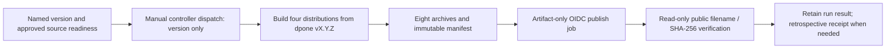
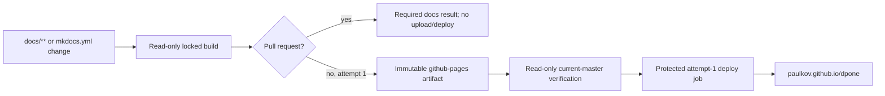

# Release and Pages automation

PyPI publication and documentation deployment are independent operations.
Use [Release](../release.md) for the current, copyable operator runbook and
[Agent release protocol](../agent-release-protocol.md) for scoped audit evidence.

## Ordinary PyPI publication path



The sole ordinary publisher is
`PaulKov/dpone-release-controller/.github/workflows/pypi-release.yml`.
It accepts `X.Y.Z` without `v`, uses environment `pypi`, and builds its own
archives from the matching dpone tag. It does not consume the source
repository's `release-candidates` artifact. There is no automatic source-to-
controller dispatch, token fallback, or `skip-existing` recovery.

The controller does not create a GitHub Release or a GHCR runtime image.
The source `release.yml` and `runtime-image.yml` are still active tag-triggered
workflows with separate gates and mutation paths. Their existence is not
permission to restore source-repository PyPI publishing. Do not claim they are
disabled, that their handoff message dispatches the controller, or that a
source-workflow green result proves controller publication.

## Trusted Publisher parity gate

The live PyPI tuple on every release project must be
`PaulKov` / `dpone-release-controller` / `pypi-release.yml` / `pypi`.
Follow the [current parity checklist](../release.md#trusted-publisher-parity-gate)
and retain current, credential-free provider observations. A source-code
configuration or old screenshot is not current permission evidence.
Do not restore `dpone/release.yml` or the retired controller writer as another
publisher; changing provider authority requires explicit authorization.

## Immutable and attempt-scoped workflow artifacts

For the current controller, retain the exact run ID, attempt, controller
revision, source tag/commit, and these non-overwriting artifacts:

| Operation | Artifacts | Interpretation |
| --- | --- | --- |
| Publication | `dpone-pypi-X.Y.Z`, `dpone-pypi-manifest-X.Y.Z` | Eight original archives and `release-manifest.json`; public verification result is in workflow logs/conclusion. |
| Artifact-only rehearsal | `dpone-pypi-rehearsal-X.Y.Z`, `dpone-pypi-rehearsal-receipt-X.Y.Z` | Build/hash/install proof, not PyPI upload or live publisher permission proof. |
| Retrospective verification | Local `retro_pypi_verification.json` and `fresh_install.log` | Read-only observation tied to original run/artifact identities and retained bytes. |

Controller artifacts currently have 14-day retention. Preserve original ZIPs
and provider digests before expiry. Never rebuild or repackage an expired
artifact and call it original evidence.

These names and retry semantics differ from the legacy source workflow's
`release-candidates` and attempt-scoped receipts. Do not carry its
`Re-run failed jobs` or same-version upload recipes into the controller.
On partial upload, uncertain dispatch, or failure, stop and reconcile the
original manifest against public state. Repeat only read-only verification
unless a distinct recovery action is explicitly approved.
See [Release and PyPI failures](runbooks.md#release-and-pypi-failures).

For an already published version, run `tools.retro_pypi_verification` in the
controller checkout using the [retrospective procedure](../release.md#verify-an-already-published-version).
Do not use a missing GitHub Release as evidence that PyPI publication failed.

## GitHub Pages path



The docs workflow:

- runs `uv sync --locked`, generated-reference checks, and strict MkDocs;
- gives PR builds only `contents: read`, with no Pages artifact or deploy
  authority;
- permits non-PR build/upload, current-master verification, and deployment only
  for provider run attempt `1`;
- verifies in a separate read-only job that current `refs/heads/master` is the
  exact `github.sha` before any deploy job receives authority;
- gives `pages: write` and `id-token: write` only to the protected deploy job;
- binds deploy to successful build and same-attempt verification outputs;
- serializes the whole build/verify/deploy sequence by PR number or ref, while
  cancelling only an older head of the same PR.

No Pages job uses `queue`. A newer non-PR run waits behind a running one and
then rechecks current master, so an obsolete subject cannot become the final
publication. A manual run can deploy only when its subject is current
`refs/heads/master`, attempt `1`, and all conditions succeed.

Local preview:

```bash
python -m pip install -r docs/requirements.txt
mkdocs serve
```

Production build:

```bash
mkdocs build --strict
```

## Pages runbook shortcuts

If the site is stale:

- Check the latest `docs` workflow run on `master`.
- Distinguish a successful deploy step from a skipped deploy job. GitHub may
  display a skipped job as check success; deployment is still
  `NOT_RUN/UNVERIFIED`.
- Check repository `Settings -> Pages` and confirm the source is GitHub Actions.
- Confirm the changed page is reachable from MkDocs nav or from an indexed docs page.

Never use `Re-run all jobs`, deploy-only rerun, or
`verify_current_master`-only rerun for a non-PR Pages run. Never delete,
overwrite, select, or reuse its immutable `github-pages` artifact. Fix the
cause, preserve the failed run, and use the versioned workflow-dispatch
procedure to create a new attempt-1 run on current `master`; validate the
returned new run ID and expected SHA. The copyable command and exact evidence
rules are in [Docs and GitHub Pages failures](runbooks.md#docs-and-github-pages-failures).

If Mermaid renders as code:

- Confirm `mkdocs.yml` has `pymdownx.superfences` with a `mermaid` custom fence.
- Confirm the diagram block starts with ```` ```mermaid ````.
- Run `mkdocs build --strict` and inspect generated HTML for `class="mermaid"`.
