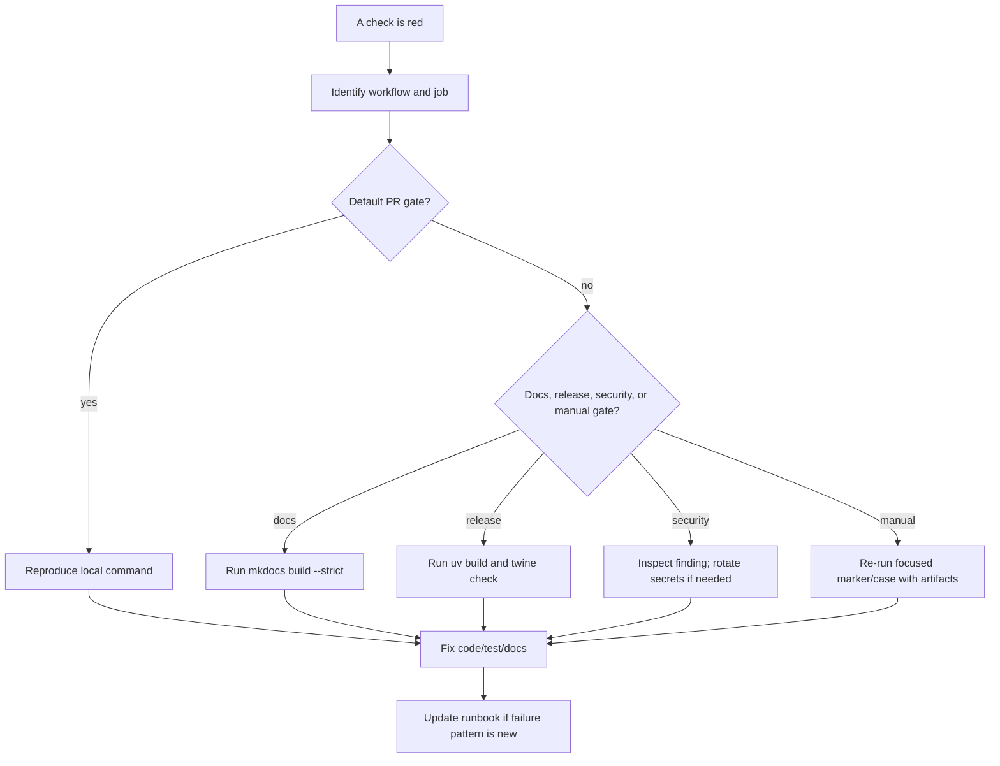

# CI/CD failure runbooks

## Exact-SHA candidate manifest is unverified

The local PR5A producer never authorizes CI, merge, release, or readiness. See
[Exact-SHA compatibility candidate](exact-sha-compatibility.md) for the strict
three-wheel command and recovery behavior. Rebuild unsafe or incomplete input
into a new directory and always select a new output path; do not edit, replace,
or promote an existing manifest.

Use this page when a GitHub Actions run is red or stuck. Start by identifying the workflow, job, and exact failing step. Do not treat all red checks the same: default PR CI, docs deploy, release publishing, manual matrix, and scheduled certification have different recovery paths.

## Triage flow



## Agent PR merge-receipt failures

Applies to `.github/workflows/agent-pr-receipt.yml` on both reviewed head `H`
and exact integration commit `C`.

Start with:

```bash
gh run view "<run-id>" --repo PaulKov/dpone --log-failed

# Reviewed-head H (`pull_request: opened|reopened|synchronize|edited`)
gh run download "<run-id>" \
  --repo PaulKov/dpone \
  --name agent-pr-receipt \
  --dir test_artifacts/agent-policy/failed-head-receipt
jq '.status, .errors' \
  test_artifacts/agent-policy/failed-head-receipt/agent_pr_receipt.json

# Integration commit C (`pull_request: closed`)
gh run download "<run-id>" \
  --repo PaulKov/dpone \
  --name agent-pr-receipt \
  --dir test_artifacts/agent-policy/failed-merge-receipt
jq '.status, .errors' \
  test_artifacts/agent-policy/failed-merge-receipt/agent_pr_merge_receipt.json
```

Retry only transient provider, timeout, or partial-download failures while the
original immutable source artifact remains available. A deterministic body,
path, parent, tree, policy, identity, digest, or provenance mismatch requires a
new reviewed PR; never edit or reconstruct evidence. The focused
[merge-receipt runbook](../agent-pr-merge-receipt-runbook.md) covers discovery,
exact-commit reconciliation, status semantics, and safe recovery.

For a receipt `STALE_HEAD`, do not rerun the old run: push or select the new
head and wait for its per-PR receipt. For `TIMEOUT`, first confirm that the
required checks and `agent-governance-gate` artifact target that same head; a
rerun is admissible only while the head is unchanged. A V2 policy-selection
failure means the V2 file or its immutable V1/amendment binding differs from
the approved profile. Revert the atomic V2 activation or obtain a new approved
amendment; V1 is historical evidence and must not be edited.

## CI quality failures

Applies to:

- `.github/workflows/ci.yml`
- Jobs named `Quality checks (3.11)`, `Quality checks (3.12)`
- Required jobs named `Doctor import Windows (3.11)`, `Doctor import Windows (3.12)`

### Shard receipt, coverage, or latency evidence fails

Download the artifact from the same workflow run and verify its head SHA,
Python version and all eight shard indexes before rerunning anything. A missing,
duplicate, cancelled, stale or mismatched receipt is a failing quality context;
do not replace it with a cache hit, another run's artifact, or a synthetic
check. For Python 3.12 also retain all eight raw coverage files and repair the
source failure before the existing ratchet is evaluated.

The 720-second performance claim needs exactly three successful, distinct
GitHub-hosted run attempts on one unchanged SHA. A cancellation, flake or
changed head restarts that evidence set. Diagnose capacity separately; it is
not a reason to lower the threshold or omit tests. See
[CI quality performance evidence](ci-performance-evidence.md).

### Required Windows doctor check fails or is missing

Use the exact PowerShell selector in
[the workflow reference](workflows.md#ci-quality-matrix). A deterministic
success/missing/load/receipt/timeout/public-shape failure requires a reviewed
code or test fix and a new PR head. A POSIX pass cannot replace either Windows
context.

For a transient hosted-runner or dependency-download outage, rerun only the
failed job on the same immutable head. If a context is absent, verify that the
`CI` workflow was triggered for that head and that the canonical
`.agents/policy/github-branch-protection.yml` names match the two matrix display
names. Do not publish a synthetic check, weaken branch protection, add a skip,
or route Windows through `governance-source`.

For a PR that introduces new required contexts, synchronize the live ruleset
during one coordinated same-PR window. First freeze the final reviewed head and
wait until both exact Windows contexts and every previously required context
have reported successfully on that head. The maintainer then applies the
reviewed canonical policy projection, verifies zero drift and exactly twenty-one
App-bound contexts, obtains the final `Agent PR receipt`, and merges promptly.
Do not change the head inside this window; any new commit invalidates the
evidence and restarts the sequence. Until the live projection and final receipt
are both verified, release authority is `UNVERIFIED`.

### Locked sync reports a stale or missing lock

CI deliberately runs `uv sync --locked --all-extras`; Pages uses
`uv sync --locked`. Neither command may rewrite `uv.lock`.

Reproduce and repair an intended dependency change:

```bash
uv lock --check
uv lock
git diff -- pyproject.toml uv.lock
uv sync --locked --all-extras
```

Review both project metadata and lock bytes before committing. If the change
was not intended, restore the metadata change instead of committing a generated
lock update. A missing or stale lock is FAIL, not an invitation to replace
`--locked` with `--frozen` or an unlocked sync.

### Ruff lint fails

Reproduce:

```bash
uv run ruff check .
```

Fix:

- Prefer small explicit code fixes over broad suppressions.
- If a rule is noisy for a whole category, document the rule change in the PR.
- Do not hide connector optional-import failures behind `# noqa` unless the lazy import contract is still covered by tests.

### Ruff format fails

Reproduce:

```bash
uv run ruff format --check .
```

Fix:

```bash
uv run ruff format <changed-python-files>
```

Then re-run the format check.

### Mypy fails

Reproduce:

```bash
uv run mypy --config-file mypy.ini
```

Fix:

- Keep public models typed at boundaries.
- Prefer Protocols and small adapters over `Any` spreading through runtime code.
- If a third-party library lacks types, isolate the import in the connector adapter.

### Pytest fails

Reproduce the full default test step:

```bash
uv run pytest -m "not integration_live" --cov=src/dpone --cov-report=xml
```

Focused reproduction:

```bash
uv run pytest path/to/test_file.py::test_name -q
```

Fix:

- If the failure is a docs contract, update docs and code together.
- If the failure is optional import safety, keep dependency imports lazy.
- If the failure is integration marker skip behavior, check marker/env docs before changing runtime behavior.

### Coverage fails

The default gate requires repository coverage above the configured minimum.

Fix:

- Add focused tests for new branches or public contracts.
- Avoid deleting coverage expectations just to pass CI.
- For broad generated docs changes, coverage should not change; investigate accidental runtime edits.

### Package build fails

Reproduce:

```bash
uv build
```

Fix:

- Check `pyproject.toml` metadata and package include rules.
- Check optional extras for invalid dependency names or private indexes.
- Run `uv run twine check dist/*` after build metadata changes.

## Required Dependabot label is missing or unverified

The `dependencies`, `python:uv`, and `github-actions` labels are owner-managed.
Repository automation does not create them. Verify an active `github.com`
session without printing account or token details, then perform these exact
read-only requests:

```bash
set -euo pipefail
if ! gh auth status --active --hostname github.com >/dev/null 2>&1; then
  echo "UNVERIFIED: active github.com authentication is unavailable." >&2
  exit 1
fi

if ! actual="$(
  for label in dependencies python%3Auv github-actions; do
    value="$(
      gh api --hostname github.com \
        "repos/PaulKov/dpone/labels/${label}" --jq '.name' 2>/dev/null
    )" || exit 1
    printf '%s\n' "${value}"
  done
)"; then
  echo "UNVERIFIED: exact GitHub label readback failed." >&2
  exit 1
fi

expected=$'dependencies\npython:uv\ngithub-actions'
if [[ "${actual}" != "${expected}" ]]; then
  echo "UNVERIFIED: GitHub label names or ordering differ from the approved contract." >&2
  exit 1
fi
printf '%s\n' "${actual}"
```

Success writes exactly the three names in that order to stdout and nothing to
stderr. Authentication failure makes zero API calls. Any API error, missing or
case-variant name, extra stdout, or nonzero exit is `UNVERIFIED` and blocks the
label-dependent change. An authorized owner restores the exact label; then run
the complete probe again. Never accept a fallback label.

## Collect and verify PR3A label evidence

For PR3A, retain the timestamped provider observation at
`test_artifacts/ci-shadow-pr3a-live/label-readback-evidence.json`. The v3
receipt preserves bounded response bytes and metadata for diagnostics, but
label readiness depends only on the three exact ordered names. Provider IDs,
descriptions, colors, response formatting, CLI version, timestamps, and other
metadata cannot recolor the decision.

Collect the receipt only through the checked-in read-only producer:

```bash
PR_NUMBER="${PR_NUMBER:?export the positive pull-request number}"
IMPLEMENTATION_BASE="${IMPLEMENTATION_BASE:?export the exact approved 40-hex implementation base}"
if [[ ! "${PR_NUMBER}" =~ ^[1-9][0-9]*$ ]] || \
   [[ ! "${IMPLEMENTATION_BASE}" =~ ^[0-9a-f]{40}$ ]]; then
  echo "UNVERIFIED: PR_NUMBER or IMPLEMENTATION_BASE is invalid." >&2
  exit 1
fi
if ! object_type="$(git cat-file -t "${IMPLEMENTATION_BASE}" 2>/dev/null)" || \
   [[ "${object_type}" != "commit" ]]; then
  echo "UNVERIFIED: IMPLEMENTATION_BASE is not a local commit." >&2
  exit 1
fi
if ! git merge-base --is-ancestor "${IMPLEMENTATION_BASE}" HEAD; then
  echo "UNVERIFIED: IMPLEMENTATION_BASE is not an ancestor of HEAD." >&2
  exit 1
fi
uv run python tools/ci/pr3a_label_readback_evidence.py collect \
  --output test_artifacts/ci-shadow-pr3a-live/label-readback-evidence.json \
  --pull-request "${PR_NUMBER}" \
  --implementation-base "${IMPLEMENTATION_BASE}"
```

Success prints exactly
`wrote verified PR3A label evidence: test_artifacts/ci-shadow-pr3a-live/label-readback-evidence.json`.
Verify committed-byte integrity, then re-read the current exact names immediately
before merge:

```bash
uv run python tools/ci/pr3a_label_readback_evidence.py verify \
  --input test_artifacts/ci-shadow-pr3a-live/label-readback-evidence.json
uv run python tools/ci/pr3a_label_readback_evidence.py verify-live \
  --input test_artifacts/ci-shadow-pr3a-live/label-readback-evidence.json
```

The collector and live verifier force hostile ambient
`GH_HOST=attacker.example` while every authentication/API call explicitly
selects `github.com`. Missing authentication, API failure, a
foreign/case-variant name, corrupt receipt, or malformed JSON returns exit `1`,
empty stdout, and one `UNVERIFIED:` line on stderr. Diagnostic metadata drift
does not block readiness. Record the evidence Git blob, file SHA-256,
observation time, repository/host, ordered names, and result in the PR body and
issue #512; terminal output by itself is not durable evidence.

## Changed-workflow actionlint failures

The changed-workflow gate uses actionlint `1.7.12`. Before diagnosis, require
the first line of `actionlint -version` to be exactly `1.7.12`. The official
archive SHA-256 values are:

- Linux amd64: `8aca8db96f1b94770f1b0d72b6dddcb1ebb8123cb3712530b08cc387b349a3d8`;
- Darwin arm64: `aba9ced2dee8d27fecca3dc7feb1a7f9a52caefa1eb46f3271ea66b6e0e6953f`.

Copyable Linux-amd64/Darwin-arm64 installation into a new temporary directory:

```bash
set -euo pipefail
ACTIONLINT_VERSION=1.7.12
case "$(uname -s)-$(uname -m)" in
  Linux-x86_64)
    ACTIONLINT_PLATFORM=linux_amd64
    ACTIONLINT_ARCHIVE_SHA=8aca8db96f1b94770f1b0d72b6dddcb1ebb8123cb3712530b08cc387b349a3d8
    ;;
  Darwin-arm64)
    ACTIONLINT_PLATFORM=darwin_arm64
    ACTIONLINT_ARCHIVE_SHA=aba9ced2dee8d27fecca3dc7feb1a7f9a52caefa1eb46f3271ea66b6e0e6953f
    ;;
  *)
    echo "unsupported actionlint platform" >&2
    exit 1
    ;;
esac
ACTIONLINT_DIR="$(mktemp -d)/actionlint-${ACTIONLINT_VERSION}"
mkdir "${ACTIONLINT_DIR}"
ACTIONLINT_ARCHIVE="${ACTIONLINT_DIR}/actionlint_${ACTIONLINT_VERSION}_${ACTIONLINT_PLATFORM}.tar.gz"
curl --fail --silent --show-error --location --proto '=https' --tlsv1.2 \
  --output "${ACTIONLINT_ARCHIVE}" \
  "https://github.com/rhysd/actionlint/releases/download/v${ACTIONLINT_VERSION}/actionlint_${ACTIONLINT_VERSION}_${ACTIONLINT_PLATFORM}.tar.gz"
if command -v sha256sum >/dev/null; then
  printf '%s  %s\n' "${ACTIONLINT_ARCHIVE_SHA}" "${ACTIONLINT_ARCHIVE}" \
    | sha256sum --check --status
else
  printf '%s  %s\n' "${ACTIONLINT_ARCHIVE_SHA}" "${ACTIONLINT_ARCHIVE}" \
    | shasum -a 256 --check --status
fi
LC_ALL=C tar -xOf "${ACTIONLINT_ARCHIVE}" actionlint \
  > "${ACTIONLINT_DIR}/actionlint.tmp"
if [[ "${ACTIONLINT_PLATFORM}" == linux_amd64 ]]; then
  test "$(wc -c < "${ACTIONLINT_DIR}/actionlint.tmp" | tr -d ' ')" = 6074530
  printf '%s  %s\n' \
    c872d6db8c6bf83a8eaa704fc93999f027d55dffbc63b8a6abdccb47df5f4cd4 \
    "${ACTIONLINT_DIR}/actionlint.tmp" | sha256sum --check --status
fi
chmod 0755 "${ACTIONLINT_DIR}/actionlint.tmp"
mv "${ACTIONLINT_DIR}/actionlint.tmp" "${ACTIONLINT_DIR}/actionlint"
test "$("${ACTIONLINT_DIR}/actionlint" -version | sed -n '1p')" = "${ACTIONLINT_VERSION}"
printf 'ACTIONLINT=%s\n' "${ACTIONLINT_DIR}/actionlint"
```

Use the printed absolute path for the invocations below; do not move the binary
into the repository. CI requires the same Linux member size and binary digest.

Use the checksum-pinned installation from the
[Developer CI/CD guide](../developer-ci-cd.md#pinned-actionlint-for-changed-workflows).
A missing binary, version/checksum mismatch, extraction failure, or unexpected
stream byte is FAIL before lint interpretation.

Every invocation uses:

```text
-no-color -format '{{json .}}' -shellcheck '' -pyflakes ''
```

For changed workflows other than the nightly wrapper, success is exit `0`,
stdout exactly `[]\n`, and empty stderr. The nightly wrapper is checked twice
because released 1.7.12 does not yet parse `concurrency.queue`:

1. Unwaived: exit `1`, empty stderr, and exactly one `syntax-check` JSON object
   for `.github/workflows/airflow-pack-compat-nightly.yml`, with full message
   `unexpected key "queue" for "concurrency" section. expected one of
   "cancel-in-progress", "group"`.
2. Waived: add only
   `-ignore '^unexpected key "queue" for "concurrency" section\. expected one of "cancel-in-progress", "group"$'`;
   require exit `0`, stdout exactly `[]\n`, and empty stderr.

Any other diagnostic must be fixed in the original workflow; never broaden the
ignore. If the unwaived invocation exits `0`, stop with
`ACTIONLINT_QUEUE_WAIVER_OBSOLETE` and remove the waiver plus its expected-error
branch in the same approved update. Do not switch to a floating release,
unreleased commit, or upstream branch.

## PostgreSQL XMin integration failures

Applies to the `postgres-xmin` job in `.github/workflows/ci.yml`.

Reproduce against a local Postgres service:

```bash
DPONE_RUN_INTEGRATION=1 \
DPONE_IT_PG_HOST=127.0.0.1 \
DPONE_IT_PG_PORT=5432 \
DPONE_IT_PG_DATABASE=dpone_it \
DPONE_IT_PG_USER=dpone \
DPONE_IT_PG_PASSWORD=dpone \
uv run pytest -m integration_postgres_xmin tests/integration/postgres -q
```

Common causes:

- Postgres service is not healthy yet.
- XMin strategy selector changed without updating tests/docs.
- State persistence changed and the test can no longer resume from the expected XMin state.
- Physical delete expectations were added without reconciliation or CDC behavior.

Fix:

- Keep XMin Postgres-only; non-Postgres sources must fail fast when XMin is explicitly selected.
- Preserve state transition order: extract, load, quality/reconciliation, then state commit.
- Update [Postgres XMin](../postgres-xmin.md) when algorithm behavior changes.

## Docs and GitHub Pages failures

Applies to `.github/workflows/pages.yml`.

Reproduce:

```bash
uv sync --locked
uv run dpone docs check-generated-references
uv run mkdocs build --strict
```

Common causes:

- Broken relative link.
- File added but not linked from nav or documentation index.
- Mermaid fence config broken.
- Markdown heading/link mismatch.
- MkDocs dependency drift.

Fix:

- Add new public pages to [Documentation index](../README.md), `mkdocs.yml`, or an existing section index.
- Keep Mermaid as fenced blocks using ```` ```mermaid ````.
- Do not use unsafe YAML tags in `mkdocs.yml`; pre-commit `check-yaml` must pass.
- If GitHub Pages deploy succeeds but site content is old, check that the `docs` workflow completed on `master` and Pages source is GitHub Actions.

### Interpret the provider result before recovery

- A PR may rerun its read-only build; it never uploads, configures, or deploys
  Pages.
- Every non-PR upload, `verify_current_master`, and deploy job is attempt-1
  only. `Re-run all jobs`, deploy-only rerun, and verification-only rerun are
  forbidden recovery paths.
- A stale master SHA or unavailable/malformed current-master lookup blocks
  deploy. The lookup explicitly binds `gh api --hostname github.com`; ambient
  `GH_HOST` is never freshness authority. Preserve that run.
- A skipped deploy can be displayed as check success. Its deployment outcome is
  `NOT_RUN` and evidence is `UNVERIFIED`, never deployment PASS.
- A valid PASS requires the authenticated exact attempt-1 run and its unique
  `Deploy GitHub Pages documentation` job, including the successful pinned
  `Deploy Pages` step. Workflow success, environment state, an older Pages
  record, or another run with the same SHA is insufficient.

For any non-PR build, upload, freshness, or deployment failure, fix the cause
and dispatch a new run on current `master`. The failed prior run ID must be a
positive integer. Install `gh` and `jq`, authenticate `gh` to `github.com` with
approved Actions-write access to `PaulKov/dpone`, export `PRIOR_RUN_ID`, and run:

```bash
set -euo pipefail
API_VERSION=2026-03-10
: "${PRIOR_RUN_ID:?export PRIOR_RUN_ID as the failed positive integer}"
[[ "${PRIOR_RUN_ID}" =~ ^[1-9][0-9]*$ ]]
command -v gh >/dev/null
command -v jq >/dev/null
gh auth status --active --hostname github.com >/dev/null 2>&1
workflow_json="$(
  gh api --hostname github.com \
    -H "X-GitHub-Api-Version: ${API_VERSION}" \
    repos/PaulKov/dpone/actions/workflows/pages.yml
)"
WORKFLOW_ID="$(
  jq -er '
    select(.path == ".github/workflows/pages.yml" and .state == "active")
    | .id | select(type == "number" and . > 0 and . == floor) | tostring
  ' <<<"${workflow_json}"
)"
[[ "${WORKFLOW_ID}" =~ ^[1-9][0-9]*$ ]]
MASTER_SHA="$(
  gh api --hostname github.com \
    -H "X-GitHub-Api-Version: ${API_VERSION}" \
    repos/PaulKov/dpone/git/ref/heads/master \
    --jq '.object.sha'
)"
[[ "${MASTER_SHA}" =~ ^[0-9a-f]{40}$ ]]
dispatch_json="$(
  gh api --hostname github.com --method POST \
    -H "X-GitHub-Api-Version: ${API_VERSION}" \
    "repos/PaulKov/dpone/actions/workflows/${WORKFLOW_ID}/dispatches" \
    -f ref=master
)"
RUN_ID="$(
  jq -er '
    .workflow_run_id
    | select(type == "number" and . > 0 and . == floor) | tostring
  ' \
    <<<"${dispatch_json}"
)"
[[ "${RUN_ID}" =~ ^[1-9][0-9]*$ ]]
RUN_URL="$(jq -er '.run_url | select(type == "string")' <<<"${dispatch_json}")"
HTML_URL="$(jq -er '.html_url | select(type == "string")' <<<"${dispatch_json}")"
[[ "${RUN_ID}" != "${PRIOR_RUN_ID}" ]]
[[ "${RUN_URL}" == "https://api.github.com/repos/PaulKov/dpone/actions/runs/${RUN_ID}" ]]
[[ "${HTML_URL}" == "https://github.com/PaulKov/dpone/actions/runs/${RUN_ID}" ]]
printf 'PAGES_RECOVERY_RUN_ID=%s\n' "${RUN_ID}"
printf 'PAGES_RECOVERY_EXPECTED_SHA=%s\n' "${MASTER_SHA}"
```

The command validates all local and provider prerequisites before dispatch and
prints exactly two success lines only after the returned positive run ID and
both repository URLs validate. Every API call binds `--hostname github.com`, so
an ambient `GH_HOST` cannot redirect the mutation. If the POST succeeds but its
response is malformed, status is `UNVERIFIED`: preserve the response, inspect
the repository run list, and do not blindly repeat the POST.

Observe the returned run ID and require repository `PaulKov/dpone`, the numeric
workflow ID and active path `.github/workflows/pages.yml`, event
`workflow_dispatch`, provider `head_branch == "master"`, attempt `1`, and
`head_sha == PAGES_RECOVERY_EXPECTED_SHA`. The workflow-run API has no `ref`
field; authenticated workflow conditions own the exact
`refs/heads/master` authorization. Missing, prior, foreign, duplicate, or
partially observed identity is `UNVERIFIED`. Never select, delete, overwrite, or
reuse the prior run's immutable `github-pages` artifact.

## Verify Pages deployment evidence

This procedure is certification-only and read-only. It never dispatches,
reruns, cancels, deletes, overwrites, configures, or deploys anything. Run it
only against the exact successful Pages recovery/current-master run after the
workflow has completed. Its required output is:

```text
test_artifacts/ci-shadow-pr3a-live/pages-deployment-evidence.json
```

The hosted observer must fail closed unless it authenticates all of these
boundaries from GitHub provider responses:

1. Fetch the exact run and bind repository `PaulKov/dpone`, positive workflow
   ID, exact run ID, `run_attempt == 1`, event, provider-visible
   `head_branch == "master"`, and exact 40-hex `head_sha`.
2. Resolve that workflow ID to the active path
   `.github/workflows/pages.yml`; fetch that one regular file at the exact run
   `head_sha`, strictly decode its base64 bytes, and match the returned Git blob
   identity. Parse duplicate-free YAML with aliases and unknown job/step
   structure rejected.
3. From those authenticated workflow bytes require deploy display name
   `Deploy GitHub Pages documentation`, ordered provider step number `3` named
   `Deploy Pages`, and exact action pin
   `actions/deploy-pages@cd2ce8fcbc39b97be8ca5fce6e763baed58fa128`.
4. Completely paginate
   `GET /repos/PaulKov/dpone/actions/runs/{run_id}/attempts/1/jobs?per_page=100`.
   Partial, repeated, missing, API-failed, or ambiguous pagination is
   `UNVERIFIED`; an ordinary run-level jobs list or only the first page is not
   evidence.
5. Select exactly one provider job by the authenticated display name and bind
   its positive job ID. Require job conclusion `success` and exactly the
   provider-visible step name `Deploy Pages`, step number `3`, conclusion
   `success`. Missing, duplicate, skipped, nonterminal, or foreign jobs/steps
   are `UNVERIFIED`, not PASS.

The JSON artifact records the authenticated repository, workflow path/ID/blob
and content URLs, run API/HTML URLs, run ID/attempt/event/head branch/SHA, every
Jobs-page URL used, selected job ID/URL, action pin, step identity/conclusion,
decision, and non-PASS reason. Do not place credentials or response headers in
the artifact. A skipped deploy check remains `NOT_RUN/UNVERIFIED` even if the
provider UI labels the check successful.

After the observer writes the closed JSON, validate and hash the exact bytes:

```bash
set -euo pipefail
EVIDENCE=test_artifacts/ci-shadow-pr3a-live/pages-deployment-evidence.json
test -s "${EVIDENCE}"
jq -e '.decision == "PASS"' "${EVIDENCE}" >/dev/null
sha256sum "${EVIDENCE}"
```

The PR body records that output SHA-256 and the provider URLs already bound in
the JSON (workflow contents/blob, exact run API/HTML, every paginated Jobs
request, and selected job). Record the exact-head hosted check/run IDs beside
them. Focused mocked tests prove parser and failure semantics only: they are
never hosted Pages deployment PASS. Without current provider-authenticated
responses, report this certification `UNVERIFIED` or `SKIP` with the reason.

## Dependency Review failures

The native `Dependency Review` job runs read-only on a PR test-merge and again
on the exact pushed `master` commit. It rejects new high or critical advisories.
The two subjects are independent; one result cannot relabel the other.

- An authenticated terminal advisory failure is FAIL. Remediate the dependency
  or change dependency policy in a separate reviewed change.
- If an existing eligible run failed because of a transient provider problem,
  rerun that exact run ID. Preserve the interrupted attempt as
  `UNVERIFIED` until an authenticated native conclusion exists.
- If the PR run is absent, create a new reviewed PR head/event after provider
  recovery. The missing subject stays `UNVERIFIED`.
- If the exact-master run is absent and no run ID exists, use a new reviewed
  successor commit as the release candidate after provider recovery. The
  original exact commit remains `UNVERIFIED` for Dependency Review.

There is no manual dispatch, arbitrary-ref input, PR comment, `checks: write`,
or synthetic check-run backfill. Never use `gh api` or another workflow to
publish a substitute success.

## Release and PyPI failures

For ordinary publication, inspect the exact run in
`PaulKov/dpone-release-controller`, workflow `pypi-release.yml`.
The source repository's `release.yml` does not upload to PyPI or automatically
dispatch that controller. Follow [Release](../release.md), not a legacy
same-version retry or source-publisher restoration recipe.

### Trusted Publisher parity is missing

Before an authorized dispatch, inspect every project's live PyPI publishing
settings. The exact tuple is `PaulKov` / `dpone-release-controller` /
`pypi-release.yml` / `pypi` for all four projects. See the
[Trusted Publisher parity gate](release-and-pages.md#trusted-publisher-parity-gate).

Record current credential-free evidence. Missing access or configuration is
`UNVERIFIED` and blocks production dispatch. Do not probe with a tag/upload,
restore `dpone/release.yml` or the historical controller writer, or inject an
API token. A configuration change requires explicit provider authorization;
an old inventory does not prove current permissions.

### PyPI upload succeeds but installers cannot see the version

Version-specific JSON may expose the correct files before the Simple API or
unversioned package index is updated. The controller checks the former, not
public resolver visibility.

1. Preserve the exact controller run/attempt, original artifact ZIP, and
   `release-manifest.json`.
2. Use the controller's read-only `tools.retro_pypi_verification` with the
   original run/artifact identities to reconcile public archive bytes; see
   [the retrospective procedure](../release.md#verify-an-already-published-version).
   It requires a successful overall controller run. If only the upload job
   succeeded but `verify-published` failed, the CLI cannot yield PASS for that
   failed run. Keep any manual manifest/API comparison diagnostic; a change
   to that verifier/recovery contract needs separate approval.
3. For public installability, run the separate bounded diagnostic:

```bash
uv run python tools/pypi_release_smoke.py \
  --package dpone \
  --version X.Y.Z \
  --install-smoke \
  --timeout-seconds 900
```

4. If only `version_json` passes, report index/resolver visibility as
   incomplete. Do not claim the package is publicly installable based only on
   matching JSON hashes or an install of retained wheel files.
5. Repeat only read-only verification after propagation or access recovers.
   Do not rerun publication, upload missing files, or create a GitHub Release
   as a substitute for evidence.

A failed or uncertain upload may be partial: PyPI accepts files individually.
Stop and preserve all observations. No automatic `skip-existing`, subset
upload, deletion/recreation, or replacement archive is authorized. Reconcile
the original manifest and obtain an explicit recovery decision; use a new
version if new bytes are required.

### Build and metadata failures

Use the [four-package local build and archive checks](../release.md#pre-release-checks)
in a clean disposable checkout. Common causes are a missing/mismatched source
tag, inconsistent project versions, missing distributions, invalid metadata,
publisher mismatch, or an already occupied PyPI version.

The active controller accepts only numeric `X.Y.Z` and checks out the fixed
`vX.Y.Z` source tag. Rehearsal validates build/hash/install behavior without
upload authority; it does not prove live publisher permissions.
Source-workflow candidates are not the controller's publish artifact.

On failure retain the original run and artifacts. Never move an existing tag,
rebuild retained evidence, restore a second publisher, or treat an uncertain
dispatch acknowledgement as permission for another dispatch. Inspect the
matching run identity before deciding what, if anything, to retry.

## Secret scan failures

Applies to `.github/workflows/secret-scan.yml`.

If TruffleHog reports a verified secret:

1. Treat it as compromised.
2. Revoke and rotate the credential before further public release work.
3. Remove the secret from the file, test artifact, or docs page.
4. If the secret is in public git history, coordinate history rewrite separately and document the incident.
5. Add a regression check if the pattern can recur.

Do not silence verified secret findings to make CI green.

## Semantic PR privilege boundary

Applies to the `Workflow security policy` step in `.github/workflows/ci.yml`,
the standalone PR3B scanner, CodeQL's closed PR upload profile, and the
`governance-source` -> `governance-attestation` evidence route.

### Discover and reproduce

On an immutable checkout, prepare the locked environment once:

```bash
uv sync --locked --all-extras
```

Preparation may access the network, write `.venv` or the uv cache, and use
stderr. It is outside the scanner process contract. After preparation, this
strict uv convenience command disables sync, network access, and Python
downloads for the invocation:

```bash
uv run --locked --no-sync --offline --no-python-downloads python -B \
  tools/agent_policy/workflow_security_privileged.py \
  --root . \
  --format text
```

For exact report and stream evidence, bypass the uv wrapper and invoke the
prepared interpreter directly:

```bash
.venv/bin/python -B tools/agent_policy/workflow_security_privileged.py \
  --root . \
  --format text
.venv/bin/python -B tools/agent_policy/workflow_security_privileged.py \
  --root . \
  --format json
```

The direct scanner process is read-only, credential-free, and performs no
network access or file creation. Those guarantees begin at Python process start
and do not cover uv preparation or wrapper behavior.

The expected text shape on the current safe repository is:

```text
status=PASS complete=true workflows=39 jobs=85 edges=77 roots=11 routes=210
finding_count=0
runbook=docs/cicd/runbooks.md#semantic-pr-privilege-boundary
recheck=uv run python tools/agent_policy/workflow_security_privileged.py --root . --format text
```

Counts describe the checked-out bytes and may grow after a reviewed workflow
change. The contract is the field order, complete evidence, empty findings, the
stable runbook path, and recheck command. JSON is one canonical compact object
followed by one newline. Repeated scans of identical bytes must be byte-for-byte
identical.

The frozen bare `recheck=uv run python ...` report line is intentionally
unchanged. It is a convenience for an already-prepared environment, not the
exact evidence invocation, and it does not make uv setup or wrapper output part
of the scanner contract.

Interpret the direct-interpreter result before editing:

| Status | Exit | Streams | Operator decision |
| --- | --- | --- | --- |
| `PASS` | `0` | report on stdout; empty stderr | Local static proof only; still require hosted exact-head checks and receipts. |
| `FAIL` | `1` | schema-valid report on stdout; empty stderr | A deterministic forbidden authority or exact-profile drift blocks integration. |
| `UNVERIFIED` | `1` | schema-valid report on stdout; empty stderr | The bounded scanner could not prove safety; integration remains blocked. |
| CLI usage error | `2` | no stdout; argparse diagnostic on stderr | Correct the invocation; `--root` is required and format is `text` or `json`. |
| Internal report failure | `3` | no stdout; fixed diagnostic on stderr | Preserve the exact head and escalate as an implementation defect. |

Aggregate precedence is `FAIL` over `UNVERIFIED` over `PASS`. For a non-pass,
read each sorted `finding[NNNN]` JSON object. Follow `route_id` through the root,
edge chain, endpoint job, effective permission source, runner, secret, and
environment evidence before applying the named recovery.

### Finding and recovery reference

| Finding code | Status | Recovery command ID | Safe recovery |
| --- | --- | --- | --- |
| `PRIVILEGE_PULL_REQUEST_TARGET` | `FAIL` | `REMOVE_PULL_REQUEST_TARGET` | Remove the privileged `pull_request_target` root; use a read-only `pull_request` design. |
| `PRIVILEGE_UNAPPROVED_PR_WRITE` | `FAIL` | `REDUCE_OR_ISOLATE_PR_AUTHORITY` | Remove write/OIDC authority or isolate it in an already-approved exact source-free profile. |
| `PRIVILEGE_PR_SECRET_OR_ENVIRONMENT` | `FAIL` | `REMOVE_PR_SECRET_AUTHORITY` | Remove PR secrets, inherited secrets, and environments from the reachable route. |
| `PRIVILEGE_PR_SELF_HOSTED` | `FAIL` | `USE_GITHUB_HOSTED_PR_RUNNER` | Move the reachable job to the exact GitHub-hosted runner required by its profile. |
| `PRIVILEGE_WRITE_ALL` | `FAIL` | `REPLACE_WRITE_ALL` | Replace `write-all` with the smallest explicit mapping. |
| `PRIVILEGE_READ_ALL` | `FAIL` | `REPLACE_READ_ALL` | Replace `read-all` with the smallest explicit read mapping. |
| `PRIVILEGE_CODEQL_PROFILE_DRIFT` | `FAIL` | `RESTORE_CODEQL_PROFILE` | Restore the exact action-only job, trigger, permissions, pins, order, and inputs; then rerun hosted CodeQL. |
| `PRIVILEGE_ADR0037_PROFILE_DRIFT` | `FAIL` | `RESTORE_ADR0037_PROFILE` | Restore the approved read-only producer/source-free finalizer or merged-closure profile. Never restore the historical privileged `quality` job. |
| `PRIVILEGE_DYNAMIC_OR_EXTERNAL_EDGE` | `UNVERIFIED` | `BOUND_WORKFLOW_EDGE` | Replace a dynamic/external/missing workflow edge with a bounded local reviewed edge, or remove it. |
| `PRIVILEGE_UNKNOWN_EXPRESSION` | `UNVERIFIED` | `SIMPLIFY_PRIVILEGE_GUARD` | Express the privileged guard in the scanner's closed, three-valued subset so non-PR reachability is provable. |
| `PRIVILEGE_UNKNOWN_PERMISSION` | `UNVERIFIED` | `UPDATE_PERMISSION_CONTRACT` | Remove the unknown scope or introduce it through a separately reviewed policy/schema update. |
| `PRIVILEGE_INVALID_POLICY` | `UNVERIFIED` | `REPAIR_PRIVILEGE_POLICY` | Restore the closed policy and schema-valid exact identities; do not add an override. |
| `PRIVILEGE_INVALID_WORKFLOW` | `UNVERIFIED` | `REPAIR_WORKFLOW_SYNTAX` | Repair strict YAML, duplicate keys, missing explicit permissions, or unsupported workflow structure. |
| `PRIVILEGE_RESOURCE_LIMIT` | `UNVERIFIED` | `REDUCE_OR_PARTITION_WORKFLOWS` | Reduce or split the graph/input so the complete snapshot fits the closed bounds. |
| `PRIVILEGE_CONCURRENT_MUTATION` | `UNVERIFIED` | `RERUN_IMMUTABLE_CHECKOUT` | Stop concurrent writes and rerun from an immutable exact checkout. |

No finding is recoverable by widening
`.agents/policy/workflow-security.yml`, copying a closed profile, editing only a
test fixture, or adding an ignore flag. The legacy allowlist cannot override a
semantic result.

For `invalid workflow_call inputs`, keep the caller literal-only: remove
`strategy` and input expressions, replace `secrets: inherit` with an explicit
named map, pass every required declared input/secret, and match each declared
`boolean`, `number`, or `string` exactly (`true` is not a number). Use only
`name`, `uses`, `with`, `secrets`, `needs`, `if`, `concurrency`, and
`permissions`. An explicit secret map can repair the call shape, but a
PR-reachable secret still produces `PRIVILEGE_PR_SECRET_OR_ENVIRONMENT`; move
that operation off the PR route. If matrix or dynamically typed inputs are
required, treat the route as `UNVERIFIED` pending a reviewed typed-expression
extension rather than weakening the policy. A copyable safe pair is in the
[developer checklist](../developer-ci-cd.md#calling-a-local-reusable-workflow-safely).

### Governance source/finalizer recovery

`quality` and `governance-source` must remain read-only. The producer checks out
the exact candidate, creates one governance JSON subject, and uploads it once
with provider artifact ID and digest outputs. The finalizer must remain
source-free and action-only: download exactly that same-run artifact by ID with
digest mismatch set to error, then attest exactly the downloaded JSON file.

If the producer fails, repair its read-only checkout, setup, governance command,
or upload. If the finalizer fails, verify the producer artifact ID/digest and
restore the exact two pinned actions, paths, inputs, permissions, and `needs`
edge. Do not add checkout, `run`, cache, setup, installation, local actions,
secrets, environments, cross-run tokens, repository overrides, or a glob
subject to the finalizer. Attestation proves byte provenance only; the Agent PR
receipt still validates semantic content and reviewed-head identity.

Emergency containment may disable the finalizer while preserving the read-only
producer. This intentionally makes attestation unavailable and causes mandatory
profile drift, so integration remains blocked. Green recovery is restoration of
the exact approved finalizer or a prior separately approved ADR 0037 amendment.
Never restore `attestations: write` or `id-token: write` to `quality` or any job
that executes repository-controlled code.

### CodeQL recovery and migration

CodeQL is exactly one GitHub-hosted job with checkout credentials disabled,
pinned init/analyze actions, Python as the only language, and only
`contents: read` plus `security-events: write`. The old repository-controlled
`.github/codeql/codeql-config.yml` filter is deliberately removed. If default
queries expose a new alert, fix the data/control flow or document a narrow
provider-supported disposition; do not restore the custom config, insert a
repository command, or suppress the alert by weakening the profile. An
action-pin update is a separately reviewed closed-profile contract change.
Synchronize `.github/workflows/codeql.yml`, the semantic `profiles.codeql`
policy entry, its policy-schema `const`, the trusted report binding in
`workflow_privilege_profiles.py`, and producer-owned fixtures, contracts, and
certification. Then run profile, schema, report, and mutation tests, two
byte-identical scans, and hosted exact-head CodeQL evidence.

### Internal failure and umbrella compatibility

Standalone report construction or schema validation failure exits `3`, writes
no stdout, and writes exactly this one stderr line with no traceback:

```text
PRIVILEGE_INTERNAL_REPORT_INVALID: report construction or schema validation failed
```

Rerun the exact direct text command on the immutable head:

```bash
.venv/bin/python -B tools/agent_policy/workflow_security_privileged.py \
  --root . \
  --format text
```

If exit `3` repeats, record the commit, command, exit, empty stdout, and fixed
stderr; escalate to the maintainer and keep integration blocked. Do not relabel
it as a policy finding or widen a policy/fixture to hide it.

The compatibility umbrella remains:

```bash
.venv/bin/python -B tools/agent_policy/workflow_security.py . --format json
```

Its root defaults to `.`, while `--policy` and `--workflows-dir` are
CWD-relative legacy general-linter overrides only. They do not redirect the
fixed semantic snapshot or fixed `release`/`runtime-image` SS-47 inputs (`.yml`
and `.yaml`). Review the
[umbrella input flow](workflows.md#semantic-pr-privilege-boundary) before using
an override.

It appends each standalone `FAIL` or `UNVERIFIED` finding after existing legacy
errors as `semantic-pr-privilege=<canonical-finding-json>`, leaves warnings
unchanged, reports `status="failed"`, and exits `1`. If the semantic service,
closed validator, identity binding, or finding serialization fails, it appends
only
`semantic-pr-privilege-internal=PRIVILEGE_INTERNAL_REPORT_INVALID` after all
legacy errors, emits no partial semantic finding or traceback, and exits `1`.
This adapter behavior is compatibility handling, not trusted semantic evidence;
use the standalone exit-3 lane to diagnose the defect.

| Umbrella diagnostic | Safe recovery |
| --- | --- |
| `cannot load workflow security policy` | Restore a UTF-8 YAML mapping, validate it against `evals/agent/workflow-security.schema.json`, and rerun. |
| `invalid workflow YAML` | Repair the named file as UTF-8 YAML, then rerun both umbrella and standalone scanners. |
| `privileged-boundary scan UNVERIFIED` | Follow the two-branch procedure below. The sanitized message can mean an invalid release/runtime input or an internal boundary loader/scanner defect; never guess which one passed. |
| `workflows directory is missing` | Correct the positional root or the intended legacy-only `--workflows-dir` path. |

### Recovering a sanitized privileged-boundary diagnostic

The umbrella deliberately uses the same safe diagnostic when the fixed sibling
boundary module cannot load and when it raises while scanning one release or
runtime workflow. It never exposes the hidden exception.

1. **Input branch:** validate the named fixed-root `.github/workflows/release`
   or `runtime-image` `.yml`/`.yaml` file as UTF-8 YAML whose document and
   `jobs` are mappings. Rerun the umbrella from an immutable checkout; a legacy
   `--workflows-dir` override does not redirect this boundary.
2. **Internal branch:** if the same message repeats for known-valid input, keep
   integration blocked and run the boundary and public-CLI regressions:

   ```bash
   uv run pytest \
     tests/agent_policy/test_release_privileged_boundary.py \
     tests/agent_policy/test_workflow_security_privileged_cli.py -q
   ```

   Preserve the exact commit, command, exit code, stdout, and stderr, then
   escalate the internal scanner-boundary defect. Do not add an override,
   weaken policy, expose hidden exceptions, or treat sanitized output as proof
   that either branch passed.

## CodeQL failures

Applies to `.github/workflows/codeql.yml`.

Fix:

- Open the CodeQL alert and identify the data/control flow.
- Prefer input validation, safe APIs, and explicit escaping over suppressions.
- Add a regression test for the risky behavior when practical.
- If the alert is a false positive, document why and keep the suppression narrow.

## OSSF Scorecard failures

Applies to `.github/workflows/scorecard.yml`.

Common causes:

- Branch protection was changed.
- Token permissions are too broad.
- Security policy or dependency update posture regressed.

Fix:

- Keep workflow permissions least-privilege.
- Keep `SECURITY.md` and dependency automation current.
- Treat Scorecard as supply-chain posture evidence; do not block emergency hotfixes solely on advisory score drift, but create a follow-up issue.

## Source sink integration matrix failures

Applies to `.github/workflows/integration-matrix.yml` and `tests/integration/matrix/`.

Reproduce all credential-free contracts:

```bash
DPONE_RUN_INTEGRATION=1 \
DPONE_RUN_INTEGRATION_MATRIX=1 \
DPONE_MATRIX_RUN_MODE=mock_contract \
DPONE_MATRIX_ARTIFACT_DIR=test_artifacts/integration_matrix/mock_contract_latest \
uv run pytest -m integration_matrix tests/integration/matrix -q
```

Reproduce local/mock layer:

```bash
DPONE_RUN_INTEGRATION=1 \
DPONE_RUN_INTEGRATION_MATRIX=1 \
DPONE_MATRIX_RUN_MODE=mock_local \
DPONE_MATRIX_ARTIFACT_DIR=test_artifacts/integration_matrix/mock_local_latest \
uv run pytest -m integration_matrix_mock tests/integration/matrix -q
```

Focused case:

```bash
DPONE_MATRIX_CASE_ID=postgres_to_mssql__incremental_merge
```

Common causes:

- A source -> sink guide is missing.
- A new strategy is not registered in `dpone.integration_matrix`.
- The behavior artifact count/checksum changed without docs updates.
- `mock_local` expectations changed for BigQuery documented-contract skips.

Fix:

- Update the canonical matrix and docs in the same PR.
- Keep default mock volume documented: 10,000 rows, 20% changed, 5% deletes, 120 wide columns.
- Use artifacts under `test_artifacts/integration_matrix/` to compare expected/actual behavior.

## Connector certification failures

Applies to `.github/workflows/connector-certification.yml`.

Offline certification reproduction:

```bash
uv run pytest \
  tests/test_mssql_manifest_examples.py \
  tests/test_runtime_mssql_contracts.py \
  tests/test_runtime_kafka_contracts.py \
  tests/test_runtime_rest_and_clickhouse_contracts.py \
  tests/test_runtime_schema_evolution_contracts.py \
  tests/test_runtime_state_and_reconciliation_contracts.py \
  tests/test_runtime_cdc_readers.py \
  tests/test_runtime_parallel_partitioning.py \
  tests/test_managed_ux_contracts.py \
  -q
```

Fix:

- If capability metadata changed, update [Connector certification](../connector-certification.md).
- If a local service fails, inspect `docker compose -f docker/docker-compose.integration.yml ps` and service logs.
- If local MSSQL tests fail before connecting, verify ODBC Driver 18, `bcp -v`, and `/opt/mssql-tools18/bin` on the runner `PATH`.
- If local MSSQL login succeeds but `dpone_it` cannot open, verify the `Prepare local MSSQL database` step and the `sqlcmd` database materialization log.
- If Kafka tests fail before connecting, verify that both `kafka` and `schema-registry` services were started by the workflow.
- If vendor-live fails, first verify that the job only ran provider/API directories, then verify credentials and provider availability before changing runtime code.
- Upload or update certification artifacts for release-impacting connector changes.

## Live certification failures

Use this runbook when `.github/workflows/live-certification.yml` is red.

1. Open the first failing step. Later evidence-pack steps often fail only because an upstream artifact is missing.
2. If service startup fails, run `docker compose -f docker/docker-compose.integration.yml ps` and inspect `dpone-it-postgres`, `dpone-it-mssql`, `dpone-it-clickhouse`, `dpone-it-kafka`, and `dpone-it-schema-registry` logs.
3. If native tooling fails, verify `bcp -v`, `sqlcmd -?`, ODBC Driver 18, and `/opt/mssql-tools18/bin` on the runner `PATH`.
4. Reproduce the workflow import boundary with `uv run python tools/mssql_stress.py --help`. The command must work without `PYTHONPATH` changes and without importing `tests.*`; the shared disposable governance fixture lives beside the stress tool and remains explicit operator composition.
5. If `mssql_stress.py` fails during Postgres -> MSSQL export, inspect `postgres_to_mssql.source_export` and partition bounds in the benchmark JSON.
6. If `mssql_stress.py` fails during MSSQL load/finalize, inspect `postgres_to_mssql.target_load_finalize`, SQL Server error files, and `bulk.bcp.*` settings.
7. If the optional native benchmark suite is red, open `postgres_mssql_native_benchmark_summary.md` first, then the specific scenario JSON under `native_benchmark_suite/`.
8. For 1M/10M local failures, distinguish infrastructure pressure from runtime bugs: check Docker memory, temp disk, SQL Server transaction log growth, and ClickHouse part pressure before changing code.
9. Treat this workflow as raw evidence only. Its disabled release-pack,
   evidence-chain, and checklist steps do not become failures merely because
   they are absent, and they never authorize a tag.
10. For the legacy source-workflow campaign, fix the raw failure and dispatch
    the complete `release-candidate-evidence.yml` for the exact current master
    SHA. This is not the external controller's ordinary publication gate.

## Release candidate evidence failures

This runbook is for the legacy paired source-tag campaign, not ordinary
controller publication or retrospective verification. Its gates still govern
that campaign's workflows. Use [Release](../release.md) for the current PyPI
operation; do not dispatch unrelated live work to obtain a publication receipt.

1. Confirm the run is `workflow_dispatch` on `master` and
   input `commit_sha == GITHUB_SHA == current refs/heads/master`.
2. Open the first failing observed source role; never replace missing metrics,
   state, reconciliation, or checklist evidence with literal JSON.
3. Before tagging, select the exact-SHA dispatch with the unique maximum
   provider `created_at` before reading its current `run_attempt` and status.
   Equal creation times or a failed, cancelled, timed-out, queued, or running
   newer dispatch block an older PASS. Rerunning an older dispatch cannot
   change dispatch order.
4. Missing, deleted, expired, ambiguous, oversized, malformed, or
   digest-mismatched artifacts are `UNVERIFIED`. Run the complete campaign
   again; do not reconstruct or copy authority bytes.
5. For stress failures, require all three fixed 25,000-row phase metrics to be
   at least 500 rows/s. Do not average them or edit rounded values: the recorded
   three-decimal duration and two-decimal rate must describe the same row count.
6. A different proposed/tagged commit requires a new run. Later `master`
   advancement alone does not invalidate evidence for frozen commit C, but the
   annotated tag must still target C.
7. After tag push, require exactly one matching `release.yml` run and one
   `runtime-image.yml` run. Each caller must be its exact in-progress provider
   run/attempt; the earlier provider `created_at` is the evidence cutoff. The
   gate selects the unique maximum `created_at` among exact-SHA evidence
   dispatches created by that cutoff, then reads the selected run's current
   attempt/status and requires its run, check, and artifact to complete by the
   same cutoff. Equal eligible timestamps fail closed; post-cutoff dispatches
   are ignored. The tagger timestamp is not authority. The gate automatically
   performs 31 observations with about 300 seconds of sleep budget (initial
   sweep, then up to 30 ten-second sleeps; request time is additional),
   re-authenticating the current caller and listing both
   paths every time. Other-tag runs are ignored. Zero exact-tag matches and a
   lagging current-run `run_attempt`/`updated_at` list projection are
   retryable. Persistent mutable drift, malformed exact matches, multiple
   exact matches, and immutable `id`/`created_at` drift fail closed. After a
   bounded discovery timeout,
   inspect both runs before rerunning
   the existing tag workflow; never manually dispatch `release.yml` or move the
   tag.
8. Keep publication blocked unless preflight and every mutation-capable job can
   revalidate the same artifact, with the fresh gate immediately before that
   block's first external write.

## Nightly compatibility queue saturation

Scheduled and manual full Airflow compatibility runs share
`airflow-pack-compat-nightly`. The group uses `queue: max`, never cancels
running work, and GitHub may retain up to 100 pending members. A
provider-cancelled overflow run is not PASS.

If the cancelled run has an exact queryable ID, wait for queue capacity and
rerun it:

```bash
gh run rerun "${RUN_ID:?set the cancelled run ID}" --repo PaulKov/dpone
```

The same run receives a new attempt and retains its original SHA/ref. If no
queryable run exists, record that absence as `UNVERIFIED`; after capacity
returns, create a distinct run:

```bash
gh workflow run airflow-pack-compat-nightly.yml \
  --repo PaulKov/dpone \
  --ref master
```

Do not cancel a running nightly member to make room. Direct PR compatibility
runs have separate PR-number groups and never enter this queue.

## Other stuck or queued workflows

Common causes:

- GitHub Actions runner capacity.
- Environment protection waiting for approval.
- Pages deployment concurrency.
- Long local service startup.

Fix:

- Check workflow concurrency groups before canceling.
- Cancel superseded runs only when a newer commit contains the same changes.
- For Pages, never rerun or cancel an existing non-PR run as recovery; use the
  new-current-master dispatch in the Pages runbook above.
- Do not cancel release publishing after upload has started unless you have verified PyPI state.

## Orchestration maturity failures

Use this runbook when `.github/workflows/orchestration-maturity.yml` is red.

1. Open the failing step first: orchestration tests, docs link checks, or strict MkDocs build.
2. For test failures, run `uv run pytest tests/test_orchestration.py -q` locally and inspect the specific blocker code.
3. For lock failures, inspect `.dpone/locks/<key>.lock.json` and confirm no active scheduler job owns it.
4. For resume policy failures, inspect `.dpone/orchestration-state/<run_id>.job_state.json` before changing `--resume-policy`.
5. For scheduler snippet failures, confirm snippets call `dpone orchestrate run`, not bare `dpone run`.
6. Upload `orchestration-maturity-report` with the PR or release evidence after the gate is green.

## Observability maturity failures

Use this runbook when `.github/workflows/observability-maturity.yml` is red.

1. Open `observability-maturity-report` and identify whether tests, metrics export, SLO smoke, or artifact indexing failed.
2. Reproduce focused tests with `uv run pytest tests/test_observability.py -q`.
3. If `metrics.empty`, `run_report.missing`, or `run_report.invalid_json` appears, inspect `test_artifacts/observability/maturity/run_report.json`.
4. If Prometheus output is malformed, inspect label names and values in the metrics export command; labels are sanitized but empty keys are invalid input.
5. If OpenTelemetry resource attributes are missing, confirm `--resource-attr key=value` flags are passed after `metrics-export`.
6. If SLO smoke is red, inspect `slo_report.json` and tune the synthetic objective only when the runtime metric contract is still correct.
7. If `metrics_index.json` or `artifact_index.json` checksum evidence is missing, re-run the export and index commands in order.
8. Upload the whole `test_artifacts/observability/maturity/` directory after remediation.

## Full certification automation failures

Use this runbook when `.github/workflows/full-certification.yml` is red.

1. Open the failing step in order; downstream steps may be red only because an upstream artifact is missing.
2. If `source_sink_matrix` fails, re-run the focused case from `test_artifacts/full_certification/matrix/certification_report.json`.
3. If `benchmark_baseline.not_passed`, re-run the same profile before updating a baseline.
4. If `lineage_report.missing`, verify `run-registry` produced a `*__run_registry.json` entry first.
5. If `evidence_bundle.not_passed`, inspect data contract rows and required evidence in `ops_evidence_bundle.json`.
6. If `certification_suite` is red, inspect `blockers` before changing workflow steps.
7. If `evidence-chain-verify` fails, block the selected full-certification
   claim and review checksum drift before regenerating its evidence chain.
   This is not an automatic blocker for an unrelated PyPI-only observation.
8. Attach `full-certification-report` to release review or connector badge promotion evidence.

## Production maturity failures

Workflow: `.github/workflows/production-maturity.yml`

Command to reproduce locally:

```bash
uv run dpone ops production-maturity \
  --release local-readiness \
  --output-dir test_artifacts/production_maturity/report \
  --artifact cdc=PATH_TO_CDC_JSON \
  --artifact performance=PATH_TO_PERFORMANCE_JSON \
  --artifact security=PATH_TO_SECURITY_JSON \
  --artifact supply_chain=PATH_TO_SUPPLY_CHAIN_JSON \
  --artifact governance=PATH_TO_GOVERNANCE_JSON \
  --artifact docs=PATH_TO_DOCS_JSON
```

Recovery:

1. Open `test_artifacts/production_maturity/report/production_maturity.md`.
2. For `*.missing`, rerun or download the missing specialized workflow artifact.
3. For `*.not_passed`, fix the specialized workflow that produced the artifact; do not patch the aggregator to ignore the failure.
4. Rerun `dpone ops production-maturity` with the corrected artifact paths.
5. Keep the selected production-maturity promotion blocked until its required
   blockers are gone; this is not an automatic ordinary PyPI upload gate.

Expected output is `level: ga_ready` for this production-maturity claim.
`release_candidate` is reviewable but does not prove GA readiness.
This report covers operational maturity only. Production route promotion also
requires a separate `production-certified` route matrix row backed by current
Sigstore verification.

## Industrial readiness failures

Workflow: `.github/workflows/industrial-readiness.yml`

Command to reproduce locally:

```bash
uv run dpone ops industrial-readiness \
  --release local-industrial-readiness \
  --output-dir test_artifacts/industrial_readiness/report \
  --artifact local_matrix=PATH_TO_LOCAL_MATRIX_JSON \
  --artifact correctness=PATH_TO_CORRECTNESS_JSON \
  --artifact reliability=PATH_TO_RELIABILITY_JSON \
  --artifact performance_lab=PATH_TO_PERFORMANCE_LAB_JSON \
  --artifact ux=PATH_TO_UX_JSON \
  --artifact governance=PATH_TO_GOVERNANCE_JSON
```

Recovery:

1. Open `test_artifacts/industrial_readiness/report/industrial_readiness.md`.
2. Fix missing or failed specialized evidence first.
3. For `local_matrix.case_missing:*`, run the exact source -> sink -> strategy case named by the blocker.
4. For correctness blockers, inspect reconciliation, type fidelity, NULL/empty-string handling, and quarantine artifacts.
5. For reliability blockers, inspect locks, retries, resumability, idempotency, and state commit order.
6. Keep the selected industrial promotion blocked until its report is
   `industrial_ready`. Do not apply this campaign to a PyPI-only observation.

## Route certification release failures

Workflow: `.github/workflows/route-certification-release.yml`

Command to reproduce locally:

```bash
uv run dpone ops route-certify-release \
  --release local-route-release \
  --profile oss_ci \
  --output-dir test_artifacts/route_certification_release \
  --route-bundle postgres_to_mssql__incremental_merge=PATH_TO_POSTGRES_MSSQL_BUNDLE \
  --route-bundle mssql_to_clickhouse__incremental_merge=PATH_TO_MSSQL_CLICKHOUSE_BUNDLE \
  --format json
```

Recovery:

1. Open `test_artifacts/route_certification_release/route_certification_release.md`.
2. For `<route>.missing`, regenerate the missing `route_certification_bundle.json` with `dpone ops route-certify`.
3. For `<route>.not_certified`, open that route bundle and fix upstream blockers before rerunning the release gate.
4. For `<route>.profile_mismatch`, regenerate the route bundle with the same profile requested by the release gate.
5. For `<route>.route_mismatch`, attach the bundle whose embedded `route.case_id` matches the CLI route key.
6. Keep the selected route certification blocked until
   `route_certification_release.json` has `level: release_ready`. This does not
   make route certification a prerequisite for every ordinary PyPI upload.

## Route release finalize failures

Workflow: `.github/workflows/route-release-finalize.yml`

Command to reproduce locally:

```bash
uv run dpone ops route-release-finalize \
  --release local-route-release \
  --profile oss_ci \
  --bundle-root test_artifacts/route_certify \
  --history-dir test_artifacts/route_release_finalize/history \
  --output-dir test_artifacts/route_release_finalize \
  --format json
```

Recovery:

1. Open `test_artifacts/route_release_finalize/route_release_finalizer.md`.
2. For `<route>.missing`, regenerate the missing `route_certification_bundle.json`.
3. For `<route>.stale`, regenerate route evidence or explicitly approve a larger `--max-age-hours`.
4. For `<route>.release_mismatch`, regenerate the bundle with the finalizer release id.
5. For `<route>.score_regression`, compare the baseline route score and fix degraded upstream evidence.
6. Keep the selected route finalization blocked until
   `route_release_finalizer.json` has `level: final_ready`. A PyPI publication
   observation is a separate scope, not evidence for this route claim.
