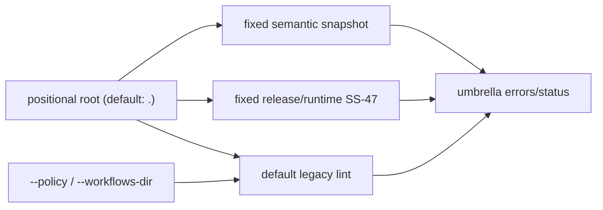
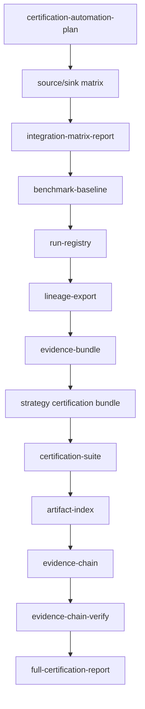

# CI/CD workflow reference

This page documents every public GitHub Actions workflow in `dpone`: trigger, intent, local reproduction command, artifacts, and first troubleshooting pointer.

## Workflow overview

```mermaid
flowchart TD
    Push["push to master"] --> CI["ci.yml quality matrix"]
    Push --> Pages["pages.yml docs deploy"]
    Push --> DependencyReview["dependency-review.yml exact-master result"]
    Push --> Secret["secret-scan.yml"]
    Push --> CodeQL["codeql.yml"]
    Push --> Scorecard["scorecard.yml"]
    PR["pull request to master"] --> CI
    PR --> PagesBuild["pages.yml build only"]
    PR --> DependencyReviewPR["dependency-review.yml native PR result"]
    PR --> Secret
    PR --> CodeQL
    PR --> HeadReceipt["agent-pr-receipt.yml on reviewed H"]
    HeadReceipt --> MergeReceipt["closed-event receipt names integrated C"]
    MergeReceipt --> ExactCheck["Checks API projects required check onto C"]
    Tag["vX.Y.Z tag"] --> Release["Source release.yml: no PyPI upload"]
    Authorized["Authorized manual version input"] --> Publisher["External controller pypi-release.yml"]
    Publisher --> PyPI["PyPI archives and public-hash observation"]
    Manual["workflow_dispatch"] --> Matrix["integration-matrix.yml"]
    Manual --> Replay["replay-integration.yml"]
    Manual --> Cert["connector-certification.yml"]
    Manual --> Obs["observability-maturity.yml"]
    Manual --> OssQuality["oss-code-quality-benchmark.yml"]
    Schedule["schedule"] --> Cert
    Schedule --> AirflowNightly["airflow-pack-compat-nightly.yml"]
    Schedule --> Obs
    Schedule --> CodeQL
    Schedule --> Secret
    Schedule --> Scorecard
```



## Agent PR reviewed-head and merge-closure receipt

| Field | Value |
| --- | --- |
| Workflow | `.github/workflows/agent-pr-receipt.yml` |
| Name | `Agent PR receipt` |
| Triggers | `pull_request: edited`; merged `pull_request: closed` |
| Required purpose | Bind reviewed body, checks, governance, and paths on `H`, then close that immutable evidence over exact integration commit `C` |

The edited path uploads the existing v2 PR receipt, v1 audit manifest, body,
head, NUL-delimited path evidence, and exit code. The closed path checks out the
event merge commit, verifies merge/squash parents and trees, selects the exact
successful pre-merge artifact, validates provider and local digests, and
uploads `agent_pr_merge_receipt.json` plus the byte-identical source archive.
GitHub binds the native closed-event run to `H`; the merged-only job uses its
documented `checks: write` scope to publish the validated same-name check on
`C` only after the durable receipt artifact uploads, then records the safe
provider response in the separate `agent-pr-merge-check` artifact. Release
preflight re-downloads the exact producer's receipt and binds its check/App/run
identity before accepting `C`.
There is no manual semantic backfill and no current-PR-body authority.

Local contract checks:

```bash
uv run pytest \
  tests/agent_policy/test_pr_receipt.py \
  tests/agent_policy/test_pr_receipt_source.py \
  tests/agent_policy/test_pr_merge_identity.py \
  tests/agent_policy/test_pr_merge_receipt.py \
  tests/agent_policy/test_pr_merge_check.py -q
uv run pytest tests/test_github_workflow_governance.py \
  tests/agent_policy/test_workflow_security.py -q
```

For a real failed or missing closure, use the focused
[Agent PR merge-receipt runbook](../agent-pr-merge-receipt-runbook.md).

## CI quality matrix

| Field | Value |
| --- | --- |
| Workflow | `.github/workflows/ci.yml` |
| Name | `CI` |
| Triggers | push to `master`, pull request to `master`, manual dispatch |
| Python versions | 3.11, 3.12 |
| Required purpose | Default code quality gate |

Superseded pull-request runs share one PR-scoped concurrency group and cancel
automatically. Pushes to `master` and manual/release runs are never canceled by
that policy because their exact-commit evidence may be audited later.

Steps:

1. Checkout.
2. Install `uv`.
3. Set up matrix Python.
4. `uv sync --locked --all-extras`.
5. `uv run ruff check .`.
6. `uv run ruff format --check .`.
7. `uv run mypy --config-file mypy.ini`.
8. Validate import/layer/module-size budgets for dpone, the formal Airflow
   provider and its reader.
9. Check generated references, the frozen Airflow public contract and build
   documentation strictly.
10. Collect the exact non-live population, then execute its fixed eight-way
    shard partition for each required Python version.
11. Fail-closed validate all exact-head receipts; Python 3.12 combines the
    eight raw coverage inputs and applies the existing ratchet once.
12. Build all four distributions during preflight and upload combined coverage.

See [CI quality performance evidence](ci-performance-evidence.md) for the
receipt contract and the hosted p95 procedure.

Two independent required jobs, `Doctor import Windows (3.11)` and
`Doctor import Windows (3.12)`, run on exact GitHub-hosted `windows-latest`
workers with `contents: read`. They exercise real success, missing dependency,
load failure, missing receipt, direct-child timeout, and public-v1 projection
contracts. They are not dependencies of `governance-source`; branch protection
requires both exact contexts directly, so ADR 0037 governance provenance stays
Linux-only while Windows failures still block merge.

Local reproduction:

```bash
uv sync --locked --all-extras
uv run ruff check .
uv run ruff format --check .
uv run mypy --config-file mypy.ini
uv run dpone docs check-module-size --package packages/dpone-airflow-pack/src/dpone_airflow_pack --no-baseline
uv run dpone docs check-module-size --package packages/apache-airflow-providers-dpone/src/airflow/providers/dpone --no-baseline
uv run dpone docs check-generated-references
uv run dpone docs check-airflow-public-contracts
uv run dpone docs update-airflow-public-contract-reference --check
uv run pytest -m "not integration_live" --cov=src/dpone --cov=packages/dpone-airflow-pack/src/dpone_airflow_pack --cov-report=xml
uv build
uv build packages/dpone-native-accel --out-dir dist
uv build packages/dpone-airflow-pack --out-dir dist
uv build packages/apache-airflow-providers-dpone --out-dir dist
```

On a Windows 3.11 or 3.12 checkout, reproduce the required backend slice with:

```powershell
uv sync --locked --all-extras
uv run pytest -q `
  tests/test_doctor_import_runner.py::test_windows_default_probe_executes_a_real_import `
  tests/test_doctor_import_environment.py `
  tests/test_doctor_import_integration.py::test_import_probe_distinguishes_missing_target_from_broken_dependency `
  tests/test_doctor_import_protocol.py::test_import_probe_does_not_accept_target_os_exit_zero_without_receipt `
  tests/test_doctor_import_runner.py::test_windows_default_probe_bounds_a_hanging_direct_child `
  tests/test_doctor_import_public_contract.py::test_public_doctor_dataclass_signatures_remain_v1_compatible `
  tests/test_doctor_import_runtime_identity.py `
  tests/test_doctor_import_site_roots.py `
  tests/test_doctor_import_startup_controls.py `
  tests/test_doctor_import_startup_hooks.py `
  tests/test_doctor_import_startup_portability.py `
  tests/test_doctor_import_startup_surface.py
```

A POSIX run of that selector is structural evidence only because Windows-only
containment tests skip. Hosted conclusions on the reviewed head remain the
required authority.

Artifacts:

- `coverage.xml`
- `dist/dpone-*.whl`
- `dist/dpone-*.tar.gz`
- `dist/dpone_airflow_pack-*.whl`
- `dist/apache_airflow_providers_dpone-*.whl`

Runbook: [CI quality failures](runbooks.md#ci-quality-failures).

### Semantic PR privilege boundary

The `Workflow security policy` step keeps
`tools/agent_policy/workflow_security.py` as the required umbrella gate. It now
invokes the same semantic service as the standalone, credential-free scanner.
Prepare the locked project environment once:

```bash
uv sync --locked --all-extras
```

The prerequisite may access the network, write `.venv` or the uv cache, and
write diagnostics to stderr. It is environment preparation, not part of the
scanner contract. After it succeeds, the strict uv convenience commands disable
sync, network access, and Python downloads for that invocation:

```bash
uv run --locked --no-sync --offline --no-python-downloads python -B \
  tools/agent_policy/workflow_security_privileged.py \
  --root . \
  --format text
uv run --locked --no-sync --offline --no-python-downloads python -B \
  tools/agent_policy/workflow_security_privileged.py \
  --root . \
  --format json
uv run --locked --no-sync --offline --no-python-downloads python -B \
  tools/agent_policy/workflow_security.py . --format json
```

For exact exit-code and stdout/stderr evidence, bypass the uv wrapper and use
the prepared interpreter directly:

```bash
.venv/bin/python -B tools/agent_policy/workflow_security_privileged.py \
  --root . \
  --format text
.venv/bin/python -B tools/agent_policy/workflow_security_privileged.py \
  --root . \
  --format json
.venv/bin/python -B tools/agent_policy/workflow_security.py . --format json
```

The stream and side-effect rows below apply to the direct scanner process from
Python process start. They do not describe `uv sync` or other wrapper behavior.
The standalone interface is a repository contract, not a `dpone` package API:

| Contract | Value |
| --- | --- |
| Input | required `--root`; fixed `.github/workflows` and `.agents/policy/workflow-security-privileged.yml` below it |
| Format | `text` by default; `json` is one canonical compact object plus one newline |
| Side effects | scanner process: read-only, credential-free, no network and no file creation; environment preparation is outside this contract |
| `PASS` | stdout only, exit `0` |
| `FAIL` or `UNVERIFIED` | schema-valid report on stdout only, exit `1` |
| CLI usage error | no stdout, argparse diagnostics on stderr, exit `2` |
| Internal report failure | no stdout, fixed `PRIVILEGE_INTERNAL_REPORT_INVALID` diagnostic on stderr, exit `3` |

The umbrella positional `root` defaults to `.` and anchors three independent
branches: the fixed semantic policy/workflow snapshot, fixed SS-47 checks for
`release` and `runtime-image` with either `.yml` or `.yaml`, and the default
legacy general linter. `--policy` and `--workflows-dir` redirect only that
legacy branch; relative overrides are resolved from the process working
directory. They cannot redirect or suppress the fixed semantic or SS-47 inputs.
The umbrella format defaults to `text`; JSON keeps exactly `status`, `errors`,
and `warnings`.



Text always reports status, completeness, workflow/job/edge/root/route counts,
sorted findings, the stable runbook anchor, and the exact recheck command.
Repeated scans of identical bytes produce identical JSON. A standalone local
`PASS` proves only the checked-out workflow snapshot; hosted checks remain
separate evidence.

The report's frozen bare recheck remains
`uv run python tools/agent_policy/workflow_security_privileged.py --root . --format text`.
It is a convenience command that assumes the environment is already prepared;
it is not the direct-interpreter evidence command and does not extend scanner
process guarantees to uv.

The scanner intentionally does not implement the complete GitHub expression
language, download external reusable workflows, inspect third-party action
internals, or certify mutable provider settings. Unsupported privileged guards
and workflow edges are `UNVERIFIED`, never guessed safe. Exact numeric bounds
and the recognized permission vocabulary are owned by the closed policy and
echoed in the report; exceeding a bound makes inventory incomplete and blocks
integration.

For a local reusable call, closed v1 accepts literal `boolean`, `number`, and
`string` inputs plus a named secret mapping. The caller envelope is exactly
`name`, `uses`, `with`, `secrets`, `needs`, `if`, `concurrency`, and
`permissions`. It rejects `secrets: inherit`, input expressions, matrix
`strategy`, extra inputs, missing required inputs, and literal type mismatches;
those shapes may be valid GitHub extensions but are `UNVERIFIED` until a
separately reviewed proof models their runtime semantics. Named secrets are
structurally recognized, not certified safe: a PR-reachable secret still makes
the semantic report `FAIL`. Start from the
[copyable secret-free caller/callee pair](../developer-ci-cd.md#calling-a-local-reusable-workflow-safely).

CI keeps repository-controlled code read-only. The matrix `quality` job has
only `contents: read`. The exact authority chain is:

| Job | `needs` | Job permissions | Repository code |
| --- | --- | --- | --- |
| `quality` | none | `contents: read` | checkout, setup, quality/tests/build, and the compatible workflow-security gate |
| `governance-source` | `[quality]` | `contents: read` | exact candidate checkout, governance JSON generation, and one artifact upload |
| `governance-attestation` | `[governance-source]` | `actions: read`, `attestations: write`, `contents: read`, `id-token: write` | none; exactly two pinned provider actions |

The non-matrix producer checks out the exact candidate with persisted
credentials disabled, generates
`test_artifacts/agent-policy/agent_governance_gate.json`, and uploads the single
`agent-governance-gate` artifact with 90-day retention. Its outputs carry the
provider artifact ID and digest to `governance-attestation`.

`governance-attestation` is the sole PR-route attestor. It has no checkout or
`run` step: one pinned action downloads exactly the producer artifact by ID and
fails on a digest mismatch into
`test_artifacts/agent-policy/attested-governance`; one pinned action attests
exactly
`test_artifacts/agent-policy/attested-governance/agent_governance_gate.json`.
Attestation proves provenance of those bytes, not semantic `PASS`. The Agent PR
receipt remains the decision authority that validates the JSON content and
binds it to the reviewed head. These jobs are internal topology, not new
required branch-protection contexts.

Runbook: [Semantic PR privilege boundary](runbooks.md#semantic-pr-privilege-boundary).

The workflow concurrency group is
`ci-${{ github.event_name == 'pull_request' && github.event.pull_request.number || github.run_id }}`.
Only pull-request runs set `cancel-in-progress`; different PR numbers cannot
cancel each other, and push/manual exact-commit runs are retained.

## Dependency update automation

| Ecosystem | Schedule | Labels | Open version-PR limit | Minor/patch group |
| --- | --- | --- | --- | --- |
| `github-actions` | Wednesday 08:00, `Europe/Berlin` | `dependencies`, `github-actions` | 2 | `github-actions-minor-patch` |
| `uv` | Monday 08:30, `Europe/Berlin` | `dependencies`, `python:uv` | 3 | `uv-minor-patch` |

Both entries use directory `/` and keep one group with `patterns: ["*"]` and
`update-types: ["minor", "patch"]`. The file does not add cooldown, registry,
target-branch, allow, ignore, assignee, reviewer, or milestone overrides. The
limits apply to version updates; GitHub's separate security-update behavior is
not relabelled by this contract.

The three labels are owner-managed repository configuration. Automation must
not create or rename them. Before a CI-hygiene implementation or label-dependent
change merges, the exact names `dependencies`, `python:uv`, and
`github-actions` must be read back from `github.com`; inaccessible, missing, or
case-variant evidence is `UNVERIFIED`. See the
[missing-label runbook](runbooks.md#required-dependabot-label-is-missing-or-unverified).

## PostgreSQL XMin integration job

| Field | Value |
| --- | --- |
| Workflow | `.github/workflows/ci.yml` |
| Job | `postgres-xmin` |
| Trigger | same as CI |
| Service | `postgres:16-alpine` |
| Purpose | Keep the explicit Postgres XMin strategy tested in regular CI |

Local reproduction with your own Postgres instance:

```bash
DPONE_RUN_INTEGRATION=1 \
DPONE_IT_PG_HOST=127.0.0.1 \
DPONE_IT_PG_PORT=5432 \
DPONE_IT_PG_DATABASE=dpone_it \
DPONE_IT_PG_USER=dpone \
DPONE_IT_PG_PASSWORD=dpone \
uv run pytest -m integration_postgres_xmin tests/integration/postgres -q
```

Runbook: [PostgreSQL XMin integration failures](runbooks.md#postgresql-xmin-integration-failures).

## Airflow provider compatibility

| Field | Direct workflow | Nightly wrapper |
| --- | --- | --- |
| Workflow | `.github/workflows/airflow-pack-compat.yml` | `.github/workflows/airflow-pack-compat-nightly.yml` |
| Trigger | every push/PR to `master`, manual dispatch, or local `workflow_call` | daily `23 1 * * *` in `Europe/Berlin`; manual dispatch |
| Permissions | `contents: read` | `contents: read` |
| Airflow matrix ceiling | 2 | passes `airflow_max_parallel: 4` |
| Runtime-wheel-smoke ceiling | 1 | 1 through the called workflow |
| Failure behavior | `fail-fast: false` | `fail-fast: false` through the called workflow |

The compatibility workflow keeps its existing eight Airflow/Python cells:
Airflow `2.10.5`, `2.11.0`, `3.2.0`, and `3.3.0`, each on Python 3.11 and
3.12. Pushes to `master` are deliberately not path-filtered: all matrix jobs are
required release checks, so every immutable release candidate must have exact-SHA
provider evidence rather than evidence inherited from a different commit. Its
optional numeric `workflow_call` input has default `2`. An early
prerequisite validates the raw value before matrix expansion: direct events may
provide an empty value, and called runs accept only the exact integer `2` or
`4`; `0`, other numbers, strings, or an empty called value fail before the
matrix.

The nightly file is a source-free local reusable-workflow caller: it has no
checkout, shell command, external action, secret, artifact, deployment, or
write permission. Scheduled and manual runs share the stable
`airflow-pack-compat-nightly` group with `queue: max` and
`cancel-in-progress: false`. At most 100 pending members are provider-retained;
a provider-cancelled overflow run is not PASS. Direct PR runs retain their
PR-number group and never enter the nightly queue. Recovery is documented in
[Nightly compatibility queue saturation](runbooks.md#nightly-compatibility-queue-saturation).

## Documentation and GitHub Pages

| Field | Value |
| --- | --- |
| Workflow | `.github/workflows/pages.yml` |
| Name | `docs` |
| Triggers | push to `master` for docs/mkdocs/workflow paths; every pull request; manual dispatch |
| Deploy condition | push to `master`, not pull request |
| Purpose | Strict docs build and GitHub Pages deploy |

Local reproduction:

```bash
uv sync --locked
uv run dpone docs check-generated-references
uv run mkdocs build --strict
```

The workflow starts with top-level `permissions: {}`. `build` has only
`contents: read`; it uses attempt `1` for non-PR subjects, and PR builds may be
rerun because they never upload or deploy. Only a non-PR attempt-1 build uploads
the immutable `github-pages` artifact.

The whole workflow shares
`pages-${{ github.event_name == 'pull_request' && github.event.pull_request.number || github.ref }}`
and cancels only an older head of the same PR. No Pages job uses `queue`. After
build, `verify_current_master` has only `contents: read`; on a non-PR attempt-1
`refs/heads/master` run it reads the current master SHA through an explicit
`gh api --hostname github.com` request that ignores ambient `GH_HOST`, requires
the exact 40-hex value to equal `github.sha`, and emits the verified SHA and
`GITHUB_RUN_ATTEMPT`.

`deploy` needs both successful jobs, requires attempt `1`, the exact current
`master` SHA, and verification output from the same attempt. Only that job has
`pages: write` and `id-token: write`, plus the protected `github-pages`
environment. This stable build-to-deploy ordering prevents an older successful
subject from publishing after a newer one. API failure, stale or malformed SHA,
missing output, rerun, or attempt mismatch fails closed.

For non-PR runs GitHub keeps the running workflow and only the newest pending
member under the default single-pending behavior. A replaced/cancelled pending
run is not deployment PASS. The retained newer run begins only after the
running workflow finishes, then must pass its own current-master check.

The workflow rejects stale generated CLI/schema references before deploying to
[https://paulkov.github.io/dpone/](https://paulkov.github.io/dpone/). A skipped
deploy job can appear as a successful check, but means deployment `NOT_RUN` and
evidence `UNVERIFIED`; it is never deployment PASS. Deployment PASS requires
the authenticated attempt-1 run and the unique `Deploy GitHub Pages
documentation` job whose pinned `Deploy Pages` step succeeds. The exact
new-run-only recovery is in
[Docs and GitHub Pages failures](runbooks.md#docs-and-github-pages-failures).

Runbook: [Docs and Pages failures](runbooks.md#docs-and-github-pages-failures).

## Dependency Review

| Field | Value |
| --- | --- |
| Workflow | `.github/workflows/dependency-review.yml` |
| Name and job display name | `Dependency Review` |
| Triggers | `pull_request` to `master`; `push` to `master` |
| Permissions | top-level `contents: read`; no job override |
| Policy | pinned dependency-review action, `fail-on-severity: high`, `comment-summary-in-pr: never` |

The PR action uses GitHub's native test-merge comparison. The push action
requires `github.event.before` to be a nonzero 40-hex SHA and supplies it as
`base-ref`, with `github.sha` as `head-ref`. This produces a separate native
result on the exact `master` commit required by unchanged release preflight;
the PR result applies only to its test-merge SHA.

There is no `workflow_dispatch`, arbitrary ref input, `gh api`, comment write,
check write, or synthetic backfill. A missing or unreadable eligible result is
`UNVERIFIED`, not PASS. An existing failed native run may be rerun by exact run
ID. If no PR run exists, create a new reviewed PR head after provider recovery;
if no exact-master run exists, use a new reviewed successor commit as the
release candidate. Never publish a substitute result. See
[Dependency Review failures](runbooks.md#dependency-review-failures).

## OSS code quality benchmark

| Field | Value |
| --- | --- |
| Workflow | `.github/workflows/oss-code-quality-benchmark.yml` |
| Name | `OSS code quality benchmark` |
| Trigger | manual dispatch |
| Purpose | Refresh the public dpone vs OSS comparator benchmark, quality gates, freshness metadata, historical trends, architecture delta, Complexity & Boundary Discipline, Semantic Maintainability Deep Scan, Scoring Validity & Calibration, Scale Readiness & Growth Simulation, Refactor ROI Roadmap, quality debt, Evidence Trust & Auditability, Public Evidence Integrity, Source Citation Verification, Benchmark v3 Release Readiness, Claims Ledger, Runtime Certification Matrix, Executable Certification, Quality Budget As Code, Evidence Warehouse Export, release readiness pack, claim-to-source matrix, Independent Analyzer Cross-Validation, External analyzer execution, raw JSON evidence, provenance ledger, PR regression gate summary, and SVG visuals. |

Local reproduction for a fast dpone-only refresh that preserves prior comparator values:

```bash
uv run python tools/oss_code_quality_benchmark.py --project dpone --allow-stale --enforce-quality-gates --run-certification --certification-mode local
uv run dpone docs update-dev-metrics --check
uv run mkdocs build --strict
```

Use `project=all` in GitHub Actions for a full external refresh, or select `dpone`, `airbyte`, `dlt`, `pentaho-kettle`, `apache-hop`, or `sling` for a scoped refresh. Set `verify_source_urls=true` when you want live URL checks; otherwise Source Citation Verification checks local files and URL metadata while still rendering the claim-to-source matrix. The workflow installs the external analyzer execution toolchain (`tokei`, `cloc`, `radon`, `lizard`), passes the GitHub actor, run URL, branch, and SHA into the document header, passes `--external-analyzer-timeout` to bound each tool run, and runs executable certification with `--run-certification --certification-mode local --fail-on-certification`. If a comparator, analyzer, source URL, or executable scenario cannot be refreshed and previous evidence exists, values are retained as stale with the last successful update timestamp; stale analyzer values, stale source values, and stale scenario values remain visible in raw JSON, markdown tables and PR summaries. The workflow also verifies public artifact redaction so local filesystem paths cannot leak into published benchmark artifacts; the generated Public Evidence Integrity section reports claim coverage and redaction violations. The dpone quality gates enforce the maintainability index, architecture risk, coverage confidence, module size, fan-out, cohesion, freshness, executable certification, and hard quality budget thresholds. The generator also updates trend history, renders the architecture delta, complexity/boundary, semantic maintainability, god-object radar, Scoring Validity & Calibration, Scale Readiness & Growth Simulation, quality headroom, architecture runway, raw-vs-normalized scorecards, Language/repo normalization, Sensitivity analysis, Anti-gaming guardrails, Refactor ROI Roadmap, evidence confidence visuals, `oss-public-evidence-integrity.svg`, `oss-source-verification.svg`, `oss-release-readiness-seal.svg`, and `oss-independent-validation.svg` / `oss-analyzer-confidence.svg`, writes `oss-benchmark-provenance.json` as the reproducibility manifest with SHA-256 checksums, optional LOC/SLOC cross-check status, external analyzer status, and Analyzer command ledger metadata, writes `runtime-certification/latest/run-ledger.json` and `runtime-certification/latest/contract-checks.json`, writes the Benchmark v3 Release Readiness pack as Markdown and JSON, and writes a PR regression gate plus maintainability risk register, Semantic Maintainability Deep Scan, SOLID/DI/Clean Code evidence, DRY/KISS responsibility signals, Scoring Validity & Calibration, Scale Readiness & Growth Simulation, Evidence Trust & Auditability, Public Evidence Integrity, Source Citation Verification, Benchmark v3 Release Readiness, Claims Ledger, Runtime Certification Matrix, Executable Certification, Quality Budget As Code, Evidence Warehouse Export, Independent Analyzer Cross-Validation, and quality debt summary into the generated PR summary artifact. When `create_pr=true`, the workflow creates a branch and opens a pull request instead of writing directly to `master`; the PR body comes from the generated PR summary artifact.

Artifacts:

- `oss-code-quality-benchmark`
- `docs/benchmarks/oss-code-quality-benchmark-2026-06-12.md`
- `docs/benchmarks/data/oss-code-quality-benchmark-2026-06-12.json`
- `docs/benchmarks/data/oss-code-quality-benchmark-history.json`
- `docs/benchmarks/data/oss-benchmark-provenance.json`
- `docs/benchmarks/data/runtime-certification/latest/run-ledger.json`
- `docs/benchmarks/data/runtime-certification/latest/contract-checks.json`
- `docs/benchmarks/assets/oss-architecture-delta.svg`
- `docs/benchmarks/assets/oss-complexity-boundary.svg`
- `docs/benchmarks/assets/oss-semantic-maintainability.svg`
- `docs/benchmarks/assets/oss-god-object-radar.svg`
- `docs/benchmarks/assets/oss-score-calibration.svg`
- `docs/benchmarks/assets/oss-score-sensitivity.svg`
- `docs/benchmarks/assets/oss-normalized-vs-raw.svg`
- `docs/benchmarks/assets/oss-scale-readiness.svg`
- `docs/benchmarks/assets/oss-architecture-runway.svg`
- `docs/benchmarks/assets/oss-quality-headroom.svg`
- `docs/benchmarks/assets/oss-refactor-roi-roadmap.svg`
- `docs/benchmarks/assets/oss-evidence-confidence.svg`
- `docs/benchmarks/assets/oss-public-evidence-integrity.svg`
- `docs/benchmarks/assets/oss-source-verification.svg`
- `docs/benchmarks/assets/oss-release-readiness-seal.svg`
- `docs/benchmarks/oss-benchmark-release-readiness-2026-06-12.md`
- `docs/benchmarks/data/oss-benchmark-release-readiness-2026-06-12.json`
- `docs/benchmarks/assets/oss-independent-validation.svg`
- `docs/benchmarks/assets/oss-analyzer-confidence.svg`
- `docs/benchmarks/assets/*.svg`
- `test_artifacts/oss-code-quality-benchmark/pr-comment.md`

## Release publishing

| Field | Value |
| --- | --- |
| Workflow | `PaulKov/dpone-release-controller/.github/workflows/pypi-release.yml` |
| Trigger | manual dispatch, sole input `version=X.Y.Z` |
| Source | fixed `PaulKov/dpone` tag `vX.Y.Z` |
| Environment | `pypi` |
| Ordinary publish mode | PyPI Trusted Publishing only |
| Token fallback | None; no automatic same-version or `skip-existing` recovery |

The controller builds its own four-package/eight-archive inventory and verifies
public filenames and hashes. It does not create a GitHub Release or runtime
image. Source `.github/workflows/release.yml` remains a separate tag-triggered
workflow; its handoff message neither publishes to PyPI nor dispatches the
controller. Do not confuse its artifacts with the controller's archives.

Use [Release](../release.md) for the current build, rehearsal, authorized
dispatch, and read-only retrospective commands. Historical paired-tag and
candidate-evidence rules are not this controller's publication gate.

Runbook: [Release and PyPI failures](runbooks.md#release-and-pypi-failures).

## Secret Scan

| Field | Value |
| --- | --- |
| Workflow | `.github/workflows/secret-scan.yml` |
| Tool | TruffleHog verified secrets |
| Triggers | push to `master`, pull request to `master`, weekly schedule |
| Purpose | Prevent verified secrets from entering public history |

Runbook: [Secret scan failures](runbooks.md#secret-scan-failures).

## CodeQL

| Field | Value |
| --- | --- |
| Workflow | `.github/workflows/codeql.yml` |
| Tool | GitHub CodeQL Python analysis |
| Triggers | push, pull request, weekly schedule |
| Purpose | Closed, action-only Python static security analysis and PR upload profile |

The profile runs for pushes and pull requests to `master` and at
`21 3 * * 1`. It has exactly one GitHub-hosted `analyze` job and three pinned action
steps: checkout with `persist-credentials: false`, CodeQL init for Python, and
CodeQL analyze. Workflow permissions are exactly `contents: read` and
`security-events: write`. It contains no repository command, dependency
installation, autobuild, custom query/config/pack, cache, artifact download,
local action, secret, environment, container, service, or matrix. The former
`.github/codeql/codeql-config.yml` filter is intentionally removed, so a newly
visible default-query alert must be fixed or separately documented rather than
hidden by restoring the filter.

An action-pin update is a separately reviewed closed-profile contract change,
not a workflow-only dependency bump. Synchronize `.github/workflows/codeql.yml`,
`profiles.codeql` in `.agents/policy/workflow-security-privileged.yml`, the
matching `const` in
`evals/agent/workflow-security-privileged-policy.schema.json`, and the trusted
report binding in `tools/agent_policy/workflow_privilege_profiles.py`. Regenerate
producer-owned fixtures, contract examples, docs assertions, and certification
evidence; run profile, schema, report, and mutation tests plus two byte-identical
standalone scans; then require hosted CodeQL on the resulting exact head. Do not
add repository execution to the PR upload job or edit frozen PR3B authority
files without a separately approved task contract.

Runbook: [CodeQL failures](runbooks.md#codeql-failures).

## OSSF Scorecard

| Field | Value |
| --- | --- |
| Workflow | `.github/workflows/scorecard.yml` |
| Tool | OSSF Scorecard |
| Triggers | push to `master`, branch protection rule changes, weekly schedule |
| Purpose | Supply-chain security posture |

Runbook: [OSSF Scorecard failures](runbooks.md#ossf-scorecard-failures).

## Source/Sink integration matrix

| Field | Value |
| --- | --- |
| Workflow | `.github/workflows/integration-matrix.yml` |
| Trigger | manual dispatch |
| Modes | `mock_contract`, `mock_local`, `vendor_live` |
| Purpose | Source -> sink -> strategy certification artifacts |

Typical manual run:

```text
run_mode=mock_local
source_filter=*
sink_filter=*
strategy_filter=*
case_id_filter=*
```

Local reproduction:

```bash
DPONE_RUN_INTEGRATION=1 \
DPONE_RUN_INTEGRATION_MATRIX=1 \
DPONE_MATRIX_RUN_MODE=mock_contract \
DPONE_MATRIX_ARTIFACT_DIR=test_artifacts/integration_matrix/mock_contract_latest \
uv run pytest -m integration_matrix tests/integration/matrix -q
```

Runbook: [Integration matrix failures](runbooks.md#source-sink-integration-matrix-failures).

## Live certification

| Field | Value |
| --- | --- |
| Workflow | `.github/workflows/live-certification.yml` |
| Trigger | manual dispatch |
| Modes | `local_live`, `real_local`, `type_matrix_certification`, `native_transfer`, `vendor_live` |
| Purpose | Raw service-backed connector, source/sink matrix, and native-transfer observations; never pre-tag authorization |

The local live workflow starts disposable Postgres, MSSQL, ClickHouse, Kafka,
Schema Registry and MinIO services. The short default run keeps CI cost bounded
by using `row_count`; release reviewers can additionally enable the native
benchmark suite.

Typical full native transfer benchmark dispatch:

```text
profile=real_local
row_count=100000
run_native_benchmark_suite=true
native_benchmark_rows=10000,1000000,10000000
native_benchmark_partitions=1
run_vendor_live=false
execute_route_rc_commands=false
```

Raw/diagnostic artifacts can include:

- `test_artifacts/live_certification/benchmarks/postgres_mssql_native_fast_path.json`
- `test_artifacts/live_certification/benchmarks/native_benchmark_suite/summary.json`
- `test_artifacts/live_certification/benchmarks/postgres_mssql_native_benchmark_summary.md`
- `test_artifacts/live_certification/matrix/certification_report.json`
- `test_artifacts/live_certification/refresh-executor/`
- `test_artifacts/live_certification/native_transfer_live_fixtures.json`

Runbook: [Live certification failures](runbooks.md#live-certification-failures).

Release-only strategy, checklist, chain, route-RC, and pack blocks in this raw
workflow remain disabled because their old bodies contain literal placeholder
claims. Absence is `UNVERIFIED`.

## Release candidate evidence

| Field | Value |
| --- | --- |
| Workflow | `.github/workflows/release-candidate-evidence.yml` |
| Trigger | manual dispatch on exact current `master` |
| Inputs | full `commit_sha`, proposed `release` |
| Fixed profile | `native_transfer`, a strict `real_local` superset |
| Terminal check | `Release candidate evidence` |
| Purpose | Provider-bound pre-tag authority for the legacy source release/runtime-image workflows, not the external PyPI publisher |

This section describes the source-workflow campaign. The ordinary controller
does not consume this artifact or apply the paired-run cutoff. Use
[Release](../release.md) to decide which operation and evidence scope apply;
do not dispatch this campaign solely to verify an already published version.

The workflow derives its checklist, manifest, evidence chain, and pack only
from executed exact-check, merge-closure, JUnit, route-refresh,
CDC/state/reconciliation, and benchmark inputs. Its terminal job uploads
exactly one `release-candidate-evidence-<commit>-<run-id>-<attempt>` authority
artifact.
Before tagging, the exact-SHA dispatch with the unique maximum provider
`created_at` must pass. During publication, only dispatches created no later
than the paired-run cutoff are eligible; the unique maximum in that set wins
before its current `run_attempt` and outcome are inspected. Equal eligible
creation times fail closed and an older eligible PASS is not a fallback.
Rerunning an older dispatch cannot change dispatch order; a post-cutoff
dispatch is ignored.
The artifact contains a closed `sources/` tree plus
`release_candidate_evidence_manifest.json`,
`release_candidate_evidence_pack.json`,
`release_candidate_evidence_receipt.json`, and
`release_candidate_evidence_exit_code.txt`. Its requested 90-day retention is
availability, not durability; provider expiry or deletion is `UNVERIFIED`.
The reusable job's separate
`release-candidate-live-<commit>-<run-id>-<attempt>` artifact is raw diagnostic
input, not publication authority.
Tag consumers additionally require exactly one exact-repository/tag/SHA/path
`push` run for both `release.yml` and `runtime-image.yml`. The caller must be
its exact current in-progress run/attempt. The earlier provider `created_at` of
the pair is the eligibility cutoff; the selected evidence execution, terminal
check, and artifact must also complete by it. The tagger timestamp is never
authority. Preflight and every
mutation-capable job reverify, with the fresh gate immediately before that
block's first external write. Evidence remains valid for frozen commit C after
`master` advances, but never for a tag that points to a different commit.

See [Release evidence](../release-evidence.md#canonical-pre-tag-workflow).

## Replay integration gate

| Field | Value |
| --- | --- |
| Workflow | `.github/workflows/replay-integration.yml` |
| Trigger | manual dispatch |
| Modes | injected replay adapters, optional service-backed local Docker adapters |
| Purpose | Validate replay/resync/resume execution paths and publish replay evidence |

Typical manual run:

```text
run_replay_gate=true
run_service_backed_gate=true
```

Local reproduction:

```bash
DPONE_RUN_INTEGRATION_REPLAY=1 \
uv run pytest -m integration_replay tests/integration/replay -q

docker compose -f docker/docker-compose.integration.yml up -d postgres kafka schema-registry clickhouse mssql
DPONE_RUN_INTEGRATION_REPLAY_SERVICES=1 \
uv run pytest -m integration_replay_services tests/integration/replay -q
docker compose -f docker/docker-compose.integration.yml down -v
```

Artifacts:

- `test_artifacts/replay_integration/junit.xml`.
- `test_artifacts/replay_integration/service_junit.xml` when service-backed mode is enabled.
- `strategy_certification_bundle.json`.
- `strategy_certification_bundle.md`.

Strategy certification bundle:

- The workflow runs `dpone strategy certification-bundle` with `--replay-evidence` after cleanup, even when replay fails.
- Artifact name: `strategy-certification-replay`.
- Docs link embedded in the bundle: `docs/testing/replay-integration.md`.

Tamper-evident evidence chain:

- This is the tamper-evident evidence chain for replay execution evidence.
- The workflow runs `dpone ops artifact-index` over replay integration and strategy bundle roots.
- The workflow then runs `dpone ops evidence-chain` against the generated `artifact_index.json`.
- The workflow finally runs `dpone ops evidence-chain-verify`; an empty or broken chain is a failed replay gate.
- Artifact name: `replay-evidence-chain`.
- Files include `artifact_index.json`, `artifact_index.md`, `<release>__evidence_chain.json`, `<release>__evidence_chain.md`, and `evidence_chain_index.json`.

Runbook: [Replay integration](../testing/replay-integration.md).

## Connector certification

| Field | Value |
| --- | --- |
| Workflow | `.github/workflows/connector-certification.yml` |
| Triggers | daily schedule, manual dispatch |
| Jobs | offline certification, local-live certification, vendor-live certification |
| Purpose | Async scheduled connector capability evidence and long-running confidence |

Scope taxonomy:

- `offline-certification` is credential-free and publishes connector capability, strategy bundle, suite, artifact index, and evidence-chain artifacts.
- `local-live-certification` installs ODBC Driver 18 and `mssql-tools18`, starts disposable Postgres, MSSQL, ClickHouse, Kafka, Schema Registry, and MinIO, materializes the MSSQL test database with `sqlcmd`, then runs only local live connector marker directories.
- `vendor-live-certification` runs provider/API integration directories only. It deliberately excludes local Docker route folders so vendor evidence cannot fail because a local database service was not started. This workflow is not a merge required check: the daily schedule is fail-soft for incomplete vendor secrets (credential-gated skips allowed; hard failures still fail), while `workflow_dispatch` with `run_vendor_live=true` requires complete secrets and zero skipped tests.

Artifacts:

- `test_artifacts/connectors/matrix.json`
- `test_artifacts/connectors/matrix.md`
- `test_artifacts/connectors/exit-codes.json`
- `strategy_certification_bundle.json`
- `strategy_certification_bundle.md`
- `certification_suite.json`
- `certification_suite.md`
- `certification_suite_index.json`

Strategy certification bundle:

- The offline job runs `dpone strategy certification-bundle` with `--connector-artifact` after generating the connector matrix.
- Artifact name: `strategy-certification-connectors`.
- Docs links embedded in the bundle: `docs/connector-certification.md`, `docs/certification-suite.md`.

Certification suite:

- The offline job runs `dpone ops certification-suite` after the strategy bundle is generated.
- Artifact name: `connector-certification-suite`.
- The suite consumes `test_artifacts/connectors/matrix.json` and `test_artifacts/strategy_certification/connectors/strategy_certification_bundle.json`.

Tamper-evident evidence chain:

- This is the tamper-evident evidence chain for the connector certification run.
- The offline job runs `dpone ops artifact-index` over connector, strategy bundle, and certification suite roots.
- The offline job then runs `dpone ops evidence-chain` against the generated `artifact_index.json`.
- The offline job finally runs `dpone ops evidence-chain-verify`; an empty or broken chain is a failed certification gate.
- Artifact name: `connector-evidence-chain`.
- Files include `artifact_index.json`, `artifact_index.md`, `<release>__evidence_chain.json`, `<release>__evidence_chain.md`, and `evidence_chain_index.json`.

Runbook: [Connector certification failures](runbooks.md#connector-certification-failures).

## Certification release summary workflow

Workflow: `.github/workflows/certification-release-summary.yml`.

This manual workflow is the final go/no-go aggregation layer. It accepts the run IDs from replay, source -> sink matrix, and connector certification workflows, downloads their published artifacts with `gh run download`, and runs `dpone ops release-summary`.

Required source artifacts:

- `replay-evidence-chain`
- `source-sink-certification-suite`
- `source-sink-evidence-chain`
- `connector-certification-suite`
- `connector-evidence-chain`

Published artifact:

- `certification-release-summary`

Runbook when it fails:

1. Open `release_summary.md` and identify the failing blocker.
2. Re-run only the red upstream workflow first.
3. Verify the upstream evidence chain with `dpone ops evidence-chain-verify`.
4. Re-run `.github/workflows/certification-release-summary.yml` with the new upstream run ID.
5. Do not publish a release while `release-summary-report` is red.

## Orchestration maturity workflow

Workflow: `.github/workflows/orchestration-maturity.yml`.

This manual and weekly scheduled workflow validates the production orchestration profile without vendor credentials. It runs `tests/test_orchestration.py`, verifies documentation links with `dpone docs check-docs`, builds GitHub Pages with `mkdocs build --strict`, and uploads `orchestration-maturity-report`.

The gate covers:

- local concurrency locks;
- durable job state transitions;
- fail-closed resume policy;
- explicit `resume` and `restart` operator policies;
- cron, Airflow, Dagster, and Kubernetes handoff snippets;
- CLI and documentation contracts.

## Observability maturity workflow

Workflow: `.github/workflows/observability-maturity.yml`.

This manual and weekly scheduled workflow validates the runtime telemetry
contract without external monitoring services. It runs `tests/test_observability.py`,
exports Prometheus and OpenTelemetry-compatible metrics with
`dpone observability metrics-export`, evaluates a local SLO smoke check with
`dpone ops slo-evaluate`, indexes the evidence, and uploads
`observability-maturity-report`.

Published artifact:

- `observability-maturity-report`

Files include:

- `run_report.json`
- `prometheus_metrics.prom`
- `opentelemetry_metrics.json`
- `runtime_metrics.json`
- `runtime_metrics.md`
- `metrics_index.json`
- `slo_report.json`
- `artifact_index.json`

Local reproduction:

```bash
uv run pytest tests/test_observability.py -q
uv run dpone observability metrics-export \
  --run-report test_artifacts/observability/maturity/run_report.json \
  --output-dir test_artifacts/observability/maturity/export \
  --label env=ci \
  --resource-attr deployment.environment=ci
```

Runbook: [Observability maturity failures](runbooks.md#observability-maturity-failures).

## Full certification workflow

Workflow: `.github/workflows/full-certification.yml`.

This workflow is the recurring full source -> sink certification automation. It runs weekly on schedule and can also be started manually with a selected profile.

Profiles:

| Profile | Purpose | Credentials |
| --- | --- | --- |
| `mock_contract` | Credential-free certification heartbeat for source -> sink contracts. | no |
| `mock_local` | Disposable local services when Docker/tooling is available. | no external vendor credentials |
| `vendor_live` | Managed/live vendor confidence when secrets are configured. | yes |

Automation flow:



Published artifact:

- `full-certification-report`

Local reproduction for the credential-free heartbeat:

```bash
DPONE_RUN_INTEGRATION=1 \
DPONE_RUN_INTEGRATION_MATRIX=1 \
DPONE_MATRIX_RUN_MODE=mock_contract \
DPONE_MATRIX_ROW_COUNT=10000 \
DPONE_MATRIX_ARTIFACT_DIR=test_artifacts/full_certification/matrix \
uv run pytest -m integration_matrix tests/integration/matrix -q
```

Runbook: [Full certification automation failures](runbooks.md#full-certification-automation-failures).

## Production maturity workflow

Workflow: `.github/workflows/production-maturity.yml`

Purpose: aggregate CDC, performance, security, supply-chain, governance, and
docs evidence into an operational release-readiness artifact. Production route
authority is published separately through the cryptographically verified route
certification matrix.

Primary command:

```bash
uv run dpone ops production-maturity \
  --release production-maturity-${GITHUB_RUN_ID} \
  --output-dir test_artifacts/production_maturity/report \
  --artifact cdc=test_artifacts/production_maturity/input/cdc.json \
  --artifact performance=test_artifacts/production_maturity/input/performance.json \
  --artifact security=test_artifacts/production_maturity/input/security.json \
  --artifact supply_chain=test_artifacts/production_maturity/input/supply_chain.json \
  --artifact governance=test_artifacts/production_maturity/input/governance.json \
  --artifact docs=test_artifacts/production_maturity/input/docs.json
```

Artifacts:

| Artifact | Contents |
| --- | --- |
| `production-maturity-report` | Input evidence, `production_maturity.json`, `production_maturity.md`, and artifact index. |

Run this workflow weekly and before release promotion. For release candidates,
replace the deterministic local evidence stubs with real artifacts from CDC
replay, benchmark, security, supply-chain, governance, and documentation
workflows. Run the route certification matrix separately for production route
authority.

## Industrial readiness workflow

Workflow: `.github/workflows/industrial-readiness.yml`

Purpose: aggregate local matrix, correctness, reliability, performance lab, UX, and governance evidence into the next industrial maturity gate.

Primary command:

```bash
uv run dpone ops industrial-readiness \
  --release industrial-readiness-${GITHUB_RUN_ID} \
  --output-dir test_artifacts/industrial_readiness/report \
  --artifact local_matrix=test_artifacts/industrial_readiness/input/local_matrix.json \
  --artifact correctness=test_artifacts/industrial_readiness/input/correctness.json \
  --artifact reliability=test_artifacts/industrial_readiness/input/reliability.json \
  --artifact performance_lab=test_artifacts/industrial_readiness/input/performance_lab.json \
  --artifact ux=test_artifacts/industrial_readiness/input/ux.json \
  --artifact governance=test_artifacts/industrial_readiness/input/governance.json
```

Artifacts:

| Artifact | Contents |
| --- | --- |
| `industrial-readiness-report` | Input evidence, `industrial_readiness.json`, `industrial_readiness.md`, and artifact index. |

Use this workflow after specialized matrix/correctness/reliability/performance/UX/governance evidence exists for a release candidate.

## Route certification release workflow

Workflow: `.github/workflows/route-certification-release.yml`

Purpose: aggregate first-class `route_certification_bundle.json` files into one
release-level route go/no-go report.

Primary command:

```bash
uv run dpone ops route-certify-release \
  --release "$RELEASE" \
  --profile "$PROFILE" \
  --output-dir test_artifacts/route_certification_release \
  --route-bundle postgres_to_mssql__incremental_merge="$POSTGRES_MSSQL_BUNDLE" \
  --route-bundle mssql_to_clickhouse__incremental_merge="$MSSQL_CLICKHOUSE_BUNDLE" \
  --format json
```

Artifacts:

| Artifact | Contents |
| --- | --- |
| `route-certification-release` | `route_certification_release.json`, Markdown review, release notes fragment, route index, and artifact index. |

Use `profile=oss_ci` for credential-free release review. Use
`profile=vendor_live` only after matching Docker-live or vendor-live route
certification bundles exist.

## Route release finalize workflow

Workflow: `.github/workflows/route-release-finalize.yml`

Purpose: run the final route-certified release gate with bundle discovery,
freshness, provenance, regression, and history checks.

Primary command:

```bash
uv run dpone ops route-release-finalize \
  --release "$RELEASE" \
  --profile "$PROFILE" \
  --bundle-root "$BUNDLE_ROOT" \
  --history-dir test_artifacts/route_release_finalize/history \
  --output-dir test_artifacts/route_release_finalize \
  --max-age-hours "$MAX_AGE_HOURS" \
  --format json
```

Artifacts:

| Artifact | Contents |
| --- | --- |
| `route-release-finalize` | `route_release_finalizer.json`, Markdown runbook, nested route certification release report, and route certification history index. |

Use this workflow after first-class route bundles have been produced for the
release candidate and before creating a public release tag.
