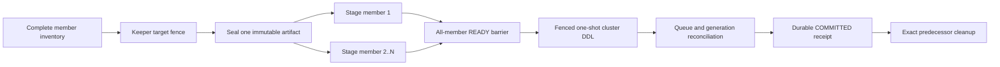

# ClickHouse cluster full-refresh publication

This guide is for data engineers making a first bounded `full_refresh` into a
one-shard ClickHouse cluster. It explains how to select the safe publication
mode, validate a manifest, and recognize a successful run. Operators recovering
an interrupted run should use the
[cluster publication runbook](clickhouse-cluster-publication-runbook.md).

## Choose the mode from the physical topology

The two modes are not interchangeable.

| Manifest mode | ClickHouse inventory | Target engine | Staging behavior |
| --- | --- | --- | --- |
| omitted or `internal` | every member reports `internal_replication=true` | direct `Replicated*MergeTree` | dpone stages once and ClickHouse replicates one shared generation |
| `external` | every member reports `internal_replication=false` | direct non-replicated `*MergeTree` | dpone stages the same sealed artifact directly to every required member |

Do not select `external` for a replicated table. Fan-out plus table replication
can duplicate delivery. Do not select `internal` for independent tables. One
staged insert would not establish a complete generation on every member.

Mixed flags, a mode/engine mismatch, an incomplete inventory, multiple shards,
or an unreachable required member block before source extraction. A requested
cluster publication never falls back to local publication.

## Prerequisites

Before the first run, confirm all of the following:

- the cluster contains exactly one shard and at least two required members;
- every member reports the same `internal_replication` value;
- every target database uses the Atomic engine;
- external mode uses direct non-replicated MergeTree-family tables;
- the target and candidate are in the same database;
- no `Distributed` access table is the publication target;
- the runtime principal can inspect cluster, database, table, column, replica,
  and distributed-DDL queue metadata;
- the runtime principal can use the platform-owned KeeperMap authority and can
  create, insert, exchange or rename, and drop managed tables;
- the runtime can connect directly to every admitted member without exposing
  endpoints or credentials in output;
- direct member connections use the native transport and the per-member ports
  advertised by `system.clusters`; an injected endpoint resolver is required
  when Docker, a proxy, NAT, or another network boundary changes those addresses;
- every resolved direct connection is opened during admission and the resolved
  endpoint set is bound into the inventory digest before extraction;
- distributed-DDL queue retention exceeds the maximum recovery window; and
- extraction produces one immutable replayable artifact with a SHA-256 digest,
  schema identity, byte size, and row count.

Local synthetic tests do not prove these properties for an external deployment.
Live certification remains **UNVERIFIED** until it is run in an explicitly
approved environment.

## First success with external replication

Install the source and sink extras:

```bash
pip install "dpone[mssql,clickhouse]"
```

Start from the checked example:

```bash
dpone check \
  examples/batch/clickhouse-external-replication-full-refresh.batch.yaml \
  --format json

dpone plan \
  examples/batch/clickhouse-external-replication-full-refresh.batch.yaml \
  --format json
```

The important manifest fragment is:

```yaml
sink:
  type: clickhouse
  table:
    schema: analytics
    name: target_table
  staging:
    schema: analytics
  strategy:
    mode: full_refresh
    max_source_bytes: 104857600
  options:
    lineage: false
    physical_design:
      storage:
        clickhouse:
          engine: MergeTree
          cluster:
            name: analytics_cluster
            ddl_scope: cluster
            replication_mode: external
            external_content_row_budget: 100000
```

The static plan includes this additive publication decision:

```json
{
  "requested": true,
  "selected": true,
  "mode": "cluster_external",
  "replication_mode": "external",
  "runtime_admission_required": true,
  "no_fallback": true
}
```

`runtime_admission_required` is intentional: a static plan cannot prove the
current member inventory, grants, Keeper state, or direct-member connectivity.
Fix every blocker before proceeding. Do not reinterpret a static pass as live
certification.

`lineage: false` is required for this bounded V2 route because it publishes the
sealed source artifact unchanged. Lineage projection and decoder-dependent
transformations fail during pre-source admission; dpone does not extract first
and silently alter the artifact later.

Run through the normal runtime entrypoint after the plan is reviewed. The
manifest contains logical `connection_ref` aliases, never credentials. Run it
only inside a deployment-provided, verified
`DPONE_RUNTIME_CONNECTION_CONTEXT`; see the
[credentials quickstart](getting-started/credentials-quickstart.md) and
[runtime startup diagnostics](airflow-runtime-startup-diagnostics.md). Retain
the artifact spool on durable worker storage by setting
`DPONE_EXTERNAL_ARTIFACT_STORE` (or `options.external_artifact_store_path`).

```bash
dpone run \
  examples/batch/clickhouse-external-replication-full-refresh.batch.yaml \
  --run-id external-cluster-full-refresh-001 \
  --format json
```

## What dpone does



The operation and logical generation identities are deterministic for the same
scheduler invocation and plan. Physical table UUIDs may differ between external
members; the logical generation binds the artifact and schema digests to the
ordered opaque member map.

An ambiguous member load is never appended again. Before publication, dpone may
drop and rebuild only the exact owned unpublished candidate, then replay the
same immutable artifact. Publication DDL is sent once and reconciled from its
bound queue entry and every required member.

## Recognize success

A successful external run has all of these properties:

- every required member reached `READY` for the same logical generation;
- the authority advanced through the fenced publication phase;
- every target exposes its desired member generation;
- the durable receipt uses
  `dpone.clickhouse.cluster-external-full-refresh-receipt.v1`;
- source state advances only after the committed receipt is durable; and
- cleanup either completed everywhere or remains explicitly recoverable.

Structured output uses opaque member IDs and digests. It excludes endpoints,
credentials, raw SQL values, source rows, and local artifact paths. Structured
runtime success and failure documents are written to stdout; a failure also
exits non-zero. Stderr is reserved for argument parsing and launcher
diagnostics.

## Retry and recovery boundary

Retry only the same scheduler operation, including the identical explicit
`--run-id external-cluster-full-refresh-001`. Dpone observes the Keeper authority,
owned candidates, queue entry, and target generations, then resumes the exact
incomplete phase. A different operation remains fenced while the earlier record
is unresolved.

Never:

- switch the manifest to local or internal mode to bypass a failure;
- blindly repeat an insert, exchange, rename, or cleanup statement;
- delete an authority row to release a fence;
- delete a candidate or predecessor without exact UUID evidence; or
- treat a partial inventory or row-count match as proof of convergence.

Continue with the [exact contract reference](clickhouse-cluster-publication-reference.md)
or the [operator recovery runbook](clickhouse-cluster-publication-runbook.md).
