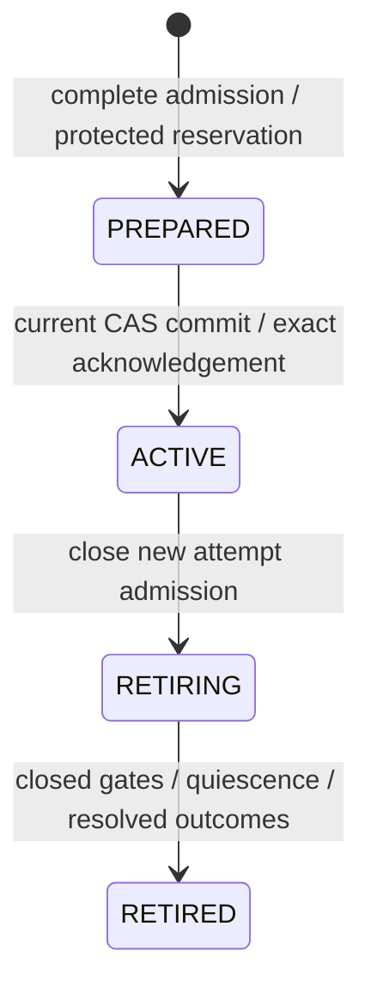

# Composition activation contract

The public factory
`dpone.app.composition_activation.build_composition_activation_coordinator`
constructs a separate v3 coordinator after verified schema admission. Cache-sync
and desired-state use that factory when
`--workspace-authority-connection-ref` (or the matching desired-state authority
field) is present. Omitting the authority reference continues to fail closed
with `DPONE_COMPOSITION_ADMISSION_UNAVAILABLE`. Native-v2 factories keep
native-only behavior.

This page is the integration contract. Follow the
[Kubernetes supervisor operations guide](guides/composition-supervisor-kubernetes.md)
for provisioning, promotion, DAG trigger, evidence, and `COMMIT_UNKNOWN`
recovery. See [composition operations](release-composition-operations.md) for
artifact delivery, and [the approved specification](feature-specs/composition-activation-execution.md)
for the full execution scope. A successful source read, plan, fake-adapter test,
cache install or launcher prepare does not certify SQL execution. Offline tests
are not route certification. A skipped live campaign is `UNVERIFIED`, never
`PASS`.

The separate [ClickHouse snapshot component](composition-clickhouse-snapshots.md)
defines strict whole-snapshot intents and one-time EXCHANGE/recovery policy.
Concrete ClickHouse gate, catalog, storage and worker qualification remain
required before that component can participate in actual parent execution.

The internal [scoped owner original](composition-scoped-execution-originals.md)
describes complete retained reads and helper effects while preserving the
activation request and attempt write projection. Its pure comparisons do not
enable this coordinator or the current SQL store to admit scoped execution.

## Worker integration components

The current implementation includes sealed deployment inputs and protected
connection construction, independent physical enrollment readers, and a parent
worker lifecycle. The worker admits once, issues credentials once, executes,
closes access, observes quiescence and business outcome, and persists the exact
terminal receipt. Missing evidence retains blocking ownership.

The shared dbt service selects either native-v2 admission or parent admission.
The parent branch rechecks the actual preflight manifest before build. Its
issued profile renderer replaces ambient credentials; the protected Linux
capture requires a separate child UID and durable supervisor records. A dbt
exit code or a writable local result file is not a parent outcome proof.

For PostgreSQL-to-MSSQL transfers, the target transaction and target-atomic state
share the target database. The protected composition control database is a
**separate database on the same SQL Server instance**. The platform installs
`render_composition_mssql_transaction_fence(control_database=..., control_schema=...)`
from `dpone.adapters.composition_mssql_transaction_fence_schema` as external SQL
batches. The issued worker receives only EXECUTE on `composition_require_transfer`
in the control database. It receives no controller role or ledger table access.
The procedure holds the shared control lock inside the actual target transaction.
The binding includes the complete operation, exact target, mutation plan, parent
attempt, issued SID and retained epochs; a receipt replay must match that binding.

The ClickHouse transport accepts only typed generation creation, Native insert
and snapshot exchange requests. Its SQL dispatch journal claims before network
I/O, retains complete response observations and prevents closure while a claim
is unresolved. A lost claim acknowledgement never permits a resend. See the
[dispatch closure decision](adr/0063-clickhouse-composition-dispatch-closure.md)
for the required protected supervisor and network boundary. These components do
not by themselves certify a live provider-to-worker campaign. Live three-cell
execution remains `UNVERIFIED` until the isolated Linux x86-64 campaign retains
evidence.

## Concrete SQL Server persistence

`dpone.adapters.composition_mssql_store.MssqlCompositionActivationStore`
implements the occurrence store with real DB-API SQL statements. It accepts an
injected factory for independent connections, an externally pinned
`expected_service_id`, and an optional `control_schema`. It retains the complete
MSSQL and ClickHouse resource closure in one protected SQL control database.
ClickHouse rows in that ledger do not themselves prove ClickHouse permissions or
writer exclusion.

The platform installs the SQL from
`dpone.adapters.composition_mssql_schema.render_composition_mssql_schema()`
explicitly, then provisions and protects the authority and domain records.
Supervised execution additionally requires administrator-installed
`render_execution_evidence_schema()` and `render_dbt_capture_schema()` batches;
base control and login-gate installation does not create these tables. See the
[administrator provisioning instructions](guides/composition-supervisor-kubernetes.md#administrator-provisioning)
for producers, order, permissions and catalog verification.
Reapplying the initial DDL fails rather than adopting existing tables. Runtime
operations never create, repair or enroll their own authority. Each transaction
requires schema version 2, the externally pinned service UUID and the complete
eight-table catalog: original columns, keys, constraints, triggers and metadata
visibility. Legacy writable table names reject admission. See the
[shared SQL storage reference](composition-shared-sql-storage.md) for generated
CHECK provenance and initial installation. The protected backend must separately
verify database continuity, role permissions, exclusive enrollment and installed
writer gates. The [schema-v2 component result](composition-shared-sql-storage.md#observed-sql-component-evidence)
records all 50 SQL cases at the named source commit; complete worker
qualification remains pending.

The store uses one short transaction-owned application lock in the control
database to serialize ledger changes. It also observes the actual SQL transaction
identity at read, callback and commit boundaries; closing and reopening a
transaction with the same lock does not preserve the original observation.
This lock is not a writer-session fence.
Requests retain canonical UTF-8 bytes and their original catalog observations.
Each mutation closes its transaction connection and independently rereads the
exact request, state, complete guard partition and epochs. A lost commit
acknowledgement permits only exact reconciliation; it never triggers a blind
mutation replay. An unavailable or changed readback requires operator recovery.

Before retirement, the store reads all durable attempts, their complete epoch
partitions and the immutable issued-principal journal. Resolved attempts require
the exact protected `CLOSED_GATES`, `QUIESCENCE` and `OUTCOME` proof triplet. Each
proof binds attempt, parent request, guard-epoch subject, backend service and
issued principal identities. `OUTCOME` also binds its terminal state; a caller
cannot promote a protected failed outcome to success. Unknown or running attempts
retain ownership. A proof document's shape or caller-supplied digest grants no
authority: trusted backend producers must create the actual observations and
protected records.

An unowned domain is not sufficient for successor admission. The store scans every
owner and operation original independently of partition rows and current domain
pointers. It validates complete original partitions before comparing guard
intersection and reopening the relevant prior terminal-proof closure. Missing
partitions, missing proof bytes and terminal-state tampering reject reservation
before any epoch is advanced.

Offline adapter tests use explicit DB-API doubles. The separate synthetic SQL
component runner exercises real control transactions; neither is the full
current/provider/native/generated/ordinary execution campaign and neither is
route certification. Public factory and cache-sync authority are shipped; the
complete live campaign remains `UNVERIFIED`.

## SQL Server attempt and connection gates

`MssqlCompositionAttemptStore` in `dpone.adapters.composition_mssql_attempts`
accepts the same connection factory, pinned service UUID and control schema.
`admit_once(attempt)` persists all selected epochs before credential issuance.
`read_exact(attempt)` audits durable state and does not authorize another executor.
Admission checks the complete protected proof triplet of relevant previous
terminal attempts; three nonempty receipt digests are insufficient.

`finalize(attempt, state=..., outcome_evidence_sha256=...)` selects a protected
OUTCOME proof for a RUNNING attempt. The argument names the proof digest; its
inner `evidence_sha256` names the actual producer's outcome evidence. Completion
requires matching closed-gate and quiescence proofs for every issued principal,
including other backends. A SQL gate cannot supply business-outcome evidence.
The explicit `reconcile_unknown(...)` operation accepts a newly protected success
or failure proof only for an audited COMMIT_UNKNOWN attempt. It issues no
credentials and cannot change an already successful or failed attempt.

`MssqlCompositionLoginGate` in `dpone.adapters.composition_mssql_login_gate`
additionally requires the exact `control_database`. `issue_once(attempt)` first
commits a unique login SID/name to the protected journal, then creates its bounded
target users and verifies READY on another connection. Only that invocation
receives the memory-only password. A replay cannot reset, enable or recreate the
principal. Driver tracing must be disabled on these injected connections.

`close(attempt)` irreversibly closes the reconnect gate and verifies the exact
disabled SID before persisting closure evidence. `prove_quiescence(attempt)`
requires server-visible absence of that original SID's sessions and transactions.
Missing or uncertain principal state remains blocking. Process exit, gate table
presence and login disablement alone are insufficient quiescence evidence.

The platform separately installs
`render_composition_mssql_login_gate(control_database=...)` from
`dpone.adapters.composition_mssql_gate_schema`. Execute its `GO` batches preserving
the trigger definition bytes. Provision the disabled gate reader, its minimum
catalog/DMV grants and the protected control-table read permission as documented
by the renderer. Enroll newly isolated target databases with their actual
database identity, managed schemas and exact bounded writer role. Runtime checks
the installed trigger definitions and permissions; it does not provision them.
For this initial cell the trusted controller must own each dedicated target
database, the bounded role must be owned by `dbo`, and managed objects must use
inherited or `dbo` ownership. Read-only principals may not acquire writer authority
through object or role ownership.
The controller's exact `dbo` principal may retain its membership in the fixed
`db_owner` role. This exception requires principal ID 1 and the original
controller SID; it does not admit any other `db_owner` member.
The catalog policy reports fixed `login_database_policy_*` refusal reasons for
role/object ownership, unsupported objects, unmanaged scope, assemblies,
authentication, ambient grants and memberships. These declared policy failures
are distinct from `control_operation_unknown`, which indicates an unavailable or
uncertain driver operation. A diagnostic reason never relaxes the predicate.
LOGON synchronization and DMV visibility still require real tests on the pinned
SQL Server version before worker activation is enabled.

The gate-reader permission probe restores the controller before it emits its
result set. A driver that reads only the first row must not leave subsequent
ledger or login operations running under the reader's restricted identity.

## Disposable SQL component check

The `Composition SQL Server component` GitHub workflow uses a clean candidate
checkout, Linux x86-64, Docker and Microsoft ODBC Driver 18. Its equivalent command
on an explicitly approved disposable runner is:

```bash
uv sync --locked --extra mssql
uv run python tools/composition_mssql_synthetic.py \
  --profile gate \
  --output-dir "$RUNNER_TEMP/composition-mssql-gate-${GITHUB_RUN_ID}-${GITHUB_RUN_ATTEMPT}"
```

The output must be a new directory outside the checkout. The runner creates its
own pinned SQL Server container, random loopback port and synthetic database;
it does not accept an existing service. It retains only sanitized `summary.json`
and `junit.xml`, recording exact source, image, driver and server identity. All
expected cases must execute without skips. A cleanup failure changes the result
to FAIL. No raw driver diagnostics or credentials belong in these artifacts.

The workflow runs four independent profiles, each in its own fresh container:

| Profile | Required cases | Evidence scope |
|---|---|---|
| `store` (default) | 7 | Real ledger DDL, whole-parent transactions, conflicts, lost acknowledgements and retirement |
| `gate` | 16 | Real issued credentials, target permissions and continuity, monotonic LOGON closure, races, in-flight transactions and explicit unknown recovery |
| `trust` | 9 | Real append-only nonproduction trust, original bytes, revision races, schema integrity, lock/acknowledgement failures and bounded provisioner permissions |
| `registration` | 18 | Exact grant originals and complete membership, historical trust, replay and concurrency, rollback/unknown acknowledgements, catalog/session enforcement and restricted-login permissions |

The gate profile uses the actual closed-gate and quiescence producers. Its
test-only outcome producer binds observed SQL and independent reconciliation;
it does not qualify the future native/transfer worker outcome producer. The
runner rejects a missing, skipped, duplicate or foreign case, including results
from the other profile. JUnit retains bounded numeric SQL error identifiers and
fixed domain reasons for failure diagnosis; raw driver messages stay suppressed.
The trust profile uses inert public policy documents as storage fixtures. It
does not verify actual grant signatures, consume grants or authorize workers.
Its provisioner case verifies database permissions through an impersonated
database user; it does not qualify a separately authenticated network login.
Select it with `--profile trust` in the same disposable command.
The registration profile also uses inert unsigned storage fixtures. It requires
the real 8 MiB bundle boundary, complete membership and historical-original audits,
and explicit lost-acknowledgement recovery. Its restricted-login case uses actual
server/database tokens. The runner creates an exact two-byte public integer file
inside that new container; administrator SQL must independently read/hash it and
successfully import it before a restricted principal's bulk-import refusal can
serve as permission evidence. A missing file or unsupported operation is a failure,
not a verified denial. Use `--profile registration` to select this inventory.
Default non-live collection skips all profiles without opening a connection.

This component's ClickHouse rows are synthetic ledger metadata. Route
qualification and complete worker execution remain separate observations;
a component PASS must not be reported as their certification. LOGON conclusions
require a green `gate` result on the exact source and pinned server version;
the `store` profile supplies no such evidence.

## Required downstream matrix

| Workload | Required route | Base contract | Actual parent execution |
|---|---|---|---|
| Native dbt | Verified SQL Server execution-pack.v2 | Full native workflow/model/helper ownership | Installed cell `sqlserver_dbt_v1`; live campaign `UNVERIFIED` |
| Native-generated transfer | MSSQL to ClickHouse full_refresh | Separate producer-aware classifier; positive cumulative max_source_bytes required | Installed cell `mssql_clickhouse_full_refresh_v1`; live campaign `UNVERIFIED` |
| Ordinary transfer | PostgreSQL to MSSQL full_refresh | Explicit external target_atomic state; table extraction only | Installed cell `postgres_mssql_full_refresh_v1`; live campaign `UNVERIFIED` |
| Other cells, including ordinary MSSQL to ClickHouse | Not in this initial matrix | Rejected | Unsupported |

The required downstream spans SQL Server and ClickHouse. A SQL Server-only
coordinator or synthetic pass does not satisfy this matrix. The same named
execution cell cannot make an ordinary declaration eligible for the native-only
ClickHouse route.

## Exact Python boundaries

Read a complete parent with the production source verifier:

```python
from pathlib import Path
from dpone.app.release_composition import build_composition_source_reader

sources = build_composition_source_reader().read_sources(
    Path("synthetic/composed"),
    expected_release_id=expected_parent_release_id,
)
```

The returned `CompositionSourceSnapshot` retains the native child identity,
ordinary inventory identity, every final workload pin, complete relation writes,
and bounded original transfer manifests. Native-generated transfers are included.
The reader revalidates the entire producer closure before returning. Ordinary
archives retain support for declared SQL files and generated runtime manifests.
Their delivery acceptance is separate from the narrower execution matrix.
State-bearing ordinary MSSQL packs use
`AirflowCompactPackBuilder.build(..., outlet_binding="logical")`; the verifier
reconstructs the same projection. Aliases gain physical authority only from later
verified deployment bindings, never from the logical outlet.

`dpone.manifest.composition_execution_plan.plan_composition_execution(sources)`
classifies the complete workload union. Native-generated declarations retain
`runtime`, `quality`, `gitops`, `sink.mode`, source/target options and their byte
budget. They are not stripped into an ordinary-manifest shape. The protected
backend must subsequently validate all option effects, physical design, state,
permissions, enrollment and writer-session capabilities.

Production callers use
`dpone.app.composition_activation.build_composition_activation_coordinator(*,
cache_root, authority_connection_ref, control_schema="dpone_control")`. That
factory installs callable roots for `sqlserver_dbt_v1`,
`postgres_mssql_full_refresh_v1`, and `mssql_clickhouse_full_refresh_v1`. It
does not pass a v3 parent to the native-only coordinator. At DAG trigger,
`sqlserver_dbt_v1` can reach a worker root when parent context exists.
`postgres_mssql_full_refresh_v1` can reach `CompositionTransferExecutionRoot`
when that context and `DPONE_CACHE_ROOT` reopen the sealed plan.
`mssql_clickhouse_full_refresh_v1` can reach
`CompositionClickHouseExecutionRoot` when that plan, protected runtime snapshot
capture, and enrolled supervisor/HTTP collaborators compose. Pack-exec does
not start login or ingest until an independent transfer observer can prove
receipt/row/content, or until catalog inspect can independently classify
publication; missing that proof fail-closes as
`composition_ordinary_worker_unavailable`. That three-cell trigger campaign
is not ready.

Application integrators that construct
`dpone.services.composition_activation_coordinator.CompositionActivationCoordinator`
directly still supply keyword capabilities `inputs`, `preparation` and `stores`.
`CompositionActivationPreparation(physical=...)` uses
`CompositionPhysicalAdmissionService(backend=...)` to merge aliases before
physical observation. The ports document the protected transaction and session
requirements; in-memory or filesystem-only implementations do not meet them.

The coordinator exposes:

- `prepare(*, projection_root, activation_id, environment, release_id,
  deployment_id, previous_deployment_id)`;
- `activate(prepared, *, projection_root)`;
- `require_active(...)` with the same coordinates as `prepare`;
- `begin_retirement(active, *, projection_root)`;
- `finalize_retirement(retiring, *, projection_root)`.

The additive materializer parameter is
`DeploymentCacheMaterializer(..., composition_activation_coordinator=coordinator)`.
It is separate from the existing native-only `workspace_activation` capability.
A native receipt, untyped result, missing constituent, stale request or changed
fencing epoch cannot acknowledge parent activation. Production deployment
composition must supply all protected capabilities before using this parameter.

## Identity and physical collision algorithm

1. Verify original native and ordinary sources, final transport, parent identity,
   selected native trios and exact source-to-workload membership.
2. Bind the activation to the sealed deployment/runtime context and a UUIDv4
   occurrence. Classify every workload; reject an unavailable cell before any
   reservation or predecessor drain.
3. Resolve every binding to its protected service incarnation and physical
   collision domain. Aliases, credentials, hostnames and engine versions are not
   physical identities.
4. Group all writes by the resulting domain. Ask the backend for one complete
   catalog/collation comparison per group, including native intermediate, backup
   and helper relations and all modeled transfer effects. Query-local equivalence
   IDs from separate alias queries are not comparable.
5. Reject missing/duplicate slots or any equivalent write coordinates. Persist
   the immutable request containing full workload/write membership, stable
   resources and the original observation digest.
6. On later phases, reread the immutable request and reverify source, runtime and
   stable physical bindings. Legitimate table create/modify timestamps must not
   change the original request identity.

`dpone.contracts.composition_control` is the explicit contract boundary for
application services and ports. It only reexports cohesive DTOs/policies; it
performs no I/O, backend selection or policy registration.

## Lifecycle and failure semantics



The store must reserve all guards without expiration, close predecessor admission,
prove its attempts quiescent with resolved outcomes, and transfer exact epochs
under protected control transactions. Cross-service data writes remain separate
transactions. Drain-first handover does not promise zero downtime.

The cache validates a typed PREPARED receipt before switching `current` and the
same full request/epochs in ACTIVE afterward. A failed post-pointer acknowledgement
returns `DPONE_COMPOSITION_ACTIVATION_COMMIT_UNKNOWN` with
`state_may_have_changed: true` and `recovery_required: true`. Retain sealed inputs,
original request and control evidence. Old pointer bytes alone do not prove the
old occurrence remains executable after a protected ownership transfer.

`CompositionAttemptIdentity` binds the parent activation request, constituent,
workload pack, verified plan, actual DAG run/task/try/map coordinates and complete
applicable guard epochs. Protected admission must evaluate the entire ledger in
the same transaction as reservation. The pure policy rejects RUNNING replay,
stale or missing epochs, retired parents and overlapping RUNNING or COMMIT_UNKNOWN
attempts across native and ordinary workloads.

A terminal receipt requires independent closed-gate, server-quiescence and durable
outcome evidence. A closed gate or exited process does not resolve an unknown SQL
commit. No TTL may release its resource ownership. The installed roots apply these checks when pack-exec reaches them. Ordinary pack-exec reaches the transfer root only with parent context and a reopened cache plan. ClickHouse pack-exec reaches `CompositionClickHouseExecutionRoot` when that plan, protected runtime snapshot capture, and enrolled supervisor/HTTP collaborators compose; missing originals fail-close. A missing live observation remains `UNVERIFIED`, not a pass.

## Downstream CI and recovery acceptance

The required isolated synthetic campaign is:

```text
verified native + ordinary producer outputs
  -> complete parent -> deployment -> current ACTIVE
  -> provider loads every expected DAG -> explicit DAG triggers
  -> actual native dbt SQL -> generated MSSQL-to-ClickHouse transfer
  -> actual ordinary PostgreSQL-to-MSSQL transfer
  -> independent row/schema/state/evidence reconciliation
```

Native DAG ordering does not establish cross-constituent dependencies. With
`schedule: null`, trigger the relevant DAGs explicitly. Do not handcraft runtime
plans or rewrite producer/receipt identities.

The campaign must retain exact source commit, environment versions, parent and
child identities, activation, all workload/run/attempt IDs and complete observed
results. It must reconcile Decimal/numeric precision and scale, GUID, NULL,
vanished rows, empty full snapshots and measured cumulative source bytes. Source
stream bytes are distinct from post-transcode HTTP bytes.

Required faults include physical aliases/collation collisions, unsupported cells,
stale CAS/context/epochs, replayed RUNNING attempts, lost gate issuance ACK,
credential reconnection races, current commit without ACTIVE ACK, committed SQL
without evidence, delayed ClickHouse staging INSERTs and uncertain EXCHANGE.
ClickHouse recovery must compare persisted before/after UUID identities: blindly
retrying EXCHANGE can exchange the tables back. Close and drain stage writers
before exposing that UUID as the target. Deployment rollback does not undo SQL.

Current live acceptance remains `UNVERIFIED` until the isolated Linux x86-64
campaign retains provider-to-worker evidence for every installed cell. That
campaign is not ready: shipped pack-exec reaches `sqlserver_dbt_v1` when
parent context exists, `postgres_mssql_full_refresh_v1` when that context
and `DPONE_CACHE_ROOT` reopen the sealed plan, and
`mssql_clickhouse_full_refresh_v1` when that plan, protected runtime snapshot
capture, and enrolled supervisor/HTTP collaborators compose. ClickHouse
catalog inspect hashes actual HTTP responses and does not invent typed B
content, so publication stays `COMMIT_UNKNOWN` without independent content
parity. Offline tests and SQL component profiles are not that campaign and
are not route certification.

- Protected SQL Server enrollment, one-time login issuance, LOGON closure, DMV
  quiescence, and issued dbt/ordinary credentials must be observed on the pinned
  server version.
- ClickHouse physical enrollment, per-attempt writer closure, staged snapshot
  publication with atomic EXCHANGE, and durable recovery intent must be observed
  on the pinned service.
- Genuine route qualification still requires the separately approved
  [nonproduction authority family](feature-specs/nonproduction-composition-authority.md).
  Local synthetic receipts cannot be relabeled as production.
- Local ARM64 Docker is not the vendor-supported SQL Server container cell.

The public factory, supervisor build flags, and
`--workspace-authority-connection-ref` are shipped. Operate them from the
[Kubernetes supervisor guide](guides/composition-supervisor-kubernetes.md).
