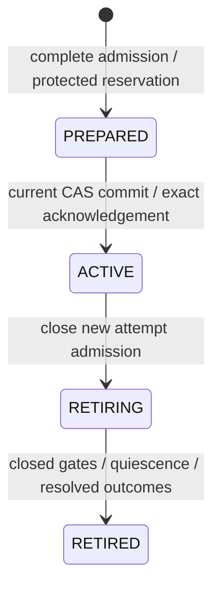

# Composition activation contract

The base coordinator provides complete parent source, physical-admission and
occurrence contracts. **Public composition activation and actual worker execution
remain unavailable until protected backend adapters and worker fencing are
installed and verified.** No production factory or new cache-sync CLI option is
provided by this base change. The existing default returns
`DPONE_COMPOSITION_ADMISSION_UNAVAILABLE`.

This page describes the implemented integration boundary and the required
follow-up acceptance. See [composition operations](release-composition-operations.md)
for artifact delivery, and [the approved specification](feature-specs/composition-activation-execution.md)
for the full execution scope. A successful source read, plan, fake-adapter test,
cache install or launcher prepare does not certify SQL execution.

## Required downstream matrix

| Workload | Required route | Base contract | Actual parent execution |
|---|---|---|---|
| Native dbt | Verified SQL Server execution-pack.v2 | Full native workflow/model/helper ownership | UNVERIFIED; protected SQL login gate and worker integration pending |
| Native-generated transfer | MSSQL to ClickHouse full_refresh | Separate producer-aware classifier; positive cumulative max_source_bytes required | UNVERIFIED; protected CH gate, Atomic publication and canonical route evidence pending |
| Ordinary transfer | PostgreSQL to MSSQL full_refresh | Explicit external target_atomic state; table extraction only | UNVERIFIED; parent fence inside the actual target transaction pending |
| Other cells, including ordinary MSSQL to ClickHouse | Not in this initial matrix | Rejected | Unsupported |

The required downstream spans SQL Server and ClickHouse. A SQL Server-only
coordinator or synthetic pass does not satisfy this matrix. The same named
execution cell cannot make an ordinary declaration eligible for the native-only
ClickHouse route.

## Exact Python boundaries

Read a complete parent with the production source verifier:

```python
from pathlib import Path
from dpone.app.release_composition import build_composition_source_reader

sources = build_composition_source_reader().read_sources(
    Path("synthetic/composed"),
    expected_release_id=expected_parent_release_id,
)
```

The returned `CompositionSourceSnapshot` retains the native child identity,
ordinary inventory identity, every final workload pin, complete relation writes,
and bounded original transfer manifests. Native-generated transfers are included.
The reader revalidates the entire producer closure before returning. Ordinary
archives retain support for declared SQL files and generated runtime manifests.
Their delivery acceptance is separate from the narrower execution matrix.
State-bearing ordinary MSSQL packs use
`AirflowCompactPackBuilder.build(..., outlet_binding="logical")`; the verifier
reconstructs the same projection. Aliases gain physical authority only from later
verified deployment bindings, never from the logical outlet.

`dpone.manifest.composition_execution_plan.plan_composition_execution(sources)`
classifies the complete workload union. Native-generated declarations retain
`runtime`, `quality`, `gitops`, `sink.mode`, source/target options and their byte
budget. They are not stripped into an ordinary-manifest shape. The protected
backend must subsequently validate all option effects, physical design, state,
permissions, enrollment and writer-session capabilities.

Application integrators construct
`dpone.services.composition_activation_coordinator.CompositionActivationCoordinator`
with keyword capabilities `inputs`, `preparation` and `stores`.
`CompositionActivationPreparation(physical=...)` uses
`CompositionPhysicalAdmissionService(backend=...)` to merge aliases before
physical observation. The ports document the protected transaction and session
requirements; in-memory or filesystem-only implementations do not meet them.

The coordinator exposes:

- `prepare(*, projection_root, activation_id, environment, release_id,
  deployment_id, previous_deployment_id)`;
- `activate(prepared, *, projection_root)`;
- `require_active(...)` with the same coordinates as `prepare`;
- `begin_retirement(active, *, projection_root)`;
- `finalize_retirement(retiring, *, projection_root)`.

The additive materializer parameter is
`DeploymentCacheMaterializer(..., composition_activation_coordinator=coordinator)`.
It is separate from the existing native-only `workspace_activation` capability.
A native receipt, untyped result, missing constituent, stale request or changed
fencing epoch cannot acknowledge parent activation. Production deployment
composition must supply all protected capabilities before using this parameter.

## Identity and physical collision algorithm

1. Verify original native and ordinary sources, final transport, parent identity,
   selected native trios and exact source-to-workload membership.
2. Bind the activation to the sealed deployment/runtime context and a UUIDv4
   occurrence. Classify every workload; reject an unavailable cell before any
   reservation or predecessor drain.
3. Resolve every binding to its protected service incarnation and physical
   collision domain. Aliases, credentials, hostnames and engine versions are not
   physical identities.
4. Group all writes by the resulting domain. Ask the backend for one complete
   catalog/collation comparison per group, including native intermediate, backup
   and helper relations and all modeled transfer effects. Query-local equivalence
   IDs from separate alias queries are not comparable.
5. Reject missing/duplicate slots or any equivalent write coordinates. Persist
   the immutable request containing full workload/write membership, stable
   resources and the original observation digest.
6. On later phases, reread the immutable request and reverify source, runtime and
   stable physical bindings. Legitimate table create/modify timestamps must not
   change the original request identity.

`dpone.contracts.composition_control` is the explicit contract boundary for
application services and ports. It only reexports cohesive DTOs/policies; it
performs no I/O, backend selection or policy registration.

## Lifecycle and failure semantics



The store must reserve all guards without expiration, close predecessor admission,
prove its attempts quiescent with resolved outcomes, and transfer exact epochs
under protected control transactions. Cross-service data writes remain separate
transactions. Drain-first handover does not promise zero downtime.

The cache validates a typed PREPARED receipt before switching `current` and the
same full request/epochs in ACTIVE afterward. A failed post-pointer acknowledgement
returns `DPONE_COMPOSITION_ACTIVATION_COMMIT_UNKNOWN` with
`state_may_have_changed: true` and `recovery_required: true`. Retain sealed inputs,
original request and control evidence. Old pointer bytes alone do not prove the
old occurrence remains executable after a protected ownership transfer.

`CompositionAttemptIdentity` binds the parent activation request, constituent,
workload pack, verified plan, actual DAG run/task/try/map coordinates and complete
applicable guard epochs. Protected admission must evaluate the entire ledger in
the same transaction as reservation. The pure policy rejects RUNNING replay,
stale or missing epochs, retired parents and overlapping RUNNING or COMMIT_UNKNOWN
attempts across native and ordinary workloads.

A terminal receipt requires independent closed-gate, server-quiescence and durable
outcome evidence. A closed gate or exited process does not resolve an unknown SQL
commit. No TTL may release its resource ownership. These policy checks still need
to be connected to actual worker sessions and target transactions.

## Downstream CI and recovery acceptance

The required isolated synthetic campaign is:

```text
verified native + ordinary producer outputs
  -> complete parent -> deployment -> current ACTIVE
  -> provider loads every expected DAG -> explicit DAG triggers
  -> actual native dbt SQL -> generated MSSQL-to-ClickHouse transfer
  -> actual ordinary PostgreSQL-to-MSSQL transfer
  -> independent row/schema/state/evidence reconciliation
```

Native DAG ordering does not establish cross-constituent dependencies. With
`schedule: null`, trigger the relevant DAGs explicitly. Do not handcraft runtime
plans or rewrite producer/receipt identities.

The campaign must retain exact source commit, environment versions, parent and
child identities, activation, all workload/run/attempt IDs and complete observed
results. It must reconcile Decimal/numeric precision and scale, GUID, NULL,
vanished rows, empty full snapshots and measured cumulative source bytes. Source
stream bytes are distinct from post-transcode HTTP bytes.

Required faults include physical aliases/collation collisions, unsupported cells,
stale CAS/context/epochs, replayed RUNNING attempts, lost gate issuance ACK,
credential reconnection races, current commit without ACTIVE ACK, committed SQL
without evidence, delayed ClickHouse staging INSERTs and uncertain EXCHANGE.
ClickHouse recovery must compare persisted before/after UUID identities: blindly
retrying EXCHANGE can exchange the tables back. Close and drain stage writers
before exposing that UUID as the target. Deployment rollback does not undo SQL.

Current acceptance gaps are explicit:

- Protected SQL Server enrollment, one-time login issuance, LOGON closure barrier,
  DMV quiescence and actual dbt/ordinary worker credential injection.
- ClickHouse physical enrollment, per-attempt writer closure, staged snapshot
  publication with atomic EXCHANGE and durable recovery intent.
- Genuine qualifying full_refresh route evidence for the unchanged native-v2
  compiler; existing local nonproduction receipts cannot be relabeled.
- The public authority-aware app factory/CLI and complete current/provider/SQL
  reconciliation run. Local ARM64 Docker is not the vendor-supported SQL Server
  container cell; use an isolated Linux x86-64 runner for that proof.

The base contracts are reviewable independently. These gaps remain requirements
for completing the feature and declaring downstream readiness.
