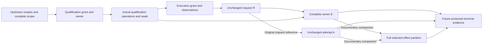

# Scoped execution owner originals

This reference is for platform developers implementing the approved
[nonproduction composition authority](nonproduction-composition-authority.md).
The internal owner envelope describes the complete retained physical scope and
each execution workload's declared effects. It preserves the existing activation
request and attempt originals while making their smaller write projection
explicit. It does not acquire ownership, authenticate observations or enable a
worker. Current SQL adapters and public factories do not admit this envelope.

**Implementation status:** this page describes the approved isolated codec
candidate. Its modules are not present in the integrated branch at `dfccfad`.
Correctness review passed after the scoped-owner corrections, but architecture
checks still block integration. API names below specify that candidate, not
imports available from the current checkout or an installed release.

See [shared ownership](composition-shared-ownership.md) and
[ADR 0061](adr/0061-shared-composition-physical-ownership.md) for the eventual
protected transfer. The fixed [qualification plan grammar](nonproduction-qualification-plans.md)
remains unchanged; declaring a native view here does not qualify a native recipe.

## Three distinct subjects

| Subject | Meaning | Existing behavior |
|---|---|---|
| `R` | Exact embedded nonproduction activation request digest | Unchanged request bytes and logical write partition |
| `E` | SHA256 of the entire scoped owner document | New mandatory complete owner subject |
| `A` | Exact original attempt digest | Unchanged attempt bytes; its activation-request field still names `R` |

The owner reference remains `execution` plus the actual activation UUID. There
is no second owner ID, optional attachment or fallback to `R`. Deleting a read,
retained helper, observation or source-seal association changes `E` even when
the legacy write projection and `R` stay unchanged.

Observation originals precede the owner that names their digest. They cannot
contain that owner's digest or later transfer/terminal hashes. Source-seal
descriptors retain the original evidence association; their presence does not
establish that the evidence was acquired or verified.

## Exact document and limits

The schema is `dpone.composition-scoped-execution-owner.v1`. Required fields are
`schema`, `request`, `scope_sha256`, `claims`, `objects`,
`retained_source_ids`, `workloads`, `observations` and `handoff`.
No duplicated request/owner hash, scope body, state flag, cached selected guards
or authority boolean is stored.

The outer canonical UTF-8 JSON document is bounded at 8 MiB. The embedded
request and qualification-operation codecs retain their own 1 MiB limits.
Decoding requires the independently expected digest and exact canonical bytes;
unknown/duplicate fields, nonfinite JSON, unsupported types and unsorted or
duplicate collections reject. Frozen, slotted values revalidate nested originals
for serialization, hashing and comparison, including after object tampering.

| Collection | Limit and ordering |
|---|---|
| Claims and observations | 1–256, by guard; exactly one observation per claim |
| Read/write subjects | At most 8192 across all claims: sum of read-subject counts plus write-subject counts; a subject in both directions counts twice |
| Objects | 1–8192, by object ID; complete claim subject coverage |
| Workloads | 1–64, by workload ID; exactly the request workloads |
| Retained source IDs | 1–8192, by object ID |
| Effects | At most 8192 across all workloads, by object/access/purpose triple |
| Genuine write bindings | At most 8192 across all workloads, by legacy write subject |
| Epoch moves | 1–256, by guard; the complete owner partition |
| Seal associations | 1–64, by original operation digest; exact retained source coverage |

Existing lower limits remain independent. Exceeding a limit rejects the complete
document; no subset is retained and no input is normalized into acceptance.

## Objects, observations and workload effects

Each object contains `object_id`, `connector`, `service_id`,
`physical_subject_sha256`, `subject_sha256`, `object_kind` and
`qualified_name`. The closed kind matrix is:

| Connector | Kinds | Qualified name |
|---|---|---|
| MSSQL | table, view | database/schema/object, three separate parts |
| PostgreSQL | table, enum, sequence | database/schema/object, three separate parts |
| ClickHouse | table | database/object, two separate parts |

Parts match `[A-Za-z_][A-Za-z0-9_]*`, at most 63 characters for PostgreSQL and
128 otherwise. Case is retained. SQL fragments, wildcard names and implicit
search-path resolution reject. Staging, helper and state objects need explicit
coordinates. Lexically different names still require actual alias observation.

Declared identity is connector/service/physical-domain/subject. Two object IDs
cannot split one such identity or duplicate its qualified coordinate. Each
observation names its guard, every object ID in that domain, and one bounded
original descriptor. Its digest equals the full claim's observation digest.
The exact request resource must match that execution claim and observation.
Qualification observations may legitimately have different original digests.

Nested fields are closed and retain these exact serialized names:

| Value | Required fields |
|---|---|
| Physical claim | `connector`, `service_id`, `physical_subject_sha256`, `observation_sha256`, `role`, `read_subjects`, `write_subjects` |
| Observation | `guard_id`, `object_ids`, `original` |
| Workload | `workload_id`, `effects`, `write_bindings` |
| Effect | `object_id`, `access`, `purpose` |
| Write binding | `write`, `object_id` |
| Embedded genuine write | `project_path`, `workflow_id`, `resource_id`, `kind`, `connector`, `connection_ref`, `database`, `schema`, `relation`, `role` |
| Original descriptor | `path`, `sha256`, `size_bytes` |

The original write requires plain strings in every field except `database`,
which also accepts `null`; even its default `role` is explicit on the wire.

Each workload contains its ID, exact effect triples and genuine legacy write
bindings. A binding contains the original ten-field `DbtRelationWrite` and the
declared object ID. Existing logical write hashes are not physical subject
hashes: the total, injective bridge reproduces every request workload and resource
write partition. Different legacy writes cannot map to the same declared object.
Actual backend aliases remain a later resolver obligation.

The wrapper validates a detached copy of each original write and requires all
fields to remain equal. It never invokes a mutating normalization on the supplied
original. An alias canonicalized during legitimate original construction remains
valid; changing an embedded canonical connector to an alias later rejects.

| Request execution cell | Genuine writes | Required retained read |
|---|---|---|
| `sqlserver_dbt_v1` | MSSQL model/unit-test table or view | No artificial minimum for a constant model |
| `mssql_clickhouse_full_refresh_v1` | ClickHouse transfer target table | At least one retained MSSQL table/view |
| `postgres_mssql_full_refresh_v1` | MSSQL transfer target table | At least one retained PostgreSQL table |

The required access is independent of purpose. Source and helper reads of one
object may coexist as separate triples; both count toward the effect limit and
select one guard. A purpose never grants write access. Qualification-only seed,
enum or sequence writes stay in the complete owner but need no execution effect
or invented legacy write. Every actual execution effect must belong to the full
qualified directional scope.

## Handoff facts and exact comparisons

The handoff contains the qualification owner key and subject, complete epoch
moves, and original source-seal associations. Each move has a guard, qualification
epoch and execution epoch. The old epoch is 1 through `2**63 - 2`; the new epoch
is exactly old plus one. There is no additional-acquisition field.

| Nested handoff value | Required fields |
|---|---|
| Handoff | `qualification_owner_key`, `qualification_owner_subject_sha256`, `epochs`, `source_seals` |
| Entry in `epochs` | `guard_id`, `qualification_epoch`, `execution_epoch` |
| Entry in `source_seals` | `source_object_ids`, `operation`, `original` |

`operation` contains the complete unchanged qualification-operation document
with `schema`, `owner_key`, `owner_subject_sha256`, `qualification_run_id`,
`grant_sha256`, `fixture_plan_sha256`, `qualification_plan_sha256`,
`work_item_id`, `work_item_sha256`, `action`, `runner_invocation_id`,
`try_number` and `guard_epochs`;
`original` is its evidence descriptor with `path`, `sha256` and `size_bytes`.
The arrays serialize every retained source and epoch, including those absent
from the request's legacy write projection.

Each association contains sorted retained source IDs, an unchanged original
`source_seal` operation and its evidence descriptor. Every source occurs exactly
once. Operation owner subjects and old epochs must match the complete handoff;
the operation must select every named source's guard. Seal paths and digests are
unique and cannot be reused as execution observation descriptors.

The internal `CompositionScopedExecutionOwner` API provides:

| API | Documentary result |
|---|---|
| `to_dict()`, `to_bytes()`, `from_bytes(raw, expected_sha256=...)` | Complete recursively validated original |
| `owner_reference`, `owner_key` | Existing execution owner identity |
| `request_sha256`, `subject_sha256` | `R` and `E`, respectively |
| `guard_epochs` | Every intended execution epoch from the handoff |
| `require_originals(qualification_owner=..., qualification_grant=..., execution_grant=...)` | Exact original grants, full equal signed scopes, directional claim sets/roles, qualification identity and seal-owner comparison |
| `require_attempt(attempt)` | Validate unchanged `A` against `R`, workload/constituent/pack and exact legacy write epochs; return epochs selected by all declared workload effects |

The attempt comparison does not manufacture a plan fingerprint or verify an
actual scheduler. Complete supplied-original equality does not authenticate the
originals, establish current epochs or prove independently observed effects.

New malformed-value reasons use `CompositionAdmissionError` with fixed
`scoped_execution_object`, `scoped_execution_observation`,
`scoped_execution_write_binding`, `scoped_execution_workload`,
`scoped_execution_handoff`, `scoped_execution_owner`,
`scoped_execution_originals`, `scoped_execution_attempt`,
`scoped_execution_document` or `scoped_execution_subject` reasons. Diagnostics
do not include document payloads. Correct the complete original and its producer;
do not remove a field or supply a smaller expected partition to bypass rejection.

## Protected execution remains unavailable

A coordinated storage change must persist `E` as the owner subject while keeping
`A` bound to `R`, audit all operation domains and reject missing envelopes. Actual
transfer must move the exact entire Q scope directly to E in the same exclusive
control transaction, advancing every epoch once with no unowned interval.
Unknown acknowledgements retain blocking ownership until complete evidence shows
the exact committed transfer or independently proves its absence.

A mandatory future scoped terminal association must bind E/R/A, every selected
effect and epoch, all issued read/write authorities, the unchanged legacy proof
triplet and the final outcome. The current MSSQL/ClickHouse issued-authority
codec and single-MSSQL gate proof do not close PostgreSQL readers or helpers.
Missing or duplicate terminal evidence cannot fall back to the legacy projection.

Actual source-generation closure and finite export bounds remain required. A
native predecessor may create a new downstream source generation; an earlier
qualification seal cannot prove that generation. Full native recipe support,
protected observers, lifecycle counters, source leases, issuers and the actual
current/provider/worker SQL campaign remain separate unfinished work. These
codecs add no runnable self-service path or production/native-v2 migration.
