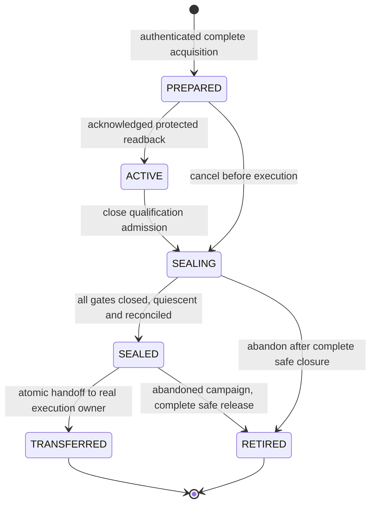

# Shared physical ownership for composition

This is the implementation design for the already approved
[nonproduction composition campaign](feature-specs/nonproduction-composition-authority.md).
The shared schema-v2 journal and existing execution adapters are implemented.
The [controlled SQL component evidence](composition-shared-sql-storage.md#observed-sql-component-evidence)
records all 50 cases at an exact source commit. **The qualification lifecycle
and complete worker campaign remain pending**.
[ADR 0061](adr/0061-shared-composition-physical-ownership.md)
records the architecture decision. The closed owner, physical-claim and
qualification-operation records are implemented as structural contracts only.
Existing public scoped factories remain closed.
The [SQL implementation contract](composition-shared-sql-storage.md) freezes
tables, interfaces, complete history audits and the existing execution projections.
The [qualification plan originals](nonproduction-qualification-plans.md) define
the bounded fixture/work-item codecs and declared dependencies used before
protected acquisition; their comparisons establish no execution authority.

## Purpose and operator journey

Platform engineers enroll newly isolated SQL Server, PostgreSQL and ClickHouse
participants. Data engineers qualify real routes before compiling the complete
native/ordinary parent. Operators then activate, execute, reconcile and retire
that parent. Physical ownership must survive the interval between qualification
and execution so that another activation cannot modify retained source data or
an uncertain target outcome.

Registration records original grants. Acquisition additionally owns the complete
physical scope. Sealing closes qualification mutations while preserving ownership.
Transfer changes ownership to the real activation. An unknown operation blocks
release until independent reconciliation. These are distinct observable states;
a registration or signed report alone is insufficient to advance them. No new
CLI command or runnable qualification example is introduced by this design.

## Identity and storage

`owner_kind` is exactly `execution` or `qualification`; `owner_id` is the actual
activation UUID or qualification-run UUID. The internal key is SHA-256 of exact
canonical UTF-8 `{schema: dpone.composition-control-owner-key.v2, owner_kind,
owner_id}`. Both key and `(kind, id)` are unique. Original subject bytes and hash
are immutable. Changing a grant or request cannot replace an existing owner's
subject. The owner key is never used as a physical guard.

MSSQL and ClickHouse physical guard preimages and hashes remain unchanged.
PostgreSQL gets an explicit new internal physical claim using the same domain
formula and a protected database-incarnation subject. Old physical-resource and
wire readers retain their closed accepted variants. Aliases, principals, campaign
and authority family cannot split one physical domain into separate locks.

Execution owners retain original request bytes and request hashes. Their operation
keys remain the existing attempt hashes; original attempt/proof bytes and existing
Python lifecycle APIs remain unchanged. Qualification owner records instead bind
the real run, exact registration/consumption and grant digests, fixture/qualification
plan digests, scope, environment and campaign. Qualification operations bind that
owner, real plan-selected work item, action, runner invocation/try and guard epochs.
Actions are closed to `fixture_seed`, `route_qualification` and `source_seal`.
There are no invented pack, deployment or Airflow fields. These internal journal
records are structural data; they add no seventh external authority family.

Qualification replay uses the derived `invocation_key`: SHA-256 of canonical
UTF-8 JSON with schema `dpone.composition-qualification-invocation-key.v1` and
exact fields `owner_key`, `work_item_id`, `runner_invocation_id`, `try_number`.
This property adds no field to the original operation document and leaves its
operation hash unchanged. Changed action, plan subjects or guard epochs cannot
turn the same invocation into a new admission. SQL stores the compact replay key
beside the complete original operation bytes and enforces uniqueness of
`(operation_family, replay_key)`. Execution retains its original attempt hash as
both keys. Every duplicate rejects a new admission, even with identical originals;
recovery independently compares retained bytes. Every protected read recomputes
both keys and validates the complete owner and scope. Full Unicode work-item IDs
remain intact without a truncated text index or a second writable replay journal.

The single protected database retains `dpone:composition-control:v1` as its exact
transaction-owned lock resource. Its suffix is not the storage-schema version.
The following tables replace the unmerged activation-only layout:

| Table | Authority and constraints |
|---|---|
| `composition_authority` | Singleton, exact schema version 2 and externally pinned service incarnation |
| `composition_owners` | Unique kind/id and immutable original subject; kind-specific lifecycle state |
| `composition_domains` | Immutable physical identity, bounded monotonically increasing epoch and one nullable owner FK |
| `composition_owner_domains` | Complete immutable acquired scope and epochs, including retained source claims |
| `composition_operations` | One typed original operation, owner FK, unique family/replay key, state and exact terminal proof references |
| `composition_operation_domains` | Complete immutable selected scope and epochs; missing partitions reject |
| `composition_issued_authorities` | Immutable operation/principal association and globally unique connector/service/principal |
| `composition_proofs` | Typed original closure, quiescence and outcome records for the exact owner/operation/scope |
| `composition_login_gates` | Same monotonic MSSQL gate, now linked to the common operation |
| `composition_mssql_gate_evidence` | Original MSSQL gate evidence linked to that same operation; existing execution evidence bytes preserved |
| `composition_mssql_enrollments` / `composition_mssql_managed_schemas` | Existing exact physical enrollment and managed-schema partition; no separate qualification enrollment namespace |

Foreign keys, discriminator constraints and exact catalog/module audits reject
partial or changed layouts. No independent writable legacy activation/attempt
state remains. Existing execution adapters return their exact historical DTOs
through explicit projections. Unsupported qualification issuance/proof variants
reject; they cannot appear as empty or already terminal execution records.

## Algorithm and failure boundaries

1. Independently reopen original bounded fixture/qualification plans and current
   trust. Authenticate the qualification grant, then refresh trust, time and
   revocation. Resolve every physical read/write/helper/staging/state effect.
2. Under the existing exclusive control transaction, compare the exact trust
   revision, consume qualification once, acquire the complete domain union and
   persist the real qualification owner. Commit once and independently read back.
   Any conflict rolls back the whole acquisition; uncertain acknowledgement
   returns no executor permit.
3. Reserve each actual invocation and its immutable finite source bound before
   preparation or access. Inspect all operation families for overlapping RUNNING
   or COMMIT_UNKNOWN work. Journal every principal before issuance. Replacement
   grants and new tries retain cumulative campaign charges.
4. Close admission, close all mutation gates, drain accepted and queued work and
   reconcile real outcomes. Persist source seals only after writer closure and
   independent complete typed-data/schema/generation observation. A missing
   acknowledgement or closure proof retains ownership and reservations.
5. Keep the sealed qualification owner while signing evidence and compiling the
   scoped native/parent releases and sealed deployment. Sealed state never allows
   further qualification mutation. Expired history remains readable for recovery.
6. Authenticate the separate execution grant for the real request. In one control
   transaction verify the complete predecessor closure and original source seals,
   CAS its exact owner/epochs, create the execution PREPARED owner, advance epochs
   and record the complete transfer. Acquire any additional unowned domain in
   that same transaction. No temporary release or unrelated owner is accepted.
7. Independently read back transfer and scope, then follow the existing current
   pointer/PREPARED/ACTIVE saga. A lost activation acknowledgement leaves ownership
   retained and no new worker permission. Identical transfer readback is history,
   not another dispatch. Every worker checks the actual shared owner/operation.
8. Retirement reopens complete operation, issuance, proof and retained-source
   history. A quiescent COMMIT_UNKNOWN still blocks release. Only explicit
   reconciliation can establish its business outcome.

Execution retains PREPARED/ACTIVE/RETIRING/RETIRED. Operations retain
RUNNING/SUCCEEDED/FAILED/COMMIT_UNKNOWN. Empty or missing source data, schema drift,
timeouts and crashes do not bypass closure or fabricate a successful snapshot.
Terminal proofs retain their original evidence; closure alone cannot establish
whether SQL committed. There is no distributed rollback across databases, signing
and deployment.

Cancellation or expiry may move PREPARED/ACTIVE to SEALING to close and drain
existing work. SEALING never permits another `fixture_seed` or
`route_qualification` operation or renewed mutation credentials. It permits a
`source_seal` operation only with current valid original qualification authority,
reserved bounded reads and independently closed mutation gates. That operation
is read-only against participants; it persists only protected seal evidence.
Its terminal proof records completed bounded observation and access closure under
an explicit read-only proof variant. It cannot reuse the execution writer-only
proof rule or invent a writer principal to satisfy that rule.
Expiry blocks a new seal operation and cannot be bypassed by rebinding the run
to another grant. Existing recovery capabilities remain available to close,
reconcile and abandon the campaign without new source/target execution.

SEALING may become RETIRED after complete safe closure of all existing operations
and confirmation that no transferred or retained source dependency requires the
claims. Unknown outcomes retain SEALING ownership. The abandonment path does not
require manufacturing a source seal or successful qualification receipt. SEALED
can likewise be safely retired if compilation is abandoned. These transitions
require trusted full-history proofs; structural state labels do not authorize them.

PostgreSQL fixture writes need a real guarded seed capability and durable source
seal. Its existing repeatable-read COPY boundary is reusable for extraction but
does not seal writers through compilation/restart. The initial candidate uses a
protected execute-only seed routine with a transaction-held gate row, complete
fixed plan validation, safe qualified names and no direct issued-role DDL/DML.
Closure takes a conflicting lock, drains accepted mutations and makes queued
calls reject. Prepared transactions are disabled and independently checked.
This requires separate real PostgreSQL permission, queue and recovery tests.

For NP execution, complete source claims remain in a canonical control-scope
attachment bound to its exact request/grant and independently reopened closure.
Unchanged occurrence/attempt receipts project only their existing write partition.
Every admission, issuance, recovery and release still audits the full attachment;
checking it only in an exporter would leave other mutation paths unfenced.

## Components, first slice and validation

Pure canonical contracts own closed owner/physical-claim and qualification
operation identities. They use existing strict JSON/digest helpers and contain
no SQL, clock, signing or framework clients. SQL ownership/operation adapters own
complete protected reads, CAS and mixed-family blockers. Existing execution
entrypoints adapt their known DTOs to this core. Concrete dependencies remain
injected at private composition roots.

The first slice updates shared schema/catalog, store queries/lifecycle, attempt
reservation/recovery, every MSSQL issuance phase and gate/proof FK together.
Trust and registration select the same exact version and retain their lock and
history semantics. Pure contract and SQL kernel writers use separate worktrees
and disjoint task contracts; the integrator owns existing entrypoints, shared
schemas, workflows, documentation and compatibility reconciliation.

Qualification admission/issuance, PostgreSQL sealing, ClickHouse closure and
handoff remain unavailable in that slice. Test-only qualification records must
nevertheless block every overlapping execution path. A same-UUID different-kind
owner, orphan partition, stale/overflow epoch, forged terminal label or missing
principal/proof must reject. Verify conflict in both directions, concurrent
acquisition, lost commit acknowledgement, safe recovery and exact old request,
attempt, proof and physical guard bytes. No source/read attachment can silently
widen an old public receipt or relax its reader.
Qualification lifecycle transitions and terminal-proof dispatch also remain
closed in this first slice; structural parsing alone never makes them available.
The initial shared proof table accepts execution proofs only, with a matching
operation-family foreign key. A qualification terminal label is always an
overlapping blocker. A later qualification proof family requires an explicit
codec, real producer, protected catalog evolution and fresh evidence before it
can enable release or transfer; the schema does not reserve unnamed variants.

Base ledger operations audit the eight common tables and reject the old writable
activation/attempt tables. Trust and registration retain their separate exact
catalog checks. The MSSQL gate group is optional for a ledger that has never
issued an MSSQL writer. Every gate entrypoint requires the complete group and
server barrier. Once an immutable issuance row records an MSSQL principal,
terminal proof and release checks also require its exact gate, SID/name,
enrollment and original gate evidence. Disappearance of all optional gate objects
cannot erase that durable dependency or permit release.

Run focused contracts and existing execution/store/gate/trust/registration tests,
then the required Ruff, format, mypy, import, architecture, layer, exact module-size
and documentation gates. Cohesive identity, SQL catalog, ownership and operation
modules must fit existing budgets; adding adapters may increase graph coupling,
which remains a measured blocker rather than a reason to change baselines.
Rerun all real SQL component profiles from the exact committed schema-v2 source
on newly disposable Linux participants. Old schema-v1 passes remain historical.
Later slices require actual source/target row and byte evidence, source-seal and
handoff recovery, complete current/provider/worker execution and original signed
qualification evidence. The target is zero unintended admission in the complete
cross-family conflict matrix; no throughput or superiority claim is made.

External product comparison is N/A for this internal physical-owner correction:
dlt, Informatica, Airbyte, Fivetran, Pentaho, SSIS, gusty, Astronomer Cosmos and
Apache Beam do not define dpone's private control-schema compatibility. The
approved campaign's existing comparison remains applicable to its public scope.

## Deployment, rollback and documentation

Only a new isolated physical incarnation receives the initial schema-v2 install.
Runtime never migrates or adopts an existing ledger. Old v3 binaries reject its
version; current binaries reject v1/partial layouts. Native-v2 control systems
remain unchanged and their credentials must be excluded from enrolled campaign
participants. Parallel control databases or new lock namespaces for the same
physical participants are forbidden.

Any later offline migrator requires its own exact evidence and must preserve every
original, owner, epoch, principal, trust revision and campaign charge. Rollback
keeps retained v2 state until safe terminal closure; it cannot restart old
admission around unresolved ownership. Implementation updates the activation
reference and operations runbook with source dependencies, transfer recovery and
clear registered/owned/sealed/transferred/unknown status. Runnable self-service
examples follow only when the complete selected backend matrix is implemented.
