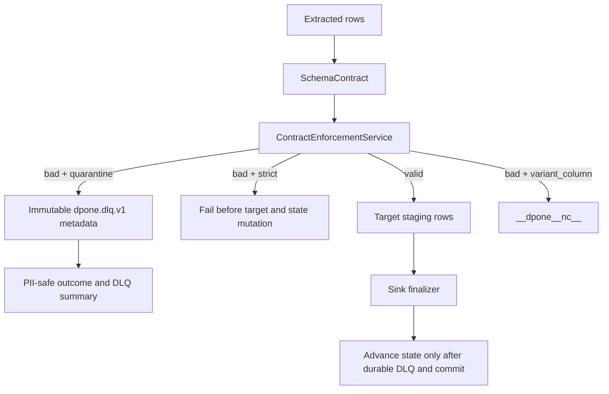

# Runtime data contracts and DLQ

This page is for data engineers and operators who need row-level contract
enforcement without leaking rejected data. The normal self-service path needs
only `enforcement: quarantine`; dpone supplies a metadata-only DLQ by default.

Runtime data contracts are the execution layer for
[schema contracts](schema-contracts.md). Type inference and physical design
decide what the target should look like; runtime enforcement decides which rows
are safe to stage, which rows need diagnostics, and whether state may advance.

## Execution flow



## Enforcement modes

| Mode | Target rows | Bad rows | State advance |
| --- | --- | --- | --- |
| `strict` | only valid rows | reject and fail run | no |
| `coerce` | valid and safely coerced rows | reject unsafe rows | no when rejects exist |
| `quarantine` | only valid rows | durable metadata-first DLQ record | yes after every rejected row is durable and load succeeds |
| `warn` | best-effort rows | warning diagnostics | yes when load succeeds |

`strict` is the production default. Use `quarantine` for dirty REST/API, file,
and semi-structured feeds where good rows should continue while rejected rows
remain auditable.

## Smallest safe example

```yaml
sink:
  options:
    schema_contract:
      enforcement: quarantine
      columns:
        amount:
          type: decimal
          precision: 18
          scale: 2
          nullable: false
        updated_at:
          type: timestamp
          timezone: true
          nullable: false
    dlq:
      retention_days: 30
      pii_policy: reference_only
    type_inference:
      conflict_policy: quarantine
```

`dlq` may be omitted. With quarantine enforcement the defaults are:

| Option | Default | Contract |
| --- | --- | --- |
| `enabled` | `true` | Cannot be disabled while quarantine enforcement is active |
| `directory` | `.dpone/dlq` | Confined local artifact root |
| `retention_days` | `30` | `1..3650` |
| `pii_policy` | `reference_only` | No rejected row values are persisted |
| `max_record_bytes` | `262144` | Hard limit `4096..1048576` |
| `max_diagnostic_bytes` | `16384` | Hard limit `1024..65536`, not above the record limit |
| `max_records_per_run` | `100000` | Hard bound `1..1000000`; overflow fails the workload before state commit |
| `max_index_bytes` | `67108864` | Atomic run-index limit `1MiB..512MiB` |

`masked` preserves map/list shape and replaces every scalar with
`[REDACTED]`. `preserve` is a deprecated compatibility mode and is blocked in
production by default.

## Python API

```python
from dpone.contracts.dlq import DlqPolicy
from dpone.ops.dlq import DlqService
from dpone.ops.dlq_store import DlqFileStore
from dpone.readiness.schema_contracts import SchemaContract
from dpone.type_system import ContractEnforcementService

contract = SchemaContract.from_config({
    "enforcement": "quarantine",
    "columns": {"amount": {"type": "decimal", "precision": 18, "scale": 2}},
})
policy = DlqPolicy.from_config({"pii_policy": "reference_only"})
dlq = DlqService(
    DlqFileStore(policy.directory, max_record_bytes=policy.max_record_bytes),
    policy=policy,
)
result = ContractEnforcementService(quarantine=dlq).enforce(
    rows=[{"amount": "12.30"}, {"amount": "bad"}],
    contract=contract,
    run_id="01J...",
    load_id="01J...",
)

assert result.target_rows == [{"amount": "12.30"}]
assert result.state_commit_allowed
assert result.data_outcome == "passed_with_quarantine"
```

Ordinary pipeline authors do not construct these services. Runtime lifecycle
composition reads the manifest policy and injects them.

## Artifact and reason contract

Each rejected row produces one create-only `dpone.dlq.v1` JSON record and a
checksummed run index under `.dpone/dlq/runs/<run_id>/`. The default record
contains a logical `record_ref`, stable reason code, safe type diagnostics,
expiry, replay state, and SHA-256 checksum. It does not contain the source row
or invalid value.

Initial stable reason codes are `schema.required_null`,
`schema.type_mismatch`, `source.decode_failed`, `transform.failed`,
`quality.rule_failed`, `sink.row_rejected`, `cdc.poison`, and
`unknown.unclassified`. Unknown vendor text never becomes a code or durable
diagnostic.

Schemas:

- [`dpone.dlq.v1`](schemas/dlq/dpone.dlq.v1.schema.json)
- [`dpone.dlq-index.v1`](schemas/dlq/dpone.dlq-index.v1.schema.json)
- [`dpone.dlq-replay-plan.v1`](schemas/dlq/dpone.dlq-replay-plan.v1.schema.json)
- [`dpone.dlq-retention-plan.v1`](schemas/dlq/dpone.dlq-retention-plan.v1.schema.json)

## Evidence bundle

Use the evidence writer when a release gate or catalog needs one artifact with
enforcement, DDL, compatibility, and OpenLineage facets:

```python
from dpone.ops.data_contract_evidence import DataContractEvidenceBundleWriter

artifact = DataContractEvidenceBundleWriter(".dpone/evidence/orders").write(
    run_id="01J...",
    pipeline="orders",
    enforcement=result,
)
```

The JSON uses two independent outcome axes. A completed load that excluded
durable rejected rows reports `execution_status: succeeded` and
`data_outcome: passed_with_quarantine`. Evidence contains counts, reason
distribution, record IDs, and the index reference, but never `target_rows`,
`actual_value`, source row values, credentials, or signed URLs.

## Replay algorithm

Generic replay is deliberately plan-only:

```bash
dpone ops quarantine-replay --dir .dpone/dlq --run-id 01J... --format json
```

`--yes` is retained for one compatibility release but returns exit code `4`
and `DPONE_DLQ_REPLAY_EXECUTOR_REQUIRED`; it cannot claim that data was applied.
Real replay requires an injected `DlqRecordResolver` and `DlqReplaySink`:

```python
from dpone.ops.dlq import DlqReplayService

replay = DlqReplayService(store)
plan = replay.plan(
    run_id="01J...",
    resolver_identity=resolver.identity,
    target_identity=sink.identity,
)
result = replay.execute(plan, resolver=resolver, sink=sink)
```

1. Build a bounded immutable plan over sorted record IDs, checksums, and pinned
   resolver/target identities.
2. Resolve the original record by `record_ref` outside the DLQ artifact.
3. Apply it with the plan's stable idempotency key.
4. Write an acknowledgement only after the sink returns success.
5. On retry, skip an existing matching acknowledgement.

If the sink succeeds but acknowledgement storage is interrupted, retry uses the
same idempotency key. The route-specific sink must make that key idempotent.
Execution rejects a changed plan, changed idempotency key, or resolver/sink
identity that differs from the plan before applying a row.

## Retention algorithm

Retention is mark-and-sweep and plan-first. Pending replay, active,
evidence-pinned, and unexpired records are protected. Apply recalculates the
store snapshot and fails on drift; only expired acknowledged records from the
unchanged plan can be deleted.

## Streaming and native fast paths

Streaming and native paths are covered by
[Streaming-safe contracts](runtime-fast-path-contracts.md). Row streams are
validated chunk-by-chunk and produce the same safe outcome/evidence contract.
Opaque file and partitioned native artifacts fail closed unless the source
export step marks them as prevalidated.

## Runbook

| Symptom | Action |
| --- | --- |
| `strict` run fails | Inspect safe diagnostics, fix source data or schema contract, rerun without advancing state. |
| DLQ grows | Export safe metadata, group by reason code, fix the source contract, then use a route-specific replay executor. |
| `DPONE_DLQ_CHECKSUM_MISMATCH` | Stop replay/retention, restore from trusted immutable storage, investigate tampering or partial writes. |
| `DPONE_DLQ_REPLAY_EXECUTOR_REQUIRED` | Use a connector-specific resolver and sink; the generic CLI never receives target credentials. |
| Empty strings look like NULL | Keep `type_inference.empty_string_is_null: false` unless the source contract explicitly says otherwise. |
| Variant column appears | Treat `__dpone__nc__<column>` as an expand-contract migration and update consumers. |

## Migration from legacy quarantine

`quarantine.dir` and `dpone.ops.quarantine.QuarantineService` remain readable
for the documented deprecation window. They preserve existing raw JSONL export
behavior, so treat those directories as sensitive and migrate manifests to
`dlq.directory`. New runtime composition uses the canonical safe store whenever
`dlq` is present or quarantine enforcement relies on defaults. Legacy replay no
longer reports false success.

## Related docs

- [Schema contracts](schema-contracts.md)
- [Type inference](type-inference.md)
- [Physical DDL apply](physical-ddl-apply.md)
- [Streaming-safe contracts](runtime-fast-path-contracts.md)
- [`dpone ops`](ops-cli.md)
