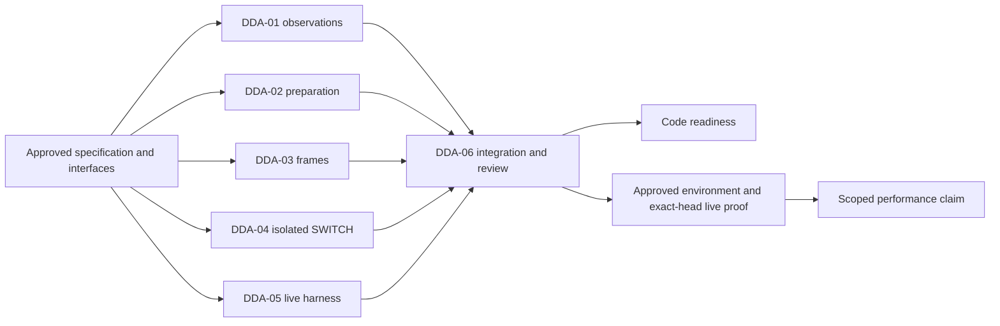

# Data-delivery acceleration: implementation tasks

Purpose: assign independent implementation work with an explicit Definition of
Done (DoD). Audience: contributors, reviewers and the integration owner.

The [approved specification](feature-design-data-delivery-acceleration-v1.md)
defines algorithms, compatibility, measurement and the isolated SWITCH boundary.
The [current native guide](mssql-native-transport.md) remains the user contract.
Implementation dispatch was explicitly requested by the maintainer on 2026-09-10.
Release, merge, provider changes and public SWITCH activation are outside scope.

## Execution and ownership

| Task | Deliverable | Can start independently | Integration dependency |
|---|---|---|---|
| DDA-01 | Observations and benchmark comparison | Yes: feature-local models/port/collector/tool | DDA-06 connects phase call sites |
| DDA-02 | Prepared digests and INSERT helpers | Yes: pure helpers and parity tests | DDA-06 connects prepare/normalizer |
| DDA-03 | Sized frames and tuple compatibility | Yes: producer and file-helper scope | DDA-06 connects scheduler |
| DDA-04 | Isolated SWITCH component | Yes: catalog/planner/executor with injected authority | Remains unregistered; activation is future scope |
| DDA-05 | Real-row/performance harness | Yes: fixtures, baseline adapter and producer contracts | Candidate execution follows integration and environment approval |
| DDA-06 | Runtime integration, docs and compatibility proof | Read-only mapping can start immediately | Dependent writes follow reviewed DDA-01..05 handoffs |

Each writer uses a separate Codex project worktree. DDA-01..05 have disjoint
owned paths. The integrator owns existing runtime coordinators, normalization
wiring, factories, common regression tests, navigation, changelog and ADR indexes.
The six YAML contracts enumerate exact paths and forbidden boundaries.

Each task starts from the project default branch and verifies that its checkout
contains audited baseline `d5ad9aaecc900c24df421b160ed36b4cfc726e45`. Fetch current
origin/master and integrate missing upstream changes normally before editing.
Preserve all later upstream changes. Each dispatch supplies the same committed
specification as a read-only dependency. If it is not yet in master, import that
documentation-only commit through a normal Git merge before implementation;
never reset the checkout to it. Record this dependency commit separately from
owned implementation edits in the path audit. This imports already authored
planning inputs; it does not give writers permission to edit shared documents.
Do not cherry-pick another contributor's unfinished branch.

Contributors must not modify another task's files or the shared seams to make
their isolated tests pass. Supply a tested call-site recipe and return ownership
conflicts to DDA-06. Contributor fixes remain in their own task until handed off;
DDA-06 integrates reviewed commits without rewriting them. Incorporating an
attributed contributor commit is distinct from editing its owned files.

## Common Definition of Done

1. The approved behavior and path scope are implemented; no unrelated cleanup.
2. Focused tests include meaningful positive, negative and boundary cases.
3. The task's broad checks run once on its final reviewable head. Limit xdist
   automatic workers to two per concurrent task to avoid oversubscribing the
   shared host; this does not reduce test coverage.
4. Public byte/digest/state/receipt and compatibility contracts are preserved.
5. The task-owned English guide documents purpose, inputs, results, limitations,
   error/recovery behavior and the next step. Examples are executable or tested.
6. A fresh-context reviewer checks correctness, data-loss risk, compatibility,
   tests and evidence. Fix findings and repeat independent review after fixes.
7. Commit scoped changes and immediately attempt a GitHub PR with a concrete
   description, validation and limitations. No force push, merge or release.
8. Return exact commit, PR URL, changed paths, checks with
   PASS/FAIL/SKIP/N/A/UNVERIFIED, evidence paths and remaining risks.

For DDA-01..05, "ready for integration" means the assigned component is tested and
reviewed. It does not claim that shared runtime wiring already landed.
DDA-06 proves the actual integrated path.

For all tasks, code readiness and measured live acceleration are separate.
Missing environment or metrics cannot be treated as successful certification.
No participant may remove the existing native SWITCH blocker to obtain a pass.

## DDA-01: Delivery phase observations and benchmark comparison

Purpose: Implement opt-in bounded phase observations and a truthful versioned benchmark comparison producer.

- Interface: NativeDeliveryObservation; NativeDeliveryObserver.record(observation); native_delivery_benchmark.py compare.
- Handoff: Model/port, bounded collector, comparison producer, focused tests, observations guide and exact-commit report.
- Depends on: the frozen specification/interfaces only; no unfinished implementation branch.
- Contract: [DDA-01 ownership and acceptance](https://github.com/PaulKov/dpone/blob/f3682940f8864563cde0e6b6ecee60f746b49020/test_artifacts/delivery-acceleration/agent-task-contracts/dda-01-observations.yml).
- Focused checks: `uv run pytest tests/test_mssql_native_delivery_observations.py tests/test_mssql_native_delivery_benchmark.py -q`.

Definition of Done:

1. Implement the frozen observation model/port and optional no-op-compatible collector without changing existing journal or receipt schemas.
2. An injected clock proves nested/overlapping phases, failed/cancelled retries, observed worker overlap and separate total delivery/pipeline durations; incompatible clock domains are not combined.
3. Missing resources and observer failures produce explicit unavailable/UNVERIFIED diagnostics; configured parallelism is never measured parallelism; no row values, SQL text, secrets or connection URLs are emitted.
4. Aggregation stays bounded; no per-row logs or extra SQL count queries are required. Observations do not authorize business success, state advancement or cleanup.
5. The compare CLI implements the exact path/overwrite/atomic-output/exit contract, validates baseline/candidate/workload/environment identities, retains raw sample references and rejects unknown versions or drift.
6. Tests reject missing/tampered identity, insufficient successful samples and failed fidelity. Three trials support a median only; thresholds are targets, not fabricated live results.
7. Document schema, units, metric provenance, clock domains, the complete tool journey and executable/parser-tested CLI examples.
8. Provide tested integration instructions for DDA-06; do not modify existing runtime call sites.

## DDA-02: One-pass prepared integrity and metadata INSERT

Purpose: Implement prepared-stage helpers that remove one full typed scan and the preparation metadata UPDATE without weakening authority.

- Interface: digest_prepared_rows(...) -> PreparedDigests; build_prepared_insert(...) -> SQL string.
- Handoff: Two cohesive helpers, golden/parity/one-shot tests, preparation guide and exact call-site integration recipe.
- Depends on: the frozen specification/interfaces only; no unfinished implementation branch.
- Contract: [DDA-02 ownership and acceptance](https://github.com/PaulKov/dpone/blob/f3682940f8864563cde0e6b6ecee60f746b49020/test_artifacts/delivery-acceleration/agent-task-contracts/dda-02-preparation.yml).
- Focused checks: `uv run pytest tests/test_mssql_native_integrity_readbacks.py tests/test_mssql_native_metadata_insert.py tests/test_mssql_native_metadata_insert_parity.py tests/test_mssql_native_staged_verification.py tests/test_mssql_native_lineage_authority.py -q`.

Definition of Done:

1. digest_prepared_rows consumes exactly one mapping iterator and produces business/full digests identical to the legacy algorithms; a poisoned second iteration and call-count test establish the structural reduction.
2. Preserve metadata NULL/finite-byte allowances, row count, canonical framing, duplicate multiplicity, Unicode/binary/Decimal/temporal fidelity and existing failure classifications.
3. The INSERT helper uses UNION ALL, explicit ordered columns, MssqlNativeLineageProjection.expressions and the existing canonical row-hash expression, with validated identifiers.
4. Projection parity covers lineage on/off, row-hash on/off, generated NULLs, empty/duplicate input, quote/Unicode values, nullability and lifecycle identity.
5. Do not introduce a user-settable metadata-valid/skip-validation flag. Give DDA-06 a split between projection and shared validation/evidence operations, not a bypass of normalization.
6. Keep the preparation loaded_at placeholder and the finalizer target-clock UPDATE. Existing direct BCP consumers must retain their metadata projection behavior.
7. Document the integration call sequence and structural acceptance: four raw plus two prepared scans, no preparation metadata UPDATE, unchanged independent prepublication verification.
8. No edits to prepare/normalizer/composition/shared tests: DDA-06 owns their integration.

## DDA-03: Reuse bounded native frame sizes

Purpose: Eliminate the scheduler's redundant full sizing pass while preserving frame boundaries, bytes and resource checks.

- Interface: SizedNativeFrame; sized_native_frames; existing native_frames remains a tuple adapter.
- Handoff: Sized iterator/compatibility adapter, boundary/golden tests, framing guide and scheduler wiring recipe.
- Depends on: the frozen specification/interfaces only; no unfinished implementation branch.
- Contract: [DDA-03 ownership and acceptance](https://github.com/PaulKov/dpone/blob/f3682940f8864563cde0e6b6ecee60f746b49020/test_artifacts/delivery-acceleration/agent-task-contracts/dda-03-frames.yml).
- Focused checks: `uv run pytest tests/test_mssql_native_chunks_files.py tests/test_mssql_native_sized_frames.py tests/test_mssql_native_encoder.py tests/test_mssql_native_staged_values.py -q`.

Definition of Done:

1. Implement immutable SizedNativeFrame(rows, encoded_bytes) and sized_native_frames with exactly the existing row/native/IPC/frame boundaries.
2. Keep native_frames' tuple API and encode_native_frame behavior; mappings and sequences remain supported and the public source Mapping/transformation boundary is unchanged.
3. Freeze bytearray/memoryview and reused driver containers before cached sizing; golden file bytes, digests, ordinals and errors remain identical.
4. Preserve per-row pickle, aggregate frame and full submitted-task ceilings; scheduler integration must still compare actual worker file size with its reservation.
5. One-shot/empty sources, exact N/N+1 bounds, cancellation checks and iterator closure are covered; no new retained evidence/cache format or dependency is introduced.
6. Prove the eliminated repeated scheduler sizing using a deterministic call counter in the handoff fixture; DDA-06 wires it into the actual scheduler and runs spawned-worker regression tests.
7. Document encoded versus IPC/RSS limits and supply the precise scheduler integration instructions without editing mssql_native_chunks.py.

## DDA-04: Isolated SQL Server partition SWITCH component

Purpose: Build an unregistered, fail-closed SWITCH planner/catalog adapter/transaction executor for one eligible physical partition.

- Interface: plan_native_switch(snapshot, interval=..., owner_binding=...); execute_native_switch(plan, transaction=...).
- Handoff: Feature-local models/port/planner/catalog/executor, negative/recovery tests, component guide and ADR decision note.
- Depends on: the frozen specification/interfaces only; no unfinished implementation branch.
- Contract: [DDA-04 ownership and acceptance](https://github.com/PaulKov/dpone/blob/f3682940f8864563cde0e6b6ecee60f746b49020/test_artifacts/delivery-acceleration/agent-task-contracts/dda-04-switch.yml).
- Focused checks: `uv run pytest tests/test_mssql_native_partition_switch.py tests/test_mssql_native_partition_switch_recovery.py tests/test_mssql_native_partition_switch_catalog.py tests/test_runtime_partition_replace_native_contracts.py -q`.

Definition of Done:

1. Implement only the spec's finite one-partition same-database temporal RANGE RIGHT profile; derive its authority from the authored interval, including empty input, not staging distinct values.
2. Catalog snapshots bind database/object/owner, exact boundaries, columns/types/nullability/collation, indexes/constraints/partition/storage layout; unsupported or unknown metadata fails eligibility.
3. Reject partial/unbounded windows, cross-database layouts, foreign/nonempty switch-out tables, out-of-window prepared rows, unsupported dependencies and catalog drift.
4. Revalidate under caller-owned target transaction authority, count replaced rows, then switch old out/new in. Never open/commit/rollback a transaction, emit a target receipt or perform cleanup in the executor.
5. Failure after the first SWITCH propagates for whole-transaction rollback; never fall back to DELETE+INSERT after mutation. Tests cover lost ACK and receipt-first recovery when prepared content was switched away.
6. Existing public native SWITCH rejection before I/O remains unchanged; no schema/policy/registry/composition activation, no production DDL or environment changes.
7. Document owned prepared/switch-out prerequisites and retention, stable eligibility reasons, future activation requirements and an ADR decision note for DDA-06.
8. Deliver synthetic transaction/catalog tests and integration fixtures or fixture requirements for DDA-05; no live-performance claim.

## DDA-05: Real-row delivery and performance harness

Purpose: Implement an explicitly opted-in real-row native delivery/SWITCH-component harness with reproducible evidence.

- Interface: Versioned baseline/candidate run envelope consumed by DDA-01; real route factory injected by DDA-06.
- Handoff: Live test/benchmark producer and parser tests, certification guide; live execution status separate from implementation readiness.
- Depends on: the frozen specification/interfaces only; no unfinished implementation branch.
- Contract: [DDA-05 ownership and acceptance](https://github.com/PaulKov/dpone/blob/f3682940f8864563cde0e6b6ecee60f746b49020/test_artifacts/delivery-acceleration/agent-task-contracts/dda-05-certification.yml).
- Focused checks: `uv run pytest tests/test_native_delivery_live_benchmark.py -q`.

Definition of Done:

1. Build deterministic narrow/wide/Unicode/Decimal/NULL/binary/skewed synthetic profiles and exact-multiset correctness fixtures that execute the real bounded-native composition when an environment is explicitly approved.
2. Implement current-baseline and candidate execution adapters behind the frozen report envelope so the harness can be authored before optimization modules land.
3. Record exact commit/dirty state, dependencies/server/BCP versions, environment/workload/config digests, layout, limits, raw trials, fidelity, rows/bytes, process-set RSS and available SQL observations.
4. Enforce a warmup and at least three successful comparable trials for median claims; exclude failed/skipped trials and reject mismatched identities/layouts. No p95 claim from three trials.
5. Cover real BCP fidelity, empty/outside-window invariance, post-EOF source-free recovery and known/unknown commit paths. SWITCH fixtures test the isolated component, not falsely certified normal route admission.
6. No live SQL/container startup or credentials use without a separately explicit approved disposable environment. Collection/import/help and hermetic tests work without services; absent environment reports SKIP/UNVERIFIED.
7. Synthetic harness tests prove input validation, redaction, output atomicity and absence handling. Match DDA-01 comparison input contract with a local fixed fixture, without importing its unfinished branch.
8. Document exact preparation/run/observation/recovery/cleanup commands and object ownership; do not edit shared integration fixtures.

## DDA-06: Integrate delivery acceleration and certify compatibility

Purpose: Integrate reviewed task handoffs, own shared runtime wiring/docs, and establish exact-head correctness without activating uncertified SWITCH.

- Interface: Sole shared-file owner; consumes DDA-01..05 fixed interfaces and preserves existing production boundaries.
- Handoff: Integration PR, independent review, exact-head evidence, operations docs and honest live/performance status.
- Depends on: reviewed DDA-01 through DDA-05 handoffs.
- Contract: [DDA-06 ownership and acceptance](https://github.com/PaulKov/dpone/blob/f3682940f8864563cde0e6b6ecee60f746b49020/test_artifacts/delivery-acceleration/agent-task-contracts/dda-06-integration.yml).
- Focused checks: `uv run pytest tests/test_mssql_native_delivery_integration.py tests/test_mssql_native_chunks_execution.py tests/test_mssql_native_staged_prepare.py tests/test_mssql_native_staged_finalizer.py tests/test_mssql_native_staged_recovery.py tests/test_mssql_native_staged_verification.py tests/test_mssql_native_staged_import.py tests/test_mssql_native_runtime.py tests/test_runtime_partition_replace_native_contracts.py -q`.

Definition of Done:

1. Wait for reviewed DDA-01..05 commits/PRs and integrate them on a dedicated branch containing current master; never overwrite another worktree or force-push shared history.
2. Wire phase observations, dual-digest/INSERT helpers and sized frames through existing composition and coordinators. Defaults, wire/journal/recovery formats, source lifetime and resource bounds remain unchanged.
3. Integrated structural tests show four raw/two prepared typed readbacks, no preparation metadata UPDATE and no repeated scheduler sizing. Preserve finalizer target-clock UPDATE and all key/count/evidence/quality/ownership/fencing checks.
4. Keep direct BCP metadata behavior and every old Mapping/tuple/manifest API. Exercise real spawned workers, mutable buffers, tampering at every boundary, cancellation, replay and lost/unknown commit with hermetic fixtures.
5. Keep public native SWITCH rejection before I/O; DDA-04 is an isolated component only. Add the next unused ADR number for its exact architecture/activation boundary without colliding with parallel work.
6. Reconcile DDA-01 and DDA-05 report producer/consumer with executable contract tests. Missing approved live environment is SKIP/UNVERIFIED; do not infer real speed from structural counters.
7. Write overview/runbook, first-success examples, limitations and migration notes; update current native/architecture/nav/changelog through owned paths, preserving 0.75.0/0.76.0 history.
8. Run exact-head focused, full non-live, architecture/type/format and docs gates; request fresh-context independent subagent review, fix findings and rerun independent review after fixes.
9. Publish a reviewable integration PR with linked per-task evidence and explicit code-ready versus live-performance statuses. Do not merge/release/tag/upload or change providers in this task.

## Evidence and review

Task execution evidence belongs under
`test_artifacts/delivery-acceleration/<lowercase-task-id>/`; each contract owns
its corresponding directory. DDA-06 owns the common `measurement/` campaign
directory after integration. Generated benchmark results
come from their producer. The machine contracts are authored planning inputs,
not generated execution evidence.

DDA-06 records per-task commit/PR identity, integrated head, exact tests, remaining
live gaps, independent review results and links to raw producer artifacts.
Use the existing change selector and architecture/docs tooling; no budget
exceptions or fabricated baseline updates.

Baseline/candidate performance targets and the reproducible experiment are in the
[specification](feature-design-data-delivery-acceleration-v1.md#measurable-differentiation).
Do not invent a numeric speed result from the structural improvements.

## Dispatch registry

All six implementation tasks were created in separate project worktrees.
Their active/in-progress state was confirmed through task status snapshots.
The integrator received every dependency task ID. Dispatch is not implementation
completion; each task retains its own DoD and review/validation gates.

| Task | Codex task ID | Dispatch state |
|---|---|---|
| DDA-01 | `01a08c14-43e0-74a2-9148-c64e6c56e0bd` | Started in separate worktree |
| DDA-02 | `01a08c14-43c5-7003-b1bc-052c67ebcd08` | Started in separate worktree |
| DDA-03 | `01a08c14-4406-7dc3-ae1f-19517bf558af` | Started in separate worktree |
| DDA-04 | `01a08c14-43a1-7632-885b-2fd2de8e0e00` | Started in separate worktree |
| DDA-05 | `01a08c14-435a-7040-b7f3-f4607df82376` | Started in separate worktree |
| DDA-06 | `01a08c14-a8b1-75d0-b651-f99603bb70e7` | Started in separate worktree |

Next: use the assigned contract and the
[agent development workflow](agent-development.md); consult the
[native recovery guide](mssql-native-transport.md#diagnose-and-recover) for
the state and receipt rules that every optimization preserves.
