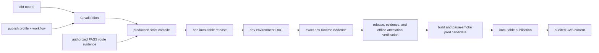

# Publish a dbt model with dpone in five minutes

This tutorial is for a dbt author publishing a contracted MSSQL model to
ClickHouse. You edit the dbt model, run two local commands, and open one merge
request. You do not write Airflow Python or commit generated dpone artifacts.

> **Certification status:** the stock runtime includes the fail-closed offline
> artifact verifier. That implementation does not certify an installation:
> production still requires current `PASS` evidence for the exact route,
> runtime image, Airflow, Kubernetes, Vault, MSSQL, and ClickHouse environment.

This is an authoring tutorial, not a production-certification procedure. A
green `dpone dbt check` or demo run proves that the resolved dbt metadata is
valid; it does not prove a live route, Airflow runtime, or Cosmos check.

## The five terms you need

| Term | Meaning in this journey |
| --- | --- |
| **dbt model** | Your SQL model plus its enforced dbt contract. |
| **publish profile** | A platform-owned name that supplies approved route, target, quality, and runtime policy. It contains no author credentials. |
| **workflow** | The platform-owned schedule, owner, timezone, and tags for one or more publishing models. |
| **DAG** | The Airflow view generated by CI after validation; authors do not edit DAG Python. |
| **environment** | A dev or prod deployment binding. Both environments use the same immutable release bytes. |

dbt remains the editable source of truth. dpone reads the resolved
`config.meta.dpone.publish` value from `target/manifest.json`; it does not parse
SQL or recreate dbt config precedence.

## Before you start

Use Python `3.11` or `3.12`. From a dpone source checkout, install the exact
repository lock:

```bash
uv sync --extra dbt-mssql
uv run dpone --version
uv run dbt --version
```

After this feature is released, a consumer installation must pin one released
dpone version:

```bash
python -m pip install "dpone[dbt-mssql]==<released-dpone-version>"
dpone --version
dbt --version
```

`<released-dpone-version>` is a required placeholder: replace it with the exact
version named in the release notes. The `dbt-mssql` extra selects dbt Core
`1.10.13` and `dbt-sqlserver` `1.10.1`. The generic `dbt` extra does not install
or certify a SQL Server adapter.

You also need:

- an enforced dbt model contract;
- a publish profile and workflow name provided by the platform team in exactly
  one project-local registry, normally
  `dpone/dbt-publish-profiles.yml` or
  `.dpone/dbt-publish-profiles.yml`;
- a local dbt profile that can be parsed without committing credentials;
- permission to open a merge request in the editable dev repository.

If the platform keeps the registry elsewhere, pass its reviewed path with
`--profiles PATH` or set `DPONE_DBT_PUBLISH_PROFILES` in CI. If neither default
file exists, or both exist, `check` blocks instead of guessing authority.

`dbt parse` does not need a live MSSQL or ClickHouse connection for this author
loop. Production is a separate gate: the platform must provide a current
`PASS`, production-certified MSSQL-to-ClickHouse route variant through the
project's bounded `dpone.yaml` certification-evidence authority. A supported
connector pair or a checked-in demo profile is not that authority. See the
[author and platform reference](dbt-self-service-reference.md#installation-and-certification-prerequisites).

The example uses publish profile `mssql_to_clickhouse_mart` and workflow
`competitive_pricing`. Neither name is a credential. Never put passwords,
connection URIs, Vault paths, runtime images, namespaces, or Kubernetes Secret
names in model metadata.

For the pinned SQL Server adapter, add the four literal booleans to
`dbt_project.yml` before parsing:

```yaml
flags:
  dbt_sqlserver_enable_safe_type_expansion: false
  dbt_sqlserver_use_dbt_transactions: true
  dbt_sqlserver_use_default_schema_concat: true
  dbt_sqlserver_use_native_string_types: true

models:
  your_project:
    +as_columnstore: false
    +indexes: []
    +drop_unmanaged_indexes: false
    +prefer_single_alter_column: false
```

The flags and safe model defaults are required policy, not recommendations or environment-variable
placeholders. A missing flag, quoted value, Jinja expression, duplicate YAML
key, symlinked project file, or different boolean blocks `check` with
`DPONE_DBT_SQLSERVER_PROJECT_POLICY_INVALID`. Keep top-level `dispatch` absent
or empty; project macro routing cannot override the pinned framework
authority. Selected models and tests may call only the generated 131-macro
dbt/dbt-sqlserver framework closure, the exact seven-macro invocation
extension for incremental predicates and admitted generic tests, or the pinned
metadata-only `dpone_publish` helper.

## 1. Add publishing metadata to one dbt model

Add the smallest direct `meta` declaration:

```sql
{{ config(
    materialized='table',
    contract={'enforced': true},
    meta={
        'dpone': {
            'publish': {
                'enabled': true,
                'profile': 'mssql_to_clickhouse_mart',
                'workflow': 'competitive_pricing'
            }
        }
    }
) }}
```

Keep the model's columns and data types in `schema.yml`. The platform-owned
publish profile resolves route and physical policy; the workflow resolves
Airflow schedule and ownership.

The selected SQL Server v1 preview graph admits SQL `table`, `view`, and
`incremental` models. Incremental models must set `incremental_strategy` to
`append` or `merge`; `merge` requires an ordered `unique_key` of one or more
distinct identifiers. Each identifier must match
`^[A-Za-z_][A-Za-z0-9_]*$`, contain at most 128 characters, and byte-exactly
match a column in an enforced contract; exact and case-folded duplicates are
rejected. A raw string is always one key and is never split on a comma, so SQL
expressions and comma-separated expression strings are not identifiers. Every
key column must declare a structural `not_null` constraint. If publishing
metadata also declares a key, it must exactly match dbt's ordered key.
`on_schema_change` may only be `ignore` or `fail`.

For a contracted `table` or `view` that explicitly requests dpone merge rather
than dbt incremental materialization, put the single ordered key authority in
publish metadata. The metadata form is always a YAML/JSON array:

```yaml
meta:
  dpone:
    publish:
      enabled: true
      profile: mssql_to_clickhouse_mart
      workflow: competitive_pricing
      strategy:
        mode: incremental_merge
        unique_key: [product_id]
```

The same identifier, enforced-contract membership, and structural `not_null`
rules apply. When dbt `config.unique_key` is also present, metadata must match
its ordered tuple exactly.

Keep the structural constraint and the result-bearing data test together:

```yaml
columns:
  - name: product_id
    data_type: bigint
    constraints:
      - type: not_null
    data_tests: [not_null]
```

The constraint proves compile-time key nullability. The ERROR-level data test
still checks MSSQL rows during `dbt build`, and ClickHouse independently rejects
NULL or duplicate staged keys before target mutation. One layer does not
replace the others.

The selected generic data-test macro families are exactly `not_null`, `unique`,
and `relationships`; `accepted_values` is outside the seven-record invocation
extension and fails macro-authority validation if referenced. Singular SQL
tests are allowed only when every macro dependency stays inside the exact
authority. Standard SQL data tests and unit tests attached to an admitted
selected model are otherwise allowed. Under eager selection, every `model.*`
dependency of a data test must belong to the same workflow model closure. A
relationship or singular test that reads a foreign workflow fails before a
lock or release is written.
Seeds,
snapshots, ephemeral/Python/custom materializations, hooks, grants,
`store_failures`, full refresh, columnstore tables, DML table refresh, and
project operations fail closed with
`DPONE_DBT_SQLSERVER_GRAPH_CAPABILITY_UNSUPPORTED`.

Keep each workflow's materialized model closure disjoint. A workflow cannot
`ref()` a publish-enabled model owned by another workflow, and two workflows
cannot share a non-publish materialized parent. Merge those models into one
workflow or introduce a separately governed source boundary.

Use only documented adapter configuration. Query option/header overrides,
non-empty `persist_docs`, `column_types`, incremental predicates, adapter macro
shadowing or drift, and unknown config keys fail closed. Model-level constraints
must be empty; column constraints may be empty or contain only `not_null`.
Merge-key columns require `not_null`. Express
`unique`, primary-key, foreign-key, check, and custom assertions as admitted
data or unit tests.

## 2. Run the two author commands

If the project declares packages in `packages.yml` or `dependencies.yml`, resolve
them once after changing the declaration:

```bash
dbt deps
git add package-lock.yml
git commit  # together with the package declaration change
```

dpone then requires both `package-lock.yml` and the configured resolved package
directory, and rejects a lock whose dbt declaration hash is stale. It never
downloads packages automatically. The bundled beginner example has no package
declaration by default; its executable demo adds the local package only inside
an isolated temporary project. A standalone `env_var(...)` package expression is
resolved from the build environment only for dbt-compatible lock verification;
its value is not persisted. Other package-template expressions are rejected.

From an installed release and the dbt project directory:

```bash
dbt parse
dpone dbt check .
```

From a dpone source checkout, keep the same two operations inside the locked
environment:

```bash
uv run dbt parse
uv run dpone dbt check .
```

`dbt parse` creates `target/manifest.json`. `dpone dbt check` discovers that
file, validates the resolved metadata and dbt contract, and does not invoke dbt
again or resolve the runtime deployment target. Runtime repeats the locked graph and
target checks before `dbt build`; see the
[runtime identity reference](dbt-self-service-runtime-identity.md) and
[error catalog](dbt-self-service-errors.md).

A successful check reports the model and workflow count and exits with code
`0`. Zero publish-enabled models is an error; `--allow-empty` is only for an
explicit report and cannot publish.

For the repository example, the current successful transcript starts with:

```text
dbt -> dpone publish: PASS
manifest schema: v12
published models: 2; workflows: 1
models:
- model.dpone_dbt_demo.competitive_pricing
- model.dpone_dbt_demo.competitive_pricing_history
- DAG__pricing__competitive_pricing__refresh: 2 model(s)
```

A following warning remains visible but does not change that successful
authoring result. Production `compile` applies the stricter certification and
release-admission gates described below.

`check` verifies authoring, policy resolution, and route support. It deliberately
does not require production-certified route evidence; CI `compile` does. This
keeps a first author check useful without turning it into a false certification
result.

If `target/manifest.json` is missing or stale, dpone tells you to run
`dbt parse`; it never runs dbt or connects to the database on your behalf.

Try the repository demo without a database:

```bash
bash examples/dbt-inline-publishing/run_demo.sh
```

The demo performs a real `dbt parse` when dbt Core and the SQL Server adapter
are installed. Otherwise it clearly reports that it used the checked-in
deterministic manifest fixture. See the
[demo README in the repository](https://github.com/PaulKov/dpone/tree/master/examples/dbt-inline-publishing)
for forced modes.

## 3. Open one merge request

Commit the dbt SQL, contract, and normal project metadata. Do not commit:

- `target/manifest.json`, `run_results.json`, logs, or installed dbt packages;
- generated dpone manifests, DAG files, project bundles, releases, or evidence;
- rendered connection profiles or any credentials.

CI validates the same two-command boundary. When platform prerequisites and
current route evidence are present, it creates one environment-neutral
immutable release and deploys it to dev. Production remains fail-closed until a
separate environment-owned producer has exported complete dev runtime evidence
and the protected dev evidence workflow has finalized and attested it for that
exact release and deployment. Promotion automation then verifies the same
release digest, the detached `release-set.json` attestation under the pinned v2
trust policy, and a different deployment candidate identity. It parse-smokes
the candidate, immutably publishes it, and only then may CAS-promote `current`.
Without current exact-environment evidence, production is `UNVERIFIED` and is
not activated.



## What you should observe

In the dev Airflow DAG, one dbt build/test task gates the model transfer tasks.
The transfers may run in parallel within platform limits. If any required dbt
model or test fails, transfers do not start.

The DAG link is produced by CI after merge. The exact URL is deployment-owned,
so there is no Airflow URL or environment name in model metadata.

If validation fails, start with the actionable `DPONE_DBT_*` error and run
`dpone dbt explain MODEL` for the resolved decision. For retries, partial
success, rollback, and `COMMIT_UNKNOWN`, use the
[operations runbook](dbt-self-service-runbook.md).

## Next steps

- Use the [author and platform reference](dbt-self-service-reference.md) for
  exact commands, metadata boundaries, strategy rules, and optional macro use.
- Follow [promotion and rollback](dbt-self-service-promotion.md) before
  enabling a prod deployment.
- Return to the [dbt integration hub](dbt.md) for lineage export.
