# dbt self-service platform workflows

This platform reference is for administrators wiring the five reusable GitHub
Actions workflows that implement dbt → Airflow self-service. For the operator
journey, blockers, and rollback procedure, use
[promotion and rollback](dbt-self-service-promotion.md).

> **Production activation is fail-closed, not automatically certified.**
> `dbt-self-service-prod.yml` can publish and CAS-promote only after exact
> release/evidence verification and an offline verification of
> `release-set.json` with the deployment-pinned
> `dpone.runtime-artifact-trust-policy.v2`. Live route, Kubernetes, Vault, and
> usability rows remain `UNVERIFIED` until exact-environment evidence exists.

## Reusable workflow set

1. `dbt-self-service-dev.yml` builds and attests one release.
2. `dbt-self-service-dev-activation.yml` installs that release as one audited
   dev deployment.
3. `dbt-self-service-dev-evidence.yml` derives one immutable campaign request,
   triggers and observes the exact Airflow DAG runs, then finalizes and attests
   their release-bound evidence.
4. `dbt-self-service-open-prod-pr.yml` verifies complete dev runtime evidence
   and creates the bot-owned prod audit mirror.
5. `dbt-self-service-prod.yml` verifies, parse-smokes, immutably publishes, and
   CAS-promotes the prod deployment after every production gate passes.

The caller must grant the permissions requested by each reusable workflow.
Reusable workflows cannot elevate caller permissions. Their presence and local
contract tests are not evidence that any workflow, live route, Airflow runtime,
or Cosmos check passed for the current commit.

The v1 workflows require GitHub.com or GitHub Enterprise Cloud. They bind
evidence to `github.repository`, `github.workflow_ref`, and
`github.workflow_sha`; [GitHub documents those workflow-identity context
properties](https://docs.github.com/en/enterprise-server@3.20/actions/reference/workflows-and-actions/contexts)
as unavailable on GitHub Enterprise Server. GHES is therefore unsupported and
`UNVERIFIED` until a separate identity contract is approved and implemented.

## Dev release build

```yaml
permissions:
  contents: read
  id-token: write
  attestations: write
  artifact-metadata: write

jobs:
  dbt-release:
    uses: PaulKov/dpone/.github/workflows/dbt-self-service-dev.yml@<reviewed-ref>
    with:
      dpone-version: "<released-dpone-version>"
      project-dir: dbt
      publish-policy: platform/dbt-publish-profiles.yml
      artifact-name: analytics-dbt-release
      airflow-base-url: https://airflow-dev.example
    secrets:
      dbt-profiles-yml: ${{ secrets.DBT_PROFILES_YML }}
```

The dev workflow resolves the locked package tree, parses and checks every
publish-enabled model, compiles twice, compares the complete output trees, and
creates `release-subjects.sha256` over every release file. GitHub signs that
deterministic checksum subject and separately signs the exact
`release-set.json` runtime subject through `actions/attest`. The detached
runtime bundle is stored outside the release tree to avoid self-reference; the
workflow then uploads the immutable tree, bundle, and Markdown review report.
Pin the workflow to a reviewed commit or release tag, not a mutable branch.
The editable dev repository or its organization must define
`DPONE_DBT_TOOLING_VERSION` as an exact released version. This workflow has no
GitHub Environment and cannot obtain that value from an environment-scoped
variable.

## Dev activation

```yaml
permissions:
  attestations: read
  contents: read

jobs:
  dev-activation:
    uses: PaulKov/dpone/.github/workflows/dbt-self-service-dev-activation.yml@<reviewed-ref>
    with:
      dpone-version: "<released-dpone-version>"
      airflow-version: "3.2.0"
      release-repository: example/airflow-dev
      release-run-id: 123456789
      release-artifact-name: analytics-dbt-release
      release-source-commit: <release-source-commit>
      release-source-ref: <release-source-ref>
      expected-release-id: sha256:<release>
      runtime-image-ref: registry.example/dpone-runtime@sha256:<image>
      runtime-image-digest: sha256:<image>
      artifact-registry-ref: dpone-dev-artifacts
      registry-uri: s3://example-dpone-artifacts/dev
      registry-config-map-name: dpone-artifact-registry
      registry-config-sha256: sha256:<registry-config>
      trust-policy-config-map-name: dpone-artifact-trust-policy
      trust-policy-sha256: sha256:<trust-policy>
      dev-evidence-pvc-claim: dpone-dbt-dev-evidence
      dev-evidence-worker-queue: dpone_evidence_export
    secrets:
      release-artifact-token: ${{ secrets.DEV_RELEASE_READ_TOKEN }}
```

The activation workflow verifies the trusted signer, exact source commit/ref,
and every release byte. Its audit pointer records the digest of the verified
attestation receipt rather than trusting a caller-composed run URL. It then
materializes the exact release, builds and parse-smokes a non-production
deployment, publishes it, and changes dev `current` through audited CAS. It
returns both `deployment-id` and `activation-id`; it does not manufacture live
evidence.

Before downloading or activating release bytes, the workflow validates the
declared Airflow/Python pair and creates two isolated environments. The tooling
environment installs the exact dpone version (plus the pinned dbt MSSQL
toolchain in production). The scheduler-smoke environment installs the exact
provider and Airflow versions under the official
`constraints-${AIRFLOW_VERSION}/constraints-${PYTHON_VERSION}.txt`. Both run
`pip check`; the parse smoke explicitly uses the scheduler interpreter.
Dependency failure therefore occurs before materialization or compare-and-swap.
This separation preserves dpone's security dependency floors without forcing
the KPO runtime into the scheduler dependency graph.

The reusable workflow fixes the trusted execution location to the
`self-hosted + dpone-dbt-dev` runner labels and the scheduler cache to
`/var/lib/dpone/airflow/dev/.dpone-cache`. A caller cannot override the runner,
environment, or cache root.

### Exact activation identity handoff

When activation and evidence run in one caller workflow, pass the reusable
workflow outputs directly. This is the preferred path because one immutable
GitHub run owns the complete identity chain:

```yaml
jobs:
  dev-activation:
    uses: PaulKov/dpone/.github/workflows/dbt-self-service-dev-activation.yml@<reviewed-ref>
    with:
      # Use the complete input set from the example above.
      dpone-version: "<released-dpone-version>"
      airflow-version: "3.2.0"
      # ...
    secrets:
      release-artifact-token: ${{ secrets.DEV_RELEASE_READ_TOKEN }}

  dev-evidence:
    needs: dev-activation
    uses: PaulKov/dpone/.github/workflows/dbt-self-service-dev-evidence.yml@<reviewed-ref>
    with:
      # Reuse the same release inputs as dev-activation.
      dpone-version: "<released-dpone-version>"
      expected-deployment-id: ${{ needs.dev-activation.outputs.deployment-id }}
      expected-activation-id: ${{ needs.dev-activation.outputs.activation-id }}
      # ...
    secrets:
      release-artifact-token: ${{ secrets.DEV_RELEASE_READ_TOKEN }}
      airflow-api-token: ${{ secrets.DPONE_DEV_AIRFLOW_API_TOKEN }}
```

When evidence is an independently approved run, download the exact activation
artifact from the reviewed activation run and extract both values from
`cache-sync.json`; do not type them from the UI or resolve mutable `latest`:

```bash
: "${DEV_ACTIVATION_RUN_ID:?set the reviewed activation workflow run id}"

gh run download "${DEV_ACTIVATION_RUN_ID}" \
  --name "dpone-dbt-dev-activation-${DEV_ACTIVATION_RUN_ID}" \
  --dir .dpone-ci/dev-activation

python3 - <<'PY'
import json
from pathlib import Path
from uuid import UUID

payload = json.loads(Path(".dpone-ci/dev-activation/cache-sync.json").read_text())
assert payload["deployment_id"].startswith("sha256:")
assert UUID(payload["activation_id"]).version == 4
print(payload["deployment_id"])
print(payload["activation_id"])
PY
```

The exact pair must be reused unchanged by dev evidence, the prod mirror PR,
and prod verification. A different `activation_id` for the same deployment is
a different activation occurrence and requires new dev evidence.

The job targets the fixed `development` environment for approval. Define these
values only as protected `development` environment variables:

```text
DPONE_DBT_TOOLING_VERSION=<exact-released-dpone-version>
DPONE_DBT_EXPECTED_CURRENT_DEPLOYMENT_ID=sha256:<reviewed-current-deployment>
DPONE_DBT_ARTIFACT_REGISTRY_SCOPE_ID=sha256:<reviewed-dev-registry-scope>
```

Define the independent identity and signer allowlist as platform-admin-owned
caller repository or organization variables:

```text
DPONE_PROMOTION_IDENTITY=ci://github-actions/airflow-dev
DPONE_DBT_ALLOWED_PROMOTER=ci://github-actions/airflow-dev
DPONE_DBT_TRUSTED_SIGNER_WORKFLOW=PaulKov/dpone/.github/workflows/dbt-self-service-dev.yml
DPONE_DBT_TRUSTED_SIGNER_DIGEST=<40-character-reviewed-workflow-commit>
```

## Dev evidence finalization

```yaml
permissions:
  actions: read
  artifact-metadata: write
  attestations: write
  contents: read
  id-token: write

jobs:
  dev-evidence:
    uses: PaulKov/dpone/.github/workflows/dbt-self-service-dev-evidence.yml@<reviewed-ref>
    with:
      dpone-version: "<released-dpone-version>"
      release-repository: example/airflow-dev
      release-run-id: 123456789
      release-artifact-name: analytics-dbt-release
      release-source-commit: <release-source-commit>
      release-source-ref: <release-source-ref>
      expected-release-id: sha256:<release>
      expected-deployment-id: sha256:<dev-deployment>
      expected-activation-id: <dev-activation-uuid>
      evidence-artifact-name: analytics-dbt-dev-evidence
    secrets:
      release-artifact-token: ${{ secrets.DEV_RELEASE_READ_TOKEN }}
      airflow-api-token: ${{ secrets.DPONE_DEV_AIRFLOW_API_TOKEN }}
```

The workflow reads `DPONE_DBT_EVIDENCE_EXPORT_ROOT`,
`DPONE_DBT_AIRFLOW_API_URL`, and `DPONE_DBT_AIRFLOW_API_VERSION` only from the
protected `development` environment; callers cannot redirect evidence or choose
another Airflow origin. It derives one bounded campaign request from the exact
release/deployment, writes that authority create-only, triggers deterministic
DAG-run IDs, and waits with one end-to-end deadline. The short-lived
`airflow-api-token` is used only at task execution and is never written to
request, evidence, logs, or artifacts.

Each requested terminal outcome task validates its own TaskInstances/XCom,
exports provider-bound Airflow/dbt/outcome bytes to the protected shared
evidence root, and only then publishes a passed XCom. The campaign controller
writes one immutable aggregate terminal receipt. The finalizer requires the
request and receipt, semantically verifies every workload, records caller
identity as campaign controller and `job.workflow_*` identity as finalizer,
creates `evidence-subjects.sha256`, and atomically publishes
`trusted-dev-evidence/`. Exact existing bytes are a no-op; different existing
bytes fail closed.

Runtime KPOs receive only the `dbt-spool` PVC subpath and write the
digest-described dbt result there. The Airflow terminal provider sees the
platform root, validates that spool object against the exact attempt, and
copies accepted bytes into the final evidence-set tree. The controller journal
and final promotion evidence never live inside the runtime spool.

The protected development environment also defines:

```text
DPONE_DBT_TOOLING_VERSION=<exact-released-dpone-version>
DPONE_DBT_EVIDENCE_EXPORT_ROOT=/var/lib/dpone/dev-evidence
DPONE_DBT_AIRFLOW_API_URL=https://airflow-dev.example
DPONE_DBT_AIRFLOW_API_VERSION=v2
```

`DPONE_DBT_EVIDENCE_EXPORT_ROOT` is one stable, absolute, environment-owned
platform root visible to the Airflow provider and evidence runner. It remains
outside `GITHUB_WORKSPACE`; operators do not append a release, deployment,
Airflow run, or other caller-selected suffix. dpone creates the confined
release, deployment, evidence-set, and source category subpaths:

```text
<evidence-export-root>/
  releases/<release-id>/deployments/<deployment-id>/sets/<evidence-set-id>/
    airflow/<workload-id>.json
    dbt/<workflow-id>.json
    outcomes/<workflow-id>.json
```

Every required release workload needs final Airflow evidence. Every dbt
execution workload additionally needs passing `dpone.dbt-execution-evidence.v1`.
The evidence artifact is tied to the exact `release_id` and dev
`deployment_id`; a skipped, partial, stale or foreign-deployment run is
`UNVERIFIED`.

## Prod mirror PR

```yaml
permissions:
  actions: read
  attestations: read
  contents: read

jobs:
  prod-mirror:
    uses: PaulKov/dpone/.github/workflows/dbt-self-service-open-prod-pr.yml@<reviewed-ref>
    with:
      dpone-version: "<released-dpone-version>"
      prod-repository: example/airflow-prod
      prod-base-branch: main
      prod-mirror-path: dbt-mirror
      release-run-id: 123456789
      release-artifact-name: analytics-dbt-release
      release-source-commit: <release-source-commit>
      release-source-ref: <release-source-ref>
      expected-release-id: sha256:<release>
      dev-deployment-id: sha256:<dev-deployment>
      dev-activation-id: <dev-activation-uuid>
      dev-evidence-run-id: 123456999
      dev-evidence-artifact-name: analytics-dbt-dev-evidence
      dev-evidence-source-commit: <evidence-source-commit>
      dev-evidence-source-ref: <evidence-source-ref>
    secrets:
      prod-repository-token: ${{ secrets.PROD_DBT_PR_TOKEN }}
```

The bot token is limited to branch and pull-request writes in the prod
repository. Before touching the prod checkout, the workflow verifies the
release attestation, checksum inventory and complete dev evidence. It then
safely extracts the pinned project bundle, writes
`dpone.dbt-source-snapshot.v1` plus `dpone.dbt-prod-promotion.v2`, verifies the
resulting mirror, and opens or reuses a deterministic PR. It never runs
`dpone dbt compile`.

The editable **dev** repository must define these reviewed repository variables
for the mirror bot (it has no protected environment):

```text
DPONE_DBT_TRUSTED_SIGNER_WORKFLOW=PaulKov/dpone/.github/workflows/dbt-self-service-dev.yml
DPONE_DBT_TRUSTED_SIGNER_DIGEST=<40-character-reviewed-workflow-commit>
DPONE_DBT_TRUSTED_EVIDENCE_WORKFLOW=PaulKov/dpone/.github/workflows/dbt-self-service-dev-evidence.yml
DPONE_DBT_TRUSTED_EVIDENCE_SIGNER_DIGEST=<40-character-reviewed-workflow-commit>
DPONE_DBT_TOOLING_VERSION=<exact-released-dpone-version>
```

## Prod verification and activation

```yaml
permissions:
  attestations: read
  contents: read

jobs:
  promote:
    uses: PaulKov/dpone/.github/workflows/dbt-self-service-prod.yml@<reviewed-ref>
    with:
      dpone-version: "<released-dpone-version>"
      airflow-version: "3.2.0"
      project-dir: dbt-mirror
      release-repository: example/airflow-dev
      release-run-id: 123456789
      release-artifact-name: analytics-dbt-release
      release-source-commit: <release-source-commit>
      release-source-ref: <release-source-ref>
      expected-release-id: sha256:<release>
      expected-dev-deployment-id: sha256:<dev-deployment>
      expected-dev-activation-id: <dev-activation-uuid>
      dev-evidence-run-id: 123456999
      dev-evidence-artifact-name: analytics-dbt-dev-evidence
      dev-evidence-source-commit: <evidence-source-commit>
      dev-evidence-source-ref: <evidence-source-ref>
      runtime-image-ref: registry.example/dpone-runtime@sha256:<image>
      runtime-image-digest: sha256:<image>
      artifact-registry-ref: dpone-prod-artifacts
      registry-uri: s3://example-dpone-artifacts
      registry-config-map-name: dpone-artifact-registry
      registry-config-sha256: sha256:<registry-config>
      trust-policy-config-map-name: dpone-artifact-trust-policy
    secrets:
      release-artifact-token: ${{ secrets.DEV_RELEASE_READ_TOKEN }}
```

The job targets the fixed `production` environment for approval. Define these
values only as protected `production` environment variables:

```text
DPONE_DBT_TOOLING_VERSION=<exact-released-dpone-version>
DPONE_DBT_EXPECTED_CURRENT_DEPLOYMENT_ID=sha256:<reviewed-current-deployment>
DPONE_DBT_ARTIFACT_REGISTRY_SCOPE_ID=sha256:<reviewed-prod-registry-scope>
DPONE_DBT_RUNTIME_TRUST_POLICY_SHA256=sha256:<reviewed-policy-file-bytes>
```

Define the independent promotion and signer allowlists as platform-admin-owned
caller repository or organization variables:

```text
DPONE_PROMOTION_IDENTITY=ci://github-actions/airflow-prod
DPONE_DBT_ALLOWED_PROMOTER=ci://github-actions/airflow-prod
DPONE_DBT_TRUSTED_SIGNER_WORKFLOW=PaulKov/dpone/.github/workflows/dbt-self-service-dev.yml
DPONE_DBT_TRUSTED_SIGNER_DIGEST=<40-character-reviewed-workflow-commit>
DPONE_DBT_TRUSTED_EVIDENCE_WORKFLOW=PaulKov/dpone/.github/workflows/dbt-self-service-dev-evidence.yml
DPONE_DBT_TRUSTED_EVIDENCE_SIGNER_DIGEST=<40-character-reviewed-workflow-commit>
```

These snippets are independent callers in different workflow runs and, for prod
promotion, a different repository. Values such as source commit, source ref,
release ID, deployment ID, and evidence run ID must come from reviewed workflow
inputs or the bot-owned promotion descriptor. A `needs.<job>.outputs.*`
expression is valid only when that job exists in the same caller workflow; it
cannot transfer an output across workflow runs or repositories.

### Runtime artifact trust policy v2

The prod repository owns the fixed reviewed file
`platform/runtime-artifact-trust-policy.json`. Its exact raw-byte SHA-256 is
pinned independently by the protected production-environment variable
`DPONE_DBT_RUNTIME_TRUST_POLICY_SHA256`; callers cannot choose either value.
The following specimen is valid against the public JSON Schema and the
production parser:

<!-- BEGIN RUNTIME_ARTIFACT_TRUST_POLICY_V2_EXAMPLE -->
```json
{
  "schema": "dpone.runtime-artifact-trust-policy.v2",
  "trust_tier": "production",
  "attestations": "required_for_prod",
  "verifier": {
    "backend": "github_artifact_attestation_v1",
    "repository": "example/airflow-dev",
    "signer_workflow": "example/airflow-dev/.github/workflows/dbt-release.yml",
    "signer_digest": "0123456789abcdef0123456789abcdef01234567",
    "predicate_type": "https://slsa.dev/provenance/v1",
    "cert_oidc_issuer": "https://token.actions.githubusercontent.com",
    "deny_self_hosted_runners": true,
    "trusted_root": {
      "encoding": "base64",
      "content": "eyJtZWRpYVR5cGUiOiJhcHBsaWNhdGlvbi92bmQuZGV2LnNpZ3N0b3JlLnRydXN0ZWRyb290K2pzb24iLCJub3RlIjoicmVwbGFjZSB3aXRoIHJldmlld2VkIGdoIGF0dGVzdGF0aW9uIHRydXN0ZWQtcm9vdCBvdXRwdXQifQo=",
      "sha256": "sha256:ea0f13f1404b7b4263a52983df4cca66e39cf9f99d6ef960e296c43bc66a7877",
      "generated_at": "2026-07-01T00:00:00Z",
      "refresh_after": "2026-09-29T00:00:00Z"
    },
    "gh": {
      "minimum_version": "2.93.0",
      "maximum_version_exclusive": "3.0.0",
      "timeout_seconds": 30
    }
  }
}
```
<!-- END RUNTIME_ARTIFACT_TRUST_POLICY_V2_EXAMPLE -->

The embedded root bytes deliberately form a parser/schema specimen, not trusted
production material. Before deployment, replace `content`, `sha256`,
`generated_at`, and `refresh_after` together with reviewed output obtained out
of band via `gh attestation trusted-root`; then review and fingerprint the
complete policy file. `verifier.signer_digest` is the raw 40-character Git
commit of the trusted signer workflow. The same raw Git commit format is used
by `DPONE_DBT_TRUSTED_SIGNER_DIGEST` and GitHub CLI `--signer-digest`.
`signer_workflow` uses GitHub CLI's canonical
`owner/repository/.github/workflows/file.yml` form without a mutable ref suffix.

The prod workflow fixes execution to `self-hosted + dpone-dbt-prod` and uses
`/var/lib/dpone/airflow/prod/.dpone-cache`; neither value is a reusable-workflow
input or repository variable.

Production CI verifies the GitHub signer workflow and every downloaded release
byte, then verifies the trusted evidence-workflow attestation and every
downloaded evidence byte before checking the mirror or materializing anything.
It reproduces the pinned package tree from `package-lock.yml`, runs
`dpone dbt verify-promotion`, verifies final dev evidence for every workload,
and performs offline verification of the detached GitHub bundle for the exact
`release-set.json` with the same digest-pinned policy consumed by stock runtime
`init_fetch`. It then installs the reviewed release ID into the inactive local
cache, builds the environment-specific deployment candidate, and parse-smokes
its exact index. Only after those checks does it immutably publish the bundle,
release, and deployment; audited CAS promotion of `current` is the final
mutation. The production job never invokes `dpone dbt compile`.

The fixed policy path is a confined, reviewed file in the prod checkout; its
raw bytes must match `DPONE_DBT_RUNTIME_TRUST_POLICY_SHA256`, which also
identifies the mounted runtime ConfigMap snapshot. The policy pins repository,
signer workflow and commit, predicate, issuer, self-hosted-runner denial,
trusted root, GitHub CLI security range, and timeout. Runtime receives no
GitHub token and performs no network lookup. Candidate verification artifacts
are uploaded under `if: ${{ !cancelled() }}` on both success and handled
failure.

Every `<...>` value in these examples is an explicit placeholder. Replace it
with the exact reviewed release, digest, repository, run, environment, or
version. A declared compatibility row is still `UNVERIFIED` without current
successful evidence.

## Trust variable and secret scopes

| Name | Required scope | Consumer | Rule |
| --- | --- | --- | --- |
| `DPONE_PROMOTION_IDENTITY` | Caller repository variable, platform-admin owned | Dev activation | Dev-specific identity; it is not accepted as a workflow input and is checked against an independent allowlist. |
| `DPONE_DBT_ALLOWED_PROMOTER` | Caller repository variable, platform-admin owned | Dev activation | Platform-owned exact allowlist entry checked independently from the reported promoter identity. |
| `DPONE_DBT_TOOLING_VERSION` | Editable dev repository/organization variable | Dev release build and prod-mirror bot | Exact dpone version for jobs without a GitHub Environment; the compatibility input must match it and cannot select different executable tooling. |
| `DPONE_DBT_TOOLING_VERSION` | Protected development/production environment variable | Dev activation, dev evidence, and prod promotion | Exact dpone/provider version for protected jobs; the compatibility input must match it and cannot select different executable tooling. |
| `DPONE_DBT_EXPECTED_CURRENT_DEPLOYMENT_ID` | Protected dev/prod environment variable | Dev/prod activation | Reviewed CAS baseline; empty means first activation and selects `--expect-current-absent`. It is never a workflow input. |
| `DPONE_DBT_ARTIFACT_REGISTRY_SCOPE_ID` | Protected dev/prod environment variable | Dev/prod immutable publication | Reviewed non-secret identity of the exact artifact-registry provider, account, bucket/container, and root. Exact publication rejects a different resolved scope before writing. |
| `DPONE_DBT_EVIDENCE_EXPORT_ROOT` | Protected development-environment variable | Dev campaign/provider/finalizer | Absolute environment-owned campaign journal and evidence root outside `GITHUB_WORKSPACE`, with no symlink traversal. |
| `DPONE_DBT_AIRFLOW_API_URL` | Protected development-environment variable | Dev evidence campaign | Exact HTTPS Airflow origin; loopback HTTP is allowed only for local adapter tests. |
| `DPONE_DBT_AIRFLOW_API_VERSION` | Protected development-environment variable | Dev evidence campaign | Explicit supported REST contract, `v1` or `v2`. |
| `DPONE_DBT_TRUSTED_SIGNER_WORKFLOW` | Caller repository variable, platform-admin owned | Dev activation and evidence finalization | Exact reviewed dev-release workflow ref. |
| `DPONE_DBT_TRUSTED_SIGNER_DIGEST` | Caller repository variable, platform-admin owned | Dev activation and evidence finalization | Exact reviewed reusable-workflow digest passed to `gh attestation verify`; a mutable ref alone is insufficient. |
| `DPONE_DBT_TRUSTED_SIGNER_WORKFLOW` | Editable dev repository variable | Prod-mirror bot | The mirror workflow has no protected environment; it reads this repository-scoped review value before downloading release bytes. |
| `DPONE_DBT_TRUSTED_SIGNER_DIGEST` | Editable dev repository variable | Prod-mirror bot | Reviewed immutable signer workflow digest used together with the workflow ref. |
| `DPONE_DBT_TRUSTED_EVIDENCE_WORKFLOW` | Editable dev repository variable | Prod-mirror bot | Exact reviewed dev-evidence workflow ref used to verify the evidence attestation. |
| `DPONE_DBT_TRUSTED_EVIDENCE_SIGNER_DIGEST` | Editable dev repository variable | Prod-mirror bot | Reviewed immutable evidence signer workflow digest. |
| `DPONE_PROMOTION_IDENTITY` | Caller repository variable, platform-admin owned | Prod promotion | Prod-specific identity; it must differ in authority from dev. |
| `DPONE_DBT_ALLOWED_PROMOTER` | Caller repository variable, platform-admin owned | Prod promotion | Platform-owned exact allowlist entry; it is not accepted as a workflow input. |
| `DPONE_DBT_TRUSTED_SIGNER_WORKFLOW` | Caller repository variable, platform-admin owned | Prod promotion | Exact reviewed dev-release signer ref, re-checked in prod. |
| `DPONE_DBT_TRUSTED_SIGNER_DIGEST` | Caller repository variable, platform-admin owned | Prod promotion | Exact reviewed release signer workflow digest. |
| `DPONE_DBT_TRUSTED_EVIDENCE_WORKFLOW` | Caller repository variable, platform-admin owned | Prod promotion | Exact reviewed dev-evidence signer ref, re-checked in prod. |
| `DPONE_DBT_TRUSTED_EVIDENCE_SIGNER_DIGEST` | Caller repository variable, platform-admin owned | Prod promotion | Exact reviewed evidence signer workflow digest. |
| `DPONE_DBT_RUNTIME_TRUST_POLICY_SHA256` | Protected production-environment variable | Prod promotion | Raw SHA-256 of the fixed reviewed `platform/runtime-artifact-trust-policy.json`; it is never a workflow input. |
| `dbt-profiles-yml` | Caller repository/organization secret, passed explicitly | Dev release build | Materialized only under runner temp with mode `0600`, then deleted. It is not release content. |
| `release-artifact-token` | Caller repository/organization secret, passed explicitly | Dev activation or prod promotion | Read-only access to the exact release/evidence workflow runs; never a promoter identity. |
| `airflow-api-token` | Protected development secret, passed explicitly | Dev evidence campaign | Short-lived bearer token limited to create/read DAG runs; never serialized into campaign or evidence artifacts. |
| `prod-repository-token` | Caller repository/organization secret, passed explicitly | Prod-mirror workflow | Branch and pull-request writes only; no deployment or prod-environment authority. |

The raw evidence producer is the provider terminal task, authorized only by the
persisted campaign request and exact DAG-run `conf`. The reusable finalizer
binds output to observed provider attempts and keeps campaign-controller and
finalizer identities separate rather than trusting a caller's status assertion.

## Token and trust boundaries

- The dev caller needs OIDC and attestation-write permissions, but no prod
  credentials.
- The mirror bot token cannot activate prod; it only opens a reviewable PR.
- Release artifact tokens are read-only for exact dev workflow artifacts.
- Protected dev and prod environments supply their own promoter identities;
  mirror-only release/evidence signer allowlists are the documented
  repository-variable exceptions.
- `attestation-ref` is derived from the verified GitHub run. A caller cannot
  provide an arbitrary trust receipt.
- The activation runner must have local access to the absolute scheduler cache
  root. Airflow parse never synchronizes remote artifacts.
- Production publication and CAS are reachable only through the stock
  fail-closed offline verifier and the exact ordered gates documented above.
  This capability does not turn missing live route, Kubernetes, Vault, MSSQL,
  ClickHouse, or usability evidence into `PASS`; those rows remain
  `UNVERIFIED`.

## What the promotion merge request contains

The automation-owned prod merge request contains only reviewable source and
promotion descriptors:

- the byte-identical dbt source mirror;
- `dpone.dbt-source-snapshot.v1`;
- the already-published `release_id`;
- a reference to current exact-release dev runtime evidence;
- the production promotion descriptor
  (`dpone.dbt-prod-promotion.v2`), not a deployment descriptor. The v1
  descriptor remains legacy-readable only.

The production promotion descriptor binds the release and source-snapshot
digests, dev deployment and evidence-run reference, evidence subject digest,
artifact name, trusted evidence-producer workflow, source commit, and its own
`promotion_id`.

It does not contain generated manifests, packs, DAG Python, a project bundle,
rendered `profiles.yml`, secret values, or copied evidence bodies.

Prod CI verifies the mirror digest, release attestation, dev evidence, expected
current pointer, and prod binding policy. It creates a new deployment around
the existing release. It does not run a second release build.

```mermaid
flowchart LR
    DEV_SRC["editable dev dbt source"] --> DEV_CI["dev build and attestation"]
    DEV_CI --> RELEASE["immutable release ID"]
    RELEASE --> DEV_DEP["dev activation and DAG run"]
    DEV_DEP --> DEV_EV["complete dev evidence"]
    DEV_EV --> BOT_MR["bot prod mirror MR"]
    BOT_MR --> VERIFY["release, evidence, mirror, and offline attestation verification"]
    RELEASE --> VERIFY
    VERIFY --> PROD_DEP["build and parse-smoke inactive prod deployment"]
    PROD_DEP --> PUBLISH["immutable publication"]
    PUBLISH --> CAS["audited CAS current"]
```



Return to [promotion and rollback](dbt-self-service-promotion.md), the
[error catalog](dbt-self-service-errors.md), or the
[dbt integration hub](dbt.md).
