# Promote and roll back dbt self-service releases

This how-to is for release engineers and platform operators moving a validated
dbt workflow from the dev environment to prod. It preserves build-once
identity: prod receives the exact release digest proven in dev.

> **Production activation is fail-closed.** It proceeds only when the same
> release bytes passed dev evidence, source-mirror, checksum, provider-parse,
> and offline runtime-attestation verification. This implementation supplies a
> concrete GitHub Artifact Attestations verifier; missing or mismatched policy,
> bundle, signer, subject, or trusted root stops before publication or CAS.

Caller YAML, trust variables, and token boundaries live in the
[platform workflows reference](dbt-self-service-platform-workflows.md).

## Repository and artifact roles

| Location | Authority | What belongs there |
| --- | --- | --- |
| Editable dev repository | dbt source authority | Models, contracts, tests, project metadata, and platform-reviewed publishing names. |
| Prod Airflow repository | CI-managed audit mirror | A byte-identical source mirror used for review and operations, never runtime authority. |
| Immutable artifact storage | Release authority | The content-addressed project bundle, validated manifest, selection lock, DAG definition, release payloads, and evidence. |
| Environment configuration | Deployment authority | Binding set, connection registry, Vault runtime, image digest, and rollout policy. |

Do not commit generated manifests, DAG files, project bundles, releases,
deployment records, rendered profiles, or evidence to either source repository.
The runtime fetches the immutable project bundle by digest; it does not execute
the dev or prod checkout.

## Platform prerequisites

Before enabling these workflows, the platform owner must provide:

- Python `3.11` or `3.12` and one exact released dpone version in every job;
- an exact Airflow/Python pair from the
  [compatibility matrix](compatibility.md#airflow-provider-compatibility), with
  `apache-airflow-providers-dpone` and `dpone-airflow-pack` at the same version
  as dpone;
- current project-authorized route evidence through
  `dpone.yaml` `capability_discovery.certification_evidence`; compile requires
  literal `PASS` at `production-certified` or `enterprise-certified` level;
- immutable artifact storage, a digest-pinned composite runtime image, an
  absolute scheduler-local cache, reviewed registry/trust ConfigMaps, workload
  identity, and runtime-only Vault access;
- protected `development` and `production` GitHub environments with required
  reviewers and the trust variables described in the
  [platform workflows reference](dbt-self-service-platform-workflows.md#trust-variable-and-secret-scopes);
- a protected Airflow API origin/version and a short-lived token restricted to
  creating and reading DAG runs;
- an absolute environment-owned campaign/evidence root shared by the protected
  controller, Airflow provider tasks, and finalizer without crossing the
  GitHub workspace boundary.

The repository supplies the full reusable campaign controller and protected
finalizer. The controller derives one immutable request, triggers the exact dev
DAG runs, waits within one bounded deadline, and retains a terminal campaign
receipt. The terminal provider task is the only raw attempt-evidence producer:
it validates the request authority and writes create-only evidence before it
publishes a passed workflow XCom. The finalizer independently verifies every
expected attempt and binds the result to its own protected reusable-workflow
identity. A missing controller, provider export, receipt, or finalizer result
keeps prod mirror and promotion `UNVERIFIED` and fail-closed.

## Promote dev to prod

1. Merge the author change in the editable dev repository.
2. Let CI run `dbt parse` and `dpone dbt check`; stop on any blocker.
3. Let release automation compile and publish one environment-neutral immutable
   release.
4. Create the dev deployment binding and use compare-and-swap to move the dev
   `current` pointer.
5. Run the dev DAG and require durable dbt, transfer, and workflow evidence.
6. Open the prod mirror/promotion merge request.
7. Verify the prod source mirror is byte-identical to the approved dev source.
8. Verify the detached runtime attestation for the exact `release-set.json`
   against the deployment-pinned offline trust policy.
9. Build and parse-smoke a candidate that binds the same release digest to a
   prod deployment identity; do not rebuild the release.
10. Publish immutable release/deployment bytes with the attestation bundle
    before the release completion marker.
11. Compare-and-swap prod `current` using the reviewed expected pointer.

The release digest must be identical in dev and prod. The deployment digest is
expected to differ because credentials and environment policy are bindings, not
release bytes.

## Control-plane workflow map

The repository defines five reusable GitHub Actions workflows:

1. `dbt-self-service-dev.yml` builds and attests one release.
2. `dbt-self-service-dev-activation.yml` installs that release as one audited
   dev deployment.
3. `dbt-self-service-dev-evidence.yml` derives the bounded campaign, triggers
   and observes exact Airflow runs, verifies provider-produced attempt
   evidence, then finalizes and attests the exact-release evidence tree.
4. `dbt-self-service-open-prod-pr.yml` verifies complete dev runtime evidence
   and creates the bot-owned prod audit mirror.
5. `dbt-self-service-prod.yml` verifies, parse-smokes, immutably publishes, and
   CAS-promotes the exact prod deployment.

Copy-paste caller contracts, trust-variable tables, and token boundaries are in
the [platform workflows reference](dbt-self-service-platform-workflows.md).
Their presence and local contract tests are not evidence that any workflow,
live route, Airflow runtime, or Cosmos check passed for the current commit.

Production activation is a `PASS` only when the complete reusable workflow
finishes and its audited receipts are retained. A configured workflow, local
contract test, or parse smoke alone is `UNVERIFIED`. Handled failures still
retain candidate verification artifacts so operators can diagnose without
treating the candidate as activated.

```mermaid
flowchart LR
    DEV_SRC["editable dev dbt source"] --> DEV_CI["dev build and attestation"]
    DEV_CI --> RELEASE["immutable release ID"]
    RELEASE --> DEV_DEP["dev activation"]
    DEV_DEP --> CAMPAIGN["protected campaign controller"]
    CAMPAIGN --> DAG_RUNS["exact dev Airflow DAG runs"]
    DAG_RUNS --> ATTEMPTS["provider attempt evidence"]
    ATTEMPTS --> DEV_EV["verified terminal receipt and final evidence"]
    DEV_EV --> BOT_MR["bot prod mirror MR"]
    BOT_MR --> VERIFY["prod digest and policy verification"]
    RELEASE --> VERIFY
    VERIFY --> GATE["offline runtime attestation"]
    GATE --> PROD_DEP["verified prod deployment candidate"]
    PROD_DEP --> PUB["immutable publish"]
    PUB --> CAS["audited CAS current"]
```

## Promotion blockers

Do not promote when:

- the prod source mirror differs from the approved dev source;
- any required dev dbt model/test or transfer lacks durable passing evidence;
- a runtime image or artifact is not digest-pinned and verified;
- the detached runtime bundle, exact subject, trusted root, signer workflow,
  signer digest, predicate, issuer, or verifier version is missing or invalid;
- the target environment would change logical database, schema, or model names;
- the current pointer changed since the reviewed compare-and-swap input;
- live certification is unavailable but the deployment is being represented as
  production-ready;
- the prod job tries to rebuild or redefine the approved release;
- the bot-owned mirror contains a manual source edit.

## Roll back prod

Rollback changes the deployment pointer; it never edits or rebuilds a release.

1. Pause new scheduling if continuing execution could increase impact.
2. Identify the last known-good deployment and its immutable release digest.
3. Confirm its environment binding and runtime dependencies remain available.
4. Compare the current prod pointer with the incident deployment identity.
5. Compare-and-swap `current` to the previous deployment.
6. Verify Airflow observes the previous deployment and release identities.
7. Run the approved bounded validation or canary and retain rollback evidence.

Rollback is complete only after the local deployment index, Airflow DAG, task
arguments, and new evidence all report the previous deployment and release
identities. A successful pointer write by itself is insufficient.

Do not use source reverts, artifact edits, or a prod rebuild as a substitute for
deployment rollback. A later source revert follows the normal dev validation
and promotion flow and produces a new release.

If the previous release or runtime dependency has expired, rollback is blocked:
restore it through the governed retention/recovery procedure before changing
the pointer. Never mutate old release bytes to make them runnable.

For failed tasks, partial workflow success, and uncertain commits, follow the
[operations runbook](dbt-self-service-runbook.md). Stable failure codes are in
the [error catalog](dbt-self-service-errors.md). Return to the
[platform workflows reference](dbt-self-service-platform-workflows.md) or the
[dbt integration hub](dbt.md).
