# dbt self-service author and platform reference

This reference is for dbt authors and platform engineers who need the exact
publishing boundary after completing the
[five-minute tutorial](dbt-inline-publishing.md).

Semantic Refresh V2 in 0.74 is an opt-in local diagnostic preview. Production
activation always raises
`DPONE_SEMANTIC_REFRESH_PRODUCTION_ACTIVATION_UNAVAILABLE` before persistence
or target mutation; exact live evidence cannot override the missing retention
controller in this release.

## Installation and certification prerequisites

The package requires Python `>=3.11,<3.13`. Use one exact dpone version in the
author, dev CI, prod CI, provider, and runtime environments:

```bash
# Source checkout
uv sync --extra dbt-mssql

# Released package; replace the marked placeholder.
python3 -m pip install "dpone[dbt-mssql]==<released-dpone-version>"
```

`dpone[dbt-mssql]` installs dbt Core `1.10.13` and `dbt-sqlserver` `1.10.1`.
`dpone[dbt]` installs only the broad dbt Core `>=1.8,<2` range and is not a
production adapter or certification claim. Confirm the selected interpreter and
tools with `python --version`, `dpone --version`, and `dbt --version`.

An author additionally needs a valid dbt project, an enforced model contract, a
parseable local dbt profile, a platform-owned publish profile/workflow, and dev
repository merge-request access. The two-command author loop does not require a
database connection.

Production compilation has stronger prerequisites:

- the consuming project has a bounded `dpone.yaml`;
- `capability_discovery.certification_evidence.matrix_path`,
  `expected_commit`, `evidence_dirs`, and `max_age_hours` authorize current
  route evidence;
- the exact source, sink, strategy, transport, schema-evolution, and
  Airflow/runtime variant reports `evidence_status: PASS` at
  `production-certified` or `enterprise-certified` level;
- dev/prod use an exact supported Airflow/Python pair and the same dpone,
  `apache-airflow-providers-dpone`, and `dpone-airflow-pack` version;
- the platform supplies immutable artifact storage, a local absolute scheduler
  cache, a digest-pinned runtime image, workload identity, Vault runtime
  credential resolution, and reviewed registry/trust ConfigMaps.

Capability discovery never scans the repository for evidence. Missing,
status-less, mocked, skipped, stale, malformed, or foreign-commit evidence is
`UNVERIFIED`. `check` and the demo validate authoring without requiring this
production evidence; `compile` always requires it and returns
`DPONE_DBT_ROUTE_NOT_CERTIFIED` when the authority cannot prove the route.
The complete authority schema is in
[Connector certification](connector-certification.md#project-evidence-authority).

## Published JSON Schemas

The checked-in schemas define the machine-readable structural contract used by
CLI, CI, provider, and runtime tests. Schemas that require cross-field or
cross-item checks list them in `x-dpone-semantic-invariants`; examples include
selection subset membership, canonical fingerprints, unique node IDs, and exact
warning counts. dpone commands apply both structural and semantic validation.
External v1 consumers should invoke the supported CLI validation commands and
consume their documented JSON results rather than importing internal parsers:

- [publish authoring v1](schemas/dbt/dpone.dbt-publish-authoring.v1.schema.json)
- [publish intent v2](schemas/dbt/dpone.dbt-publish-intent.v2.schema.json)
- [publish policy v1](schemas/dbt/dpone.dbt-publish-policy.v1.schema.json)
- [publish policy v2](schemas/dbt/dpone.dbt-publish-policy.v2.schema.json)
- [invocation context v1](schemas/dbt/dpone.dbt-invocation-context.v1.schema.json)
- [selection lock v1](schemas/dbt/dpone.dbt-selection-lock.v1.schema.json)
- [project bundle v1](schemas/dbt/dpone.dbt-project-bundle.v1.schema.json)
- [execution pack v1](schemas/dbt/dpone.dbt-execution-pack.v1.schema.json)
- [execution evidence v1](schemas/dbt/dpone.dbt-execution-evidence.v1.schema.json)
- [execution evidence ref v1](schemas/dbt/dpone.dbt-execution-evidence-ref.v1.schema.json)
- [Airflow attempt evidence v1](schemas/dbt/dpone.dbt-airflow-attempt-evidence.v1.schema.json)
- [Airflow attempt evidence v2](schemas/dbt/dpone.dbt-airflow-attempt-evidence.v2.schema.json)
- [compile report v2](schemas/dbt/dpone.dbt-publish-compile.v2.schema.json)
- [source snapshot v1](schemas/dbt/dpone.dbt-source-snapshot.v1.schema.json)
- [dev evidence authority v1](schemas/dbt/dpone.dbt-dev-evidence-authority.v1.schema.json)
- [dev evidence bundle v1](schemas/dbt/dpone.dbt-dev-evidence-bundle.v1.schema.json)
- [dev evidence bundle v2](schemas/dbt/dpone.dbt-dev-evidence-bundle.v2.schema.json)
- [dev evidence campaign v1](schemas/dbt/dpone.dbt-dev-evidence-campaign.v1.schema.json)
- [dev evidence campaign outcome v1](schemas/dbt/dpone.dbt-dev-evidence-campaign-outcome.v1.schema.json)
- [dev evidence export report v1](schemas/dbt/dpone.dbt-dev-evidence-export-report.v1.schema.json)
- [dev evidence provenance v1](schemas/dbt/dpone.dbt-dev-evidence-provenance.v1.schema.json)
- [dev evidence provenance v2](schemas/dbt/dpone.dbt-dev-evidence-provenance.v2.schema.json)
- [dev evidence request v1](schemas/dbt/dpone.dbt-dev-evidence-request.v1.schema.json)
- [dev evidence verification v1](schemas/dbt/dpone.dbt-dev-evidence-verification.v1.schema.json)
- [dev evidence verification v2](schemas/dbt/dpone.dbt-dev-evidence-verification.v2.schema.json)
- [workflow evidence outcome v1](schemas/dbt/dpone.dbt-workflow-evidence-outcome.v1.schema.json)
- [workflow evidence outcome v2](schemas/dbt/dpone.dbt-workflow-evidence-outcome.v2.schema.json)
- [publish explain v1](schemas/dbt/dpone.dbt-publish-explain.v1.schema.json)
- [publish explain v2](schemas/dbt/dpone.dbt-publish-explain.v2.schema.json)
- [semantic refresh operation plan v1](schemas/dbt/dpone.semantic-refresh-operation-plan.v1.schema.json)
- [semantic refresh workflow plan v1](schemas/dbt/dpone.semantic-refresh-workflow-plan.v1.schema.json)
- [semantic refresh workflow replacement plan v1](schemas/dbt/dpone.semantic-refresh-workflow-replacement-plan.v1.schema.json)
- [semantic refresh workflow execution binding v1](schemas/dbt/dpone.semantic-refresh-workflow-execution-binding.v1.schema.json)
- [semantic refresh attempt binding v1](schemas/dbt/dpone.semantic-refresh-attempt-binding.v1.schema.json)
- [semantic refresh attempt continuation receipt v1](schemas/dbt/dpone.semantic-refresh-attempt-continuation-receipt.v1.schema.json)

  Frozen in 0.74 for one immediate same-DagRun successor only. Protocol “V2”
  does not mean receipt schema v2; a broader holder chain requires a separately
  approved additive contract.
- [semantic refresh model definition proof v1](schemas/dbt/dpone.semantic-refresh-model-definition-proof.v1.schema.json)
- [semantic refresh mutation closure v1](schemas/dbt/dpone.semantic-refresh-mutation-closure.v1.schema.json)
- [semantic refresh read dependency proof v1](schemas/dbt/dpone.semantic-refresh-read-dependency-proof.v1.schema.json)
- [semantic refresh SQL Server lifecycle policy v1](schemas/dbt/dpone.semantic-refresh-sqlserver-lifecycle-policy.v1.schema.json)
- [semantic refresh compiler/runtime authority bundle v1](schemas/dbt/dpone.semantic-refresh-compiler-runtime-authority-bundle.v1.schema.json)
- [semantic refresh baseline adoption receipt v1](schemas/dbt/dpone.semantic-refresh-baseline-adoption-receipt.v1.schema.json)
- [semantic refresh route certification receipt v1](schemas/dbt/dpone.semantic-refresh-route-live-certification-receipt.v1.schema.json)
- [semantic refresh runtime assurance receipt v1](schemas/dbt/dpone.semantic-refresh-runtime-assurance-receipt.v1.schema.json)
- [semantic refresh seal authorization receipt v1](schemas/dbt/dpone.semantic-refresh-seal-authorization-receipt.v1.schema.json)
- [semantic refresh sealed artifact manifest v1](schemas/dbt/dpone.semantic-refresh-sealed-artifact-manifest.v1.schema.json)
- [semantic refresh failed workflow summary v1](schemas/dbt/dpone.semantic-refresh-failed-workflow-summary.v1.schema.json)
- [semantic refresh durable workflow summary v1](schemas/dbt/dpone.semantic-refresh-durable-workflow-summary.v1.schema.json)
- [semantic refresh trusted attempt termination receipt v1](schemas/dbt/dpone.semantic-refresh-trusted-attempt-termination-receipt.v1.schema.json)
- [semantic refresh run-neutral Airflow DAG projection v1](schemas/dbt/dpone.semantic-refresh-v2-dag-projection.v1.schema.json)
- [semantic refresh ClickHouse failed-scratch cleanup receipt v1](schemas/dbt/dpone.semantic-refresh-clickhouse-failed-scratch-cleanup-receipt.v1.schema.json)
- [semantic refresh MSSQL failed-precommit cleanup acknowledgement v1](schemas/dbt/dpone.semantic-refresh-mssql-failed-precommit-cleanup-ack.v1.schema.json)
- [release integrity v1](schemas/dbt/dpone.dbt-release-integrity.v1.schema.json)
- [release materialization v1](schemas/dbt/dpone.dbt-release-materialization.v1.schema.json)
- [prod mirror prepare v1](schemas/dbt/dpone.dbt-prod-mirror-prepare.v1.schema.json)
- [prod promotion v1 (legacy readable)](schemas/dbt/dpone.dbt-prod-promotion.v1.schema.json)
- [prod promotion v2](schemas/dbt/dpone.dbt-prod-promotion.v2.schema.json)
- [promotion verification v1](schemas/dbt/dpone.dbt-promotion-verification.v1.schema.json)
- [release-set v2](schemas/gitops/release-set-v2.schema.json)
- [runtime init-fetch plan v2 (legacy readable)](schemas/gitops/airflow-runtime-init-fetch-plan-v2.schema.json)
- [runtime init-fetch plan v3](schemas/gitops/airflow-runtime-init-fetch-plan-v3.schema.json)

Schema files are generated from canonical contract builders where a generator
exists. Update the producer first, regenerate, and run the schema/runtime parity
tests; never patch a generated result to manufacture compatibility.

The exact pre-build state machine, logical/deployment target split, selector
rules, toolchain authority, and evidence fields are documented in
[Invocation, selection, and target identity](dbt-self-service-runtime-identity.md).

## Supported v1 public API

The supported v1 integration surface is CLI-only: invoke documented
`dpone dbt` commands and consume their documented text or JSON schemas.
`execute-pack` is an internal runtime command, not a caller API. There is no
supported dbt self-service Python API in v1.

The existing `dpone.dbt_publish` package remains importable as a legacy
compatibility facade, but its module layout and classes are not the supported
v1 extension contract. Deprecation begins in `0.73.21`. Removal is not allowed
before `0.75.0` and until both two subsequent minor releases have shipped and
12 months have elapsed from the `0.73.21` release date; the later condition wins.
Version `0.73.21` shipped on 2026-07-27, so the calendar gate is 2027-07-27.
Removal also requires release notes and migration guidance.

## Command contract

```text
dbt parse
dpone dbt check [PROJECT] [--manifest target/manifest.json] [--allow-empty]
dpone dbt explain MODEL [--project-dir PROJECT] [--manifest target/manifest.json]
# Compatibility form during the published migration window:
dpone dbt explain PROJECT MODEL [--manifest target/manifest.json]
# Deprecated compatibility flag:
dpone dbt explain --model MODEL [--project-dir PROJECT]
dpone dbt compile [PROJECT] [--output-dir .dpone/gitops/airflow]
dpone dbt render-ci-report --compiled-root PATH
dpone dbt write-release-checksums --compiled-root PATH
dpone dbt verify-release-checksums --compiled-root PATH
dpone dbt prepare-prod-mirror --compiled-root PATH --repository-root PATH ...
dpone dbt verify-promotion PROJECT --compiled-root PATH
dpone dbt prepare-dev-evidence-request --compiled-root PATH \
  --expected-release-id sha256:... --expected-deployment-id sha256:... ...
dpone dbt run-dev-evidence-campaign --request PATH \
  --evidence-root PATH --airflow-api-url URL --airflow-api-version v2
dpone dbt verify-dev-evidence --compiled-root PATH --evidence-root PATH ...
dpone dbt finalize-dev-evidence --compiled-root PATH \
  --source-evidence-root PATH --output-root PATH ...
dpone dbt verify-dev-evidence-integrity --compiled-root PATH \
  --evidence-root PATH ...
dpone dbt materialize-release --compiled-root PATH --cache-root PATH \
  --expected-release-id sha256:...
```

The `--model MODEL` explain form is deprecated; use the positional
`dpone dbt explain MODEL` form. Its compatibility window starts with the target
release `0.73.26`. It cannot be removed before `0.75.0` or 2027-07-29,
whichever is later. It emits one deterministic warning to `stderr`, so JSON
output on `stdout` remains machine-readable.

| Command | Owner | Contract |
| --- | --- | --- |
| `dbt parse` | Author or CI | Resolves dbt config and writes `target/manifest.json`; dpone never runs it implicitly. |
| `dpone dbt check` | Author and CI | Discovers the manifest below `PROJECT` by default, validates all publish-enabled models, and writes no release. |
| `dpone dbt explain` | Author | Explains one model's resolved publish profile, workflow, strategy, and policy decision. |
| `dpone dbt compile` | CI/release automation | Compiles an environment-neutral release into a staging destination and publishes only after complete validation. |
| `dpone dbt render-ci-report` | Dev CI | Projects frozen compile evidence into a bounded Markdown merge-request summary without re-evaluating policy. |
| `dpone dbt write-release-checksums` | Dev CI | Creates the deterministic checksum subject signed by the release workflow. |
| `dpone dbt verify-release-checksums` | Mirror/prod CI | Verifies that every downloaded release file exactly matches the signed subject. |
| `dpone dbt prepare-prod-mirror` | Mirror bot | Extracts the pinned project bundle into bot-owned prod paths and writes review metadata. |
| `dpone dbt verify-promotion` | Prod CI | Rebuilds only the deterministic project snapshot and proves that the prod source mirror matches the already-approved release. It never creates a new release. |
| `dpone dbt prepare-dev-evidence-request` | Protected dev evidence workflow | Derives the exact bounded workflow inventory, deterministic DAG-run IDs, and campaign identity from one compiled release/deployment. |
| `dpone dbt run-dev-evidence-campaign` | Protected dev evidence workflow | Persists campaign authority before triggering Airflow, reconciles deterministic replay, waits with one deadline, and writes one immutable terminal receipt. |
| `dpone dbt verify-dev-evidence` | Evidence finalizer/diagnostics | Semantically checks raw final dbt and Airflow evidence for every workload in the exact dev deployment; it does not establish bundle integrity or provenance. |
| `dpone dbt finalize-dev-evidence` | Protected dev evidence workflow | Validates raw semantic evidence, adds producer provenance and an integrity subject, then installs one immutable evidence bundle. |
| `dpone dbt verify-dev-evidence-integrity` | Mirror/prod CI | Verifies the finalized evidence checksum subject, provenance, release/deployment binding, and every workload outcome. |
| `dpone dbt materialize-release` | Prod CI | Validates and installs downloaded immutable release bytes into a local cache. The expected release ID is mandatory. |

### Output channels, atomicity, and side effects

For handled dpone results, normal output and structured failures go to
`stdout`; `stderr` is empty except for an explicitly documented compatibility
warning such as deprecated `dpone dbt explain --model MODEL`. With
`--format json`, success is one complete command-specific JSON document and
failure is one complete `dpone.error.v1` document, except for the internal
`execute-pack` runtime contract described below. A compatibility warning never
changes or corrupts that JSON document. `--help` uses `stdout` and exits `0`.
An `argparse` syntax/type error happens before the command handler, uses
`stderr`, exits `2`, and is not a JSON envelope. Commands invoked by the
reusable shell workflows, such as `dbt`, `pip`, `git`, and `gh`, retain their
own channel contracts.

No `dpone dbt` command has a generic JSON output-file option. Shell redirection
such as `--format json > report.json` truncates the destination before the
command starts and is not atomic. For a durable consumer-owned report, redirect
to a sibling temporary file, require exit `0`, parse the complete JSON, then
rename it atomically on the same filesystem. Command-owned destinations and
their stronger guarantees are listed below.

| Command | Success on `stdout` | Files, external effects, and atomicity |
| --- | --- | --- |
| `dbt parse` | dbt-owned output | External command. Writes `target/manifest.json`, dbt logs, and other dbt artifacts with dbt's semantics; dpone neither invokes it nor claims atomicity for it. |
| `dpone dbt check` | Text summary or `dpone.dbt-publish-compile.v2` JSON | Read-only over project, manifest, policy, and capability metadata. No dbt, database, network, release, or file write. `--allow-empty` is report-only. |
| `dpone dbt explain` | Text model decision; V1 models emit `dpone.dbt-publish-explain.v1`, V2 models emit `dpone.dbt-publish-explain.v2` JSON | Same read-only inputs as `check`; no durable side effect. V2 static policy proof is separate from runtime-required catalog/lifecycle evidence. |
| `dpone dbt compile` | Text summary or `dpone.dbt-publish-compile.v2` JSON | Invokes the `dbt` console script from the same Python environment whose exact dbt-core and adapter distributions are inspected, using shell-free `dbt ls` plus temporary target/log paths. Publishes `--output-dir` (default `.dpone/gitops/airflow`) as one complete immutable tree: identical bytes are a no-op; different existing bytes fail without overwrite. Optional `--cache-root` is a second independently atomic content-addressed install. If cache installation fails after output publication, the complete output tree remains; the two destinations are not one transaction. |
| `dpone dbt render-ci-report` | Markdown only; no JSON mode | Read-only projection of compiled evidence; writes no file unless the caller redirects `stdout`. |
| `dpone dbt write-release-checksums` | Text or `dpone.dbt-release-integrity.v1` JSON | Atomically creates `release-subjects.sha256` inside `--compiled-root`. Identical existing content is a no-op; conflicting content fails and is preserved. Other release files are not changed. |
| `dpone dbt verify-release-checksums` | Text or `dpone.dbt-release-integrity.v1` JSON | Read-only bounded verification; no durable side effect. |
| `dpone dbt prepare-prod-mirror` | Text or `dpone.dbt-prod-mirror-prepare.v1` JSON | Serializes updates with an OS file lock and uses a durable project-confined journal for the mirror, source snapshot, and production promotion descriptor. Exact existing content is a no-op; handled failures roll back immediately. After process/host interruption, the next invocation recovers the previous complete state before applying the new plan. A missing, malformed, escaping, or checksum-incoherent journal fails closed instead of guessing. |
| `dpone dbt verify-promotion` | Text or `dpone.dbt-promotion-verification.v1` JSON | Read-only verification of source, release, and—when supplied as a complete set—production promotion descriptor fields. |
| `dpone dbt prepare-dev-evidence-request` | Text identity summary or `dpone.dbt-dev-evidence-request.v1` JSON | Read-only over the exact compiled release. It allows 1–200 workflows, writes no file, performs no Airflow/network call, and never accepts a caller-chosen evidence-set ID. |
| `dpone dbt run-dev-evidence-campaign` | Text summary or `dpone.dbt-dev-evidence-campaign.v1` JSON | Uses the protected Airflow origin/token, installs `campaign-request.json` create-only before any trigger, creates/reconciles deterministic DAG runs, polls within one deadline, and installs `campaign-outcome.json` last. Exact replay is a no-op. Conflicting journal bytes or Airflow `conf` fail closed; already triggered runs are not deleted. |
| `dpone dbt verify-dev-evidence` | Text or `dpone.dbt-dev-evidence-verification.v2` JSON | Read-only exact-depth semantic evidence verification for promotion. It requires v2 attempt and terminal workflow envelopes bound to one identical activation identity; readable v1 evidence is diagnostic-only and fails this promotion gate. It does not run Airflow, manufacture evidence, verify provenance, or verify an attested checksum subject. |
| `dpone dbt finalize-dev-evidence` | Text or `dpone.dbt-dev-evidence-bundle.v1/v2` JSON | Reads exact non-empty evidence categories; v2 additionally requires the canonical request and aggregate terminal receipt. It validates all workloads, records separate controller/finalizer provenance, adds `evidence-subjects.sha256`, and installs `--output-root` atomically. Exact existing bytes are a no-op; different existing bytes fail without overwrite. Attestation/upload are workflow side effects. |
| `dpone dbt verify-dev-evidence-integrity` | Text or `dpone.dbt-dev-evidence-bundle.v1/v2` JSON | Read-only bounded verification of evidence bytes, provenance, identities, campaign closure, and semantic outcomes; it does not verify the external GitHub attestation, which `gh attestation verify` performs first. |
| `dpone dbt materialize-release` | Text or `dpone.dbt-release-materialization.v1` JSON | Atomically installs verified bytes under the release content address. Exact existing bytes are a no-op; identity/content conflict fails without repair. |
| `dpone dbt execute-pack` | A completed runtime outcome, whether passed or failed, is `dpone.dbt-execution-evidence.v1` JSON and returns its real runtime/dbt exit code. A rejected pack or exception before an outcome exists is `dpone.error.v1`. | Internal verified-launcher path. May resolve runtime credentials, create and remove a mode-`0600` temporary profile, invoke dbt, validate `run_results.json`, and persist runtime evidence. Captured dbt output is bounded and redacted rather than passed through to `stderr`. |

No publish-enabled models is `DPONE_DBT_NO_PUBLISH_MODELS`. `--allow-empty`
changes that case into a report-only success; an empty result cannot be
published. In JSON mode, command failures use `dpone.error.v1`; the internal
`execute-pack` exception above preserves durable execution evidence for normal
failed runtime outcomes.

The v1 Airflow attempt and workflow evidence schemas remain immutable and
readable for historical diagnostics. They do not carry an activation occurrence
and therefore cannot authorize an exact dev-to-prod promotion. Exact promotion
requires v2 envelopes whose `deployment_identity` values agree on
`release_id`, `deployment_id`, and `activation_id` across every workload and
workflow in the evidence set.

| Exit code | Meaning |
| ---: | --- |
| `0` | The requested check or report completed. |
| `1` | Validation or a governed check failed. |
| `2` | CLI arguments or local configuration are invalid. |
| `3` | A required live dependency is unavailable. |
| `4` | A security or safety policy blocked the operation. |
| `5` | An internal failure occurred; use the redacted trace ID to escalate. |

All commands after `compile` in the table are automation commands. They are not
part of the author journey. `execute-pack` is accepted only by the verified
workload launcher.

`--allow-missing-contracts` is a dev-only compatibility option. It cannot make
an uncontracted model eligible for a production release.

## Minimum authoring metadata

The stable beginner declaration is:

```yaml
config:
  contract:
    enforced: true
  meta:
    dpone:
      publish:
        enabled: true
        profile: mssql_to_clickhouse_mart
        workflow: competitive_pricing
```

The values are resolved by dbt before dpone reads them. JSON scalar types are
strict: for example, `"true"` is not the boolean `true`, and `"2"` is not the
integer `2`.

Production publishing requires an enabled, materialized, contracted dbt model.
The normalized intent is closed and fully typed. Unknown fields, malformed
types, unsupported manifest versions, secret-like values, or a missing contract
fail before publication.

## Publish profile and workflow ownership

| Input | Owned by | Contains |
| --- | --- | --- |
| dbt model metadata | dbt author | Publish profile name, workflow name, approved author-level intent. |
| Publish profile | Platform engineer | Certified route, logical connection references, target defaults, quality and physical policy. |
| Workflow | Platform engineer | Schedule, owner, timezone, tags, concurrency, and Airflow policy. |
| Environment binding | Release/operations team | Dev or prod credentials, namespaces, images, and deployment policy. |

Workflow is also the execution-ownership boundary. Every materialized model in
the dbt-selected upstream closure belongs to exactly one workflow closure.
A workflow cannot depend on a publish-enabled model owned by another workflow,
and two workflows cannot share a non-publish materialized upstream model.
Shared result-bearing tests are permitted because they do not create a second
model mutation owner, but every eagerly selected test's `model.*` dependencies
and optional attachment must still remain inside the current workflow closure.
Violations fail before selection locks, execution packs, or release outputs are
published.

The publish profile binds a model to one exact certifiable implementation
variant. Production compile does not accept aggregate connector or route
certification. The following is an intentionally incomplete fragment showing
only that binding; use the schema-valid checked-in example for a runnable
profile:

```yaml
profiles:
  mssql_to_clickhouse_mart:
    source:
      type: mssql
      connection_ref: mssql_dwh
    sink:
      type: clickhouse
      connection_ref: clickhouse_dwh
      target_schema: analytics
    certification:
      transport: native_bcp_to_clickhouse
      schema_evolution: widening
      airflow_runtime_mode: kpo
    strategy_policy:
      allowed_strategies: [incremental_merge, partition_replace]
      partition_replace:
        require_atomic_capability: true
    runtime:
      toolchain: dbt-sqlserver-1.10-certified
```

Capability discovery must resolve exactly one matching variant with current
`PASS` evidence at `production-certified` or `enterprise-certified` level.
The variant ID, all three dimensions, certification snapshot, and sorted
evidence digests are frozen into the selection fingerprint and therefore the
release identity. Missing dimensions are acceptable for local authoring checks
only; production compile fails closed. Duplicate matching variants return
`DPONE_DBT_ROUTE_CERTIFICATION_AMBIGUOUS`.

Model metadata must not contain credentials, Vault paths, runtime images,
namespaces, Kubernetes Secret names, connection URIs, or arbitrary SQL
expressions. Dev and prod use identical logical database, schema, and model
names; environment-specific values belong to deployment bindings.

Stateful `incremental_merge` and `partition_replace` profiles must also declare
a platform-owned `state` block. It names the state backend, logical
`connection_ref`, and checkpoint table; it never embeds credentials. Missing
state policy blocks release compilation with
`DPONE_DBT_STATE_POLICY_REQUIRED` rather than allowing a transfer whose replay
identity cannot be persisted.

Raw physical-design override deprecation starts in `0.73.21`. Raw
`physical_design.engine` and `physical_design.partition_by` remain available
only through the explicit legacy preview resolver for one dedicated
deprecation release, where each produces one warning. The earliest removal is `0.74.0`.
Canonical CLI check and compile reject them now. Move the setting
to a platform-owned named `physical_design.profile`; author metadata may select
that profile but cannot define arbitrary ClickHouse expressions.

The repository demo keeps the platform catalog at
`examples/dbt-inline-publishing/dpone/dbt-publish-profiles.yml`. Existing
compatibility invocations may pass that path with `--profiles`; the self-service
project layout discovers the platform-approved catalog.

## Selection and strategy

dpone asks dbt for the exact workflow selection and upstream closure, then locks
that selection into the immutable release. Runtime reproduces it only as a
read-only preflight proof; it cannot choose a different selection.
Before any lock is published, dpone compares every workflow closure as one
project-level graph and proves that materialized model ownership is disjoint.
`selected_graph_unique_ids` fingerprints the complete selected graph, including
admitted models and their selected data/unit tests.
`expected_run_result_unique_ids` contains that complete admitted result set.
Every expected model, data test, and unit test must appear exactly once in
`run_results.json`. Seeds, snapshots, and ephemeral parents are rejected by the
SQL Server selected-graph policy before the lock is published.

`strategy: auto` resolves only when policy and certified route capability prove
a safe choice:

1. incremental merge requires a unique key and certified merge;
2. partition replacement requires certified atomic partition capability;
3. full refresh requires policy and size-budget approval;
4. otherwise compilation fails with `DPONE_DBT_STRATEGY_UNRESOLVED`.

Time windows are anchored to the Airflow data interval, not wall-clock time.

`meta.dpone.publish.strategy.unique_key` is an ordered YAML/JSON array, even
for one column. A contracted `table` or `view` may use it with explicit
`mode: incremental_merge` without a dbt `config.unique_key`. If dbt also
declares a key, the metadata array must match it exactly; both paths use the
same identifier, enforced-contract and structural `not_null` validation.

## Generated outputs and repository hygiene

CI creates the validated dbt manifest, exact selection lock, deterministic
project bundle, DAG definition, release payloads, and evidence. These outputs
are immutable build products, not editable source files. They belong in
temporary CI storage and immutable artifact storage, never in the dbt or
Airflow source repositories.

Project capture excludes `.git`, `profiles.yml`, credentials, `target`, logs,
and temporary files. It rejects symlinks, traversal, collisions, concurrent
source changes, and configured archive limits. A project declaring
`packages.yml` or `dependencies.yml` must contain a committed
`package-lock.yml` and a non-empty configured `packages-install-path`; run
`dbt deps && dbt parse`, review and commit the lock whenever declarations
change, then compile. dpone verifies dbt's declaration hash and does not resolve
packages over the network. Package declarations may use literal values or a
standalone `{{ env_var('NAME') }}` expression with an optional literal default.
The build environment is injected at the CLI composition boundary for lock
verification; the resolved value is never written to the bundle or diagnostics.
Other Jinja expressions fail closed as unsupported package inputs.

## Developer architecture

The dbt source repository is the only editable authority. The resolved manifest
is compiler input; the compiler output is immutable and generated:

```mermaid
flowchart LR
    SRC["dbt source"] --> PARSE["dbt parse"]
    PARSE --> MANIFEST["validated manifest"]
    MANIFEST --> POLICY["project graph policy:<br/>macro authority, merge keys,<br/>eager tests, workflow ownership"]
    POLICY --> LOCK["exact dbt selection lock"]
    LOCK --> RELEASE["release-set v2"]
    RELEASE --> DEPLOY["environment deployment"]
    DEPLOY --> DAG["native compact Airflow DAG"]
    DAG --> TARGET["verify deployment target"]
    TARGET --> PREFLIGHT["dbt parse + ls preflight"]
    PREFLIGHT --> DBT["dbt build and tests"]
    DBT --> TRANSFERS["parallel dpone transfers"]
    TRANSFERS --> RAW["environment-owned raw evidence"]
    RAW --> FINAL["protected dev evidence finalizer"]
    FINAL --> EVIDENCE["attested durable evidence"]
```



The complete public contract set is linked once in
[Published JSON Schemas](#published-json-schemas). Those generated schemas cover
authoring/policy, compilation, runtime execution, provider attempts, campaign
authority/closure, evidence bundles/provenance, promotion, release v2, and
runtime init-fetch v3. Do not maintain a second handwritten schema inventory.

CI compiles every publish-enabled model in the dbt project before it can
publish a release. One invalid enabled model blocks the entire new release;
the currently deployed release is not changed. Compilation writes to a sibling
staging directory, validates the complete tree, and installs it atomically.
Identical content is a no-op. A different pre-existing destination is
`DPONE_DBT_PUBLISH_OUTPUT_CONFLICT`, not an overwrite.

At DAG parse time the provider reads only the local immutable deployment index.
It performs no network, database, secret, Vault, or dbt calls. At task runtime,
init-fetch retrieves the pinned project bundle and packs by digest. The dbt task
returns the real dbt exit status, validates `run_results.json` against the
vendored official v6 schema, and applies the platform-owned warning policy;
transfer tasks cannot start after a required model, data test, or unit-test
failure. `quality.dbt_warning_policy` defaults to `fail`; `allow` remains
visible in the execution pack and evidence. Timed-out POSIX execution
terminates the complete dbt process group within bounded TERM/KILL deadlines.

For `dbt-sqlserver 1.10.1`, every admitted project must contain these exact
literal booleans in `dbt_project.yml`:

```yaml
flags:
  dbt_sqlserver_enable_safe_type_expansion: false
  dbt_sqlserver_use_native_string_types: true
  dbt_sqlserver_use_dbt_transactions: true
  dbt_sqlserver_use_default_schema_concat: true
```

The bounded unique-key YAML reader rejects missing or symlinked project files,
duplicate keys, strings, Jinja, environment substitutions, and different
booleans before artifact publication. This is a capability contract, not only
warning suppression. Top-level `dispatch` must also be absent, `null`, or an
empty list so project configuration cannot redirect pinned adapter macros.

The selected graph is independently fail-closed:

| Resource | Admitted SQL Server v1 preview behavior |
| --- | --- |
| Model | SQL only; `table`, `view`, or `incremental`; enabled; all selected models share the publish-model database/schema; no hooks, grants, or full refresh |
| Model and test config keys | Only the closed config-key sets emitted by pinned dbt Core `1.10.13` and dbt-sqlserver `1.10.1`; unknown keys fail closed |
| All model adapter options | Explicit `as_columnstore: false`; `indexes` absent/null/empty; `drop_unmanaged_indexes`, `prefer_single_alter_column`, and `auto_provision_aad_principals` absent/null/false; `column_type_expansion_max_rows` absent/null/default |
| SQL and query overrides | `query_options`, `query_options_raw`, `persist_docs`, `column_types`, `incremental_predicates`, and `predicates` absent/null/empty; `query_tag` and `sql_header` absent/null |
| Constraints | Model-level constraints absent/empty; column constraints absent/empty or `not_null` only; use admitted data/unit tests for `unique`, primary-key, foreign-key, check, or custom assertions |
| Macro resolution | Generated exact 131-record dbt/dbt-sqlserver framework closure plus seven exact selected-node invocation records; identity, body digest, direct dependencies and dispatch families are pinned; selected nodes may otherwise call only the exact metadata-only `dpone_publish` helper |
| Table refresh | `table_refresh_method` absent/`rename` |
| Incremental | Explicit `append` or `merge`; each ordered merge-key identifier matches `^[A-Za-z_][A-Za-z0-9_]*$`, is at most 128 characters, has no exact/case-fold duplicate, and byte-exactly matches a column in an enforced contract with structural `not_null`; a raw string is one key and is never comma-split; a metadata key must exactly match dbt config; `on_schema_change` is `ignore` or `fail` |
| Data test | SQL standard `test`; the selected generic macro families are exactly `not_null`, `unique`, and `relationships`; singular SQL is allowed only when all of its macro dependencies stay in the exact authority; `accepted_values` is outside the seven-record extension; `store_failures` is absent/null/`false`; every model dependency is inside the same workflow closure and `attached_node`, when present, is local |
| Unit test | Attached to exactly one admitted selected model |

Seed, snapshot, ephemeral, Python, custom materialization, project operation,
DML refresh, columnstore, managed/unmanaged index changes, and every unlisted
behavior are unsupported. The
selection lock pins `graph_policy_id`, `graph_policy_sha256`, and the
mutation-relevant graph fingerprint; runtime re-evaluates the same policy
before `dbt build`.

Execution-critical macro authority is closed. The generated baseline starts
from eleven trusted framework roots and freezes 153 records; a distinct
seven-record extension freezes `is_incremental` and the `not_null`, `unique`,
and `relationships` invocation/default pairs (160 records in total). The roots
include `drop_relation`, `rename_relation`, `get_columns_in_relation`, and
`list_relations_without_caching`, reached from admitted materializations through
Python adapter methods rather than recorded as macro dependencies. The exact
transitive drop closure pins
recursive SQL Server view deletion and protects both `drop_relation` and
`get_drop_sql` dispatch families against project/package overrides. The other
three Python-dispatched families and their dependencies are also pinned. This
is the reviewed materialization-reachable closure, not certification of all
dbt startup operations, Python adapter code, or the database driver.
An unrelated unused custom macro
may remain immutable project source, but a selected executable node cannot
call it. Restore the pinned toolchain/packages, run `dbt deps` when declarations
changed, and regenerate `manifest.json` with dbt; never repair a macro-policy
failure by editing the generated manifest.

The added Python-dispatch authority changes the graph-policy and graph-projection digests
for both singleton v1 and workspace v2. Recompile and publish a new immutable
release with the matching producer/runtime before upgrading consumers; old
selection locks are rejected, not silently upgraded or grandfathered. Do not
rewrite an existing release or its checksums. This offline macro check does not
observe live dependent views, prove physical target isolation, or authorize
workspace activation; physical preflight and runtime lifetime protection remain
required.

Maintainers refresh the authority only from a real pinned parse fixture, then
run the producer and its deterministic check:

```bash
DPONE_DBT_DEMO_MODE=parse \
DPONE_DBT_DEMO_MANIFEST_OUTPUT=examples/dbt-inline-publishing/fixtures/manifest.v12.json \
bash examples/dbt-inline-publishing/run_demo.sh
uv run python tools/dbt_self_service/generate_sqlserver_macro_authority.py
uv run python tools/dbt_self_service/generate_sqlserver_macro_authority.py --check
```

The producer validates the byte-exact checked-in `dpone_publish` helper source,
including its trailing LF. dbt's `manifest.json` representation of
`macro_sql` normalizes terminal CR/LF away, so the generated manifest record is
compared using that dbt-normalized body. Review both the parsed fixture and
generated authority diff; do not hand-edit either artifact.

The execution pack also freezes the effective adapter runtime:

```yaml
adapter_runtime:
  backend: pyodbc
  retries: 1
  login_timeout_seconds: 15
  query_timeout_seconds: 3300
```

For a `dbt_timeout_seconds` value `P`, `P` must be an integer from `600`
through `86400`, query timeout is `P - 300`, and Airflow
`execution_timeout` is `P + 300`. Thus query completion is bounded before the
dbt build-process deadline. The Airflow value is an outer task cutoff for
init-fetch, preflight, build, and evidence publication together; it is not a
guaranteed 300-second post-build reserve. A task that exhausts that outer
cutoff can lose final evidence and remains `COMMIT_UNKNOWN`. The exact runtime
values and adapter/graph policy
digests are part of the pack, release identity, provider projection, and
execution evidence. Business and test warnings still follow the configured
`dbt_warning_policy`.

## Stable error families

| Error | Meaning |
| --- | --- |
| `DPONE_DBT_NO_PUBLISH_MODELS` | No enabled publishing model was selected. |
| `DPONE_DBT_MANIFEST_VERSION_UNSUPPORTED` | The manifest schema is outside the supported matrix. |
| `DPONE_DBT_INTENT_INVALID` | Resolved model metadata violates the authoring contract. |
| `DPONE_DBT_MODEL_NOT_FOUND` | The requested selector matched no model. |
| `DPONE_DBT_MODEL_AMBIGUOUS` | A short selector matched multiple models. |
| `DPONE_DBT_WORKFLOW_ID_INVALID` | The workflow ID is not path-safe. |
| `DPONE_DBT_PROFILE_UNKNOWN` | The named publish profile is not present in trusted platform policy. |
| `DPONE_DBT_ROUTE_NOT_SUPPORTED` | Capability discovery cannot support the requested route. |
| `DPONE_DBT_ROUTE_NOT_CERTIFIED` | Production compile lacks current authorized `PASS` route evidence at the required level. |
| `DPONE_DBT_STRATEGY_UNRESOLVED` | Policy and certification cannot prove a safe strategy. |
| `DPONE_DBT_PROJECT_BUNDLE_INVALID` | The source bundle violates identity, path, or size rules. |
| `DPONE_DBT_SQLSERVER_PROJECT_POLICY_INVALID` | The exact project flags or bounded YAML input violate the pinned adapter policy. |
| `DPONE_DBT_SQLSERVER_GRAPH_CAPABILITY_UNSUPPORTED` | The selected graph contains an unsupported SQL Server capability. |
| `DPONE_DBT_SQLSERVER_PHYSICAL_CONSTRAINT_UNSUPPORTED` | A model or column declares a physical constraint outside the SQL Server v1 `not_null`-only column contract. |
| `DPONE_DBT_SQLSERVER_MACRO_AUTHORITY_INVALID` | The trusted framework/invocation macro baseline, selected dependency, dispatch family, or metadata helper differs from certified authority. |
| `DPONE_DBT_UNIQUE_KEY_MISSING` | An incremental merge has no effective key. |
| `DPONE_DBT_UNIQUE_KEY_INVALID` | The key shape, duplicate set, or publish/dbt parity is invalid. |
| `DPONE_DBT_UNIQUE_KEY_EXPRESSION_UNSUPPORTED` | A key value is a SQL expression instead of one identifier. |
| `DPONE_DBT_UNIQUE_KEY_NOT_IN_CONTRACT` | A key does not exactly name an enforced contract column. |
| `DPONE_DBT_UNIQUE_KEY_NULLABLE` | A key column lacks the admitted structural `not_null` constraint. |
| `DPONE_DBT_TEST_DEPENDENCY_OUTSIDE_WORKFLOW` | An eager-selected data test reads a model outside the current workflow closure. |
| `DPONE_CLICKHOUSE_STAGING_UNIQUE_KEY_NULL` | Finalization staging contains a NULL key component and was rejected before target mutation. |
| `DPONE_CLICKHOUSE_STAGING_UNIQUE_KEY_DUPLICATE` | Finalization staging contains duplicate key groups and was rejected before target mutation. |
| `DPONE_DBT_CROSS_WORKFLOW_DEPENDENCY_UNSUPPORTED` | A workflow closure contains a publish-enabled model owned by another workflow. |
| `DPONE_DBT_WORKFLOW_GRAPH_OVERLAP` | Two workflow closures share a non-publish materialized model. |
| `DPONE_DBT_SQLSERVER_RUNTIME_POLICY_INVALID` | Runtime adapter values, timeout hierarchy, or policy fingerprints differ from the immutable pack. |
| `DPONE_DBT_PACKAGE_LOCK_REQUIRED` | Declared dbt packages have no pinned lock. |
| `DPONE_DBT_PACKAGES_NOT_RESOLVED` | The configured resolved package tree is absent, incomplete, or differs from `package-lock.yml`. |
| `DPONE_DBT_DEV_EVIDENCE_INTEGRITY_INVALID` | Final dev evidence is incomplete, unsafe, or not bound to the exact release/deployment. |
| `DPONE_DBT_RELEASE_INTEGRITY_INVALID` | Downloaded release bytes differ from the signed checksum subject. |
| `DPONE_DBT_SELECTION_DRIFT` | Runtime selection differs from the locked dbt selection. |
| `DPONE_DBT_INVOCATION_CONTEXT_INVALID` | The hermetic invocation differs from its frozen identity. |
| `DPONE_DBT_TARGET_IDENTITY_MISMATCH` | Deployment adapter/database/schema differs from the release target. |
| `DPONE_DBT_RUN_RESULTS_INVALID` | Required dbt results are missing, malformed, or incomplete. |
| `DPONE_DBT_SCHEMA_DRIFT` | The live MSSQL relation does not match the compiled dbt contract. |
| `DPONE_DBT_EXECUTION_FAILED` | dbt execution returned a failing result. |
| `DPONE_DBT_PUBLISH_OUTPUT_CONFLICT` | Atomic output CAS found different existing content. |
| `DPONE_DBT_PROMOTION_SOURCE_DRIFT` | The prod mirror differs from the approved source snapshot. |

Use `dpone dbt explain MODEL` after an authoring or policy error. The complete
action and retry matrix is in the [error catalog](dbt-self-service-errors.md);
runtime and promotion failures belong in the
[operations runbook](dbt-self-service-runbook.md).

## Optional macro and Cosmos coexistence

`packages/dbt-dpone` provides the optional `dpone_publish(...)` macro. The macro
returns the canonical metadata dictionary and performs no I/O. Direct `meta`
remains the public contract and requires no macro package.

Astronomer Cosmos may be co-installed for unrelated DAGs. It is not installed,
called, or required by dpone self-service publishing and does not own this
feature's DAG, selection, retries, credentials, release identity, or evidence.
Cosmos-created DAGs and dpone-created DAGs remain separate topologies. dpone
makes no graph-integration claim, and the `dpone[dbt]` extra does not install
Cosmos.

## Compatibility and status

Release-set v1 remains supported for non-dbt releases. Existing generated dbt
packs remain a local-preview compatibility lane and are regenerated rather than
repaired. The CLI-only v1 and legacy-facade timeline are defined in
[Supported v1 public API](#supported-v1-public-api). For a copy-paste upgrade
into a new empty immutable output root, follow the
[dbt self-service compatibility migration](compatibility.md#dbt-self-service-compatibility).

The first production certification target is dbt Core `1.10.13` with
`dbt-sqlserver` `1.10.1`. Other local versions may be useful for preview, but
they are not production-certified by implication. Exact Airflow/provider and
optional Cosmos rows are declared test targets in the repository compatibility
matrix; a row is not a pass without current exact-commit evidence.

Installing `dpone[dbt-mssql]` selects that exact dbt Core and SQL Server adapter pair.
The generic `dpone[dbt]` extra keeps the broader dbt Core compatibility range
for projects using another adapter; it is not a production certification claim.
The formal Airflow provider distribution is
`apache-airflow-providers-dpone`; it owns the canonical
`airflow.providers.dpone` namespace and depends on the lightweight
`dpone-airflow-pack` reader.

This feature remains local-preview-only throughout 0.74. Strict runtime
compatibility, live route certification, and a shipped exact-UUID predecessor-
retention controller are all required before a future release may expose
production activation. Continue with
[promotion and rollback](dbt-self-service-promotion.md),
[platform workflows](dbt-self-service-platform-workflows.md), or return to the
[dbt integration hub](dbt.md).
