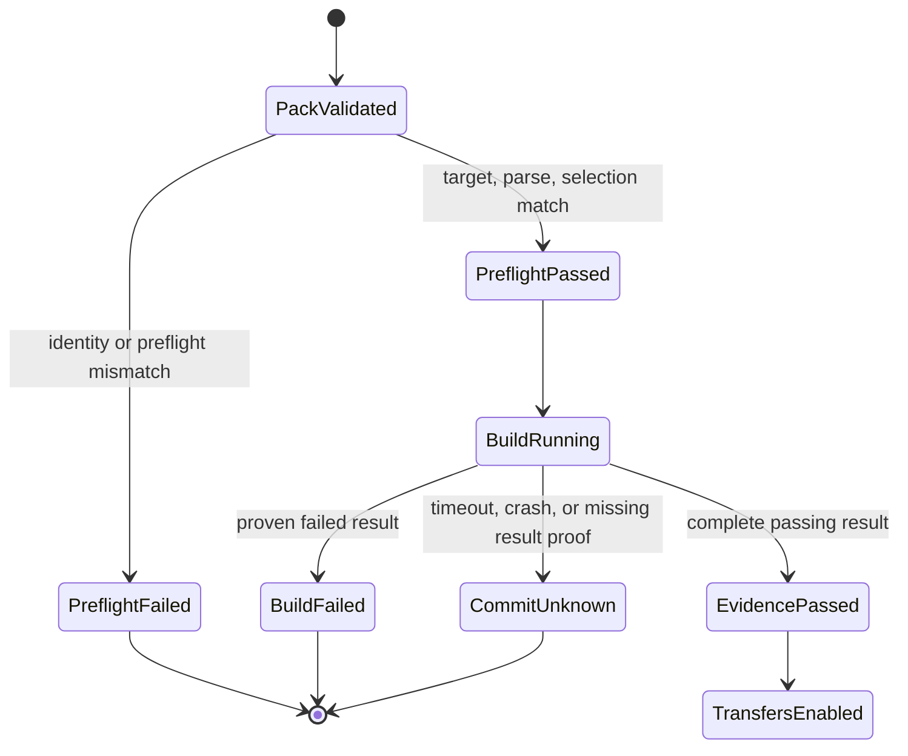

# dbt invocation, selection, and target identity

This reference is for platform engineers and operators who need to understand
why a native dbt workflow is admitted or stopped before `dbt build`. Authors
can keep using the two-command loop in the
[five-minute tutorial](dbt-inline-publishing.md).

## The safety promise

The release freezes one logical dbt invocation and one logical target. The
deployment supplies environment-specific connection bindings. Runtime proves
that both still describe the same work before a mutating dbt command starts.


A failure in the first three checks writes failed evidence with
`build_started: false`. It does not create the final attempt output, invoke
`dbt build`, or unlock transfer workloads.

## Canonical invocation

`dpone.dbt-invocation-context.v1` is generated once and embedded in the
execution pack:

```yaml
schema: dpone.dbt-invocation-context.v1
environment_policy: isolated_v1
indirect_selection: eager
static_environment:
  DBT_SEND_ANONYMOUS_USAGE_STATS: "false"
  LANG: C.UTF-8
  LC_ALL: C.UTF-8
dynamic_vars:
  - dpone_data_interval_end
  - dpone_data_interval_start
invocation_context_sha256: sha256:966d8702f76ef73c056a10341223bf9c49027610c8f965b55985cc0b58c07b74
```

Compile selection, runtime `parse`, runtime `ls`, and runtime `build` use the
same profile name, target name, indirect-selection mode, interval-variable
shape, and isolated environment. Ambient `DBT_*` and `DPONE_DBT_*` variables
are not inherited. Credentials are injected through a private generated
profile, not environment variables or argv.

The schema is published at
[dpone.dbt-invocation-context.v1](schemas/dbt/dpone.dbt-invocation-context.v1.schema.json).

## Selection lock

The lock distinguishes graph identity from expected runtime results:

```yaml
graph_policy_id: dpone.dbt-sqlserver-selected-graph-policy.v1
graph_policy_sha256: sha256:<canonical-policy-digest>
selected_graph_unique_ids:
  - model.analytics.orders
  - test.analytics.not_null_orders_id
  - unit_test.analytics.orders_unit_test
expected_run_result_unique_ids:
  - model.analytics.orders
  - test.analytics.not_null_orders_id
  - unit_test.analytics.orders_unit_test
publish_model_unique_ids:
  - model.analytics.orders
```

The pinned SQL Server v1 policy rejects ephemeral models. Admitted SQL
`table`, `view`, and explicit `append`/`merge` incremental models participate
in the mutation-relevant graph fingerprint. Data and unit tests participate in
both selection and result admission. Missing, duplicate, skipped, failed, or
unknown results block all transfers.

The policy digest binds the generated 131-record framework macro closure and
the distinct seven-record selected-node invocation extension. The graph
identity also binds the observed macro-authority projection and each selected
node's macro dependencies. Runtime rejects body, dependency, dispatch-family,
selected custom-macro, or metadata-helper drift before `dbt build`.

Compile validates selection locks as one project-level ownership graph before
publishing them. Each materialized model closure has one workflow owner;
cross-workflow publish dependencies and shared non-publish materialized parents
are rejected. Because indirect selection is eager, each selected data test must
read at least one model and every such dependency, plus `attached_node` when
present, must remain inside that workflow's model closure. Runtime re-proves
each immutable selected graph and policy digest before build, but cannot
redefine project-level ownership.

Model selectors are fail-closed. Exact dbt `unique_id` and FQN take precedence;
a short name or alias must match exactly one model. No match returns
`DPONE_DBT_MODEL_NOT_FOUND`; an ambiguous short selector returns
`DPONE_DBT_MODEL_AMBIGUOUS`. Neither case compiles unrelated models.

## Logical and deployment targets

The environment-neutral release records:

```yaml
profile:
  profile_name: dpone_runtime
  target_name: runtime
  connection_ref: mssql_marts
  adapter_type: sqlserver
  database: analytics
  schema: mart
  threads: 4
```

The deployment resolves `connection_ref` through its binding set and connection
registry. Host, port, Vault path, driver, namespace, and credential values stay
deployment-owned and never enter release bytes.

```text
logical_target_sha256 =
  hash(profile_name, target_name, connection_ref, adapter_type, database, schema)

target_binding_sha256 =
  hash(logical_target_sha256, deployment_id, binding_set_ref,
       connection_registry_ref, credential_runtime_ref)
```

Runtime resolves the binding once at workload start and compares adapter,
database, and schema before profile materialization. A mismatch returns
`DPONE_DBT_TARGET_IDENTITY_MISMATCH`; the platform owner must correct the
deployment or promote a matching deployment. Rotating a Vault secret without
changing the logical target does not change release or deployment identity;
evidence records the safe resolved secret version metadata.

## Toolchain and policy authority

Production policy names one toolchain:

```yaml
runtime:
  toolchain: dbt-sqlserver-1.10-certified
```

That ID maps to dbt Core `1.10.13`, distribution `dbt-sqlserver` `1.10.1`,
manifest v12, and run-results v6. The `dpone[dbt-mssql]` installation extra,
build selection, execution pack, runtime inspector, and evidence all use the
same contract. Canonical policy cannot also declare separate version strings.

The execution pack freezes both SQL Server policy contracts:

```yaml
adapter_runtime:
  schema: dpone.dbt-sqlserver-runtime-policy.v1
  backend: pyodbc
  retries: 1
  login_timeout_seconds: 15
  query_timeout_seconds: 3300
adapter_policy:
  schema: dpone.dbt-sqlserver-capability-policy.v1
  required_project_flags:
    dbt_sqlserver_enable_safe_type_expansion: false
    dbt_sqlserver_use_dbt_transactions: true
    dbt_sqlserver_use_default_schema_concat: true
    dbt_sqlserver_use_native_string_types: true
```

For process timeout `P`, `600 <= P <= 86400`, query timeout is `P - 300`,
and Airflow task timeout is `P + 300`. The pack fingerprint covers the
effective runtime and adapter policy. The provider serializes only integer
seconds and constructs Airflow's `timedelta` at the operator boundary. The
Airflow timeout covers init-fetch, preflight, build, and evidence as one task;
`P + 300` is an outer cutoff, not a guaranteed post-build reserve.

Build-plane `check` validates bounded unique-key `dbt_project.yml` bytes and
the preview selected closure. Runtime repeats the project policy from the
verified extracted bundle and evaluates the exact parsed selected graph before
the mutating build. A mismatch cannot be repaired by changing a generated
selection lock or execution pack.

Production policy must also declare `strategy_policy`. For `auto`, dpone builds
the deterministic candidate order `incremental_merge`, `partition_replace`,
then policy-authorized bounded `full_refresh`; it selects the first candidate
that both policy and current route capability permit. An explicit strategy
never falls back.

Workflow IDs must match `[a-z][a-z0-9_]{0,63}`. Invalid IDs return
`DPONE_DBT_WORKFLOW_ID_INVALID` before capability lookup or artifact writes.
Generated DAG and workload identities remain deterministic and path-confined.

## Runtime state and retry



Automatic retries remain `0`. Preflight is replay-safe, but dpone deliberately
does not retry a mutating build after it starts. A timeout, process crash, or
missing/invalid `run_results.json` after `build_started: true` cannot prove
which MSSQL mutations committed. If runtime control returns and the evidence
writer completes, the terminal evidence code is `COMMIT_UNKNOWN`. An outer
Airflow or pod cutoff may instead leave terminal evidence absent; operators
must conservatively treat that absence as the same commit-unknown state.
Reconcile the target and durable evidence before any new attempt.

Each attempt has separate preflight and final output directories. No attempt
deletes another attempt's `run_results.json`.

## Evidence fields

Runtime evidence records:

- invocation, graph, graph-policy, adapter-policy, adapter-runtime, selection,
  toolchain, logical-target, and target-binding fingerprints or effective
  values;
- `preflight_status`;
- `build_started`;
- nullable `dbt_exit_code`;
- effective warning policy and warning count;
- exact node outcomes and safe credential-version metadata.
- when `COMMIT_UNKNOWN` evidence is written, a closed recovery object with `safe_to_retry: false`,
  `operator_verification_required: true`, and no secret or raw exception text.

It never records argv, environment dumps, endpoint credentials, Vault tokens,
raw dbt output, or row values.

For recovery, use the [error catalog](dbt-self-service-errors.md) and
[operations runbook](dbt-self-service-runbook.md). Return to the
[dbt integration hub](dbt.md) for the complete journey.
