# dbt self-service threat model

This explanation is for platform, security, and release engineers reviewing the
native dbt-to-Airflow publishing boundary. It covers build, multi-repository
promotion, Airflow parse, runtime delivery, credentials, and evidence.

## Assets and authorities

| Asset | Authority | Security property |
| --- | --- | --- |
| dbt source | Editable dev repository | Reviewed source and package lock |
| Release tree | Dev build plus artifact registry | Immutable, complete, content-addressed |
| Prod audit mirror | Bot-owned prod PR paths | Byte-identical to the release project bundle |
| Deployment | Environment repository and protected CI | Correct prod bindings and runtime image |
| Credentials | Vault and Kubernetes workload identity | Never serialized into release/DAG/evidence |
| Evidence campaign request | Protected controller and create-only journal | Exact bounded DAG/workload authority |
| Runtime evidence | Runtime pod and durable evidence store | Exact release/deployment/workload correlation |
| Campaign outcome receipt | Protected campaign journal | Terminal state for every requested workflow |
| `current` pointer | Protected environment promoter | Audited compare-and-swap, no lost update |

## Trust boundaries

```mermaid
flowchart LR
    DEV["editable dev repo"] --> BUILD["isolated dev CI"]
    BUILD --> SIGN["isolated release attestor"]
    SIGN --> ART["immutable release + detached bundle"]
    ART --> ACT["protected dev activation"]
    ACT --> CTRL["protected campaign controller"]
    CTRL --> API["protected Airflow API"]
    CTRL --> JOURNAL["create-only campaign request journal"]
    API --> AFDEV["exact dev Airflow DAG runs"]
    JOURNAL --> AFDEV
    AFDEV --> PROVIDER["terminal provider evidence exporter"]
    PROVIDER --> RAW["create-only attempt evidence"]
    CTRL --> RECEIPT["terminal campaign outcome receipt"]
    RAW --> FINAL["protected finalizer + attestor"]
    RECEIPT --> FINAL
    FINAL --> BOT["prod mirror bot"]
    ART --> BOT
    BOT --> PR["reviewed prod PR"]
    PR --> PROD["protected prod CI + pinned trust policy"]
    PROD --> CACHE["scheduler local cache"]
    CACHE --> AF["Airflow parse"]
    AF --> KPO["pinned KPO/init-fetch"]
    KPO --> VAULT["Vault Kubernetes Auth"]
    KPO --> EV["durable evidence"]
```

Airflow parse is outside the network/secret trust boundary: it reads one local
bounded index and performs no dbt, Vault, database, registry, Variable, or
Connection call.

## Threats and controls

| Threat | Control | Failure behavior |
| --- | --- | --- |
| Release file added, removed, or modified after build | Deterministic `release-subjects.sha256`, GitHub attestation, full prod rehash | `DPONE_DBT_RELEASE_INTEGRITY_INVALID`; nothing materialized |
| Caller supplies a fake run or attestation reference | Verification pins repository, signer workflow/digest, source commit and source ref; audit identity is the verified receipt digest | Startup or `gh attestation verify` fails |
| Dev and prod rebuild different releases | Prod workflow has no compile step and requires the same `release_id` | Promotion blocked |
| Manual edit in prod dbt subtree | Bot extraction plus project-bundle rebuild comparison | `DPONE_DBT_PROMOTION_SOURCE_DRIFT` |
| Manual edit in promotion descriptor or source snapshot | Strict descriptor keys/fingerprint and compiled snapshot equality | `DPONE_DBT_PROMOTION_SOURCE_DRIFT` |
| Archive traversal, symlink, metadata bomb, or duplicate path | No-follow capture/extraction, USTAR-only members, rejection of PAX/GNU metadata extensions, and file/count/compressed/extracted limits | Bundle rejected before mirror/runtime use |
| Source changes during build | Before/after descriptor identity and complete rescan | Build fails, no output installed |
| Shell or argument injection | Fixed argv, relative pack path, strict tokens, and workflow inputs bound through environment variables before shell execution | Validation failure before execution |
| Ambient `DBT_*` variables alter compile/runtime semantics | One fingerprinted hermetic invocation allowlist is used by compile selection, preflight, and build | `DPONE_DBT_INVOCATION_CONTEXT_INVALID` or selection drift before build |
| SQL Server adapter defaults change retry, timeout, type, transaction, or schema behavior | The source project, execution pack, private profile, provider timeout, and evidence bind one immutable adapter policy | Project/runtime policy failure before build; no implicit fallback |
| Selected dbt nodes invoke unsupported SQL Server behavior | Build and runtime evaluate the exact selected closure against the same graph-policy ID/digest | `DPONE_DBT_SQLSERVER_GRAPH_CAPABILITY_UNSUPPORTED`; build never starts |
| Project/package macro changes, dependencies, or dispatch candidates alter execution | Project policy rejects non-empty `dispatch`; graph policy verifies generated exact framework and invocation records, dispatch families, selected-node dependencies, and the metadata-only helper | `DPONE_DBT_SQLSERVER_PROJECT_POLICY_INVALID` or `DPONE_DBT_SQLSERVER_MACRO_AUTHORITY_INVALID`; build never starts |
| dbt physical constraints generate unreviewed SQL Server DDL | Graph policy rejects model constraints and admits only column `not_null`; other assertions stay result-bearing tests | `DPONE_DBT_SQLSERVER_PHYSICAL_CONSTRAINT_UNSUPPORTED`; build never starts |
| Merge key is an expression, foreign contract field, duplicate, or nullable | One shared build-plane policy requires exact distinct identifier columns in an enforced contract with structural `not_null`; publishing metadata cannot override dbt's key | Stable `DPONE_DBT_UNIQUE_KEY_*` failure; no lock, pack, or release is written |
| Eager relationship/singular test reads a model owned by another workflow | Every selected data-test model dependency and optional attachment must be local to the current workflow closure | `DPONE_DBT_TEST_DEPENDENCY_OUTSIDE_WORKFLOW`; no release output is installed |
| ClickHouse receives NULL or duplicate staged merge keys despite authoring checks | The exact post-lineage finalization table is probed after quality and before finalizer target lookup, schema evolution, swap, delete, update, or insert | `DPONE_CLICKHOUSE_STAGING_UNIQUE_KEY_NULL` or `DPONE_CLICKHOUSE_STAGING_UNIQUE_KEY_DUPLICATE`; failure evidence names every attempt-local table and cleanup status, cleanup failure preserves the primary error, verification is mandatory before retry, and the target remains untouched |
| Two workflows mutate one materialized model closure | Compile compares every workflow selection as one ownership graph before lock/output publication | `DPONE_DBT_CROSS_WORKFLOW_DEPENDENCY_UNSUPPORTED` or `DPONE_DBT_WORKFLOW_GRAPH_OVERLAP`; no release output is installed |
| Deployment target is confused with the release logical target | Runtime resolves one binding, then compares adapter, database, and schema before rendering the private profile | `DPONE_DBT_TARGET_IDENTITY_MISMATCH`; build never starts |
| Project graph changes between release and runtime | Runtime `parse` and `ls` reproduce graph, relations, and exact selected IDs before build | `DPONE_DBT_SELECTION_DRIFT`; final attempt output is not created |
| Stale successful `run_results.json` hides a failed dbt process | After preflight succeeds, each build gets an isolated attempt directory; current result and exit code are both required | dbt task fails; transfers remain blocked |
| Ephemeral models or unsupported tests make result identity ambiguous | SQL Server graph policy rejects ephemeral models and admits only result-bearing standard data/unit tests | Policy failure or test failure blocks every transfer |
| dbt emits a warning or no-op status with exit code zero | Platform warning policy is frozen into the pack; warnings fail by default and remain counted in evidence, while `no-op` is explicit success | Non-passing policy result returns failure |
| Timed-out dbt child keeps pipes or subprocesses alive | Query timeout ends 300 seconds before the build-process limit; POSIX dbt runs in a new session; Airflow applies `P + 300` to the whole init-fetch/preflight/build/evidence task | Pre-build failure is closed; after build starts the state is commit-unknown. Runtime records non-retryable `COMMIT_UNKNOWN` only if control returns before the outer Airflow cutoff; otherwise evidence may be absent. A guaranteed post-build reserve remains `UNVERIFIED` |
| Evidence from another release/deployment is promoted | Exact release, deployment, workflow, pack, and workload coverage checks | `DPONE_DBT_DEV_EVIDENCE_UNVERIFIED` |
| Caller redirects the campaign to another Airflow or evidence store | API origin/version and evidence root come only from protected environment configuration; bearer token is a secret | Workflow exits with security code `4` before a DAG run is created |
| More workflows or time are consumed than the campaign budget permits | Request schema caps workflows at 200; one deadline covers journal, trigger, reconciliation, polling, and terminal receipt | `DPONE_DBT_DEV_EVIDENCE_CAMPAIGN_FAILED`; missing workflows remain unverified |
| A retried trigger creates a different run | Deterministic run ID plus exact-conf reconciliation; conflicting replay fails | Campaign stops without accepting the foreign run |
| Provider publishes a passed XCom before durable evidence exists | Terminal exporter validates and installs attempt evidence before publishing passed workflow outcome | Export failure produces a failed outcome; promotion remains blocked |
| Caller identity is confused with protected finalizer identity | Campaign request records caller orchestration identity; finalization provenance uses `job.workflow_*` from the reusable workflow | Final evidence verification rejects foreign controller or finalizer provenance |
| Secret leakage into source/release/logs | Project exclusions, streaming high-confidence secret scan for included dbt files, forbidden meta keys, runtime Vault resolution, redaction | Build/runtime blocked; secret values never become evidence |
| A failed mapped transfer instance is hidden by a later successful instance | Terminal outcome aggregates every task instance per expected task ID and requires all states to be `success` | Workflow receipt is failed |
| Duplicate JSON keys turn a failed XCom into success | Provider task-time JSON boundaries reject duplicate keys and non-finite numbers | Outcome task fails closed |
| Concurrent prod activation overwrites another deployment | Expected-current identity comes from protected environment state, not caller input; compare-and-swap uses a protected promoter identity | CAS conflict; current remains unchanged |
| CI-side attestation verification is mistaken for runtime trust | CI and stock runtime independently verify the exact `release-set.json` with the same digest-pinned v2 policy; the detached bundle is immutable and runtime performs no network lookup | Any policy, bundle, signer, subject, root, or verifier mismatch fails with stable `DPONE_ARTIFACT_*` security errors before ready state |
| Retry duplicates target writes | Default retry count zero; only certified replay-safe route with durable fence may opt in | Manual reconciliation required |
| Final commit happened but evidence is missing | Two-axis outcome and `COMMIT_UNKNOWN` | Automatic retry forbidden |

## Tokens and identities

- Dev OIDC signs the checksum subject; it has no prod runtime credentials.
- The mirror bot token is limited to branch and pull-request writes in prod.
- The prod artifact token is read-only for exact workflow artifacts.
- Activation uses fixed trusted runner labels and cache roots. Promoter and
  signer identities are repository-admin configuration verified before use;
  they are not accepted as reusable-workflow inputs.
- The Airflow API origin/version, evidence root, expected current deployment,
  and finalizer identity are environment-owned. The caller supplies only the
  release/deployment request identities and source provenance.
- The Airflow API token is short-lived and limited to create/read DAG runs. It
  is never serialized into campaign requests, receipts, logs, or evidence.
- Runtime artifact download and Vault access use Kubernetes workload identity.
- Static registry, Vault, or artifact-storage credentials are forbidden in KPO
  arguments, release bytes, deployment descriptors, logs, and evidence.

## Residual risk and non-claims

- GitHub attestation proves producer identity and subject bytes, not semantic
  correctness; schema, capability, dev evidence, and review gates remain
  mandatory.
- Unused project/package macros remain reviewed immutable source but grant no
  execution authority. A selected executable node may call only the exact
  generated framework/invocation baseline or pinned metadata-only helper.
- The prod mirror is audit material, not runtime authority. Runtime always uses
  the digest-pinned project bundle.
- Co-installed Astronomer Cosmos DAGs are separate topologies and trust chains.
- Live MSSQL, ClickHouse, Airflow, Kubernetes, Vault, and failure-injection rows
  remain `UNVERIFIED` until evidence exists for the exact commit and images.
- Production activation is available only through the concrete offline
  attestation path and protected reusable workflow. That implementation proof
  is not live certification: exact-cluster runtime, registry, Vault, and route
  evidence remains `UNVERIFIED`, and no caller-controlled bypass exists.
- `COMMIT_UNKNOWN` requires human reconciliation; no algorithm can safely infer
  a missing target commit receipt.

Continue with [promotion and rollback](dbt-self-service-promotion.md), the
[platform workflows reference](dbt-self-service-platform-workflows.md), the
[operations runbook](dbt-self-service-runbook.md), or return to the
[dbt integration hub](dbt.md).
