# Semantic refresh V2

This author-oriented page explains the bounded V2 runtime and its golden path.
Platform engineers should use the [baseline adoption guide](dbt-semantic-refresh-v2-baseline.md)
and [activation/upgrade guide](dbt-semantic-refresh-v2-platform.md). On-call
operators should start with the [self-service runbook](dbt-self-service-runbook.md#recovery-by-failure-boundary).

The only implemented capability cell is `scope_stable_event_fact`. Version
0.74 exposes it only as an opt-in local diagnostic preview. Production use is
unavailable: the shipped activation guard raises
`DPONE_SEMANTIC_REFRESH_PRODUCTION_ACTIVATION_UNAVAILABLE` before persistence
or target mutation, and also before a new DagRun can consume an existing V2
activation receipt, because the exact-UUID predecessor-retention controller is
not shipped. Current exact-environment evidence remains necessary for a future
release, but cannot unlock production in 0.74.

The protocol name “V2” is distinct from its 0.74 attempt-continuation wire
schema, `dpone.semantic-refresh-attempt-continuation-receipt.v1`. That receipt
is permanently frozen, supports only one immediate same-DagRun successor, and
does not authorize automatic retry. A future receipt v2 is post-0.74 work.

## Decide whether the cell fits

Use V2 only when all of these statements are true:

- a row's identity contains an immutable event time and stable business key;
- the daily UTC scope is `[start, end)` and payload may change only for that
  same effective key;
- a missing row in a replay must remain in the target;
- the SQL Server model and dpone control schema share one database;
- an existing complete SQL Server/ClickHouse baseline is certified or adopted;
- the ClickHouse target is a single-node, single-replica plain `MergeTree` in an
  `Atomic` database;
- the model is target-independent and uses no ephemeral dependency;
- platform budgets permit a full ClickHouse shadow generation.

Do not use this cell for a current-state entity such as `customer_id` keyed by a
mutable `updated_at`. Moving rows, delete-missing, text keys, greenfield
initial load, replicated targets, and multi-table atomic cutover are unsupported.

## Author journey

The author metadata does not change:

```yaml
meta:
  dpone:
    publish:
      enabled: true
      profile: mssql_to_clickhouse_mart
      workflow: competitive_pricing
```

The platform-owned profile keeps production on V1. In a disposable local
harness it may select the 0.74 V2 preview cell; authors cannot enable modules,
bypass a writer fence, assume UTC, change recovery behavior, or promote that
preview to production.

Run the existing beginner path:

```bash
dbt parse
dpone dbt check .
```

Use `dpone dbt explain model.project.competitive_pricing` for the full
route/proof explanation. CI runs the pinned offline `dbt compile` because V2
requires immutable `compiled_code` in addition to the manifest graph. Authors
do not install or select `dpone_scope_merge`: the deployment-owned, locked
`dbt-dpone` package and lifecycle policy inject and verify that strategy.

At worker startup the platform materializes the reviewed four-file package into
an attempt-local project copy, verifies its digest, and injects the closed
project overlay before dbt runs. This requires no author `packages.yml`,
`dbt deps`, or `macro-paths` change. Package bytes and overlay are authenticated
deployment inputs, never DAG-author inputs.

For an admitted V2 model, explain makes the important limits visible:

```text
Asset: model.project.competitive_pricing
Model: scope_stable_event_fact
Scope: UTC day [start,end)
Static policy: dependency closure UNVERIFIED; adapter lifecycle UNVERIFIED
Runtime proof: dependency closure RUNTIME_REQUIRED; adapter lifecycle RUNTIME_REQUIRED
Recovery: replay is upsert-only; row removal unsupported
```

The proof reports the exact dbt Core/adapter versions, event-time and key
policy, UTC assurance, writer assurance, and source-side-pruning status. A
model error tells the author how to change SQL or metadata. Missing platform
assurance is a platform action; there is no author override.

## What the runtime does

```mermaid
flowchart LR
    P["Exact plan and dependency proof"] --> G["Workflow and resource guards"]
    G --> M["Fenced SQL Server UPDATE then INSERT"]
    M --> I["Before and after images"]
    I --> A["Version-pinned sealed artifact"]
    A --> S["ClickHouse staging and full shadow"]
    S --> C["Exact multiset conformance"]
    C --> E["Atomic table exchange"]
    E --> H["Atomic heads, checkpoint, journal"]
    H --> W["Durable workflow summary"]
```



The platform proves the complete selected mutation closure. dbt Core 1.10.13,
dbt-sqlserver 1.10.1, the runtime image, driver, packages, macro dispatch,
adapter lifecycle, engine compatibility, and invocation are one frozen tuple.
Any drift requires a new release and certification.

Model SQL produces the full logical result. V2 does not prove source-side
predicate pushdown; the adapter may materialize a full temp result before the
trusted strategy filters the day. Platform tempdb, transaction-log, image,
artifact, shadow, disk, and deadline budgets guard this cost.

## Observe publication

Each model publishes with one atomic ClickHouse relation exchange. Models are
published sequentially in deterministic order, but there is no workflow-wide
database transaction. A direct SQL reader may see new model A with old model B
while the workflow is still running.

Airflow success Assets are delayed until the durable workflow summary is
`COMPLETE`. This prevents false orchestration success, but does not create a
multi-relation snapshot for direct database readers.

| State | Meaning | Ordinary retry |
| --- | --- | --- |
| `PREPARING` / `PREPARED` | Guarded operation or complete prepared publication | Reconcile the same DagRun first |
| `COMMITTING` | ClickHouse outcome is being established | Block until UUID reconciliation |
| `TARGET_COMMITTED` | Exchange is proven; heads are not fully published | Resume terminal publication only |
| `COMPLETE` | Target and atomic control state are proven | No retry; correction is scope revision `n+1` |
| `FAILED_PRE_COMMIT` | No ClickHouse target commit was invoked | Use the governed replacement procedure |
| `COMMIT_UNKNOWN` | Required commit outcome cannot be proven | No retry or replacement |
| `COMMITTED_INCOMPLETE` | Target committed but evidence/state is incomplete | Reconcile; never roll back implicitly |

An empty staged scope does not exchange or advance the ClickHouse generation.
Its scope revision/checkpoint still advance, with an exact
`NOT_REQUIRED_EMPTY_SCOPE` receipt and unchanged target UUID/generation.

`FAILED_PRE_COMMIT` does not mean SQL Server was unchanged. Every model is
classified as `NOT_INVOKED`, `ROLLED_BACK`, `COMMITTED_WITH_IMAGES`, or
`COMMIT_UNKNOWN` from durable engine evidence.

## Choose the next task

- Platform: [adopt an existing complete baseline](dbt-semantic-refresh-v2-baseline.md).
- Platform: [evaluate V2 locally and verify its production block](dbt-semantic-refresh-v2-platform.md).
- Operator: [recover by the exact failure boundary](dbt-self-service-runbook.md#recovery-by-failure-boundary).
- Reference: [contracts, errors, and policy](dbt-self-service-reference.md).
- Architecture: [ADR 0045](adr/0045-durable-semantic-refresh-runtime.md).

A completed-scope correction is upsert-only and cannot remove an erroneous key.
`COMMIT_UNKNOWN` blocks replacement. No `--force`, `assume-utc`, cross-DagRun
rebind, or delete-missing override exists.
