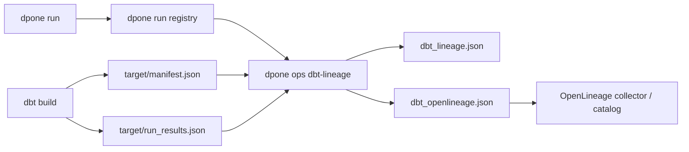

# dbt integration

This hub is for dbt authors, platform engineers, and operators integrating dbt
with dpone. For a first MSSQL model published to ClickHouse, start with the
[five-minute self-service tutorial](dbt-inline-publishing.md).

## Choose your task

| Goal | Page |
| --- | --- |
| Publish a first contracted dbt model | [Five-minute self-service tutorial](dbt-inline-publishing.md) |
| Evaluate the bounded V2 daily semantic refresh locally | [Semantic refresh V2 (0.74 local preview)](dbt-semantic-refresh-v2.md) |
| Exercise baseline adoption in a disposable local environment | [V2 baseline adoption preview](dbt-semantic-refresh-v2-baseline.md) |
| Verify the production block or upgrade the preview schema | [V2 preview platform operations](dbt-semantic-refresh-v2-platform.md) |
| Look up metadata, commands, publish profiles, and compatibility | [Author and platform reference](dbt-self-service-reference.md) |
| Understand pre-build invocation, selection, and target checks | [Runtime identity reference](dbt-self-service-runtime-identity.md) |
| Promote one immutable release from dev to prod or roll it back | [Promotion and rollback](dbt-self-service-promotion.md) |
| Regenerate older branch-local dbt artifacts safely | [dbt compatibility and immutable-output migration](compatibility.md#dbt-self-service-compatibility) |
| Wire reusable workflows, trust variables, and token scopes | [Platform workflows](dbt-self-service-platform-workflows.md) |
| Diagnose a failed workflow or recover safely | [Operations runbook](dbt-self-service-runbook.md) |
| Look up a stable failure code and next action | [Error catalog](dbt-self-service-errors.md) |
| Review trust boundaries and security controls | [Threat model](dbt-self-service-threat-model.md) |
| Review the planned multi-project release contract (not yet implemented) | [Multi-project release design](feature-design-dbt-multi-project-release.md) |
| Integrate unreleased workspace readers and understand their limits | [Workspace source verification](dbt-workspace-source-verification.md) |
| Discover, check and compile projects without a central domain registry | [Workspace authoring](dbt-workspace-authoring.md) |
| Prepare and verify an unreleased complete workspace audit mirror | [Workspace promotion](dbt-workspace-promotion.md) |
| Join dbt results to dpone lineage evidence | Continue with the lineage export contract below |

The credential-free compiler, promotion, provider, and offline-attestation
contracts are implemented. Live MSSQL-to-ClickHouse, Kubernetes, Vault, Airflow
matrix, and usability rows remain `UNVERIFIED`; a local or mocked success does
not establish production certification.

`dpone` integrates with dbt through dbt artifacts. It does not embed or replace
dbt. There are two related flows:

1. In V1 dbt self-service publishing, run the locked `dbt build` and required
   data/unit tests first, validate `run_results.json` against the vendored
   official v6 schema, then start parallel dpone transfer workloads. A failed
   or incomplete dbt result blocks every transfer. The additive V2 semantic
   refresh cell instead prepares every model before deterministic sequential
   ClickHouse publication and retains journal/image/artifact/UUID authority.
2. For standalone lineage export, run the relevant dpone/dbt jobs, then join
   `manifest.json`, `run_results.json`, and the dpone run-registry entry.

This keeps runtime boundaries clean: dpone owns extract/load/state/evidence,
while dbt owns SQL transformations, refs, sources, tests, snapshots, and model
selection.

The immutable selection lock deliberately records two identities:

- `selected_graph_unique_ids` is the complete policy-admitted dbt-selected
  graph, including selected data and unit tests;
- `expected_run_result_unique_ids` is the complete result-bearing admitted set.

The pinned SQL Server V1 policy and V2 semantic-refresh policy both reject
ephemeral models, seeds, and snapshots before publication. V2 additionally
uses exact model selectors without ancestor execution and rejects every
unmanaged mutating node.

All expected data and unit tests must appear and pass before transfers start.
The platform publish profile owns `quality.dbt_warning_policy`. Its default is
`fail`, which adds `--warn-error`; `allow` is an explicit platform decision and
still records every warning in execution evidence. `no-op` is a valid dbt
success status, while skipped and partial-success nodes remain blocking.

Projects with `packages.yml` or `dependencies.yml` must run `dbt deps` before
`dpone dbt compile`. The project bundle includes `package-lock.yml` and the
configured resolved package tree. dpone never performs an implicit network
download:

```bash
dbt deps
dbt parse
dpone dbt check
```

## Lineage export quickstart

```bash
dbt build --project-dir analytics --profiles-dir analytics

dpone ops dbt-lineage \
  --output-dir .dpone/dbt-lineage/orders \
  --manifest analytics/target/manifest.json \
  --run-results analytics/target/run_results.json \
  --run-registry-entry .dpone/run-registry/<run_id>__run_registry.json \
  --namespace dbt.local \
  --format json
```

Artifacts written:

```text
dbt_lineage.json
dbt_lineage.md
dbt_openlineage.json
```

## Lineage model



`dbt_lineage.json` contains:

| Field | Meaning |
| --- | --- |
| `nodes` | dbt sources, models, seeds, snapshots, and tests. |
| `edges` | `depends_on.nodes` relationships from upstream to downstream. |
| `run_id` | dpone run id when `--run-registry-entry` is provided; otherwise dbt invocation id. |
| `invocation_id` | dbt invocation id from `run_results.json`. |

`dbt_openlineage.json` contains one event per executable dbt dataset node:

| dbt resource type | OpenLineage behavior |
| --- | --- |
| `model` | Emits one event with upstream refs/sources as inputs and model relation as output. |
| `seed` | Emits one event with dependencies as inputs and seed relation as output. |
| `snapshot` | Emits one event with dependencies as inputs and snapshot relation as output. |
| `source` | Used as an input dataset, does not emit its own event. |
| `test` | Included in graph and status evidence, does not emit a dataset-producing event. |

## dbt artifact requirements

| Artifact | Required | Purpose |
| --- | --- | --- |
| `target/manifest.json` | yes | Graph structure, nodes, sources, refs, relation names. |
| `target/run_results.json` | recommended | dbt statuses, invocation id, failed model/test detection. |
| dpone run registry entry | recommended | Joins dbt lineage to dpone `run_id`, evidence, and checksums. |

## Failure behavior

| Condition | CLI status | Blocker |
| --- | --- | --- |
| Missing `manifest.json` | red | `dbt_manifest.missing` |
| Invalid `manifest.json` | red | `dbt_manifest.invalid_json` |
| dbt model/test has failed status | red | `dbt_results.not_passed` |
| Attached dpone run registry is red | red | `run_registry.not_passed` |
| Attached run registry is missing | red | `run_registry.missing` |

## Example CI step

```bash
dpone run manifests/orders_load.yml \
  --selector orders \
  --format json > .dpone/runs/orders/run_result.json

dpone ops run-registry \
  --output-dir .dpone/run-registry \
  --run-result .dpone/runs/orders/run_result.json \
  --format json

dbt build --project-dir analytics --profiles-dir analytics

dpone ops dbt-lineage \
  --output-dir .dpone/dbt-lineage/orders \
  --manifest analytics/target/manifest.json \
  --run-results analytics/target/run_results.json \
  --run-registry-entry .dpone/run-registry/orders__run_registry.json \
  --namespace dbt.local \
  --format json
```

## Python API

```python
from dpone.ops.dbt_lineage import DbtLineageService

report = DbtLineageService().export(
    output_dir=".dpone/dbt-lineage/orders",
    manifest_path="analytics/target/manifest.json",
    run_results_path="analytics/target/run_results.json",
    run_registry_entry_path=".dpone/run-registry/run_01__run_registry.json",
    namespace="dbt.local",
)

if not report.passed:
    raise RuntimeError(report.blockers)
```

## Lineage export runbook

1. If `dbt_manifest.missing`, run `dbt build` or check `--project-dir`.
2. If `dbt_results.not_passed`, fix failed dbt models/tests before publishing release evidence.
3. If relation names are empty, confirm dbt adapter generated `relation_name` in the manifest.
4. If catalog datasets do not join with dpone datasets, standardize namespace names across `lineage-export` and `dbt-lineage`.
5. Attach `dbt_lineage.json`, `dbt_openlineage.json`, and `dbt_lineage.md` to release evidence for production changes.

For publishing failures and safe reruns, use the
[dbt self-service operations runbook](dbt-self-service-runbook.md).
