# Bounded native delivery acceleration

Data engineers use this guide to understand preparation work in the opt-in
ClickHouse-to-MSSQL native route. Platform engineers can follow the
[operations guide](operations.md) to diagnose delivery phases and retain
reproducible evidence. Start with the
[native transport prerequisites](../mssql-native-transport.md#prepare-and-configure)
before composing a runtime.

The [approved design](../feature-design-data-delivery-acceleration-v1.md) preserves
the existing manifest, native bytes, journal and recovery formats. Its bounded
scope reduces repeated preparation work: reuse frame sizes, project metadata in
the prepared INSERT, and compute both prepared digests in one iterator. All four
raw verification boundaries and the independent prepared prepublication check
remain required. These structural improvements do not establish a measured speed
increase. Live interoperability and performance remain **UNVERIFIED**.

## First success without database access

From a development checkout with the repository's `uv` environment, inspect the
existing example and exercise the synthetic composition:

```bash
uv run dpone plan examples/native/clickhouse-to-mssql-native.yaml --format md
uv run pytest tests/test_mssql_native_runtime.py tests/test_mssql_native_staged_prepare.py -q
```

The first command exits successfully and reports `status: composition_required`,
`live_preflight: not_run` and `certification_status: unverified`. It renders the
intended route and its requirements without running a delivery. The tests verify
preparation and lifecycle ordering without opening SQL Server or ClickHouse. Passing them establishes only the tested
hermetic behavior. To execute a route, the platform owner must supply the
[Python composition capabilities](../mssql-native-transport.md#compose-the-runtime),
including a `native_runtime_factory`, exclusion scopes, state and evidence
callbacks. A manifest alone cannot supply these capabilities.

## Follow the delivery

```mermaid
flowchart LR
    Source[One acquired source query] --> Frames[Frozen sized frames]
    Frames --> Workers[Bounded encoding and BCP]
    Workers --> Raw[Verified raw staging]
    Raw --> Prepared[Business and metadata INSERT]
    Prepared --> Digests[Business and full digests]
    Digests --> Quality[Quality gates]
    Quality --> Recheck[Independent prepublication checks]
    Recheck --> Commit[Target mutation and receipt commit]
    Commit --> Evidence[Durable evidence]
    Evidence --> State[Fenced checkpoint]
```



Before source EOF, failure requires complete re-extraction. Completed staging can
resume without opening the source. Publication intent requires checking the exact
target receipt first; an unknown commit outcome blocks replay. Diagnostic reports
cannot replace any of those authorities.

## Compatibility and limitations

Existing callers retain their Mapping and tuple APIs, resource defaults, wire
encoding and recovery artifacts. No manifest migration is required. The finalizer
still updates the authoritative target-clock load time inside its transaction.
Direct BCP ingestion retains its existing metadata projection behavior.

The separate SQL Server partition SWITCH component is unregistered. Public native
SWITCH requests remain rejected before I/O. Its activation requires a further
approved contract, aligned-stage ownership/provisioning and real-environment
certification. Hermetic component tests cannot authorize activation.

Use the [operations guide](operations.md) for measurement interpretation, failure
diagnosis and recovery. The [implementation task plan](../data-delivery-acceleration-tasks.md)
describes the immutable scope and ownership of this work.


## Choose the next step

- Read [frame sizing](frames.md) and [preparation integrity](preparation.md) for
  algorithms, bounds and preserved verification boundaries.
- Add [phase observations](observations.md) using the composition instructions in
  the [operations guide](operations.md#connect-optional-observations).
- Generate retained experiment inputs with the
  [certification harness](certification.md#start-without-services), then follow
  the [comparison workflow](operations.md#create-and-compare-retained-reports).
- Review [isolated partition SWITCH](partition-switch.md) and
  [ADR 0062](../adr/0062-isolated-mssql-switch-activation.md) for activation limits.
