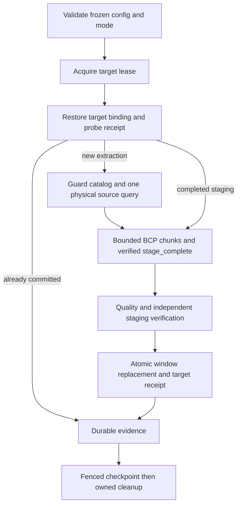

# Compose a raw single-query window

Data engineers use this how-to to prepare a synthetic UTC window. Platform
engineers use the explicit Python hook to supply real database authorities.
Start with the [delivery overview](index.md) and
[native prerequisites](../mssql-native-transport.md#prepare-and-configure).
The offline command below does not transfer rows or certify a live route.

## Prepare and inspect

Use a development checkout with its frozen dependencies:

```bash
uv sync --frozen
uv run python examples/native/raw-window-runtime.py --work-dir /tmp/dpone-raw-example
uv run pytest tests/test_raw_window_example.py -q
```

The command validates a complete synthetic `LoadConfig`, freezes
`2026-01-01T00:00:00Z <= observed_at < 2026-01-02T00:00:00Z`, and exercises
actual SQLite lease exclusion and compare-and-swap writes. It returns exit 0
with JSON containing `status: composition_required`, `live_preflight: not_run`,
`certification_status: unverified`, `source_read_mode: raw_single_query`,
`local_lease_exclusion: PASS`, `local_cas: PASS`, and zero source queries and
target publications. These two PASS values describe only local storage checks.
SQLite does not exclude external SQL Server or ClickHouse writers.

The command creates `example-authority.sqlite3` in the supplied local directory,
including SQLite WAL files when needed. Repeating it advances the offline record
revision under a fresh lease. The record is explicitly `offline-only`; it is
neither a native chunk journal nor a publication receipt. Use a durable local
filesystem, not network storage. No connection is resolved or credential stored.

For manifest planning, copy
`examples/native/clickhouse-to-mssql-native.yaml` to a working file and add this
mapping alongside `wire` and `execution` under
`defaults.source.options.native_transfer`:

```yaml
source_read:
  mode: raw_single_query
```

Keep all existing wire, chunking, window and cumulative capacity settings. Run
`uv run dpone plan` with that file and `--format json`, `--format md`, or
`--format text`. A successful plan remains `composition_required`; live
preflight is `not_run`. Explicit mode adds `mssql_native.source_read_mode`.
Absence retains the legacy plan representation and plain-MergeTree admission.
An ordinary CLI run still requires an injected `native_runtime_factory`.
There is no new automatic composition, execute flag or resume flag.

## Run the concrete disposable composition

After environment approval, follow the [local Docker setup](local-docker.md#prepare-the-services):
use private ClickHouse and SQL Server containers plus a Linux runner with ODBC
Driver 18, BCP and the native connector dependencies. Both databases must be named
`dda_synthetic`; ClickHouse must use Atomic. Supply the documented
`DPONE_IT_CH_*` and `DPONE_IT_MSSQL_*` values through process environment. The
fixture rejects other database names. The CLI does not start containers or
accept credentials as arguments.

Set `DPONE_RUN_INTEGRATION=1`, `DPONE_RUN_INTEGRATION_LIVE=1` and
`DPONE_DDA_DISPOSABLE_APPROVED=1` only after explicit approval. From the checkout,
run each scenario in a fresh durable private directory:

```bash
uv run python examples/native/raw-window-runtime.py --live \
  --scenario first-load --work-dir /tmp/dpone-raw-first
uv run python examples/native/raw-window-runtime.py --live \
  --scenario completed-stage --work-dir /tmp/dpone-raw-resume
uv run python examples/native/raw-window-runtime.py --live \
  --scenario incomplete-stage --work-dir /tmp/dpone-raw-reextract
```

These commands provide concrete wiring: `Environment` resolves the approved
connections, `LocalRouteFactory(source_read_mode="raw_single_query")` provisions
32 synthetic Unicode rows, and its `Session` constructs `NativeMssqlRuntime`,
`compose_native_stage_context`, `ClickHouseNativeSource`, owned independent BCP
sessions and `MssqlGenericTransactionFinalizer`. The fixture uses its existing
schema locks, catalog admission, SQL receipt state, quality checks, durable
SQLite evidence and fenced checkpoint callbacks. No callback implementation is
left for the user to invent for these local scenarios.

The raw policy is stored in immutable inventory before configuration compilation
and provisioning. It therefore participates in admitted route identity. The
example checks that both parsed configuration and `NativeChunkPlan` carry raw
mode before running; attach restores it from inventory and rejects a changed or
removed policy. Do not modify configuration after admission to enable raw mode.
The fixture's authored window uses `event_at` for the same fixed UTC day; the
offline preparation config uses `observed_at`.

| Scenario | Actual action and required observation |
| --- | --- |
| `first-load` | Run one source query, publish once, and compare the target typed multiset, metadata, receipt and outside-window rows independently. |
| `completed-stage` | Inject `after_eof` only after durable `stage_complete` metadata. Close the session, attach the same invocation from inventory and recover with `source_allowed=False`. Require one total source query and one publication. |
| `incomplete-stage` | Inject `during_source` after the first yielded row. Require no complete-stage authority, no publication and unchanged target rows. Clean proven owned fixture objects, admit a different invocation, and re-extract all 32 rows. |

Each new factory invocation owns a separate synthetic source and target table.
The incomplete-stage scenario demonstrates full re-extraction into that newly
owned fixture; it does not demonstrate rebinding a new invocation to the same
physical target. Completed-stage recovery does reuse the exact original target
and invocation. Failure injection is controlled in-process; it does not establish
hard process-kill or machine-crash recovery.

The commands produce console JSON and `scenario.json`. A completed scenario
exits 0 with `status: PASS`, `certification_status: unverified`, five passing
observation checks, `source_queries: 1`, `publications: 1`, and
`owned_fixture_cleanup: PASS`. The incomplete scenario lists two invocation IDs;
the others list one. The report is created exclusively and an existing report
causes failure before provisioning. It contains no connection secrets. An
unexpected failure exits 1 with a sanitized error class; unresolved resources
remain for investigation. A process killed during the report write can leave a
partial report, which must not be accepted as evidence.

`invocations/<invocation-hex>/` retains `inventory.json`, `provisioned.json`,
`journal.sqlite3` and spool artifacts as applicable. The raw native journal,
transaction receipt, evidence and checkpoint are produced by the real fixture;
`scenario.json` only records observations. Successful fixture cleanup removes
proven owned source/target tables; immutable identity registries and audit
catalogs remain. Native staging follows the service's own settlement/cleanup
rules. Preserve uncertain objects and their inventory for diagnosis.

This local fixture provisions MergeTree with explicit raw mode. It does not
provision replicated or replacing engines. Its `source_guard.py` implements an
actual cooperative file lock plus UUID/schema checks. That lock protects only
exclusively owned disposable tables when every DDL writer participates; it does
not exclude an independent administrator. The real target authority scopes
likewise rely on the fixture's exclusive ownership and permission boundary.
These observations are local checks, not a production deployment certificate.

## Integrate a deployment runtime

For a deployment-specific composition, the example also exposes `bind_plan`,
`compose_runtime` and `run_window`. `bind_plan` takes actual persisted identity
fields and carries the parsed policy into `NativeChunkPlan`. Never invent new
run IDs or digests during attach. `compose_runtime` requires all target bindings,
source scope, quality, evidence and checkpoint ports. `run_window` calls the
constructed runtime's `run(config, owner=owner)` method.

Use the concrete local `Session` in `tools/native_delivery_local/session.py` as
the wiring reference, and `bindings.py` for target-only admission. Deployment
ports must implement actual source DDL exclusion across catalog/query lifecycle,
target schema/content exclusion through verification and consumption, ownership,
transactional receipt reconciliation, and durable fenced evidence/checkpoints.
A local SQLite lease or no-op callback is insufficient. Each source scope owns
one physical session without automatic replica failover; each BCP importer owns
an independent target session. Keep all raw/prepared staging verification.

When using `DefaultProcessRunner`, supply its `native_runtime_factory`; the
ordinary CLI still cannot create operational authorities from a manifest alone.
The example's `--live` option belongs only to this standalone fixture script.

## Execute, observe and recover

Run the supplied `run_window` hook only against an explicitly approved environment
with frozen invocation data, resolved credentials outside evidence, supported
BCP/ODBC/native driver dependencies and capacity already provisioned.



A successful runtime returns `ProcessResult.status == "success"`, row counts,
`details.source_opened` and `details.commit_receipt_id`. Inspect the composed
store's chunk/publication journal and the deployment's evidence/checkpoint
records. Only the complete publication/evidence/checkpoint lifecycle is success.
The example's offline database contains none of these live artifacts.

| Observed boundary | Operator action |
| --- | --- |
| Verified `stage_complete` before publication | Reconstruct adapters from the same persisted invocation, then call `run_window` with the same config and identity. Deny source access to demonstrate source-free recovery; revalidate stage ownership/content. |
| Incomplete extraction | Settle every importer and clean only proven owned incomplete objects. Use a separately admitted new invocation and re-extract the entire authored window. Partial rows are not a source-free resume token. |
| Publication intent or lost commit acknowledgement | Probe the exact transactional receipt first. Unavailable or mismatching authority blocks replay and destructive cleanup. |
| Published, evidence failed | Attach the same invocation; finish evidence/checkpoint without republishing. |
| Lease/CAS failure | Stop; do not overwrite a newer owner or report success. |
| Retained uncertain staging | Keep inventory and sealed bytes until writer settlement and ownership are proven. Follow the [operations runbook](operations.md). |

A recovery demonstration requires an actual induced failure and retained journal;
calling an in-memory mock is not proof of database recovery. The accompanying tests exercise offline authority, policy persistence and
scenario control flow with protocol doubles. Only actual `--live` runs exercise
the database authorities and produce the independent target observations.

## Source semantics and diagnosis

Raw mode admits local MergeTree, ReplicatedMergeTree, ReplacingMergeTree and
ReplicatedReplacingMergeTree in an Atomic database, subject to the existing UUID,
column and scalar-type checks. One query preserves the returned row multiplicity.
Replacing engines can merge between queries; this is neither `FINAL`,
engine-level deduplication, a reusable snapshot nor CDC. Query-level `final=0`
overrides an inherited `final=1`; a server constraint denying the override fails
the query. Source query IDs identify observations, not cross-replica freshness.

Distributed tables, custom SQL, arbitrary engine allowlists, `FINAL`, automatic
failover and source-side snapshots are unsupported. Choose ingestion time or
event time explicitly through the authored window column; neither implies
watermark inference. An empty successful window clears precisely that target
interval atomically, leaving rows outside it unchanged.

| Diagnostic | Resolution |
| --- | --- |
| `mssql_native.source_read_invalid` | Use exactly `source_read: {mode: raw_single_query}` or omit the mapping. Null, empty mappings, unknown modes and extra keys fail. |
| `mssql_native.source_engine_unsupported` | Inspect the selected physical source engine and documented admission list. Do not retry through an arbitrary replica or weaken the guard. |
| `mssql_native.source_policy_mismatch` | Restore the authored policy matching the bound plan before resume. |
| `mssql_native.journal_identity_changed` | Restore exact persisted invocation identity/policy. Never edit or upgrade journal bytes manually. |

Tune `max_rows`, `max_bytes`, `max_row_bytes`, `max_pending`, `max_staging_tables`,
`max_total_encoded_bytes` and `stage_allocated_bytes_stop_threshold` together.
Parallelism consumes the shared retained-work budget; retained older invocations
also consume real disk/SQL capacity. SQL allocation is a stop threshold, not a
reservation. Do not silently raise budgets or alter database recovery settings.

Before rollback to a release without raw-mode support, settle raw invocations.
New raw journals must not be misread as legacy journals. Ordinary configurations
continue to use their original identity and source admission behavior.

## Validate the deployment

After explicit authorization for disposable local Docker services, the existing
[BCP Docker producer](../native-bcp-docker-validation.md) can check scalar transport
prerequisites and retain `receipt.json` plus `pytest.log`. Its scope does not
certify raw replicated/replacing admission or this composed runtime. Raw route
certification additionally needs exact-source synthetic multiset fidelity,
source DDL/mutation attempts, completed-stage restarts, staging tampering,
receipt reconciliation, evidence/checkpoint failures and empty-window clearing.
Record unavailable live coverage as SKIP or UNVERIFIED. See the
[connector certification contract](../connector-certification.md) and
[delivery operations](operations.md) for the next steps.

The example sets a 256 MiB SQL staging allocation stop threshold and a
512-table staging limit. This check
observes all native staging tables in the synthetic database, including retained
fixtures. If admission rejects the threshold, inspect existing owned work before
choosing a separately justified finite budget; do not delete another invocation.
