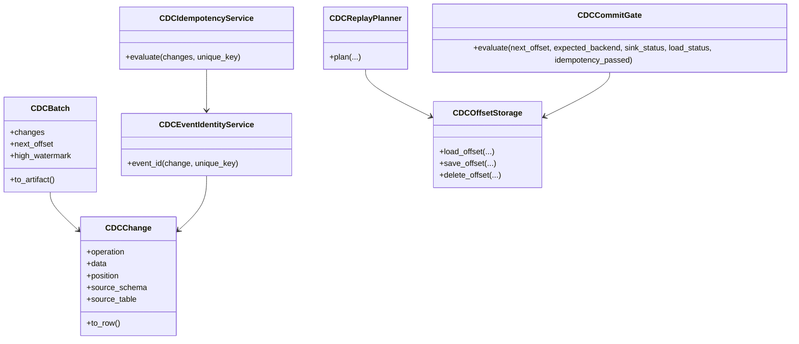
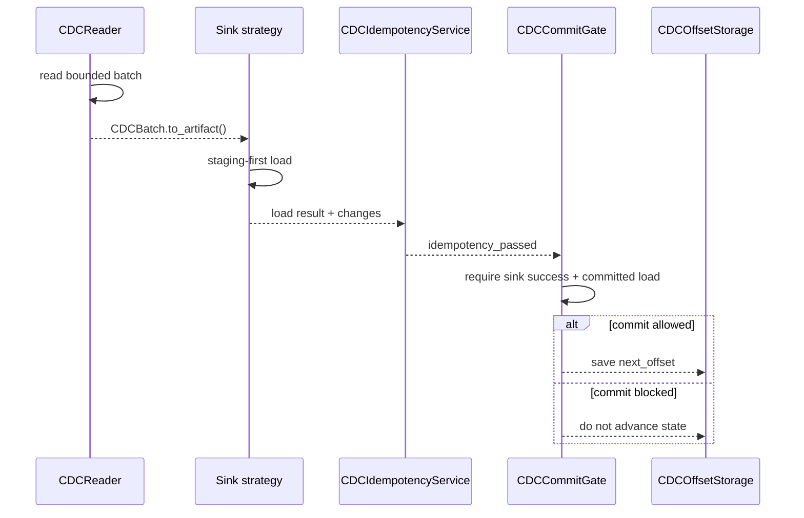

# Developer CDC guide

This page documents the internal CDC architecture contracts. It complements
[CDC Runtime](cdc.md), which is the operator-facing guide.

## Module taxonomy

| Module | Responsibility |
| --- | --- |
| `dpone.runtime.cdc.base` | Common `CDCChange`, `CDCBatch`, operation enum, and reader protocol. |
| `dpone.runtime.cdc.postgres` | PostgreSQL logical decoding readers and parsers. |
| `dpone.runtime.cdc.mssql` | SQL Server CDC and Change Tracking readers. |
| `dpone.runtime.cdc.identity` | Deterministic event identity and batch idempotency checks. |
| `dpone.readiness.cdc_replay` | Replay safety planning and offset commit gate. |
| `dpone.runtime.cdc.replay` | Compatibility re-export for code that imports replay helpers next to CDC readers. |
| `dpone.runtime.state.cdc` | SQL-backed durable offset storage. |
| `dpone.services.cdc_replay` | Application service that adapts CLI/API input into runtime replay plans. |
| `dpone.commands.cdc_plan_cmd` | Setup SQL CLI adapter only. |
| `dpone.commands.cdc_replay_cmd` | Replay-plan CLI adapter only. |

Do not put reader logic, replay policy, or idempotency logic into command
modules. Commands parse args and render service results only. Commands should
depend on `dpone.services.*`, not directly on `dpone.runtime.*`.

## Class map

## Offset advancement contract

State advancement is allowed only after the target commit is durable.

## Event identity rules

`CDCEventIdentityService` must produce deterministic 64-character SHA-256 hex
IDs. The payload includes:

- source schema;
- source table;
- operation;
- position;
- transaction id;
- sequence;
- configured `unique_key` values when available;
- row payload fallback when no key is configured.

Changing this shape is a compatibility-sensitive change because downstream
idempotency ledgers may persist event ids.

## Replay planner rules

`CDCReplayPlanner` is a pure planning service. It must not connect to source or
target systems. Callers provide observed offsets and retention watermarks.

Planner blockers are stable strings because CI and runbooks can depend on them:

| Blocker | When emitted |
| --- | --- |
| `replay.requires_allow_rewind` | `replay_from` is behind stored offset and `allow_rewind=false`. |
| `replay.artifact_required_for_consumed_postgres_slot` | PostgreSQL logical replay rewinds a consumed slot without an artifact URI. |
| `replay.start_before_retention` | `replay_from` is lower than source retention minimum. |
| `replay.invalid_window` | `replay_from` is greater than `replay_to`. |
| `replay.to_after_high_watermark` | `replay_to` is beyond the known high watermark. |
| `offset.backend_mismatch.<field>` | Provided offset belongs to a different backend. |

## Test requirements

Every CDC hardening change needs:

- unit tests for event id determinism;
- duplicate detection tests;
- replay planner safe and blocked cases;
- commit gate allow/deny cases;
- CLI tests for `dpone cdc replay-plan`;
- docs-contract tests for operator and developer documentation.

Live reader tests remain separate under integration markers. Replay and
idempotency services are pure and must stay credential-free.
