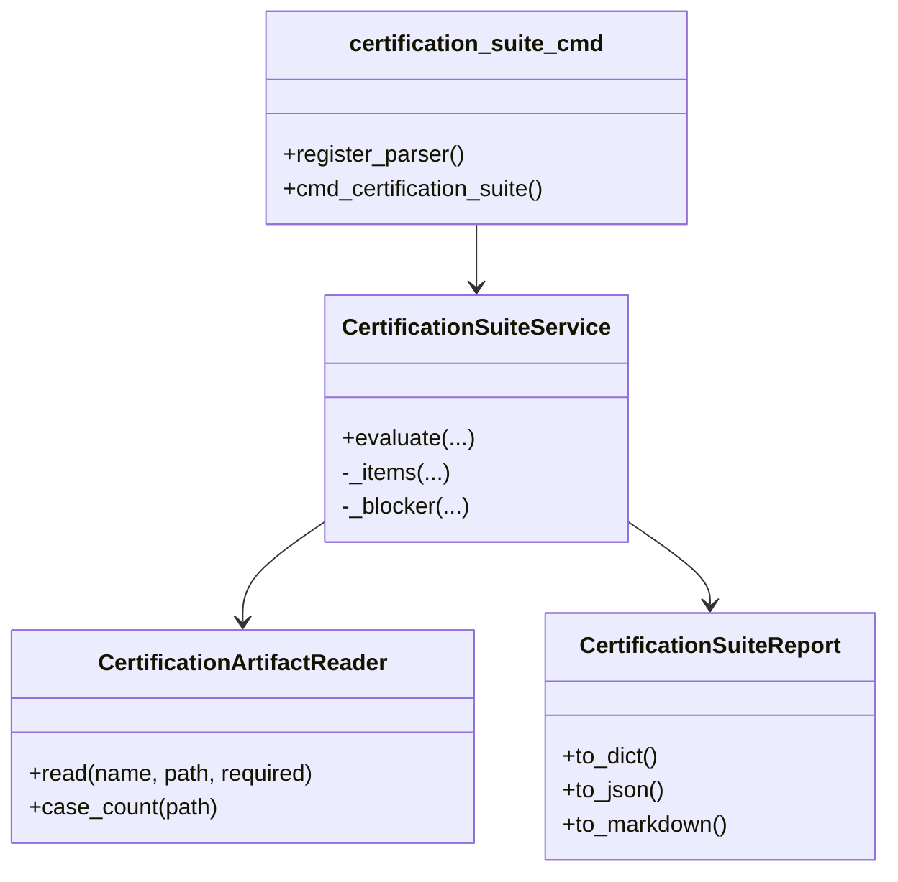

# Developer guide: certification suite

This page explains how to extend certification automation without creating god
modules or hidden CI behavior.

## Architecture boundaries



Rules:

- Keep artifact parsing in `dpone.ops.certification_artifacts`.
- Keep suite decision logic in `dpone.ops.certification_suite`.
- Keep CLI argument parsing in `dpone.commands.certification_suite_cmd`.
- Do not add certification-suite business logic to `ops_cmd.py`.
- New evidence types need service tests, CLI tests, user docs, developer docs,
  and runbook updates in the same change.

## Adding a new evidence type

1. Add a field to `CertificationSuiteService.evaluate(...)`.
2. Add a `CertificationArtifactReader.read(...)` call in `_items`.
3. Add a CLI option in `certification_suite_cmd.py`.
4. Add service tests for green, red, and missing-required behavior.
5. Add CLI tests for argument forwarding and exit code.
6. Update [Certification suite automation](certification-suite.md).
7. Update this developer guide if the extension changes architecture.
8. Run docs and quality gates.

Current first-class evidence types are matrix certification, benchmark baseline,
OpenLineage report, dbt lineage, ops evidence bundle, and strategy certification
bundle.

## Required tests

Every certification-suite change should include:

```bash
uv run pytest tests/test_operations_maturity_services.py -k certification_suite
uv run pytest tests/test_cli_operations_commands.py -k certification_suite
uv run ruff check .
uv run ruff format --check .
uv run mypy --config-file mypy.ini
uv run mkdocs build --strict
uv run dpone docs check-docs
```

For CI/CD workflow changes also run:

```bash
uv run pytest tests/test_oss_release_readiness.py -q
```

## CI/CD expectations

- Default PR CI should stay deterministic and credential-free.
- Full suite automation belongs in manual or scheduled workflows.
- Every run must upload artifacts even when failed.
- Vendor-live suite profiles must document required secrets.
- `mock_contract` and `mock_local` profiles must not need vendor credentials.

## Runbook for red suite tests

1. If a unit test fails, inspect the smallest service first.
2. If a CLI test fails, keep business logic in services and fix adapter wiring.
3. If docs checks fail, update links and nav before merging.
4. If quality metrics regress, split the module before adding behavior.
5. If the suite command becomes too broad, add a focused service rather than expanding the command adapter.
