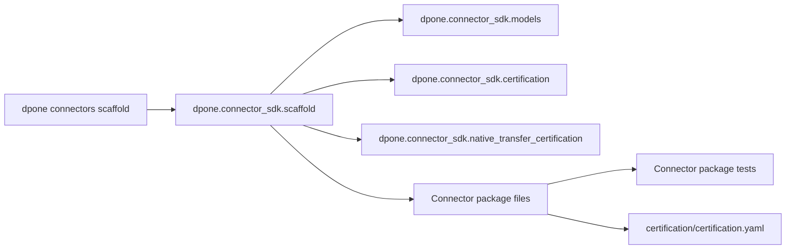

# Developer connector SDK guide

`dpone.connector_sdk` is the framework-owned layer for community connector package generation. It intentionally stays outside runtime connector execution so scaffold behavior can be tested without live services.

## Package map

| Module | Responsibility |
| --- | --- |
| `dpone.connector_sdk.models` | Stable result dataclasses returned by SDK services. |
| `dpone.connector_sdk.certification` | Deterministic certification manifest templates. |
| `dpone.connector_sdk.native_transfer_certification` | Native transfer capability models, matrix scoring, and conformance report service. |
| `dpone.connector_sdk.native_transfer_rendering` | JSON/Markdown renderers for connector capability evidence. |
| `dpone.connector_sdk.scaffold` | File generation for connector packages. |
| `dpone.commands.connectors_cmd` | Thin CLI adapter only. No scaffold business logic belongs here. |

## Design rules

- Keep generated code small and dependency-injected.
- Do not import runtime source/sink implementations in SDK services.
- Do not add connector-specific behavior to the scaffold service.
- Keep certification contracts deterministic so generated files are diff-friendly.
- Extend certification templates through small capability sections, not branching god modules.

## Main service

`ConnectorSdkScaffoldService` owns package generation:

```python
from dpone.connector_sdk.scaffold import ConnectorSdkScaffoldService

result = ConnectorSdkScaffoldService().scaffold(
    name="demo_api",
    root="./community-connectors",
    connector_type="api",
    capabilities=("source", "sink"),
)
print(result.sdk_root)
```

`ConnectorCertificationTemplateService` owns the evidence contract:

```python
from dpone.connector_sdk.certification import ConnectorCertificationTemplateService

template = ConnectorCertificationTemplateService().build(
    connector="demo_api",
    connector_type="api",
    capabilities=("source", "sink"),
    native_capabilities=("stream_export",),
)
```

`ConnectorCapabilityCertificationService` owns native-transfer capability
scoring:

```python
from dpone.connector_sdk.native_transfer_certification import ConnectorCapabilityCertificationService

report = ConnectorCapabilityCertificationService().certify(
    manifest=template,
    profile="static",
    requested_capabilities=("native_transfer.stream",),
)
assert report.status in {"certified", "blocked"}
```

The service is intentionally pure. It accepts a manifest-shaped dictionary and
returns dataclasses; file discovery, stdout, JSON formatting, and exit-code
policy remain in the CLI adapter.

## Test expectations

Every SDK change should update or add tests for:

- generated package structure;
- generated certification manifest content;
- native transfer capability report content;
- CLI JSON output;
- documentation links;
- backward compatibility of existing `dpone connectors scaffold` defaults.

## Architecture notes

The SDK belongs to the control-plane family. It can be imported by commands, tests, and docs tooling. Runtime connectors must not import the SDK because generated files are a developer experience tool, not a pipeline execution dependency.



## Native transfer stream capability

Connectors that participate in adaptive native transfer should expose small
runtime ports instead of pair-specific branches:

| Port | Implement when | Contract |
| --- | --- | --- |
| `StreamingSliceExporter` | The source can emit a bounded byte stream for one logical slice. | Return `ByteStreamArtifact` with columns, format, estimated rows, and cleanup. |
| `StreamingStagingLoader` | The sink can ingest a bounded byte stream into staging. | Consume the stream once, return inserted rows, and keep target finalization unchanged. |
| `TransferTransportResolver` capability input | The connector can explain whether stream is supported. | Return stable reason codes such as `postgres_copy_stdout` or `bcp_queryout_is_file_transport`. |

Rules for new connectors:

1. Keep stream support optional; file/object fallback must remain available.
2. Do not read a full stream into memory to fake stream support.
3. Emit deterministic fallback reasons so `dpone plan` can explain the route.
4. Keep connector adapters thin; orchestration belongs to native transfer
   artifacts and transport resolver modules.
5. Add conformance tests for stream success, forced-stream failure, fallback,
   cleanup, bytes, and checksum evidence.

## Native transfer capability certification

Connector-level certification is role-oriented:

- `stream_export` certifies that a source connector can produce bounded byte
  streams for slices.
- `stream_staging_load` certifies that a sink connector can load bounded byte
  streams into staging.
- `native_transfer.stream` is the public CLI capability grouping used by
  `dpone connectors certify`.

Route-level certification remains responsible for combining one source
capability, one sink capability, and one codec. Do not put source/sink pair
logic into connector SDK modules. Pair-specific decisions belong to route
readiness, native transfer planning, or connector runtime adapters.

## Adding a new capability

1. Add the capability name and validation in `dpone.connector_sdk.scaffold`.
2. Add a dedicated capability section in `ConnectorCertificationTemplateService`.
3. Extend `ConnectorCapabilityCertificationService` with pure scoring rules.
4. Add generated runtime files only when the capability is requested.
5. Add tests that prove source-only packages do not receive sink-only files.
6. Update [Connector SDK](connector-sdk.md) and certification docs.
