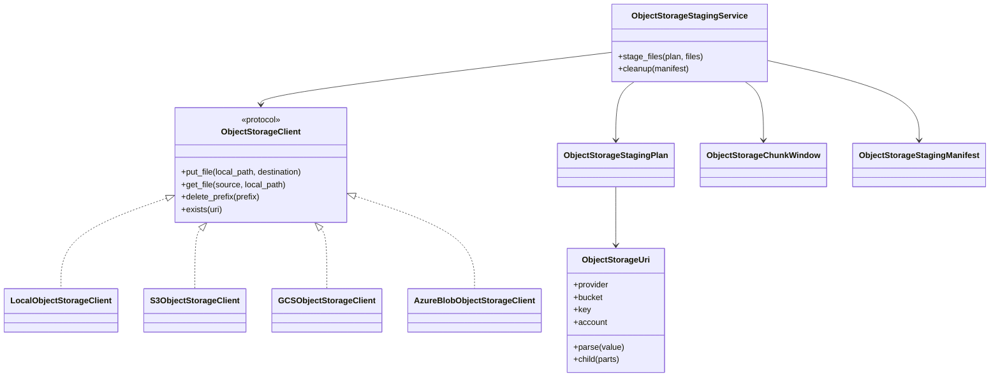

# Developer object storage guide

This guide documents the object storage staging architecture for contributors.

## Design rule

Object storage is a reusable infrastructure boundary. Do not couple sources or sinks directly to `boto3`, `google-cloud-storage`, or `azure-storage-blob`.
Use `ObjectStorageClient` implementations and inject clients for testing.

## Module taxonomy

| Module | Responsibility |
| --- | --- |
| `dpone.storage.models` | URI parsing and uploaded object metadata. |
| `dpone.storage.protocols` | `ObjectStorageClient` protocol. |
| `dpone.storage.local` | Local filesystem emulator for CI and unit tests. |
| `dpone.storage.adapters` | Lazy S3/GCS/Azure SDK adapters. |
| `dpone.staging.object_storage` | Staging plan, manifest, service, and cleanup policy. |

## Class map



## Dependency injection

Cloud adapters must accept an already-created SDK client:

```python
S3ObjectStorageClient(client=fake_or_boto3_client)
GCSObjectStorageClient(client=fake_or_google_storage_client)
AzureBlobObjectStorageClient(service_client=fake_or_blob_service_client)
```

This keeps tests credential-free and prevents optional SDK imports at package
import time.

## Test requirements

Every object storage change must include:

- URI parser tests for all supported URI forms;
- local adapter upload/download/delete tests;
- staging manifest checksum and round-trip tests;
- lazy adapter tests with fake clients;
- docs contract tests for user docs, developer docs, extras, and architecture.

## Future integration hooks

Target loaders should consume `ObjectStorageChunkWindow` for weak-worker
chunked execution or `ObjectStorageStagingManifest` for explicit full-manifest
execution instead of provider-specific dictionaries. Provider-specific native
loaders can then map the window or manifest to:

- BigQuery GCS load jobs;
- ClickHouse S3 table functions;
- MSSQL `BULK INSERT` from object storage when available in the target platform;
- PostgreSQL extension-backed imports where explicitly configured.

Heavy target writes must still use staging-first finalization.
