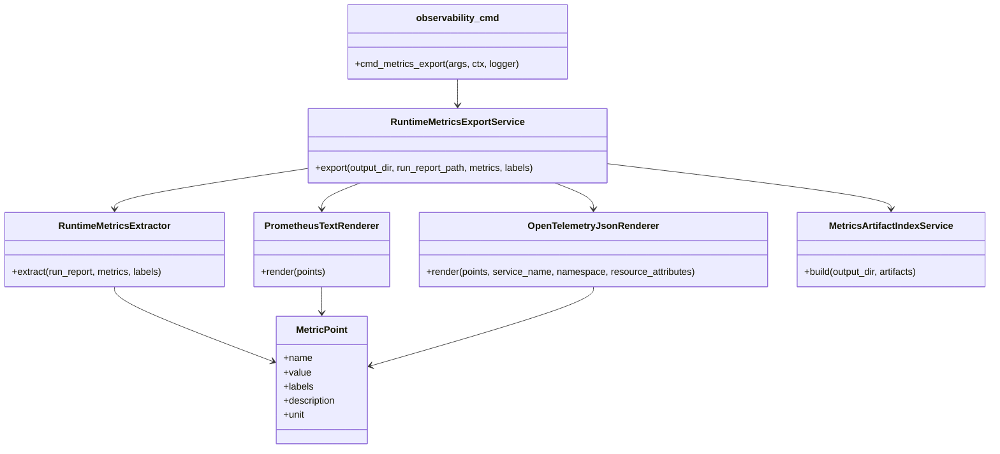

# Developer observability guide

This guide explains how to extend dpone runtime observability without creating
god modules or leaking vendor-specific SDK assumptions into core runtime code.

## Design rule

Commands are thin adapters. Business logic lives in `dpone.observability.*`.
Exporter-specific rendering is isolated behind small classes.



## Package taxonomy

| Module | Responsibility |
| --- | --- |
| `dpone.observability.metrics` | Canonical metric names, labels, units, and extraction from run reports. |
| `dpone.observability.prometheus` | Prometheus text exposition rendering only. |
| `dpone.observability.opentelemetry` | OTLP-like JSON rendering only. |
| `dpone.observability.artifacts` | Per-export checksum index for observability evidence files. |
| `dpone.observability.export` | Use-case service that writes all artifacts and report files. |
| `dpone.commands.observability_cmd` | Argparse adapter and stdout formatting only. |

Do not add observability business logic to `ops_cmd.py`, `run_cmd.py`, or the
CLI registry.

## Adding a new metric source

Add extraction to `RuntimeMetricsExtractor` when the source is a standard dpone
artifact such as:

- `dpone run --format json`;
- run registry report;
- certification suite report;
- benchmark baseline report.

Keep extraction deterministic and tolerant of missing optional fields.

## Adding a new export target

Add a renderer class when the target format has its own rules:

```python
class VendorMetricsRenderer:
    def render(self, points: Iterable[MetricPoint]) -> dict[str, object]:
        ...
```

Then inject it into a dedicated service or adapter. Do not make
`RuntimeMetricsExportService` depend on vendor credentials or network clients.
Network push belongs in a separate optional adapter because local CI must stay
credential-free.

## Test contract

Every observability change must include:

| Test | Purpose |
| --- | --- |
| Service test | Confirms files are written and report status is correct. |
| Renderer test | Confirms escaping, labels, and stable output shape. |
| CLI test | Confirms `dpone observability metrics-export` works through argparse. |
| Artifact index test | Confirms `metrics_index.json` contains checksums for every generated file. |
| Docs contract test | Confirms user and developer docs mention command, artifacts, Prometheus, OpenTelemetry, and runbooks. |

## CI/CD contract

When adding observability to a workflow:

- write artifacts under `test_artifacts/observability/<run>/`;
- upload artifacts with `if: always()`;
- keep `.github/workflows/observability-maturity.yml` green when changing metrics contracts;
- never write raw secrets into labels;
- keep labels low-cardinality enough for Prometheus;
- link the failure path in [Failure runbooks](cicd/runbooks.md) if the workflow can fail on observability evidence.

## Architecture update checklist

Update [Architecture](architecture.md) when one of these changes:

- new observability package or module;
- new supported artifact type;
- new exported telemetry format;
- new artifact index field or checksum semantics;
- new runtime dependency or optional extra;
- new command group or workflow gate.

## User docs checklist

Update [Runtime observability](observability.md) and [CLI reference](cli-reference.md)
when a CLI flag, artifact file name, blocker code, or runbook action changes.
